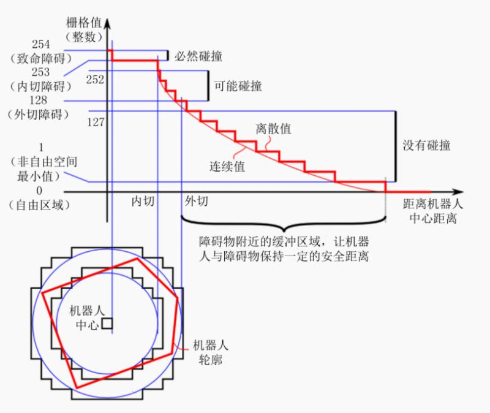

# 1.通信机制
## 1.话题通信
### 1-1. 话题通信基本操作
1. 发布数据
```cpp
 #include "ros/ros.h"
 #include "std_msgs/String.h"//普通文本类型的消息
 #include <sstream>
 int main(int argc, char *argv[]){
     setlocale(LC_ALL, "");
     ros::init(argc, argv, "talker");
     ros::NodeHandle nh;
     ros::Publisher pub = nh.advertise<std_msgs::String>("chatter",10);
     std_msgs::String msg;
     std::string msg_front = "hello";   
     int count = 0;
     ros::Rate r(1);
     while (ros::ok()){
         std::stringstream ss;//使用stringstream拼接字符串和编号
         ss << msg_front << count;
         msg.data = ss.str();
         //发布消息
         pub.publish(msg);
         ROS_INFO("发送的消息:%s",msg.data.c_str());
         r.sleep()//休眠时间 = 1/频率
         count++;
         ros::spinOnce();
     }
     return 0;
 }
```      
2. 接收数据
```cpp
#include "ros/ros.h"
#include "std_msgs/String.h"
#include <sstream>
/*
    訂約方实现：
    1.包含头文件：
        ROS中文本类型-->std_msgs/String.h
    2.初始化节点
    3.创建节点句柄
    4.创建訂閱者对象
    5.處理訂閱數據

*/
void doMsg(const std_msgs::String::ConstPtr &msg){//发布类型为std_msgs下的常量指針的引用
    //通過msg獲取並操作訂库閱到的數據
    ROS_INFO("翠花订阅的数据%s", msg->data.c_str());//因为msg是指针的引用，所以需要用->调用，c_str()指的是c风格的字符串
}

int main(int argc, char *argv[])
{
    //2.初始化ROS节点
    ros::init(argc, argv, "subscriber");
    //3.创建节点句柄
    ros::NodeHandle nh;
    //4.创建订阅者对象
    ros::Subscriber sub = nh.subscribe<std_msgs::String>("fangzi", 10, doMsg);
    //5.处理订阅的消息
    //6.回旋函数
    ros::spin();//循环执行main()
    return 0; 
}
```
---
3. 调整cmake文件
  ```cmake
  add_executable(Hello_pub
    src/Hello_pub.cpp
  )
  add_executable(Hello_sub
    src/Hello_sub.cpp
  )

  target_link_libraries(Hello_pub
    ${catkin_LIBRARIES}
  )
    ${catkin_LIBRARIES}
  )
  ```

4. 话题通信自定义msg调用
流程：
1. 修改xml文件和cmake文件：
   1. 在cmake中:
```cmake 
find_package:message_generation
add_message_file:Person.msg
generate_messages:std_msgs
catkin_package:message_runtime
add_executable(person_talker src/person_talker.cpp)
add_executable(person_listener src/person_listener.cpp)

add_dependencies(person_talker ${PROJECT_NAME}_generate_messages_cpp)
add_dependencies(person_listener ${PROJECT_NAME}_generate_messages_cpp)

target_link_libraries(person_talker
${catkin_LIBRARIES}
)
target_link_libraries(person_listener
${catkin_LIBRARIES}
)

```cmake//**总的来看**
## Declare a C++ executable
## With catkin_make all packages are built within a single CMake context
## The recommended prefix ensures that target names across packages don't collide
add_executable(server src/server.cpp)
add_executable(client src/client.cpp)

## Rename C++ executable without prefix
## The above recommended prefix causes long target names, the following renames the
## target back to the shorter version for ease of user use
## e.g. "rosrun someones_pkg node" instead of "rosrun someones_pkg someones_pkg_node"
# set_target_properties(${PROJECT_NAME}_node PROPERTIES OUTPUT_NAME node PREFIX "")

## Add cmake target dependencies of the executable
## same as for the library above
add_dependencies(server ${PROJECT_NAME}_gencpp)
add_dependencies(client ${PROJECT_NAME}_gencpp)

## Specify libraries to link a library or executable target against
target_link_libraries(server
  ${catkin_LIBRARIES}
)
target_link_libraries(client
  ${catkin_LIBRARIES}
)
```
   2. xml 在xml中：message_generation+message_runtime<--->build_depend+build_export_depend+exec_depend
   ```xml
     <buildtool_depend>catkin</buildtool_depend>
     <build_depend>roscpp</build_depend>
     <build_depend>rospy</build_depend>
     <build_depend>std_msgs</build_depend>
     <build_depend>message_generation</build_depend>
     <build_depend>message_runtime</build_depend>

     <build_export_depend>roscpp</build_export_depend>
     <build_export_depend>rospy</build_export_depend>
     <build_export_depend>std_msgs</build_export_depend>
     <build_export_depend>message_generation</build_export_depend>
     <build_export_depend>message_runtime</build_export_depend>

     <exec_depend>roscpp</exec_depend>
     <exec_depend>rospy</exec_depend>
     <exec_depend>std_msgs</exec_depend>
     <exec_depend>message_runtime</exec_depend>
     <exec_depend>message_generation</exec_depend>

   ```
2. 发布方的实现
```cpp
#include "ros/ros.h"
#include "pub_sub/Person.h"
int main(int argc, char *argv[]){
    setlocale(LC_ALL,"");
    ros::init(argc, argv, "publisher");
    ros::NodeHandle nh;
    ros::Publisher pub = nh.advertise<pub_sub::Person>("house", 20);
    ros::Rate rate(1);
    pub_sub::Person msg;
    int count = 0;
    while (ros::ok()){
        msg.name = "James";
        msg.age = 18;
        msg.height = 1.75;
        pub.publish(msg);
        ROS_INFO("published%d", count);
        rate.sleep();
        count++;
    }
    return 0;
}
```
3. 订阅方的实现
```cpp
 #include "ros/ros.h"
 #include "pub_sub/Person.h"
 void doMsg(const pub_sub::Person::ConstPtr &msg){
     ROS_INFO("发布的消息是：姓名:%s, 身高:%d, 年龄:%d",msg->name.c_str(), msg->age, msg->height);//char类型必须转换成char.c_str()类型才能输出
 }
 int main(int argc, char *argv[]){
     setlocale(LC_ALL,"");//加上这一段可以避免中文乱码
     ros::init(argc, argv, "subscriber");
     ros::NodeHandle nh;
     ros::Subscriber sub = nh.subscribe<pub_sub::Person>("house", 20, doMsg);
     ros::spin();
     return 0;
 }
```
4.总结：
  1. 在pub_sub目录下创建msg/Person.msg
  2. 修改cmake:message_runtime message_generation std_msgadd_dependencies
  3. 修改xml:见上面
  4. catkin_make
  5. 将devep/include/**的头文件路径加到cpp_jason文件中
  6. 编写pub_msg.cpp+sub_msg.cpp
  7. **再次修改cmakelist文件**：Person.msg;add_excutable
  8. catkin_make
  9. rosrun执行


## 2.服务通信
### 2-1. 服务端(**server**)

```cpp
#include "ros/ros.h"
#include "server_client/AddInts.h"
//4.创建服务端
bool doReq(server_client::AddInts::Request &req, server_client::AddInts::Response &resp){//引用传递
    int num1 = req.num1;
    int num2 = req.num2;
    resp.sum = num1 + num2;
    ROS_INFO("您输入的信息是num1+num2=%d",resp.sum);
    return true;
    }
           
int main(int argc, char *argv[]){
    setlocale(LC_ALL,"");
    //1.创建节点
    ros::init(argc, argv, "server");
    //2.创建节点句柄
    ros::NodeHandle nh;
    //3.创建服务端
    ros::ServiceServer server = nh.advertiseService("AddInts", doReq);//此处无模板,此处话题名称相同
    //5.回旋
    ros::spin();
    return 0;
}
```
### 2-2. 客户端
```cpp
#include "ros/ros.h"
#include "server_client/AddInts.h"
int main(int argc, char *argv[]){
    setlocale(LC_ALL, "");
    //优化实现
    if (argc != 3){
        ROS_INFO("提交的参数个数不对！");
        return 1;
    }
    //1.初始化节点
    ros::init(argc, argv, "client");
    //2.创建节点句柄
    ros::NodeHandle nh;
    //3.创建客户端对象
    ros::ServiceClient client = nh.serviceClient<server_client::AddInts>("AddInts");//客户端发布数据，所以需要指定数据类型，服务端接收数据，所以无须指定数据类型
    //client = ServiceClient,serviceClient; server = ServiceServer,advertiseService
    //4.创建请求逻辑
    //4-1.创建请求
    server_client::AddInts req;
    req.request.num1 = atoi(argv[1]);//argv[1]是字符串类型的，要变成整型值，用atoi(argv[1]),
    // atoi = ascii to integer,是将字符串转为整形的函数
    req.request.num2 = atoi(argv[2]);
    //4-2.处理响应
    //调用判断服务器状态的函数
    client.waitForExistence();//如果服务器没启动，就挂起，不启动
    bool resp = client.call(req);//访问服务器把ai对象提交了,客户端接收返回的结果，是否是true
    if (resp){//若是客户端先于服务端启动，resp = flase
        ROS_INFO("响应成功！");
        ROS_INFO("响应结果 = %d", req.response.sum);//结果被封装在ai.response.sum里面
    }
    else{
        ROS_INFO("处理失败...");
    }
    return 0;
}
```
### 2-3.配置cmake和xml,以及srv文件
1. cmake文件
* find_package->message_generation
* add_service_files->AddInts.srv
* generate_messages->std_msgs
* catkin_package->message_runtime
---
* add_executable(client src/client.cpp)
*add_dependencies(server ${PROJECT_NAME}_gencpp)
*target_link_libraries(client
  ${catkin_LIBRARIES}
)
1. xml
```xml
  <buildtool_depend>catkin</buildtool_depend>
  <build_depend>roscpp</build_depend>
  <build_depend>rospy</build_depend>
  <build_depend>std_msgs</build_depend>
  <build_depend>message_generation</build_depend>
  <build_depend>message_runtime</build_depend>

  <build_export_depend>roscpp</build_export_depend>
  <build_export_depend>rospy</build_export_depend>
  <build_export_depend>std_msgs</build_export_depend>
  <build_export_depend>message_generation</build_export_depend>
  <build_export_depend>message_runtime</build_export_depend>

  <exec_depend>roscpp</exec_depend>
  <exec_depend>rospy</exec_depend>
  <exec_depend>std_msgs</exec_depend>
  <exec_depend>message_runtime</exec_depend>
  <exec_depend>message_generation</exec_depend>
```
3. srv文件
```srv
int32 num1//客户端
int32 num2
---
int32 sum//服务端
```
4. 步骤总结：
   1. client
      1. 创建节点
      2. 创建节点句柄
      3. 创建客户端:ros::ServiceClient client = nh.serviceClient<service_client::AddInts>("house")
      4. 组织请求数据
         1. 创建请求数据:service_client::AddInts req
         2. 返回请求:bool resp = client.call(req) 
    2. server
       1. 创建节点
       2. 创建节点句柄
       3. 创建服务端：ros::ServiceServer server = nh.advertise("house",doReq)
       4. 创建回调函数:bool doReq(service_client::AddInts::Request &req,service_client::AddInts::Request &resp){}
       5. 回旋：ros::spin()


## 3.参数服务器
### 1.参数的增
1. 方法
   1. ros::NodeHandle nh -> nh.setParam("keys","values")
   2. ros::param::set("keys","values");
2. 调试：rosparam get /keys = xxxx
3. 案例：
   1. 设置参数
```cpp
#include "ros/ros.h"
#include <iostream>
#include <vector>
#include <string>
#include <map>
using namespace std;
int main(int argc, char** argv){
    ros::init(argc, argv, "param");
    ros::NodeHandle nh;
    //******增***********//
    //方法1:nh
    nh.setParam("radius", 1);
    //方法2:ros::param
    ros::param::set("length", 2);
    //*******改*******//
    //方法1&&2同上直接覆盖就行
    //********查*******//
    
}
```
   2. 获取
```cpp
#include "ros/ros.h"
#include <iostream>
#include <vector>
#include <string>
#include <map>
using namespace std;
int main(int argc, char** argv){
    setlocale(LC_ALL,"");
    ros::init(argc, argv, "param");
    ros::NodeHandle nh;
    //nh.param***************************//
    //********查*******//
    //方法1.param,查询到的话就返回正确值，没查询到的话就返回默认值
    int radius = nh.param("radius", 1);//查询键为"radius"的函数值，若是没有的，返回1
    ROS_INFO("radius = %d", radius);
    //方法2：getParam，查询到的话就返回true,将正确值赋给radius1,否则就是false
    int radius1 = 0;
    bool res = nh.getParam("radius", radius1);
    if (res){
        ROS_INFO("getParam获取的半径是:%d", radius1);
    }
    else{
        ROS_INFO("被查询的变量不存在");
    }
    //方法3：getParamCached()用法同getParam()
    bool res1 = nh.getParamCached("radius", radius1);
    if (res1){
        ROS_INFO("getParamCached获取的半径是:%d", radius1);
    }
    else{
        ROS_INFO("被查询的变量不存在");
    }
    //4.getParamNames
    vector<string> names;
    nh.getParamNames(names);//获取每一个键的名称
    names.push_back("a");
    names.push_back("b");
    ///方法1:for--auto
    for (auto &&name : names){
        ROS_INFO("遍历的元素是%s",name.c_str());
    }
    ///方法2：for--iter,容易乱码
    vector<string>::iterator iter = names.begin();
    for (;iter != names.end(); iter++){
        cout << "键:" << *iter << endl;
    }
    //5.hasParam，若是存在的话,返回true,否则flase
    bool flag1 = nh.hasParam("radius");//"radius"的值是int，所以必须返回bool或者int
    bool flag2 = nh.hasParam("radiusxxx");
    ROS_INFO("radius存在吗？%d", flag1);
    ROS_INFO("radius存在吗？%d", flag2);
    //6.searchParam
    string key;//由于"radius"的键是字符串，所以必须将返回值定为string
    nh.searchParam("radius", key);//查询的是radius,用key保存,若存在的话，将radius赋值给key,否则保持默认值
    ROS_INFO("搜索结果:%s", key.c_str());//若输出是string的话，则要将其转化为c_str(),否则会乱码
 
    //ros::param******************************//ros::param和nh.param模式完全一样
    //ros::param::param
    int radius_param = ros::param::param("radius", 11);
    ROS_INFO("radius_param = %d", radius_param);
    vector<string> names_param;
    ros::param::getParamNames(names_param);//得到所有参数的键后将其放入vector容器names_param中,然后就可以直接遍历
    ///方法1：for--auto
    for (auto &&name : names_param){
        ROS_INFO("键:%s", name.c_str());
    }
    ///方法2：for--iter
    vector<string>::iterator iter1 = names_param.begin();
    for (iter1; iter1 != names_param.end(); iter1++){
        cout << "键:" << *iter1 << endl;//这里用ROS_INFO势必会乱码，所以如果用for-iter输出，直接用cout;用for-auto输出，用ROS_INFO和cout都可
    }
    //ros::param::
    return 0;
}
```
   3. 删除
```cpp
#include "ros/ros.h"
#include <iostream>
#include <vector>
#include <string>
#include <map>
using namespace std;
/*
ros::NodeHandle---->delParam
ros::param----del()
*/

int main(int argc, char** argv){
    setlocale(LC_ALL,"");
    ros::init(argc, argv, "param");
    ros::NodeHandle nh;
    //******NodeHandle*******//
    bool flag1 = nh.deleteParam("radius");//delete返回一个bool类型，若删除成功，则返回true
    if (flag1){
        ROS_INFO("deleteParam删除成功");
    }
    else{
        ROS_INFO("delelteParam删除失败");
    }
    //*******ros::param**********//
    bool flag2 = ros::param::del("radius");
    if (flag2){
        ROS_INFO("rosparam删除成功");
    }
    else{
        ROS_INFO("rosparam删除失败");
    }
    
}
```
   4. 总结
      1. 若是需要修改功能包的名称，修改cmakelist文件的project和xml的<name>param_service</name> 和 <description>The param_service package</description>这三个地方的功能包文件名
      2. 多个功能包下的执行文件不能重名
      3. 例如demo01/src/test01 ,demo02/src/test01,这样是不允许的，必须要将2个test01变成不同的值，否则会编译失败
      4. 功能
         1. nh.setParam(key,value):
         2. res = nh.param(key,flag):若能得到key的value，则res = value,否则res = flag, 
         3. res = nh.getParam(key, flag):若能得到key的值，则res = true,否则为false
         4. res = nh.getParamCached(key, flag):同上
         5. nh.getParamNames(vec):得到所有参数的名字，并赋值给vec
         6. res = nh.hasParam(key,flag)：若有key,则flag = key(value)
         7. res = nh.searchParam(key, flag):若有key的话，则res = true


1. for(auto:)语句
```cpp
#include <iostream>
#include <vector>
using namespace std;
void printVec(vector<int> &vec){
    for (int i = 0; i < vec.size(); i++){
        cout << vec[i] << endl;
    }
}
int main(){
    vector<int> vec = {1, 2, 3, 4};
//*****************第一种，不会改变vec中的值，相当于是值传递
    for (auto i : vec){
        i += 1;
    }
    printVec(vec);
//****************第二种,改变vec中的值，相当于是引用传递
    for (auto &i : vec){
        i += 1;
    }
    printVec(vec);
//****************第三种，会改变vec中的值，相当于是引用传递
    for (auto &&i : vec){
        i += 1;
    }
    printVec(vec);
}
```
* 注意：
  * 1.for(auto &i : vec)相当于python中的for (x in range),&i = x,vec = range,而auto是修饰符号
  * 2.i为值传递，&i ,&&i相当于是引用传递
  * 3.修改完ros.cpp后，再catkin_make后再执行rosrun xxxx ros.cpp，此时修改才能生效
  * 4.vector<int> vec, ros::string<int, int>(xxxx)利用到了模板和变量声明 

## 3.常用命令
    rosnode : 操作节点
    rostopic : 操作话题#话题对应消息
    rosmsg : 操作msg消息
    rosservice : 操作服务#服务对应SRV
    rossrv : 操作srv消息
    rosparam : 操作参数#最后一个param
    1. 2+2+2：node,prama;topic,msg;service,srv
    2. list,info,find,pub,echo,show,get,set为常用命令,可以直接用TAB补全命令
    3. 几个重要常用的：rostopic echo pkg 用来输出位置
    4. rostopic pub;rosservice call;rosparam get/set;

### 3-1.rosnode

rosnode 是用于获取节点信息的命令

1. rosnode ping    测试到节点的连接状态
2. rosnode list    列出活动节点
3. rosnode info    打印节点信息
4. rosnode machine    列出指定设备上节点
5. rosnode kill    杀死某个节点
6. rosnode cleanup    清除不可连接的节点#就是清除已经死亡的但是rosmaster还不知道的节点

    rosnode ping

    测试到节点的连接状态

    rosnode list

    列出活动节点

    rosnode info

    打印节点信息

    rosnode machine

    列出指定设备上的节点

    rosnode kill

    杀死某个节点

    rosnode cleanup

    清除无用节点，启动乌龟节点，然后 ctrl + c 关闭，该节点并没被彻底清除，可以使用 cleanup 清除节点

##可以通过rosrun info -h来查看相关帮助信息,
##也可通过rosnode -h来查看信息

### 3-2.rostopic
1. 命令  详细说明
   1. rostopic list   显示活动的话题目录
   2. rostopic echo [话题名称]   实时显示指定话题的消息内容
   3. rostopic find [类型名称]   示使用指定类型的消息的名称
   4. rostopic type [话题名称]   显示指定话题的消息类型 
   5. rostopic bw [话题名称]      显示指定话题的消息带宽（bandwidth） 
   6. rostopic hz [话题名称] 显示指定话题的消息数据发布周期
   7. rostopic info [话题名称]   显示指定话题的信息 
   8. rostopic pub [话题名称] [消息类型] [参数]    用指定的话题名称发布消息 

2. 详解：
   1. rostopic list：列出活动话题
　　通过将“-v”选项添加到rostopic list命令，可以分开发布话题和订阅话题，并将每个话题的消息类型一起显示。rostopic list -v

   2. rostopic echo [话题名称]：实时显示指定话题的消息内容
以下示例实时显示组成/turtle/pose话题的x、y、theta、linear_velocity和angular_velocity的数据。    

rostopic echo /turtle/pose

   3. rostopic find [类型名称]：显示使用指定类型的消息的话题    
rostopic find turtlesim/Pose

   4. rostopic type [话题名称]：显示指定话题的消息类型
rostopic type /turtle/pose

   5. rostopic bw [话题名称]：显示指定话题的消息数据带宽（bandwidth）
　　在以下示例中，用于/turtle/pose话题的数据带宽平均为每秒.25 KB。
rostopic bw /turtle/pose

   6. rostopic hz [话题名称]：显示指定话题的消息数据发布周期
　　在以下示例中，用户可以检查/turtle/pose数据的发布周期。从结果可以看出，该消息以大约62.5Hz（0.06秒= 6毫秒）的频率被发布。
rostopic hz /turtle/pose

   7. rostopic info [话题名称]：显示指定话题的信息
　　在以下示例中，用户可以看到/turtle/pose话题使用turtlesim/Pose消息类型，发布到/turtlesim节点，并且没有实际订阅的话题。
    
rostopic info /turtle/pose

   8. rostopic pub [话题名称] [消息类型] [参数]：使用指定的话题名称发布消息
以下是使用/turtle/cmd_vel话题名称发布类型为geometry_msgs/Twist的消息的示例。

rostopic pub /turtle/cmd_vel geometry_msgs/Twist -- ‘[2.0, 0.0, 0.0]’ ‘[0.0, 0.0, .8]’
rostopic pub -r 10 
　　每个选项的描述如下。

    -只发布一次消息（实际上只运行一次，但会像以前的结果一样运行3秒）。
    /turtle1/cmd_vel 指定的话题名称
    geometry_msgs/Twist 要发布的消息类型名称
    -- ‘[2.0, 0.0, 0.0]’ ‘[0.0, 0.0, 1.8]’ 在x轴坐标上以每秒2.0 m的速度移动，以z轴为中心，每秒旋转1.8rad


### 3-3.rosservice

rosservice包含用于列出和查询ROSServices的rosservice命令行工具。

调用部分服务时，如果对相关工作空间没有配置 path，需要进入工作空间调用 source ./devel/setup.bash

rosservice args 打印服务参数
rosservice call    使用提供的参数调用服务
rosservice find    按照服务类型查找服务
rosservice info    打印有关服务的信息
rosservice list    列出所有活动的服务
rosservice type    打印服务类型
rosservice uri    打印服务的 ROSRPC uri

1. rosservice list

列出所有活动的 service

2. rosservice args

打印服务参数

rosservice args /spawn
x y theta name

3. rosservice call

调用服务

为小乌龟的案例生成一只新的乌龟

rosservice call /spawn "x: 1.0
y: 2.0
theta: 0.0
name: 'xxx'"
name: "xxx"

//生成一只叫 xxx 的乌龟

4. rosservice find

根据消息类型获取话题

5. rosservice info

获取服务话题详情

6. rosservice type

获取消息类型

7. rosservice uri

获取服务器 uri


### 3-3.rosmsg

rosmsg是用于显示有关 ROS消息类型的 信息的命令行工具。

rosmsg 演示

rosmsg show    显示消息描述
rosmsg info    显示消息信息#show和info是一样的
rosmsg list    列出所有消息
rosmsg md5    显示 md5 加密后的消息
rosmsg package    显示某个功能包下的所有消息
rosmsg packages    列出包含消息的功能包

1. rosmsg list

会列出当前 ROS 中的所有 msg

2. rosmsg packages

列出包含消息的所有包

3. rosmsg package

列出某个包下的所有msg/rosmsg package 包名 
rosmsg package turtlesim

4. rosmsg show

显示消息描述

//rosmsg show 消息名称
rosmsg show turtlesim/Pose#前一个是包名，后一个是Pose.msg
结果:
float32 x
float32 y
float32 theta
float32 linear_velocity
float32 angular_velocity

5. rosmsg info

作用与 rosmsg show 一样

### 3-5.rossrv

rossrv是用于显示有关ROS服务类型的信息的命令行工具，与 rosmsg 使用语法高度雷同。

rossrv show    显示服务消息详情
rossrv info    显示服务消息相关信息
rossrv list    列出所有服务信息
rossrv md5    显示 md5 加密后的服务消息
rossrv package    显示某个包下所有服务消息
rossrv packages    显示包含服务消息的所有包

1. rossrv list

会列出当前 ROS 中的所有 srv 消息

2. rossrv packages

列出包含服务消息的所有包

3. rossrv package

列出某个包下的所有msg

//rossrv package 包名 
rossrv package turtlesim

4. rossrv show

显示消息描述

rossrv show 消息名称
rossrv show turtlesim/Spawn
结果:
float32 x
float32 y
float32 theta
string name
string name

rossrv info

作用与 rossrv show 一致

rossrv md5

对 service 数据使用 md5 校验(加密)

### 3-6.rosparam
1. rosparam list
列出所有参数

2. rosparam list

3. rosparam set
设置参数

rosparam set name huluwa

//再次调用 rosparam list 结果
/name  

4. rosparam get

获取参数

rosparam get name

//结果
huluwa

5. rosparam delete

删除参数

rosparam delete name

6. rosparam load(先准备 yaml 文件)

从外部文件加载参数

rosparam load xxx.yaml

7. rosparam dump

将参数写出到外部文件

rosparam dump yyy.yaml

## 4.通信机制实际操作
### 4-1.话题发布
1. 话题与消息获取
准备: 先启动键盘控制乌龟运动案例。

   1. 话题获取
获取话题:/turtle1/cmd_vel
通过计算图查看话题，启动计算图:

rqt_graph
或者通过 rostopic 列出话题:

rostopic list
   2. 消息获取
获取消息类型:geometry_msgs/Twist

rostopic type /turtle1/cmd_vel
获取消息格式:

rosmsg info geometry_msgs/Twist
响应结果:

geometry_msgs/Vector3 linear
  float64 x
  float64 y
  float64 z

geometry_msgs/Vector3 angular
  float64 x
  float64 y
  float64 z
linear(线速度) 下的xyz分别对应在x、y和z方向上的速度(单位是 m/s)；

angular(角速度)下的xyz分别对应x轴上的翻滚、y轴上俯仰和z轴上偏航的速度(单位是rad/s)。

3. 实现发布节点
创建功能包需要依赖的功能包: roscpp rospy std_msgs geometry_msgs

实现方案A: C++
```cpp
/*
    编写 ROS 节点，控制小乌龟画圆

    准备工作:
        1.获取topic(已知: /turtle1/cmd_vel)
        2.获取消息类型(已知: geometry_msgs/Twist)
        3.运行前，注意先启动 turtlesim_node 节点

    实现流程:
        1.包含头文件
        2.初始化 ROS 节点
        3.创建发布者对象
        4.循环发布运动控制消息
*/

#include "ros/ros.h"
#include "geometry_msgs/Twist.h"

int main(int argc, char *argv[])
{
    setlocale(LC_ALL,"");
    // 2.初始化 ROS 节点
    ros::init(argc,argv,"control");
    ros::NodeHandle nh;
    // 3.创建发布者对象
    ros::Publisher pub = nh.advertise<geometry_msgs::Twist>("/turtle1/cmd_vel",1000);
    // 4.循环发布运动控制消息
    //4-1.组织消息
    geometry_msgs::Twist msg;
    msg.linear.x = 1.0;
    msg.linear.y = 0.0;
    msg.linear.z = 0.0;

    msg.angular.x = 0.0;
    msg.angular.y = 0.0;
    msg.angular.z = 2.0;

    //4-2.设置发送频率
    ros::Rate r(10);
    //4-3.循环发送
    while (ros::ok())
    {
        pub.publish(msg);
        r.sleep();
        ros::spinOnce();
    }


    return 0;
}
```

### 4-2.话题订阅
实现分析:

首先，需要启动乌龟显示以及运动控制节点并控制乌龟运动。
要通过ROS命令，来获取乌龟位姿发布的话题以及消息。
编写订阅节点，订阅并打印乌龟的位姿。
实现流程:

通过ros命令获取话题与消息信息。
编码实现位姿获取节点。
启动 roscore、turtlesim_node 、控制节点以及位姿订阅节点，控制乌龟运动并输出乌龟的位姿。
1. 话题与消息获取

获取话题:/turtle1/pose

rostopic list
获取消息类型:turtlesim/Pose

rostopic type  /turtle1/pose
获取消息格式:

rosmsg info turtlesim/Pose
响应结果:

​float32 x
float32 y
float32 theta
float32 linear_velocity
float32 angular_velocity

2.实现订阅节点
创建功能包需要依赖的功能包: roscpp rospy std_msgs turtlesim
```cpp
/*  
    订阅小乌龟的位姿: 时时获取小乌龟在窗体中的坐标并打印
    准备工作:
        1.获取话题名称 /turtle1/pose
        2.获取消息类型 turtlesim/Pose
        3.运行前启动 turtlesim_node 与 turtle_teleop_key 节点

    实现流程:
        1.包含头文件
        2.初始化 ROS 节点
        3.创建 ROS 句柄
        4.创建订阅者对象
        5.回调函数处理订阅的数据
        6.spin
*/

#include "ros/ros.h"
#include "turtlesim/Pose.h"

void doPose(const turtlesim::Pose::ConstPtr& p){
    ROS_INFO("乌龟位姿信息:x=%.2f,y=%.2f,theta=%.2f,lv=%.2f,av=%.2f",
        p->x,p->y,p->theta,p->linear_velocity,p->angular_velocity
    );
}

int main(int argc, char *argv[])
{
    setlocale(LC_ALL,"");
    // 2.初始化 ROS 节点
    ros::init(argc,argv,"sub_pose");
    // 3.创建 ROS 句柄
    ros::NodeHandle nh;
    // 4.创建订阅者对象
    ros::Subscriber sub = nh.subscribe<turtlesim::Pose>("/turtle1/pose",1000,doPose);
    // 5.回调函数处理订阅的数据
    // 6.spin
    ros::spin();
    return 0;
}
```
2.服务客户端实现
创建功能包需要依赖的功能包: roscpp rospy std_msgs turtlesim

实现方案A:C++
```cpp
/*
    生成一只小乌龟
    准备工作:
        1.服务话题 /spawn
        2.服务消息类型 turtlesim/Spawn
        3.运行前先启动 turtlesim_node 节点

    实现流程:
        1.包含头文件
          需要包含 turtlesim 包下资源，注意在 package.xml 配置
        2.初始化 ros 节点
        3.创建 ros 句柄
        4.创建 service 客户端
        5.等待服务启动
        6.发送请求
        7.处理响应

*/

#include "ros/ros.h"
#include "turtlesim/Spawn.h"

int main(int argc, char *argv[])
{
    setlocale(LC_ALL,"");
    // 2.初始化 ros 节点
    ros::init(argc,argv,"set_turtle");
    // 3.创建 ros 句柄
    ros::NodeHandle nh;
    // 4.创建 service 客户端
    ros::ServiceClient client = nh.serviceClient<turtlesim::Spawn>("/spawn");
    // 5.等待服务启动
    // client.waitForExistence();
    ros::service::waitForService("/spawn");
    // 6.发送请求
    turtlesim::Spawn spawn;
    spawn.request.x = 1.0;
    spawn.request.y = 1.0;
    spawn.request.theta = 1.57;
    spawn.request.name = "my_turtle";
    bool flag = client.call(spawn);//在已经生成一个新乌龟的情况下就不能生成旧乌龟
    // 7.处理响应结果
    if (flag)
    {
        ROS_INFO("新的乌龟生成,名字:%s",spawn.response.name.c_str());
    } else {
        ROS_INFO("乌龟生成失败！！！");
    }


    return 0;
}
```

### 4-3.服务调用
实现分析:

首先，需要启动乌龟显示节点。
要通过ROS命令，来获取乌龟生成服务的服务名称以及服务消息类型。
编写服务请求节点，生成新的乌龟。
实现流程:

通过ros命令获取服务与服务消息信息。
编码实现服务请求节点。
启动 roscore、turtlesim_node 、乌龟生成节点，生成新的乌龟。
1. 服务名称与服务消息获取
获取话题:/spawn

rosservice list
获取消息类型:turtlesim/Spawn

rosservice type /spawn
获取消息格式:

rossrv info turtlesim/Spawn
响应结果:

float32 x
float32 y
float32 theta
string name
**-------**
string name

2. 订阅节点(见上面)

### 4-4.参数设置
实现分析:

首先，需要启动乌龟显示节点。
要通过ROS命令，来获取参数服务器中设置背景色的参数。
编写参数设置节点，修改参数服务器中的参数值。
实现流程:

通过ros命令获取参数。
编码实现服参数设置节点。
启动 roscore、turtlesim_node 与参数设置节点，查看运行结果。

1. 参数名获取
获取参数列表:

rosparam list
响应结果:

/turtlesim/background_b
/turtlesim/background_g
/turtlesim/background_r

2. 参数修改
实现方案A:C++
```cpp
/*
    注意命名空间的使用。

*/
#include "ros/ros.h"
int main(int argc, char *argv[])
{
    ros::init(argc,argv,"haha");

    ros::NodeHandle nh("turtlesim");
    //ros::NodeHandle nh;

    // ros::param::set("/turtlesim/background_r",0);
    // ros::param::set("/turtlesim/background_g",0);
    // ros::param::set("/turtlesim/background_b",0);

    nh.setParam("background_r",0);
    nh.setParam("background_g",0);
    nh.setParam("background_b",0);


    return 0;
}
```
### 4-5.总结
在上面的例子中
1. publisher和subcriber在这个案例中分别对应publisher和乌龟的节点
2. 因为没有自定义srv和msg文件，所以在cmake和xml中都无须配置依赖文件，cmake添加add_executabel和target_link_libraries()就行，xml维持不变
3. 关于方向问题：
   1. ROS采用右手系：x轴:前方;y轴:左方；z轴：上方
   2. 角速度方向也采用右手系

# 2.通信机制进阶
## 1.初始化
```cpp
#include "ros/ros.h"
#include "std_msgs/String.h"
#include  <sstream>
int main(int argc, char *argv[]){
    setlocale(LC_ALL, ""); // 用于显示中文字符
    ros::init(argc, argv, "publisher", ros::init_options::AnonymousName);//这个选项可以让节点重复启动多次
    ros::NodeHandle nh;
    ros::Publisher pub = nh.advertise<std_msgs::String>("house", 20);
    std_msgs::String msg;
    ros::Rate rate(1);
    while (ros::ok()){
        msg.data = "hello";
        pub.publish(msg);       
        rate.sleep();
        ROS_INFO("发送的数据是:%s", msg.data);
    }
    return 0;
}
```
## 2.latch:
```cpp
ros::Publisher pub = nh.advertise<std_msgs::String>("house", 20, true);//如果为 true,该话题发布的最后一条消息将被保存，并且后期当有订阅者连接时会将该消息发送给订阅者
```
## 3.回旋函数
1. spinOnce()：处理一轮回调
2. spin():进入循环处理回调
3. 比较：ros::spin():
   1. 进入了循环执行回调函数，ros::spinOnce()只执行一次回调函数，无循环
   2. 在ros::spin()后的语句不会执行，而ros::spinOnce()后的语句可以执行
## 4.时间相关函数
1. 总结：
   1. 当前时间&持续时间
      1. ros::Time now = ros::Time::now();
      2. now.current_event
      3. ros::Time sometime(10000, 100000000)  
      4. ros::Duration du(10)
      5. 时间运算:ros::Duration d1 = d + now; ros::Duration d3 = d1 + d2;now 和now之间不能运算
   2. 定时器：
   ```cpp
   void doTime(const ros::TimerEvent &event){
       ROS_INFO()
   } 
   ros::Timer timer = nh.createTimer(du, doTime, flase);//du为循环执行的时间间隔
   ros::spin();//有回调函数，有spin()
   ```
   1. 获取时间
      1. now.toSec(); now的时间，类型为float
      2. now.sec; now的时间，类型为为int
      3. ros::Time::now().sec  ; ros::Duration d(1).sec  ;  ros::Time::now().current_real.sec
   2. 循环
   ```cpp
   ros::Rate r(1);
   while (ros::ok()){
       ROS_INFO("-------")
       r.sleep();
   }


2. 案例
**将所有的时间封装到回调函数中**
```cpp
#include "ros/ros.h"
#include "std_msgs/String.h"
using namespace std;
void doSomeThing(const ros::TimerEvent &event) {
    ROS_INFO("------------");
    //*****时刻**********//
    //当前时间
    ros::Time right_now = ros::Time::now();
    ///获取当前时间距离1970.1.1:00:00:00的秒数
    ROS_INFO("now is: %.2f", right_now.toSec());
    ROS_INFO("now is: %.2d", right_now.sec);//sec为时刻，没有(),且为整型
    
    ros::Time someTime(100, 100000000);//参数1：秒，参数2：纳秒(1e9 ns = 1s)
    ROS_INFO("时刻:%.2f", someTime.toSec());
    ros::Time someTime2(100.3);
    ROS_INFO("时刻:%.2f", someTime2.toSec());//100.3
    //*********持续时间*********//
    ROS_INFO("当前时刻:%.2f",ros::Time::now().toSec());
    ros::Duration du(10);//持续10s,参数是double类型的，以秒为单位
    du.sleep();//按照持续时间休眠
    ROS_INFO("持续时间:%.2f", du.toSec());//将持续时间换算成秒
    ROS_INFO("当前时刻:%.2f", ros::Time::now().toSec());//将持续时间换算成秒
    //**********持续时间与时刻运算********//
    ros::Time now = ros::Time::now();
    ros::Duration du1(10);
    ros::Duration du2(20);
    ROS_INFO("当前时刻:%.2f", now.toSec());
    //1.time和duration运算
    ros::Time after_now = now + du1;
    ros::Time before_now = now - du1;
    ROS_INFO("当前时刻之后:%.2f", after_now.toSec());
    ROS_INFO("当前时刻之前:%.2f", before_now.toSec());
    //2. duration 之间的运算
    ros::Duration du3 = du1 + du2;//时间类型
    ros::Duration du4 = du1 - du2;
    ROS_INFO("du3 = %.2f", du3.toSec());
    ROS_INFO("du4 = %.2f", du4.toSec());
    //3.time和time之间不可以运算,例如ros::Time nn = now + before_now;
    
    //******设置运行频率*********//
    // ros::Rate r(1);
    // while(true){
    //     ROS_INFO("--------code--------------");
    //     r.sleep();    
    // }
    
    //********定时器*********//

    ROS_INFO("event = %s", to_string(event.current_real.toSec()).c_str());
}
int main(int argc, char *argv[]){
    setlocale(LC_ALL,"");
    ros::init(argc, argv, "time");
    ros::NodeHandle nh;
    ros::Timer timer = nh.createTimer(ros::Duration(1), doSomeThing, false);//创建一个计时器，把ros::Duration(0.5)放入这个doSomeThing里面
    ros::spin();//对于subscriber而言，必须有publisher的持续输出才能有spin循环
    
}
/*注意事项：
1.不能在主函数中定义函数
2.若无using namespace std,那么必须要std::to_string()
3.event.current_real:当前时间
  event = ros::Time::now() = ros::Duration du(1)
4.to_string的用法：将整数i转换为字符串表示形式
*/
```
## 5.其他函数
1. 节点状态判断
ros::shutdown(); 在满足条件的情况下关闭节点
```cpp
#include "ros/ros.h"
#include "std_msgs/String.h"
#include  <sstream>
int main(int argc, char *argv[]){
    setlocale(LC_ALL, ""); // 用于显示中文字符
    ros::init(argc, argv, "publisher", ros::init_options::AnonymousName);
    ros::NodeHandle nh;
    ros::Publisher pub = nh.advertise<std_msgs::String>("house", 10, false);
    std_msgs::String msg;
    ros::Rate rate(1);
    int count = 0;
    ros::Duration(3).sleep();
    while (ros::ok()){//由于有了while，所以就不需要spin(),但是要spinOnce(k)
        if (count >= 10){
            ros::shutdown();
        }
        msg.data = "hello";
        pub.publish(msg);       
        rate.sleep();
        ROS_INFO("发送的数据是:%s->%d", msg.data.c_str(), count);
        ros::spinOnce();
        ROS_INFO("一轮回调执行完毕....");//spinOnce()后的语句会被执行
        count++;
    }
    return 0;
}
```
2. 日志相关api
```cpp
ROS_DEBUG("hello,DEBUG"); //不会输出
ROS_INFO("hello,INFO"); //默认白色字体
ROS_WARN("Hello,WARN"); //默认黄色字体
ROS_ERROR("hello,ERROR");//默认红色字体
ROS_FATAL("hello,FATAL");//默认红色字体
```
## 6. ROS中的头文件和源文件
### 1. 自定义头文件调用
   1. 注意：为了后续包含头文件时不抛出异常，要配置c_pp_properties.json中的includepath：
"/home/用户/工作空间/src/功能包/include/**"

```cpp
#ifndef _HELLO_H
#define _HELLO_H

namespace hello_ns{

class HelloPub {

public:
    void run();
};

}
#endif
```
2. 可执行文件
```cpp
#include "ros/ros.h"
#include "test_head/hello.h"

namespace hello_ns {

void HelloPub::run(){
    ROS_INFO("自定义头文件的使用....");
}

}

int main(int argc, char *argv[])
{
    setlocale(LC_ALL,"");
    ros::init(argc,argv,"test_head_node");
    hello_ns::HelloPub helloPub;
    helloPub.run();
    return 0;
}
```
3. 配置文件
include_directories(
include ${catkin_INCLUDE_DIRS})
)
4. 可执行配置文件
add_executable(hello src/hello.cpp)
add_dependencies(hello ${${PROJECT_NAME}_EXPORTED_TARGETS} ${catkin_EXPORTED_TARGETS})
target_link_libraries(hello ${catkin_LIBRARIES})

5. 总结：
   1. 关于命名空间的使用
```cpp
./include/mymath.h
namespace fun_ns{
    class MyFunc{
        void test();
    };
}
./src/mymath.cpp
namespace fun_ns{
    void MyFunc::test(){
        cout << "test" << endl;
    }
}
int main(){
fun_ns::MyFunc myfunc
myfunc.test()
}
```
2. 关于头文件路径：
**如果文件地址已经被包括进cpp_properties中了，就直接写文件名就行，否则写相对绝对路径**

### 2.自定义源文件调用
1. plumbing_head/
   1. include
      1. inlclude/plumbing_head
         1. mymath.h
    2. src
        1. main.cpp
        2. mymath.cpp
    3. CMakeLists.txt 
2. 文件：
**inlclude/plumbing_head/mymath.h**
```cpp
#ifndef MYMATH_H
#define MYMATH_H
class Circle{
    public:
        Circle(int r);
        int showArea();
        int r;
};
#endif 
```

**src/mymath.cpp**
```cpp
#include "../include/plumbing_head/mymath.h"
Circle::Circle(int r){
    this->r = r;
}
int Circle::showArea(){
    return 3.14*r*r; 
}
```
**src/main.cpp**
```cpp
#include "../include/plumbing_head/mymath.h"//相对路径导入
#include "ros/ros.h"
#include <iostream>
using namespace std;
int main(int argc, char **argv){
    ros::init(argc, argv, "head");
    Circle c(199);
    ROS_INFO("the area is %d", c.showArea());
}
```
**CMakeLists.txt**
1. 头文件和源文件相关配置
```cmake
#将include文件点加进来
include_directories(
include
  ${catkin_INCLUDE_DIRS}
)
#${catkin_INCLUDE_DIRS}是include下的文件路径

## 声明C++库，将mymath.h和mymath.cpp链接到库上
add_library(mymath
  include/plumbing_head/mymath.h
  src/mymath.cpp
)

add_dependencies(mymath ${${PROJECT_NAME}_EXPORTED_TARGETS} ${catkin_EXPORTED_TARGETS})

target_link_libraries(mymath
  ${catkin_LIBRARIES}
)#生成mymath的库

2. 可执行文件
```cmake
add_executable(main src/main.cpp)

add_dependencies(main ${${PROJECT_NAME}_EXPORTED_TARGETS} ${catkin_EXPORTED_TARGETS})

#此处需要添加之前设置的 mymath 库
target_link_libraries(main
  mymath
  ${catkin_LIBRARIES}
)
#将main链接到mymath库上
```
3. 总结：
   1. 4 + 3 = 7
      1. 4表示头文件和源文件的配置，包括:
         1. include_direcotories
         2. add_library(mymath include/plumbing_head/mymath.h src/mymath.cpp)
         3. add_denpendencies(mymath xxxxx) 
         4. target_link_libraries(mymath xxxx)
      2. 3表示可执行文件配置，包括：
         1. add_exexcutable(main src/main.cpp)
         2. add_dependencies(main ${xxx})  
         3. target_link_libraries(main mymath xxxxx)
   2. 都具备的是： add_denpendencies + target_link_libraries(),区别是前者多了include_directories()，后者多了add_executable()

# 3.ROS运行管理

## 1.元功能包
1. 概念：为了避免逐一安装所需功能包的问题，ROS中有一种方式将所需的功能包打包成1个功能包，
这个功能包就是元功能包，但安装某个功能模块的时候就直接调打包后的功能包，这个包就是元功能包
2. 作用：方便用户的安装，我们只需要这一个包就可以把其他相关的软件包组织到一起安装了。
3. 实现：
   1. 新建一个功能包
   2. 修改xml文件
```xml
 <exec_depend>被集成的功能包</exec_depend>
 .....
 <export>
   <metapackage />
 </export>
```
3. 修改cmakeist.txt
```cmake
cmake_minimum_required(VERSION 3.0.2)
project(demo)
find_package(catkin REQUIRED)
catkin_metapackage()
```
## 2. ROS节点管理launch文件

### 2-1.launch标签：
 1.属性:deprecated = "弃用声明"(通知用户当前launch文件已经弃用)
 2.子级标签：所有其它标签都是launch的子级
 3.启动界面：
```xml
 <launch>
    <node pkg="turtlesim" type="turtlesim_node"     name="myTurtle" output="screen" />
    <node pkg="turtlesim" type="turtle_teleop_key"  name="myTurtleContro" output="screen" />
</launch>
```
3. 注意:launch文件中不要加逗号
### 2-2.launch文件标签之node
1. 定义：<node>标签用于指定 ROS 节点，是最常见的标签，需要注意的是: 
roslaunch 命令不能保证按照 node 的声明顺序来启动节点(节点的启动是多进程的)
2. 属性
   1. pkg="包名":节点所属的包
   2. type="nodeType":节点类型(与之相同名称的可执行文件)
   3. name="nodeName":节点名称(在 ROS 网络拓扑中节点的名称)
   4. args="xxx xxx xxx" (可选):将参数传递给节点#利用args来传参数
   5. machine="机器名":在指定机器上启动节点#在不同的设备上启动节点
   6. respawn="true | false" (可选):如果节点退出，是否自动重启#自动启动
   7. respawn_delay=" N" (可选):如果 respawn 为 true, 那么延迟 N 秒后启动节点
   8. required="true | false" (可选):该节点是否必须，如果为 true,那么如果该节点退出，将杀死整个 roslaunch
   9.  ns="xxx" (可选):在指定命名空间 xxx 中启动节点
   10. clear_params="true | false" (可选):在启动前，删除节点的私有空间的所有参数
   11. output="log | screen" (可选):日志发送目标，可以设置为 log 日志文件，或 screen 屏幕,默认是 log(要屏幕可见)
  
3. 例子：
```xml  
<launch deprecated = "此文件已经过时，不建议使用">
<!-- <node pkg = "turtlesim" type = "turtlesim_node" name = "my_turtle" output = "screen" respawn = "true" /> -->
<!-- 节点退出后重新启动，respawn和required是对立的，不能同时写在同一个节点里面-->
<!-- ns = "hello"为设置加节点的命名空间,在后期可以避免重名问题,此案例输出的rosnode的名称是：/hello/my_turtle--> 

   <node pkg = "turtlesim" type = "turtlesim_node" name = "my_turtle" output = "screen" required = "true" ns = "hello" />
<!-- 节点退出后关闭整个系统 -->
   <node pkg = "turtlesim" type = "turtle_teleop_key" name = "my_key" output = "screen"/>
<!--不要在里面加逗号-->

</launch>
```
4. 子级标签
   1. env 环境变量设置
   2. remap 重映射节点名称
   3. rosparam 参数设置
   4. param 参数设置

### 2-3.launch文件标签之include
1. 作用:include标签用于将另一个 xml 格式的 launch 文件导入到当前文件
2. 属性
   1. file="$(find 包名)/xxx/xxx.launch"要包含的文件路径
   2. ns="xxx" (可选),在指定命名空间导入文件
节点1：#导入节点2，然后直接执行此launch文件就可以启动新节点
```xml
<launch>
<include file = "$(find model01)/launch/test.launch" />
节点2：
<launch deprecated = "此文件已经过时，不建议使用">
    <!-- <node pkg = "turtlesim" type = "turtlesim_node" name = "my_turtle" output = "screen" respawn = "true" /> -->
<!-- 节点退出后重新启动，respawn和required是对立的，不能同时写在同一个节点里面-->
<!-- ns = "hello"为设置加节点的命名空间,在后期可以避免重名问题,此案例输出的rosnode的名称是：/hello/my_turtle--> 

    <node pkg = "turtlesim" type = "turtlesim_node" name = "my_turtle" output = "screen" required = "true" ns = "hello" />
<!-- 节点退出后关闭整个系统 -->
    <node pkg = "turtlesim" type = "turtle_teleop_key" name = "my_key" output = "screen"/>
<!--不要在里面加逗号-->
</launch>
```

3. 子级标签
   1. env 环境变量设置
   2. arg 将参数传递给被包含的文件

### 2-4.launch文件标签之remap
1. 案例
```xml
<launch deprecated = "此文件已经过时，不建议使用">#deprecate：强烈反对
<node pkg = "turtlesim" type = "turtlesim_node" name = "my_turtle" output = "screen" respawn = "true" /> 
# 节点退出后重新启动，respawn和required是对立的，不能同时写在同一个节点里面
# ns = "hello"为设置加节点的命名空间,在后期可以避免重名问题,此案例输出的rosnode的名称是：/hello/my_turtle 

  <node pkg = "turtlesim" type = "turtlesim_node" name = "my_turtle" output = "screen">#此处格式要注意
      <remap from = "/turtle1/cmd_vel" to = "/cmd_vel" />
       # 将/turtle1/cmd_vel改成/cmd_vel，即从原话题到新话题的转化，从而实现从turtle_teleop_key到teleop_twist_keyboard teleop_twist_keyboard.py的通信
  </node>
  # 节点退出后关闭整个系统
  <node pkg = "turtlesim" type = "turtle_teleop_key" name = "my_key" output = "screen" />
  #不要在里面加逗号
</launch>
```
2. 步骤：
```xml
   1. < node = turtlesim type = "turlesim_node" name = "my_node" output = "screen" respawn = "true" />
   2. < node = turtlesim type = "turtle_teleop_key" name = "my_key" output = "screen" respawn = "true" >
      < remap from = "/turtle/cmd_vel" to = "/cmd_vel" />
    </ node >
   3. 启动roslaunch xxx xxx.launch ---------> rosrun turtle teleop_twist_keyboard teleop_twist_keyboard.py
```
### 2-5.launch文件标签之param
<param>标签主要用于在参数服务器上设置参数，参数源可以在标签中通过 value 指定，也可以通过外部文件加载，在<node>标签中时，相当于私有命名空间。

1. 属性
  name="命名空间/参数名"
  参数名称，可以包含命名空间

  value="xxx" (可选)
  定义参数值，如果此处省略，必须指定外部文件作为参数源

  type="str | int | double | bool | yaml" (可选)
  指定参数类型，如果未指定，roslaunch 会尝试确定参数类型，规则如下:
      .如果包含 '.' 的数字解析未浮点型，否则为整型
      ."true" 和 "false" 是 bool 值(不区分大小写)
      .其他是字符串

2. 子级标签
3. 例子:
```xml
  <launch>
      <param name = "param_A" type = "int" value = "100" />
      <node pkg = "turtlesim" type = "turlesim_node" name = "myturtle" output = "screen">
          <remap from = "/turtle1/cmd_vel" to = "/cmd_vel"/>
          <!-- 格式2:在node下的node -->
          <param name = "param_B" type = "double" value = "100" />
      </node>
      <!-- 键盘控制节点 -->
      <node pkg = "turtlesim" type = "turtle_teleop_key" name = "my_key" output = "screen"/> 
      
  </launch>
```
### 2-6.rosparam
步骤
1. launch文件
```xml
<launch>
  <node pkg = "turtlesim" type = "turtle_teleop_key" name = "my_key" output = "screen"/>
  <node pkg = "turtlesim" type = "turtlesim_node" name = "my_node" output = "screen">
   <!-- 当下面有子节点的时候就不要结尾不能有/,/要写在结尾node的句首,无子结点就要有/ -->
      <remap from = "/turtle1/cmd_vel" to = "cmd_vel"/>#remap节点替换要基于turtlesim_node
      <param name = "param_A" type = "int" value = "100"/>
      <param name = "param_B" type = "double" value = "100.1"/>
      <rosparam command = "load" file = "$(find model01)/launch/params.yaml"/>
      <rosparam command = "dump" file = "$(find model01)/launch/params_out.yaml"/>
  </node>
</launch>
```
1. 配置yaml文件   /3.roslaunch该文件,直接会导出节点
  bg_R: 100
  bg_G: 100
  bg_B: 100

### 2-7.ros文件标签之group
1. 属性
  ns="名称空间" (可选)
  clear_params="true | false" (可选)
  启动前，是否删除组名称空间的所有参数(慎用....此功能危险)
2. 子级标签
3. 例子:
```xml
<launch>
  <group ns = "first">
      <node pkg = "turtlesim" type = "turtlesim_node" name = "my_turtle" output = "screen" />
      <node pkg = "turtlesim" type = "turtle_teleop_key" name = "my_key" output = "screen" />
  </group>
  <group ns = "second">
      <node pkg = "turtlesim" type = "turtlesim_node" name = "my_turtle" output = "screen" />
      <node pkg = "turtlesim" type = "turtle_teleop_key" name = "my_key" output = "screen" />
  </group>
</launch>
```
4. 结果：将会产生2个乌龟GUI,且不会重名

### 2-8.arg标签
1. 属性
  name="参数名称"
  default="默认值" (可选)
  value="数值" (可选)
  不可以与 default 并存
  doc="描述"
2. 子级标签
3. 示例
   1. xml文件实现
```xml
<launch>
  <arg name = "car_length" default = "1034"/>
  <param name = "a" value = "$(arg car_length)" />
  <param name = "b" value = "$(arg car_length)" />
  <param name = "c" value = "$(arg car_length)" />
</launch>
```
2. 命令行实现：roslaunch model01 arg.launch car_length:=100

3. launch文件传参语法实现,hello.launch
   1. step1
  <launch>
      <arg name="xxx" />
      <param name="param" value="$(arg xxx)" />
  </launch>
   2. 命令行调用launch传参
roslaunch hello.launch xxx:=值
   3. 命名规则：按照大驼峰命名法，例如：Ros_Learning-------Pub_Sub_demo01.cpp

### 2-9.总结
1. <launch>
   1. <group>:共享一个命名空间或者封闭的元素组
      1. <group ns = "namespace" clear_params = "true | false"/>
      2. 参数
         1. ns(optional):分配该组节点到制定的命名空间
         2. clear_params(optional):启动前删除命名空间的所有参数
      3. 功能:共享一个命名空间或者映射的封闭元素组，将设置应用到一组节点中，*类似launch，可以有任何其他标签*
   2. <node>启动节点 
      1. 格式：<node pkg = "package_name" type = "executable_name" name = "node_name"/>
      2. 参数
         1. pkg,type,name分别是节点的功能包，节点可执行文件名，节点运行时的名称
         2. output(optional):stdout/stderr发送的位置，有screen和log 2个选项
         3. args(optional):传递到节点的参数
         4. respawn(optional):如果节点退出，是否自动重启
         5. respawn_delay(optinal):和respawn组合使用，如果重启，在重启之前等待的时间
         6. required(optional):如果节点杀死，是否杀死全部的roslaunch
         7. ns(optional):指定在哪个命名空间下开启节点
         8. clear_params(optional):启动前，删除节点私有命名空间的所有参数
         9. machine(optional):启动节点的指定机器
         10. cwd(optional):节点的工作目录的位置
   3. <param>:设置ros系统中运行的参数，储存在参数服务器中
      1. 格式:<param name = "output_frame" value = "odom"/>
      2. name:参数名称；value:参数值
   4. <rosparam>:加载参数文件中的多个参数
      1. 格式:<rosparam name = "param.yaml" command = "load" ns = "params"/>
   5. <arg>:launch文件内部的局部参数
      1. 格式:<arg name = "arg-name" default = "arg-value"/>
      2. name:参数名称；default:参数值
      3. 调用
```xml
<include file = "included.launch">
    <arg name = "hoge" value = "fuga"/>
</include>
<!-- 调用方法 -->
<node pkg = "package-name" type = "executable" name = "node-name" args = "$(arg arg-name)$"/>
<!-- $(xxx)$：将xxx的变量解引用出来 -->
<param name = "output_frame" value = "$(arg arg-name)$"/>
```
   6. <remap>:声明同一个名称的映射
      1. <remap from = "turtlebot/cmd_vel" to = "/cmd_vel"> (from原命名，to映射之后的命名)
   7. <machine>
   8. <include>:类似于include
      1. 格式: $ <include file = "$(dirname)/others.launch"/>$
   9.  <env>
   10. <test>
       1. 格式:<test test-name= “test_1_2" pkg="mypkg" type ="test_1_2.py" args ="testl test2" />
       2. test-name:测试节点名称；无respawn,output, machine属性 ，**其余部分和<node>类似**
</launch>

## 3.ROS工作空间覆盖
### 3-1.问题：
   特定工作空间的功能包不能重名，但是自定义工作空间的功能包与内置的功能包与内置的功能包
   可以重名或者不同的自定义的工作空间中也可以出现重名的功能包，那么调用该名称的功能包时候，
   会调用哪一个功能包？比如说：自定义工作空间A内存在功能包turtlesim,自定义工作空间B内也存在功能包turtlesim，
   系统内置空间内也存在turtlesim ,那么调用turtlesim时，会调用哪一个工作空间中的呢？
### 3-2.实现
1. 工作空间A中创建turtlsim包，工作空间B中创建turtlsim包
2. 添加source /home/kim/A/devel/setup.zsh
3. source /home/kim/B/devel/setup.zsh在.zshrc文件中
   1. 因为已经添加了source在zshrc中，所以打开一次终端相当于source 了一次，故就不用source,但是当修改zshrc文件后，必须要source才能继续下一次roscd
   2. 只当被添加到zshrc中的文件的工作空间才能roscd,**roscd turtlesim**:会直接进入到工作空间B中
4. >原因分析:ros会先解析.zshrc文件，并生成ROS_PACKAGE_PATH路径，该变量按照.bashrc中配置设置工作空间优先级，
  在设置时需要遵循一定的原则：ROS_PACKAGE_PATH中值，和.zshrc的配置顺序相反---->后配置的优先级更高
  所以roscd先去B文件而不去A文件
### 3-3.安全隐患
比如当前工作空间B优先级更高，意味着当程序调用 turtlesim 时，
不会调用工作空间A也不会调用系统内置的 turtlesim，如果工作空间A在实现时有其他功能包依赖于自身的 turtlesim，而按照ROS工作空间覆盖的涉及原则，
那么实际执行时将会调用工作空间B的turtlesim，从而导致执行异常，出现安全隐患。

### 3-4.BUG
在.zshrc中source了多个工作空间，可能出现的情况，在ROS_PACKAGE_PATH中只包括2个工作空间，可以删除自定义工作空间中的devep和build文件
重新catkin_make,然后载入.zshrc文件，问题解决

## 4.ROS节点名称重名
### 4-1.现象
rospy.init_node("yyy")来定义节点名称，在ROS中，是不允许出现重名节点的，如果出现会发生混淆，所以当启动的时候，重名节点会被直接关闭。
命名空间就是为名称添加前缀，名称重映射是为名称起别名。这两种策略都可以解决节点重名问题，两种策略的实现途径有多种:
### 4-2.解决方法：
法1：命名空间：添加前缀 |法2：名称重映射:为名称起别名
实现途径：rosrun 命令  launch 文件  编码实现

### 4-3.设置命名空间与重映射：
1. rosrun设置命名空间：
rosrun 包名 节点名 __ns:=/xxx | rosrun turtlesim turtlesim_node __ns:=/xxx
rosrun 包名 节点名 __ns:=/yyy | rosrun turtlesim turtlesim_node __ns:=/yyy
.运行结果：rosnode list : /xxx/turtlesim; /yyy/turtlesim

2. rosrun名称重映射：
为节点起别名：rosrun 包名 节点名 __name:="新名称"
rosrun turtlesim  turtlesim_node __name:=t1 
rosrun turtlesim  turtlesim_node __name:=t2
rosnode list : /t1 ; /t2

3. rosrun命名空间同时名称重映射叠加：
语法：rosrun 包名 节点名 __ns:=新名称 __name:=新名称
例子：rosrun turtlesim turtlesim_node __ns:=/a  __name:=/b;
结果：rosnode list:/a/b#__ns为包名，__name为子包名

问题：[rosrun] Couldn't find executable named turtlesim_node below /home/kim/ROS_Space/test_ws/src/turtlesim
这是因为在.zshrc中，已经添加了source A/devel/setup.zsh ，所以会默认进入到A的工作空间中，

4. 通过launch文件设置命名空间与重映射
```xml
<launch>
   <node pkg = "turtlesim" type = "turtlesim_node" name = "t1" ns = "hello" />
</launch>
```

5. 脚本的方式实现命名空间和重映射：
```cpp
#include "ros/ros.h"
#include "std_msgs/String.h"
int main(int argc, char* argv[]){
    ros::init(argc, argv, "hello");
    ros::NodeHandle nh;
    // //核心：设置不同的类型的话题
    //1. 全局----话题名称要以/开头(也可以设置自己的命名空间），这种情况下和节点(命名空间以及名称)没有关系
    ros::Publisher pub1 = nh.advertise<std_msgs::String>("/x1/chatter", 1000);
    //2. 相对----话题名称要以非/开头
    ros::Publisher pub2 = nh.advertise<std_msgs::String>("x2/chatter", 1000);
    ros::Publisher pub3 = nh.advertise<std_msgs::String>("chatter", 1000);
    //3. 私有-----需要创建特定NodeHandle
    ros::NodeHandle nh2("abc");//a作为顶层话题名称
    ros::Publisher pub4 = nh2.advertise<std_msgs::String>("x3/chatter", 1000);//x3,x4以abc作为顶层话题
    ros::Publisher pub5 = nh2.advertise<std_msgs::String>("x4/chatter", 1000);
    ros::Publisher pub6 = nh2.advertise<std_msgs::String>("/x5/chatter", 1000);//采用全局话题名称的形式
    while (ros::ok()){

    }
    return 0;
//注意：必须要在程序执行的时候才能看到node和topic
}
/*最终结果
/abc/x3/chatter
/abc/x4/chatter
/chatter
/x1/chatter
/x2/chatter
/x5/chatter
*/
```
# 4.ROS常用组件
## 4-1.TF坐标变换
### 1. 坐标msg消息

**一般来说，在头文件文件中的消息，创建在脚本中时，1. /<===>::， 2. 各单词首字母变小写为大写**
1. geometry_msgs/TransformStamped
输入:rosmsg info geometry_msgs/TransfromStamped

std_msgs/Header header                     #头信息
  uint32 seq                                #|-- 序列号
  time stamp                                #|-- 时间戳
  string frame_id                            #|-- 坐标 ID
string child_frame_id                    #子坐标系的 id
geometry_msgs/Transform transform        #坐标信息
  geometry_msgs/Vector3 translation        #偏移量
    float64 x                                #|-- X 方向的偏移量
    float64 y                                #|-- Y 方向的偏移量
    float64 z                                #|-- Z 方向上的偏移量
  geometry_msgs/Quaternion rotation        #四元数
    float64 x                                
    float64 y                                
    float64 z                                
    float64 w

2. geometry_msgs/PointStamped
   输入：rosmsg info geometry_msgs/PointStamped

std_msgs/Header header                    #头
  uint32 seq                                #|-- 序号
  time stamp                                #|-- 时间戳
  string frame_id                            #|-- 所属坐标系的 id
geometry_msgs/Point point                #点坐标
  float64 x                                    #|-- x y z 坐标
  float64 y
  float64 z
### 2. 静态坐标变换
**静态坐标变换是指2个坐标系的相对位置是固定的**
实现：
1. 创建功能包：tf2, tf2_ros, tf2_geometry_msgs, roscpp, std_msgs, geometry_msgs(**3+3**)
2. 发布方：
```cpp
#include "ros/ros.h"
#include "tf2_ros/static_transform_broadcaster.h"//发布者头文件(创建：tf2_ros::StaticTransformBroadcaster pub，小写->大写)
#include "geometry_msgs/TransformStamped.h"//变换戳头文件(创建消息对象头文件: geometry_msgs::TransformStamped tfs， 大写->大写)
#include "tf2/LinearMath/Quaternion.h"//4元数头文件（tf2::Quaternion qtn, 大写->大写),除了四元数都是tf2之外，都是tf2_ros
//一般来说，在头文件文件中的消息，创建在脚本中时，1. /<===>::， 2. 各单词首字母变小写为大写
//1.包括头文件
int main(int argc, char **argv){
    //2.初始化节点和创建节点句柄
    ros::init(argc, argv, "static_pub");
    ros::NodeHandle nh;
    //3. 创建发布对象
    tf2_ros::StaticTransformBroadcaster pub;//静态变换广播器
    //4. 组织被发布的数据
    /*
    4-1.创建消息对象-变换戳
    4-2.创建header:3+3
    4-3.创建qtn:2+4(qtn,setRPY,x, y, z, w)
    */
    geometry_msgs::TransformStamped tfs;//变换戳
    tfs.header.stamp = ros::Time::now();
    tfs.header.frame_id = "base_link";//相对坐标系关系中被参考的那个
    tfs.child_frame_id = "laser";//相对坐标系
    tfs.transform.translation.x = 0.2;//laser相对于base_link的x偏移量
    tfs.transform.translation.y = 0.2;//laser相对于base_link的y偏移量
    tfs.transform.translation.z = 0.5;//laser相对于base_link的z偏移量
    //需要根据欧来角来转换4元数
    tf2::Quaternion qtn;//创建四元数对象
    //向四元数中设置欧拉角，这个对象可以将欧拉角转换为四元数
    qtn.setRPY(0, 0, 0);//roll,pitch,yaw:翻滚，俯仰，偏航
    //里面的单位是弧度
    tfs.transform.rotation.x = qtn.getX(); 
    tfs.transform.rotation.y = qtn.getY(); 
    tfs.transform.rotation.z = qtn.getZ(); 
    tfs.transform.rotation.w = qtn.getW(); 
    //5. 发布数据
    pub.sendTransform(tfs);
    //6. spin()
    ros::spin();//进入循环
    return 0;
}
```
3. 订阅方
```cpp
#include "ros/ros.h"
#include "tf2_ros/transform_listener.h"//发布者头文件(tf2_ros::TransformListener listener(buffer), 小写->大写)
#include "tf2_ros/buffer.h"//(创建缓存对象，tf2_ros::Buffer buffer, 小写->大写)
#include "geometry_msgs/PointStamped.h"//点戳头文件(创建坐标点对象，geometry_msgs::PointStamped ps, 大写->大写)
#include "tf2_geometry_msgs/tf2_geometry_msgs.h"//ps->ps_out需要用到的消息对象(ps_out = buffer.transform(ps))
//transform->buffer, PointStamped->tf2_geometry_msgs
//1.创建头文件
int main(int argc,char **argv){
    setlocale(LC_ALL, "");
    //2.初始化节点和创建节点句柄
    ros::init(argc, argv, "static_sub");
    ros::NodeHandle nh;
    //3.创建订阅对象
    //3-1.创建一个buffer缓存(订阅对象可以将订阅的数据存入buffer)
    tf2_ros::Buffer buffer;
    //3-2.创建订阅对象
    tf2_ros::TransformListener listener(buffer);
    //4. 生成坐标点数据(组织订阅数据)
    //4-1.创建消息类型ps
    //4-2.创建header(2+3)
    geometry_msgs::PointStamped ps;
    ps.header.stamp = ros::Time::now();//时间戳
    ps.header.frame_id = "laser";//以laser作为坐标点,而非base_link
    ps.point.x = 2.0;//x,y,z是离laser的障碍物的坐标
    ps.point.y = 3.0;
    ps.point.z = 5.0;
    // //添加休眠
    // ros::Duration(2).sleep();//在转换之前先休眠2s，以留出时间订阅到数据
    //5.转换坐标点
    //5-1.创建转换坐标点ps_out while循环及其频率
    //5-2.转换坐标:ps_out = buffer.transform(ps, "base_link")
    //5-3.输出转换后坐标点:ROS_INFO(ps_out.point.x,....)
    ros::Rate r(10);
    while (ros::ok()){
        try{
            //核心代码----将ps转换为相对于base_link的坐标点
            geometry_msgs::PointStamped ps_out;
            ps_out = buffer.transform(ps, "base_link");//初始点，参考坐标系(非世界坐标系)
            ROS_INFO("转换后的坐标值:(%.2f, %.2f, %.2f),参考的坐标系：%s",
                                ps_out.point.x,
                                ps_out.point.y,
                                ps_out.point.z,
                                ps_out.header.frame_id.c_str());//此处必须要加c_str(),否则会报错
        
        }
        catch(const std::exception &e){
            ROS_INFO("程序异常");
        }
        //6. 输出
        r.sleep();
        ros::spinOnce();
    }
}


```
4. 总结：
   1. 参数1：ps为被转化的坐标点，参数2："base_link"转换的目标坐标系
   2. 返回值：buffer.transform()的返回值为转化后的结果
   3. 
      1. PS1:转换时必须包含头文件#include "tf2_geometry_msgs/tf2_geometry_msgs.h"
      2. PS2：报错： what():  "base_link" passed to lookupTransform argument target_frame does not exist.(base_link不存在) 
      3. 原因：已经开始转换了，但是发布的坐标系关系还没有，所以就会报错，所以在转换前休眠2s
      4. 解决：
方案1：ros::Duration(2).sleep();
方案2：使用try语句
   4. ps_out 随着RPY和ps的不同而不同 
   5. 补充：rosrun tf2_ros static_transform_publisher x偏移量 y偏移量 z偏移量 z偏航角度 y俯仰角度 x翻滚角度 父级坐标系 子级坐标系
   6. RPY对应ZYX轴的旋转，setRPY(x, y, z)这三个角度依次左乘，为绕x, y, z轴的转角，但最终结果是Z*Y*X， ；在**static_transform_publisher**中，前三个角度分别是绕ZYX的转角，要区分

### 3. 动态坐标变换
1. 发布方
```cpp
#include "ros/ros.h"
#include "turtlesim/Pose.h"//turtlesim头文件
#include "tf2_ros/transform_broadcaster.h"//动态坐标变换头文件(tf2_ros::TransformBroadcaster pub),如果是小写，那么2单词间有下划线，如果是首字母大写，那么2单词间无下滑线
#include "geometry_msgs/TransformStamped.h"//发布的数据头文件(geometry_msgs::TransformStamped tfs)
#include "tf2/LinearMath/Quaternion.h"//四元数头文件(tf2::Quaternion qtn)
void doPose(const turtlesim::Pose::ConstPtr &pose){
    //4-1.创建发布对象
    static tf2_ros::TransformBroadcaster pub;
    /*1.动态是transform_broadcaster;静态是static_transform_broadcaster
      2. pub对象必须是静态对象，否则订阅到的坐标不会变化
    */

    //4-2.组织被发布的消息
    /*
    4-2-1.创建消息类型tfs
    4-2-2.创建header:3+3
    4-2-2.创建qtn:2+4(RPY + (x, y, z, w))
    */
    geometry_msgs::TransformStamped tfs;
    tfs.header.frame_id = "world";//世界坐标系
    tfs.child_frame_id = "turtle1";//乌龟坐标系
    tfs.header.stamp = ros::Time::now();
    //坐标系偏移量设计
    tfs.transform.translation.x = pose->x;//turtle1相对于world的坐标
    tfs.transform.translation.y = pose->y;
    tfs.transform.translation.z = 0;
    //坐标系四元数设计
    /*
        位姿信息中无四元数，但是有个偏航角，又已知乌龟是2D，无roll和pitch,所以可以得出乌龟的欧辣角是
        0,0, theta
    */
    tf2::Quaternion qtn;
    qtn.setRPY(0, 0, pose->theta);//x, y, z
    tfs.transform.rotation.x = qtn.getX(); 
    tfs.transform.rotation.y = qtn.getY();
    tfs.transform.rotation.z = qtn.getZ();
    tfs.transform.rotation.w = qtn.getW();
    //4-3.发布
    pub.sendTransform(tfs);

}
int main(int argc, char **argv){
    //1.创建头文件
    setlocale(LC_ALL, "");
    //2.初始化节点和创建节点句柄
    ros::init(argc, argv, "dynamic_pub");
    ros::NodeHandle nh;
    //3.创建订阅者对象
    ros::Subscriber sub = nh.subscribe<turtlesim::Pose>("/turtle1/pose", 100, doPose);//接受来自与turtlesimnode的数据
    //3-1.此处不能少<turtlesim::Pose>； 3-2.此处必须为/turtle1/pose,否则当启动乌龟节点后无法订阅到乌龟的位姿
    //4.回调函数处理
    //5.spin()
    ros::spin();
    return 0;

}
```
2. 订阅方
```cpp
#include "ros/ros.h"
#include "tf2_ros/transform_listener.h"//发布者头文件
#include "tf2_ros/buffer.h"//(创建缓存对象)
#include "geometry_msgs/PointStamped.h"//点戳头文件(创建坐标点对象)
#include "tf2_geometry_msgs/tf2_geometry_msgs.h"//ps->ps_out需要用到的消息对象
//1.创建头文件
int main(int argc,char **argv){
    setlocale(LC_ALL, "");
    //2.初始化节点和创建节点句柄
    ros::init(argc, argv, "dynamic_sub");
    ros::NodeHandle nh;
    //3.创建订阅对象
    //3-1.创建一个buffer缓存(订阅对象可以将订阅的数据存入buffer)
    tf2_ros::Buffer buffer;
    //3-2.创建订阅对象
    tf2_ros::TransformListener listener(buffer);
    //4. 组织一个坐标点数据
    geometry_msgs::PointStamped ps;
    ps.header.frame_id = "turtle1";//以laser作为坐标点
    ps.header.stamp = ros::Time();//时间戳,设置为0
    ps.point.x = 1;
    ps.point.y = 1;
    ps.point.z = 0;//这里不能有Z
    // //添加休眠
    // ros::Duration(2).sleep();//在转换之前先休眠2s，以留出时间订阅到数据
    //5. 转换算法，需要调用TF内置实现
    ros::Rate r(1);
    while (ros::ok()){
        try{
            //核心代码----将ps转换为相对于base_link的坐标点
            geometry_msgs::PointStamped ps_out;
            ps_out = buffer.transform(ps, "world");
            ROS_INFO("坐标点相对于world的坐标为:(%.2f, %.2f, %.2f),参考的坐标系：%s",
                                ps_out.point.x,
                                ps_out.point.y,
                                ps_out.point.z,
                                ps_out.header.frame_id.c_str());
        
        }
        catch(const std::exception &e){
            ROS_INFO("程序异常");
        }
        //6. 输出
        r.sleep();
        ros::spinOnce();
    }
}

/*
动态坐标变换sub相对于静态坐标变换sub修改的地方
1.参考坐标系
2.世界坐标系
3.时间戳：ros::Time(0)
*/
```
3. 总结
   1. tf2_ros
      1. transform_broadcaster.h
      2. static_transform_broadcaster
      3. buffer
   2. geometry_msgs
      1. TransformStamped
      2. PointStamped
   3. tf2_geometry_msgs/tf2_geometry_msgs
   4. 依赖的功能包：tf2、tf2_ros、tf2_geometry_msgs、roscpp std_msgs geometry_msgs、turtlesim
   5. 注意
      1. 发布方消息类型必须为:/turtle1/pose,
      2. 发布方必须是static tf2_ros::TransformBroadcaster pub
      3. 订阅方的时间戳为tf2_ros::TransformStamped tfs, tfs.header.stamp = ros::Time()

### 4. 多坐标变换
1. 创建功能包： tf2、tf2_ros、tf2_geometry_msgs、roscpp std_msgs geometry_msgs、turtlesim
2. 发布方
```launch
<launch>
    <node pkg="tf2_ros" type="static_transform_publisher" name="son1" args="0.2 0.8 0.3 0 0 0 /world /son1" output="screen" />
    <node pkg="tf2_ros" type="static_transform_publisher" name="son2" args="0.5 0 0 0 0 0 /world /son2" output="screen" />
</launch>
```
3. 订阅方
```cpp
/*

需求:
    现有坐标系统，父级坐标系统 world,下有两子级系统 son1，son2，
    son1 相对于 world，以及 son2 相对于 world 的关系是已知的，
    求 son1 与 son2中的坐标关系，又已知在 son1中一点的坐标，要求求出该点在 son2 中的坐标
实现流程:
    1.包含头文件
    2.初始化 ros 节点
    3.创建 ros 句柄
    4.创建 TF 订阅对象
    5.解析订阅信息中获取 son1 坐标系原点在 son2 中的坐标
      解析 son1 中的点相对于 son2 的坐标
    6.spin

*/
//1.包含头文件
#include "ros/ros.h"
#include "tf2_ros/transform_listener.h"
#include "tf2/LinearMath/Quaternion.h"
#include "tf2_geometry_msgs/tf2_geometry_msgs.h"
#include "geometry_msgs/TransformStamped.h"
#include "geometry_msgs/PointStamped.h"

int main(int argc, char *argv[])
{   setlocale(LC_ALL,"");
    // 2.初始化 ros 节点
    ros::init(argc,argv,"sub_frames");
    // 3.创建 ros 句柄
    ros::NodeHandle nh;
    // 4.创建 TF 订阅对象
    tf2_ros::Buffer buffer; 
    tf2_ros::TransformListener listener(buffer);
    // 5.解析订阅信息中获取 son1 坐标系原点在 son2 中的坐标
    ros::Rate r(1);
    while (ros::ok())
    {
        try
        {
        //   解析 son1 中的点相对于 son2 的坐标
            geometry_msgs::TransformStamped tfs = buffer.lookupTransform("son2","son1",ros::Time(0));
            ROS_INFO("Son1 相对于 Son2 的坐标关系:父坐标系ID=%s",tfs.header.frame_id.c_str());
            ROS_INFO("Son1 相对于 Son2 的坐标关系:子坐标系ID=%s",tfs.child_frame_id.c_str());
            ROS_INFO("Son1 相对于 Son2 的坐标关系:x=%.2f,y=%.2f,z=%.2f",
                    tfs.transform.translation.x,
                    tfs.transform.translation.y,
                    tfs.transform.translation.z
                    );

            // 坐标点解析
            geometry_msgs::PointStamped ps;
            ps.header.frame_id = "son1";
            ps.header.stamp = ros::Time::now();
            ps.point.x = 1.0;
            ps.point.y = 2.0;
            ps.point.z = 3.0;//ps是相对于son1的坐标

            geometry_msgs::PointStamped psAtSon2;
            psAtSon2 = buffer.transform(ps,"son2");
            ROS_INFO("在 Son2 中的坐标:x=%.2f,y=%.2f,z=%.2f",
                    psAtSon2.point.x,
                    psAtSon2.point.y,
                    psAtSon2.point.z
                    );
        }
        catch(const std::exception& e)
        {
            // std::cerr << e.what() << '\n';
            ROS_INFO("异常信息:%s",e.what());
        }


        r.sleep();
        // 6.spin
        ros::spinOnce();
    }
    return 0;
}
```
### 5.坐标变换实例
1. launch
```launch
<launch>
    <!-- 1.启动乌龟GUI节点 -->
    <node pkg = "turtlesim" type = "turtlesim_node" name = "turtle1" output = "screen"/>
    <node pkg = "turtlesim" type = "turtle_teleop_key" name = "key" output = "screen"/>
    <!-- 2. 生成新的乌龟节点 -->
    <node pkg = "tf2_project" type = "test01_new_turtle" name = ""turtle2 output = "screen"/>
    <!-- 3.启动2个乌龟相对世界坐标系的坐标关系的发布 -->
    <!-- 
        基本实现思路：
            1.节点只需要编写一个
            2.这个节点需要启动2次(turtle2和turtle1)
     -->

    <node pkg = "tf2_project" type = "test01_pub_turtle" name = "pub1" args = "turtle1" output = "screen" />
    <node pkg = "tf2_project" type = "test01_pub_turtle" name = "pub2" args = "turtle2" output = "screen" />
    <!-- 
        4.需要订阅turtle1和turle2相对于世界坐标系的坐标消息，并转换成turtle1相对于turtle2的坐标关系,启动坐标转换节点
        再生成速度消息
     -->
    <node pkg = "tf2_project" type = "test01_control_turtle2" name = "control"  output = "screen" />
</launch>
```
1. new_turtle
```cpp
/* 
    创建第二只小乌龟
 */
#include "ros/ros.h"
#include "turtlesim/Spawn.h"

int main(int argc, char *argv[])
{
    setlocale(LC_ALL,"");
    //1.执行初始化
    ros::init(argc,argv,"create_turtle");
    //2.创建节点
    ros::NodeHandle nh;
    //3.创建服务客户端
    ros::ServiceClient client = nh.serviceClient<turtlesim::Spawn>("/spawn");
    //4.组织并请求消息
    //4-1.创建消息类型
    ros::service::waitForService("/spawn");//由于要保证服务通信的一对一的特性，所以需要先启动server,再启动client,否则报错
    turtlesim::Spawn spawn;
    spawn.request.name = "turtle2";
    spawn.request.x = 1.0;
    spawn.request.y = 2.0;
    spawn.request.theta = 3.12415926;
    //4-2.发布消息
    bool flag = client.call(spawn);
    if (flag)
    {
        ROS_INFO("乌龟2创建失败!");
    }
    else
    {
        ROS_INFO("乌龟2创建失败!");
    }

}
```
3. pub_turtle
```cpp
#include "ros/ros.h"
#include "turtlesim/Pose.h"//turtlesim头文件
#include "tf2_ros/transform_broadcaster.h"//动态坐标变换头文件(tf2_ros::TransformBroadcaster pub),如果是小写，那么2单词间有下划线，如果是首字母大写，那么2单词间无下滑线
#include "geometry_msgs/TransformStamped.h"//发布的数据头文件(geometry_msgs::TransformStamped tfs)
#include "tf2/LinearMath/Quaternion.h"//四元数头文件(tf2::Quaternion qtn)
//声明变量来接受传递的参数
std::string turtle_name;//即是lauargs

void doPose(const turtlesim::Pose::ConstPtr &pose){
    //4-1.创建发布对象
    static tf2_ros::TransformBroadcaster pub;//动态坐标广播器
    geometry_msgs::TransformStamped tfs;
    tfs.header.frame_id = "world";//世界坐标系
    tfs.child_frame_id = turtle_name;//乌龟坐标系
    tfs.header.stamp = ros::Time::now();
    //坐标系偏移量设计
    tfs.transform.translation.x = pose->x;//turtle1相对于world的坐标
    tfs.transform.translation.y = pose->y;
    tfs.transform.translation.z = 0;
    //坐标系四元数设计
    /*
        位姿信息中无四元数，但是有个偏航角，又已知乌龟是2D，无roll和pitch,所以可以得出乌龟的欧拉角是
        0,0, theta
    */
    tf2::Quaternion qtn;
    qtn.setRPY(0, 0, pose->theta);
    tfs.transform.rotation.x = qtn.getX(); 
    tfs.transform.rotation.y = qtn.getY();
    tfs.transform.rotation.z = qtn.getZ();
    tfs.transform.rotation.w = qtn.getW();
    //4-3.发布
    pub.sendTransform(tfs);

}
int main(int argc, char **argv){
    //1.创建头文件
    setlocale(LC_ALL, "");
    //2.初始化节点和创建节点句柄
    ros::init(argc, argv, "turtle_name");
    ros::NodeHandle nh;
    //3.解析传入的命名空间
    /*
        解析launch文件通过args传入的参数

    */
    if (argc != 2){
        ROS_ERROR("请传入一个参数");
        return 1;
    }
    else{
        turtle_name = argv[1];
        ROS_INFO("乌龟%s坐标发送启动", turtle_name.c_str());
    }
    //4.创建订阅者对象
    ros::Subscriber sub = nh.subscribe<turtlesim::Pose>(turtle_name + "/pose", 1000, doPose);//接受来自与turtlesimnode的数据
    //此处不能少<turtlesim::Pose>； 3-2.此处必须为/turtle1/pose,否则当启动乌龟节点后无法订阅到乌龟的位姿
    
    //5.回调函数处理
    
    //6.spin()
    ros::spin();
    return 0;
}
```
4. control_turtle
```cpp
/*  
    订阅 turtle1 和 turtle2 的 TF 广播信息，查找并转换时间最近的 TF 信息
    将 turtle1 转换成相对 turtle2 的坐标，在计算线速度和角速度并发布
    实现流程:
        1.包含头文件
        2.初始化 ros 节点
        3.创建 ros 句柄
        4.创建 TF 订阅对象
        5.处理订阅到的 TF
        6.spin
*/
//1.包含头文件
#include "ros/ros.h"
#include "tf2_ros/transform_listener.h"//发布者头文件
#include "tf2_ros/buffer.h"//创建缓存
#include "geometry_msgs/PointStamped.h"//点戳
#include "tf2_geometry_msgs/tf2_geometry_msgs.h"//坐标转换
#include "geometry_msgs/TransformStamped.h"//变换戳
#include "geometry_msgs/Twist.h"//用于发布twist对象

int main(int argc, char *argv[])
{
    setlocale(LC_ALL,"");
    // 1.初始化 ros 节点和创建节点句柄
    ros::init(argc,argv,"sub_TF");
    ros::NodeHandle nh;
    // 2.创建接听者和发布者
    tf2_ros::Buffer buffer;
    tf2_ros::TransformListener listener(buffer);
    ros::Publisher pub = nh.advertise<geometry_msgs::Twist>("/turtle2/cmd_vel",1000);//控制第二只乌龟运动
    //3.组织发布消息
    ros::Rate rate(10);//10HZ的发布频率
    while (ros::ok())
    {
        try
        {
            //3-1.先获取 turtle1 相对 turtle2 的坐标信息
            geometry_msgs::TransformStamped tfs = buffer.lookupTransform("turtle2","turtle1",ros::Time(0));//ros::Time(0)表示紧密跟随
            ROS_INFO("turtle1相对于turtle2的信息: 父级:%s, 子级:%s, 偏移量(%.2f, %.2f, %.2f)", 
            tfs.header.frame_id.c_str(), tfs.child_frame_id.c_str(),
            tfs.transform.translation.x,
            tfs.transform.translation.y,
            tfs.transform.translation.z);
            //此处是记录的子级坐标系相对于父级坐标系的坐标消息
            //3-2.根据坐标信息生成速度信息 -- geometry_msgs/Twist.h
            geometry_msgs::Twist twist;//速度消息对象
            twist.linear.x = sqrt(pow(tfs.transform.translation.x,2) + pow(tfs.transform.translation.y,2));
            twist.angular.z = atan2(tfs.transform.translation.y,tfs.transform.translation.x);

            //3-3.发布速度信息 -- 需要提前创建 publish 对象
            pub.publish(twist);
        }
        catch(const std::exception& e)
        {
            // std::cerr << e.what() << '\n';
            ROS_INFO("错误提示:%s",e.what());
        }
        //3-4.睡觉
        rate.sleep();
        // 4.spin
        ros::spinOnce();
    }

    return 0;
}
```
## 4-2.rosbag
1. rqt的启动
   1. rqt
   2. rosrun rqt_gui rqt_gui
2. rosbag的使用
   1. 命令行
      1. 创建bags目录
      2. 录制：rosbag record -a -O 目标文件(a = all, o = output)
      3. ctrl+c结束
      4. 查看文件:rosbag info 文件名
      5. 回放文件:rosbag play 文件名
   2. 编码方式(**注意要添加rosbag**依赖)
      1. read_bag.cpp
```cpp
#include "ros/ros.h"
#include "rosbag/bag.h"
#include "std_msgs/String.h"


int main(int argc, char *argv[])
{
    //1.创建节点和句柄
    ros::init(argc, argv, "bag_write");
    ros::NodeHandle nh;
    //2.创建rosbag对象
    rosbag::Bag bag;
    //3.打开文件流
    //参数1是文件名，餐数2是传参方式：write, read, append
    bag.open("/home/kim-james/ROS_Space/catkin_ws_cpp/src/rosbag_demo/src/hello.bag", 
    rosbag::BagMode::Write);
    //4.写数据
    //4-1.创建消息类型
    std_msgs::String msg;
    msg.data = "hello xxxx";
    /*
    参数1：话题
    参数2：时间戳
    参数1：消息
    */
   //4-2.写入文件
    bag.write("/chatter", ros::Time::now(), msg);
    bag.write("/chatter", ros::Time::now(), msg);
    bag.write("/chatter", ros::Time::now(), msg);
    //5.关闭文件流
    bag.close();  
    
}
```
      2. read_bag.cpp
```cpp
#include "ros/ros.h"
#include "rosbag/bag.h"
#include "rosbag/view.h"
#include "std_msgs/String.h"
#include "std_msgs/Int32.h"

int main(int argc, char *argv[])
{

    setlocale(LC_ALL,"");
    //1.初始化节点和创建节点句柄
    ros::init(argc,argv,"bag_read");
    ros::NodeHandle nh;
    //2.创建 bag 对象
    rosbag::Bag bag;
    //3.打开 bag 文件
    bag.open("/home/kim-james/ROS_Space/catkin_ws_cpp/src/rosbag_demo/src/hello.bag",
    rosbag::BagMode::Read);
    //4.读取数据
    //4-1.取出话题时间戳和消息，可以先获取消息的集合，再迭代取出消息的字段
    for (auto &&m: rosbag::View(bag))//直接用auto for来循环,m为遍历rosbag::View(bag)中的对象
    {
        //解析消息类型
        //话题
        std::string topic = m.getTopic();//这里不是std_msgs::String
        //时间
        ros::Time time = m.getTime();
        //消息
        std_msgs::StringPtr p = m.instantiate<std_msgs::String>();//instantiate是例子的意思
        ROS_INFO("解析的内容, topic: %s, time: %.2f, message: %s",
                            topic.c_str(), 
                            time.toSec(), 
                            p->data.c_str());
    }
    //5.关闭文件流
    bag.close();
    return 0;
}
```
## 4-2.rqt_graph
1. 启动：rqt
2. 节点，话题的操作：圈圈是节点，方框是话题，箭头是发布订阅方向

3. rqt_console:plugins->logger
4. rqt_plot
   1. 作用：可以以输出2D动态图
   2. 使用：plugins->visualizations->plots
5. rqt_bag
   1. roslaunch启动节点
   2. rqt_bag
   3. 启动rqt
   4. plugigs->logging->Bag
   5. 记录，保存
   6. 重开一个rqt->record->右键publish


# 5.机器人仿真系统
## 5-1.概述
1. 机器人系统仿真的内容：机器人建模（URDF）,创建仿真环境(Gazebo),感知环境(Rviz)
2. 作用：
   1. 低成本
   2. 高效
   3. 高安全性
3. 缺陷：会失真
4. 相关组件
   1. URDF:Unified Robot Description Format:标准化机器人描述格式，以xml描述机器人的结构，比如底盘，摄像头，激光雷达，机械臂，被C++解释器转化为可视化的机器人模型
   2. rviz:ROS Visualization Tool,为ROS的三维可视化工具
   3. gazebo:3D动态模拟器，用于显示机器人模型并创建仿真环境能够在复杂室内和室外环境中有效模拟机器人。
   4. 组合
      1. 非仿真环境：使用URDF结合Rviz直接感知真实环境信息
      2. 仿真环境：三者结合

## 5-2.URDF集成Rviz基本流程
**重点:因为launch, urdf都基于xml,而xacro基于urdf,所以urdf,xacro,launch本质上为xml文件，所以以后备注代码时可以用xml**
1. 步骤：
   1. 功能包：urdf xacro
   2. 新建目录
      1. launch：配置文件  
      2. urdf：存储urdf文件的目录
      3. meshes：渲染文件
      4. config：launch文件
   3. 编写URDF文件:创建一个.urdf文件
```xml
<robot name="mycar">
    <link name="base_link">
        <visual>
            <geometry>
                <box size="0.5 0.2 0.1" />
            </geometry>
        </visual>
    </link>
</robot>
```
   4. 在launch中集成URDF和Rviz
```xml
<launch>

    <!-- 设置参数 -->
    <param name="robot_description" textfile="$(find urdf_rviz)/urdf/urdf/show_mycar.rviz" />

    <!-- 启动 rviz -->
    <node pkg="rviz" type="rviz" name="rviz" args = "-d $(find urdf_rviz)/config/show_mycar.rviz"/>

</launch>
```
   5. 保存rviz在config文件下
   6. 重新打开rivz

## 5-2.URDF语法详解
### 1.robot
1. 属性：指定机器人模型的名称
2. 子标签：其余的标签都是子标签，如link, joint,

### 2.link(可见)
1. 作用：描述机器人的某个部件:比如机器人底座，轮子，激光雷达..,每一个部件对应一个link,在link标签中，可以设计部件形状，尺寸，颜色，等等
2. 属性：name:为连杆命名
3. 子标签
   1. visual:描述外观
      1. geometry:设置连杆形状
         1. 标签1:box(盒装)
            1. 属性：size = x y z(长宽高)
         2. 标签2：cylinder(圆柱)
            1. 属性：radius = 半径 length = 高度
         3. 标签3：sphere(球体)
            1. 属性:radius = 半径
         4. 标签4：mesh(为连杆添加皮肤)
            1. 属性：filename=资源路径(格式:package://<packagename>/<path>/文件)
      2. origin:设置偏移量和倾斜弧度
         1. 属性1:xyz = x偏移 y偏移 z偏移
         2. 属性2:rpy = x翻滚 y仰俯 z偏航
      3. metrial 设置材料属性
         1. 属性:name
         2. 标签:color
            1. 属性：rgba = 红绿蓝权重与透明度
   2. collision->连杆的碰撞属性
   3. inertial->连杆的惯性矩阵
4. 案例

```xml
   <!-- 需求：设置不同形状的机器人部件 -->
<robot name = "myrobot">
    <link name = "base_link">
    <!-- 可视化标签 -->
        <visual>
            <!-- 形状 -->
            <geometry>
                <!-- 立方体 -->
                <!-- <box size = "0.3 0.2 0.1"/> -->
                <!-- 圆柱 -->
                <!-- <cylinder radius = "1" length = "2"/> -->
                <!-- 球体 -->
                <!-- <sphere radius = "1"/>                 -->
                <!-- 皮肤 -->
                <mesh filename = "package://urdf_rviz/meshes/autolabor_mini.stl"/>
             </geometry>
            <!-- 偏移量 -->
            <origin xyz = "1 1 0" rpy = "1.57 0 1.57" /> <!--rpy对应xyz翻滚-->
            <!-- rpy对应xyz, x, y, z分别对应前，左，上 -->
            <!-- 颜色 -->
            <material name = "black">
                <color rgba = "0.7 0.5 0 1"/>
                <!-- a是透明度，1是不透明，0是透明 -->
            </material>
        </visual>
    </link>
</robot>
<!-- 多标签结尾/写在前面，单标签结尾/写在结尾 -->
```
```launch
<launch>
    <!-- 设置参数 -->
    <param name="robot_description" textfile="$(find urdf_rviz)/urdf/urdf/demo02_link.urdf" />

    <!-- 启动 rviz -->
    <node pkg="rviz" type="rviz" name="rviz" args = "-d $(find urdf_rviz)/config/show_mycar.rviz" />
    <!-- 保存的操作 利用args = "文件名",注意此时保存在结束时候不能再次保存，否则可能导致读取文件失败-->
</launch>

```
### 3.joint(不可见)

1. 作用：描述关节的运动学和动力学属性
2. 属性
   1. name:关节名
   2. type:关节运动形式
      1. continuous: 旋转关节，可以绕单轴无限旋转
      2. revolute: 旋转关节，类似于 continues,但是有旋转角度限制
      3. prismatic: 滑动关节，沿某一轴线移动的关节，有位置极限
      4. planer: 平面关节，允许在平面正交方向上平移或旋转
      5. floating: 浮动关节，允许进行平移、旋转运动
      6. fixed: 固定关节，不允许运动的特殊关节
3. 子标签
   1. *parent*(必须)
      1. link:父级连杆的名字，是这个link在机器人结构树中的名字
   2. *child*(必须的)
      1. link:子级连杆的名字，是在这个link在机器人结构树的名字
   3. *origin*
      1. 属性：xyz = 各轴线上的偏移量 rpy = 各轴线上的偏移弧度
   4. *axis*
      1. 属性:xyz用于设置围绕哪个关节轴运动
4. 案例
```xml
<!-- 需求:设置机器人底盘，并添加摄像头 -->
<robot name = "mycar">
    <!-- 1.底盘link -->
    <link name = "base_link">
    <!-- 可视化标签 -->
        <visual>
            <!-- 形状 -->
            <geometry>
                <!-- 立方体 -->
                <box size = "0.3 0.2 0.1"/>
                <!-- xyz的长度 -->
             </geometry>
            <!-- 偏移量 -->
            <origin xyz = "0 0 0.05" rpy = "0 0 0" /> <!--rpy对应xyz翻滚-->
            <!-- rpy对应xyz, x, y, z分别对应前，左，上 -->
            <!-- 颜色 -->
            <material name = "car_color">
                <color rgba = "0.7 0.5 0 0.5"/>
                <!-- a是透明度，1是不透明，0是透明(如果完全是0的话就无法看见) -->
            </material>
        </visual>
    </link>
    <!-- 2.摄像头link-->
    <link name = "camera">
    <!-- 可视化标签 -->
        <visual>
            <!-- 形状 -->
            <geometry>
                <box size = "0.15 0.1 0.05"/>
             </geometry>
             <!-- 先试用默认 -->
            <origin xyz = "0 0 0" rpy = "0 0 0" /> <!--rpy对应xyz翻滚-->
            <material name = "camera_color">
                <color rgba = "0.7 0.5 0 0.5"/>
            </material>
        </visual>
    </link>
    <!--注意模型的生成位置都是在几何体的几何中心  -->
    <!-- 3.关节-->
    <joint name = "camera2base" type = "continuous">
        <!-- 父级link -->
        <parent link = "base_link" />
        <!-- 子级link -->
        <child link = "camera" />
        <!-- 偏移量 :指的是child连杆相对于parent连杆的位置-->
        <origin xyz = "0 0 0.125" rpy = "0 0 0" />
        <!-- 关节参考轴 (围绕x,y,z轴的运动，0表示固定，1表示运动)-->
        <axis xyz = "0 0 1" />
    </joint>
</robot>
```
```xml
<launch>

    <!-- 设置参数 -->
    <param name="robot_description" textfile="$(find urdf_rviz)/urdf/urdf/demo03_joint.urdf" />

    <!-- 启动 rviz -->
    <node pkg="rviz" type="rviz" name="rviz" args = "-d $(find urdf_rviz)/config/show_mycar.rviz" />
    <!-- 保存的操作 利用args = "文件名",注意此时保存在结束时候不能再次保存，否则可能导致读取文件失败-->
    <!-- 
        只有2条语句点的问题
        1.表现：设置显示位置和颜色异常
        2.提示：no transform from camera to base_link：缺少camera到base_link的坐标变换
        3.原因：rviz在显示URDF时，必须要发布不同坐标系的关系
        4.解决：ROS中提供了机器人模型的坐标发布节点
        rosrun joint_state_publisher joint_state_publisher(发布关节状态)
        rosrun robot_state_publisher robot_state_publisher(发布机器人状态)
     -->
     <!-- 关节发布节点 -->
    <node pkg="joint_state_publisher" type="joint_state_publisher" name = "joint_state_publisher"/>
    <!-- 机器人发布节点 -->
    <node pkg="robot_state_publisher" type="robot_state_publisher" name="robot_state_publisher" />
    <!-- 关节控制节点(非必须) -->
    <node pkg="joint_state_publisher_gui" type="joint_state_publisher_gui" name="joint_state_publisher_gui" />
</launch>

```
### 4.base_footprint优化urdf
```xml
<!--

    使用 base_footprint 优化

-->
<robot name="mycar">
    <!-- 设置一个原点(机器人中心点的投影) -->
    <link name="base_footprint">
        <visual>
            <geometry>
                <sphere radius="0.001" />
            </geometry>
        </visual>
    </link>

    <!-- 1.添加底盘 -->
    <link name="base_link">
        <visual>
            <geometry>
                <box size="0.5 0.2 0.1" />
            </geometry>
            <origin xyz="0 0 0" rpy="0 0 0" />
            <material name="blue">
                <color rgba="0 0 1.0 0.5" />
            </material>
        </visual>
    </link>

    <!-- 2.底盘与原点连接的关节 -->
    <joint name="base_link2base_footprint" type="fixed">
        <parent link="base_footprint" />
        <child link="base_link" />
        <origin xyz="0 0 0.05" />
    </joint>

    <!-- 3.添加摄像头 -->
    <link name="camera">
        <visual>
            <geometry>
                <box size="0.02 0.05 0.05" />
            </geometry>
            <origin xyz="0 0 0" rpy="0 0 0" />
            <material name="red">
                <color rgba="1 0 0 0.5" />
            </material>
        </visual>
    </link>
    <!-- 4.添加关节 -->
    <joint name="camera2baselink" type="continuous">
        <parent link="base_link"/>
        <child link="camera" />
        <origin xyz="0.2 0 0.075" rpy="0 0 0" />
        <axis xyz="0 0 1" />
    </joint>

</robot>

```
```xml
<launch>

    <!-- 设置参数 -->
    <param name="robot_description" textfile="$(find urdf_rviz)/urdf/urdf/demo04_base_footprint.urdf" />

    <!-- 启动 rviz -->
    <node pkg="rviz" type="rviz" name="rviz" args = "-d $(find urdf_rviz)/config/show_mycar.rviz" />
    <!-- 保存的操作 利用args = "文件名",注意此时保存在结束时候不能再次保存，否则可能导致读取文件失败-->
     <!-- 关节发布节点 -->
    <node pkg="joint_state_publisher" type="joint_state_publisher" name = "joint_state_publisher"/>
    <!-- 机器人发布节点 -->
    <node pkg="robot_state_publisher" type="robot_state_publisher" name="robot_state_publisher" />
    <!-- 关节控制节点(此节点非必须) -->
    <node pkg="joint_state_publisher_gui" type="joint_state_publisher_gui" name="joint_state_publisher_gui" />
</launch>
```
### 5.实践

```xml
<robot name="mycar">
    <!-- 设置 base_footprint  -->
    <link name="base_footprint">
        <visual>
            <geometry>
                <sphere radius="0.001" />
            </geometry>
        </visual>
    </link>

    <!-- 1.添加底盘 -->

    <!-- 1-1.添加父级link -->
    <link name="base_link">
        <visual>
            <geometry>
                <!-- 圆柱体，半径0.1,高度0.08 -->
                <cylinder radius="0.2" length="0.1" />
            </geometry>
            <!-- 相对world坐标系无偏移 -->
            <origin xyz="0 0 0" rpy="0 0 0" />
            <!-- 颜色 -->
            <material name="yellow">
                <color rgba="0.8 0.3 0.1 0.5" />
            </material>
        </visual>
    </link>
    <!-- 1-2.添加父级link相对于base_footprint link的关节 -->
    <joint name="base_link2base_footprint" type="fixed">
        <parent link="base_footprint" />
        <child link="base_link"/>
        <!-- base_link相对于base_footprint偏移0.055 -->
        <origin xyz="0 0 0.07" />
    </joint>


    <!-- 2.添加驱动轮 -->

    <link name="left_wheel">
        <visual>
            <geometry>
                <cylinder radius="0.02" length="0.01" />
            </geometry>
            <origin xyz="0 0 0" rpy="1.5705 0 0" />
            <material name="black">
                <color rgba="0.0 0.0 0.0 1.0" />
            </material>
        </visual>

    </link>

    <joint name="left_wheel2base_link" type="continuous">
        <parent link="base_link" />
        <child link="left_wheel" />
        <origin xyz="0 -0.2 -0.05" />
        <axis xyz="0 1 0" />
    </joint>


    <link name="right_wheel">
        <visual>
            <geometry>
                <cylinder radius="0.02" length="0.01" />
            </geometry>
            <origin xyz="0 0 0" rpy="1.5705 0 0" />
            <material name="black">
                <color rgba="0.0 0.0 0.0 1.0" />
            </material>
        </visual>

    </link>

    <joint name="right_wheel2base_link" type="continuous">
        <parent link="base_link" />
        <child link="right_wheel" />
        <origin xyz="0 0.2 -0.05" />
        <axis xyz="0 1 0" />
    </joint>


    <!-- 3.添加万向轮(支撑轮) -->
    <link name="front_wheel">
        <visual>
            <geometry>
                <sphere radius="0.01" />
            </geometry>
            <origin xyz="0 0 0" rpy="0 0 0" />
            <material name="black">
                <color rgba="0.0 0.0 0.0 1.0" />
            </material>
        </visual>
    </link>

    <joint name="front_wheel2base_link" type="continuous">
        <parent link="base_link" />
        <child link="front_wheel" />
        <origin xyz="0.18 0 -0.06" />
        <axis xyz="1 1 1" />
    </joint>

    <link name="back_wheel">
        <visual>
            <geometry>
                <sphere radius="0.01" />
            </geometry>
            <origin xyz="0 0 0" rpy="0 0 0" />
            <material name="black">
                <color rgba="0.0 0.0 0.0 1.0" />
            </material>
        </visual>
    </link>

    <joint name="back_wheel2base_link" type="continuous">
        <parent link="base_link" />
        <child link="back_wheel" />
        <origin xyz="-0.18 0 -0.06" />
        <axis xyz="1 1 1" />
    </joint>    

</robot>
```
```launch
<launch>
    <!-- 将 urdf 文件内容设置进参数服务器 -->
    <param name="robot_description" textfile="$(find urdf_rviz)/urdf/urdf/demo05_robot.urdf" />

    <!-- 启动 rivz -->
    <node pkg="rviz" type="rviz" name="rviz_test" args="-d $(find urdf_rviz)/config/show_mycar.rviz" />

    <!-- 启动机器人状态和关节状态发布节点 -->
    <node pkg="robot_state_publisher" type="robot_state_publisher" name="robot_state_publisher" />
    <node pkg="joint_state_publisher" type="joint_state_publisher" name="joint_state_publisher" />

    <!-- 启动图形化的控制关节运动节点 -->
    <node pkg="joint_state_publisher_gui" type="joint_state_publisher_gui" name="joint_state_publisher_gui" />

</launch>
```
### 6.urdf工具箱
1. urdf_to_graphiz可以看urdf模型结构显示不同的link的层级关系，但是使用前要安装sudo apt install liburdfdom_tools
2. 命令
   1. check_urdf urdf文件(看urdf语法错误)
   2. urdf_to_graphiz urdf文件(看urdf结构)

## 5-3.URDF优化_xacro
### 1.xacro体验
xacro安装
*sudo apt-get install ros-noetic-xacro*
1. xacro文件
```xml
<robot name="mycar" xmlns:xacro="http://wiki.ros.org/xacro">
    <!-- 
        上节案例中的问题
            1.代码复用问题：====Xacro宏(函数)
            2.参设设计 ====Xacro变量
            3.此处命名空间不能少
     -->
    
    <!-- 1.属性封装 -->
    <xacro:property name="wheel_radius" value="0.0325" />
    <xacro:property name="wheel_length" value="0.0015" />
    <xacro:property name="PI" value="3.1415927" />
    <xacro:property name="base_link_length" value="0.08" />
    <xacro:property name="lidi_space" value="0.015" />

    <!-- 2.宏 -->
    <!-- macro相当于是宏 -->
    <xacro:macro name="wheel_func" params="wheel_name flag" >
        <!-- 2-1.link -->
        <link name="${wheel_name}_wheel">
            <visual>
                <geometry>
                    <cylinder radius="${wheel_radius}" length="${wheel_length}" />
                </geometry>

                <origin xyz="0 0 0" rpy="${PI / 2} 0 0" />

                <material name="wheel_color">
                    <color rgba="0 0 0 0.3" />
                </material>
            </visual>
        </link>

        <!-- 3-2.joint -->
        <joint name="${wheel_name}2link" type="continuous">
            <parent link="base_link"  />
            <child link="${wheel_name}_wheel" />
            <!-- 
                x 无偏移
                y 车体半径
                z z= 车体高度 / 2 + 离地间距 - 车轮半径

            -->
            <origin xyz="0 ${0.1 * flag} ${(base_link_length / 2 + lidi_space - wheel_radius) * -1}" rpy="0 0 0" />
            <axis xyz="0 1 0" />
        </joint>

    </xacro:macro>
    <!-- 调用实现 -->
    <xacro:wheel_func wheel_name="left" flag="1" />
    <xacro:wheel_func wheel_name="right" flag="-1" />
</robot>
```
2. xacro转换为urdf文件:cd ./xacro -----> *rosrun xacro xacro xxx.xacro > xxx.urdf*
3. 调用后的urdf文件
```xml
<?xml version="1.0" ?>
<!-- =================================================================================== -->
<!-- |    This document was autogenerated by xacro from demo01_helloworld.xacro        | -->
<!-- |    EDITING THIS FILE BY HAND IS NOT RECOMMENDED                                 | -->
<!-- =================================================================================== -->
<robot name="mycar">
  <!-- 
        上节案例中的问题
            1.代码复用问题：====Xacro宏(函数)
            2.参设设计 ====Xacro变量
            3.此处命名空间不能少
     -->
  <!-- 2-1.link -->
  <link name="left_wheel">
    <visual>
      <geometry>
        <cylinder length="0.0015" radius="0.0325"/>
      </geometry>
      <origin rpy="1.57079635 0 0" xyz="0 0 0"/>
      <material name="wheel_color">
        <color rgba="0 0 0 0.3"/>
      </material>
    </visual>
  </link>
  <!-- 3-2.joint -->
  <joint name="left2link" type="continuous">
    <parent link="base_link"/>
    <child link="left_wheel"/>
    <!-- 
                x 无偏移
                y 车体半径
                z z= 车体高度 / 2 + 离地间距 - 车轮半径

            -->
    <origin rpy="0 0 0" xyz="0 0.1 -0.0225"/>
    <axis xyz="0 1 0"/>
  </joint>
  <!-- 2-1.link -->
  <link name="right_wheel">
    <visual>
      <geometry>
        <cylinder length="0.0015" radius="0.0325"/>
      </geometry>
      <origin rpy="1.57079635 0 0" xyz="0 0 0"/>
      <material name="wheel_color">
        <color rgba="0 0 0 0.3"/>
      </material>
    </visual>
  </link>
  <!-- 3-2.joint -->
  <joint name="right2link" type="continuous">
    <parent link="base_link"/>
    <child link="right_wheel"/>
    <!-- 
                x 无偏移
                y 车体半径
                z z= 车体高度 / 2 + 离地间距 - 车轮半径

            -->
    <origin rpy="0 0 0" xyz="0 -0.1 -0.0225"/>
    <axis xyz="0 1 0"/>
  </joint>
</robot>
```
### 2.xacro语法详解
1. 语法
```xml
1. 属性和算数运算
   1. 属性定义
<xacro:property name = "xxx" value = "yyy">
   2. 属性调用：${属性名称}
   3. 算数运算:${数学表达式}
2. 宏
   1. 定义
<xacro:macro name = "宏名称" params = "参数列表(多参数之间分隔)">
</xacro:macro>
   2. 调用
<xacro:宏名称 参数1 = "xx" 参数2 = "yy"/>
3. 文件包含
<robot name = "xxx" xmlns:xacro = "https//wiki.ros.org/xacro">
    <xacro:include filename = "my_base.xacro"/>
    <xacro:include filename = "my_camera.xacro"/>
    <xacro:include filename = "my_laser.xacro"/>
</robot>
```
2. 案例
```xml
<robot name = "mycar" xmlns:xacro = "http://wiki.ros.org/xacro">
    <!-- 1.属性定义 -->
 <!--
    1.双标签在第二个标签加/,单标签在单个标签后加/    
    2.不同的参数之间采用空格隔开
    3.属性定义
    (属性定义是无法在xacro xxx.xacro中看到的，只有属性调用和算数运算才可以看到)
    4.属性调用的时候要加${},也就是只有加${},属性的值才能显示出来
-->
    <xacro:property name = "PI" value = "3.14"/>
    <xacro:property name = "radius" value = "0.03"/>
    <!-- 2.属性调用-->
    <usePropert_x name = "${PI}" />
    <usePropert_y name = "${radius}" />
    <!-- 3.算数运算-->
    <useProperty_xx result = "${PI/2}" />
    <useProperty_yy result = "${radius/2}" />
    <!-- 4.宏的实现 -->
    <!-- 4-1.宏定义 -->
    <xacro:macro name = "sum" params = "x1 x2">
        <result value = "${x1**2 + x2**2}"/>
    </xacro:macro>
    <!-- 4-2.宏调用 -->
    <xacro:sum x1 = "2" x2 = "3"/>

    <!-- 5. 文件包含 (可以使用绝对路径,也可以当前路径)-->
    <xacro:include filename = "/home/kim-james/ROS_Space/catkin_ws_cpp/src/urdf_rviz/urdf/xacro/demo01_helloworld.xacro"/>
    <xacro:include filename = "demo03_macro.xacro"/>

</robot>
```
### 3.xacro完整使用流程
1. 案例
```xml
<!--
    使用 xacro 优化 URDF 版的小车底盘实现：

    实现思路:
    1.将一些常量、变量封装为 xacro:property
      比如:PI 值、小车底盘半径、离地间距、车轮半径、宽度 ....
    2.使用 宏 封装驱动轮以及支撑轮实现，调用相关宏生成驱动轮与支撑轮

-->
<!-- 根标签，必须声明 xmlns:xacro -->
<robot name="my_base" xmlns:xacro="http://www.ros.org/wiki/xacro">
    <!-- 封装变量、常量 -->
    <xacro:property name="PI" value="3.141"/>
    <!-- 宏:黑色设置 -->
    <material name="black">
        <color rgba="0.0 0.0 0.0 1.0" />
    </material>
    <!-- 底盘属性 -->
    <xacro:property name="base_footprint_radius" value="0.001" /> <!-- base_footprint 半径  -->
    <xacro:property name="base_link_radius" value="0.1" /> <!-- base_link 半径 -->
    <xacro:property name="base_link_length" value="0.08" /> <!-- base_link 长 -->
    <xacro:property name="earth_space" value="0.015" /> <!-- 离地间距 -->

    <!-- 底盘 -->
    <link name="base_footprint">
      <visual>
        <geometry>
          <sphere radius="${base_footprint_radius}" />
        </geometry>
      </visual>
    </link>

    <link name="base_link">
      <visual>
        <geometry>
          <cylinder radius="${base_link_radius}" length="${base_link_length}" />
        </geometry>
        <origin xyz="0 0 0" rpy="0 0 0" />
        <material name="yellow">
          <color rgba="0.5 0.3 0.0 0.5" />
        </material>
      </visual>
    </link>

    <joint name="base_link2base_footprint" type="fixed">
      <parent link="base_footprint" />
      <child link="base_link" />
      <origin xyz="0 0 ${earth_space + base_link_length / 2 }" />
    </joint>

    <!-- 驱动轮 -->
    <!-- 驱动轮属性 -->
    <xacro:property name="wheel_radius" value="0.0325" /><!-- 半径 -->
    <xacro:property name="wheel_length" value="0.015" /><!-- 宽度 -->
    <!-- 驱动轮宏实现 -->
    <xacro:macro name="add_wheels" params="name flag">
      <link name="${name}_wheel">
        <visual>
          <geometry>
            <cylinder radius="${wheel_radius}" length="${wheel_length}" />
          </geometry>
          <origin xyz="0.0 0.0 0.0" rpy="${PI / 2} 0.0 0.0" />
          <material name="black" />
        </visual>
      </link>

      <joint name="${name}_wheel2base_link" type="continuous">
        <parent link="base_link" />
        <child link="${name}_wheel" />
        <origin xyz="0 ${flag * base_link_radius} ${-(earth_space + base_link_length / 2 - wheel_radius) }" />
        <axis xyz="0 1 0" />
      </joint>
    </xacro:macro>
    <xacro:add_wheels name="left" flag="1" />
    <xacro:add_wheels name="right" flag="-1" />
    <!-- 支撑轮 -->
    <!-- 支撑轮属性 -->
    <xacro:property name="support_wheel_radius" value="0.0075" /> <!-- 支撑轮半径 -->

    <!-- 支撑轮宏 -->
    <xacro:macro name="add_support_wheel" params="name flag" >
      <link name="${name}_wheel">
        <visual>
            <geometry>
                <sphere radius="${support_wheel_radius}" />
            </geometry>
            <origin xyz="0 0 0" rpy="0 0 0" />
            <material name="black" />
        </visual>
      </link>

      <joint name="${name}_wheel2base_link" type="continuous">
          <parent link="base_link" />
          <child link="${name}_wheel" />
          <origin xyz="${flag * (base_link_radius - support_wheel_radius)} 0 ${-(base_link_length / 2 + earth_space / 2)}" />
          <axis xyz="1 1 1" />
      </joint>
    </xacro:macro>

    <xacro:add_support_wheel name="front" flag="1" />
    <xacro:add_support_wheel name="back" flag="-1" />

</robot>
```
2. 总结
   1. robot
      1. link(**link可以在xacro:macro里面，也可以在外面**)
      2. xacro:property name = "xxx" value = "xxx"
      3. xacro:macro name = "add_wheel" params = "name flag"
         1. link name = "xxx"
            1. visual
               1. geometry
                  1. cylinder radius = "xxx" length = "xxx"
                  2. origin xyz = "xxx" rpy = "xxx"
                  3. material name = "xxx"
                     1. color rgba = "xxxx"
            2. collison
            3. inertia
         2. joint name = "xxx" type = "continuous"
            1. parent link = "a"
            2. child link = "b"
            3. origin xyz = "xxx"
            4. axis xyz = "xxx"
      4. xacro:add_wheel name = "xxx" flag = "1"

### 4.案例
1. demo06_car_base.xcaro
```xml
<!--
    使用 xacro 优化 URDF 版的小车底盘实现：

    实现思路:
    1.将一些常量、变量封装为 xacro:property
      比如:PI 值、小车底盘半径、离地间距、车轮半径、宽度 ....
    2.使用 宏 封装驱动轮以及支撑轮实现，调用相关宏生成驱动轮与支撑轮

-->
<!-- 根标签，必须声明 xmlns:xacro -->
<robot name="my_base" xmlns:xacro="http://www.ros.org/wiki/xacro">
    <!-- 封装变量、常量 -->
    <xacro:property name="PI" value="3.141"/>
    <!-- 宏:黑色设置 -->
    <material name="black">
        <color rgba="0.0 0.0 0.0 1.0" />
    </material>
    <!-- 底盘属性 -->
    <xacro:property name="base_footprint_radius" value="0.001" /> <!-- base_footprint 半径  -->
    <xacro:property name="base_link_radius" value="0.2" /> <!-- base_link 半径 -->
    <xacro:property name="base_link_length" value="0.1" /> <!-- base_link 长 -->
    <xacro:property name="earth_space" value="0.015" /> <!-- 离地间距 -->

    <!-- 底盘 -->
    <link name="base_footprint">
      <visual>
        <geometry>
          <sphere radius="${base_footprint_radius}" />
        </geometry>
      </visual>
    </link>

    <link name="base_link">
      <visual>
        <geometry>
          <cylinder radius="${base_link_radius}" length="${base_link_length}" />
        </geometry>
        <origin xyz="0 0 0" rpy="0 0 0" />
        <material name="yellow">
          <color rgba="0.5 0.3 0.0 0.5" />
        </material>
      </visual>
    </link>

    <joint name="base_link2base_footprint" type="fixed">
      <parent link="base_footprint" />
      <child link="base_link" />
      <origin xyz="0 0 ${earth_space + base_link_length / 2 }" />
    </joint>

    <!-- 驱动轮 -->
    <!-- 驱动轮属性 -->
    <xacro:property name="wheel_radius" value="0.0325" /><!-- 半径 -->
    <xacro:property name="wheel_length" value="0.015" /><!-- 宽度 -->
    <!-- 驱动轮宏实现 -->
    <xacro:macro name="add_wheels" params="name flag">
      <link name="${name}_wheel">
        <visual>
          <geometry>
            <cylinder radius="${wheel_radius}" length="${wheel_length}" />
          </geometry>
          <origin xyz="0.0 0.0 0.0" rpy="${PI / 2} 0.0 0.0" />
          <material name="black" />
        </visual>
      </link>

      <joint name="${name}_wheel2base_link" type="continuous">
        <parent link="base_link" />
        <child link="${name}_wheel" />
        <origin xyz="0 ${flag * base_link_radius} ${-(earth_space + base_link_length / 2 - wheel_radius) }" />
        <axis xyz="0 1 0" />
      </joint>
    </xacro:macro>
    <xacro:add_wheels name="left" flag="1" />
    <xacro:add_wheels name="right" flag="-1" />
    <!-- 支撑轮 -->
    <!-- 支撑轮属性 -->
    <xacro:property name="support_wheel_radius" value="0.0075" /> <!-- 支撑轮半径 -->

    <!-- 支撑轮宏 -->
    <xacro:macro name="add_support_wheel" params="name flag" >
      <link name="${name}_wheel">
        <visual>
            <geometry>
                <sphere radius="${support_wheel_radius}" />
            </geometry>
            <origin xyz="0 0 0" rpy="0 0 0" />
            <material name="black" />
        </visual>
      </link>

      <joint name="${name}_wheel2base_link" type="continuous">
          <parent link="base_link" />
          <child link="${name}_wheel" />
          <origin xyz="${flag * (base_link_radius - support_wheel_radius)} 0 ${-(base_link_length / 2 + earth_space / 2)}" />
          <axis xyz="1 1 1" />
      </joint>
    </xacro:macro>

    <xacro:add_support_wheel name="front" flag="1" />
    <xacro:add_support_wheel name="back" flag="-1" />

</robot>

<!-- *********************************** -->
2. demo07_car_camera.xcaro
```xml
<robot name="my_camera" xmlns:xacro="http://wiki.ros.org/xacro">
    <!-- 1.定义属性 -->
    <xacro:property name = "camera_length" value = "0.02"/>
    <xacro:property name = "camera_width" value = "0.05"/>
    <xacro:property name = "camera_height" value = "0.04"/>
    <xacro:property name = "camera_x" value = "0.1"/>
    <xacro:property name = "camera_y" value = "0"/>
    <xacro:property name = "camera_z" value = "${(base_link_length + camera_height) / 2}"/>
    <!-- 2.link -->
    <link name = "camera">
        <visual>
            <geometry>
                <box size = "${camera_length} ${camera_width} ${camera_height}"/>
            </geometry>
            <material name = "black">
                <color rgba = "0.5 0 1 0.5"/>
            </material>
            <origin xyz = "0 0 0" rpy = "0 0 0"/>
            <!-- link 下 origin xyz 表示几何中心在world坐标系中的位置， rpy表示刚体相对于xyz的欧拉角 -->
        </visual>
    </link>
    <!-- 3.joint -->
    <joint name = "camera2base_link" type = "fixed">
        <parent link = "base_link"/>
        <child link = "camera"/>
        <origin xyz = "${camera_x} ${camera_y} ${camera_z}"/>
        <!-- joint 下的 origin表示几何中心相对于parent坐标系的距离 -->
    </joint>
</robot>
```
3. demo08_car_laser.xacro
```xml
<robot name="my_laser" xmlns:xacro="http://wiki.ros.org/xacro">
    <!-- 1.定义laser_support -->
    <!-- 1-1.定义属性 -->
    <xacro:property name = "laser_support_length" value = "0.4"/>
    <xacro:property name = "laser_support_radius" value = "0.02"/>
    <xacro:property name = "laser_support_x" value = "0"/>
    <xacro:property name = "laser_support_y" value = "0"/>
    <xacro:property name = "laser_support_z" value = "${(base_link_length + laser_support_length) / 2}"/>
    
    <xacro:property name = "laser_length" value = "0.05"/>
    <xacro:property name = "laser_radius" value = "0.06"/>
    <xacro:property name = "laser_x" value = "0"/>
    <xacro:property name = "laser_y" value  = "0"/>
    <xacro:property name = "laser_z" value = "${(laser_length + laser_support_length)/2 }"/>
    <!-- 因为laser是相对于laser_support,所以它的几何中心点的坐标是相对与laser_support而非base_link -->
    <!-- 1-2.定义link-->
    <link name = "laser_support">
        <visual>
            <geometry>
                <cylinder length = "${laser_support_length}" radius = "${laser_support_radius}"/>
            </geometry>
            <material name = "black">
                <color rgba = "0.1 0 0.8 0.5"/>
            </material>
            <origin xyz = "0 0 0" rpy = "0 0 0"/>
        </visual>
    </link>
    <!-- 3.joint -->
    <joint name = "laser_support2base_link" type = "fixed">
        <parent link = "base_link"/>
        <child link = "laser_support"/>
        <origin xyz = "${laser_support_x} ${laser_support_y} ${laser_support_z}"/>
    </joint>

    <!-- 2.定义laser -->
    <!-- 2-1.定义link -->
    <link name = "laser" >
        <visual>
            <geometry>
                <cylinder length = "${laser_length}" radius = "${laser_radius}"/>
            </geometry>
            <origin xyz = "0 0 0" rpy = "0 0 0"/>
            <material name = "red">
                <color rgba = "0.8 0.2 0 1"/>
            </material>
        </visual>
    </link>
    <!-- 2-2.定义joint -->
    <joint name = "laser2laser_support" type = "fixed">
        <parent link = "laser_support"/>
        <child  link = "laser"/>
        <origin xyz = "${laser_x} ${laser_y} ${laser_z}"/>
    </joint>
</robot>
```
4. car.xacro:将base_link, camera, laser,laser_support集中起来的文件
```xml
<robot name="mycar" xmlns:xacro="http://www.ros.org/wiki/xacro">
    <!-- 包含底盘，摄像头， 雷达的xacro -->
    <xacro:include filename = "/home/kim-james/ROS_Space/catkin_ws_cpp/src/urdf_rviz/urdf/xacro/demo06_car_base.xacro"/>
    <xacro:include filename = "/home/kim-james/ROS_Space/catkin_ws_cpp/src/urdf_rviz/urdf/xacro/demo07_car_camera.xacro"/>
    <xacro:include filename = "/home/kim-james/ROS_Space/catkin_ws_cpp/src/urdf_rviz/urdf/xacro/demo08_car_laser.xacro"/>
</robot>
```
5. car.launch:car的启动节点
```xml
<launch>
    <!-- 1.导入xacro和.xacor文件,必须要用到command-->
    <param name="robot_description" command="$(find xacro)/xacro $(find urdf_rviz)/urdf/xacro/car.xacro" />
    <!-- 2.启动 rivz -->
    <node pkg="rviz" type="rviz" name="rviz_test" args="-d $(find urdf_rviz)/config/show_mycar.rviz" />

    <!-- 3.启动机器人状态和关节状态发布节点 -->
    <node pkg="robot_state_publisher" type="robot_state_publisher" name="robot_state_publisher" />
    <node pkg="joint_state_publisher" type="joint_state_publisher" name="joint_state_publisher" />

    <!-- 4.启动图形化的控制关节运动节点 -->
    <node pkg="joint_state_publisher_gui" type="joint_state_publisher_gui" name="joint_state_publisher_gui" />

</launch>
```


## 5-4.在rviz中控制机器人运动
### 1.Arbotix使用流程
1. 安装arbotix:sudo apt install ros-noetic-arbotix
2. 准备所需要的功能包
3. 添加arbotix的配置文件

```yaml
# 该文件是控制器配置,一个机器人模型可能有多个控制器，比如: 底盘、机械臂、夹持器(机械手)....
# 因此，根 name 是 controller
controllers: {
   # 单控制器设置
   base_controller: {
        #类型: 差速控制器
       type: diff_controller,
       #参考坐标(key = base_frame_id, value = base_footprint)
       base_frame_id: base_footprint, 
       #两个轮子之间的间距
       base_width: 0.2,
       #控制频率
       ticks_meter: 2000, 
       #PID控制参数，使机器人车轮快速达到预期速度
       #控制参数是指如何让机器人快准稳地达到相应的速度
       Kp: 12, 
       Kd: 12, 
       Ki: 0, 
       Ko: 50, 
       #加速限制(加速度的最大值)
       accel_limit: 1.0 
    }
}
```

4. launch文件中配置arbotix节点
```xml
<launch>
    <!-- 1.导入xacro和.xacor文件,必须要用到command-->
    <param name="robot_description" command="$(find xacro)/xacro $(find urdf_rviz)/urdf/xacro/car.xacro" />
    <!-- 2.启动 rivz -->
    <node pkg="rviz" type="rviz" name="rviz_test" args="-d $(find urdf_rviz)/config/show_mycar.rviz" />

    <!-- 3.启动机器人状态和关节状态发布节点 -->
    <node pkg="robot_state_publisher" type="robot_state_publisher" name="robot_state_publisher" />
    <node pkg="joint_state_publisher" type="joint_state_publisher" name="joint_state_publisher" />

    <!-- 4.启动图形化的控制关节运动节点 -->
    <node pkg="joint_state_publisher_gui" type="joint_state_publisher_gui" name="joint_state_publisher_gui" />

    <!-- 5.集成arbotix控制节点 -->
    <node pkg = "arbotix_python" type = "arbotix_driver" name = "driver" output = "screen">
        <!-- 导入控制节点 ,注意格式,$(find pkg)/xxxxx/xxxx-->
        <rosparam command = "load" file = "$(find urdf_rviz)/config/control.yaml"/>
        <!-- sim意味着这是一个仿真模型 -->
        <param name = "sim" value = "true"/>
    </node>
</launch>
<!-- 
    1.开始要启动odom：里程计作为FixedFrame
 -->
 ```

## 5-5.urdf集成gazebo
### 1.URDF集成gazebo的集成流程
1. 创建功能包： urdf、xacro、gazebo_ros、gazebo_ros_control、gazebo_plugins
2. 编写urdf文件
```xml
<!-- 
    创建一个机器人模型(盒状即可)，显示在 Gazebo 中 
-->

<robot name = "mycar">
    <link name = "base_link">
        <!-- 1.可视化部分 -->
        <visual>
            <geometry>
                <box size = "0.5 0.3 0.1"/>
            </geometry>
            <origin xyz = "0 0 0" rpy = "0 0 0"/>
            <material>
                <color rgba = "0.5 0.3 0 0.5"/>
            </material>
            <!-- 在gazebo下riviz的颜色显示就不能用了 -->
        </visual>
        <!-- 2.设置碰撞参数 -->
        <!-- 如果是标准几何体，直接复制visual的geometry和origin就行-->
        <collision>
            <geometry>
                <box size = "0.5 0.3 0.1"/>
            </geometry>
            <origin xyz = "0 0 0" rpy = "0 0 0"/>
        </collision>
        <!-- 3.设置惯性矩阵 -->
        <inertial>
            <origin xyz = "0 0 0"/>
            <mass value = ""/>
            <inertia ixx = "1" ixy = "0" ixz = "0" iyy = "0" iyz = "1" izz = "1" />
            <!-- 注意此处是inertia而非inertial -->
        </inertial>
    </link>
    <!-- 4.gazebo颜色设置 -->
    <gazebo reference = "base_link">
        <material>Gazebo/Red</material>
    </gazebo>
</robot>
<!-- 
    当urdf与gazebo集成时，和rviz有明显区别：
    
    1.必须使用 collision 标签，因为既然是仿真环境，那么必然涉及到碰撞检测，collision 提供碰撞检测的依据。

    2.必须使用 inertial 标签，此标签标注了当前机器人某个刚体部分的惯性矩阵，用于一些力学相关的仿真计算。

    3.颜色设置，也需要重新使用 gazebo 标签标注，因为之前的颜色设置为了方便调试包含透明度，仿真环境下没有此选项。
 -->
```

3. 启动gazebo并显示模型
```xml
<launch>
    <!-- 1.在参数服务器中载入urdf -->
    <param name = "robot_description" textfile = "$(find urdf_gazebo)/urdf/demo01_helloworld.urdf"/>
    <!-- 2.启动gazebo仿真环境 -->
    <!-- 以下是空的gazebo环境 -->
    <include file = "$(find gazebo_ros)/launch/empty_world.launch"/>
    <!-- 3.在gazebo中添加机器人模型-->
    <node pkg="gazebo_ros" type="spawn_model" name="model" args="-urdf -model mycar -param robot_description"  />
<!-- 
    代码解释：
    rosrun gazebo_ros spawn_model -urdf -model mycar -param robot_description
    
    gazebo_ros spawn_model:在 Gazebo 中加载一个机器人模型，该功能由 gazebo_ros 下的 spawn_model 提供:
    -urdf 加载的是 urdf 文件
    -model mycar 加载一个模型，模型名称是 mycar
    -param robot_description 从参数 robot_description 中载入模型
    -x 模型载入的 x 坐标
    -y 模型载入的 y 坐标
    -z 模型载入的 z 坐标

   总结：启动gazebo_ros下的spawn_model节点，这个节点会从-param中的desciption
   加载urdf的数据，产生一个新的模型model,并把该模型命名为car
-->

</launch>
```
### 2.urdf集成gazebo相关设置
1. collision:如果link是标准的几何体形状，那么和link和visual属性设置一致就行
2. inertial:惯性矩阵的设置需要结合link的质量和外形参数动态生成
```xml
<!-- 球体惯性矩阵-->
    <xacro:macro name="sphere_inertial_matrix" params="m r">
        <inertial>
            <mass value="${m}" />
            <inertia ixx="${2*m*r*r/5}" ixy="0" ixz="0"
                iyy="${2*m*r*r/5}" iyz="0" 
                izz="${2*m*r*r/5}" />
        </inertial>
    </xacro:macro>

<!-- 圆柱形惯性矩阵 -->
<xacro:macro name="cylinder_inertial_matrix" params="m r h">
        <inertial>
            <mass value="${m}" />
            <inertia ixx="${m*(3*r*r+h*h)/12}" ixy = "0" ixz = "0"
                iyy="${m*(3*r*r+h*h)/12}" iyz = "0"
                izz="${m*r*r/2}" /> 
        </inertial>
    </xacro:macro>

<!-- 立方体惯性矩阵 -->
 <xacro:macro name="Box_inertial_matrix" params="m l w h">
       <inertial>
               <mass value="${m}" />
               <inertia ixx="${m*(h*h + l*l)/12}" ixy = "0" ixz = "0"
                   iyy="${m*(w*w + l*l)/12}" iyz= "0"
                   izz="${m*(w*w + h*h)/12}" />
       </inertial>
   </xacro:macro>
```
**注意：除了base_footprint外,机器人的每个刚体部分都要设置惯性矩阵，且惯性矩阵必须通过计算得出，如果随意指定，就会导致机器人在gazebo中移动抖动**
3. 颜色设置
```xml
<gazebo reference="link节点名称">
     <material>Gazebo/Blue</material>
</gazebo>
```

### 3.案例
#### 1.错误解决
1. 错误的解决方法
   1. **rosrun xacro xacro filemame.xacro > filename.urdf
   2. check_urdf filename.urdf**检查urdf文件是否出问题**
   3. 写xacro的注意事项
      1. 对于inertial.xacro文件，要include进入各个文件，以防报错
      2. 每写完一个xacro文件，都要xacro检查一遍
      3. 当把所有的xacro文件集合到asm.xacro中时，要输出为urdf，然后check_urdf xxx.urdf检查
#### 2.综合文件
1. car_base
```xml
<!-- 根标签，必须声明 xmlns:xacro -->
<robot name="my_base" xmlns:xacro="http://www.ros.org/wiki/xacro">
    <!-- 要调用xacro:inertial函数，一定要将路径包含进来 -->
    <xacro:include filename = "/home/kim-james/ROS_Space/catkin_ws_cpp/src/gazebo_robot/urdf/head.xacro"/>
    <!-- 1.base_link -->
    <!-- 1-1.base_link属性 -->
    <xacro:property name="PI" value="3.141"/>
    <xacro:property name="base_footprint_radius" value="0.001" /> <!-- base_footprint 半径  -->
    <xacro:property name="base_link_radius" value="0.2" /> <!-- base_link 半径 -->
    <xacro:property name="base_link_length" value="0.1" /> <!-- base_link 长 -->
    <xacro:property name="earth_space" value="0.015" /> <!-- 离地间距 -->
    <xacro:property name="base_link_m" value="0.5" /> <!-- 离地间距 -->

    <!-- base_footprint -->
    <link name="base_footprint">
      <visual>
        <geometry>
          <sphere radius="${base_footprint_radius}" />
        </geometry>
      </visual>
    </link>
    <!-- 1-2.link -->
    <link name="base_link">
      <visual>
        <geometry>
          <cylinder radius="${base_link_radius}" length="${base_link_length}" />
        </geometry>
        <origin xyz="0 0 0" rpy="0 0 0" />
        <material name="yellow">
          <color rgba="0.5 0.3 0.0 0.5" />
        </material>
      </visual>
      
      <collision>
        <geometry>
          <cylinder radius="${base_link_radius}" length="${base_link_length}" />
        </geometry>
        <origin xyz="0 0 0" rpy="0 0 0" />
      </collision>
      <xacro:cylinder_inertial_matrix m="${base_link_m}" r="${base_link_radius}" h = "${base_link_length}" />

    </link>
    <!-- joint -->
    <joint name="base_link2base_footprint" type="fixed">
      <parent link="base_footprint" />
      <child link="base_link" />
      <origin xyz="0 0 ${earth_space + base_link_length / 2 }" />
    </joint>
    <!-- color -->
    <gazebo reference = "base_link">
      <material>Gazebo/Red</material>
    </gazebo>

    <!-- 2.wheel -->
    <!-- 属性 -->
    <xacro:property name="wheel_radius" value="0.0325" /><!-- 半径 -->
    <xacro:property name="wheel_length" value="0.015" /><!-- 宽度 -->
    <xacro:property name="wheel_m" value="0.015" />
    <!-- 宏实现 -->
    <xacro:macro name="add_wheels" params="name flag">
    <!-- 1.link -->
      <link name="${name}_wheel">
        <!-- 1-2.visual -->
        <visual>
          <geometry>
            <cylinder radius="${wheel_radius}" length="${wheel_length}" />
          </geometry>
          <origin xyz="0.0 0.0 0.0" rpy="${PI / 2} 0.0 0.0" />
          <material name="yellow">
            <color rgba="0.5 0.3 0.0 0.5" />
          </material>
        </visual>
        <!-- 1-3.collision -->
        <collision>
          <geometry>
            <cylinder radius="${wheel_radius}" length="${wheel_length}" />
          </geometry>
          <origin xyz="0.0 0.0 0.0" rpy="${PI / 2} 0.0 0.0" />
        </collision>
        <!-- 1-4.inertial -->
        <xacro:cylinder_inertial_matrix m ="${wheel_m}" r="${wheel_radius}" h ="${wheel_length}" />
      </link>
      <!-- 2.joint -->
      <joint name="${name}_wheel2base_link" type="continuous">
        <parent link="base_link" />
        <child link="${name}_wheel" />
        <origin xyz="0 ${flag * base_link_radius} ${-(earth_space + base_link_length / 2 - wheel_radius) }" />
        <axis xyz="0 1 0" />
      </joint>
      <!-- 3.color -->
      <gazebo reference = "${name}_wheel">
        <material>Gazebo/Red</material>
      </gazebo>
    <!-- 宏调用 -->
    </xacro:macro>
    <xacro:add_wheels name="left" flag="1" />
    <xacro:add_wheels name="right" flag="-1" />
    
    
    <!-- 3.support_wheel -->
     <!-- 属性 -->
    <xacro:property name="support_wheel_radius" value="0.0075" />
    <xacro:property name="support_wheel_m" value="0.03" />
    <!--  宏 -->
    <xacro:macro name="add_support_wheel" params="name flag" >
      <!-- 3-1.link -->
      <link name="${name}_support_wheel">
        <!-- 3-1-1.visual -->
        <visual>
          <geometry>
            <sphere radius="${support_wheel_radius}" />
          </geometry>
          <origin xyz="0 0 0" rpy="0 0 0" />
          <material name="red">
            <color rgba="0.8 0.3 0.0 0.5" />
          </material>
        </visual>
        <!-- 3-1-2.collison -->
        <collision>
          <geometry>
            <sphere radius="${support_wheel_radius}" />
          </geometry>
          <origin xyz="0 0 0" rpy="0 0 0" />
        </collision>
        <!-- 3-1-3.inertial -->
        <xacro:sphere_inertial_matrix m = "${support_wheel_m}" r = "${support_wheel_radius}"/>
      </link>
     
      <!-- 3-2.joint -->
      <joint name="${name}_support_wheel2base_link" type="continuous">
        <parent link="base_link" />
        <child link="${name}_support_wheel" />
        <origin xyz="${flag * (base_link_radius - support_wheel_radius)} 0 ${-(base_link_length / 2 + earth_space / 2)}" />
        <axis xyz="1 1 1" />
      </joint>
      <!-- 3-3.color -->
      <gazebo reference = "${name}_support_wheel">
        <material>Gazebo/Red</material>
      </gazebo>
    </xacro:macro>

    <xacro:add_support_wheel name="front" flag="1" />
    <xacro:add_support_wheel name="back" flag="-1" />

</robot>
```
2. car_camera
```xml
<robot name="my_camera" xmlns:xacro="http://wiki.ros.org/xacro">
    <xacro:include filename = "/home/kim-james/ROS_Space/catkin_ws_cpp/src/gazebo_robot/urdf/head.xacro"/>
    <!-- 要将car_base include进来方便检查，检查完后可以注释掉了-->
    <!-- 1.定义属性 -->
    <xacro:property name = "camera_length" value = "0.02"/>
    <xacro:property name = "camera_width" value = "0.05"/>
    <xacro:property name = "camera_height" value = "0.04"/>
    <xacro:property name = "camera_x" value = "0.1"/>
    <xacro:property name = "camera_y" value = "0"/>
    <xacro:property name = "camera_z" value = "${(base_link_length + camera_height) / 2}"/>
    <xacro:property name = "camera_m" value  = "0.01"/>
    <!-- 2.link -->
    <link name = "camera">
        <!--2-1.visual -->
        <visual>
            <geometry>
                <box size = "${camera_length} ${camera_width} ${camera_height}"/>
            </geometry>
            <material name = "black">
                <color rgba = "0.5 0 1 0.5"/>
            </material>
            <origin xyz = "0 0 0" rpy = "0 0 0"/>
            <!-- link 下 origin xyz 表示几何中心在world坐标系中的位置， rpy表示刚体相对于xyz的欧拉角 -->
        </visual>
        <!-- collision -->
        <collision>
            <geometry>
                <box size = "${camera_length} ${camera_width} ${camera_height}"/>
            </geometry>
            <material name = "black">
                <color rgba = "0.5 0 1 0.5"/>
            </material>
        </collision>
        <!-- inertial -->
        <xacro:Box_inertial_matrix m = "${camera_m}" l = "${camera_length}" w = "${camera_width}" h = "${camera_height}"/>
    </link>
    <!-- 3.joint -->
    <joint name = "camera2base_link" type = "fixed">
        <parent link = "base_link"/>
        <child link = "camera"/>
        <origin xyz = "${camera_x} ${camera_y} ${camera_z}"/>
        <!-- joint 下的 origin表示几何中心相对于parent坐标系的距离 -->
    </joint>
    <!-- 4.color -->
    <gazebo reference = "camera"> <!--reference指的是参考的连杆-->
        <material>Gazebo/Blue</material>
    </gazebo>
</robot>
```
3. car_laser
```xml
<robot name="my_laser" xmlns:xacro="http://wiki.ros.org/xacro">
    <xacro:include filename = "/home/kim-james/ROS_Space/catkin_ws_cpp/src/gazebo_robot/urdf/head.xacro"/>
    <!-- 1.定义laser_support -->
    <!-- 1-1.定义属性 -->
    <xacro:property name = "laser_support_length" value = "0.4"/>
    <xacro:property name = "laser_support_radius" value = "0.02"/>
    <xacro:property name = "laser_support_x" value = "0"/>
    <xacro:property name = "laser_support_y" value = "0"/>
    <xacro:property name = "laser_support_z" value = "${(base_link_length + laser_support_length) / 2}"/>
    <xacro:property name = "laser_support_m" value = "0.02"/>
    
    <xacro:property name = "laser_length" value = "0.05"/>
    <xacro:property name = "laser_radius" value = "0.06"/>
    <xacro:property name = "laser_x" value = "0"/>
    <xacro:property name = "laser_y" value  = "0"/>
    <xacro:property name = "laser_z" value = "${(laser_length + laser_support_length)/2 }"/>
    <xacro:property name = "laser_m" value = "0.1"/>
    <!-- 因为laser是相对于laser_support,所以它的几何中心点的坐标是相对与laser_support而非base_link -->
    <!-- link-->
    <link name = "laser_support">
        <visual>
            <geometry>
                <cylinder length = "${laser_support_length}" radius = "${laser_support_radius}"/>
            </geometry>
            <material name = "black">
                <color rgba = "0.1 0 0.8 0.5"/>
            </material>
            <origin xyz = "0 0 0" rpy = "0 0 0"/>
        </visual>
        <collision>
            <geometry>
                <cylinder length = "${laser_support_length}" radius = "${laser_support_radius}"/>
            </geometry>
            <origin xyz = "0 0 0" rpy = "0 0 0"/>
        </collision>
        <xacro:cylinder_inertial_matrix m = "${laser_support_m}" r = "${laser_support_radius}" h = "${laser_support_length}"/>
    </link>
    <!-- 2.joint -->
    <joint name = "laser_support2base_link" type = "fixed">
        <parent link = "base_link"/>
        <child link = "laser_support"/>
        <origin xyz = "${laser_support_x} ${laser_support_y} ${laser_support_z}"/>
    </joint>
    <!-- 3.color -->
    <gazebo reference = "laser_support"> <!--reference指的是参考的连杆-->
        <material>Gazebo/White</material>
    </gazebo>

    <!-- 2.定义laser -->
    <!-- 2-1.link -->
    <link name = "laser" >
        <visual>
            <geometry>
                <cylinder length = "${laser_length}" radius = "${laser_radius}"/>
            </geometry>
            <origin xyz = "0 0 0" rpy = "0 0 0"/>
            <material name = "red">
                <color rgba = "0.8 0.2 0 1"/>
            </material>
        </visual>
        <collision>
            <geometry>
                <cylinder length = "${laser_length}" radius = "${laser_radius}"/>
            </geometry>
            <origin xyz = "0 0 0" rpy = "0 0 0"/>
        </collision>
        <xacro:cylinder_inertial_matrix m = "${laser_m}" r = "${laser_radius}" h = "${laser_length}"/>
    </link>
    <!-- 2-2.定义joint -->
    <joint name = "laser2laser_support" type = "fixed">
        <parent link = "laser_support"/>
        <child  link = "laser"/>
        <origin xyz = "${laser_x} ${laser_y} ${laser_z}"/>
    </joint>
    <!-- 2-3.color -->
    <gazebo reference = "laser"> <!--reference指的是参考的连杆-->
        <material>Gazebo/Black</material>
    </gazebo>
</robot>
```
4. head
```xml
<robot name="head" xmlns:xacro="http://wiki.ros.org/xacro">
  <!-- Macro for inertia matrix -->
  <xacro:macro name="sphere_inertial_matrix" params="m r">
    <inertial>
      <mass value="${m}" />
      <inertia ixx="${2*m*r*r/5}" ixy="0" ixz="0"
          iyy="${2*m*r*r/5}" iyz="0" 
          izz="${2*m*r*r/5}" />
    </inertial>
  </xacro:macro>

  <xacro:macro name="cylinder_inertial_matrix" params="m r h">
    <inertial>
      <mass value="${m}" />
      <inertia ixx="${m*(3*r*r+h*h)/12}" ixy = "0" ixz = "0"
          iyy="${m*(3*r*r+h*h)/12}" iyz = "0"
          izz="${m*r*r/2}" /> 
    </inertial>
  </xacro:macro>

  <xacro:macro name="Box_inertial_matrix" params="m l w h">
    <inertial>
      <mass value="${m}" />
      <inertia ixx="${m*(h*h + l*l)/12}" ixy = "0" ixz = "0"
          iyy="${m*(w*w + l*l)/12}" iyz= "0"
          izz="${m*(w*w + h*h)/12}" />
      </inertial>
  </xacro:macro>
</robot>

```
5. launch
```xml
<launch>
    <!-- 1.导入xacro和.xacor文件,必须要用到command-->
    <param name="robot_description" command="$(find xacro)/xacro $(find gazebo_robot)/urdf/car_asm.xacro" />
    <!-- 2.启动 rivz -->
    <!-- <node pkg="rviz" type="rviz" name="rviz" args="-d $(find gazebo_robot)/config/show_mycar.rviz" /> -->

    <!-- 3.启动机器人状态和关节状态发布节点 -->
    <node pkg="robot_state_publisher" type="robot_state_publisher" name="robot_state_publisher" />
    <node pkg="joint_state_publisher" type="joint_state_publisher" name="joint_state_publisher" />

    <!-- 4.启动图形化的控制关节运动节点 -->
    <!-- <node pkg="joint_state_publisher_gui" type="joint_state_publisher_gui" name="joint_state_publisher_gui" /> -->

    <!-- 5.启动gazebo -->
    <include file = "$(find gazebo_ros)/launch/empty_world.launch"/>
    <node pkg = "gazebo_ros" type = "spawn_model" name = "model" args = "-urdf -model mycar -param robot_description"/>
</launch>
```

### 4.URDF仿真环境搭建
1. [模型网址](git clone https://github.com/osrf/gazebo_models)
2. 将得到的gazebo_models文件夹复制到/usr/share/gazebo-*/models
3. 重启gazebo，打开insert就可以插入道具了
4. launch
```xml
<launch>
    <param name = "robot_description" command = "$(find xacro)/xacro $(find gazebo_robot)/urdf/car_asm.xacro"/>
    <include file = "$(find gazebo_ros)/launch/empty_world.launch"/>
    <node pkg = "gazebo_ros" type = "spawn_model" name = "spawn_model" args = "-urdf -model mycar -param robot_description"/>
</launch>
```
## 5-6.URDF仿真环境搭建
### 1.机器人运动控制以及里程计信息显示
[参考网址](http://gazebosim.org/tutorials?tut=ros_gzplugins)
**安装键盘控制节点:sudo apt-get install ros-ROS的版本号-teleop-twist-keyboard**

1. ros_control
   1. 简介:是一组软件包，它包含了控制器接口，控制器管理器，传输和硬件接口。
   2. 运动控制的实现流程
      1. 为joint添加传动装置和控制器
```xml
<robot name="my_car_move" xmlns:xacro="http://wiki.ros.org/xacro">

    <!-- 传动实现:用于连接控制器与关节 -->
    <xacro:macro name="joint_trans" params="joint_name">
        <!-- Transmission is important to link the joints and the controller -->
        <transmission name="${joint_name}_trans">
            <type>transmission_interface/SimpleTransmission</type>
            <joint name="${joint_name}">
                <hardwareInterface>hardware_interface/VelocityJointInterface</hardwareInterface>
            </joint>
            <actuator name="${joint_name}_motor">
                <hardwareInterface>hardware_interface/VelocityJointInterface</hardwareInterface>
                <mechanicalReduction>1</mechanicalReduction>
            </actuator>
        </transmission>
    </xacro:macro>

    <!-- 每一个驱动轮都需要配置传动装置 -->
    <xacro:joint_trans joint_name="left_wheel2base_link" />
    <xacro:joint_trans joint_name="right_wheel2base_link" />

    <!-- 控制器 -->
    <gazebo>
        <plugin name="differential_drive_controller" filename="libgazebo_ros_diff_drive.so">
            <rosDebugLevel>Debug</rosDebugLevel>
            <publishWheelTF>true</publishWheelTF>
            <robotNamespace>/</robotNamespace>
            <publishTf>1</publishTf>
            <publishWheelJointState>true</publishWheelJointState>
            <alwaysOn>true</alwaysOn>
            <updateRate>100.0</updateRate>
            <legacyMode>true</legacyMode>
            <leftJoint>left_wheel2base_link</leftJoint> <!-- 左轮 -->
            <rightJoint>right_wheel2base_link</rightJoint> <!-- 右轮 -->
            <wheelSeparation>${base_link_radius * 2}</wheelSeparation> <!-- 车轮间距 -->
            <wheelDiameter>${wheel_radius * 2}</wheelDiameter> <!-- 车轮直径 -->
            <broadcastTF>1</broadcastTF>
            <wheelTorque>30</wheelTorque>
            <wheelAcceleration>1.8</wheelAcceleration>
            <commandTopic>cmd_vel</commandTopic> <!-- 运动控制话题 -->
            <odometryFrame>odom</odometryFrame> 
            <odometryTopic>odom</odometryTopic> <!-- 里程计话题 -->
            <robotBaseFrame>base_footprint</robotBaseFrame> <!-- 根坐标系 -->
        </plugin>
    </gazebo>

</robot>
```
   1. xacro文件集成:将上述xacro文件集成进入总的机器人模型文件
```xml
<!-- 组合小车底盘与摄像头 -->
<robot name="my_car_camera" xmlns:xacro="http://wiki.ros.org/xacro">
    <xacro:include filename="my_head.urdf.xacro" />
    <xacro:include filename="my_base.urdf.xacro" />
    <xacro:include filename="my_camera.urdf.xacro" />
    <xacro:include filename="my_laser.urdf.xacro" />
    <xacro:include filename="move.urdf.xacro" />
</robot>
```
   3. 启动gazebo并控制机器人运动
```xml
<launch>

    <!-- 将 Urdf 文件的内容加载到参数服务器 -->
    <param name="robot_description" command="$(find xacro)/xacro $(find demo02_urdf_gazebo)/urdf/xacro/my_base_camera_laser.urdf.xacro" />
    <!-- 启动 gazebo -->
    <include file="$(find gazebo_ros)/launch/empty_world.launch">
        <arg name="world_name" value="$(find demo02_urdf_gazebo)/worlds/hello.world" />
        <!--此处是arg而非args -->
    </include>

    <!-- 在 gazebo 中显示机器人模型 -->
    <node pkg="gazebo_ros" type="spawn_model" name="model" args="-urdf -model mycar -param robot_description"  />
</launch>
```
3. 在RVIZ查看里程计信息
   1. 启动rviz
      1. demo02_env.launch(**机器人gazebo环境**)
```xml
<launch>
    <!-- 启动 rviz -->
    <node pkg="rviz" type="rviz" name="rviz" />

    <!-- 关节以及机器人状态发布节点 -->
    <node name="joint_state_publisher" pkg="joint_state_publisher" type="joint_state_publisher" />
    <node name="robot_state_publisher" pkg="robot_state_publisher" type="robot_state_publisher" />

</launch>
```
      2. demo03_sensor.launch(**rviz环境**)
```xml
<launch>
    <!-- <param name="robot_description" command="$(find xacro)/xacro $(find gazebo_robot01)/urdf/car_asm01.xacro" /> -->
    <!-- 加载仿真环境的时候已经加载了robot_description,所以可以删掉 -->
    
    <!-- 2.启动 rivz -->
    <node pkg="rviz" type="rviz" name="rviz" args="-d $(find gazebo_robot01)/config/show_mycar.rviz" />

    <!-- 3.启动机器人状态和关节状态发布节点 -->
    <node pkg="robot_state_publisher" type="robot_state_publisher" name="robot_state_publisher" />
    <node pkg="joint_state_publisher" type="joint_state_publisher" name="joint_state_publisher" />
    <!-- 5.启动gazebo -->
    <include file = "$(find gazebo_ros)/launch/empty_world.launch"/>
    <node pkg = "gazebo_ros" type = "spawn_model" name = "model" args = "-urdf -model mycar02 -param robot_description"/>
</launch>
```
   1. 控制机器人运动:rosrun teleop_twist_keyboard teleop_twist_keyboard.py
   2. 控制方向:
      1. ikjl:前停左右
      2. u,o:左转弯，右转弯
      3. qwe:加速，加线速度，加角速度;zxc:减速，减线速，减角速度
```cpp
Moving around:
   u    i    o
   j    k    l
   m    ,    .

For Holonomic mode (strafing), hold down the shift key:
---------------------------
   U    I    O
   J    K    L
   M    <    >

t : up (+z)
b : down (-z)

anything else : stop

q/z : increase/decrease max speeds by 10%
w/x : increase/decrease only linear speed by 10%
e/c : increase/decrease only angular speed by 10%
```
4. 在gazebo和rviz中查看雷达消息
   1. laser.xacro
```xml
<robot name="my_sensors" xmlns:xacro="http://wiki.ros.org/xacro">

  <!-- 雷达 -->
  <gazebo reference="laser"><!--设定雷达的参考系，必须要和先前的car_laser01的laser连杆相同-->
    <sensor type="ray" name="rplidar">
      <pose>0 0 0 0 0 0</pose>
      <visualize>true</visualize>
      <update_rate>5.5</update_rate>
      <ray>
        <scan>
          <horizontal>
            <samples>360</samples>
            <resolution>1</resolution>
            <min_angle>-3</min_angle>
            <max_angle>3</max_angle>
          </horizontal>
        </scan>
        <range>
          <min>0.10</min>
          <max>30.0</max>
          <resolution>0.01</resolution>
        </range>
        <noise>
          <type>gaussian</type>
          <mean>0.0</mean>
          <stddev>0.01</stddev>
        </noise>
      </ray>
      <plugin name="gazebo_rplidar" filename="libgazebo_ros_laser.so">
        <!-- 发布的话题是topicName中的scan -->
        <topicName>/scan</topicName>
        <!-- 这个laser是和car_laser中的laser同名 -->
        <frameName>laser</frameName>
      </plugin>
    </sensor>
  </gazebo>

</robot>
```
   2. 查看数据
      1. 启动gazebo,可以直接看到雷达射线
      2. 启动rviz,添加LaserScan->Topic:/scan

5. 在gazebo和rviz中查看摄像头消息
   1. 步骤
      1. 首先开始add摄像头
      2. 其次再添加摄像头的topic
```xml
<robot name="my_sensors" xmlns:xacro="http://wiki.ros.org/xacro">
  <!-- 被引用的link为camera -->
  <gazebo reference="camera">
    <!-- 类型设置为 camara -->
    <sensor type="camera" name="camera_node">
      <update_rate>30.0</update_rate> <!-- 更新频率 -->
      <!-- 摄像头基本信息设置 -->
      <camera name="head">
        <horizontal_fov>1.3962634</horizontal_fov>
        <image>
          <width>1280</width>
          <height>720</height>
          <format>R8G8B8</format>
        </image>
        <clip>
          <near>0.02</near>
          <far>300</far>
        </clip>
        <noise>
          <type>gaussian</type>
          <mean>0.0</mean>
          <stddev>0.007</stddev>
        </noise>
      </camera>
      <!-- 核心插件 -->
      <plugin name="gazebo_camera" filename="libgazebo_ros_camera.so">
        <alwaysOn>true</alwaysOn>
        <updateRate>0.0</updateRate>
        <cameraName>/camera</cameraName>
        <imageTopicName>image_raw</imageTopicName>
        <cameraInfoTopicName>camera_info</cameraInfoTopicName>
        <frameName>camera</frameName>
        <hackBaseline>0.07</hackBaseline>
        <distortionK1>0.0</distortionK1>
        <distortionK2>0.0</distortionK2>
        <distortionK3>0.0</distortionK3>
        <distortionT1>0.0</distortionT1>
        <distortionT2>0.0</distortionT2>
      </plugin>
    </sensor>
  </gazebo>
</robot>
```
6. 在gazebo和rviz中查看深度相机
   1. kinect.xacro
```xml
<robot name="my_sensors" xmlns:xacro="http://wiki.ros.org/xacro">
    <gazebo reference="support">  
      <sensor type="depth" name="camera">
        <always_on>true</always_on>
          <!-- 是否总是打开 -->
        <update_rate>20.0</update_rate>
          <!-- 更新频率 -->
        <camera>
          <horizontal_fov>${60.0*PI/180.0}</horizontal_fov>
          <image>
            <format>R8G8B8</format>
            <width>640</width>
            <height>480</height>
            <!-- 分辨率 -->
          </image>
          <clip>
            <near>0.05</near>
            <!-- 最近距离 -->
            <far>8.0</far>
            <!-- 最远距离 -->
          </clip>
        </camera>
        <plugin name="kinect_camera_controller" filename="libgazebo_ros_openni_kinect.so">
          <cameraName>camera</cameraName>
          <!-- cameraName为一个命名空间 -->
          <alwaysOn>true</alwaysOn>
          <updateRate>10</updateRate>
          <imageTopicName>rgb/image_raw</imageTopicName>
          <!-- 采集一般图像 -->
          <depthImageTopicName>depth/image_raw</depthImageTopicName>
          <pointCloudTopicName>depth/points</pointCloudTopicName>
          <cameraInfoTopicName>rgb/camera_info</cameraInfoTopicName>
          <depthImageCameraInfoTopicName>depth/camera_info</depthImageCameraInfoTopicName>
          <frameName>support_depth</frameName>
         <!-- 修改为support_depth，来完成父级坐标系support_link到子级坐标系 support_depth的转化-->
          <baseline>0.1</baseline>
          <distortion_k1>0.0</distortion_k1>
          <distortion_k2>0.0</distortion_k2>
          <distortion_k3>0.0</distortion_k3>
          <distortion_t1>0.0</distortion_t1>
          <distortion_t2>0.0</distortion_t2>
          <pointCloudCutoff>0.4</pointCloudCutoff>
        </plugin>
      </sensor>
    </gazebo>

</robot>
```
   2. kinect信息仿真 
      1. 问题：在kinect中图像数据和点云数据使用了2套坐标系统，且2套坐标系统的系统位姿不一致
      2. 解决
```xml
<!-- 1. 在插件中为kinect设置参考系，修改配置文件， -->
<frameName>support_depth</frameName>


<!-- 2.发布新设置的坐标系到kinect连杆的坐标变换关系，在launch中添加 -->

<launch>
    <!-- <param name="robot_description" command="$(find xacro)/xacro $(find gazebo_robot01)/urdf/car_asm01.xacro" /> -->
    <!-- 加载仿真环境的时候已经加载了robot_description,所以可以删掉 -->
    
    <!-- 1.添加点云坐标系到连杆坐标系的变换 -->
    <node pkg="tf2_ros" type="static_transform_publisher" name="static_transform_publisher" args="0 0 0 -1.57 0 -1.57 /support /support_depth" />
        <!-- 偏移量 欧拉角(yzx = (-1.57, 0 -1.57)) 父级坐标系 子级坐标系 -->
    <!-- 2.启动 rivz -->
    <node pkg="rviz" type="rviz" name="rviz" args="-d $(find gazebo_robot01)/config/show_mycar.rviz" />

    <!-- 3.启动机器人状态和关节状态发布节点 -->
    <node pkg="robot_state_publisher" type="robot_state_publisher" name="robot_state_publisher" />
    <node pkg="joint_state_publisher" type="joint_state_publisher" name="joint_state_publisher" />
    <!-- 5.启动gazebo -->
    <include file = "$(find gazebo_ros)/launch/empty_world.launch"/>
    <node pkg = "gazebo_ros" type = "spawn_model" name = "model" args = "-urdf -model mycar02 -param robot_description"/>
</launch>
```

# 6.机器人导航
## 6-1.概述
1. 概念
   1. 导航模块是由多个功能包组成的，称之为导航功能包集，官方介绍如下：**一个2维导航堆栈，它接收来组里程计，传感器流和目标姿态的信息，并输出到移动底盘的安全速度命令**
   2. 导航就是机器人自主从A->B
2. 作用
   1. 开发者不需要关注于导航算法，等偏底层的实现，这些实现已经由更专业的开发人员所管理和维护
   2. 对于一般开发者，ROS的导航包优势如下
      1. 安全
      2. 功能全面
      3. 高效
### 1.导航模块简介

1. 全局地图
   1. SLAM:实时定位和建图
   2. 自身定位:**确定自身在地图的位置**
      1. amcl：为ROS中提供的定位功能包，(adaptiveMonteCarloLocalization）,用于实现2D移动机器人的概率定位系统，它实现了自适应的蒙特卡洛定位方法，该方法使用粒子过滤器根据已知地图跟踪机器人的姿态
   3. 路径规划
      1. 概念:机器人从A->B过程中，机器人需要根据目标位置计算全局运动路线， 并且在运动过程中，还需要实时调整路线，到达目标点的过程。ROS中提供了**move_base**来实现路径规划
      2. 组成
         1. 全局路径规划(global_planner):由给定的目标点和全局地图实现总体的路径规划，使用Dijkstra 或 A* 算法进行全局路径规划，计算最优路线，作为全局路线
         2. 局部路径规划(local_planner)实际导航过程中，机器人可能无法按照给定的全局最优路线运行，比如:机器人在运行的过程中，随时可能出现一定的障碍物，本地规划就是使用一定的算法(Dynamic Window Approaches)来实现障碍物的规避
         3. 总结**全局规划侧重于全局，本地规划侧重于当前**
   4. 运动控制:控制速度和方向
   5. 环境感知:摄像头，雷达，编码器..

### 2.定位方式
1. 里程计定位
   1. 实时收集机器人的速度信息并发布机器人坐标系与父级参考系的相对关系
2. 传感器定位
   1. 通过传感器收集外界环境信息通过匹配计算并发布机器人坐标系与父级参考系的相对关系
3. 方式比较
   1. 里程计定位
      1. 优点：信息是连续的，没有离散的跳跃
      2. 缺点：里程计存在累计误差，不利于长距离或长时间定位
   2. 传感器定位
      1. 优点：更精准
      2. 缺点：传感器定位会出现跳变，且传感器定位在标志物少的情况下，其定位精度会大打折扣。
      3. 两种方式可结合使用
4. 坐标系变换
   1. 机器人坐标系一般使用根坐标系(base_link or base_footprint),里程计定位时，父级坐标系为*odom*，传感器定位时，父级坐标系为*Map*。
   2. 当2者结合使用时，map和odom都是机器人模型根坐标系的父级，这是不符合坐标变换的*单继承*原则的，所以，一般会将转换关系设为:map->doom->base_link or base_footprint

## 6-2.机器人导航
1. 涉及的内容
   1. SLAM建图
   2. 地图服务
   3. 机器人定位
   4. 路径规划
   5. 探索式的SLAM建图
2. 导航实现
   1. 安装 gmapping 包(用于构建地图):sudo apt install ros-<ROS版本>-gmapping
   2. 安装地图服务包(用于保存与读取地图):sudo apt install ros-<ROS版本>-map-server
   3. 安装 navigation 包(用于定位以及路径规划):sudo apt install ros-<ROS版本>-navigation
3. 功能包
   1. *gmapping map_server amcl move_base*
### 1.SLAM建图
1. gmapping节点说明
   1. 订阅的Topic
      1. tf(tf/Message)
         1. 用于雷达，底盘，里程计之间的坐标变换消息
      2. scan(sensor_msgs/LaserScan)
         1. Slam所需的雷达消息
   2. 发布的Topic
      1. map_metadata(nav_msgs/MapMetaData)
         1. 地图元数据，包括地图的宽度，高度，分辨率，该消息会固定更新
      2. map(nav_msgs/OccupancyGrid)
         1. 地图的栅格数据，一般会在Rviz中以图形化的方式显示
      3. ~entropy(std_msgs/Float64)
         1. 机器人姿态分布熵估计(值越大，不确定性越大)
   3. 服务
      1. dynamic_map(nav_msgs/GetMap)
         1. 用于获取地图数据
   4. 参数
      1. base_frame(string, default,"base_link")，*机器人基坐标系*
      2. ~map_frame(string, default:"map"),地图坐标系。
      3. odom_frame(string, default:"odom"),*里程计坐标系。*
      4. map_update_interval(float, default: 5.0),*地图更新频率，根据指定的值设计更新间隔。*
      5. maxUrange(float, default: 80.0),*激光探测的最大可用范围(超出此阈值，被截断)。*
      6. maxRange(float),*激光探测的最大范围。*
   5.*所需坐标变换*
      1. laser->base_link
         1. 由robot_state_publisher或者static_transform_publisher发布
      2. base_link->odom
         1. 由里程计节点发布
   6. 发布的坐标变换
      1. map->odom: *地图到里程计坐标系的转换*

2. gmapping使用
   1. gmapping节点相关launch文件
```xml
<launch>
<param name="use_sim_time" value="true"/>
    <!-- use_sim_time = true说明使用的是仿真时间而非walltime -->
    <node pkg="gmapping" type="slam_gmapping" name="slam_gmapping" output="screen">
      <remap from="scan" to="scan"/>
      <param name="base_frame" value="base_footprint"/><!--底盘坐标系-->
      <param name="odom_frame" value="odom"/> <!--里程计坐标系-->
      <param name="map_update_interval" value="5.0"/>
      <param name="maxUrange" value="16.0"/>
      <param name="sigma" value="0.05"/>
      <param name="kernelSize" value="1"/>
      <param name="lstep" value="0.05"/>
      <param name="astep" value="0.05"/>
      <param name="iterations" value="5"/>
      <param name="lsigma" value="0.075"/>
      <param name="ogain" value="3.0"/>
      <param name="lskip" value="0"/>
      <param name="srr" value="0.1"/>
      <param name="srt" value="0.2"/>
      <param name="str" value="0.1"/>
      <param name="stt" value="0.2"/>
      <param name="linearUpdate" value="1.0"/>
      <param name="angularUpdate" value="0.5"/>
      <param name="temporalUpdate" value="3.0"/>
      <param name="resampleThreshold" value="0.5"/>
      <param name="particles" value="30"/>
      <param name="xmin" value="-50.0"/>
      <param name="ymin" value="-50.0"/>
      <param name="xmax" value="50.0"/>
      <param name="ymax" value="50.0"/>
      <param name="delta" value="0.05"/>
      <param name="llsamplerange" value="0.01"/>
      <param name="llsamplestep" value="0.01"/>
      <param name="lasamplerange" value="0.005"/>
      <param name="lasamplestep" value="0.005"/>
    </node>

    <node pkg="joint_state_publisher" name="joint_state_publisher" type="joint_state_publisher" />
    <node pkg="robot_state_publisher" name="robot_state_publisher" type="robot_state_publisher" />

    <node pkg="rviz" type="rviz" name="rviz" />
    <!-- 可以保存 rviz 配置并后期直接使用-->
    <!--
    <node pkg="rviz" type="rviz" name="rviz" args="-d $(find my_nav_sum)/rviz/gmapping.rviz"/>
    -->
</launch>
```
   2. 执行
      1. 启动gazebo机器人仿真环境
      2. 启动地图launch文件
      3. 启动键盘控制节点
      4. 在rviz中添加组件，绘制栅格地图


### 2.mapserver
1. 保存节点
   1. launch
```xml
<launch>
    <arg name="filename" value="$(find mycar_nav)/map/nav" />
    <node name="map_save" pkg="map_server" type="map_saver" args="-f $(arg filename)" />
</launch>

<!-- 其中mymap是地图的保存路径以及保存的文件名称,注意，一定要设置map文件夹，否则无法保存pmg和yaml文件到相应的位置 -->

```
   2. 测试
      1. 启动仿真环境，键盘控制节点，SLAM节点
      2. 用键盘控制机器人运动和绘图
      3. 将上述地图保存
      4. 结果：在指定路径下会生成2个文件，xxx.pgm, xxx.yaml
   3. xxx.pgm是一张图片，可以直接查看
   4. xxx.yam保存的是地图的元数据信息，用于描述图片
   5. 保存时要注意
      1. 路径要存在
      2. rviz和gazebo都要打开后启动save结点才能保存成功
```yaml
image: /home/rosmelodic/ws02_nav/src/
#image
mycar_nav/map/nav.pgm
resolution: 0.050000
origin: [-50.000000, -50.000000, 0.000000]
negate: 0
occupied_thresh: 0.65
free_thresh: 0.196
```

2. 读取节点

```xml
<launch>
    <!-- 设置地图的配置文件 -->
    <arg name="map" default="nav.yaml" />
    <!-- 运行地图服务器，并且加载设置的地图-->
    <node name="map_server" pkg="map_server" type="map_server" args="$(find mycar_nav)/map/$(arg map)"/>
</launch>
```
3. nav.yaml详解
```yaml
# 1.图片路径，可以是绝对路径也可以是相对路径
image: /home/kim-james/ROS_Space/catkin_ws_cpp/src/nav_demo/map/nav.pgm
# 2.分辨率(单位: m/像素)、地图刻度尺单位
resolution: 0.050000
# 3.地图位姿
# 地图的右下角相对于rviz中原点位姿(原点的坐标系符合右手定则:X轴在前，Y轴在右,Z轴在上)
#(x，y，偏航）偏航为逆时针旋转（偏航= 0表示无旋转）
origin: [-50.000000, -50.000000, 0.000000]
# 4.取反：是否应该颠倒白色/黑色自由/占用的语义
negate: 0

#地图的障碍物判断
#最终显示结果:白色是可通行区域，黑色是障碍物，蓝灰是位置区域
#判断规则:
#1.地图中的每个像素都有取值[0.255],白色:255,黑色:0,像素值设为x
#2.根据像素值计算一个比例:p = (255-x)/255,白色:0,黑色:1,灰色是介于0到1的值
#3.判断是否是障碍物:p > occupied_thresh就是障碍物,p < occupied_thresh就是无障碍物，可以自由通行


# 5.占用阈值：占用概率大于此阈值的像素被视为完全占用
occupied_thresh: 0.65
# 6.空闲阈值：占用率小于此阈值的像素被视为完全空闲
free_thresh: 0.196
```

### 3.定位
#### 3-1.相关节点说明
**AMCL(adaptive Monte Carlo Localization)**
1. 订阅的topic
   1. scan(sensor_msgs/LaserScan)
      1. 激光雷达数据(感知周边的信息)
   2. tf(tf/tfMessage)
      1. 坐标变换信息 (**利用坐标变换将感知的相对于雷达的消息转换为机器人本体消息**)
   3. initialpose(geometry_msgs/PoseWithCovarianceStamped)
      1. 用来初始化粒子滤波器的均值和协方差
   4. map(nav_msgs/OccupancyGrid)
      1. 获取地图数据
2. 发布的topic
   1. amcl_pose(geometry_msgs/PosewithCovarianceStamped)
      1. 机器人在地图中的位姿估计
   2. particlecloud(geometry_msgs/PoseArray)
      1. *位姿估计集合*，rviz中可以被PoseArray订阅然后图形化显示机器人位姿估计的集合,tf(tf/tfMessage)
      2. 发布从odom到map的转换
3. 服务
   1. global_localization(std_srvs/Empty)
      1. 初始化全局定位的服务。
   2. request_nomotion_update(std_srvs/Empty
      1. 手动执行更新和发布更新的粒子的服务。
   3. set_map(nav_msgs/SetMap)
      1. 手动设置新地图和姿态的服务。
4. 调用的服务
   1. static_map(nav_msgs/GetMap)
      1. 调用此服务获取地图数据
5. 参数  
                         default:"map")
    地图坐标系。

6. 坐标变换
   1. 里程计定位：只是通过里程计数据实现/odom_frame和/base_frame之间的坐标转换
   2. amcl定位:可以提供/map_frame, /odom_frame和/base_frame之间的坐标变换
  
#### 3-2.amcl使用
1. roscd amcl && cd examples
2. gedit amcl_diff.launch
```xml
<launch>
    <node pkg="amcl" type="amcl" name="amcl" output="screen">
        <!-- Publish scans from best pose at a max of 10 Hz -->
        <param name="odom_model_type" value="diff"/><!-- 里程计模式为差分 -->
        <param name="odom_alpha5" value="0.1"/>
        <param name="transform_tolerance" value="0.2" />
        <param name="gui_publish_rate" value="10.0"/>
        <param name="laser_max_beams" value="30"/>
        <param name="min_particles" value="500"/>
        <param name="max_particles" value="5000"/>
        <param name="kld_err" value="0.05"/>
        <param name="kld_z" value="0.99"/>
        <param name="odom_alpha1" value="0.2"/>
        <param name="odom_alpha2" value="0.2"/>
        <!-- translation std dev, m -->
        <param name="odom_alpha3" value="0.8"/>
        <param name="odom_alpha4" value="0.2"/>
        <param name="laser_z_hit" value="0.5"/>
        <param name="laser_z_short" value="0.05"/>
        <param name="laser_z_max" value="0.05"/>
        <param name="laser_z_rand" value="0.5"/>
        <param name="laser_sigma_hit" value="0.2"/>
        <param name="laser_lambda_short" value="0.1"/>
        <param name="laser_lambda_short" value="0.1"/>
        <param name="laser_model_type" value="likelihood_field"/>
        <!-- <param name="laser_model_type" value="beam"/> -->
        <param name="laser_likelihood_max_dist" value="2.0"/>
        <param name="update_min_d" value="0.2"/>
        <param name="update_min_a" value="0.5"/>

        <param name="odom_frame_id" value="odom"/><!-- 里程计坐标系 -->
        <param name="base_frame_id" value="base_footprint"/><!-- 添加机器人基坐标系 -->
        <param name="global_frame_id" value="map"/><!-- 添加地图坐标系 -->

        <param name="resample_interval" value="1"/>
        <param name="transform_tolerance" value="0.1"/>
        <param name="recovery_alpha_slow" value="0.0"/>
        <param name="recovery_alpha_fast" value="0.0"/>
    </node>
</launch>
```
3. test_amcl(**主要用关于启动amcl节点**)
```xml
<!-- 测试文件 -->
<launch>
    <!-- 1.启动rviz -->
    <node pkg="joint_state_publisher" name="joint_state_publisher" type="joint_state_publisher" />
    <node pkg="robot_state_publisher" name="robot_state_publisher" type="robot_state_publisher" />
    <node pkg="rviz" type="rviz" name="rviz" />
    <!-- 2.启动地图服务 -->
    <include file = "$(find nav_demo)/launch/nav03_map_server.launch"/>
    <!-- 3.amcl文件 -->
    <include file = "$(find nav_demo)/launch/nav04_amcl.launch"/>
</launch>
```
4. 启动gazebo环境，然后打开test_amcl节点和键盘控制节点
5. 进入rviz中启动poseArray


### 4.路径规划
#### 1.move_base节点
1. move_base动作
   1. 动作订阅
      1. move_base/goal(move_base_msgs/MoveBaseActionGoal)**move_base的运动规划目标**
      2. move_base/cancel(actionlib_msgs/GoalID):**取消目标**
   2. 动作发布
      1. move_base/feedback(move_base_msgs/MoveBaseActionFeedback):**反馈连续的信息，包含机器人底盘坐标**
      2. move_base/status(actionlib_msgs/GoalStatusArray):**发送到move_base的目标状态消息**
      3. move_base/result(move_base_msgs/MoveBaseActionResult):**操作结果**
   3. 订阅的topic
      1. move_base_simple/goal(geometry/PoseStamped):运动规划目标(与action相比，没有连续反馈，无法追踪机器人执行状态)
      2. 发布的topic
         1. cmd_vel(geometry_msgs/Twist):输出到机器人底盘的运动控制消息
   4. 服务 
      1. *~make_plan*(nav_msgs/GetPlan)
         1. 请求该服务，可以获取给定目标的规划路径，但是并不执行该路径规划。  
      2. ~clear_unknown_space(std_srvs/Empty)
         1. 允许用户直接清除机器人周围的未知空间。
      3. *~clear_costmaps(std_srvs/Empty)*
         1. 允许清除代价地图中的障碍物，可能会导致机器人与障碍物碰撞，请慎用。
#### 2.move_base和代价地图
1. 概念
   1. 导航是依赖于地图的，ROS中的地图是一张图片，这张图片有w,h,分辨率，在图片中使用灰度值来表示障碍物存在的概率，但是slam中的地图在导航中是不能直接使用的，因为
      1. slam构建的地图是静态地图，但是导航中，障碍物的信息是可变的，所需要在导航中实时获取障碍物消息
      2. 在靠近障碍物边缘时，虽然此处是空闲区域，但是机器人在进入该区域后可能由于其他的因素，比如:惯性，不规则形状的机器人转弯可能会发生碰撞，所以在地图障碍物边缘设置警戒区，静止机器人进入
2. 组成
   1. 全局代价地图(global_costmap) + 本地代价地图(local_costmap),前者用于*全局路径规划*，后者用于*本地路径规划*
   2. 层级   
      1. Static Map Layer:静态地图层，*SLAM构架的静态地图*
      2. Obstacle Map Layer:障碍地图层，传感器感知的*障碍物信息*
      3. Inflation Layer:膨胀层，在以上两层地图上进行膨胀，*以避免机器人的外壳会装上障碍物*,**相当于在地图的障碍物的附近蒙上了一层阴影，让机器人在经过障碍物时有安全距离**
      4. Other Layers:自定义costmap，*根据业务设置的地图数据*
   3. 
      1. 致命障碍:栅格值为254，此时障碍物与机器人中心重叠，必然发生碰撞；
      2. 内切障碍:栅格值为253，此时障碍物处于机器人的内切圆内，必然发生碰撞；
      3. 外切障碍:栅格值为[128,252]，此时障碍物处于其机器人的外切圆内，处于碰撞临界，不一定发生碰撞；
      4. 非自由空间:栅格值为(0,127]，此时机器人处于障碍物附近，属于危险警戒区，进入此区域，将来可能会发生碰撞；
      5. 自由区域:栅格值为0，此处机器人可以自由通过
      6. 未知区域:栅格值为255，还没探明是否有障碍物。
      7. **碰撞空间的设置可以参考非自由空间**

#### 3.move_base使用

1. nav05_path.launch
```xml
<launch>
    <node pkg="move_base" type="move_base" respawn="false" name="move_base" output="screen" clear_params="true">
    <!-- clear_params = 在节点执行之前，把所有的参数清除;respawn = 节点关闭后不会重启  -->
        <rosparam file="$(find nav_demo)/param/costmap_common_params.yaml" command="load" ns="global_costmap" />
        <!-- 全局代价地图的通用参数 -->
        <rosparam file="$(find nav_demo)/param/costmap_common_params.yaml" command="load" ns="local_costmap" />
        <!-- 本地代价地图的通用参数 -->
        <rosparam file="$(find nav_demo)/param/local_costmap_params.yaml" command="load" />
        <!-- 局部代价地图参数 -->
        <rosparam file="$(find nav_demo)/param/global_costmap_params.yaml" command="load" />
        <!-- 全局代价地图参数 -->
        <rosparam file="$(find nav_demo)/param/base_local_planner_params.yaml" command="load" />
        <!-- 底盘控制参数 -->
    </node>
</launch>
```
2. nav06_test.launch
```xml
<!-- 集成导航相关的launch文件 -->
<launch>
    <!-- 地图服务 -->
    <include file = "$(find nav_demo)/launch/nav03_map_server.launch"/>
    <!-- amcl -->
    <include file = "$(find nav_demo)/launch/nav04_amcl.launch"/>
    <!-- move_base -->
    <include file = "$(find nav_demo)/launch/nav05_path.launch"/>
    <!-- rviz -->
    <node pkg="joint_state_publisher" name="joint_state_publisher" type="joint_state_publisher" />
    <node pkg="robot_state_publisher" name="robot_state_publisher" type="robot_state_publisher" />
    <node pkg="rviz" type="rviz" name="rviz" />
</launch>
```
3. base_local_planner.yaml
```yaml
TrajectoryPlannerROS:
# 1.Robot Configuration Parameters
  max_vel_x: 0.5 # X 方向最大速度
  min_vel_x: 0.1 # X 方向最小速速(机器人只有在x方向有速度)

  max_vel_theta:  1.0 #最大角速度
  min_vel_theta: -1.0 #最小角速度
  min_in_place_vel_theta: 1.0 #原地旋转的最小角速度

  acc_lim_x: 1.0 # X 加速限制
  acc_lim_y: 0.0 # Y 加速限制，Y上没有加速度，设为0
  acc_lim_theta: 0.6 # 角速度加速限制，0.6rad/s

# 2.Goal Tolerance Parameters，目标公差
  xy_goal_tolerance: 0.10 #坐标的公差，目标和实际在xy方向上的公差分别不大于0.1m
  yaw_goal_tolerance: 0.05 #朝向的公差,目标和实际在偏航角的公差大于0.05rad

# 3.Differential-drive robot configuration
# 是否是全向移动机器人
  holonomic_robot: false

# 4.Forward Simulation Parameters，前进模拟参数
  sim_time: 0.8 #若想要本地路径规划更贴合全局路径规划，sim_time可以设置长一点
  vx_samples: 18 #
  vtheta_samples: 20
  sim_granularity: 0.05

```
4. costmap_common_params.yaml
```yaml
#1.机器人几何参，如果机器人是圆形，设置 robot_radius,如果是其他形状设置 footprint
##1-1.robot_radius:若机器人是圆形，则考虑robot_radius，但是它的尺寸要比机器人的实际尺寸要大一些
robot_radius: 0.12 

# 1-2.其他形状:这4个参数代表机器人的4个顶点，作为机器人的实际大小
#footprint: [[-0.12, -0.12], [-0.12, 0.12], [0.12, 0.12], [0.12, -0.12]] #其他形状

#2.清除障碍物
obstacle_range: 3.0 # 用于障碍物探测，比如: 值为 3.0，意味着检测到距离小于 3 米的障碍物时，就会引入代价地图
raytrace_range: 3.5 # 用于清除障碍物，比如：值为 3.5，意味着清除代价地图中 3.5 米以外的障碍物


#3.膨胀半径，扩展在碰撞区域以外的代价区域，使得机器人规划路径避开障碍物，这个对本地地图和全局地图都会生效
inflation_radius: 0.1 #表示在碰撞区域外的膨胀出来的区域
#代价比例系数，越大则代价值越小
cost_scaling_factor: 3.0

#4.地图类型
map_type: costmap #代价地图类型的地图
#5.导航包所需要的传感器，用于获得导航的数据，其数据可以从激光雷达获取，也可从深度相机获取
observation_sources: scan
#对传感器的坐标系和数据进行配置。这个也会用于代价地图添加和清除障碍物。例如，你可以用激光雷达传感器用于在代价地图添加障碍物，再添加kinect用于导航和清除障碍物。
scan: {sensor_frame: laser, data_type: LaserScan, topic: scan, marking: true, clearing: true}
##sensor_frame:参考自己设置的laser; data_type:数据类型为LaserScan; topic:表示雷达发布的消息类型为scan;
##marking表示是否用激光雷达对障碍物进行标记和清除
```
5. global_costmap_params.yaml
```yaml
#声明参数服务器的命名空间
global_costmap:
  global_frame: map #地图坐标系
  robot_base_frame: base_footprint #机器人基坐标系
  # 以此实现坐标变换

  update_frequency: 1.0 #代价地图更新频率
  publish_frequency: 1.0 #代价地图的发布频率
  transform_tolerance: 0.5 #等待坐标变换发布信息的超时时间。参与坐标转换的2个坐标系的最大时间差不能超过0.5秒，一旦超过0.5秒就会产生错误

  static_map: true # 是否使用一个地图或者地图服务器来初始化全局代价地图，如果不使用静态地图，这个参数为false.
  #全局代价地图需要静态地图
```
6. local_costmap_params
```yaml
#声明参数服务器的命名空间为局部代价地图
local_costmap:
  #1.局部代价地图的全局参考坐标系
  global_frame: odom #里程计坐标系
  #2.局部代价地图的机器人参考坐标系
  robot_base_frame: base_footprint #机器人坐标系

  #3.代价地图的更新频率
  update_frequency: 10.0 #代价地图更新频率，因为本地代价地图要实时引入周围的障碍物，所以发布频率要高一些
  publish_frequency: 10.0 #代价地图的发布频率
  transform_tolerance: 0.5 #等待坐标变换发布信息的超时时间

  #4.是否需要静态地图
  static_map: false  #不需要静态地图，可以提升导航效果
  rolling_window: true #是否使用动态窗口，默认为false，在静态的全局地图中，地图不会变化
 
  #5.局部代价地图的尺寸
  width: 3 # 局部地图宽度 单位是 m
  height: 3 # 局部地图高度 单位是 m
  resolution: 0.05 # 局部地图分辨率 单位是 m，一般与静态地图分辨率保持一致

```
7. 步骤
   1. 启动gazebo仿真环境
   2. 启动nav06_test.launch环境
   3. 在rviz中完成配置
      1. Robotmodel
      2. Map
      3. PoseArray
      4. LaserScan
      5. Odometry
      6. Map_globol
      7. Map_local
      8. Path_global
      9. Path_local

#### 4.move_base使用技巧
1. 全局路径规划和和本地路径规划虽然设置的参数一致的，但是二者路径规划和避障的职能不同，可以采用不同的参数设置策略
   1. 全局代价地图可以将膨胀半径和障碍物系数设置偏大
   2. 本地代价地图可以将膨胀半径和障碍物系数设置偏小一些。
   3. *这样，在全局路径规划时，规划的路径会尽量远离障碍物。而本地路径规划时，机器人即使偏离全局路径，也会和障碍物之间保持更大的自由空间，从而避免了*假死**

### 5.导航与slam建图
1. 问题 
   1. 之前导航实现时，是通过map_server包的map_server节点来发布地图信息的，如果不先通过SLAM建图，那么如何发布地图信息呢?slam建图过程中本身就会实时发布地图信息，所以无需使用map_server,SLAM已经发不了话题为/map的地图消息了，且导航需要定位模块，SLAM本身是可以实现定位的。*过程为:*
      1. 用launch集成SLAM和move_base相关节点
      2. 执行launch文件并测试
2. 编写launch文件
```xml
<launch>
    <!-- 启动SLAM节点 -->
    <include file="$(find mycar_nav)/launch/slam.launch" />
    <!-- 运行move_base节点 -->
    <include file="$(find mycar_nav)/launch/path.launch" />
    <!-- 运行rviz -->
    <node pkg="rviz" type="rviz" name="rviz" args="-d $(find mycar_nav)/rviz/nav.rviz" />
</launch>
```


### 5.路径相关消息
1. 地图相关消息
   1. nav_msgs/MapMetaData:地图元数据，包括地图的宽度，高度，分辨率
   2. nav_msgs/OccupancyGrid:地图的栅格数据，一般会在rviz中以图形化方式显示
   3. 显示方法 
      1. 启动nav06_test.launch文件(该文件集成了所有的导航实现)
      2. rostopic echo /map >> map01.yaml
      3. rostopic echo /move_base/local_costmap/costmap >> map01.yaml
```yaml
#调用rosmsg info nav_msgs/MapMetaData
time map_load_time
float32 resolution #地图分辨率
uint32 width #地图宽度
uint32 height #地图高度
geometry_msgs/Pose origin #地图位姿数据
  geometry_msgs/Point position #位置
    float64 x
    float64 y
    float64 z
  geometry_msgs/Quaternion orientation #姿态
    float64 x
    float64 y
    float64 z
    float64 w
```
```yaml
#调用rosmsg info nav_msgs/OccupancyGrid，显示消息如下
std_msgs/Header header
  uint32 seq
  time stamp
  string frame_id
#--- 地图元数据
nav_msgs/MapMetaData info
  time map_load_time
  float32 resolution
  uint32 width
  uint32 height
  geometry_msgs/Pose origin
    geometry_msgs/Point position
      float64 x
      float64 y
      float64 z
    geometry_msgs/Quaternion orientation
      float64 x
      float64 y
      float64 z
      float64 w
#--- 地图内容数据，数组长度 = width * height
int8[] data
```
2. 里程计
```yaml
# 利用rostopic echo /odom 来查看节点相关信息
std_msgs/Header header
  uint32 seq
  time stamp
  string frame_id #父级坐标系
string child_frame_id #子级坐标系
geometry_msgs/PoseWithCovariance pose
  geometry_msgs/Pose pose #里程计位姿
    geometry_msgs/Point position #位置
      float64 x
      float64 y
      float64 z
    geometry_msgs/Quaternion orientation #姿态
      float64 x
      float64 y
      float64 z
      float64 w
  float64[36] covariance
geometry_msgs/TwistWithCovariance twist
  geometry_msgs/Twist twist #速度
    geometry_msgs/Vector3 linear #线速度
      float64 x
      float64 y
      float64 z
    geometry_msgs/Vector3 angular #角速度
      float64 x
      float64 y
      float64 z    
  # 协方差矩阵
  float64[36] covariance
```
3. 坐标变换

```yaml
# 坐标变换消息是: tf/tfMessage,调用rosmsg info tf/tfMessage显示相关消息如下
geometry_msgs/TransformStamped[] transforms #包含了多个坐标系相对关系数据的数组
  std_msgs/Header header
    uint32 seq
    time stamp
    string frame_id
  string child_frame_id
  geometry_msgs/Transform transform
    geometry_msgs/Vector3 translation
      float64 x
      float64 y
      float64 z
    geometry_msgs/Quaternion rotation #欧拉角相关的四元数
      float64 x
      float64 y
      float64 z
      float64 w
```

4. 定位
```yaml
# 定位相关消息是geometry_msgs/PoseArray，调用rosmsg info geometry_msgs/PoseArray
# 最终看到的效果是出现在机器人周围的很多小箭头
std_msgs/Header header
  uint32 seq
  time stamp
  string frame_id
geometry_msgs/Pose[] poses #预估的点位姿组成的数组
  geometry_msgs/Point position
    float64 x
    float64 y
    float64 z
  geometry_msgs/Quaternion orientation
    float64 x
    float64 y
    float64 z
    float64 w
```
5. 导航目标点与路径规划
```yaml
# 1.目标点的相关消息是move_base_msgs/MoveBaseActionGoal,调用rosmsg info move_base_msgs/MoveBaseActionGoal,可以显示消息内容如下
std_msgs/Header header
  uint32 seq
  time stamp
  string frame_id
actionlib_msgs/GoalID goal_id
  time stamp
  string id
move_base_msgs/MoveBaseGoal goal 
  geometry_msgs/PoseStamped target_pose
    std_msgs/Header header
      uint32 seq
      time stamp
      string frame_id
    geometry_msgs/Pose pose #目标点位姿
      geometry_msgs/Point position #目标点坐标
        float64 x
        float64 y
        float64 z
      geometry_msgs/Quaternion orientation #四元数
        float64 x
        float64 y
        float64 z
        float64 w
#2.路径规划相关消息是nav_msgs/Path,调用rosmsg info nav_msgs/Path，显示消息如下
std_msgs/Header header
  uint32 seq
  time stamp
  string frame_id
geometry_msgs/PoseStamped[] poses #由一系列点组成的数组
  std_msgs/Header header
    uint32 seq
    time stamp
    string frame_id
  geometry_msgs/Pose pose
    geometry_msgs/Point position
      float64 x
      float64 y
      float64 z
    geometry_msgs/Quaternion orientation
      float64 x
      float64 y
      float64 z
      float64 w

```
6. 导航之激光雷达
```yaml
# 调用rosmsg info sensor_msgs/LaserScan
# 即调用:rostopic echo /scan >> scan.txt
std_msgs/Header header
  uint32 seq
  time stamp
  string frame_id
float32 angle_min #起始扫描角度(rad)
float32 angle_max #终止扫描角度(rad)
float32 angle_increment #测量值之间的角距离(rad)
float32 time_increment #测量间隔时间(s)
float32 scan_time #扫描间隔时间(s)
float32 range_min #最小有效距离值(m)
float32 range_max #最大有效距离值(m)
float32[] ranges #一个周期的扫描数据,比如说一个周期扫描400个点，那么ranges中就存放了400个点
float32[] intensities #扫描强度数据，如果设备不支持强度数据，该数组为空;扫描强度是指扫描到各个不同物体后反射的反射强度，例如一束激光从一个墙，和一扇窗户反射，那么他们的反射强度是不一样的

```
例如
```yaml
header: 
  seq: 6353
  stamp: 
    secs: 2292
    nsecs:  93000000
  frame_id: "laser"
angle_min: -3.0 #最小扫描角
angle_max: 3.0 #最大扫描角
angle_increment: 0.016713092103600502
time_increment: 0.0
scan_time: 0.0
range_min: 0.10000000149011612 #最小扫描距离
range_max: 30.0 #最大扫描距离
ranges: [1, 2, 3, 4] # 第i个事件扫描到离障碍物的距离
intensities: [0, 0, 0] #这个激光雷达不支持强度数据，所以为0
```
6. 导航之深度相机
   1. 深度相机相关的消息有:
      1. sensor_msgs/Image:对应一般的图像数据
      2. sensor_msgs/CompressedImage:对应压缩后的图像数据
      3. sensor_msgs/PointCloud:对应是点云数据
```yaml
# 1.rosmsg info sensor_msgs/Image:
std_msgs/Header header
  uint32 seq
  time stamp
  string frame_id
uint32 height #高度
uint32 width  #宽度
string encoding #编码格式:RGB、YUV等
uint8 is_bigendian #图像大小端存储模式
uint32 step #一行图像数据的字节数，作为步进参数
uint8[] data #图像数据，长度等于 step * height

# 2.rosmsg info sensor_msgs/CompressedImage
std_msgs/Header header
  uint32 seq
  time stamp
  string frame_id
string format #压缩编码格式(jpeg、png、bmp)
uint8[] data #压缩后的数据

# 3.rosmsg info sensor_msgs/PointCloud2
std_msgs/Header header
  uint32 seq
  time stamp
  string frame_id
uint32 height #高度
uint32 width  #宽度
sensor_msgs/PointField[] fields #每个点的数据类型
  uint8 INT8=1
  uint8 UINT8=2
  uint8 INT16=3
  uint8 UINT16=4
  uint8 INT32=5
  uint8 UINT32=6
  uint8 FLOAT32=7
  uint8 FLOAT64=8
  string name
  uint32 offset
  uint8 datatype
  uint32 count
bool is_bigendian #图像大小端存储模式
uint32 point_step #单点的数据字节步长
uint32 row_step   #一行数据的字节步长
uint8[] data      #存储点云的数组，总长度为 row_step * height
bool is_dense     #是否有无效点
```
7. 深度图像转激光数据
   1. depthimage_to_laserscana简介:它将深度图像和雷达数据的转换原理比较简单，雷达数据是二维的，平面的，深度图像是3维的，只需取深度图的某一层即可
   2. 参数
      1. output_frame_id
      2. ~scan_height(int, default: 1 pixel)
         1. 设置用于生成激光雷达信息的象素行数。
      3. ~scan_time(double, default: 1/30.0Hz (0.033s))
         1. 两次扫描的时间间隔。
      4. ~range_min(double, default: 0.45m)
         1. 返回的最小范围。结合range_max使用，只会获取range_min 与 range_max 之间的数据
      5. ~range_max(double, default: 10.0m)返回的最大范围。结合range_min使用，只会获取 range_min 与 range_max 之间的数据。
      6. ~output_frame_id(str, default: camera_depth_frame)
         1. 激光信息的ID
   3. depthimage_to_laserscan的使用
```xml
<launch>
    <node pkg="depthimage_to_laserscan" type="depthimage_to_laserscan" name="depthimage_to_laserscan">
        <remap from="image" to="/camera/depth/image_raw" />
        <param name="output_frame_id" value="camera"  />
    </node>
</launch>
```
  
# 7.机器人平台设计
1. 概述:机器人的系统可以分为
   1. 传感系统:由内部传感器模块和外部传感器模块组成，获取内部和外部环境中有用的信息
   2. 控制系统:控制系统的任务是根据机器人的作业指令以及从传感器反馈的信号，输出控制命令
   3. 驱动系统:负责驱动执行机构，将控制系统下达的命令转换为执行机构所需要信号，相当于人的小脑和神经。驱动系统分为:液压式、气压式、电气式和机械式。电力驱动是目前使用最多的一种驱动方式，其特点是电源取用方便，响应快，驱动力大，信号检测、传递、处理方便，并可以采用多种灵活的控制方式，驱动电机一般采用步进电机或伺服电机。
   4. 执行机构:类似于人的手和脚，机器人的行走和机械臂

2. 本章所需要机器人对应清单:
   1. 执行机构: 主体使用亚克力板拼装，由两个直流电机带动主动轮以及保持平衡的两个万向轮实现机器人行走，由于执行机构比较简单，不再做单独介绍。
   2. 驱动系统: 电池、arduino 以及电机驱动模块；
   3. 控制系统: 树莓派；
   4. 传感系统: 编码器、单线激光雷达、相机；
## 1-1.arduino基础
### 1.arduino基本概念
1. 概念:它是一款便捷灵活，方便上手的开源电子平台。在它上面可以进行简单的电路设计，arduino能够通过各种传感器来感知环境，通过控制灯光，马达和其他装置来反馈影响环境
2. 作用和优点
   1. 简单:在硬件方面，印刷电路板十分简单
   2. 易学:只需要掌握c++的基本语法即可
   3. 易用:arduino提供了专门供程序开发环境的arduino IDE,可以提高程序实现效率
3. 组成
   1. 硬件:硬件部分可以用来做电路连接的各种型号的arduino
   2. 软件:arduino IDE，只要在IDE中编写程序代码，将程序上传到arduino电路版后，程序会告诉 arduino做什么


