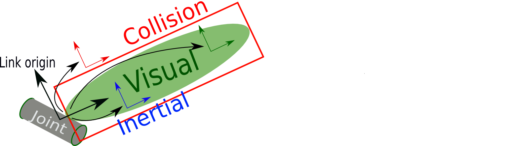

# 1.通信机制
## 1.话题通信
### 1-1. 话题通信基本操作
1. 发布数据
```cpp
 #include "ros/ros.h"
 #include "std_msgs/String.h"//普通文本类型的消息
 #include <sstream>
 int main(int argc, char *argv[]){
     setlocale(LC_ALL, "");
     ros::init(argc, argv, "talker");
     ros::NodeHandle nh;
     ros::Publisher pub = nh.advertise<std_msgs::String>("chatter",10);
     std_msgs::String msg;
     std::string msg_front = "hello";   
     int count = 0;
     ros::Rate r(1);
     while (ros::ok()){
         std::stringstream ss;//使用stringstream拼接字符串和编号
         ss << msg_front << count;
         msg.data = ss.str();
         //发布消息
         pub.publish(msg);
         ROS_INFO("发送的消息:%s",msg.data.c_str());
         r.sleep()//休眠时间 = 1/频率
         count++;
         ros::spinOnce();
     }
     return 0;
 }
```      
2. 接收数据
```cpp
#include "ros/ros.h"
#include "std_msgs/String.h"
#include <sstream>
/*
    訂約方实现：
    1.包含头文件：
        ROS中文本类型-->std_msgs/String.h
    2.初始化节点
    3.创建节点句柄
    4.创建訂閱者对象
    5.處理訂閱數據

*/
void doMsg(const std_msgs::String::ConstPtr &msg){//发布类型为std_msgs下的常量指針的引用
    //通過msg獲取並操作訂库閱到的數據
    ROS_INFO("翠花订阅的数据%s", msg->data.c_str());//因为msg是指针的引用，所以需要用->调用，c_str()指的是c风格的字符串
}

int main(int argc, char *argv[])
{
    //2.初始化ROS节点
    ros::init(argc, argv, "subscriber");
    //3.创建节点句柄
    ros::NodeHandle nh;
    //4.创建订阅者对象
    ros::Subscriber sub = nh.subscribe<std_msgs::String>("fangzi", 10, doMsg);
    //5.处理订阅的消息
    //6.回旋函数
    ros::spin();//循环执行main()
    return 0; 
}
```
---
3. 调整cmake文件
  ```cmake
  add_executable(Hello_pub
    src/Hello_pub.cpp
  )
  add_executable(Hello_sub
    src/Hello_sub.cpp
  )

  target_link_libraries(Hello_pub
    ${catkin_LIBRARIES}
  )
    ${catkin_LIBRARIES}
  )
  ```

4. 话题通信自定义msg调用
流程：
1. 修改xml文件和cmake文件：
   1. 在cmake中:
```cmake 
find_package:message_generation
add_message_file:Person.msg
generate_messages:std_msgs
catkin_package:message_runtime
add_executable(person_talker src/person_talker.cpp)
add_executable(person_listener src/person_listener.cpp)

add_dependencies(person_talker ${PROJECT_NAME}_generate_messages_cpp)
add_dependencies(person_listener ${PROJECT_NAME}_generate_messages_cpp)

target_link_libraries(person_talker
${catkin_LIBRARIES}
)
target_link_libraries(person_listener
${catkin_LIBRARIES}
)

```cmake//**总的来看**
## Declare a C++ executable
## With catkin_make all packages are built within a single CMake context
## The recommended prefix ensures that target names across packages don't collide
add_executable(server src/server.cpp)
add_executable(client src/client.cpp)

## Rename C++ executable without prefix
## The above recommended prefix causes long target names, the following renames the
## target back to the shorter version for ease of user use
## e.g. "rosrun someones_pkg node" instead of "rosrun someones_pkg someones_pkg_node"
# set_target_properties(${PROJECT_NAME}_node PROPERTIES OUTPUT_NAME node PREFIX "")

## Add cmake target dependencies of the executable
## same as for the library above
add_dependencies(server ${PROJECT_NAME}_gencpp)
add_dependencies(client ${PROJECT_NAME}_gencpp)

## Specify libraries to link a library or executable target against
target_link_libraries(server
  ${catkin_LIBRARIES}
)
target_link_libraries(client
  ${catkin_LIBRARIES}
)
```
   2. xml 在xml中：message_generation+message_runtime<--->build_depend+build_export_depend+exec_depend
   ```xml
     <buildtool_depend>catkin</buildtool_depend>
     <build_depend>roscpp</build_depend>
     <build_depend>rospy</build_depend>
     <build_depend>std_msgs</build_depend>
     <build_depend>message_generation</build_depend>
     <build_depend>message_runtime</build_depend>

     <build_export_depend>roscpp</build_export_depend>
     <build_export_depend>rospy</build_export_depend>
     <build_export_depend>std_msgs</build_export_depend>
     <build_export_depend>message_generation</build_export_depend>
     <build_export_depend>message_runtime</build_export_depend>

     <exec_depend>roscpp</exec_depend>
     <exec_depend>rospy</exec_depend>
     <exec_depend>std_msgs</exec_depend>
     <exec_depend>message_runtime</exec_depend>
     <exec_depend>message_generation</exec_depend>

   ```
2. 发布方的实现
```cpp
#include "ros/ros.h"
#include "pub_sub/Person.h"
int main(int argc, char *argv[]){
    setlocale(LC_ALL,"");
    ros::init(argc, argv, "publisher");
    ros::NodeHandle nh;
    ros::Publisher pub = nh.advertise<pub_sub::Person>("house", 20);
    ros::Rate rate(1);
    pub_sub::Person msg;
    int count = 0;
    while (ros::ok()){
        msg.name = "James";
        msg.age = 18;
        msg.height = 1.75;
        pub.publish(msg);
        ROS_INFO("published%d", count);
        rate.sleep();
        count++;
    }
    return 0;
}
```
3. 订阅方的实现
```cpp
 #include "ros/ros.h"
 #include "pub_sub/Person.h"
 void doMsg(const pub_sub::Person::ConstPtr &msg){
     ROS_INFO("发布的消息是：姓名:%s, 身高:%d, 年龄:%d",msg->name.c_str(), msg->age, msg->height);//char类型必须转换成char.c_str()类型才能输出
 }
 int main(int argc, char *argv[]){
     setlocale(LC_ALL,"");//加上这一段可以避免中文乱码
     ros::init(argc, argv, "subscriber");
     ros::NodeHandle nh;
     ros::Subscriber sub = nh.subscribe<pub_sub::Person>("house", 20, doMsg);
     ros::spin();
     return 0;
 }
```
4.总结：
  1. 在pub_sub目录下创建msg/Person.msg
  2. 修改cmake:message_runtime message_generation std_msgadd_dependencies
  3. 修改xml:见上面
  4. catkin_make
  5. 将devep/include/**的头文件路径加到cpp_jason文件中
  6. 编写pub_msg.cpp+sub_msg.cpp
  7. **再次修改cmakelist文件**：Person.msg;add_excutable
  8. catkin_make
  9. rosrun执行


## 2.服务通信
### 2-1. 服务端(**server**)

```cpp
#include "ros/ros.h"
#include "server_client/AddInts.h"
//4.创建服务端
bool doReq(server_client::AddInts::Request &req, server_client::AddInts::Response &resp){//引用传递
    int num1 = req.num1;
    int num2 = req.num2;
    resp.sum = num1 + num2;
    ROS_INFO("您输入的信息是num1+num2=%d",resp.sum);
    return true;
    }
           
int main(int argc, char *argv[]){
    setlocale(LC_ALL,"");
    //1.创建节点
    ros::init(argc, argv, "server");
    //2.创建节点句柄
    ros::NodeHandle nh;
    //3.创建服务端
    ros::ServiceServer server = nh.advertiseService("AddInts", doReq);//此处无模板,此处话题名称相同
    //5.回旋
    ros::spin();
    return 0;
}
```
### 2-2. 客户端
```cpp
#include "ros/ros.h"
#include "server_client/AddInts.h"
int main(int argc, char *argv[]){
    setlocale(LC_ALL, "");
    //优化实现
    if (argc != 3){
        ROS_INFO("提交的参数个数不对！");
        return 1;
    }
    //1.初始化节点
    ros::init(argc, argv, "client");
    //2.创建节点句柄
    ros::NodeHandle nh;
    //3.创建客户端对象
    ros::ServiceClient client = nh.serviceClient<server_client::AddInts>("AddInts");//客户端发布数据，所以需要指定数据类型，服务端接收数据，所以无须指定数据类型
    //client = ServiceClient,serviceClient; server = ServiceServer,advertiseService
    //4.创建请求逻辑
    //4-1.创建请求
    server_client::AddInts req;
    req.request.num1 = atoi(argv[1]);//argv[1]是字符串类型的，要变成整型值，用atoi(argv[1]),
    // atoi = ascii to integer,是将字符串转为整形的函数
    req.request.num2 = atoi(argv[2]);
    //4-2.处理响应
    //调用判断服务器状态的函数
    client.waitForExistence();//如果服务器没启动，就挂起，不启动
    bool resp = client.call(req);//访问服务器把ai对象提交了,客户端接收返回的结果，是否是true
    if (resp){//若是客户端先于服务端启动，resp = flase
        ROS_INFO("响应成功！");
        ROS_INFO("响应结果 = %d", req.response.sum);//结果被封装在ai.response.sum里面
    }
    else{
        ROS_INFO("处理失败...");
    }
    return 0;
}
```
### 2-3.配置cmake和xml,以及srv文件
1. cmake文件
* find_package->message_generation
* add_service_files->AddInts.srv
* generate_messages->std_msgs
* catkin_package->message_runtime
---
* add_executable(client src/client.cpp)
*add_dependencies(server ${PROJECT_NAME}_gencpp)
*target_link_libraries(client
  ${catkin_LIBRARIES}
)
1. xml
```xml
  <buildtool_depend>catkin</buildtool_depend>
  <build_depend>roscpp</build_depend>
  <build_depend>rospy</build_depend>
  <build_depend>std_msgs</build_depend>
  <build_depend>message_generation</build_depend>
  <build_depend>message_runtime</build_depend>

  <build_export_depend>roscpp</build_export_depend>
  <build_export_depend>rospy</build_export_depend>
  <build_export_depend>std_msgs</build_export_depend>
  <build_export_depend>message_generation</build_export_depend>
  <build_export_depend>message_runtime</build_export_depend>

  <exec_depend>roscpp</exec_depend>
  <exec_depend>rospy</exec_depend>
  <exec_depend>std_msgs</exec_depend>
  <exec_depend>message_runtime</exec_depend>
  <exec_depend>message_generation</exec_depend>
```
3. srv文件
```srv
int32 num1//客户端
int32 num2
---
int32 sum//服务端
```
4. 步骤总结：
   1. client
      1. 创建节点
      2. 创建节点句柄
      3. 创建客户端:ros::ServiceClient client = nh.serviceClient<service_client::AddInts>("house")
      4. 组织请求数据
         1. 创建请求数据:service_client::AddInts req
         2. 返回请求:bool resp = client.call(req) 
    2. server
       1. 创建节点
       2. 创建节点句柄
       3. 创建服务端：ros::ServiceServer server = nh.advertise("house",doReq)
       4. 创建回调函数:bool doReq(service_client::AddInts::Request &req,service_client::AddInts::Request &resp){}
       5. 回旋：ros::spin()


## 3.参数服务器
### 1.参数的增
1. 方法
   1. ros::NodeHandle nh -> nh.setParam("keys","values")
   2. ros::param::set("keys","values");
2. 调试：rosparam get /keys = xxxx
3. 案例：
   1. 设置参数
```cpp
#include "ros/ros.h"
#include <iostream>
#include <vector>
#include <string>
#include <map>
using namespace std;
int main(int argc, char** argv){
    ros::init(argc, argv, "param");
    ros::NodeHandle nh;
    //******增***********//
    //方法1:nh
    nh.setParam("radius", 1);
    //方法2:ros::param
    ros::param::set("length", 2);
    //*******改*******//
    //方法1&&2同上直接覆盖就行
    //********查*******//
    
}
```
   2. 获取
```cpp
#include "ros/ros.h"
#include <iostream>
#include <vector>
#include <string>
#include <map>
using namespace std;
int main(int argc, char** argv){
    setlocale(LC_ALL,"");
    ros::init(argc, argv, "param");
    ros::NodeHandle nh;
    //nh.param***************************//
    //********查*******//
    //方法1.param,查询到的话就返回正确值，没查询到的话就返回默认值
    int radius = nh.param("radius", 1);//查询键为"radius"的函数值，若是没有的，返回1
    ROS_INFO("radius = %d", radius);
    //方法2：getParam，查询到的话就返回true,将正确值赋给radius1,否则就是false
    int radius1 = 0;
    bool res = nh.getParam("radius", radius1);
    if (res){
        ROS_INFO("getParam获取的半径是:%d", radius1);
    }
    else{
        ROS_INFO("被查询的变量不存在");
    }
    //方法3：getParamCached()用法同getParam()
    bool res1 = nh.getParamCached("radius", radius1);
    if (res1){
        ROS_INFO("getParamCached获取的半径是:%d", radius1);
    }
    else{
        ROS_INFO("被查询的变量不存在");
    }
    //4.getParamNames
    vector<string> names;
    nh.getParamNames(names);//获取每一个键的名称
    names.push_back("a");
    names.push_back("b");
    ///方法1:for--auto
    for (auto &&name : names){
        ROS_INFO("遍历的元素是%s",name.c_str());
    }
    ///方法2：for--iter,容易乱码
    vector<string>::iterator iter = names.begin();
    for (;iter != names.end(); iter++){
        cout << "键:" << *iter << endl;
    }
    //5.hasParam，若是存在的话,返回true,否则flase
    bool flag1 = nh.hasParam("radius");//"radius"的值是int，所以必须返回bool或者int
    bool flag2 = nh.hasParam("radiusxxx");
    ROS_INFO("radius存在吗？%d", flag1);
    ROS_INFO("radius存在吗？%d", flag2);
    //6.searchParam
    string key;//由于"radius"的键是字符串，所以必须将返回值定为string
    nh.searchParam("radius", key);//查询的是radius,用key保存,若存在的话，将radius赋值给key,否则保持默认值
    ROS_INFO("搜索结果:%s", key.c_str());//若输出是string的话，则要将其转化为c_str(),否则会乱码
 
    //ros::param******************************//ros::param和nh.param模式完全一样
    //ros::param::param
    int radius_param = ros::param::param("radius", 11);
    ROS_INFO("radius_param = %d", radius_param);
    vector<string> names_param;
    ros::param::getParamNames(names_param);//得到所有参数的键后将其放入vector容器names_param中,然后就可以直接遍历
    ///方法1：for--auto
    for (auto &&name : names_param){
        ROS_INFO("键:%s", name.c_str());
    }
    ///方法2：for--iter
    vector<string>::iterator iter1 = names_param.begin();
    for (iter1; iter1 != names_param.end(); iter1++){
        cout << "键:" << *iter1 << endl;//这里用ROS_INFO势必会乱码，所以如果用for-iter输出，直接用cout;用for-auto输出，用ROS_INFO和cout都可
    }
    //ros::param::
    return 0;
}
```
   3. 删除
```cpp
#include "ros/ros.h"
#include <iostream>
#include <vector>
#include <string>
#include <map>
using namespace std;
/*
ros::NodeHandle---->delParam
ros::param----del()
*/

int main(int argc, char** argv){
    setlocale(LC_ALL,"");
    ros::init(argc, argv, "param");
    ros::NodeHandle nh;
    //******NodeHandle*******//
    bool flag1 = nh.deleteParam("radius");//delete返回一个bool类型，若删除成功，则返回true
    if (flag1){
        ROS_INFO("deleteParam删除成功");
    }
    else{
        ROS_INFO("delelteParam删除失败");
    }
    //*******ros::param**********//
    bool flag2 = ros::param::del("radius");
    if (flag2){
        ROS_INFO("rosparam删除成功");
    }
    else{
        ROS_INFO("rosparam删除失败");
    }
    
}
```
   4. 总结
      1. 若是需要修改功能包的名称，修改cmakelist文件的project和xml的<name>param_service</name> 和 <description>The param_service package</description>这三个地方的功能包文件名
      2. 多个功能包下的执行文件不能重名
      3. 例如demo01/src/test01 ,demo02/src/test01,这样是不允许的，必须要将2个test01变成不同的值，否则会编译失败
      4. 功能
         1. nh.setParam(key,value):
         2. res = nh.param(key,flag):若能得到key的value，则res = value,否则res = flag, 
         3. res = nh.getParam(key, flag):若能得到key的值，则res = true,否则为false
         4. res = nh.getParamCached(key, flag):同上
         5. nh.getParamNames(vec):得到所有参数的名字，并赋值给vec
         6. res = nh.hasParam(key,flag)：若有key,则flag = key(value)
         7. res = nh.searchParam(key, flag):若有key的话，则res = true


1. for(auto:)语句
```cpp
#include <iostream>
#include <vector>
using namespace std;
void printVec(vector<int> &vec){
    for (int i = 0; i < vec.size(); i++){
        cout << vec[i] << endl;
    }
}
int main(){
    vector<int> vec = {1, 2, 3, 4};
//*****************第一种，不会改变vec中的值，相当于是值传递
    for (auto i : vec){
        i += 1;
    }
    printVec(vec);
//****************第二种,改变vec中的值，相当于是引用传递
    for (auto &i : vec){
        i += 1;
    }
    printVec(vec);
//****************第三种，会改变vec中的值，相当于是引用传递
    for (auto &&i : vec){
        i += 1;
    }
    printVec(vec);
}
```
* 注意：
  * 1.for(auto &i : vec)相当于python中的for (x in range),&i = x,vec = range,而auto是修饰符号
  * 2.i为值传递，&i ,&&i相当于是引用传递
  * 3.修改完ros.cpp后，再catkin_make后再执行rosrun xxxx ros.cpp，此时修改才能生效
  * 4.vector<int> vec, ros::string<int, int>(xxxx)利用到了模板和变量声明 

## 3.常用命令
    rosnode : 操作节点
    rostopic : 操作话题#话题对应消息
    rosmsg : 操作msg消息
    rosservice : 操作服务#服务对应SRV
    rossrv : 操作srv消息
    rosparam : 操作参数#最后一个param
    1. 2+2+2：node,prama;topic,msg;service,srv
    2. list,info,find,pub,echo,show,get,set为常用命令,可以直接用TAB补全命令
    3. 几个重要常用的：rostopic echo pkg 用来输出位置
    4. rostopic pub;rosservice call;rosparam get/set;

### 3-1.rosnode

rosnode 是用于获取节点信息的命令

1. rosnode ping    测试到节点的连接状态
2. rosnode list    列出活动节点
3. rosnode info    打印节点信息
4. rosnode machine    列出指定设备上节点
5. rosnode kill    杀死某个节点
6. rosnode cleanup    清除不可连接的节点#就是清除已经死亡的但是rosmaster还不知道的节点

    rosnode ping

    测试到节点的连接状态

    rosnode list

    列出活动节点

    rosnode info

    打印节点信息

    rosnode machine

    列出指定设备上的节点

    rosnode kill

    杀死某个节点

    rosnode cleanup

    清除无用节点，启动乌龟节点，然后 ctrl + c 关闭，该节点并没被彻底清除，可以使用 cleanup 清除节点

##可以通过rosrun info -h来查看相关帮助信息,
##也可通过rosnode -h来查看信息

### 3-2.rostopic
1. 命令  详细说明
   1. rostopic list   显示活动的话题目录
   2. rostopic echo [话题名称]   实时显示指定话题的消息内容
   3. rostopic find [类型名称]   示使用指定类型的消息的名称
   4. rostopic type [话题名称]   显示指定话题的消息类型 
   5. rostopic bw [话题名称]      显示指定话题的消息带宽（bandwidth） 
   6. rostopic hz [话题名称] 显示指定话题的消息数据发布周期
   7. rostopic info [话题名称]   显示指定话题的信息 
   8. rostopic pub [话题名称] [消息类型] [参数]    用指定的话题名称发布消息 

2. 详解：
   1. rostopic list：列出活动话题
　　通过将“-v”选项添加到rostopic list命令，可以分开发布话题和订阅话题，并将每个话题的消息类型一起显示。rostopic list -v

   2. rostopic echo [话题名称]：实时显示指定话题的消息内容
以下示例实时显示组成/turtle/pose话题的x、y、theta、linear_velocity和angular_velocity的数据。    

rostopic echo /turtle/pose

   3. rostopic find [类型名称]：显示使用指定类型的消息的话题    
rostopic find turtlesim/Pose

   4. rostopic type [话题名称]：显示指定话题的消息类型
rostopic type /turtle/pose

   5. rostopic bw [话题名称]：显示指定话题的消息数据带宽（bandwidth）
　　在以下示例中，用于/turtle/pose话题的数据带宽平均为每秒.25 KB。
rostopic bw /turtle/pose

   6. rostopic hz [话题名称]：显示指定话题的消息数据发布周期
　　在以下示例中，用户可以检查/turtle/pose数据的发布周期。从结果可以看出，该消息以大约62.5Hz（0.06秒= 6毫秒）的频率被发布。
rostopic hz /turtle/pose

   7. rostopic info [话题名称]：显示指定话题的信息
　　在以下示例中，用户可以看到/turtle/pose话题使用turtlesim/Pose消息类型，发布到/turtlesim节点，并且没有实际订阅的话题。
    
rostopic info /turtle/pose

   8. rostopic pub [话题名称] [消息类型] [参数]：使用指定的话题名称发布消息
以下是使用/turtle/cmd_vel话题名称发布类型为geometry_msgs/Twist的消息的示例。

rostopic pub /turtle/cmd_vel geometry_msgs/Twist -- ‘[2.0, 0.0, 0.0]’ ‘[0.0, 0.0, .8]’
rostopic pub -r 10 
　　每个选项的描述如下。

    -只发布一次消息（实际上只运行一次，但会像以前的结果一样运行3秒）。
    /turtle1/cmd_vel 指定的话题名称
    geometry_msgs/Twist 要发布的消息类型名称
    -- ‘[2.0, 0.0, 0.0]’ ‘[0.0, 0.0, 1.8]’ 在x轴坐标上以每秒2.0 m的速度移动，以z轴为中心，每秒旋转1.8rad


### 3-3.rosservice

rosservice包含用于列出和查询ROSServices的rosservice命令行工具。

调用部分服务时，如果对相关工作空间没有配置 path，需要进入工作空间调用 source ./devel/setup.bash

rosservice args 打印服务参数
rosservice call    使用提供的参数调用服务
rosservice find    按照服务类型查找服务
rosservice info    打印有关服务的信息
rosservice list    列出所有活动的服务
rosservice type    打印服务类型
rosservice uri    打印服务的 ROSRPC uri

1. rosservice list

列出所有活动的 service

2. rosservice args

打印服务参数

rosservice args /spawn
x y theta name

3. rosservice call

调用服务

为小乌龟的案例生成一只新的乌龟

rosservice call /spawn "x: 1.0
y: 2.0
theta: 0.0
name: 'xxx'"
name: "xxx"

//生成一只叫 xxx 的乌龟

4. rosservice find

根据消息类型获取话题

5. rosservice info

获取服务话题详情

6. rosservice type

获取消息类型

7. rosservice uri

获取服务器 uri


### 3-3.rosmsg

rosmsg是用于显示有关 ROS消息类型的 信息的命令行工具。

rosmsg 演示

rosmsg show    显示消息描述
rosmsg info    显示消息信息#show和info是一样的
rosmsg list    列出所有消息
rosmsg md5    显示 md5 加密后的消息
rosmsg package    显示某个功能包下的所有消息
rosmsg packages    列出包含消息的功能包

1. rosmsg list

会列出当前 ROS 中的所有 msg

2. rosmsg packages

列出包含消息的所有包

3. rosmsg package

列出某个包下的所有msg/rosmsg package 包名 
rosmsg package turtlesim

4. rosmsg show

显示消息描述

//rosmsg show 消息名称
rosmsg show turtlesim/Pose#前一个是包名，后一个是Pose.msg
结果:
float32 x
float32 y
float32 theta
float32 linear_velocity
float32 angular_velocity

5. rosmsg info

作用与 rosmsg show 一样

### 3-5.rossrv

rossrv是用于显示有关ROS服务类型的信息的命令行工具，与 rosmsg 使用语法高度雷同。

rossrv show    显示服务消息详情
rossrv info    显示服务消息相关信息
rossrv list    列出所有服务信息
rossrv md5    显示 md5 加密后的服务消息
rossrv package    显示某个包下所有服务消息
rossrv packages    显示包含服务消息的所有包

1. rossrv list

会列出当前 ROS 中的所有 srv 消息

2. rossrv packages

列出包含服务消息的所有包

3. rossrv package

列出某个包下的所有msg

//rossrv package 包名 
rossrv package turtlesim

4. rossrv show

显示消息描述

rossrv show 消息名称
rossrv show turtlesim/Spawn
结果:
float32 x
float32 y
float32 theta
string name
string name

rossrv info

作用与 rossrv show 一致

rossrv md5

对 service 数据使用 md5 校验(加密)

### 3-6.rosparam
1. rosparam list
列出所有参数

2. rosparam list

3. rosparam set
设置参数

rosparam set name huluwa

//再次调用 rosparam list 结果
/name  

4. rosparam get

获取参数

rosparam get name

//结果
huluwa

5. rosparam delete

删除参数

rosparam delete name

6. rosparam load(先准备 yaml 文件)

从外部文件加载参数

rosparam load xxx.yaml

7. rosparam dump

将参数写出到外部文件

rosparam dump yyy.yaml

## 4.通信机制实际操作
### 4-1.话题发布
1. 话题与消息获取
准备: 先启动键盘控制乌龟运动案例。

   1. 话题获取
获取话题:/turtle1/cmd_vel
通过计算图查看话题，启动计算图:

rqt_graph
或者通过 rostopic 列出话题:

rostopic list
   2. 消息获取
获取消息类型:geometry_msgs/Twist

rostopic type /turtle1/cmd_vel
获取消息格式:

rosmsg info geometry_msgs/Twist
响应结果:

geometry_msgs/Vector3 linear
  float64 x
  float64 y
  float64 z

geometry_msgs/Vector3 angular
  float64 x
  float64 y
  float64 z
linear(线速度) 下的xyz分别对应在x、y和z方向上的速度(单位是 m/s)；

angular(角速度)下的xyz分别对应x轴上的翻滚、y轴上俯仰和z轴上偏航的速度(单位是rad/s)。

3. 实现发布节点
创建功能包需要依赖的功能包: roscpp rospy std_msgs geometry_msgs

实现方案A: C++
```cpp
/*
    编写 ROS 节点，控制小乌龟画圆

    准备工作:
        1.获取topic(已知: /turtle1/cmd_vel)
        2.获取消息类型(已知: geometry_msgs/Twist)
        3.运行前，注意先启动 turtlesim_node 节点

    实现流程:
        1.包含头文件
        2.初始化 ROS 节点
        3.创建发布者对象
        4.循环发布运动控制消息
*/

#include "ros/ros.h"
#include "geometry_msgs/Twist.h"

int main(int argc, char *argv[])
{
    setlocale(LC_ALL,"");
    // 2.初始化 ROS 节点
    ros::init(argc,argv,"control");
    ros::NodeHandle nh;
    // 3.创建发布者对象
    ros::Publisher pub = nh.advertise<geometry_msgs::Twist>("/turtle1/cmd_vel",1000);
    // 4.循环发布运动控制消息
    //4-1.组织消息
    geometry_msgs::Twist msg;
    msg.linear.x = 1.0;
    msg.linear.y = 0.0;
    msg.linear.z = 0.0;

    msg.angular.x = 0.0;
    msg.angular.y = 0.0;
    msg.angular.z = 2.0;

    //4-2.设置发送频率
    ros::Rate r(10);
    //4-3.循环发送
    while (ros::ok())
    {
        pub.publish(msg);
        r.sleep();
        ros::spinOnce();
    }


    return 0;
}
```

### 4-2.话题订阅
实现分析:

首先，需要启动乌龟显示以及运动控制节点并控制乌龟运动。
要通过ROS命令，来获取乌龟位姿发布的话题以及消息。
编写订阅节点，订阅并打印乌龟的位姿。
实现流程:

通过ros命令获取话题与消息信息。
编码实现位姿获取节点。
启动 roscore、turtlesim_node 、控制节点以及位姿订阅节点，控制乌龟运动并输出乌龟的位姿。
1. 话题与消息获取

获取话题:/turtle1/pose

rostopic list
获取消息类型:turtlesim/Pose

rostopic type  /turtle1/pose
获取消息格式:

rosmsg info turtlesim/Pose
响应结果:

​float32 x
float32 y
float32 theta
float32 linear_velocity
float32 angular_velocity

2.实现订阅节点
创建功能包需要依赖的功能包: roscpp rospy std_msgs turtlesim
```cpp
/*  
    订阅小乌龟的位姿: 时时获取小乌龟在窗体中的坐标并打印
    准备工作:
        1.获取话题名称 /turtle1/pose
        2.获取消息类型 turtlesim/Pose
        3.运行前启动 turtlesim_node 与 turtle_teleop_key 节点

    实现流程:
        1.包含头文件
        2.初始化 ROS 节点
        3.创建 ROS 句柄
        4.创建订阅者对象
        5.回调函数处理订阅的数据
        6.spin
*/

#include "ros/ros.h"
#include "turtlesim/Pose.h"

void doPose(const turtlesim::Pose::ConstPtr& p){
    ROS_INFO("乌龟位姿信息:x=%.2f,y=%.2f,theta=%.2f,lv=%.2f,av=%.2f",
        p->x,p->y,p->theta,p->linear_velocity,p->angular_velocity
    );
}

int main(int argc, char *argv[])
{
    setlocale(LC_ALL,"");
    // 2.初始化 ROS 节点
    ros::init(argc,argv,"sub_pose");
    // 3.创建 ROS 句柄
    ros::NodeHandle nh;
    // 4.创建订阅者对象
    ros::Subscriber sub = nh.subscribe<turtlesim::Pose>("/turtle1/pose",1000,doPose);
    // 5.回调函数处理订阅的数据
    // 6.spin
    ros::spin();
    return 0;
}
```
2.服务客户端实现
创建功能包需要依赖的功能包: roscpp rospy std_msgs turtlesim

实现方案A:C++
```cpp
/*
    生成一只小乌龟
    准备工作:
        1.服务话题 /spawn
        2.服务消息类型 turtlesim/Spawn
        3.运行前先启动 turtlesim_node 节点

    实现流程:
        1.包含头文件
          需要包含 turtlesim 包下资源，注意在 package.xml 配置
        2.初始化 ros 节点
        3.创建 ros 句柄
        4.创建 service 客户端
        5.等待服务启动
        6.发送请求
        7.处理响应

*/

#include "ros/ros.h"
#include "turtlesim/Spawn.h"

int main(int argc, char *argv[])
{
    setlocale(LC_ALL,"");
    // 2.初始化 ros 节点
    ros::init(argc,argv,"set_turtle");
    // 3.创建 ros 句柄
    ros::NodeHandle nh;
    // 4.创建 service 客户端
    ros::ServiceClient client = nh.serviceClient<turtlesim::Spawn>("/spawn");
    // 5.等待服务启动
    // client.waitForExistence();
    ros::service::waitForService("/spawn");
    // 6.发送请求
    turtlesim::Spawn spawn;
    spawn.request.x = 1.0;
    spawn.request.y = 1.0;
    spawn.request.theta = 1.57;
    spawn.request.name = "my_turtle";
    bool flag = client.call(spawn);//在已经生成一个新乌龟的情况下就不能生成旧乌龟
    // 7.处理响应结果
    if (flag)
    {
        ROS_INFO("新的乌龟生成,名字:%s",spawn.response.name.c_str());
    } else {
        ROS_INFO("乌龟生成失败！！！");
    }


    return 0;
}
```

### 4-3.服务调用
实现分析:

首先，需要启动乌龟显示节点。
要通过ROS命令，来获取乌龟生成服务的服务名称以及服务消息类型。
编写服务请求节点，生成新的乌龟。
实现流程:

通过ros命令获取服务与服务消息信息。
编码实现服务请求节点。
启动 roscore、turtlesim_node 、乌龟生成节点，生成新的乌龟。
1. 服务名称与服务消息获取
获取话题:/spawn

rosservice list
获取消息类型:turtlesim/Spawn

rosservice type /spawn
获取消息格式:

rossrv info turtlesim/Spawn
响应结果:

float32 x
float32 y
float32 theta
string name
**-------**
string name

2. 订阅节点(见上面)

### 4-4.参数设置
实现分析:

首先，需要启动乌龟显示节点。
要通过ROS命令，来获取参数服务器中设置背景色的参数。
编写参数设置节点，修改参数服务器中的参数值。
实现流程:

通过ros命令获取参数。
编码实现服参数设置节点。
启动 roscore、turtlesim_node 与参数设置节点，查看运行结果。

1. 参数名获取
获取参数列表:

rosparam list
响应结果:

/turtlesim/background_b
/turtlesim/background_g
/turtlesim/background_r

2. 参数修改
实现方案A:C++
```cpp
/*
    注意命名空间的使用。

*/
#include "ros/ros.h"
int main(int argc, char *argv[])
{
    ros::init(argc,argv,"haha");

    ros::NodeHandle nh("turtlesim");
    //ros::NodeHandle nh;

    // ros::param::set("/turtlesim/background_r",0);
    // ros::param::set("/turtlesim/background_g",0);
    // ros::param::set("/turtlesim/background_b",0);

    nh.setParam("background_r",0);
    nh.setParam("background_g",0);
    nh.setParam("background_b",0);


    return 0;
}
```
### 4-5.总结
在上面的例子中
1. publisher和subcriber在这个案例中分别对应publisher和乌龟的节点
2. 因为没有自定义srv和msg文件，所以在cmake和xml中都无须配置依赖文件，cmake添加add_executabel和target_link_libraries()就行，xml维持不变
3. 关于方向问题：
   1. ROS采用右手系：x轴:前方;y轴:左方；z轴：上方
   2. 角速度方向也采用右手系

# 2.通信机制进阶
## 1.初始化
```cpp
#include "ros/ros.h"
#include "std_msgs/String.h"
#include  <sstream>
int main(int argc, char *argv[]){
    setlocale(LC_ALL, ""); // 用于显示中文字符
    ros::init(argc, argv, "publisher", ros::init_options::AnonymousName);//这个选项可以让节点重复启动多次
    ros::NodeHandle nh;
    ros::Publisher pub = nh.advertise<std_msgs::String>("house", 20);
    std_msgs::String msg;
    ros::Rate rate(1);
    while (ros::ok()){
        msg.data = "hello";
        pub.publish(msg);       
        rate.sleep();
        ROS_INFO("发送的数据是:%s", msg.data);
    }
    return 0;
}
```
## 2.latch:
```cpp
ros::Publisher pub = nh.advertise<std_msgs::String>("house", 20, true);//如果为 true,该话题发布的最后一条消息将被保存，并且后期当有订阅者连接时会将该消息发送给订阅者
```
## 3.回旋函数
1. spinOnce()：处理一轮回调
2. spin():进入循环处理回调
3. 比较：ros::spin():
   1. 进入了循环执行回调函数，ros::spinOnce()只执行一次回调函数，无循环
   2. 在ros::spin()后的语句不会执行，而ros::spinOnce()后的语句可以执行
## 4.时间相关函数
1. 总结：
   1. 当前时间&持续时间
      1. ros::Time now = ros::Time::now();
      2. now.current_event
      3. ros::Time sometime(10000, 100000000)  
      4. ros::Duration du(10)
      5. 时间运算:ros::Duration d1 = d + now; ros::Duration d3 = d1 + d2;now 和now之间不能运算
   2. 定时器：
   ```cpp
   void doTime(const ros::TimerEvent &event){
       ROS_INFO()
   } 
   ros::Timer timer = nh.createTimer(du, doTime, flase);//du为循环执行的时间间隔
   ros::spin();//有回调函数，有spin()
   ```
   1. 获取时间
      1. now.toSec(); now的时间，类型为float
      2. now.sec; now的时间，类型为为int
      3. ros::Time::now().sec  ; ros::Duration d(1).sec  ;  ros::Time::now().current_real.sec
   2. 循环
   ```cpp
   ros::Rate r(1);
   while (ros::ok()){
       ROS_INFO("-------")
       r.sleep();
   }


2. 案例
**将所有的时间封装到回调函数中**
```cpp
#include "ros/ros.h"
#include "std_msgs/String.h"
using namespace std;
void doSomeThing(const ros::TimerEvent &event) {
    ROS_INFO("------------");
    //*****时刻**********//
    //当前时间
    ros::Time right_now = ros::Time::now();
    ///获取当前时间距离1970.1.1:00:00:00的秒数
    ROS_INFO("now is: %.2f", right_now.toSec());
    ROS_INFO("now is: %.2d", right_now.sec);//sec为时刻，没有(),且为整型
    
    ros::Time someTime(100, 100000000);//参数1：秒，参数2：纳秒(1e9 ns = 1s)
    ROS_INFO("时刻:%.2f", someTime.toSec());
    ros::Time someTime2(100.3);
    ROS_INFO("时刻:%.2f", someTime2.toSec());//100.3
    //*********持续时间*********//
    ROS_INFO("当前时刻:%.2f",ros::Time::now().toSec());
    ros::Duration du(10);//持续10s,参数是double类型的，以秒为单位
    du.sleep();//按照持续时间休眠
    ROS_INFO("持续时间:%.2f", du.toSec());//将持续时间换算成秒
    ROS_INFO("当前时刻:%.2f", ros::Time::now().toSec());//将持续时间换算成秒
    //**********持续时间与时刻运算********//
    ros::Time now = ros::Time::now();
    ros::Duration du1(10);
    ros::Duration du2(20);
    ROS_INFO("当前时刻:%.2f", now.toSec());
    //1.time和duration运算
    ros::Time after_now = now + du1;
    ros::Time before_now = now - du1;
    ROS_INFO("当前时刻之后:%.2f", after_now.toSec());
    ROS_INFO("当前时刻之前:%.2f", before_now.toSec());
    //2. duration 之间的运算
    ros::Duration du3 = du1 + du2;//时间类型
    ros::Duration du4 = du1 - du2;
    ROS_INFO("du3 = %.2f", du3.toSec());
    ROS_INFO("du4 = %.2f", du4.toSec());
    //3.time和time之间不可以运算,例如ros::Time nn = now + before_now;
    
    //******设置运行频率*********//
    // ros::Rate r(1);
    // while(true){
    //     ROS_INFO("--------code--------------");
    //     r.sleep();    
    // }
    
    //********定时器*********//

    ROS_INFO("event = %s", to_string(event.current_real.toSec()).c_str());
}
int main(int argc, char *argv[]){
    setlocale(LC_ALL,"");
    ros::init(argc, argv, "time");
    ros::NodeHandle nh;
    ros::Timer timer = nh.createTimer(ros::Duration(1), doSomeThing, false);//创建一个计时器，把ros::Duration(0.5)放入这个doSomeThing里面
    ros::spin();//对于subscriber而言，必须有publisher的持续输出才能有spin循环
    
}
/*注意事项：
1.不能在主函数中定义函数
2.若无using namespace std,那么必须要std::to_string()
3.event.current_real:当前时间
  event = ros::Time::now() = ros::Duration du(1)
4.to_string的用法：将整数i转换为字符串表示形式
*/
```
## 5.其他函数
1. 节点状态判断
ros::shutdown(); 在满足条件的情况下关闭节点
```cpp
#include "ros/ros.h"
#include "std_msgs/String.h"
#include  <sstream>
int main(int argc, char *argv[]){
    setlocale(LC_ALL, ""); // 用于显示中文字符
    ros::init(argc, argv, "publisher", ros::init_options::AnonymousName);
    ros::NodeHandle nh;
    ros::Publisher pub = nh.advertise<std_msgs::String>("house", 10, false);
    std_msgs::String msg;
    ros::Rate rate(1);
    int count = 0;
    ros::Duration(3).sleep();
    while (ros::ok()){//由于有了while，所以就不需要spin(),但是要spinOnce(k)
        if (count >= 10){
            ros::shutdown();
        }
        msg.data = "hello";
        pub.publish(msg);       
        rate.sleep();
        ROS_INFO("发送的数据是:%s->%d", msg.data.c_str(), count);
        ros::spinOnce();
        ROS_INFO("一轮回调执行完毕....");//spinOnce()后的语句会被执行
        count++;
    }
    return 0;
}
```
2. 日志相关api
```cpp
ROS_DEBUG("hello,DEBUG"); //不会输出
ROS_INFO("hello,INFO"); //默认白色字体
ROS_WARN("Hello,WARN"); //默认黄色字体
ROS_ERROR("hello,ERROR");//默认红色字体
ROS_FATAL("hello,FATAL");//默认红色字体
```
## 6. ROS中的头文件和源文件
### 1. 自定义头文件调用
   1. 注意：为了后续包含头文件时不抛出异常，要配置c_pp_properties.json中的includepath：
"/home/用户/工作空间/src/功能包/include/**"

```cpp
#ifndef _HELLO_H
#define _HELLO_H

namespace hello_ns{

class HelloPub {

public:
    void run();
};

}
#endif
```
2. 可执行文件
```cpp
#include "ros/ros.h"
#include "test_head/hello.h"

namespace hello_ns {

void HelloPub::run(){
    ROS_INFO("自定义头文件的使用....");
}

}

int main(int argc, char *argv[])
{
    setlocale(LC_ALL,"");
    ros::init(argc,argv,"test_head_node");
    hello_ns::HelloPub helloPub;
    helloPub.run();
    return 0;
}
```
3. 配置文件
include_directories(
include ${catkin_INCLUDE_DIRS})
)
4. 可执行配置文件
add_executable(hello src/hello.cpp)
add_dependencies(hello ${${PROJECT_NAME}_EXPORTED_TARGETS} ${catkin_EXPORTED_TARGETS})
target_link_libraries(hello ${catkin_LIBRARIES})

5. 总结：
   1. 关于命名空间的使用
```cpp
./include/mymath.h
namespace fun_ns{
    class MyFunc{
        void test();
    };
}
./src/mymath.cpp
namespace fun_ns{
    void MyFunc::test(){
        cout << "test" << endl;
    }
}
int main(){
fun_ns::MyFunc myfunc
myfunc.test()
}
```
2. 关于头文件路径：
**如果文件地址已经被包括进cpp_properties中了，就直接写文件名就行，否则写相对绝对路径**

### 2.自定义源文件调用
1. plumbing_head/
   1. include
      1. inlclude/plumbing_head
         1. mymath.h
    2. src
        1. main.cpp
        2. mymath.cpp
    3. CMakeLists.txt 
2. 文件：
**inlclude/plumbing_head/mymath.h**
```cpp
#ifndef MYMATH_H
#define MYMATH_H
class Circle{
    public:
        Circle(int r);
        int showArea();
        int r;
};
#endif 
```

**src/mymath.cpp**
```cpp
#include "../include/plumbing_head/mymath.h"
Circle::Circle(int r){
    this->r = r;
}
int Circle::showArea(){
    return 3.14*r*r; 
}
```
**src/main.cpp**
```cpp
#include "../include/plumbing_head/mymath.h"//相对路径导入
#include "ros/ros.h"
#include <iostream>
using namespace std;
int main(int argc, char **argv){
    ros::init(argc, argv, "head");
    Circle c(199);
    ROS_INFO("the area is %d", c.showArea());
}
```
**CMakeLists.txt**
1. 头文件和源文件相关配置
```cmake
#将include文件点加进来
include_directories(
include
  ${catkin_INCLUDE_DIRS}
)
#${catkin_INCLUDE_DIRS}是include下的文件路径

## 声明C++库，将mymath.h和mymath.cpp链接到库上
add_library(mymath
  include/plumbing_head/mymath.h
  src/mymath.cpp
)

add_dependencies(mymath ${${PROJECT_NAME}_EXPORTED_TARGETS} ${catkin_EXPORTED_TARGETS})

target_link_libraries(mymath
  ${catkin_LIBRARIES}
)#生成mymath的库

2. 可执行文件
```cmake
add_executable(main src/main.cpp)

add_dependencies(main ${${PROJECT_NAME}_EXPORTED_TARGETS} ${catkin_EXPORTED_TARGETS})

#此处需要添加之前设置的 mymath 库
target_link_libraries(main
  mymath
  ${catkin_LIBRARIES}
)
#将main链接到mymath库上
```
3. 总结：
   1. 4 + 3 = 7
      1. 4表示头文件和源文件的配置，包括:
         1. include_direcotories
         2. add_library(mymath include/plumbing_head/mymath.h src/mymath.cpp)
         3. add_denpendencies(mymath xxxxx) 
         4. target_link_libraries(mymath xxxx)
      2. 3表示可执行文件配置，包括：
         1. add_exexcutable(main src/main.cpp)
         2. add_dependencies(main ${xxx})  
         3. target_link_libraries(main mymath xxxxx)
   2. 都具备的是： add_denpendencies + target_link_libraries(),区别是前者多了include_directories()，后者多了add_executable()

# 3.ROS运行管理

## 1.元功能包
1. 概念：为了避免逐一安装所需功能包的问题，ROS中有一种方式将所需的功能包打包成1个功能包，
这个功能包就是元功能包，但安装某个功能模块的时候就直接调打包后的功能包，这个包就是元功能包
2. 作用：方便用户的安装，我们只需要这一个包就可以把其他相关的软件包组织到一起安装了。
3. 实现：
   1. 新建一个功能包
   2. 修改xml文件
```xml
 <exec_depend>被集成的功能包</exec_depend>
 .....
 <export>
   <metapackage />
 </export>
```
3. 修改cmakeist.txt
```cmake
cmake_minimum_required(VERSION 3.0.2)
project(demo)
find_package(catkin REQUIRED)
catkin_metapackage()
```
## 2. ROS节点管理launch文件

### 2-1.launch标签：
 1.属性:deprecated = "弃用声明"(通知用户当前launch文件已经弃用)
 2.子级标签：所有其它标签都是launch的子级
 3.启动界面：
```xml
 <launch>
    <node pkg="turtlesim" type="turtlesim_node"     name="myTurtle" output="screen" />
    <node pkg="turtlesim" type="turtle_teleop_key"  name="myTurtleContro" output="screen" />
</launch>
```
3. 注意:launch文件中不要加逗号
### 2-2.launch文件标签之node
1. 定义：<node>标签用于指定 ROS 节点，是最常见的标签，需要注意的是: 
roslaunch 命令不能保证按照 node 的声明顺序来启动节点(节点的启动是多进程的)
2. 属性
   1. pkg="包名":节点所属的包
   2. type="nodeType":节点类型(与之相同名称的可执行文件)
   3. name="nodeName":节点名称(在 ROS 网络拓扑中节点的名称)
   4. args="xxx xxx xxx" (可选):将参数传递给节点#利用args来传参数
   5. machine="机器名":在指定机器上启动节点#在不同的设备上启动节点
   6. respawn="true | false" (可选):如果节点退出，是否自动重启#自动启动
   7. respawn_delay=" N" (可选):如果 respawn 为 true, 那么延迟 N 秒后启动节点
   8. required="true | false" (可选):该节点是否必须，如果为 true,那么如果该节点退出，将杀死整个 roslaunch
   9.  ns="xxx" (可选):在指定命名空间 xxx 中启动节点
   10. clear_params="true | false" (可选):在启动前，删除节点的私有空间的所有参数
   11. output="log | screen" (可选):日志发送目标，可以设置为 log 日志文件，或 screen 屏幕,默认是 log(要屏幕可见)
  
3. 例子：
```xml  
<launch deprecated = "此文件已经过时，不建议使用">
<!-- <node pkg = "turtlesim" type = "turtlesim_node" name = "my_turtle" output = "screen" respawn = "true" /> -->
<!-- 节点退出后重新启动，respawn和required是对立的，不能同时写在同一个节点里面-->
<!-- ns = "hello"为设置加节点的命名空间,在后期可以避免重名问题,此案例输出的rosnode的名称是：/hello/my_turtle--> 

   <node pkg = "turtlesim" type = "turtlesim_node" name = "my_turtle" output = "screen" required = "true" ns = "hello" />
<!-- 节点退出后关闭整个系统 -->
   <node pkg = "turtlesim" type = "turtle_teleop_key" name = "my_key" output = "screen"/>
<!--不要在里面加逗号-->

</launch>
```
4. 子级标签
   1. env 环境变量设置
   2. remap 重映射节点名称
   3. rosparam 参数设置
   4. param 参数设置

### 2-3.launch文件标签之include
1. 作用:include标签用于将另一个 xml 格式的 launch 文件导入到当前文件
2. 属性
   1. file="$(find 包名)/xxx/xxx.launch"要包含的文件路径
   2. ns="xxx" (可选),在指定命名空间导入文件
节点1：#导入节点2，然后直接执行此launch文件就可以启动新节点
```xml
<launch>
<include file = "$(find model01)/launch/test.launch" />
节点2：
<launch deprecated = "此文件已经过时，不建议使用">
    <!-- <node pkg = "turtlesim" type = "turtlesim_node" name = "my_turtle" output = "screen" respawn = "true" /> -->
<!-- 节点退出后重新启动，respawn和required是对立的，不能同时写在同一个节点里面-->
<!-- ns = "hello"为设置加节点的命名空间,在后期可以避免重名问题,此案例输出的rosnode的名称是：/hello/my_turtle--> 

    <node pkg = "turtlesim" type = "turtlesim_node" name = "my_turtle" output = "screen" required = "true" ns = "hello" />
<!-- 节点退出后关闭整个系统 -->
    <node pkg = "turtlesim" type = "turtle_teleop_key" name = "my_key" output = "screen"/>
<!--不要在里面加逗号-->
</launch>
```

3. 子级标签
   1. env 环境变量设置
   2. arg 将参数传递给被包含的文件

### 2-4.launch文件标签之remap
1. 案例
```xml
<launch deprecated = "此文件已经过时，不建议使用">#deprecate：强烈反对
<node pkg = "turtlesim" type = "turtlesim_node" name = "my_turtle" output = "screen" respawn = "true" /> 
# 节点退出后重新启动，respawn和required是对立的，不能同时写在同一个节点里面
# ns = "hello"为设置加节点的命名空间,在后期可以避免重名问题,此案例输出的rosnode的名称是：/hello/my_turtle 

  <node pkg = "turtlesim" type = "turtlesim_node" name = "my_turtle" output = "screen">#此处格式要注意
      <remap from = "/turtle1/cmd_vel" to = "/cmd_vel" />
       # 将/turtle1/cmd_vel改成/cmd_vel，即从原话题到新话题的转化，从而实现从turtle_teleop_key到teleop_twist_keyboard teleop_twist_keyboard.py的通信
  </node>
  # 节点退出后关闭整个系统
  <node pkg = "turtlesim" type = "turtle_teleop_key" name = "my_key" output = "screen" />
  #不要在里面加逗号
</launch>
```
2. 步骤：
```xml
   1. < node = turtlesim type = "turlesim_node" name = "my_node" output = "screen" respawn = "true" />
   2. < node = turtlesim type = "turtle_teleop_key" name = "my_key" output = "screen" respawn = "true" >
      < remap from = "/turtle/cmd_vel" to = "/cmd_vel" />
    </ node >
   3. 启动roslaunch xxx xxx.launch ---------> rosrun turtle teleop_twist_keyboard teleop_twist_keyboard.py
```
### 2-5.launch文件标签之param
<param>标签主要用于在参数服务器上设置参数，参数源可以在标签中通过 value 指定，也可以通过外部文件加载，在<node>标签中时，相当于私有命名空间。

1. 属性
  name="命名空间/参数名"
  参数名称，可以包含命名空间

  value="xxx" (可选)
  定义参数值，如果此处省略，必须指定外部文件作为参数源

  type="str | int | double | bool | yaml" (可选)
  指定参数类型，如果未指定，roslaunch 会尝试确定参数类型，规则如下:
      .如果包含 '.' 的数字解析未浮点型，否则为整型
      ."true" 和 "false" 是 bool 值(不区分大小写)
      .其他是字符串

2. 子级标签
3. 例子:
```xml
  <launch>
      <param name = "param_A" type = "int" value = "100" />
      <node pkg = "turtlesim" type = "turlesim_node" name = "myturtle" output = "screen">
          <remap from = "/turtle1/cmd_vel" to = "/cmd_vel"/>
          <!-- 格式2:在node下的node -->
          <param name = "param_B" type = "double" value = "100" />
      </node>
      <!-- 键盘控制节点 -->
      <node pkg = "turtlesim" type = "turtle_teleop_key" name = "my_key" output = "screen"/> 
      
  </launch>
```
### 2-6.rosparam
步骤
1. launch文件
```xml
<launch>
  <node pkg = "turtlesim" type = "turtle_teleop_key" name = "my_key" output = "screen"/>
  <node pkg = "turtlesim" type = "turtlesim_node" name = "my_node" output = "screen">
   <!-- 当下面有子节点的时候就不要结尾不能有/,/要写在结尾node的句首,无子结点就要有/ -->
      <remap from = "/turtle1/cmd_vel" to = "cmd_vel"/>#remap节点替换要基于turtlesim_node
      <param name = "param_A" type = "int" value = "100"/>
      <param name = "param_B" type = "double" value = "100.1"/>
      <rosparam command = "load" file = "$(find model01)/launch/params.yaml"/>
      <rosparam command = "dump" file = "$(find model01)/launch/params_out.yaml"/>
  </node>
</launch>
```
1. 配置yaml文件   /3.roslaunch该文件,直接会导出节点
  bg_R: 100
  bg_G: 100
  bg_B: 100

### 2-7.ros文件标签之group
1. 属性
  ns="名称空间" (可选)
  clear_params="true | false" (可选)
  启动前，是否删除组名称空间的所有参数(慎用....此功能危险)
2. 子级标签
3. 例子:
```xml
<launch>
  <group ns = "first">
      <node pkg = "turtlesim" type = "turtlesim_node" name = "my_turtle" output = "screen" />
      <node pkg = "turtlesim" type = "turtle_teleop_key" name = "my_key" output = "screen" />
  </group>
  <group ns = "second">
      <node pkg = "turtlesim" type = "turtlesim_node" name = "my_turtle" output = "screen" />
      <node pkg = "turtlesim" type = "turtle_teleop_key" name = "my_key" output = "screen" />
  </group>
</launch>
```
4. 结果：将会产生2个乌龟GUI,且不会重名

### 2-8.arg标签
1. 属性
  name="参数名称"
  default="默认值" (可选)
  value="数值" (可选)
  不可以与 default 并存
  doc="描述"
2. 子级标签
3. 示例
   1. xml文件实现
```xml
<launch>
  <arg name = "car_length" default = "1034"/>
  <param name = "a" value = "$(arg car_length)" />
  <param name = "b" value = "$(arg car_length)" />
  <param name = "c" value = "$(arg car_length)" />
</launch>
```
2. 命令行实现：roslaunch model01 arg.launch car_length:=100

3. launch文件传参语法实现,hello.launch
   1. step1
  <launch>
      <arg name="xxx" />
      <param name="param" value="$(arg xxx)" />
  </launch>
   2. 命令行调用launch传参
roslaunch hello.launch xxx:=值
   3. 命名规则：按照大驼峰命名法，例如：Ros_Learning-------Pub_Sub_demo01.cpp


## 3.ROS工作空间覆盖
### 3-1.问题：
   特定工作空间的功能包不能重名，但是自定义工作空间的功能包与内置的功能包与内置的功能包
   可以重名或者不同的自定义的工作空间中也可以出现重名的功能包，那么调用该名称的功能包时候，
   会调用哪一个功能包？比如说：自定义工作空间A内存在功能包turtlesim,自定义工作空间B内也存在功能包turtlesim，
   系统内置空间内也存在turtlesim ,那么调用turtlesim时，会调用哪一个工作空间中的呢？
### 3-2.实现
1. 工作空间A中创建turtlsim包，工作空间B中创建turtlsim包
2. 添加source /home/kim/A/devel/setup.zsh
3. source /home/kim/B/devel/setup.zsh在.zshrc文件中
   1. 因为已经添加了source在zshrc中，所以打开一次终端相当于source 了一次，故就不用source,但是当修改zshrc文件后，必须要source才能继续下一次roscd
   2. 只当被添加到zshrc中的文件的工作空间才能roscd,**roscd turtlesim**:会直接进入到工作空间B中
4. >原因分析:ros会先解析.zshrc文件，并生成ROS_PACKAGE_PATH路径，该变量按照.bashrc中配置设置工作空间优先级，
  在设置时需要遵循一定的原则：ROS_PACKAGE_PATH中值，和.zshrc的配置顺序相反---->后配置的优先级更高
  所以roscd先去B文件而不去A文件
### 3-3.安全隐患
比如当前工作空间B优先级更高，意味着当程序调用 turtlesim 时，
不会调用工作空间A也不会调用系统内置的 turtlesim，如果工作空间A在实现时有其他功能包依赖于自身的 turtlesim，而按照ROS工作空间覆盖的涉及原则，
那么实际执行时将会调用工作空间B的turtlesim，从而导致执行异常，出现安全隐患。

### 3-4.BUG
在.zshrc中source了多个工作空间，可能出现的情况，在ROS_PACKAGE_PATH中只包括2个工作空间，可以删除自定义工作空间中的devep和build文件
重新catkin_make,然后载入.zshrc文件，问题解决

## 4.ROS节点名称重名
### 4-1.现象
rospy.init_node("yyy")来定义节点名称，在ROS中，是不允许出现重名节点的，如果出现会发生混淆，所以当启动的时候，重名节点会被直接关闭。
命名空间就是为名称添加前缀，名称重映射是为名称起别名。这两种策略都可以解决节点重名问题，两种策略的实现途径有多种:
### 4-2.解决方法：
法1：命名空间：添加前缀 |法2：名称重映射:为名称起别名
实现途径：rosrun 命令  launch 文件  编码实现

### 4-3.设置命名空间与重映射：
1. rosrun设置命名空间：
rosrun 包名 节点名 __ns:=/xxx | rosrun turtlesim turtlesim_node __ns:=/xxx
rosrun 包名 节点名 __ns:=/yyy | rosrun turtlesim turtlesim_node __ns:=/yyy
.运行结果：rosnode list : /xxx/turtlesim; /yyy/turtlesim

2. rosrun名称重映射：
为节点起别名：rosrun 包名 节点名 __name:="新名称"
rosrun turtlesim  turtlesim_node __name:=t1 
rosrun turtlesim  turtlesim_node __name:=t2
rosnode list : /t1 ; /t2

3. rosrun命名空间同时名称重映射叠加：
语法：rosrun 包名 节点名 __ns:=新名称 __name:=新名称
例子：rosrun turtlesim turtlesim_node __ns:=/a  __name:=/b;
结果：rosnode list:/a/b#__ns为包名，__name为子包名

问题：[rosrun] Couldn't find executable named turtlesim_node below /home/kim/ROS_Space/test_ws/src/turtlesim
这是因为在.zshrc中，已经添加了source A/devel/setup.zsh ，所以会默认进入到A的工作空间中，

4. 通过launch文件设置命名空间与重映射
```xml
<launch>
   <node pkg = "turtlesim" type = "turtlesim_node" name = "t1" ns = "hello" />
</launch>
```

5. 脚本的方式实现命名空间和重映射：
```cpp
#include "ros/ros.h"
#include "std_msgs/String.h"
int main(int argc, char* argv[]){
    ros::init(argc, argv, "hello");
    ros::NodeHandle nh;
    // //核心：设置不同的类型的话题
    //1. 全局----话题名称要以/开头(也可以设置自己的命名空间），这种情况下和节点(命名空间以及名称)没有关系
    ros::Publisher pub1 = nh.advertise<std_msgs::String>("/x1/chatter", 1000);
    //2. 相对----话题名称要以非/开头
    ros::Publisher pub2 = nh.advertise<std_msgs::String>("x2/chatter", 1000);
    ros::Publisher pub3 = nh.advertise<std_msgs::String>("chatter", 1000);
    //3. 私有-----需要创建特定NodeHandle
    ros::NodeHandle nh2("abc");//a作为顶层话题名称
    ros::Publisher pub4 = nh2.advertise<std_msgs::String>("x3/chatter", 1000);//x3,x4以abc作为顶层话题
    ros::Publisher pub5 = nh2.advertise<std_msgs::String>("x4/chatter", 1000);
    ros::Publisher pub6 = nh2.advertise<std_msgs::String>("/x5/chatter", 1000);//采用全局话题名称的形式
    while (ros::ok()){

    }
    return 0;
//注意：必须要在程序执行的时候才能看到node和topic
}
/*最终结果
/abc/x3/chatter
/abc/x4/chatter
/chatter
/x1/chatter
/x2/chatter
/x5/chatter
*/
```
# 4.ROS常用组件
## 4-1.TF坐标变换
### 1. 坐标msg消息

**一般来说，在头文件文件中的消息，创建在脚本中时，1. /<===>::， 2. 各单词首字母变小写为大写**
1. geometry_msgs/TransformStamped
输入:rosmsg info geometry_msgs/TransfromStamped

std_msgs/Header header                     #头信息
  uint32 seq                                #|-- 序列号
  time stamp                                #|-- 时间戳
  string frame_id                            #|-- 坐标 ID
string child_frame_id                    #子坐标系的 id
geometry_msgs/Transform transform        #坐标信息
  geometry_msgs/Vector3 translation        #偏移量
    float64 x                                #|-- X 方向的偏移量
    float64 y                                #|-- Y 方向的偏移量
    float64 z                                #|-- Z 方向上的偏移量
  geometry_msgs/Quaternion rotation        #四元数
    float64 x                                
    float64 y                                
    float64 z                                
    float64 w

2. geometry_msgs/PointStamped
   输入：rosmsg info geometry_msgs/PointStamped

std_msgs/Header header                    #头
  uint32 seq                                #|-- 序号
  time stamp                                #|-- 时间戳
  string frame_id                            #|-- 所属坐标系的 id
geometry_msgs/Point point                #点坐标
  float64 x                                    #|-- x y z 坐标
  float64 y
  float64 z
### 2. 静态坐标变换
**静态坐标变换是指2个坐标系的相对位置是固定的**
实现：
1. 创建功能包：tf2, tf2_ros, tf2_geometry_msgs, roscpp, std_msgs, geometry_msgs(**3+3**)
2. 发布方：
```cpp
#include "ros/ros.h"
#include "tf2_ros/static_transform_broadcaster.h"//发布者头文件(创建：tf2_ros::StaticTransformBroadcaster pub，小写->大写)
#include "geometry_msgs/TransformStamped.h"//变换戳头文件(创建消息对象头文件: geometry_msgs::TransformStamped tfs， 大写->大写)
#include "tf2/LinearMath/Quaternion.h"//4元数头文件（tf2::Quaternion qtn, 大写->大写),除了四元数都是tf2之外，都是tf2_ros
//一般来说，在头文件文件中的消息，创建在脚本中时，1. /<===>::， 2. 各单词首字母变小写为大写
//1.包括头文件
int main(int argc, char **argv){
    //2.初始化节点和创建节点句柄
    ros::init(argc, argv, "static_pub");
    ros::NodeHandle nh;
    //3. 创建发布对象
    tf2_ros::StaticTransformBroadcaster pub;//静态变换广播器
    //4. 组织被发布的数据
    /*
    4-1.创建消息对象-变换戳
    4-2.创建header:3+3
    4-3.创建qtn:2+4(qtn,setRPY,x, y, z, w)
    */
    geometry_msgs::TransformStamped tfs;//变换戳
    tfs.header.stamp = ros::Time::now();
    tfs.header.frame_id = "base_link";//相对坐标系关系中被参考的那个
    tfs.child_frame_id = "laser";//相对坐标系
    tfs.transform.translation.x = 0.2;//laser相对于base_link的x偏移量
    tfs.transform.translation.y = 0.2;//laser相对于base_link的y偏移量
    tfs.transform.translation.z = 0.5;//laser相对于base_link的z偏移量
    //需要根据欧来角来转换4元数
    tf2::Quaternion qtn;//创建四元数对象
    //向四元数中设置欧拉角，这个对象可以将欧拉角转换为四元数
    qtn.setRPY(0, 0, 0);//roll,pitch,yaw:翻滚，俯仰，偏航
    //里面的单位是弧度
    tfs.transform.rotation.x = qtn.getX(); 
    tfs.transform.rotation.y = qtn.getY(); 
    tfs.transform.rotation.z = qtn.getZ(); 
    tfs.transform.rotation.w = qtn.getW(); 
    //5. 发布数据
    pub.sendTransform(tfs);
    //6. spin()
    ros::spin();//进入循环
    return 0;
}
```
3. 订阅方
```cpp
#include "ros/ros.h"
#include "tf2_ros/transform_listener.h"//发布者头文件(tf2_ros::TransformListener listener(buffer), 小写->大写)
#include "tf2_ros/buffer.h"//(创建缓存对象，tf2_ros::Buffer buffer, 小写->大写)
#include "geometry_msgs/PointStamped.h"//点戳头文件(创建坐标点对象，geometry_msgs::PointStamped ps, 大写->大写)
#include "tf2_geometry_msgs/tf2_geometry_msgs.h"//ps->ps_out需要用到的消息对象(ps_out = buffer.transform(ps))
//transform->buffer, PointStamped->tf2_geometry_msgs
//1.创建头文件
int main(int argc,char **argv){
    setlocale(LC_ALL, "");
    //2.初始化节点和创建节点句柄
    ros::init(argc, argv, "static_sub");
    ros::NodeHandle nh;
    //3.创建订阅对象
    //3-1.创建一个buffer缓存(订阅对象可以将订阅的数据存入buffer)
    tf2_ros::Buffer buffer;
    //3-2.创建订阅对象
    tf2_ros::TransformListener listener(buffer);
    //4. 生成坐标点数据(组织订阅数据)
    //4-1.创建消息类型ps
    //4-2.创建header(2+3)
    geometry_msgs::PointStamped ps;
    ps.header.stamp = ros::Time::now();//时间戳
    ps.header.frame_id = "laser";//以laser作为坐标点,而非base_link
    ps.point.x = 2.0;//x,y,z是离laser的障碍物的坐标
    ps.point.y = 3.0;
    ps.point.z = 5.0;
    // //添加休眠
    // ros::Duration(2).sleep();//在转换之前先休眠2s，以留出时间订阅到数据
    //5.转换坐标点
    //5-1.创建转换坐标点ps_out while循环及其频率
    //5-2.转换坐标:ps_out = buffer.transform(ps, "base_link")
    //5-3.输出转换后坐标点:ROS_INFO(ps_out.point.x,....)
    ros::Rate r(10);
    while (ros::ok()){
        try{
            //核心代码----将ps转换为相对于base_link的坐标点
            geometry_msgs::PointStamped ps_out;
            ps_out = buffer.transform(ps, "base_link");//初始点，参考坐标系(非世界坐标系)
            ROS_INFO("转换后的坐标值:(%.2f, %.2f, %.2f),参考的坐标系：%s",
                                ps_out.point.x,
                                ps_out.point.y,
                                ps_out.point.z,
                                ps_out.header.frame_id.c_str());//此处必须要加c_str(),否则会报错
        
        }
        catch(const std::exception &e){
            ROS_INFO("程序异常");
        }
        //6. 输出
        r.sleep();
        ros::spinOnce();
    }
}


```
4. 总结：
   1. 参数1：ps为被转化的坐标点，参数2："base_link"转换的目标坐标系
   2. 返回值：buffer.transform()的返回值为转化后的结果
   3. 
      1. PS1:转换时必须包含头文件#include "tf2_geometry_msgs/tf2_geometry_msgs.h"
      2. PS2：报错： what():  "base_link" passed to lookupTransform argument target_frame does not exist.(base_link不存在) 
      3. 原因：已经开始转换了，但是发布的坐标系关系还没有，所以就会报错，所以在转换前休眠2s
      4. 解决：
方案1：ros::Duration(2).sleep();
方案2：使用try语句
   4. ps_out 随着RPY和ps的不同而不同 
   5. 补充：rosrun tf2_ros static_transform_publisher x偏移量 y偏移量 z偏移量 z偏航角度 y俯仰角度 x翻滚角度 父级坐标系 子级坐标系
   6. RPY对应ZYX轴的旋转，setRPY(x, y, z)这三个角度依次左乘，为绕x, y, z轴的转角，但最终结果是Z*Y*X， ；在**static_transform_publisher**中，前三个角度分别是绕ZYX的转角，要区分

### 3. 动态坐标变换
1. 发布方
```cpp
#include "ros/ros.h"
#include "turtlesim/Pose.h"//turtlesim头文件
#include "tf2_ros/transform_broadcaster.h"//动态坐标变换头文件(tf2_ros::TransformBroadcaster pub),如果是小写，那么2单词间有下划线，如果是首字母大写，那么2单词间无下滑线
#include "geometry_msgs/TransformStamped.h"//发布的数据头文件(geometry_msgs::TransformStamped tfs)
#include "tf2/LinearMath/Quaternion.h"//四元数头文件(tf2::Quaternion qtn)
void doPose(const turtlesim::Pose::ConstPtr &pose){
    //4-1.创建发布对象
    static tf2_ros::TransformBroadcaster pub;
    /*1.动态是transform_broadcaster;静态是static_transform_broadcaster
      2. pub对象必须是静态对象，否则订阅到的坐标不会变化
    */

    //4-2.组织被发布的消息
    /*
    4-2-1.创建消息类型tfs
    4-2-2.创建header:3+3
    4-2-2.创建qtn:2+4(RPY + (x, y, z, w))
    */
    geometry_msgs::TransformStamped tfs;
    tfs.header.frame_id = "world";//世界坐标系
    tfs.child_frame_id = "turtle1";//乌龟坐标系
    tfs.header.stamp = ros::Time::now();
    //坐标系偏移量设计
    tfs.transform.translation.x = pose->x;//turtle1相对于world的坐标
    tfs.transform.translation.y = pose->y;
    tfs.transform.translation.z = 0;
    //坐标系四元数设计
    /*
        位姿信息中无四元数，但是有个偏航角，又已知乌龟是2D，无roll和pitch,所以可以得出乌龟的欧辣角是
        0,0, theta
    */
    tf2::Quaternion qtn;
    qtn.setRPY(0, 0, pose->theta);//x, y, z
    tfs.transform.rotation.x = qtn.getX(); 
    tfs.transform.rotation.y = qtn.getY();
    tfs.transform.rotation.z = qtn.getZ();
    tfs.transform.rotation.w = qtn.getW();
    //4-3.发布
    pub.sendTransform(tfs);

}
int main(int argc, char **argv){
    //1.创建头文件
    setlocale(LC_ALL, "");
    //2.初始化节点和创建节点句柄
    ros::init(argc, argv, "dynamic_pub");
    ros::NodeHandle nh;
    //3.创建订阅者对象
    ros::Subscriber sub = nh.subscribe<turtlesim::Pose>("/turtle1/pose", 100, doPose);//接受来自与turtlesimnode的数据
    //3-1.此处不能少<turtlesim::Pose>； 3-2.此处必须为/turtle1/pose,否则当启动乌龟节点后无法订阅到乌龟的位姿
    //4.回调函数处理
    //5.spin()
    ros::spin();
    return 0;

}
```
2. 订阅方
```cpp
#include "ros/ros.h"
#include "tf2_ros/transform_listener.h"//发布者头文件
#include "tf2_ros/buffer.h"//(创建缓存对象)
#include "geometry_msgs/PointStamped.h"//点戳头文件(创建坐标点对象)
#include "tf2_geometry_msgs/tf2_geometry_msgs.h"//ps->ps_out需要用到的消息对象
//1.创建头文件
int main(int argc,char **argv){
    setlocale(LC_ALL, "");
    //2.初始化节点和创建节点句柄
    ros::init(argc, argv, "dynamic_sub");
    ros::NodeHandle nh;
    //3.创建订阅对象
    //3-1.创建一个buffer缓存(订阅对象可以将订阅的数据存入buffer)
    tf2_ros::Buffer buffer;
    //3-2.创建订阅对象
    tf2_ros::TransformListener listener(buffer);
    //4. 组织一个坐标点数据
    geometry_msgs::PointStamped ps;
    ps.header.frame_id = "turtle1";//以laser作为坐标点
    ps.header.stamp = ros::Time();//时间戳,设置为0
    ps.point.x = 1;
    ps.point.y = 1;
    ps.point.z = 0;//这里不能有Z
    // //添加休眠
    // ros::Duration(2).sleep();//在转换之前先休眠2s，以留出时间订阅到数据
    //5. 转换算法，需要调用TF内置实现
    ros::Rate r(1);
    while (ros::ok()){
        try{
            //核心代码----将ps转换为相对于base_link的坐标点
            geometry_msgs::PointStamped ps_out;
            ps_out = buffer.transform(ps, "world");
            ROS_INFO("坐标点相对于world的坐标为:(%.2f, %.2f, %.2f),参考的坐标系：%s",
                                ps_out.point.x,
                                ps_out.point.y,
                                ps_out.point.z,
                                ps_out.header.frame_id.c_str());
        
        }
        catch(const std::exception &e){
            ROS_INFO("程序异常");
        }
        //6. 输出
        r.sleep();
        ros::spinOnce();
    }
}

/*
动态坐标变换sub相对于静态坐标变换sub修改的地方
1.参考坐标系
2.世界坐标系
3.时间戳：ros::Time(0)
*/
```
3. 总结
   1. tf2_ros
      1. transform_broadcaster.h
      2. static_transform_broadcaster
      3. buffer
   2. geometry_msgs
      1. TransformStamped
      2. PointStamped
   3. tf2_geometry_msgs/tf2_geometry_msgs
   4. 依赖的功能包：tf2、tf2_ros、tf2_geometry_msgs、roscpp std_msgs geometry_msgs、turtlesim
   5. 注意
      1. 发布方消息类型必须为:/turtle1/pose,
      2. 发布方必须是static tf2_ros::TransformBroadcaster pub
      3. 订阅方的时间戳为tf2_ros::TransformStamped tfs, tfs.header.stamp = ros::Time()

### 4. 多坐标变换
1. 创建功能包： tf2、tf2_ros、tf2_geometry_msgs、roscpp std_msgs geometry_msgs、turtlesim
2. 发布方
```launch
<launch>
    <node pkg="tf2_ros" type="static_transform_publisher" name="son1" args="0.2 0.8 0.3 0 0 0 /world /son1" output="screen" />
    <node pkg="tf2_ros" type="static_transform_publisher" name="son2" args="0.5 0 0 0 0 0 /world /son2" output="screen" />
</launch>
```
3. 订阅方
```cpp
/*

需求:
    现有坐标系统，父级坐标系统 world,下有两子级系统 son1，son2，
    son1 相对于 world，以及 son2 相对于 world 的关系是已知的，
    求 son1 与 son2中的坐标关系，又已知在 son1中一点的坐标，要求求出该点在 son2 中的坐标
实现流程:
    1.包含头文件
    2.初始化 ros 节点
    3.创建 ros 句柄
    4.创建 TF 订阅对象
    5.解析订阅信息中获取 son1 坐标系原点在 son2 中的坐标
      解析 son1 中的点相对于 son2 的坐标
    6.spin

*/
//1.包含头文件
#include "ros/ros.h"
#include "tf2_ros/transform_listener.h"
#include "tf2/LinearMath/Quaternion.h"
#include "tf2_geometry_msgs/tf2_geometry_msgs.h"
#include "geometry_msgs/TransformStamped.h"
#include "geometry_msgs/PointStamped.h"

int main(int argc, char *argv[])
{   setlocale(LC_ALL,"");
    // 2.初始化 ros 节点
    ros::init(argc,argv,"sub_frames");
    // 3.创建 ros 句柄
    ros::NodeHandle nh;
    // 4.创建 TF 订阅对象
    tf2_ros::Buffer buffer; 
    tf2_ros::TransformListener listener(buffer);
    // 5.解析订阅信息中获取 son1 坐标系原点在 son2 中的坐标
    ros::Rate r(1);
    while (ros::ok())
    {
        try
        {
        //   解析 son1 中的点相对于 son2 的坐标
            geometry_msgs::TransformStamped tfs = buffer.lookupTransform("son2","son1",ros::Time(0));
            ROS_INFO("Son1 相对于 Son2 的坐标关系:父坐标系ID=%s",tfs.header.frame_id.c_str());
            ROS_INFO("Son1 相对于 Son2 的坐标关系:子坐标系ID=%s",tfs.child_frame_id.c_str());
            ROS_INFO("Son1 相对于 Son2 的坐标关系:x=%.2f,y=%.2f,z=%.2f",
                    tfs.transform.translation.x,
                    tfs.transform.translation.y,
                    tfs.transform.translation.z
                    );

            // 坐标点解析
            geometry_msgs::PointStamped ps;
            ps.header.frame_id = "son1";
            ps.header.stamp = ros::Time::now();
            ps.point.x = 1.0;
            ps.point.y = 2.0;
            ps.point.z = 3.0;//ps是相对于son1的坐标

            geometry_msgs::PointStamped psAtSon2;
            psAtSon2 = buffer.transform(ps,"son2");
            ROS_INFO("在 Son2 中的坐标:x=%.2f,y=%.2f,z=%.2f",
                    psAtSon2.point.x,
                    psAtSon2.point.y,
                    psAtSon2.point.z
                    );
        }
        catch(const std::exception& e)
        {
            // std::cerr << e.what() << '\n';
            ROS_INFO("异常信息:%s",e.what());
        }


        r.sleep();
        // 6.spin
        ros::spinOnce();
    }
    return 0;
}
```
### 5.坐标变换实例
1. launch
```launch
<launch>
    <!-- 1.启动乌龟GUI节点 -->
    <node pkg = "turtlesim" type = "turtlesim_node" name = "turtle1" output = "screen"/>
    <node pkg = "turtlesim" type = "turtle_teleop_key" name = "key" output = "screen"/>
    <!-- 2. 生成新的乌龟节点 -->
    <node pkg = "tf2_project" type = "test01_new_turtle" name = ""turtle2 output = "screen"/>
    <!-- 3.启动2个乌龟相对世界坐标系的坐标关系的发布 -->
    <!-- 
        基本实现思路：
            1.节点只需要编写一个
            2.这个节点需要启动2次(turtle2和turtle1)
     -->

    <node pkg = "tf2_project" type = "test01_pub_turtle" name = "pub1" args = "turtle1" output = "screen" />
    <node pkg = "tf2_project" type = "test01_pub_turtle" name = "pub2" args = "turtle2" output = "screen" />
    <!-- 
        4.需要订阅turtle1和turle2相对于世界坐标系的坐标消息，并转换成turtle1相对于turtle2的坐标关系,启动坐标转换节点
        再生成速度消息
     -->
    <node pkg = "tf2_project" type = "test01_control_turtle2" name = "control"  output = "screen" />
</launch>
```
1. new_turtle
```cpp
/* 
    创建第二只小乌龟
 */
#include "ros/ros.h"
#include "turtlesim/Spawn.h"

int main(int argc, char *argv[])
{
    setlocale(LC_ALL,"");
    //1.执行初始化
    ros::init(argc,argv,"create_turtle");
    //2.创建节点
    ros::NodeHandle nh;
    //3.创建服务客户端
    ros::ServiceClient client = nh.serviceClient<turtlesim::Spawn>("/spawn");
    //4.组织并请求消息
    //4-1.创建消息类型
    ros::service::waitForService("/spawn");//由于要保证服务通信的一对一的特性，所以需要先启动server,再启动client,否则报错
    turtlesim::Spawn spawn;
    spawn.request.name = "turtle2";
    spawn.request.x = 1.0;
    spawn.request.y = 2.0;
    spawn.request.theta = 3.12415926;
    //4-2.发布消息
    bool flag = client.call(spawn);
    if (flag)
    {
        ROS_INFO("乌龟2创建失败!");
    }
    else
    {
        ROS_INFO("乌龟2创建失败!");
    }

}
```
3. pub_turtle
```cpp
#include "ros/ros.h"
#include "turtlesim/Pose.h"//turtlesim头文件
#include "tf2_ros/transform_broadcaster.h"//动态坐标变换头文件(tf2_ros::TransformBroadcaster pub),如果是小写，那么2单词间有下划线，如果是首字母大写，那么2单词间无下滑线
#include "geometry_msgs/TransformStamped.h"//发布的数据头文件(geometry_msgs::TransformStamped tfs)
#include "tf2/LinearMath/Quaternion.h"//四元数头文件(tf2::Quaternion qtn)
//声明变量来接受传递的参数
std::string turtle_name;//即是lauargs

void doPose(const turtlesim::Pose::ConstPtr &pose){
    //4-1.创建发布对象
    static tf2_ros::TransformBroadcaster pub;//动态坐标广播器
    geometry_msgs::TransformStamped tfs;
    tfs.header.frame_id = "world";//世界坐标系
    tfs.child_frame_id = turtle_name;//乌龟坐标系
    tfs.header.stamp = ros::Time::now();
    //坐标系偏移量设计
    tfs.transform.translation.x = pose->x;//turtle1相对于world的坐标
    tfs.transform.translation.y = pose->y;
    tfs.transform.translation.z = 0;
    //坐标系四元数设计
    /*
        位姿信息中无四元数，但是有个偏航角，又已知乌龟是2D，无roll和pitch,所以可以得出乌龟的欧拉角是
        0,0, theta
    */
    tf2::Quaternion qtn;
    qtn.setRPY(0, 0, pose->theta);
    tfs.transform.rotation.x = qtn.getX(); 
    tfs.transform.rotation.y = qtn.getY();
    tfs.transform.rotation.z = qtn.getZ();
    tfs.transform.rotation.w = qtn.getW();
    //4-3.发布
    pub.sendTransform(tfs);

}
int main(int argc, char **argv){
    //1.创建头文件
    setlocale(LC_ALL, "");
    //2.初始化节点和创建节点句柄
    ros::init(argc, argv, "turtle_name");
    ros::NodeHandle nh;
    //3.解析传入的命名空间
    /*
        解析launch文件通过args传入的参数

    */
    if (argc != 2){
        ROS_ERROR("请传入一个参数");
        return 1;
    }
    else{
        turtle_name = argv[1];
        ROS_INFO("乌龟%s坐标发送启动", turtle_name.c_str());
    }
    //4.创建订阅者对象
    ros::Subscriber sub = nh.subscribe<turtlesim::Pose>(turtle_name + "/pose", 1000, doPose);//接受来自与turtlesimnode的数据
    //此处不能少<turtlesim::Pose>； 3-2.此处必须为/turtle1/pose,否则当启动乌龟节点后无法订阅到乌龟的位姿
    
    //5.回调函数处理
    
    //6.spin()
    ros::spin();
    return 0;
}
```
4. control_turtle
```cpp
/*  
    订阅 turtle1 和 turtle2 的 TF 广播信息，查找并转换时间最近的 TF 信息
    将 turtle1 转换成相对 turtle2 的坐标，在计算线速度和角速度并发布
    实现流程:
        1.包含头文件
        2.初始化 ros 节点
        3.创建 ros 句柄
        4.创建 TF 订阅对象
        5.处理订阅到的 TF
        6.spin
*/
//1.包含头文件
#include "ros/ros.h"
#include "tf2_ros/transform_listener.h"//发布者头文件
#include "tf2_ros/buffer.h"//创建缓存
#include "geometry_msgs/PointStamped.h"//点戳
#include "tf2_geometry_msgs/tf2_geometry_msgs.h"//坐标转换
#include "geometry_msgs/TransformStamped.h"//变换戳
#include "geometry_msgs/Twist.h"//用于发布twist对象

int main(int argc, char *argv[])
{
    setlocale(LC_ALL,"");
    // 1.初始化 ros 节点和创建节点句柄
    ros::init(argc,argv,"sub_TF");
    ros::NodeHandle nh;
    // 2.创建接听者和发布者
    tf2_ros::Buffer buffer;
    tf2_ros::TransformListener listener(buffer);
    ros::Publisher pub = nh.advertise<geometry_msgs::Twist>("/turtle2/cmd_vel",1000);//控制第二只乌龟运动
    //3.组织发布消息
    ros::Rate rate(10);//10HZ的发布频率
    while (ros::ok())
    {
        try
        {
            //3-1.先获取 turtle1 相对 turtle2 的坐标信息
            geometry_msgs::TransformStamped tfs = buffer.lookupTransform("turtle2","turtle1",ros::Time(0));//ros::Time(0)表示紧密跟随
            ROS_INFO("turtle1相对于turtle2的信息: 父级:%s, 子级:%s, 偏移量(%.2f, %.2f, %.2f)", 
            tfs.header.frame_id.c_str(), tfs.child_frame_id.c_str(),
            tfs.transform.translation.x,
            tfs.transform.translation.y,
            tfs.transform.translation.z);
            //此处是记录的子级坐标系相对于父级坐标系的坐标消息
            //3-2.根据坐标信息生成速度信息 -- geometry_msgs/Twist.h
            geometry_msgs::Twist twist;//速度消息对象
            twist.linear.x = sqrt(pow(tfs.transform.translation.x,2) + pow(tfs.transform.translation.y,2));
            twist.angular.z = atan2(tfs.transform.translation.y,tfs.transform.translation.x);

            //3-3.发布速度信息 -- 需要提前创建 publish 对象
            pub.publish(twist);
        }
        catch(const std::exception& e)
        {
            // std::cerr << e.what() << '\n';
            ROS_INFO("错误提示:%s",e.what());
        }
        //3-4.睡觉
        rate.sleep();
        // 4.spin
        ros::spinOnce();
    }

    return 0;
}
```
## 4-2.rosbag
1. rqt的启动
   1. rqt
   2. rosrun rqt_gui rqt_gui
2. rosbag的使用
   1. 命令行
      1. 创建bags目录
      2. 录制：rosbag record -a -O 目标文件(a = all, o = output)
      3. ctrl+c结束
      4. 查看文件:rosbag info 文件名
      5. 回放文件:rosbag play 文件名
   2. 编码方式(**注意要添加rosbag**依赖)
      1. read_bag.cpp
```cpp
#include "ros/ros.h"
#include "rosbag/bag.h"
#include "std_msgs/String.h"


int main(int argc, char *argv[])
{
    //1.创建节点和句柄
    ros::init(argc, argv, "bag_write");
    ros::NodeHandle nh;
    //2.创建rosbag对象
    rosbag::Bag bag;
    //3.打开文件流
    //参数1是文件名，餐数2是传参方式：write, read, append
    bag.open("/home/kim-james/ROS_Space/catkin_ws_cpp/src/rosbag_demo/src/hello.bag", 
    rosbag::BagMode::Write);
    //4.写数据
    //4-1.创建消息类型
    std_msgs::String msg;
    msg.data = "hello xxxx";
    /*
    参数1：话题
    参数2：时间戳
    参数1：消息
    */
   //4-2.写入文件
    bag.write("/chatter", ros::Time::now(), msg);
    bag.write("/chatter", ros::Time::now(), msg);
    bag.write("/chatter", ros::Time::now(), msg);
    //5.关闭文件流
    bag.close();  
    
}
```
      2. read_bag.cpp
```cpp
#include "ros/ros.h"
#include "rosbag/bag.h"
#include "rosbag/view.h"
#include "std_msgs/String.h"
#include "std_msgs/Int32.h"

int main(int argc, char *argv[])
{

    setlocale(LC_ALL,"");
    //1.初始化节点和创建节点句柄
    ros::init(argc,argv,"bag_read");
    ros::NodeHandle nh;
    //2.创建 bag 对象
    rosbag::Bag bag;
    //3.打开 bag 文件
    bag.open("/home/kim-james/ROS_Space/catkin_ws_cpp/src/rosbag_demo/src/hello.bag",
    rosbag::BagMode::Read);
    //4.读取数据
    //4-1.取出话题时间戳和消息，可以先获取消息的集合，再迭代取出消息的字段
    for (auto &&m: rosbag::View(bag))//直接用auto for来循环,m为遍历rosbag::View(bag)中的对象
    {
        //解析消息类型
        //话题
        std::string topic = m.getTopic();//这里不是std_msgs::String
        //时间
        ros::Time time = m.getTime();
        //消息
        std_msgs::StringPtr p = m.instantiate<std_msgs::String>();//instantiate是例子的意思
        ROS_INFO("解析的内容, topic: %s, time: %.2f, message: %s",
                            topic.c_str(), 
                            time.toSec(), 
                            p->data.c_str());
    }
    //5.关闭文件流
    bag.close();
    return 0;
}
```
## 4-2.rqt_graph
1. 启动：rqt
2. 节点，话题的操作：圈圈是节点，方框是话题，箭头是发布订阅方向

3. rqt_console:plugins->logger
4. rqt_plot
   1. 作用：可以以输出2D动态图
   2. 使用：plugins->visualizations->plots
5. rqt_bag
   1. roslaunch启动节点
   2. rqt_bag
   3. 启动rqt
   4. plugigs->logging->Bag
   5. 记录，保存
   6. 重开一个rqt->record->右键publish


# 5.机器人仿真系统
## 5-1.概述
1. 机器人系统仿真的内容：机器人建模（URDF）,创建仿真环境(Gazebo),感知环境(Rviz)
2. 作用：
   1. 低成本
   2. 高效
   3. 高安全性
3. 缺陷：会失真
4. 相关组件
   1. URDF:Unified Robot Description Format:标准化机器人描述格式，以xml描述机器人的结构，比如底盘，摄像头，激光雷达，机械臂，被C++解释器转化为可视化的机器人模型
   2. rviz:ROS Visualization Tool,为ROS的三维可视化工具
   3. gazebo:3D动态模拟器，用于显示机器人模型并创建仿真环境能够在复杂室内和室外环境中有效模拟机器人。
   4. 组合
      1. 非仿真环境：使用URDF结合Rviz直接感知真实环境信息
      2. 仿真环境：三者结合

## 5-2.URDF集成Rviz基本流程
1. 步骤：
   1. 功能包：urdf xacro
   2. 新建目录
      1. launch：配置文件  
      2. urdf：存储urdf文件的目录
      3. meshes：渲染文件
      4. config：launch文件
   3. 编写URDF文件:创建一个.urdf文件
```urdf
<robot name="mycar">
    <link name="base_link">
        <visual>
            <geometry>
                <box size="0.5 0.2 0.1" />
            </geometry>
        </visual>
    </link>
</robot>
```
   4. 在launch中集成URDF和Rviz
```launch
<launch>

    <!-- 设置参数 -->
    <param name="robot_description" textfile="$(find urdf_rviz)/urdf/urdf/show_mycar.rviz" />

    <!-- 启动 rviz -->
    <node pkg="rviz" type="rviz" name="rviz" args = "-d $(find urdf_rviz)/config/show_mycar.rviz"/>

</launch>
```
   5. 保存rviz在config文件下
   6. 重新打开rivz

## 5-2.URDF语法详解
### 1.robot
1. 属性：指定机器人模型的名称
2. 子标签：其余的标签都是子标签，如link, joint,

### 2.link(可见)
1. 作用：描述机器人的某个部件:比如机器人底座，轮子，激光雷达..,每一个部件对应一个link,在link标签中，可以设计部件形状，尺寸，颜色，等等
2. 属性：name:为连杆命名
3. 子标签
   1. visual:描述外观
      1. geometry:设置连杆形状
         1. 标签1:box(盒装)
            1. 属性：size = x y z(长宽高)
         2. 标签2：cylinder(圆柱)
            1. 属性：radius = 半径 length = 高度
         3. 标签3：sphere(球体)
            1. 属性:radius = 半径
         4. 标签4：mesh(为连杆添加皮肤)
            1. 属性：filename=资源路径(格式:package://<packagename>/<path>/文件)
      2. origin:设置偏移量和倾斜弧度
         1. 属性1:xyz = x偏移 y偏移 z偏移
         2. 属性2:rpy = x翻滚 y仰俯 z偏航
      3. metrial 设置材料属性
         1. 属性:name
         2. 标签:color
            1. 属性：rgba = 红绿蓝权重与透明度
   2. collision->连杆的碰撞属性
   3. inertial->连杆的惯性矩阵
4. 案例

```xml
   <!-- 需求：设置不同形状的机器人部件 -->
<robot name = "myrobot">
    <link name = "base_link">
    <!-- 可视化标签 -->
        <visual>
            <!-- 形状 -->
            <geometry>
                <!-- 立方体 -->
                <!-- <box size = "0.3 0.2 0.1"/> -->
                <!-- 圆柱 -->
                <!-- <cylinder radius = "1" length = "2"/> -->
                <!-- 球体 -->
                <!-- <sphere radius = "1"/>                 -->
                <!-- 皮肤 -->
                <mesh filename = "package://urdf_rviz/meshes/autolabor_mini.stl"/>
             </geometry>
            <!-- 偏移量 -->
            <origin xyz = "1 1 0" rpy = "1.57 0 1.57" /> <!--rpy对应xyz翻滚-->
            <!-- rpy对应xyz, x, y, z分别对应前，左，上 -->
            <!-- 颜色 -->
            <material name = "black">
                <color rgba = "0.7 0.5 0 1"/>
                <!-- a是透明度，1是不透明，0是透明 -->
            </material>
        </visual>
    </link>
</robot>
<!-- 多标签结尾/写在前面，单标签结尾/写在结尾 -->
```
```launch
<launch>
    <!-- 设置参数 -->
    <param name="robot_description" textfile="$(find urdf_rviz)/urdf/urdf/demo02_link.urdf" />

    <!-- 启动 rviz -->
    <node pkg="rviz" type="rviz" name="rviz" args = "-d $(find urdf_rviz)/config/show_mycar.rviz" />
    <!-- 保存的操作 利用args = "文件名",注意此时保存在结束时候不能再次保存，否则可能导致读取文件失败-->
</launch>

```
### 3.joint(不可见)

1. 作用：描述关节的运动学和动力学属性
2. 属性
   1. name:关节名
   2. type:关节运动形式
      1. continuous: 旋转关节，可以绕单轴无限旋转
      2. revolute: 旋转关节，类似于 continues,但是有旋转角度限制
      3. prismatic: 滑动关节，沿某一轴线移动的关节，有位置极限
      4. planer: 平面关节，允许在平面正交方向上平移或旋转
      5. floating: 浮动关节，允许进行平移、旋转运动
      6. fixed: 固定关节，不允许运动的特殊关节
3. 子标签
   1. *parent*(必须)
      1. link:父级连杆的名字，是这个link在机器人结构树中的名字
   2. *child*(必须的)
      1. link:子级连杆的名字，是在这个link在机器人结构树的名字
   3. *origin*
      1. 属性：xyz = 各轴线上的偏移量 rpy = 各轴线上的偏移弧度
   4. *axis*
      1. 属性:xyz用于设置围绕哪个关节轴运动
4. 案例
```urdf
<!-- 需求:设置机器人底盘，并添加摄像头 -->
<robot name = "mycar">
    <!-- 1.底盘link -->
    <link name = "base_link">
    <!-- 可视化标签 -->
        <visual>
            <!-- 形状 -->
            <geometry>
                <!-- 立方体 -->
                <box size = "0.3 0.2 0.1"/>
                <!-- xyz的长度 -->
             </geometry>
            <!-- 偏移量 -->
            <origin xyz = "0 0 0.05" rpy = "0 0 0" /> <!--rpy对应xyz翻滚-->
            <!-- rpy对应xyz, x, y, z分别对应前，左，上 -->
            <!-- 颜色 -->
            <material name = "car_color">
                <color rgba = "0.7 0.5 0 0.5"/>
                <!-- a是透明度，1是不透明，0是透明(如果完全是0的话就无法看见) -->
            </material>
        </visual>
    </link>
    <!-- 2.摄像头link-->
    <link name = "camera">
    <!-- 可视化标签 -->
        <visual>
            <!-- 形状 -->
            <geometry>
                <box size = "0.15 0.1 0.05"/>
             </geometry>
             <!-- 先试用默认 -->
            <origin xyz = "0 0 0" rpy = "0 0 0" /> <!--rpy对应xyz翻滚-->
            <material name = "camera_color">
                <color rgba = "0.7 0.5 0 0.5"/>
            </material>
        </visual>
    </link>
    <!--注意模型的生成位置都是在几何体的几何中心  -->
    <!-- 3.关节-->
    <joint name = "camera2base" type = "continuous">
        <!-- 父级link -->
        <parent link = "base_link" />
        <!-- 子级link -->
        <child link = "camera" />
        <!-- 偏移量 :指的是child连杆相对于parent连杆的位置-->
        <origin xyz = "0 0 0.125" rpy = "0 0 0" />
        <!-- 关节参考轴 (围绕x,y,z轴的运动，0表示固定，1表示运动)-->
        <axis xyz = "0 0 1" />
    </joint>
</robot>
```
```launch
<launch>

    <!-- 设置参数 -->
    <param name="robot_description" textfile="$(find urdf_rviz)/urdf/urdf/demo03_joint.urdf" />

    <!-- 启动 rviz -->
    <node pkg="rviz" type="rviz" name="rviz" args = "-d $(find urdf_rviz)/config/show_mycar.rviz" />
    <!-- 保存的操作 利用args = "文件名",注意此时保存在结束时候不能再次保存，否则可能导致读取文件失败-->
    <!-- 
        只有2条语句点的问题
        1.表现：设置显示位置和颜色异常
        2.提示：no transform from camera to base_link：缺少camera到base_link的坐标变换
        3.原因：rviz在显示URDF时，必须要发布不同坐标系的关系
        4.解决：ROS中提供了机器人模型的坐标发布节点
        rosrun joint_state_publisher joint_state_publisher(发布关节状态)
        rosrun robot_state_publisher robot_state_publisher(发布机器人状态)
     -->
     <!-- 关节发布节点 -->
    <node pkg="joint_state_publisher" type="joint_state_publisher" name = "joint_state_publisher"/>
    <!-- 机器人发布节点 -->
    <node pkg="robot_state_publisher" type="robot_state_publisher" name="robot_state_publisher" />
    <!-- 关节控制节点(非必须) -->
    <node pkg="joint_state_publisher_gui" type="joint_state_publisher_gui" name="joint_state_publisher_gui" />
</launch>

```
### 4.base_footprint优化urdf
```urdf
<!--

    使用 base_footprint 优化

-->
<robot name="mycar">
    <!-- 设置一个原点(机器人中心点的投影) -->
    <link name="base_footprint">
        <visual>
            <geometry>
                <sphere radius="0.001" />
            </geometry>
        </visual>
    </link>

    <!-- 1.添加底盘 -->
    <link name="base_link">
        <visual>
            <geometry>
                <box size="0.5 0.2 0.1" />
            </geometry>
            <origin xyz="0 0 0" rpy="0 0 0" />
            <material name="blue">
                <color rgba="0 0 1.0 0.5" />
            </material>
        </visual>
    </link>

    <!-- 2.底盘与原点连接的关节 -->
    <joint name="base_link2base_footprint" type="fixed">
        <parent link="base_footprint" />
        <child link="base_link" />
        <origin xyz="0 0 0.05" />
    </joint>

    <!-- 3.添加摄像头 -->
    <link name="camera">
        <visual>
            <geometry>
                <box size="0.02 0.05 0.05" />
            </geometry>
            <origin xyz="0 0 0" rpy="0 0 0" />
            <material name="red">
                <color rgba="1 0 0 0.5" />
            </material>
        </visual>
    </link>
    <!-- 4.添加关节 -->
    <joint name="camera2baselink" type="continuous">
        <parent link="base_link"/>
        <child link="camera" />
        <origin xyz="0.2 0 0.075" rpy="0 0 0" />
        <axis xyz="0 0 1" />
    </joint>

</robot>

```
```launch
<launch>

    <!-- 设置参数 -->
    <param name="robot_description" textfile="$(find urdf_rviz)/urdf/urdf/demo04_base_footprint.urdf" />

    <!-- 启动 rviz -->
    <node pkg="rviz" type="rviz" name="rviz" args = "-d $(find urdf_rviz)/config/show_mycar.rviz" />
    <!-- 保存的操作 利用args = "文件名",注意此时保存在结束时候不能再次保存，否则可能导致读取文件失败-->
     <!-- 关节发布节点 -->
    <node pkg="joint_state_publisher" type="joint_state_publisher" name = "joint_state_publisher"/>
    <!-- 机器人发布节点 -->
    <node pkg="robot_state_publisher" type="robot_state_publisher" name="robot_state_publisher" />
    <!-- 关节控制节点(此节点非必须) -->
    <node pkg="joint_state_publisher_gui" type="joint_state_publisher_gui" name="joint_state_publisher_gui" />
</launch>
```
### 5.实践

```urdf
<robot name="mycar">
    <!-- 设置 base_footprint  -->
    <link name="base_footprint">
        <visual>
            <geometry>
                <sphere radius="0.001" />
            </geometry>
        </visual>
    </link>

    <!-- 1.添加底盘 -->

    <!-- 1-1.添加父级link -->
    <link name="base_link">
        <visual>
            <geometry>
                <!-- 圆柱体，半径0.1,高度0.08 -->
                <cylinder radius="0.2" length="0.1" />
            </geometry>
            <!-- 相对world坐标系无偏移 -->
            <origin xyz="0 0 0" rpy="0 0 0" />
            <!-- 颜色 -->
            <material name="yellow">
                <color rgba="0.8 0.3 0.1 0.5" />
            </material>
        </visual>
    </link>
    <!-- 1-2.添加父级link相对于base_footprint link的关节 -->
    <joint name="base_link2base_footprint" type="fixed">
        <parent link="base_footprint" />
        <child link="base_link"/>
        <!-- base_link相对于base_footprint偏移0.055 -->
        <origin xyz="0 0 0.07" />
    </joint>


    <!-- 2.添加驱动轮 -->

    <link name="left_wheel">
        <visual>
            <geometry>
                <cylinder radius="0.02" length="0.01" />
            </geometry>
            <origin xyz="0 0 0" rpy="1.5705 0 0" />
            <material name="black">
                <color rgba="0.0 0.0 0.0 1.0" />
            </material>
        </visual>

    </link>

    <joint name="left_wheel2base_link" type="continuous">
        <parent link="base_link" />
        <child link="left_wheel" />
        <origin xyz="0 -0.2 -0.05" />
        <axis xyz="0 1 0" />
    </joint>


    <link name="right_wheel">
        <visual>
            <geometry>
                <cylinder radius="0.02" length="0.01" />
            </geometry>
            <origin xyz="0 0 0" rpy="1.5705 0 0" />
            <material name="black">
                <color rgba="0.0 0.0 0.0 1.0" />
            </material>
        </visual>

    </link>

    <joint name="right_wheel2base_link" type="continuous">
        <parent link="base_link" />
        <child link="right_wheel" />
        <origin xyz="0 0.2 -0.05" />
        <axis xyz="0 1 0" />
    </joint>


    <!-- 3.添加万向轮(支撑轮) -->
    <link name="front_wheel">
        <visual>
            <geometry>
                <sphere radius="0.01" />
            </geometry>
            <origin xyz="0 0 0" rpy="0 0 0" />
            <material name="black">
                <color rgba="0.0 0.0 0.0 1.0" />
            </material>
        </visual>
    </link>

    <joint name="front_wheel2base_link" type="continuous">
        <parent link="base_link" />
        <child link="front_wheel" />
        <origin xyz="0.18 0 -0.06" />
        <axis xyz="1 1 1" />
    </joint>

    <link name="back_wheel">
        <visual>
            <geometry>
                <sphere radius="0.01" />
            </geometry>
            <origin xyz="0 0 0" rpy="0 0 0" />
            <material name="black">
                <color rgba="0.0 0.0 0.0 1.0" />
            </material>
        </visual>
    </link>

    <joint name="back_wheel2base_link" type="continuous">
        <parent link="base_link" />
        <child link="back_wheel" />
        <origin xyz="-0.18 0 -0.06" />
        <axis xyz="1 1 1" />
    </joint>    

</robot>
```
```launch
<launch>
    <!-- 将 urdf 文件内容设置进参数服务器 -->
    <param name="robot_description" textfile="$(find urdf_rviz)/urdf/urdf/demo05_robot.urdf" />

    <!-- 启动 rivz -->
    <node pkg="rviz" type="rviz" name="rviz_test" args="-d $(find urdf_rviz)/config/show_mycar.rviz" />

    <!-- 启动机器人状态和关节状态发布节点 -->
    <node pkg="robot_state_publisher" type="robot_state_publisher" name="robot_state_publisher" />
    <node pkg="joint_state_publisher" type="joint_state_publisher" name="joint_state_publisher" />

    <!-- 启动图形化的控制关节运动节点 -->
    <node pkg="joint_state_publisher_gui" type="joint_state_publisher_gui" name="joint_state_publisher_gui" />

</launch>
```
### 6.urdf工具箱
1. urdf_to_graphiz可以看urdf模型结构显示不同的link的层级关系，但是使用前要安装sudo apt install liburdfdom_tools
2. 命令
   1. check_urdf urdf文件(看urdf语法错误)
   2. urdf_to_graphiz urdf文件(看urdf结构)

## 5-3.URDF优化
1. 
