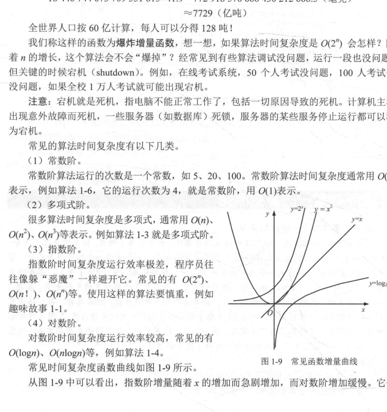
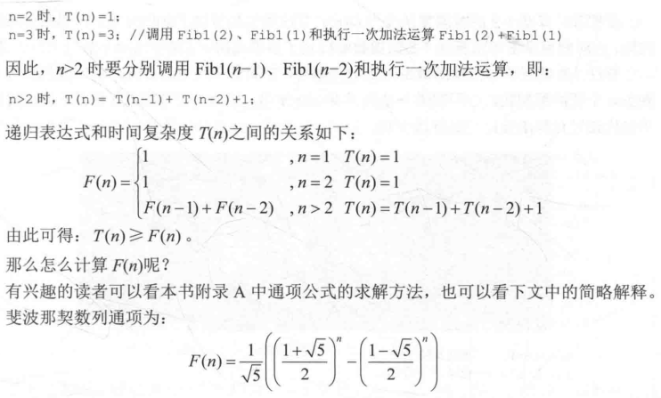

# 1.算法之美 
## 1-1.算法复杂度实现
1. 求数列之和
```cpp
//-1, 1, -1,..., (-1)^n
#include <iostream>
#include <cmath>
#include <ctime>
using namespace std;
const int n = 1e8;
int sum1(int n){
    int sum = 0;
    for (int i = 0; i <= n; i++){
        sum += pow(-1, 1);
    }
    return sum;
}
int sum2(int n){
    int sum = 0;
    if (n % 2 == 0){
        sum = 0;
    }
    else{
        sum -= 1;
    }
    return sum;
}
int main(){
    time_t s, e, sumtime;
    s = clock();
    cout << "sum: " << sum2(n) << endl;
    e = clock();
    sumtime = e - s;
    cout << "time = " << sumtime << endl;
}
```
2. 算法特性
   1. 有穷性:算法是指令组成的有穷序列，总是在执行完后结束，不停止
   2. 确定性:每条语句是确定的
   3. 可行性:算法在当前环境下可以通过有限次运算实现
   4. 输入输出
3. 好算法的标准 
   1. 正确性:无语法错误，达到预期要求
   2. 易读性:便于阅读
   3. 健壮性:对非法数据和操作有良好的处理
   4. 高效性:时间复杂度小，即算法基本运算的执行次数作为时间复杂度的衡量
   5. 低储存性:空间复杂度小,即算法占用的空间为空间复杂度的衡量

4. 时间复杂度
   1. 
   2. 定义:算法的执行次数
   3. 案例
```cpp
sum = 0;//运行1次
total = 0;//运行1次
for (i = 1; i <= n; i++){//运行n次
    sum = sum + 1;//运行n次
    for (j = 1; j <= n; j++){//运行n*n次
        total = total + i*j;//运行n*n次
    }

}
/*将所有的次数加起来，可用T(n) = 2n^2 + 2n + 2来表示
```
   3. 代表:用渐进时间复杂度上界**T(n) < O(f(n))** 来表示
5. 空间复杂度(**算法所占空间的大小**)
   1. 储存空间
      1. 输入/输入数据
      2. 算法本身
      3. 额外所需要的辅助空间(**运行时使用的辅助变量所占用的空间**)
   2. 衡量标准:**辅助空间**
   3. 案例
      1. 案例1:递归
```cpp
//递归算法的重要点是:1.结束条件，否则会死循环 2.自调用
#include <iostream>
#include<ctime>
using namespace std;

long long fac(int n)//factorial
{
    if(n<0)
        return -1;
    else if(n==0||n==1)
            return 1;
        else
            return n*fac(n-1);
}

int main()
{
    time_t s,e,sumtime;
    int n;
    cout << "请输入一个数:" << endl;
    cin>>n;
    s=clock();
    cout<<"fac("<<n<<")="<<fac(n)<<endl;
    e=clock();
    sumtime=e-s;
    cout<<"time:"<<sumtime<<endl;
    return 0;
}
```

```cpp
swap(int x, int y){
    int temp;//temp为辅助空间
    x = y;
    y = temp;
}
```
      2. 案例2：斐波那契数列

```cpp
#define _CRT_SECURE_NO_WARNINGS 1
#include<stdio.h>
#include<time.h>
#include <iostream>
using namespace std;
int fib1(int n){
    if (n == 0){
        return 1;
    }
    else if (n == 1){
        return 1;
    }
    else{
        return fib1(n-1) + fib1(n-2);
    }
}
int fib2(int n){
    double temp;
    if (n < 1){
        return 1; 
    }
    double *a = new double[n];
    a[0] = 1;
    a[1] = 1;
    for (int i = 2; i <= n; i++){
        a[i] = a[i-1] + a[i-2];
    }
    temp = a[n];
    delete[] a;
    return temp;    
    
}
int main(){
    int n;
    cout << "请输入一个数:" << endl;
    cin >> n;
    cout << "fib1("<< n <<")=" << fib1(n) << endl; 
    cout << "fib2("<< n <<")=" << fib2(n) << endl; 
}
```

# 10.其余问题
## 10-1.有关运行时间的问题
```cpp
#include <iostream>
#include <ctime>
using namespace std;
int mySum(int n){
    int sum = 1;
    for (int i = 1; i <= n; i++){
        sum *= i;
    }
    return sum;
}
void test(){
    double t1 = clock();
    mySum(100);
    double t2 = clock() ;
    double d = (t2 - t1);//以毫秒为单位
    cout << "程序的运行时间为: " << d  << "ms" << endl;
    cout << "程序的运行时间为: " << d/1000  << "s" << endl;
}
int main(){
    test();
}
```