# 1.数据结构的基本概念
## 1-1.数据
1. 定义
   1. 能输入计算机且能被计算机处理的各种符号的集合
      1. 信息的载体
      2. 是对客观实物符号化的表示
      3. 能够被计算机识别，存储和加工
2. 包括
   1. 数值型的数据：整数，实数
   2. 非数值型的数据:文字，图像，图形，声音
## 1-2.数据元素和数据项
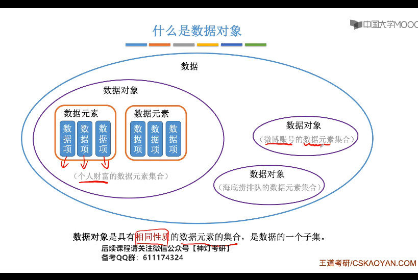
1. 数据元素
   1. 是数据的基本单位，在计算机中作为一个整体进行考虑和处理
   2. 也简称为元素，记录，顶点
2. 数据项：*构成数据元素的不可分割的最小单位*
   1. 关系：
      1. 数据>数据元素>
               1. 数据项
               2. 数据对象
      2. 例如:**学生表 >个人记录>学号**
3. 数据对象
   1. 是性质相同的数据元素的集合，是数据的子集
   2. 例如:
      1. 整数数据对象为$N = {0, +-1,+-2}$
      2. 字母字符是数据对象为$char = {'a', 'b', 'c'}$
      3. 学籍表也可看做数据对象
   3. 关系  
      1. 数据元素-组成数据的基本单位
         1. 与数据的关系:是集合的个体
      2. 数据对象-性质相同的数据元素的集合
         1. 与数据的关系: 集合的子集
4. 总结
   1. 结构
      1. *数据*
         1. 数据对象1
            1. 数据元素1
               1. 数据项1
               2. 数据项2
            2. 数据元素2
         2. 数据对象2
   2. 数据对象是具有相同性质的数据元素的集合,是数据的一个子集
   3. 数据机构存在是相互之间存在一种或者多种特定关系的数据元素的集合
## 1-3.数据结构

1. 数据结构的三要素
   1. 若采用*顺序存储*,则各个数据元素在物理上必须是连续的;若采用非顺序存储,则则各个数据元素在物理上是离散的
   2. 数据的*存储结构*会影响存储空间分配的方便程度
   3. 数据的存储结构会影响对*数据运算*的速度(**例如在b,c中插入新元素c)
      1. 运算的定义是*针对逻辑结构的*,指出运算的功能
      2. 运算的实现是*针对存储结构的*,指出运算的具体操作
2. 内容
   1. 数据元素之间的逻辑关系，为**逻辑结构**
   2. 数据元素及其关系在计算机内存中的表示(又称**映像**)，称为数据的**物理结构**或者**储存结构**
   3. **数据的运算**，即对数据元素可以施加的操作以及这些操作在相应存储结构上的实现
3. **逻辑结构**
   1. 描述数据元素之间的逻辑关系
   2. 与数据的存储无关，独立于计算机
   3. 是从具体问题抽象出来的数学模型
   4. 种类
      1. 划分方法1
         1. 线性结构:有且仅有一个开始和一个终端节点，并且所有的 节点最多*只有一个直接前趋和一个直接后继*.例如：线性表，栈，队列，串
         2. 非线性结构：一个结点可能有*多个直接前驱和直接后继*，例如：数，图
      2. 划分结构2: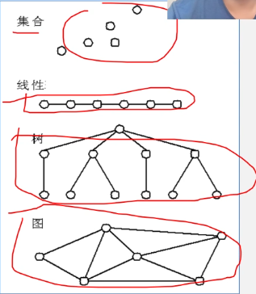
         1. 集合结构:结构中的数据元素之间除了**同属于一个集合**的关系外，无任何其他关系
         2. 线性结构:结构中的数据元素之间存在这**一对一**的线性关系
         3. 树形结构:结构中的数据元素之间存着**一对多**层次关系
         4. 图状结构：结构中的数据元素之间存在这**多对多**的任意关系
4. 物理结构
   1. 数据元素及其关系在计算机存储器中的结构(**存储方式**)
   2. 是数据结构在计算机的表示
   3. 划分结构
      1. 顺序存储结构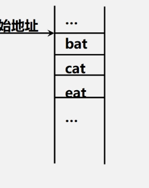
         1. 用一组*连续*的存储单元依次存储数据元素，数据元素之间的逻辑关系由元素的**存储位置**来表示
         2. C中用数组来实现顺序存储结构
      2. 链式存储结构
         1. 用一组任意的存储单元存储数据元素，数据元素之间的逻辑结构用指针来表示
         2. C中与*指针*来实现链式存储结构
      3. 索引存储结构
         1. 在存储结点信息的同时，还建立了索引表
         2. 索引表中的每一项为*索引项*
         3. 一遍形式是：(index, addr)
         4. 关键字是唯一标识一个结点的数据项
         5. 若一个结点对应1个索引，则索引表为*稠密索引*；若一组结点对应1个索引，则索引表为*稀疏索引*
      4. 散列存储结构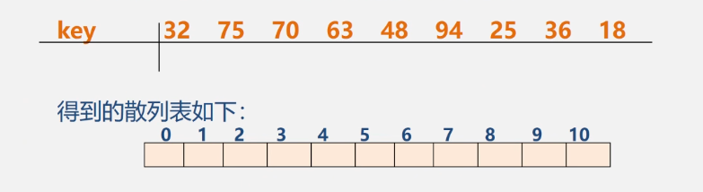
         1. 根据结点的关键字直接计算出该结点的存储地址
5. 逻辑结构和存储结构的关系
   1. 存储结构是**逻辑关系的映像和元素本身的映像**
   2. **逻辑结构是数据结构的抽象，存储结构是数据结构的实现**
6. 数据结构
   1. 逻辑结构
      1. 线性结构
         1. 线性表
         2. 栈(特殊线性表)
         3. 队列(特殊线性表)
         4. 字符串，数组， 广义表
      2. 非线性结构
         1. 树形结构
         2. 图形结构
   2. 存储结构
      1. 顺序存储
      2. 链式存储(*2, 3, 4是非顺序存储*)
      3. 索引存储
      4. 散列存储
   3. 数据运算
      1. 检索
      2. 排序
      3. 插入
      4. 删除
      5. 修改

## 1-4.数据类型和抽象数据类型
1. 在编程时，必须对程序中出现的每个变量， 常量或者表达式，明确说明他们所属的类型
   1. 例如，在C中
      1. int, float,double**基本数据类型**
      2. 数组，结构体， 共用体，枚举**构造数据类型**
      3. 指针，void类型
      4. typedef自定义
2. 高级语言中的数据类型明显或隐含地规定了程序执行期间的变量和表达所有可能的取值范围，以及在这些数值范围上所允许的操作   
   1. 例如c中，int i, 表示i从$[-min, max]$,那么它可以在整数集上面进行+-*/
   2. 作用
      1. 约束变量或者常量的*取值操作*
      2. 约束变量或者常量的*操作*
3. 数据类型和抽象数据类型
   1. 数据类型定义(Data Type): $数据类型 = 值的集合 + 值集合的操作$
   2. 抽象数据类型定义(Abstract Data Type,ADT): $抽象数据类型 = 数学模型 + 数学模型上的操作$
      1. 例如:模型 = 圆， 操作 = {面积， 周长..}
      2. 注意
         1. 由用户定义，从问题抽象出*数据模型*(逻辑结构)
         2. 包括定义在数据模型上的一组**抽象运算**
         3. 不考虑计算机内的具体存储结构和运算的具体实现算法
      3. 抽象数据类型的形式定义
         1. 用(D, S, P)三元组表示
         2. D：数据对象(data)
         3. S:D上的关系集(set)
         4. P:是对D的基本操作集(operation)
         5. 格式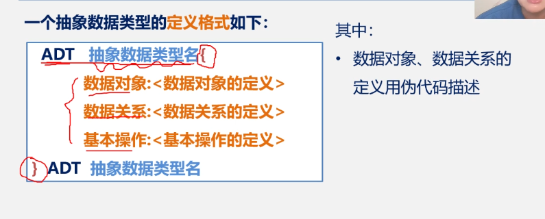
            1. 数据对象，数据关系的定义用伪代码描述
            2. 基本操作的定义格式为
               1. 基本操作名(参数表)
                  1. 赋值参数只为操作提供输入值
                  2. 引用参数以&打头，除提供输入值外，还将返回操作结果(**例如pow(&x, &y)**)
               2. 初始条件（初始条件的描述）
                  1. 描述操作执行前数据结构和参数应该满足的条件，若不满足则**操作失败**，并返回出错信息，若初始条件为空，则省略
               3. 操作结果(操作结果的描述)
                  1. 说明操作正常完成后，数据结构的变化状况和应该返回的结构
         6. 例：ADT：Circle 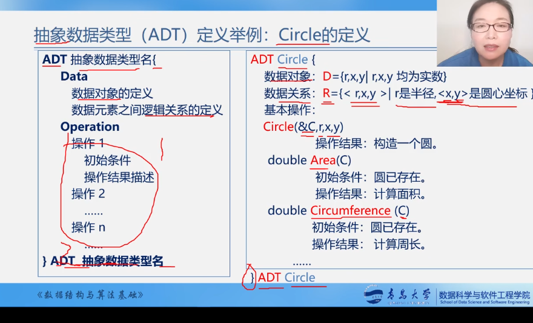

**本课程中用的是类C来描述的(介于伪代码和C语言)**
```cpp
ADT Circle{
   数据对象: D = {r, x, y | r, x, y 均是实数 }
   数据关系: R = {<r, x, y> | r为半径，<x,y>为圆心坐标}
   基本操作:
   Circle(&C,r,x,y){
      操作结果:构造一个圆
   }    
   double Area(C)
      初始条件:圆存在
      操作结构:计算面积
   double Circumference(C)
      初始条件:圆存在
      操作结果:计算周长
}ADT Circle
```
例2.定义复数
```cpp
ADT Complex{
   D = {r1, r2 | r1, r2为实数}
   S = {<r1, r2> | r1是实部， r2是虚部}
   assign (&C, v1, v2)
      初始条件:空的复数C已经存在
      操作结果:构造复数C，r1, r2分别被赋以参数v1, v2
   destroy(&C)
      初始条件:复数C已存在
      操作结构:复数C被销毁
   getReal(C, &realPart)
      初始条件：复数已经存在
      操作结果: 用realPart返回复数Z的虚部值
   getImag(C, &ImagPart)
      初始条件:复数已存在
      操作结果:用ImagPart返回复数C的虚部值
   Add(z1, z2, &sum)
      初始条件:z1,z2是复数
      操作结构：sum返回2个复数之和
}ADT Complex
```

## 1-5.算法和算法分析
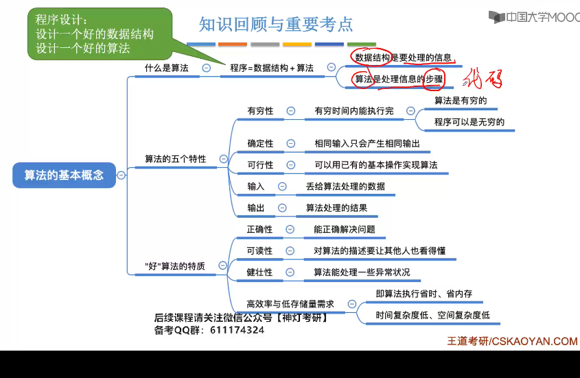
### 1.定义
1. 定义
   1. 对特定问题的求解方法和步骤的一种描述，它是指令的有限序列。其中每个指令表示一个或多个操作。
   2. <font color = red>算法解决问题的方法和步骤</font>
2. 算法的描述
   1. 自然语言：英语，中文
   2. 流程图：传统流程图，NS流程图
   3. 伪代码：类语言(类C语言)
3. 算法和程序
   1. 算法是解决问题的一种方法或一个过程，考虑如何将<font color = red>输入转换为输出</font>
   2. *程序*是用某种程序设计语言对算法的具体实现
   3. 程序 = 数据结构 + 算法
      1. 数据结构通过算法实现操作
      2. 算法由数据结构设计程序
4. 算法特性(5个特性)
   1. <font color = red>有穷性</font>:一个算法总是在执行有穷步后结束，且每一步都在有穷时间内完成
   2. 确定性：算法的每一条指令必须有确切的含义，没有二义性，在任何条件下，只有唯一的一条执行路径，即对于相同的输入只能得到相同的输出
   3. 可行性：算法是可执行的，算法描述的操作可以通过已经实现的基本操作有限次来实现
   4. 输入：一个算法有0个或多个输入
   5. 输出：有一个或多个输出
5. 算法的设计要求
   1. 正确性(Correctness):算法满足问题的要求，能正确解决问题。<font color = red>要注意</font>
      1. 程序*不含语法错误*
      2. 程序对于*几组输入数据*能够得出满足要求的结果
      3. 程序对于**精心选择的，典型，苛刻且带有刁难性的**的几组输入数据能够得出满足要求的结果
      4. 程序对于**一切合法的输入数据**都能得到满足要求的结果
      5. <font color = red>第三层</font>的正确性作为衡量算法是否合格的标准
   2. 可读性(Readability):
      1. 易于理解
      2. 晦涩难懂的算法易于隐藏较多的错误而难以调试
   3. 健壮性(Robustness):**鲁棒性**
      1. 指的是当输入*非法数据*时，算法恰当的做出反应或进行相应处理，而非产生莫名奇妙的输出结果
      2. 处理错误方法，*不是中断程序的执行*，而应是返回一个表示错误或错误性质的值，以便在更高抽象层次上处理
   4. 高效性(Efficiency)：空间复杂度和时间复杂度都比较小
### 2.算法的标准
1. 标准：首先具有正确性，然后是健壮性，可读性，在这几个方面满足的情况下，主要考虑<font color = red>算法效率</font>，通过算法效率高低来评判不同算法的优劣程度
2. 效率
   1. <font color = red>时间效率</font>：算法所耗费的时间
   2. 空间效率：算法在执行时的耗费的存储空间
   3. <font color = blue>问题：时间效率和空间效率是矛盾的</font>
3. 算法时间效率的度量
   1. 算法的时间效率可以通过编制该算法的程序在计算机上执行的所*消耗的时间*来度量
   2. 度量方法
      1. 事后统计：将算法实现，测量时间和空间开销
         1. 1个算法的运行时间是指一个算法在计算机上运行所耗费时间大致等于计算机执行一种<font color = blue>简单操作(赋值，比较，移动等)所需要的时间与算法中进行的简单操作的次数的乘积</font>
         2. 公式: 
            1. $算法运行时间 = 一个简单操作所需时间 * 简单操作次数$ < = > $\sum每条语句的执行次数(频度) x 该语句执行一次的时间$(*其中每条语句的执行次数为频度*)
            1. 每条语句的执行速度，取决于机器的**指令性能，速度和编译代码的质量**，是有机器本身的软硬件环境决定的，与算法无关
            2. 所以，<font color = red>可假执行每条语句的所需时间为*单位时间*，此时对算法的运行时间 = 该算法中所有语句的执行次数之和，即频度之和</font>
      1. 把算法所消耗的时间定义为*该算法中每条语句的频度之和*， 则上述算法的时间消耗为: T(n) = 2n^3 + 3n^2 + 2n + 1(关于n的函数)
      2. 为了便于比较不同算法的时间效率， 我们仅仅比较他们的数量级:
         1. 例如两个不同算法,时间消耗为 $T_{1}(n) = 10n^2$和$T_{2}(n) = 5n^3$，哪个好？
      3. 若有某个辅助函数f(n),使得当n趋近于无穷大时，T(n)/f(n)的极限为*不等于0的常数*，则称f(n)为T(n)的同数量级函数，记作<font color = red>T(n) = O(f(n)), 称O(f(n))为算法的渐进时间复杂度，简称时间复杂度(O = order)</font>
      4. 对于本例子,算法耗费时间:T(n) = 2n^3 + 3n^2 + 2n + 1, T(n)/n^3 = 2(n->无穷)，则T(n) = O(n^3)
      5. 注意
         1. *注意：一般情况下，不必计算所有操作的执行次数，而只考虑算法中<font color = red>基本操作</font>执行次数，用T(n)表示*, **基本语句是对执行次数贡献最大的语句**
         2. 算法中基本语句重复执行的次数是问题规模n的某个函数f(n), 算法的时间量度为:*T(n) = O(f(n))*,他表示随着增大，算法执行的时间的增长率和f(n)的增长率相同，称渐进时间复杂度。他表示随着n的增大，算法执行的时间增长率和f(n)的增长率相同，称为渐进时间复杂度。
      6. 复杂度定义：*算法中重复执行次数和算法的执行时间成正比的语句；对算法运行时间贡献最大，执行次数最多的语句*

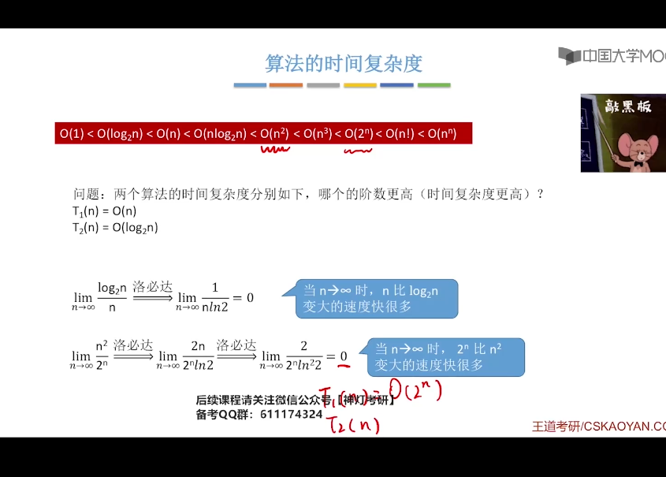
```cpp
#include <iostream>
using namespace std;
//1.方法1
void  multiMatrix(int a[][3], int b[][3]){
    int n = 3, m = 3, p = 3;//A = [nxm], B = [mxp], c = [nxp]
    int c[100][100] = {0};
    //赋值后输出
    for (int i = 0; i < n; i++){
        for (int j = 0; j < p; j++){
            for (int k = 0; k < m; k++)
            c[i][j] += a[i][k] * b[k][j];
        }
    }
    for (int i = 0; i < n; i++){
        for (int j = 0; j < p; j++){
            cout << c[i][j] << " ";
        }
        cout << endl;
    }
}
//方法2
void multiMatrixTest(){
    int a[100][100] = {0};
    int b[100][100] = {0};
    int c[100][100] = {0};
    int n = 0, m = 0, p = 0;//A = [nxm], B = [mxp], c = [nxp]
    cin >> n >> m;
    for (int i = 0; i < n; i++){
        for (int j = 0; j < m; j++){
            scanf("%d", &a[i][j]);
        }
    }
    cin >> p;
    for (int i = 0; i < m; i++){
        for (int j = 0; j < p; j++){
            scanf("%d", &b[i][j]);
        }
    }
    
    for (int i = 0; i < n; i++){
        for (int j = 0; j < p; j++){
            for (int k = 0; k < m; k++){
                c[i][j] += a[i][k] * b[k][j];
            }
        }
    }

    for (int i = 0; i < n; i++){
        for (int j = 0; j < p; j++){
                cout << c[i][j] << " ";
            }
        cout << endl;
        }
}

int main(){
    int a[3][3] = {{1, 2, 3}, {4, 5, 6}, {7, 8, 9}};
    int b[3][3] = {{1, 2, 3}, {4, 5, 6}, {7, 8, 9}};
    // multiMatrix(a, b);
    multiMatrixTest();
    
}
/*
1.1维数组传参:
1-1.整形数组:对于:int arr[10] = {0}
void test(int arr[])
void test(int arr[10])
void test(int *arr)
1-2.指针数组:对于:int *arr[20] = {0};
void test(int *arr[10])
void test(int *arr)

2.2维数组传参:例如int arr[3][5] = {0};
void test(int arr[3][5])
void test(int arr[][4])//必须知道列，行可以不知道

*/
```

### 3.分析算法复杂度的基本方法
1. 如何计算
   1. 找到一个基本操作(*最深层循环*)
   2. 分析该基本操作的执行次数x 与问题规模n的关系 x = f(n)
   3. x的数量级 O(x)是算法的时间复杂度T(n)
2. 常用技巧
   1. 加法法则 
      1. $T(n) = T1(n) + T2(n) = O(f(n)) + O(g(n)) = O(max(f(n), g(n)))$
   2. 乘法法则
      1. $T(n) = T1(n) x T2(n) = O(f(n)) xO(g(n)) = O(f(n) x g(n))$
   3. *常对幂指阶*  

3. 有的情况下，算法中基本操作重复执行的次数还随着**输入数据集**的不同而不同
   1. 最坏时间复杂度:最坏情况下，算法的时间复杂度
   2. 平均时间复杂度:所有可能输入实例在等概率出现的情下，算法的期望运行时间
   3. 最好时间复杂度:最好情况下， 算法的时间复杂度
   4. 总结：一般来说考虑**最坏时间复杂度**，因为考虑最坏情况下的时间复杂度，可以保证算法的运行时间不会比他更长
```cpp
for (i = 0; i < n; i++)
   if(a[i] == e)return i+1;//找到则返回第几个元素
return 0;

```
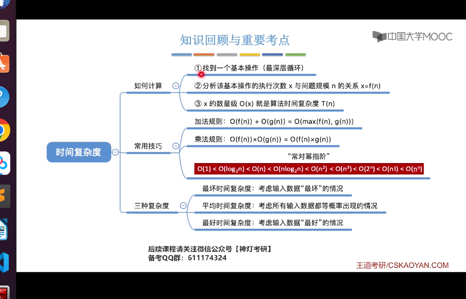

```cpp
//demo1
x = 0; y = 0;
for (int k = 0; k < n; k++)
   x++;
for (int i = 0; i < n; i++)
   for (int j = 0; j < n; j++)
      y++;
//T(n)= O(n^2)

//demo02
void exam(float x[][], int m, int n){
   float sum[];
   for (int i = 0; i < m; i++){
      sum[i] = 0;
      for (int j = 0; j < n; j++)
         sum[i] += x[i][j];//内层循环总共执行了n*m次，所以T(n) = O(n*m)
   }
   for (int i = 0; i < m; i++)
      cout << i  << ":" << sum[i] << endl;
}
// demo03
for (i = 1; i <= n; i++)//由于条件不满足要退出循环，所以要最终执行n+1次
   for (j = 1; j <=n; j++)//n(n+1)
      c[i][j] = 0;//n*n
      for (k = 0; k < n; k++)//n * n* (n+1)
         c[i][j] += a[i][k]*b[k][j]//n*n*n

/*基本操作语句为:c[i][j] += a[i][k]*b[k][j],
所以T(n) = O(n^3)(直接找内层循环)
*/
//demo 4
i = 1;
while (i <= n){
   i = i*2;//基本语句
}
/*循环执行x次，i = 2^x => 2^x <= n => x < log2n
T(n) = lg n
```

### 4.算法空间复杂度
1. 空间复杂度
   1. 定义:算法所需存储空间的度量，记作:S(n) = O(f(n)),其中n为问题的规模(大小)
   2. 算法本身要占据的空间:
      1. 输入/输出,指令，常数，变量等
      2. *算法要使用的辅助空间*
   3. 一般来说只需要关心与空间大小与问题规模相关的变量
2. 如何计算
   1. 普通程序
      1. 找到所占空间大小和问题规模相关的变量
      2. 分析所占变量x与问题规模n的关系x = f(n)
      3. x的数量级O(x)就是算法的空间复杂度S(n)
   2. 递归程序
      1. 找到递归调用的深度x与问题规模n的关系:x = f(n)
      2. x的数量级O(x)就是算法的空间复杂度S(n)
      3. *注意*:有的算法各层函数所需存储空间不同，分析方法略有区别

3. 例如
```cpp
//demo01
//将a中的n个数逆序存放在原数组中
for (i = 0; i < n/2; i++){
   t = a[i];//t为额外的存储空间，S(n) = O(1)称之为原地工作
   a[i] = a[n-i-1];
   a[n-i-1] = t;
}
//demo02
for (i = 0; i < n; i++)
   b[i] = a[n-i-1];//a[n]是辅助空间，由于a[n]和b[n]大小一样，所以S(n) = O(n)
for (i = 0; i < n; i++)
   a[i] = b[i];
//demo03
//1.逐步递增型爱你
void loveyou(int n){//n为问题的规模
   int i = 1;//爱你的程度
   while (i<=n){
      i++;//每次+1
      printf("I love you %d", i);
   }
   printf("I love you More than %d", n);
}
//无论问题规模如何变化，算法执行所需的内存空间多事固定的常量，算法的空间复杂度为S(n) = O(1)

//demo04
void test(int n){//4B
   int flag[n];//4nB
   int i;//4B
   ///......
}
/*
1.内存构成
   1-1.程序代码:大小固定，与问题规模无关
   1-2.数据:局部变量i,参数n, 数组flag[n]
2.空间大小
   2-1.假设1个int占4B,则所需内存空间 = 4 + 4n + 4 = 4n + 8
   2-2.S(n) = O(4n+8) = O(n),所以只需关系空间大小与问题规模相关的变量
*/

//demo05
void test(int n){//4B
   int flag[n][n];//n^2B
   int i;//4
}
/*
1.程序代码:大小固定，与问题规模无关，例如:void, test, (), int, ;, {}这些都属于程序代码
2.数据:i, n, flag[n][n]
3. S(n) = O(n^2)
*/

//demo06
//2.递归型爱你
void loveyou(int n){//n为问题规模
   int a, b, c;//声明一系列的局部变量
   if (n > 1){
      loveyou(n-1);
   }
   printf("I love you %d", n);
}
int main(){
   love(5);
}
/*
1. 程序代码:大小固定，与问题规模无关
2. 数据: 
   2-1.loveyou(5):n, a, b, c
   2-2.loveyou(4):n, a, b, c
   2-3.loveyou(3):n, a, b, c
   2-4.loveyou(2):n, a, b, c
   2-5.loveyou(1):n, a, b, c
3. 每一级的函数调用需要kB, 那么n级的函数调用需要nkB，当k = 5时， S(n) = O(5n) = O(n)
*/


//demo07
void loveyou(int n){//n为问题规模
   int flag[n];//声明一个数组
   if (n > 1){
      loveyou(n-1);
   }
   printf("I love you %d", n);
}
int main(){
   love(5);
}
/*
1. 程序代码:大小固定，与问题规模无关
2. 数据: 
   2-1.loveyou(5):n, flag[5], S(n) = 1 + 5
   2-2.loveyou(4):n, flag[4], S(n) = 1 + 4
   2-3.loveyou(3):n, flag[3], S(n) = 1 + 3
   2-4.loveyou(2):n, flag[2], S(n) = 1 + 2
   2-5.loveyou(1):n, flag[1], S(n) = 1 + 1
3. S(n) = 1 + 2 +...+ n = n(n+1)/2 = O(n^2)
*/
```
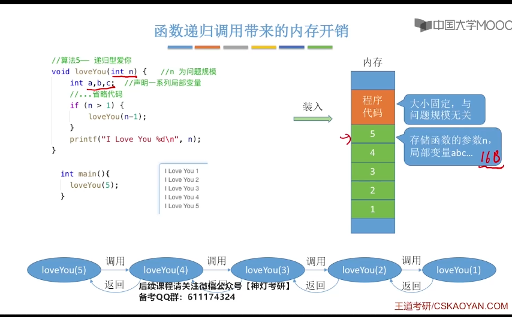


# 2.数据结构的基本概念

## 2-1.线性表的定义和特点
1. 定义:线性表是具有**相同特性的数据元素**的一个*有限序列*, 其中n为表长， 当n = 0时线性表是一个空表。若用L命名线性表，则其一般表示为:L = (a1, a2,...,ai-1,..,an)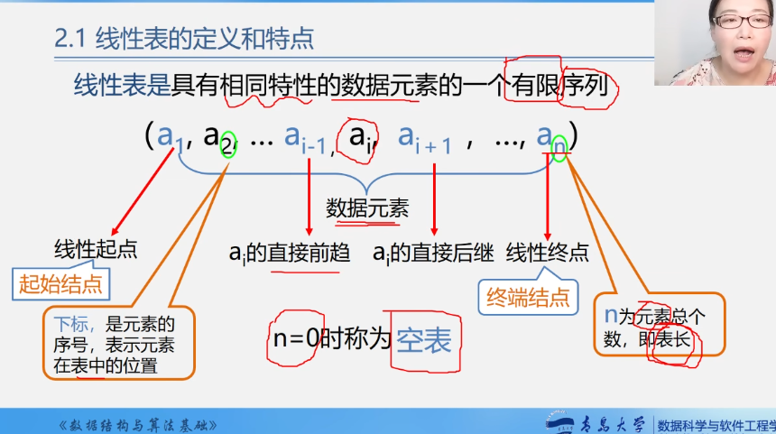
   1. ai是线性表的"第i个"元素线性表中的位序
   2. a1是表头元素, an是表尾元素
   3. 除第一个元素外，每个元素都有且仅有1个直接前驱;除最后一个元素外，每个元素有且仅有1个*直接后继*
2. 线性表的基本操作
   1. InitList(&L):初始化表。构造1个空的线性表，分配内存空间
   2. DestroyList(&L):销毁操作。销毁线性表，并释放线性表L中所占用的存储空间
   3. ListInsert(&L, i, e):插入操作。在表L的第i个位置插入制定元素e
   4. ListDelete(&L, i, &e):删除操作。删除表L中第i个位置的元素，并用e返回删除元素的值
   5. LocateElem(L, e):按值查找操作。在表L中查找具有给定关键字值的元素
   6. GetElem(L, e):按位查找操作。获取L中第i个位置的元素的值
   7. 其他常用操作
      1. Length(L):求表长，返回线性表L的长度，即L中数据元素的个数
      2. PrintList(L):输出操作。按前后顺序输出线性表L的所有元素值
      3. Empty(L):判空操作。若L为空表，则返回true, 否则返回false
   8. TIPs
      1. 对数据的操作:增删改查
      2. &的意义：例如ListInsert(&L, i, e):表示将插入后的修改的list带回来

## 2-2.顺序表

### 1.顺序表的定义
1. 定义：用*顺序存储的方式实现线性表顺序存储。把**逻辑**上相邻的元素存储在物理位置上也相邻的存储结构上，元素之间的关系由存储单元的邻接关系来体现
2. 内存中：设线性表的第1个元素的存放位置是LOC(L),LOC是location的缩写
3. 顺序表的实现:静态分配


4. 案例
   1. demo01
```cpp
#define MaxSize 10//定义最大长度
typedef struct{
   ElemType data[MaxSize];//用静态的数组存放数据元素
   int length;//顺序表的当前长度
}Sqlist;//顺序表的类型定义(静态分配方式)
/*
内存
a1
a2
a3
a4
a5
//给各个数据元素分配连续的存储空间，大小为MaxSize*sizeof(ElemType)
*/
```
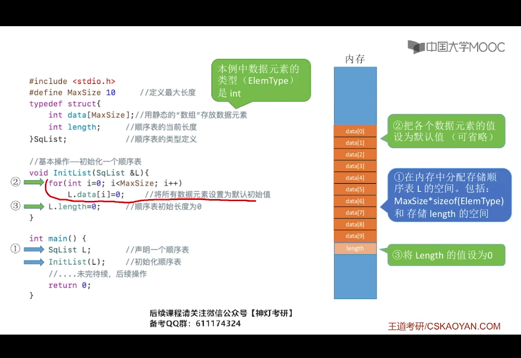
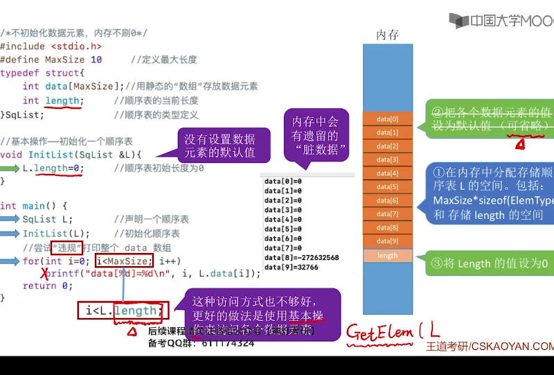
   2. demo02(顺序表的静态分配)
```cpp
#include <stdio.h>
#define MaxSize 10 //定义最大长度
typedef struct{
   int data[MaxSize];//用静态的"数组"存放数据元素
   int length;//顺序表的当前长度
}SqList;//顺序表的类型定义
//1.方法1
//基本操作-初始化一个顺序表
void InitList(SqList &L){
   for (int i = 0; i < MaxSize; i++){
      L.data[i] = 0;//将所有的数据元素设置为默认初始值
   }
   L.length = 0;//顺序表初始长度为0
}
//2.方法2
void InitList(SqList &L){
   L.length = 0;//顺序表初始长度为0
}
int main(){
   SqList L;//SequenceList
   InitList(L);
   //尝试违规打印整个数组
   //不能使用i < MaxSize这种结构，否则会导致数组越界,应该要用i<L.length
   return 0;
}

```
```cpp
#include <stdio.h>
#include <iostream>
using namespace std;
#define MaxSize 10 //定义最大长度
typedef struct{
   int data[MaxSize];//用静态的"数组"存放数据元素
   int length;//顺序表的当前长度
}SqList;//顺序表的类型定义
//基本操作-初始化一个顺序表
void InitList(SqList &L){
//    for (int i = 0; i < MaxSize; i++){
//       L.data[i] = 0;//将所有的数据元素设置为默认初始值
//    }
   L.length = 0;//顺序表初始长度为0
}
int main(){
   SqList L;//SequenceList
   InitList(L);
   //若是i < L.length,则不会打印,若是i < MaxSize,由于没有在data中设置初始值,所以data[i]中的数可能为任意的脏数据
   for (int i = 0; i < L.length; i++){
      printf("data[%d] = %d\n", i, L.data[i]);
   }
   /*
   注意点:
   1.要初始化数组元素
   2.打印数组元素要用i < MaxSize而不是i < L.length
   3.静态分配
   #define MaxSize 10 //定义最大长度
   typedef struct{
      int data[MaxSize];//用静态的"数组"存放数据元素
      int length;//顺序表的当前长度
   }SqList;//顺序表的类型定义
   4.静态分配的问题:
      4-1.静态分配一旦分配完成就不可更改
      4-2.但是如果刚开始就分配一个很大的空间例如data[10000], 就会造成内存浪费
   */
   return 0;
}
```
   3. demo03(顺序表的动态分配)
      1. 动态申请和释放内存:malloc, free函数
         1. L.data = (ElemType*)malloc(sizeof(ElemType)*InitSize);
         2. 含义:
            1. malloc返回1个指针,需要强制转型为你定义的数据元素类型的指针,malloc是返回data这一整片元素区域头地址
            2. 比如说:int *data; L.data = (int *)malloc(sizeof(int) * InitSize);
            3. 在c++中,就是new, delete关键字
      2. 顺序表的特点
         1. 随机访问:可以在O(1)时间内找到第i个元素
         2. 存储密度高,每个节点只存储数据元素
         3. 拓展容量不方便(即便采用动态方式,拓展长度的时间复杂度也比较高)
```cpp
#define InitSize 10 //顺序表的初始长度
typedef struct{
   ElemType *data; //指示动态分配数组的指针
   int MaxSize;    //顺序表的最大容量
   int length; //顺序表的当前长度
}SqList;//顺序表的类型定义
/*
1.动态申请和释放内存
malloc, free函数
L.data = (ElemType*)malloc(sizeof(ElemType)*InitSize);
2.含义:
   2-1.malloc返回1个指针,需要强制转型为你定义的数据元素类型的指针,malloc是返回data这一整片元素区域头地址
   2-2.比如说:int *data; L.data = (int *)malloc(sizeof(int) * InitSize);
   2-3.在c++中,就是new, delete关键字
*/
```
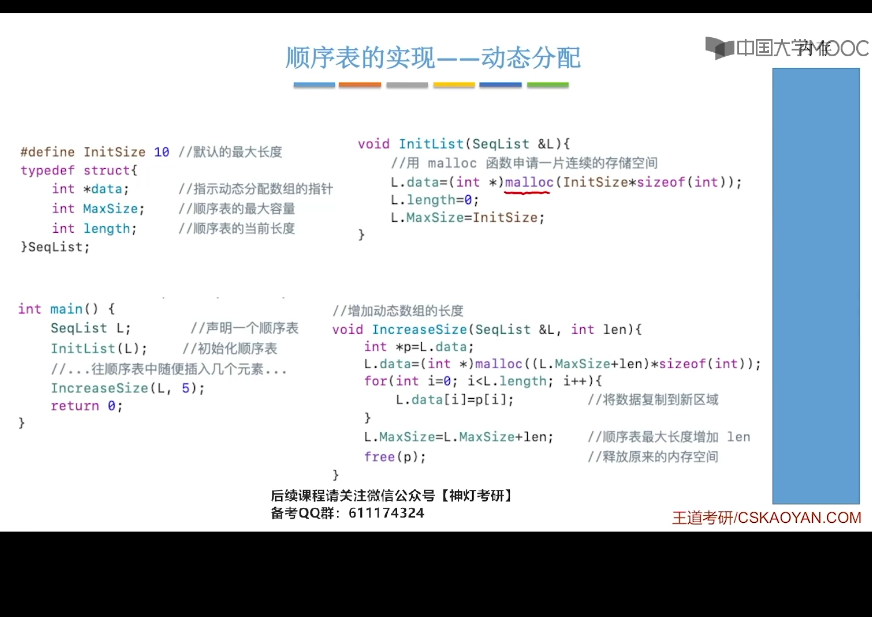


```cpp
#include <stdlib.h>
#define InitSize 10 //默认最大长度
typedef struct{
   int *data;//指示动态分配数组的指针
   int MaxSize;//顺序表的最大容量
   int length;//顺序表的当前长度
}SeqList;
void InitList(SeqList &L){
   //用malloc申请一片连续的存储空间
   L.data = (int *)malloc(InitSize * sizeof(int));
   L.length = 0;
   L.MaxSize = InitSize;
}
void IncreaseSize(SeqList &L, int len){
   int *p = L.data;
   L.data = (int *)malloc((L.MaxSize + len) * sizeof(int));
   for (int i = 0; i < L.length; i++){
      L.data[i] = p[i];//将数据复制到新区域
   }
   L.MaxSize = L.MaxSize + len;//顺序表最大长度增加len
   free(p);//释放原来的内存空间
/*
1. MaxSize指的是最大的容量,但是length是装了多少值,  length <= MaxSize  
2.malloc是申请1整片指向data[0]地址的空间
3.*p = &data[0], p[0] = data[0];
*/
}
```
改进版
```cpp
#include <iostream>
using namespace std;
#define InitSize 10
class SeqList{
    public:
        int length;
        int MaxSize;
        int *data;
};
void InitList(SeqList &L){
    L.data = new int(InitSize * sizeof(int));
    L.MaxSize = InitSize;
    L.length = 5;
}

void IncreaseList(SeqList &L, int len){
    int *p = L.data;
    L.data = new int((InitSize + len) * sizeof(int));
    for (int i = 0; i < L.length; i++){
        L.data[i] = p[i];
    }
    L.MaxSize = L.MaxSize + len;
    delete p;
}
void InsertList(SeqList &L){
    for (int i = 0; i < L.length; i++){
        L.data[i] = i;
    }
}
void PrintList(SeqList &L){
    for (int i = 0; i < L.length; i++){
        cout << L.data[i] << endl;
    }
}
int main(){
    SeqList L;
    InitList(L);
    InsertList(L);
    IncreaseList(L, 5);
    PrintList(L);
}
```
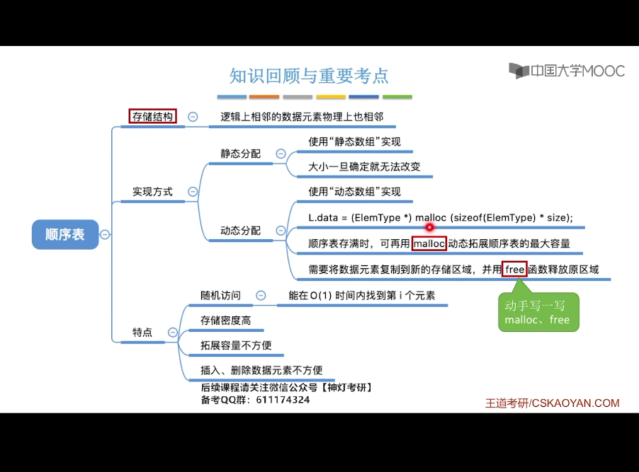


### 2.顺序表的插入和删除
1. ListInsert(&L, i, e)插入:在表L的第i个位置上插入指定元素e **由于顺序表的逻辑结构是连续的,所以顺序表在某个位置的插入和删除必定会导致后面元素的后移和前移**
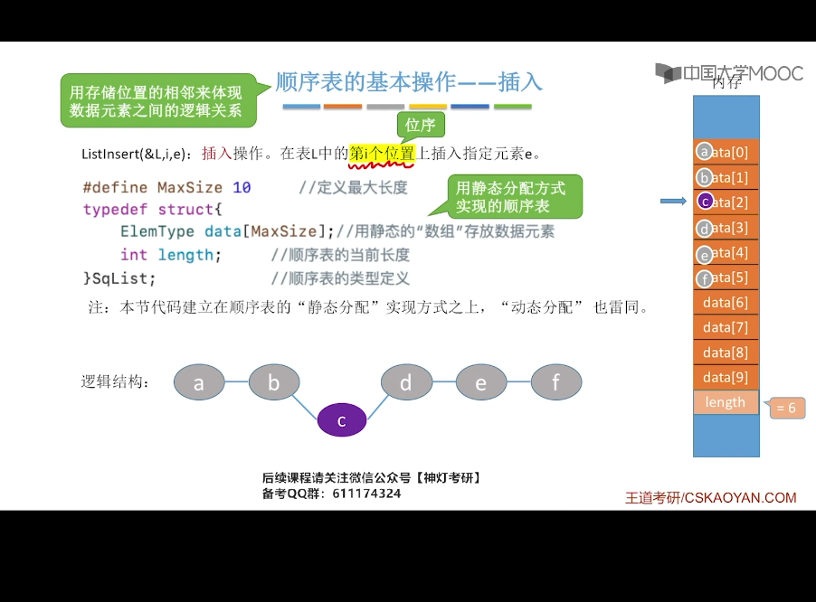

```cpp
#define MaxSize 10//定义最大长度
typedef struct{
   int data[MaxSize];//用静态的"数组"存储数据元素
   int length;//顺序表的当前长度
}SqList;//顺序表的类型定义
void ListInsert(SqList &L, int i, int e){
   for (int j = L.length; j>=i; j--){
      L.data[j] = L.data[j-1];
   }
   L.data[i-1] = e;//在位置i处放入e
   L.length++;//长度加1
}
int main(){
   SqList L;//声明一个顺序表
   InitList(L);//初始化顺序表
   //....插入几个元素
   ListInsert(L, 3, 3);
   return 0;
}