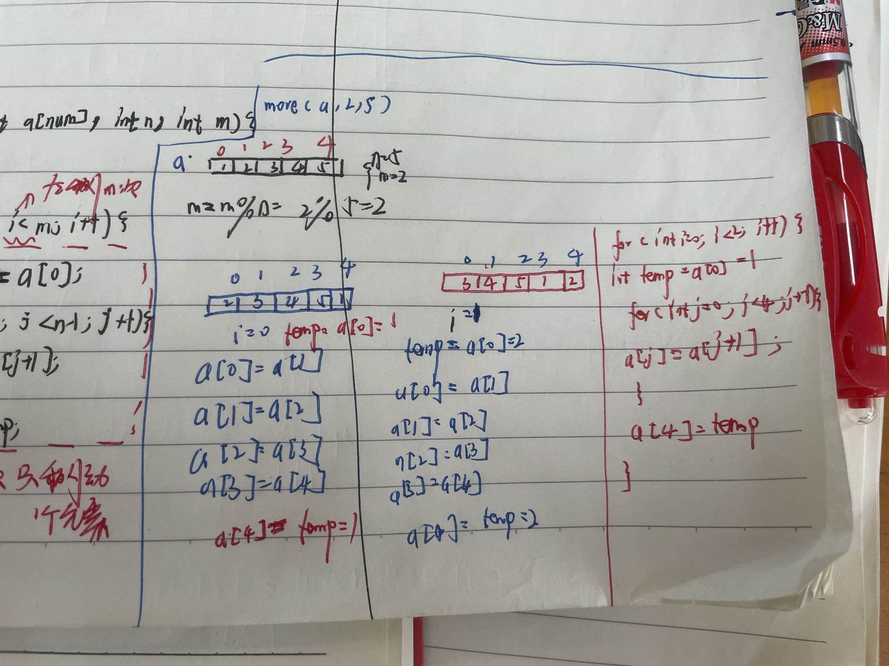

# 1.时间复杂度和空间复杂度
## 1-1.概念
1. 定义:算法中**基本操作的执行次数**为时间复杂度
2. 大O渐进表示法
   1. 推导大O表示法:
      1. 用1取代运行时间中的所有加法常数
      2. 在修改后的运行次数函数中， 只保留最高阶项
      3. 如果最高阶项存在且不是1，则去除与这个项目相乘的常数，得到的就是O阶
   2. 通过上面的计算，Func1执行次数: $F(N) = N^2 + N*2 + 10$,所以实际上我们只需要知道大概的执行次数，那么需要用到大O表示法，所以$T(n) = O(N^2)$
   3. 有的情况下，算法中基本操作重复执行的次数还随着**输入数据集**的不同而不同
      1. 最坏时间复杂度:最坏情况下，算法的时间6来说考虑**最坏时间复杂度**，因为考虑最坏情况下的时间复杂度，可以保证算法的运行时间不会比他更长
3. 空间复杂度
   1. 定义:算法所需存储空间的度量，记作:S(n) = O(f(n)),其中n为问题的规模(大小)
   2. 算法本身要占据的空间:
      1. 输入/输出,指令，常数，变量等
      2. *算法要使用的辅助空间*
   3. 一般来说只需要关心与空间大小与问题规模相关的变量
   4. 如何计算
      1. 普通程序
      2. 找到所占空间大小和问题规模相关的变量
      3. 分析所占变量x与问题规模n的关系x = f(n)
      4. x的数量级O(x)就是算法的空间复杂度S(n)
      5. 递归程序
         1. 找到递归调用的深度x与问题规模n的关系:x = f(n)
         2. x的数量级O(x)就是算法的空间复杂度S(n)
         3. *注意*:有的算法各层函数所需存储空间不同，分析方法略有区别
   5. 总结:**时间复杂度不计算时间，计算大概的运算次次数;空间复杂度不计算空间，计算大概定义的变量个数*
```cpp
//demo01
void Func1(int N){
    int count = 0;
    for (int i = 0; i < N; ++i){
        for (int j = 0; j < N; ++j){
            ++count;//N**2
        }
    }
    for (int k = 0; k < 2 * N; ++k){
        ++count;
    }
}
int M = 10;
while (M--){
    ++count;
}
printf("%d\n", count);
//T(n) = O(n^2)

//demo02
void Func2(int N){
    int count = 0;
    for (int k = 0; k < 2 * N; ++k){
        ++count;//N
    }
    int M = 10;
    while (M--){
        ++count;//M
    }
    printf("%d\n", count);
}
//T(n) = O(N+M)

//demo03
void Func4(int N){
    int count = 0;
    for (int k = 0; k < 100; k++){
        ++count;
    }
    printf("%d\n", count);
}
//T(n) = O(1)

//demo04
void BubbleSort(int* a, int n){
    assert(a);
    for (size_t end = n; end > 0; ++end){
        int exchange = 0;
        for (size_t i = 1; i < end; ++i){
            if (a[i-1] > a[i]){
                Swap(&a[i-1], &a[i]);
                exchange = 1;
            }
        }
        if (exchange == 0)
            break;
    }
}
/*
假设有n个数排列，第一个数要排n-1次，第2个数要排n-2,...,第n个数要排1次，所以F(n)
F(n) = 1 + 2 + ...+ n-1 = n(n-1)/2
1.最坏T(n) = O(n^2)
2.最好T(n) = O(n),每个数各排一次，所以为O(n)
*/

//demo05
#include<iostream>
#include <assert.h>
#include <vector>
using namespace std;
/*
1.二分法的条件是有序数组,且必须是从小到大排列的有序数列
2.二分法的原理(从小到大):当中间项大于目标项，右缩区间:right = middle-1；当中间项小于目标项，左缩区间left = middle + 1,
当>,<都不满足时，中间项就是目标
3.时间复杂度
3-1.最坏时间复杂度T(n) = O(log_2 n),假设该数组有N个元素，
一直查找，直至只剩下1个元素:N/2/2/2/2.../2 = 1，
所以N = 2^x(x为查找的次数)，所以x = log2N(类似于折纸，折了x次，只剩下1个元素，所以N = 2^x),
3-2.最好时间复杂度:O(1)
*/
// 定义target在[left, right]区间
int search(vector<int>& nums, int target) {
	int left = 0;
	int right = nums.size() - 1; // 定义target在左闭右闭的区间里，[left, right]
	while (left <= right) { // 当left==right，区间[left, right]依然有效，所以用 <=
		int middle = left + ((right - left) / 2);// 防止溢出 等同于(left + right)/2
		if (nums[middle] > target) {
			right = middle - 1; // target 在左区间，所以[left, middle - 1]
		} else if (nums[middle] < target) {
			left = middle + 1; // target 在右区间，所以[middle + 1, right]
		} else { // nums[middle] == target
			return middle; // 数组中找到目标值，直接返回下标
		}
	}
	// 未找到目标值
	return -1;
	//int(-2.6)=-3,int(2.6)=2,int函数是向下取整函数，所以，int函数的值应该是比自变量还要小的整数。
}

int main(){
	vector<int> v = {9, 5, 4, 3, 2};
	
	cout << search(v, 9) << endl;
}
//时间复杂度T(n) = O(log_2 n),

//demo06
//计算阶乘的时间复杂度
//size_t 类型表示C中任何对象所能达到的最大长度，它是无符号整数。此处等价与int
long long Factorial(size_t N){
	if (N == 0 || N == 1)
		return 1;
    return Factorial(N-1) * N;//1次
}
int main(){
	long long a = Factorial(0);
	cout << a << endl;
}
/*
1.递归算法计算: T(n) = 递归次数 * 每次递归函数的次数，
所以此例，递归次数 = N(!100则递归了100次)，每次递归函数的次数 = 1，所以为O(N)
*/
//*****************空间复杂度**********************//
//demo01
//计算bubblesort的空间复杂度
void BubbleSort(int* a, int n){
    assert(a);
    for (size_t end = n; end > 0; ++end){
        int exchange = 0;
        for (size_t i = 1; i < end; ++i){
            if (a[i-1] > a[i]){
                Swap(&a[i-1], &a[i]);
                exchange = 1;
            }
        }
        if (exchange == 0)
            break;
    }
}
//a, n, end, exchange, i一共5个，故S(n) = O(1)
//空间复杂度是计算变量的个数

//demo01
long long* Fibonacci(size_t n){
    if (n == 0)
        return NULL
    long long* fibArray = (long long*)malloc(n + 1) * sizeof(long long);//开辟了n+1个的空间，所以S(n) = O(n)
    fibArray[0] = 0;
    fibArray[1] = 1;
    for (int i = 2; i <= n; i++){
        fibArray[i] = fibArray[i-1] + fibArray[i-2];
    }
    return fibArray;
}

//demo02
long long Factorial(size_t N){
    return N < 2 ? N : Factorial(N-1) * N;
}
//递归了n次，所以为O(n)

```
## 1-2.oj
>方法:画图+思考+笔记
1. 消失的数字
   1. 描述:数组nums包含从0到n的所有整数，但其中缺了一个。请编写代码找出那个缺失的整数。你有办法在O(n)时间内完成吗？
   2. 求解
```cpp
class Solution {
public:
    int missingNumber(vector<int>& nums) {
        int n = nums.size();
        int total = n * (n + 1) / 2;
        int arrSum = 0;
        for (int i = 0; i < n; i++) {
            arrSum += nums[i];
        }
        return total - arrSum;
    }
};
//arrSum比total少了消失的一个数字，所以消失的数字为total-arrSum
```
2. 消失的数字
   1. 描述:一个整型数组 nums 里除两个数字之外，其他数字都出现了两次。请写程序找出这两个只出现一次的数字。要求时间复杂度是O(n)，空间复杂度是O(1)。
   2. 题解
```cpp
#include<iostream>
#include <assert.h>
#include <vector>
using namespace std;
//设nums = [4, 4, 5, 3]
vector<int> singleNumber(vector<int>& v){
	int ret = 0;
    for (int i = 0; i < v.size(); i++){
        ret ^= v[i];
    }
	int m = 0;//假设找到第m位
	while (m < 32){
		if(ret & (1<<m))//1左移m位
			break;
		else
			++m;
	}
	//分离
	int x1 = 0, x2 = 0;
	for (int i = 0; i < v.size(); i++){
		if (v[i] & (1<<m)){
			//1左移m位就可以判断第m为为1还是为0，因为此时已经找到3^5中第1为0的位，那么就可以用这个位将3和5分开
			x1 ^= v[i];
		}
		else{
			x2 ^= v[i];
		}
	}
	// vector<int> v1 = {x1, x2}; 
    // return v1;//方法2
    return vector<int>{x1, x2}
	
    /**
	 * @brief 
	 * 1.数组中所有数异或，那么出现2次的数字都^没了,ret = x1^x2
	 * 
	 * 2. 下一步是想办法分离出x1和x2,假设x2 = 5 = 0101, x1 = 3 = 0011, v = [4, 4, 5, 3], 4 = 0100
	 * 所以
	 * 	2-1.0101 ^ 0011 = 0110(同0异1 = 6)
	 * 	2-2.找出ret里面第M位为1的，说明x1和x2的第M位不一样(若是一样的话
	 * 那么第M位就为0)
	 * 
	 * 3.取数组中分离出x1和x2:第M位为1的为1组，第M位为0的为1组
	 * 最终得到，x1和x2各在一组，其他的数成对出现在1，2组中的某一组
	 * (由于相同的数^为0，所以他们一定会被分到同一组)
	 * 	3-1.原理:由于ret不为0，所以在在ret的32位数字中至少有1位为1，
	 * 所以通过1<<m 来寻找第一个不为0的位，再 与ret，若为true,
	 * 直接跳出循环
	 * 	3-2.推导
	 * def1 = {ret & m |
 	 * 	0110 &  0001 = 0000 = false,此时由于第0位为1，所以1需要左移一位得到
	 * 0010}
	 * def2 = {ret & m | 0110 & 0010 = true, 此时第1位1， 所此时直接跳出循环}
	 * 
	 * 4.分离
	 * 对v[i] & (1<<m), 此时(1<<m) = 0010,
	 * sol1: 3 & (1<<m) = (0011) & (0010) = 0010 = true, x1 = 3
	 * sol2: 5 & (1<<m) = (0101) & (0010) = 0000 = false, x2 = 5
	 * sol3: 4 & (1<<m) = (0100) & (0010) = 0000 = false, x2 = 5 ^ 4
	 * sol4: 4 & (1<<m) = (0100) & (0010) = 0000 = false, x2 = 5 ^ 4 ^ 4 = 5(相同的项被分到同一组的时候被异或为0,实际上
     * 相同的项被分到哪一组都不重要，因为最后他们异或为0)
	 * res = {g1, g2 | g1 = {3}, g2 = {5}}
	 */
	
}
```
   1. 算法 
      1. 思路:如果除了一个数字之外，其余数字都出现了2次，那么如何找到出现1次的数字?->进行*异或*操作，对每个操作数的每一位，相同结果为0, 不同结果为1。那么在计算过程中，成对出现的所有数字的所有位会两两抵消为0，最终得到的结果是出现1次的数字
      2. 那么如何将这一方法扩展到找出2个出现1次的数字？把所有的数字分成2组，使得
         1. 2个只出现1次的数字在不同的组中
         2. 相同的数字会被分到相同的组中。那么对这2个组分别进行异或操作，就可以得到答案
      3. 步骤
         1. 先对所有数字进行一次异或，得到两个出现一次的数字的异或值。
         2. 在异或结果中找到任意为1的位
         3. 根据这一位对所有的数字进行分组。
         4. 在每个组内进行异或操作，得到两个数字


# 2.链表和顺序表
## 2-1.数组
### 1.数组基本概念
1. 优点:(**内存是连续的**)
   1. 下标访问(随机访问),T(n) = O(1)
   2. 末尾位置增加删除元素的时间复杂度是O(1), 无论是查找和删除任意一个元素，所花费的*时间*是一样的
   3. 访问元素前后相邻位置的元素非常方便(可以通过指针的$++, --$来访问)
2. 缺点
   1. 非末尾位置增加删除元素需要进行大量的数据移动
   2. 搜索的时间复杂度
      1. 无序数组-线性搜索O(n)
      2. 有序数组-二分搜索O(logn)
   3. 数组扩容消耗比较大
3. 注意:
   1. int arr[10] = {0, 1, 2, 3};(arr[0] - arr[9])
      1. 若是arr[10], 则数组发生越界
   2. 搜索的时间复杂度
      1. 下标访问: T(n) = O(1)
	  2. 线性搜索:T(n) = O(n)
      ```cpp
      for (int i = 0; i < 10; i++){
      	if (arr[i] == val){
			xxx
      	}
      }
      ```
4. demo
```cpp
//demo01
#include <iostream>
#include <time.h>
using namespace std;
class Array
{
public:
   Array(int size = 10): mCur(0), mCap(size){
      mpArr = new int[mCap];
   } 
   ~Array(){
      delete[] mpArr;
      mpArr = NULL;
	  	/**
		 * @brief 
		 * 1.把指针指向的堆的内存释放掉了，
		 * 指针本身还存了堆的内存地址，所以要将mpArr = NULL，
		 * 防止野指针出现
		 */
   }
public:
   void push_back(int val){
      if (mCur == mCap){
         expand(2 * mCap);
      }
      mpArr[mCur++] = val;
   }
   void pop_back(){
      if (mCur == 0) return;
      mCur--;
   }
   void insert(int pos, int val){
      if (pos < 0 || pos > mCur) return;
      for (int i = mCur - 1; i >= pos; i--){
         mpArr[mCur + 1] = mpArr[mCur];
      }
      mpArr[pos] = val;
      mCur++;
   }
   void erase(int pos){
      if (pos < 0 || pos >= mCur) return;
      for (int i = pos; i < mCur - 1; i++){
         mpArr[i] = mpArr[i + 1];
      }
      mCur--;
   }
   int find(int val){
      for (int i = 0; i < mCur; i++){
         if (mpArr[i] = val){
            return i;
         }
      }
      return -1;
   }
   void show() const {
      for (int i = 0; i < mCur; i++){
         cout << mpArr[i] << " ";
      }
      cout << endl;
   }
private:
	void expand(int size){
		//1.新开辟一个空间
		int* p = new int[size];
		//2.将旧空间拷贝到新空间
		//由于每个字节大小为sizeof(int), 所以总的大小为sizeof(int) * mCap
		memcpy(p, mpArr, sizeof(int) * mCap);
		//3.释放旧空间
		delete[] mpArr;//将老内存释放掉
		//4.将成员变量mpArr初始化,指向新内存
		mpArr = p;
		//5.将容量直接扩大为size, 但是mCur不变，因为拷贝后元素个数不变
		mCap = size;

		/**
		 * @brief 
		 * 1. expand是内部接口来扩容的，所以要设置为private
		 * 2. 扩容方法
		 * 	2-1.在原有的基础上定义一个原来内存大小2倍的内存
		 * 	2-2.把原来内存中的数据拷贝到新内存上
		 * 	2-3.将原来的内存释放掉
		 *  2-4.将所有成员变量重新初始化
		 */
		//在原有的方法下定义新的内存，
	}
   
private:
	int* mpArr; //指有向可扩容的数组内存, mpArr = memberPointerArr
	int mCap; //数组的容量, mCap = memberCapacity
	int mCur; //数组的效元素个数，mCur = memberCurrent
}; 

int main(){
   Array arr;
   srand(time(0));
   for (int i = 0; i < 10; i++){
      arr.push_back(i);
   }

   arr.insert(0, 100);
   arr.show();
}
```
### 2.oj
#### 2-1.元素逆序问题
```cpp
//demo02:元素逆序问题
#include<iostream>
#include <string.h>
using namespace std;
void ReverseArr(char arr[], int size){
    char* p = arr;
    char* q = arr + size - 1;
    while (p < q){
        char temp = *p;
        *p = *q;
        *q = temp;
        p++;
        q--;
    }  
}
int main(){
    char arr[] = "abcdef";
    ReverseArr(arr, strlen(arr));
    cout << arr << endl;
}

/**
 * @brief 思路
 * 1.p = 0, q = size - 1;
 * 2.每次都交换一次, p++, q--
 * 3. 结束条件:p < q(因为 p = q时，自己和自己交换，没有任何意义)
 */
```
#### 2-2.双指针实现调换 
```cpp
#include <iostream>
#include <time.h>
#include <string.h>//包含strlen
/**
 * @brief
 * 1.描述:有一个整形数组，需要把偶数调整到数组的左边，把奇数调整到数组的右边
 * 
 * 2.思路:利用p, q指针，判断p是否指向一个奇数，q是否指向的一个偶数， 
 * 若是， 将p, q调换；否则当*p为偶数，*q为奇数的时候，直接continue.
 * 
 * 3.关于16进制: 12AF = 0x12AF(这是在c中16进制的表示方法)
 * *p & 000001 = 000000: *p的第一位为0，则res = 0, *p = 偶数 
 * *p & 000001 = 000001: *p的第一位为1，则res = 1, *p = 奇数 
 */

void AdjustArray(int arr[], int size){
	int* p = arr;
	int* q = arr + size - 1;
	while (p < q){
		//p->奇数
		if ((*p % 0x1) == 0 ){//
		//有位操作，一定把括号加上，因为位操作的优先级低于==
			p++;
			continue;	
		}
		//q <- 奇数
		if ((*q & 0x1) == 1){
			q--;
			continue;
		}
		//p->奇数， q->偶数
		int tmp = *p;
		*p = *q;
		*q = tmp;
		p++;
		q--;
	}
}
```
#### 2-3.移除数组
   1. 问题描述:给你一个数组 nums 和一个值 val，你需要 原地 移除所有数值等于 *val* 的元素，并返回移除后数组的新长度。不要使用额外的数组空间，你必须仅使用 O(1) 额外空间并 原地 修改输入数组。

```cpp
#include<iostream>
#include <string.h>
#include <vector>
using namespace std;
//demo01
int removeElem1(vector<int>& v, int val){
    vector<int>::iterator p, q;
    p = v.begin();
    q = v.begin() +  v.size() - 1;
    while (p <= q){
        if (*q == val){
            q--;
            continue;
        }
        if (*p == val){
            *p = *q;
            q--;
        }
        else{
            p++;
        }
    } 
    return p - v.begin();   
}
//demo2
int removeElem2(int* nums, int size, int val){
    int *p = nums; 
    int *q = nums + size - 1;
    p = nums;
    while (p <= q){
        if (*q == val){
            q--;
            continue;
        }
        if (*p == val){
            *p = *q;
            q--;
        }
        else{
            p++;
        }
    }
    return p - nums;
}
//demo3
int removeElem3(vector<int>& v, int val){
    int left = 0;
    for(int right = 0; right < v.size(); right++){
        if (v[right] != val){
            v[left] = v[right];
            left++;
        }
    }
    return left;
}

int main(){
    vector<int> v = {1, 2, 2, 3, 3, 4};
    int nums[] = {1, 2 ,2, 3, 3, 4};
    int* mpArr = nums;
    int a1 = removeElem1(v, 3);
    int a2 = removeElem2(mpArr, 6, 3);
    int a3 = removeElem3(v, 3);
    cout << a1 << endl;
    cout << a2 << endl;
    cout << a3 << endl;
}

```
#### 2-3.删除有序数组中的重复项
   1. 返回数组中不含重复项的元素个数
```cpp
#include <iostream>
#include <stdio.h>
#include <stdlib.h>
#include <assert.h>
#include <vector>
using namespace std;
int removeDuplicates(vector<int>& v){
	int n = v.size();
	int slow = 1;//第一个数绝对不是重复项，所以要从第二项开始比
	for (int fast = 1; fast < n; fast++){
		if (v[fast - 1] != v[fast]){
			v[slow] = v[fast];
			slow++;
		}
	}
	return slow;
}

int main(){
	vector<int> v = {1, 2, 3, 3, 3};
	int a = removeDuplicates(v);
	cout << a << endl;
}
/**
 * @brief
 * 1.要点:
 * 	1-1.对于有序数组而言，重复项一定是连在一起
 * `1-2.fast和slow指针分别为遍历数组要到达的位置，
 * 下一个不同元素要填入的下标位置
 * 
 * 2.执行逻辑
 * v = [0, 0, 1, 1, 2, 3, 4],所以用fast遍历数组中的每一个值
 * 若v[fast - 1] != v[fast], 那么v[fast]和之前的元素都不同，所以
 * 将fast的值赋值给slow, v[slow] = v[fast]
 * 3.双指针的作用是统计数据，但是对于原来的vector的数据不会更改
 */
```
#### 2-4.数组形式的整数加法
   1. 描述:整数的 数组形式  num 是按照从左到右的顺序表示其数字的数组.例如，对于 num = 1321 ，数组形式是 $[1,3,2,1]$ 。给定 num ，整数的 数组形式 ，和整数 k ，返回 整 数 num + k 的 数组形式 。

```cpp
#include <iostream>
#include <vector>
#include <algorithm>
using namespace std;
 vector<int> addToArrayForm(vector<int>& num, int k) {
     vector<int> res;
     int n = num.size();
     for (int i = n - 1; i >= 0; --i) {
         int sum = num[i] + k % 10;//取个位数
         k /= 10;//去掉个位数
         if (sum >= 10) {
	//若每一位相加>=10,那么最后1位加1，sum减10，类似于39 + 25 = 64(个位数相加为14,所以十位+1，个位-10)
             k++;
             sum -= 10;
         }
         res.push_back(sum);
     }
     reverse(res.begin(), res.end());
     return res;
 }

/**
 * @brief 
 * 1.思路:让我们逐位将数字加在一起。例如计算 123+912123+912，我们从低位到高位依次计算 3+23+2、2+12+1 和 1+91+9。任何时候，若加法的结果大于等于 1010，
 * 把进位的 11 加入到下一位的计算中，所以最终结果为 10351035。
 * 2.取得个位，十位数..的方法
 * 	2-1.个位:num % 10 (num是int类型)
 * 	2-2.十位:num / 10 % 10 (num / 10后仍然是int类型)
 * 	2-3.思路：不管取得几位数，想要取得最后1位数，就需要用%10来取余数来获取，
 * 以123为例，想要获取2， 需要将最后以为去掉，变成12， 然后12的个位数
 */
```
#### 2-5.合并2个有序数组
   1. *描述*:给你两个按 非递减顺序 排列的整数数组 nums1 和 nums2，另有两个整数 m 和 n ，分别表示 nums1 和 nums2 中的元素数目。请你 合并 nums2 到 nums1 中，使合并后的数组同样按 非递减顺序 排列。
   2. 注意：最终，合并后数组不应由函数返回，而是存储在数组 nums1 中。为了应对这种情况，nums1 的初始长度为 m + n，其中前 m 个元素表示应合并的元素，后 n 个元素为 0 ，应忽略。nums2 的长度为 n 。
```cpp
class Solution {
public:
    void merge(vector<int>& nums1, int m, vector<int>& nums2, int n) {
        for (int i = 0; i != n; ++i) {
            nums1[m + i] = nums2[i];
        }
        sort(nums1.begin(), nums1.end());
    }
};

```
#### 2-6.旋转数组
1. 旋转数组
   1. 描述:给你一个数组，将数组中的元素向右轮转 k 个位置，其中 k 是非负数。
   2. 实例：
      1. >输入: nums = [1,2,3,4,5,6,7], k = 3
      2. >输出: [5,6,7,1,2,3,4]
      3. >解释:
         1. >向右轮转 1 步: [7,1,2,3,4,5,6]
         2. >向右轮转 2 步: [6,7,1,2,3,4,5]
         3. >向右轮转 3 步: [5,6,7,1,2,3,4]

```cpp
class Solution {
public:
    void rotate(vector<int>& nums, int k) {
        int n = nums.size();
        vector<int> newArr(n);
        for (int i = 0; i < n; ++i) {
            newArr[(i + k) % n] = nums[i];
        }
        nums.assign(newArr.begin(), newArr.end());
    }
};
```
#### 2-7.左移数组
   1. 描述:将含n个元素的数组左移m位，并输出翻转后的数组
   2. 求解

```cpp
//demo01
//1.左移数组
#include <stdio.h>
#include <stdlib.h>
using namespace std;
#define num 100
int a[num];
void Move(int a[num],int n,int m);

int main()
{
	int n,m;
	scanf("%d %d",&n,&m);//输入
	for(int i=0;i<n;i++)
	{
		scanf("%d",&a[i]);
	}
	Move(a,n,m);//移动
	for(int i=0;i<n-1;i++)//输出
	{
		printf("%d ",a[i]);
	}printf("%d",a[n-1]); 
}
void Move(int a[num],int n,int m)//循环左移
{
	//n为数组元素个数，m为移动数组的个数
	m=m%n;
	for(int i=0;i<m;++i)//循环次数
	{
		int temp = a[0];
		for(int j=0;j<n-1;j++)//移动n-1个数
		{
			a[j]=a[j+1];    
		}
		a[n-1]=temp;
		//第n个数为开始的数，即a[n-1] = a[0]
		//由于此时移动过后，将原来的a[0]覆盖掉了，所以需要将a[n-1] = temp而非a[n-1] = a[0]
	}
}

/**
 * @brief 
 * 1. 要点:Move(v, 5, 2);则对v含5个元素的数组v左移2位
 * 	1-1.循环2次，第一层循环为移动次数;第二层循环是将数组元素移动一位
 * 	1-2.第2层循环
 * 
 */


// 2.实现求最大公因数。前提是a > 0 , b > 0
//Greatest Common Divisor

int gcd(int a, int b)
{
    if(a % b == 0) return a;
    return gcd(b, a % b);

}
/**
 * @brief
 *  最大公约数的递归：
 * 1、若a可以整除b，则最大公约数是b
 * 2、如果1不成立，最大公约数便是b与a%b的最大公约数
 * 示例：求(140,21)
 * 140%21 = 14
 * 21%14 = 7
 * 14%7 = 0
 * 返回7
 * 
 */
```

```cpp
//aggregation
#include<iostream>
#include<vector>
using namespace std;
void moveRight(vector<int>& v, int k){
	int n = v.size();
	vector<int> res(n);
	for (int i = 0; i < n; i++){//是 i < n而非i < n-1
		res[(i + k) % n] = v[i];
	}
	v.assign(res.begin(), res.end());//将新数组拷贝至原数组,顺序不要搞反了
}


void moveLeft(vector<int>& v, int k){
	int n = v.size();
	for (int i = 0; i < k; i++){
		int temp = v[0];
		for (int j = 1; j < n; j++){
			v[j - 1] = v[j];
		}
		v[n - 1] = temp; 
	}
}

void printArray(vector<int>& v){
	for (int i = 0; i < v.size(); i++){
		cout << v[i] << "  ";
	}
	cout << endl;
}

int main(){
	vector<int> v = {1, 2, 3, 4};
	moveRight(v, 3);
	printArray(v);
}
```
 

## 2-2.链表
### 1.链表的特点
1. 特点：每个节点都是在堆内存上独立new出来的，节点内存不连续
   1. 优点:
      1. 内存利用率高:**数组的内存必须是连续的，如果存在不连续的低容量空间的话，则会开辟失败**
      2. 插入和删除节点不需要移动其他节点，T(n) = O(1)
      3. 不需要专门扩容
      4. 链表的每个节点都是独立分配的，分为数据域和指针域，所以指针域可以从当前节点找到下一个节点
   2. 缺点	
      1. 内存占用大，每个节点多出存放地址的空间
      2. 节点内存不连续，无法进行内存随机访问
      3. 链表搜索效率不高，只能从头节点开始逐节点遍历
2. 单链表的特点
   1. 单链表的无法从当前节点跳到下一个节
   2. 头节点是地址域为NULL的节点，当新增加一个节点的时候，会把下一个节点的地址写到头节点的地址域中，所以在*单链表的实现上一般会加1个头节点*

### 2.链表的增删改查

```cpp
#include <iostream>
#include <stdlib.h>
#include <time.h>
using namespace std;

// 节点类型
struct Node
{
    Node(int data = 0) :data_(data), next_(nullptr) {}
    int data_;
    Node* next_;
};

// 单链表代码实现
class Clink
{
public:
   Clink()
   {
      // 给head_初始化指向头节点
      head_ = new Node();
   }
   ~Clink(){
      Node* p = head_;
      while (p != NULL){
         /**
          * @brief 
          * head_用来遍历节点，p用来删除节点
          * head_往后移，删除前一个节点p,将head_赋给p
          */
         head_ = head_->next_;
         delete p;
         p = head_;
      }
      
   }

public:
   //1.单链表的插入和删除
   // 1-1.链表尾插法 O(n)   head_:头节点    tail_:尾节点
   void InsertTail(int val)
   {
      // 先找到当前链表的末尾节点
      Node* p = head_;
      while (p->next_ != nullptr)
      {
         p = p->next_;
      }

      // 生成新节点
      Node* node = new Node(val);
      // 把新节点挂在尾节点的后面
      p->next_ = node;
   }
   // 1-2.链表的头插法  O(1)
   void InsertHead(int val)
   {
      Node* node = new Node(val);
      node->next_ = head_->next_;
      head_->next_ = node;
   }
   //1-3.头删
   void RemoveFront(){
      Node* p = head_->next_;
      head_->next_ = p->next_;
      delete p;
   }
   //1-4.尾删
   void RemoveBack(){
      Node* q = head_;
      Node* p = head_->next_;
      while (p->next_ != NULL){
         p = p->next_;
         q = q->next_;
      }
      q->next_ = NULL;
      delete p;
   }
   //3.按值删除
   void Remove(int val){
      Node* q = head_;//将q指向头节点，q的意义在于找到p的前驱节点，使得能够q->next = p->next
      Node* p = head_->next_;//将p指向头节点的后1个节点，p的意义在于遍历节点
      while (p != NULL){
         if (p->data_ == val){
            q->next_ = p->next_;
            delete p;
            return;
         }
         else{
            q = p;//q = q->next;
            p = p->next_;
         }
      }
   }
   //删除多个节点(删除所有值为val的节点)
   void RemoveAll(int val){
      Node* q = head_;
      Node* p = head_->next_;
      while (p != NULL){
         if (p->data_ == val){
            q->next_ = p->next_;
            delete p;
            //对指针p进行重置
            p = q->next_;
         }
         else{
            q = p;
            p = p->next_;
         }
      }
   }
   //4.按位置插入
   void InsertPos(int pos, int val){
      if (pos < 1){
         return;
      }
      Node* s = head_;
      int i = 1;
      while (s->next_ != NULL && i < pos){
         s = s->next_;//寻找到目标位置的前一个位置节点
         i++;
      }
      if (pos > i){
         return;
      }
      Node* node = new Node(val);
      node->next_ = s->next_;
      s->next_ = node;    
   }
   //5.按值插入
   void InsertVal(int pval, int val){
      Node* node = new Node(val);//pval为值为pval的节点
      Node* p = head_;
      while (p != NULL){
         if (p->data_ == pval){
            //若是插在值为pval节点前面,则是p->next_->data_ = pval,此时p在pval节点的前面
            //若是插在值为pval节点后面,则是p->data_ = pval,此时p在pval节点的位置
            break;
         }
         p = p->next_;
      }
      node->next_ = p->next_;
      p->next_ = node;
   }
   //6.搜索O(n)
   bool Find(int val){
      Node* p = head_->next_;
      while (p != NULL){
         if (p->data_ == val){
            return true;
         }
         else{
            p = p->next_;
         }
      }
      return false;
   }

   void Show()
   {
      Node* p = head_->next_;
      while (p != nullptr)
      {
         cout << p->data_ << " ";
         p = p->next_;
      }
      cout << endl;
   }
public:
    Node* head_; // 指向链表的头节点
    friend void ReverseLink(Clink &link);//友元函数类似于成员函数，可以访问所有的私有成员和私有属性
    friend bool GetLastKNode(Clink &link, int k, int &val);//友元函数类似于成员函数，可以访问所有的私有成员和私有属性
};

//1.单链表逆序
//核心思想：把p指针指向的节点按头插法插入到上面的节点中
// void ReverseLink(Clink &link){
//    Node* p = link.head_->next_;
//    if (p == NULL){
//       return;
//    }
//    link.head_->next_ = NULL;
//    while (p != NULL){
//       Node* q = p->next_;
//       //p指针指向的节点进行头插
//       p->next_ = link.head_->next_;
//       link.head_->next_ = p;
//       p = q;
//    }
// }

//2.获得倒数第K个节点
bool GetLastKNode(Clink &link, int k, int &val)
{
   Node* head = link.head_;
   Node* pre = head;
   Node* p = head;
   for (int i = 0; i < k; i++){
      p = p->next_;
      if (p == NULL){
         return false;
      }
   }
   //pre在头节点, p在正数第k个节点
   while (p != NULL && pre != NULL){//当p = NULL时就停下来
      pre = pre->next_;
      p = p->next_;
   }
   val = pre->data_;
   return true;
}

//2.获得倒数第K个节点
bool getKthFromEnd(Clink& link, int k, int &val)
{
   Node* head = link.head_;
   Node* p = head;
   Node* pre = head;
   for (int i = 0; i < k; i++){
      p = p->next_;
      if (p == NULL){
         return false;
      }
   }
   while (p != NULL && pre != NULL){
      pre = pre->next_;
      p = p->next_;
   }
   val = p->data_;
   return true;
   /**
    * @brief 
    * 核心思想:
    * 1.定义2个节点p = prev = head, 利用p对链表进行遍历，直至到第k个节点停止
    * 2.对p和prev一起向后移动，当p到NULL时结束遍历，此时的prev指向的值就是倒数第k个节点的值
    * 
    */
}

//3.合并2个有序链表
Node* MergeLink(Clink& link1, Clink& link2){
   Node* p = link1.head_->next_;//p,q分别为第一个节点的指针
   Node* q = link2.head_->next_;
   Node* preHead = new Node(-1);//新定义一个节点作为合并和的节点
   Node* prev = preHead;//
   while (p != NULL && q != NULL){//当且仅当p,q = NULL时,遍历就会停止,0 && 0 = 0,(0 = p != NULL),此时遍历结束
      if (p->data_ < q->data_){
         prev->next_ = p;
         p = p->next_;
      }
      else{
         prev->next_ = q;
         q = q->next_;
      }
      prev = prev->next_;
   }
   prev->next_ = p == NULL ? q : p;
   //合并后p, q最多只有1个未合并完,我们直接在将链表末尾指向未合并完的链表
   return preHead->next_;//返回头节点的下一个节点
}

void ShowResult(Node* p){
   Node* ptr = p->next_; 
   while (p != NULL)
   {
      cout << p->data_ << " ";
      p = p->next_;
   }
   cout << endl;
   }
//4.

int main(){
   Clink link1;
   Clink link2;
   srand(time(0));
   // for (int i = 0; i < 10; i++){
   //    int val = rand() % 100;
   //    link.InsertHead(val);
   //    cout << val << " ";
   // }
   // cout << endl;
   link1.InsertTail(1);
   link1.InsertTail(2);
   link1.InsertTail(3);
   link1.InsertTail(4);
   link2.InsertTail(3);
   link2.InsertTail(4);
   link2.InsertTail(5);
   // link.InsertPos(3, 4);//第3个节点的后面插入4
   // link.InsertVal(3, 188);//值为3的节点后面插入188
   // link.RemoveBack();
   // link.RemoveFront();
   // int kval;
   // // int k = 3;
   // // if (GetLastKNode(link, 3, kval)){
   // //    cout << "倒数第" << k <<"个节点的值为" << kval << endl;
   // // }
   Node* p = MergeLink(link2, link1);
   ShowResult(p);

}
```


4. 综合

```cpp
#include<iostream>
#include<vector>
using namespace std;
typedef int SListDataType;
struct SListNode{
	SListDataType data;
	SListNode* next;	
};
//1.创建节点
SListNode* BuySListNode(SListDataType x){
    SListNode* newNode = (SListNode*)malloc(sizeof(SListNode));
    if (newNode == NULL){
        printf("申请节点失败\n");
        exit(-1);
    }
    newNode->data = x;
    newNode->next = NULL;
    return newNode;
}
//2.打印节点
void SListPrint(SListNode* phead){//phead = pointerhead
	SListNode* cur = phead;
	while (cur != NULL){
		printf("%d->", cur->data);
		cur = cur->next;
	}
	printf("NULL\n");
	
}

void SListPushBack(SListNode** pphead, SListDataType x){
	//param1:传入的指针，param2:传入的值
    
	//找尾
	//1.先开辟一个节点
    SListNode* newNode = BuySListNode(x);//申请一个newNode
	
	//2.判断节点是否为空
    if (*pphead == NULL){
        *pphead = newNode;
    }
    else
    {
        SListNode* tail = *pphead;//让tail指向头结点
		//pphead接受的1级指针的地址，那么*pphead就是1级指针的值，即phead
        while(tail->next != NULL){
            //空指针的解引用
            tail = tail->next;
        }
		tail->next = newNode;
    }
   
}
void SListPopBack(SListNode** pphead){
	//1.空
	if (*pphead == NULL){//为空
		return; 
	}
	else if((*pphead)->next == NULL){
		free(*pphead);//把节点直接干掉
		*pphead = NULL;//*pphead存的是pList的地址,所以*pphead = pList = NULL
	}
	else{
		SListNode* prev = NULL;
		SListNode* tail = *pphead;
		while (tail->next != NULL){
			prev = tail;
			tail = tail->next;
		}
		free(tail);
		prev->next = NULL;
	}
	//2.1个节点
	//1.1个以上节点
}

int main(){
	SListNode* pList = NULL;
	//*pList = NULL则是这个节点本身地址为NULL,pList->next = NULL,则是他指向的下一个地址为空
	SListPushBack(&pList, 1);//此处要用2级指针
	SListPushBack(&pList, 2);
	SListPushBack(&pList, 3);
	SListPushBack(&pList, 4);
	SListPrint(pList);

	/**
	 * @brief 
	 * 1. SListPushBack()中传入的是指针，但是SListPushBack中
	 * 接受的是指针，所以类似于值传递一样:
	 * void swap(int x, int y)
	 * swap(a, b)
	 * 
	 * 二者等同
	 * 
	 * void swap(int* x, int* y)
	 * swap(a, b) (*a = &c, *b = &d)
	 * 所以要改变x,y的值，要采用2级指针
	 * 
	 * 2.关于双指针的结论：
		1.若是pptr = &ptr ; ptr = &var---->var = *ptr(一级指针的值) = **pptr(二级指针的值)  
		2.p,*p,&p的关系：*是寻址符号，&是地址符号，p为变量值，所以*p为p值(地址)的解引用，&p为p的地址,p为值,
			有多少个*,就解引用多少次,解引用就是对地址进行寻址，  *(&p) = p
		3.int var, *ptr, **pptr(实际上定义的虽然是**pptr,但是指针变量是*ptr,同理可得ptr)--->  
		4.int **pptr------>*pptr为指针变量地址，**pptr为指针变量值
			当满足&var = ptr, &ptr = pptr时候：
				1.var = *ptr = **pptr(取值）,//重点****
				2.&var = ptr = *pptr(取址)//把*prt想成对prt的值进行解析，即进行指向
					示意图
				var       ptr       pptr 
			   d1 3000<---d2 d1 <---d3 d2
		5.分开来看:
		ptr = &var
		*ptr = *(&var) = var //ptr指针的值就是var的地址,*ptr是直接对var地址取值
		pptr = &ptr
		*pptr = *(&ptr) = ptr = &var
		**pptr = *(*pptr) = *(&var) = var    
		注意:每次在p前加入一个*,相当于对p进行 一次取值,
		6.对于**pptr,当未定义的时候，只能取得,pptr,&pptr,不能取得,*pptr,**pptr
		若var = 30,*pptr = &var,(pptr = &var是错误的),此时*(*pptr) = *(&var) = 30
		所以对于**pptr，*pptr = &var,即是保证2次寻址，pptr = &var就是1次寻址了，因为此时
		*pptr = *(&var) = 30,**pptr就失去了意义    
		7.指针和数组：int arr[]= {.......},int * ptr = arr<------> ptr = arr <---> ptr[i] = arr[i]        
	 */
}
```
### 3.链表Oj
1. 反转链表
   1. 代码
```cpp
void ReverseLink(Clink& link){
   Node* p = link.head_->next_;
   link.head_->next_ = NULL;   
   while (p != NULL){
      Node* q = p->next_;
      p->next_ = link.head_->next_;
      link.head_->next_ = p;
      q = p;
   }
}
```
   2. >原理:将p指向的节点按头插法插入到后面的节点中


2. 求倒数第K个节点的值

```cpp
//方法1
struct Node{
    Node(int data = 0): data(data), next(NULL){}
    int data;
    Node* next;
};
Node* getKthFromEnd(Node* head, int k)
{
    int n = 0;
    Node* node = nullptr;
    for (node = head; node; node = node->next) {
        n++;
    }
    for (node = head; n > k; n--) {
        node = node->next;
    }
    return node;
}

//方法2
//2.获得倒数第K个节点
bool getKthFromEnd(Clink& link, int k, int &val)
{
   Node* head = link.head_;
   Node* p = head;
   Node* pre = head;
   for (int i = 0; i < k; i++){
      p = p->next_;
      if (p == NULL){
         return false;
      }
   }
   while (p != NULL && pre != NULL){
      pre = pre->next_;
      p = p->next_;
   }
   val = p->data_;
   return true;
}
   /**
    * @brief 
    * 核心思想:
    * 1.定义2个节点p = prev = head, 利用p对链表进行遍历，直至到第k个节点停止
    * 2.对p和prev一起向后移动，当p到NULL时结束遍历，此时的prev指向的值就是倒数第k个节点的值
    * 
    */
```

3. 合并2个有序链表

```cpp
struct Node
{
    Node(int data = 0) :data_(data), next_(nullptr) {}
    int data_;
    Node* next_;
};

class Clink
{
public:
   Clink()
   {
      // 给head_初始化指向头节点
      head_ = new Node();
   }
   ~Clink(){
      Node* p = head_;
      while (p != NULL){
         /**
          * @brief 
          * head_用来遍历节点，p用来删除节点
          * head_往后移，删除前一个节点p,将head_赋给p
          */
         head_ = head_->next_;
         delete p;
         p = head_;
      }
      
   }
    Node* head_; 
}
Node* MergeLink(Clink& link1, Clink& link2){
   Node* p = link1.head_->next_;//p,q分别为第一个节点的指针
   Node* q = link2.head_->next_;
   Node* preHead = new Node(-1);//新定义一个节点作为合并和的节点
   Node* prev = preHead;//
   while (p != NULL && q != NULL){//当且仅当p,q = NULL时,遍历就会停止,0 && 0 = 0,(0 = p != NULL),此时遍历结束
      if (p->data_ < q->data_){
         prev->next_ = p;
         p = p->next_;
      }
      else{
         prev->next_ = q;
         q = q->next_;
      }
      prev = prev->next_;
   }
   prev->next_ = p == NULL ? q : p;
   //合并后p, q最多只有1个未合并完,我们直接在将链表末尾指向未合并完的链表
   return preHead->next_;//返回头节点的下一个节点
}

int main(){
   Clink link1;
   Clink link2;
   srand(time(0));
   // for (int i = 0; i < 10; i++){
   //    int val = rand() % 100;
   //    link.InsertHead(val);
   //    cout << val << " ";
   // }
   // cout << endl;
   link1.InsertTail(1);
   link1.InsertTail(2);
   link1.InsertTail(3);
   link1.InsertTail(4);
   link2.InsertTail(3);
   link2.InsertTail(4);
   link2.InsertTail(5);
   // link.InsertPos(3, 4);//第3个节点的后面插入4
   // link.InsertVal(3, 188);//值为3的节点后面插入188
   // link.RemoveBack();
   // link.RemoveFront();
   // int kval;
   // // int k = 3;
   // // if (GetLastKNode(link, 3, kval)){
   // //    cout << "倒数第" << k <<"个节点的值为" << kval << endl;
   // // }
   Node* p = MergeLink(link2, link1);
   ShowResult(p);
}
```


