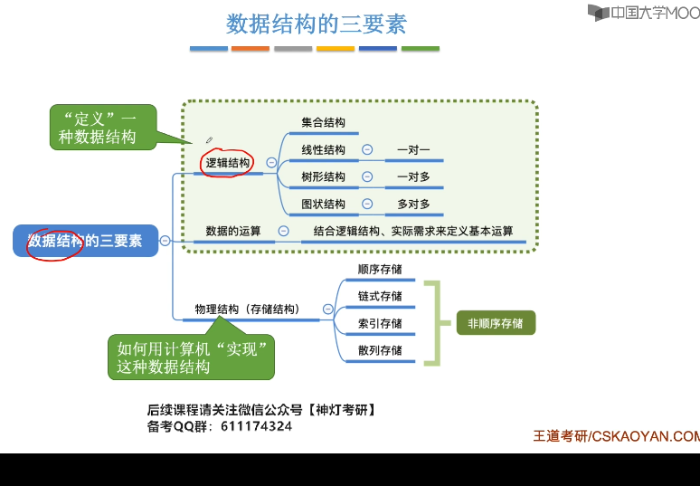

# 1.数据结构的基本概念
## 1-1.数据
1. 定义
   1. 能输入计算机且能被计算机处理的各种符号的集合
      1. 信息的载体
      2. 是对客观实物符号化的表示
      3. 能够被计算机识别，存储和加工
2. 包括
   1. 数值型的数据：整数，实数
   2. 非数值型的数据:文字，图像，图形，声音
## 1-2.数据元素和数据项

1. 数据元素
   1. 是数据的基本单位，在计算机中作为一个整体进行考虑和处理
   2. 也简称为元素，记录，顶点
2. 数据项：*构成数据元素的不可分割的最小单位*
   1. 关系：
      1. 数据>数据元素>
               1. 数据项
               2. 数据对象
      2. 例如:**学生表 >个人记录>学号**
3. 数据对象
   1. 是性质相同的数据元素的集合，是数据的子集
   2. 例如:
      1. 整数数据对象为$N = {0, +-1,+-2}$
      2. 字母字符是数据对象为$char = {'a', 'b', 'c'}$
      3. 学籍表也可看做数据对象
   3. 关系  
      1. 数据元素-组成数据的基本单位
         1. 与数据的关系:是集合的个体
      2. 数据对象-性质相同的数据元素的集合
         1. 与数据的关系: 集合的子集
4. 总结
   1. 结构
      1. *数据*
         1. 数据对象1
            1. 数据元素1
               1. 数据项1
               2. 数据项2
            2. 数据元素2
         2. 数据对象2
   2. 数据对象是具有相同性质的数据元素的集合,是数据的一个子集
   3. 数据机构存在是相互之间存在一种或者多种特定关系的数据元素的集合
## 1-3.数据结构

1. 数据结构的三要素
   1. 若采用*顺序存储*,则各个数据元素在物理上必须是连续的;若采用非顺序存储,则则各个数据元素在物理上是离散的
   2. 数据的*存储结构*会影响存储空间分配的方便程度
   3. 数据的存储结构会影响对*数据运算*的速度(**例如在b,c中插入新元素c)
      1. 运算的定义是*针对逻辑结构的*,指出运算的功能
      2. 运算的实现是*针对存储结构的*,指出运算的具体操作
2. 内容
   1. 数据元素之间的逻辑关系，为**逻辑结构**
   2. 数据元素及其关系在计算机内存中的表示(又称**映像**)，称为数据的**物理结构**或者**储存结构**
   3. **数据的运算**，即对数据元素可以施加的操作以及这些操作在相应存储结构上的实现
3. **逻辑结构**
   1. 描述数据元素之间的逻辑关系
   2. 与数据的存储无关，独立于计算机
   3. 是从具体问题抽象出来的数学模型
   4. 种类
      1. 划分方法1
         1. 线性结构:有且仅有一个开始和一个终端节点，并且所有的 节点最多*只有一个直接前趋和一个直接后继*.例如：线性表，栈，队列，串
         2. 非线性结构：一个结点可能有*多个直接前驱和直接后继*，例如：数，图
      2. 划分结构2:
         1. 集合结构:结构中的数据元素之间除了**同属于一个集合**的关系外，无任何其他关系
         2. 线性结构:结构中的数据元素之间存在这**一对一**的线性关系
         3. 树形结构:结构中的数据元素之间存着**一对多**层次关系
         4. 图状结构：结构中的数据元素之间存在这**多对多**的任意关系
4. 物理结构
   1. 数据元素及其关系在计算机存储器中的结构(**存储方式**)
   2. 是数据结构在计算机的表示
   3. 划分结构
      1. 顺序存储结构
         1. 用一组*连续*的存储单元依次存储数据元素，数据元素之间的逻辑关系由元素的**存储位置**来表示
         2. C中用数组来实现顺序存储结构
      2. 链式存储结构
         1. 用一组任意的存储单元存储数据元素，数据元素之间的逻辑结构用指针来表示
         2. C中与*指针*来实现链式存储结构
      3. 索引存储结构
         1. 在存储结点信息的同时，还建立了索引表
         2. 索引表中的每一项为*索引项*
         3. 一遍形式是：(index, addr)
         4. 关键字是唯一标识一个结点的数据项
         5. 若一个结点对应1个索引，则索引表为*稠密索引*；若一组结点对应1个索引，则索引表为*稀疏索引*
      4. 散列存储结构
         1. 根据结点的关键字直接计算出该结点的存储地址
5. 逻辑结构和存储结构的关系
   1. 存储结构是**逻辑关系的映像和元素本身的映像**
   2. **逻辑结构是数据结构的抽象，存储结构是数据结构的实现**
6. 数据结构
   1. 逻辑结构
      1. 线性结构
         1. 线性表
         2. 栈(特殊线性表)
         3. 队列(特殊线性表)
         4. 字符串，数组， 广义表
      2. 非线性结构
         1. 树形结构
         2. 图形结构
   2. 存储结构
      1. 顺序存储
      2. 链式存储(*2, 3, 4是非顺序存储*)
      3. 索引存储
      4. 散列存储
   3. 数据运算
      1. 检索
      2. 排序
      3. 插入
      4. 删除
      5. 修改

## 1-4.数据类型和抽象数据类型
1. 在编程时，必须对程序中出现的每个变量， 常量或者表达式，明确说明他们所属的类型
   1. 例如，在C中
      1. int, float,double**基本数据类型**
      2. 数组，结构体， 共用体，枚举**构造数据类型**
      3. 指针，void类型
      4. typedef自定义
2. 高级语言中的数据类型明显或隐含地规定了程序执行期间的变量和表达所有可能的取值范围，以及在这些数值范围上所允许的操作   
   1. 例如c中，int i, 表示i从$[-min, max]$,那么它可以在整数集上面进行+-*/
   2. 作用
      1. 约束变量或者常量的*取值操作*
      2. 约束变量或者常量的*操作*
3. 数据类型和抽象数据类型
   1. 数据类型定义(Data Type): $数据类型 = 值的集合 + 值集合的操作$
   2. 抽象数据类型定义(Abstract Data Type,ADT): $抽象数据类型 = 数学模型 + 数学模型上的操作$
      1. 例如:模型 = 圆， 操作 = {面积， 周长..}
      2. 注意
         1. 由用户定义，从问题抽象出*数据模型*(逻辑结构)
         2. 包括定义在数据模型上的一组**抽象运算**
         3. 不考虑计算机内的具体存储结构和运算的具体实现算法
      3. 抽象数据类型的形式定义
         1. 用(D, S, P)三元组表示
         2. D：数据对象(data)
         3. S:D上的关系集(set)
         4. P:是对D的基本操作集(operation)
         5. 格式
            1. 数据对象，数据关系的定义用伪代码描述
            2. 基本操作的定义格式为
               1. 基本操作名(参数表)
                  1. 赋值参数只为操作提供输入值
                  2. 引用参数以&打头，除提供输入值外，还将返回操作结果(**例如pow(&x, &y)**)
               2. 初始条件（初始条件的描述）
                  1. 描述操作执行前数据结构和参数应该满足的条件，若不满足则**操作失败**，并返回出错信息，若初始条件为空，则省略
               3. 操作结果(操作结果的描述)
                  1. 说明操作正常完成后，数据结构的变化状况和应该返回的结构
         6. 例：ADT：Circle 

**本课程中用的是类C来描述的(介于伪代码和C语言)**
```cpp
ADT Circle{
   数据对象: D = {r, x, y | r, x, y 均是实数 }
   数据关系: R = {<r, x, y> | r为半径，<x,y>为圆心坐标}
   基本操作:
   Circle(&C,r,x,y){
      操作结果:构造一个圆
   }    
   double Area(C)
      初始条件:圆存在
      操作结构:计算面积
   double Circumference(C)
      初始条件:圆存在
      操作结果:计算周长
}ADT Circle
```
例2.定义复数
```cpp
ADT Complex{
   D = {r1, r2 | r1, r2为实数}
   S = {<r1, r2> | r1是实部， r2是虚部}
   assign (&C, v1, v2)
      初始条件:空的复数C已经存在
      操作结果:构造复数C，r1, r2分别被赋以参数v1, v2
   destroy(&C)
      初始条件:复数C已存在
      操作结构:复数C被销毁
   getReal(C, &realPart)
      初始条件：复数已经存在
      操作结果: 用realPart返回复数Z的虚部值
   getImag(C, &ImagPart)
      初始条件:复数已存在
      操作结果:用ImagPart返回复数C的虚部值
   Add(z1, z2, &sum)
      初始条件:z1,z2是复数
      操作结构：sum返回2个复数之和
}ADT Complex
```

## 1-5.算法和算法分析

### 1.定义
1. 定义
   1. 对特定问题的求解方法和步骤的一种描述，它是指令的有限序列。其中每个指令表示一个或多个操作。
   2. <font color = red>算法解决问题的方法和步骤</font>
2. 算法的描述
   1. 自然语言：英语，中文
   2. 流程图：传统流程图，NS流程图
   3. 伪代码：类语言(类C语言)
3. 算法和程序
   1. 算法是解决问题的一种方法或一个过程，考虑如何将<font color = red>输入转换为输出</font>
   2. *程序*是用某种程序设计语言对算法的具体实现
   3. 程序 = 数据结构 + 算法
      1. 数据结构通过算法实现操作
      2. 算法由数据结构设计程序
4. 算法特性(5个特性)
   1. <font color = red>有穷性</font>:一个算法总是在执行有穷步后结束，且每一步都在有穷时间内完成
   2. 确定性：算法的每一条指令必须有确切的含义，没有二义性，在任何条件下，只有唯一的一条执行路径，即对于相同的输入只能得到相同的输出
   3. 可行性：算法是可执行的，算法描述的操作可以通过已经实现的基本操作有限次来实现
   4. 输入：一个算法有0个或多个输入
   5. 输出：有一个或多个输出
5. 算法的设计要求
   1. 正确性(Correctness):算法满足问题的要求，能正确解决问题。<font color = red>要注意</font>
      1. 程序*不含语法错误*
      2. 程序对于*几组输入数据*能够得出满足要求的结果
      3. 程序对于**精心选择的，典型，苛刻且带有刁难性的**的几组输入数据能够得出满足要求的结果
      4. 程序对于**一切合法的输入数据**都能得到满足要求的结果
      5. <font color = red>第三层</font>的正确性作为衡量算法是否合格的标准
   2. 可读性(Readability):
      1. 易于理解
      2. 晦涩难懂的算法易于隐藏较多的错误而难以调试
   3. 健壮性(Robustness):**鲁棒性**
      1. 指的是当输入*非法数据*时，算法恰当的做出反应或进行相应处理，而非产生莫名奇妙的输出结果
      2. 处理错误方法，*不是中断程序的执行*，而应是返回一个表示错误或错误性质的值，以便在更高抽象层次上处理
   4. 高效性(Efficiency)：空间复杂度和时间复杂度都比较小
### 2.算法的标准
1. 标准：首先具有正确性，然后是健壮性，可读性，在这几个方面满足的情况下，主要考虑<font color = red>算法效率</font>，通过算法效率高低来评判不同算法的优劣程度
2. 效率
   1. <font color = red>时间效率</font>：算法所耗费的时间
   2. 空间效率：算法在执行时的耗费的存储空间
   3. <font color = blue>问题：时间效率和空间效率是矛盾的</font>
3. 算法时间效率的度量
   1. 算法的时间效率可以通过编制该算法的程序在计算机上执行的所*消耗的时间*来度量
   2. 度量方法
      1. 事后统计：将算法实现，测量时间和空间开销
         1. 1个算法的运行时间是指一个算法在计算机上运行所耗费时间大致等于计算机执行一种<font color = blue>简单操作(赋值，比较，移动等)所需要的时间与算法中进行的简单操作的次数的乘积</font>
         2. 公式: 
            1. $算法运行时间 = 一个简单操作所需时间 * 简单操作次数$ < = > $\sum每条语句的执行次数(频度) x 该语句执行一次的时间$(*其中每条语句的执行次数为频度*)
            1. 每条语句的执行速度，取决于机器的**指令性能，速度和编译代码的质量**，是有机器本身的软硬件环境决定的，与算法无关
            2. 所以，<font color = red>可假执行每条语句的所需时间为*单位时间*，此时对算法的运行时间 = 该算法中所有语句的执行次数之和，即频度之和</font>
      1. 把算法所消耗的时间定义为*该算法中每条语句的频度之和*， 则上述算法的时间消耗为: T(n) = 2n^3 + 3n^2 + 2n + 1(关于n的函数)
      2. 为了便于比较不同算法的时间效率， 我们仅仅比较他们的数量级:
         1. 例如两个不同算法,时间消耗为 $T_{1}(n) = 10n^2$和$T_{2}(n) = 5n^3$，哪个好？
      3. 若有某个辅助函数f(n),使得当n趋近于无穷大时，T(n)/f(n)的极限为*不等于0的常数*，则称f(n)为T(n)的同数量级函数，记作<font color = red>T(n) = O(f(n)), 称O(f(n))为算法的渐进时间复杂度，简称时间复杂度(O = order)</font>
      4. 对于本例子,算法耗费时间:T(n) = 2n^3 + 3n^2 + 2n + 1, T(n)/n^3 = 2(n->无穷)，则T(n) = O(n^3)
      5. 注意
         1. *注意：一般情况下，不必计算所有操作的执行次数，而只考虑算法中<font color = red>基本操作</font>执行次数，用T(n)表示*, **基本语句是对执行次数贡献最大的语句**
         2. 算法中基本语句重复执行的次数是问题规模n的某个函数f(n), 算法的时间量度为:*T(n) = O(f(n))*,他表示随着增大，算法执行的时间的增长率和f(n)的增长率相同，称渐进时间复杂度。他表示随着n的增大，算法执行的时间增长率和f(n)的增长率相同，称为渐进时间复杂度。
      6. 复杂度定义：*算法中重复执行次数和算法的执行时间成正比的语句；对算法运行时间贡献最大，执行次数最多的语句*


```cpp
#include <iostream>
using namespace std;
//1.方法1
void  multiMatrix(int a[][3], int b[][3]){
    int n = 3, m = 3, p = 3;//A = [nxm], B = [mxp], c = [nxp]
    int c[100][100] = {0};
    //赋值后输出
    for (int i = 0; i < n; i++){
        for (int j = 0; j < p; j++){
            for (int k = 0; k < m; k++)
            c[i][j] += a[i][k] * b[k][j];
        }
    }
    for (int i = 0; i < n; i++){
        for (int j = 0; j < p; j++){
            cout << c[i][j] << " ";
        }
        cout << endl;
    }
}
//方法2
void multiMatrixTest(){
    int a[100][100] = {0};
    int b[100][100] = {0};
    int c[100][100] = {0};
    int n = 0, m = 0, p = 0;//A = [nxm], B = [mxp], c = [nxp]
    cin >> n >> m;
    for (int i = 0; i < n; i++){
        for (int j = 0; j < m; j++){
            scanf("%d", &a[i][j]);
        }
    }
    cin >> p;
    for (int i = 0; i < m; i++){
        for (int j = 0; j < p; j++){
            scanf("%d", &b[i][j]);
        }
    }
    
    for (int i = 0; i < n; i++){
        for (int j = 0; j < p; j++){
            for (int k = 0; k < m; k++){
                c[i][j] += a[i][k] * b[k][j];
            }
        }
    }

    for (int i = 0; i < n; i++){
        for (int j = 0; j < p; j++){
                cout << c[i][j] << " ";
            }
        cout << endl;
        }
}

int main(){
    int a[3][3] = {{1, 2, 3}, {4, 5, 6}, {7, 8, 9}};
    int b[3][3] = {{1, 2, 3}, {4, 5, 6}, {7, 8, 9}};
    // multiMatrix(a, b);
    multiMatrixTest();
    
}
/*
1.1维数组传参:
1-1.整形数组:对于:int arr[10] = {0}
void test(int arr[])
void test(int arr[10])
void test(int *arr)
1-2.指针数组:对于:int *arr[20] = {0};
void test(int *arr[10])
void test(int *arr)

2.2维数组传参:例如int arr[3][5] = {0};
void test(int arr[3][5])
void test(int arr[][4])//必须知道列，行可以不知道

*/
```

### 3.分析算法复杂度的基本方法
1. 如何计算
   1. 找到一个基本操作(*最深层循环*)
   2. 分析该基本操作的执行次数x 与问题规模n的关系 x = f(n)
   3. x的数量级 O(x)是算法的时间复杂度T(n)
2. 常用技巧
   1. 加法法则 
      1. $T(n) = T1(n) + T2(n) = O(f(n)) + O(g(n)) = O(max(f(n), g(n)))$
   2. 乘法法则
      1. $T(n) = T1(n) x T2(n) = O(f(n)) xO(g(n)) = O(f(n) x g(n))$
   3. *常对幂指阶*  

3. 有的情况下，算法中基本操作重复执行的次数还随着**输入数据集**的不同而不同
   1. 最坏时间复杂度:最坏情况下，算法的时间复杂度
   2. 平均时间复杂度:所有可能输入实例在等概率出现的情下，算法的期望运行时间
   3. 最好时间复杂度:最好情况下， 算法的时间复杂度
   4. 总结：一般来说考虑**最坏时间复杂度**，因为考虑最坏情况下的时间复杂度，可以保证算法的运行时间不会比他更长
```cpp
for (i = 0; i < n; i++)
   if(a[i] == e)return i+1;//找到则返回第几个元素
return 0;

```


```cpp
//demo1
x = 0; y = 0;
for (int k = 0; k < n; k++)
   x++;
for (int i = 0; i < n; i++)
   for (int j = 0; j < n; j++)
      y++;
//T(n)= O(n^2)

//demo02
void exam(float x[][], int m, int n){
   float sum[];
   for (int i = 0; i < m; i++){
      sum[i] = 0;
      for (int j = 0; j < n; j++)
         sum[i] += x[i][j];//内层循环总共执行了n*m次，所以T(n) = O(n*m)
   }
   for (int i = 0; i < m; i++)
      cout << i  << ":" << sum[i] << endl;
}
// demo03
for (i = 1; i <= n; i++)//由于条件不满足要退出循环，所以要最终执行n+1次
   for (j = 1; j <=n; j++)//n(n+1)
      c[i][j] = 0;//n*n
      for (k = 0; k < n; k++)//n * n* (n+1)
         c[i][j] += a[i][k]*b[k][j]//n*n*n

/*基本操作语句为:c[i][j] += a[i][k]*b[k][j],
所以T(n) = O(n^3)(直接找内层循环)
*/
//demo 4
i = 1;
while (i <= n){
   i = i*2;//基本语句
}
/*循环执行x次，i = 2^x => 2^x <= n => x < log2n
T(n) = lg n
```

### 4.算法空间复杂度
1. 空间复杂度
   1. 定义:算法所需存储空间的度量，记作:S(n) = O(f(n)),其中n为问题的规模(大小)
   2. 算法本身要占据的空间:
      1. 输入/输出,指令，常数，变量等
      2. *算法要使用的辅助空间*
   3. 一般来说只需要关心与空间大小与问题规模相关的变量
2. 如何计算
   1. 普通程序
      1. 找到所占空间大小和问题规模相关的变量
      2. 分析所占变量x与问题规模n的关系x = f(n)
      3. x的数量级O(x)就是算法的空间复杂度S(n)
   2. 递归程序
      1. 找到递归调用的深度x与问题规模n的关系:x = f(n)
      2. x的数量级O(x)就是算法的空间复杂度S(n)
      3. *注意*:有的算法各层函数所需存储空间不同，分析方法略有区别

3. 例如
```cpp
//demo01
//将a中的n个数逆序存放在原数组中
for (i = 0; i < n/2; i++){
   t = a[i];//t为额外的存储空间，S(n) = O(1)称之为原地工作
   a[i] = a[n-i-1];
   a[n-i-1] = t;
}
//demo02
for (i = 0; i < n; i++)
   b[i] = a[n-i-1];//a[n]是辅助空间，由于a[n]和b[n]大小一样，所以S(n) = O(n)
for (i = 0; i < n; i++)
   a[i] = b[i];
//demo03
//1.逐步递增型爱你
void loveyou(int n){//n为问题的规模
   int i = 1;//爱你的程度
   while (i<=n){
      i++;//每次+1
      printf("I love you %d", i);
   }
   printf("I love you More than %d", n);
}
//无论问题规模如何变化，算法执行所需的内存空间多事固定的常量，算法的空间复杂度为S(n) = O(1)

//demo04
void test(int n){//4B
   int flag[n];//4nB
   int i;//4B
   ///......
}
/*
1.内存构成
   1-1.程序代码:大小固定，与问题规模无关
   1-2.数据:局部变量i,参数n, 数组flag[n]
2.空间大小
   2-1.假设1个int占4B,则所需内存空间 = 4 + 4n + 4 = 4n + 8
   2-2.S(n) = O(4n+8) = O(n),所以只需关系空间大小与问题规模相关的变量
*/

//demo05
void test(int n){//4B
   int flag[n][n];//n^2B
   int i;//4
}
/*
1.程序代码:大小固定，与问题规模无关，例如:void, test, (), int, ;, {}这些都属于程序代码
2.数据:i, n, flag[n][n]
3. S(n) = O(n^2)
*/

//demo06
//2.递归型爱你
void loveyou(int n){//n为问题规模
   int a, b, c;//声明一系列的局部变量
   if (n > 1){
      loveyou(n-1);
   }
   printf("I love you %d", n);
}
int main(){
   love(5);
}
/*
1. 程序代码:大小固定，与问题规模无关
2. 数据: 
   2-1.loveyou(5):n, a, b, c
   2-2.loveyou(4):n, a, b, c
   2-3.loveyou(3):n, a, b, c
   2-4.loveyou(2):n, a, b, c
   2-5.loveyou(1):n, a, b, c
3. 每一级的函数调用需要kB, 那么n级的函数调用需要nkB，当k = 5时， S(n) = O(5n) = O(n)
*/


//demo07
void loveyou(int n){//n为问题规模
   int flag[n];//声明一个数组
   if (n > 1){
      loveyou(n-1);
   }
   printf("I love you %d", n);
}
int main(){
   love(5);
}
/*
1. 程序代码:大小固定，与问题规模无关
2. 数据: 
   2-1.loveyou(5):n, flag[5], S(n) = 1 + 5
   2-2.loveyou(4):n, flag[4], S(n) = 1 + 4
   2-3.loveyou(3):n, flag[3], S(n) = 1 + 3
   2-4.loveyou(2):n, flag[2], S(n) = 1 + 2
   2-5.loveyou(1):n, flag[1], S(n) = 1 + 1
3. S(n) = 1 + 2 +...+ n = n(n+1)/2 = O(n^2)
*/
```


### 5.第一章oj

# 2.数据结构的基本概念

## 2-1.线性表的定义和特点
1. 定义:线性表是具有**相同特性的数据元素**的一个*有限序列*, 其中n为表长， 当n = 0时线性表是一个空表。若用L命名线性表，则其一般表示为:L = (a1, a2,...,ai-1,..,an)
   1. ai是线性表的"第i个"元素线性表中的位序
   2. a1是表头元素, an是表尾元素
   3. 除第一个元素外，每个元素都有且仅有1个直接前驱;除最后一个元素外，每个元素有且仅有1个*直接后继*
2. 线性表的基本操作
   1. InitList(&L):初始化表。构造1个空的线性表，分配内存空间
   2. DestroyList(&L):销毁操作。销毁线性表，并释放线性表L中所占用的存储空间
   3. ListInsert(&L, i, e):插入操作。在表L的第i个位置插入制定元素e
   4. ListDelete(&L, i, &e):删除操作。删除表L中第i个位置的元素，并用e返回删除元素的值
   5. LocateElem(L, e):按值查找操作。在表L中查找具有给定关键字值的元素
   6. GetElem(L, e):按位查找操作。获取L中第i个位置的元素的值
   7. 其他常用操作
      1. Length(L):求表长，返回线性表L的长度，即L中数据元素的个数
      2. PrintList(L):输出操作。按前后顺序输出线性表L的所有元素值
      3. Empty(L):判空操作。若L为空表，则返回true, 否则返回false
   8. TIPs
      1. 对数据的操作:增删改查
      2. &的意义：例如ListInsert(&L, i, e):表示将插入后的修改的list带回来

## 2-2.顺序表

### 1.顺序表的定义
1. 定义：用*顺序存储的方式实现线性表顺序存储。把**逻辑**上相邻的元素存储在物理位置上也相邻的存储结构上，元素之间的关系由存储单元的邻接关系来体现
2. 内存中：设线性表的第1个元素的存放位置是LOC(L),LOC是location的缩写
3. 顺序表的实现:静态分配


4. 案例
   1. demo01
```cpp
#define MaxSize 10//定义最大长度
typedef struct{
   ElemType data[MaxSize];//用静态的数组存放数据元素
   int length;//顺序表的当前长度
}Sqlist;//顺序表的类型定义(静态分配方式)
/*
内存
a1
a2
a3
a4
a5
//给各个数据元素分配连续的存储空间，大小为MaxSize*sizeof(ElemType)
*/
```


   2. demo02(顺序表的静态分配)
```cpp
#include <stdio.h>
#define MaxSize 10 //定义最大长度
typedef struct{
   int data[MaxSize];//用静态的"数组"存放数据元素
   int length;//顺序表的当前长度
}SqList;//顺序表的类型定义
//1.方法1
//基本操作-初始化一个顺序表
void InitList(SqList &L){
   for (int i = 0; i < MaxSize; i++){
      L.data[i] = 0;//将所有的数据元素设置为默认初始值
   }
   L.length = 0;//顺序表初始长度为0
}
//2.方法2
void InitList(SqList &L){
   L.length = 0;//顺序表初始长度为0
}
int main(){
   SqList L;//SequenceList
   InitList(L);
   //尝试违规打印整个数组
   //不能使用i < MaxSize这种结构，否则会导致数组越界,应该要用i<L.length
   return 0;
}

```
```cpp
#include <stdio.h>
#include <iostream>
using namespace std;
#define MaxSize 10 //定义最大长度
typedef struct{
   int data[MaxSize];//用静态的"数组"存放数据元素
   int length;//顺序表的当前长度
}SqList;//顺序表的类型定义
//基本操作-初始化一个顺序表
void InitList(SqList &L){
//    for (int i = 0; i < MaxSize; i++){
//       L.data[i] = 0;//将所有的数据元素设置为默认初始值
//    }
   L.length = 0;//顺序表初始长度为0
}
int main(){
   SqList L;//SequenceList
   InitList(L);
   //若是i < L.length,则不会打印,若是i < MaxSize,由于没有在data中设置初始值,所以data[i]中的数可能为任意的脏数据
   for (int i = 0; i < L.length; i++){
      printf("data[%d] = %d\n", i, L.data[i]);
   }
   /*
   注意点:
   1.要初始化数组元素
   2.打印数组元素要用i < MaxSize而不是i < L.length
   3.静态分配
   #define MaxSize 10 //定义最大长度
   typedef struct{
      int data[MaxSize];//用静态的"数组"存放数据元素
      int length;//顺序表的当前长度
   }SqList;//顺序表的类型定义
   4.静态分配的问题:
      4-1.静态分配一旦分配完成就不可更改
      4-2.但是如果刚开始就分配一个很大的空间例如data[10000], 就会造成内存浪费
   */
   return 0;
}
```
   3. demo03(顺序表的动态分配)
      1. 动态申请和释放内存:malloc, free函数
         1. L.data = (ElemType*)malloc(sizeof(ElemType)*InitSize);
         2. 含义:
            1. malloc返回1个指针,需要强制转型为你定义的数据元素类型的指针,malloc是返回data这一整片元素区域头地址
            2. 比如说:int *data; L.data = (int *)malloc(sizeof(int) * InitSize);
            3. 在c++中,就是new, delete关键字
      2. 顺序表的特点
         1. 随机访问:可以在O(1)时间内找到第i个元素
         2. 存储密度高,每个节点只存储数据元素
         3. 拓展容量不方便(即便采用动态方式,拓展长度的时间复杂度也比较高)
```cpp
#define InitSize 10 //顺序表的初始长度
typedef struct{
   ElemType *data; //指示动态分配数组的指针
   int MaxSize;    //顺序表的最大容量
   int length; //顺序表的当前长度
}SqList;//顺序表的类型定义
/*
1.动态申请和释放内存
malloc, free函数
L.data = (ElemType*)malloc(sizeof(ElemType)*InitSize);
2.含义:
   2-1.malloc返回1个指针,需要强制转型为你定义的数据元素类型的指针,malloc是返回data这一整片元素区域头地址
   2-2.比如说:int *data; L.data = (int *)malloc(sizeof(int) * InitSize);
   2-3.在c++中,就是new, delete关键字
*/
```


```cpp
#include <stdlib.h>
#define InitSize 10 //默认最大长度
typedef struct{
   int *data;//指示动态分配数组的指针
   int MaxSize;//顺序表的最大容量
   int length;//顺序表的当前长度
}SeqList;
void InitList(SeqList &L){
   //用malloc申请一片连续的存储空间
   L.data = (int *)malloc(InitSize * sizeof(int));
   L.length = 0;
   L.MaxSize = InitSize;
}
void IncreaseSize(SeqList &L, int len){
   int *p = L.data;
   L.data = (int *)malloc((L.MaxSize + len) * sizeof(int));
   for (int i = 0; i < L.length; i++){
      L.data[i] = p[i];//将数据复制到新区域
   }
   L.MaxSize = L.MaxSize + len;//顺序表最大长度增加len
   free(p);//释放原来的内存空间
/*
1. MaxSize指的是最大的容量,但是length是装了多少值,  length <= MaxSize  
2.malloc是申请1整片指向data[0]地址的空间
3.*p = &data[0], p[0] = data[0];
*/
}
```
改进版
```cpp
#include <iostream>
using namespace std;
#define InitSize 10
class SeqList{
    public:
        int length;
        int MaxSize;
        int *data;
};
void InitList(SeqList &L){
    L.data = new int(InitSize * sizeof(int));
    L.MaxSize = InitSize;
    L.length = 5;
}

void IncreaseList(SeqList &L, int len){
    int *p = L.data;
    L.data = new int((InitSize + len) * sizeof(int));
    for (int i = 0; i < L.length; i++){
        L.data[i] = p[i];
    }
    L.MaxSize = L.MaxSize + len;
    delete p;
}
void InsertList(SeqList &L){
    for (int i = 0; i < L.length; i++){
        L.data[i] = i;
    }
}
void PrintList(SeqList &L){
    for (int i = 0; i < L.length; i++){
        cout << L.data[i] << endl;
    }
}
int main(){
    SeqList L;
    InitList(L);
    InsertList(L);
    IncreaseList(L, 5);
    PrintList(L);
}
```


### 2.顺序表的插入和删除
1. ListInsert(&L, i, e)插入:在表L的第i个位置上插入指定元素e **由于顺序表的逻辑结构是连续的,所以顺序表在某个位置的插入和删除必定会导致后面元素的后移和前移**
2. ListDelete(&L, i, &e)删除:删除表L中第i个元素，并用e返回删除元素的值.


```cpp
#define MaxSize 10//定义最大长度
typedef struct{
   int data[MaxSize];//用静态的"数组"存储数据元素
   int length;//顺序表的当前长度
}SqList;//顺序表的类型定义
//1.插入法
//1-1.插入法1
// void ListInsert(SqList &L, int i, int e){
//    for (int j = L.length; j>=i; j--){
//       L.data[j] = L.data[j-1];
//    }
//    L.data[i-1] = e;//在位置i处放入e
//    L.length++;//长度加1
// }
//1-2.插入法2
bool ListInsert(SeqList &L, int i, int e){
    if (i < 1 || i > L.length + 1)//判断i的范围是否有效
        return false;
    if (L.length >= MaxSize)//当前储存空间已满，不能插入
        return false;
    for (int j = L.length; j >= i; j--){//将第i个元素以及以后的元素后移
        L.data[j] = L.data[j-1];//分析最深层次循环语句的执行次数与问题规模n的关系
    }
    L.data[i-1] = e;//在i处放入e
    L.length++;//长度+1
    return true;
}
/*
分析下插入操作的时间复杂度:
问题规模 n = L.length(表长)
1.最好情况:新元素插入到表尾，不需要移动元素,i = n+1, 循环0次，最好时间复杂度 = O(1)
2.最坏情况:新元素插入到表头，需要将原有的n个元素全部向后移动
3.平均情况:假设新元素插入到任何一个位置的概率相同，即i = 1, 2, 3,....., length+1的概率是 p = 1/(n+1), i = 1, 循环n次；i = 2, 循环n-1次;i = 3，循环(n -2)次,...,i = n+1时，循环0次，所以平均循环次数 = np + 
(n-1)p + (n-2)p +....+1.p = n(n+1)/2 * 1/(n+1) = n/2， 平均空间复杂度 = O(n)
*/
//2.插入法
bool ListDelete(SqList &L, int i, int &e){//将e带回来
   if (i < 1 || i > L.length){//判断i的范围是否有效
      return false;
   }
   e = L.data[i-1]; //将被删除的元素给e
   for (int j = i; j < L.length; j++){//将第i个位置的元素前
      L.data[j-1] = L.data[j];//先移动前面的元素，后移动后面的元素
   }
   L.length--;//表长减1
   return true;
}
/*
分析下删除操作的时间复杂度:
问题规模 n = L.length(表长)
1.最好情况:删除表尾元素，不需要移动元素,i = n, 循环0次，最好时间复杂度 = O(1)
2.最坏情况:删除表头元素，需要将后续的n-1个元素全部向前移动, i = 1, 循环n-1次;最坏时间复杂度为 = O(n)
3.平均情况:假设新元素插入到任何一个位置的概率相同，即i = 1, 2, 3,....., length的概率是 p = 1/n, i = 1, 循环n-1次；i = 2, 循环n-2次;i = 3，循环(n -3)次,...,i = n时，循环0次，所以平均循环次数 = (n-1)p + (n-2)p +....+1.p = n(n-1)/2n = (n-1)/2， 平均空间复杂度 = O(n)
*/

int main(){
   SqList L;//声明一个顺序表
  sf (ListDelete(L, 3, 3)){
      printf("已删除第3个元素,删除元素值为 = %d\n", e);
   }
   else{
      printf("位序i不合法，删除失败");
   }
   ListInsert(L, 3, 3);
   return 0;
}
/*总结
1.插入操作和删除操作的区别在于，插入是把后面的元素往后移，再赋值L.data[i-1] = e;删除是先提取元素e = L.data[i-1],然后在把前面的元素往前移
2.Insert(5, 3),则移动3次，Delete(5, 3),则移动2次，所以总的来说,Insert(len, i),移动len-i+1次，Delete(len, i),移动len-i次 
*/
```
### 3.顺序表的查找


1. GetElem(L, i):按位查找。获取L中的第i个元素的值
```cpp
//1.静态分配
#define MaxSize 10//定义最大长度
typedef struct{
   ElemType data[MaxSize];
   int length;
}SqList;
ElemType GetElem(SqList L,int i){
   return L.data[i-1];
}
//2.动态分配
#define InitSize 10//顺序表的初始长度
typedef struct{
   ElemType *data;//指示冬天分配数组的指针
   int MaxSize;//顺序表的最大容量
   int length;//顺序表的当前长度
}SeqList;//顺序表的类型定义
ElemType GetElem(SeqList L, int i){
   return L.data[i-1];//如果1个ElemType占6B,即sizeof(ElemType) = 6, 指针data指向的地址为2000
}
/*
1.由于顺序表的各个元素在内存中连续存放，因此可以找到根据起始地址和数据元素大小立即找到第i个元素，
这就是"随机存取"特性, 所以知道一个线性表的起始地址和每个数据的大小，就可以知道找到任意一个元素的位置
2.按位查找的时间复杂度:O(1):随机
*/

```

2. LocateElem(L, e):按值查找。在表L中查找具有给定关键值的元素。
```cpp
//1.比较常规类型
#define InitSize 10 //顺序表的初始长度
typedef struct{
   ElemType *data;//定义1个动态分配数组的指针
   int MaxSize;//顺序表的最大容量
   int length;//顺序表的当前长度
} SeqList;//顺序表的类型定义(动态分配方式)
//在顺序表中查找第1个元素值为e的元素，并返回其位序
int LocateElem(SeqList L, ElemType e){
   for(int i = 0;  i < L.length; i++){
      if (L.data[i] == e){//基本数据类型:int, char, double, float等可以直接用==比较
         return i+1;//数组下标为i的元素值为e, 并返回其位序i+1
      }
   }
}
int main(){
   LocateElem(L, 9);//
}
//2.比较结构体
typedef struct{
   int num;
   int people;
} Customer;
void test(){
   Customer a, b;
   a.num = 1;
   b.num = 1;
   a.people = 1;
   b.people = 1;
   //1-1.错误做法
   // if (a == b){
   //    cout << "相等" << endl;
   // }
   // else{
   //    cout << "不相等" << endl;
   // }
   //1-2.正确做法
   bool isCustomerEqual(Customer a, Customer b){
      if (a.num == b.num && a.people == b.people){
         return true;
      }
      else{
         return false;
      }
   }
}
/*
按值查找的时间复杂度
1.最好情况:目标在表头，循环1次，最好时间复杂度 = O(1)
1.最好情况:目标在表尾，循环n次，最坏时间复杂度 = O(n)
1.最好情况:假设目标元素出现在任何1个位置的概率相同 p = 1/n,目标元素在第1位，循环1次;在第2位，循环2次;...;在第n次，循环n次，平均循环次数 = 1*1/n + 2*1/n +...+n*1/n = (n+1)/2
*/
```
## 2-3.链表
### 1.单链表
#### 1.单链表的定义
1. 定义单链表


```cpp
//1.定义方法1
typedef struct LNode{//LNode为结点,LinearNode
   ElemType data;//数据域，定义单链表节点类型
   struct LNode *next;//指针域，每个节点存放一个数据元素
}LNode, *LinkList;
// struct LNode *p = (struct LNode *)malloc(sizeof(struct LNode));

//2.定义方法2(方法1和方法2实际上是等价的)
struct LNode{//定义单链表节点类型
   ElemType data;//每个节点存放1个数据元素
   struct LNode *next;//指针指向下一个结点
};
typedef struct LNode LNode;
typedef struct LNode *LinkList;//用LinkList表示这是一个指向LNode的指针
//所以要表示一个单链表时，只需要声明一个头指针L,指向单链表的第一个结点

LNode *L;//声明1个指向单链表第1个结点的指针
// LinkList L;声明一个指向单链表第1个结点的指针，这种表示方法和上面等价

//3.定义方法3
class LNode{
   int data;//数据域，定义单链表节点类型
   LNode *next;//指针域，每个节点存放一个数据元素
};

typedef LNode LNode;
typedef LNode *LinkList;


LNode * GetElem(LinkList L, int i){//此处等价于LNode *L
   int j = 1;
   LNode *p = L->next;
   if (i==0){
      return L;
   }
   if (i < 1){
      return NULL;
   }
   while (p != NULL & j < i){
      p = p->next;
      j++;
   }
   return p;
}
/*
LNode*:强调返回的是一个结点
LinkList:强调这是一个单链表
*/
```
2. 初始化单链表
```cpp
//***********不带头结点的情况***************//
typedef struct LNode{//定义单链表结点类型
   ElemType data;//每个结点存放一个数据元素
   struct LNode *next;//指针指向下一个结点
}LNode, *LinkList;
//初始化1个空的单链表
bool InitList(LinkList &L){//加入引用传递的意思是改变原来L而非它的复制品
   L = NULL;//空表，暂时还没有任何结点，置空防止产生脏数据
   return true;
}
bool Empty(LinkList L){
   if(L == NULL)
      return (L==NULL);
}
void test(){
   LinkList L;//声明1个指向单链表的指针
   //初始化1个单链表
   InitList(L);
}
```
```cpp
//****************带头结点的情况**************//
typedef struct LNode{
   ElemType data;
   struct LNode *next;//用next指针指向LNode对象
}LNode, *LinkList;
/*
以上等价于
struct LNode{
   ElemType data;
   struct LNode *next;
}
typedef LNode LNode
typedef LNode *LinkList
*/
//初始化1个单链表
//例如，int *p, p为指针对象, &p为指针的地址，*p为指针的值(将p解引用，指向它所指的对象)
bool InitList(LinkList &L){
   L = (LNode *)malloc(sizeof(LNode));//分配1个头结点，把malloc返回的地址赋给L
   if (L == NULL)
      return false;//内存不足分配失败
   L->next =  NULL;//头结点之后暂时还没有结点
   return true;
}
bool Empty(ListList L){
   if (L->next == NULL)
      return true;
   else
      return false;
}
void test(){
   LinkList L;//声明一个指向单链表的指针
   InitList(L);
}
/*
带头结点和不带头结点的区别
1.不带头结点，写代码更麻烦，对第一个数据点和后续数据结点的处理需要用不同的代码逻辑，
对空表和非空表的处理需要用不同的代码逻辑
*/
```


3. *总结*
   1. 单链表
      1. 用链式存储实现了"线性结构"(逻辑结构)
      2. 1个结点存储1个数据元素
      3. 各个结点间的先后关系用指针表示
   2. 用代码定义单链表
   3. 两种实现:
      1. 不带头结点:空表判断:L==NULL,写代码不方便
      2. 带头结点:空表判断:L->next == NULL,写代码方便
   4. 其余注意点:LinkList = LNode*

#### 2.单链表的插入和删除


1. ListInsert(&L, i, e):插入操作，在表L中的第i个位置上插入指定元素e
```cpp
typedef struct LNode{
   ElemType data;
   struct LNode *next;
}LNode, *LinkList;
//1.带头结点的插入
bool ListInsert(LinkList &L, int i, ElemType e){
   if (i < 1){
      return false;
   }
   LNode *p;//指针p指向当前扫描的结点
   int j = 0;//当前p指向的是第几个结点
   p = L;//L指向头结点，头结点是第0个结点(不存数据)
   while (p != NULL && j < i-1){ //循环找到第i-1个结点
      p = p->next;
      j++;
   }
   if (p == NULL)//i值不合法
      return false;
   LNode *s = (LNode *)malloc(sizeof(LNode));
   s->data = e;
   s->next = p->next;
   p->next = s;//将结点s连接到p之后
   return true;
}  
//2.不带头结点的插入
bool ListInsert(LinkList &L, int i, ElemType e){
   if (i < 1){
      return false;
   }

   if (i == 1){
      LNode *s = (LNode *)malloc(sizeof(LNode));
      s->data = e;
      s->next = L;
      L = s;//头指针指向新结点
      return false;
   }
   LNode *p;//指针p指向当前扫描的结点
   int j = 1;//直接指向1
   p = L;//L指向头结点，头结点是第0个结点(不存数据)
   while (p != NULL && j < i-1){ //循环找到第i-1个结点
      p = p->next;
      j++;
   }
   if (p == NULL)//i值不合法
      return false;
   LNode *s = (LNode *)malloc(sizeof(LNode));
   s->data = e;
   s->next = p->next;
   p->next = s;//将结点s连接到p之后
   return true;
}  
//不带头结点的代码更不方便，所以推荐用带头结点，之后的题目中用带头结点的逻辑实现

//3.后插操作
bool InsertNextNode(LNode *p, ElemType e){
   if (p == NULL)
      return false;
   LNode *s = (LNode *)malloc(sizeof(LNode));
   if (s == NULL)
      return false;
   s->data = e;//用结点s保存数据元素e
   s->next = p->next;
   p->next = s;//将结点s连接到p之后
   return true;
}
//4.前插操作:在p结点之前插入元素e
bool InsertPriorNode(LNode *p, ElemType e){
   if (p == NULL)
      return false;
   LNode *s = (LNode *)malloc(sizeof(LNode));
   if (s == NULL)
      return false;
   s->next = p->next;
   p->next = s;//新节点s连接到p之后
   s->data = e;//将p中元素复制到s中
   p->data = e;//p中元素覆盖为e
   return true;
}
/*
1.王道书的版本
bool InsertPriorNode(LNode *p, LNode *s){
   if (p == NULL || s == NULL){
      return false;
   }
   s->next = p->next;
   p->next = s;
   ElemType temp = p->data;
   p->data = s->data;
   s->data = temp;
   return true;
}
*/


//5.按位序删除(带头结点)
//ListDelete(&L, i, &e):删除操作，删除表L中第i个位置的元素，并用e返回删除元素的值
bool ListDelete(LinkList &L, int i, ElemType &e){
   if (i < 1)
      return false;
   LNode *p;//指针p指向当前扫描到的节点
   int j = 0;//当前p指向的是第几个节点
   p = L;//L指向头结点，头结点是第0个节点
   while (p !== NULL && j < i-1){//循环找到第i-1个节点p
      p = p->next;
      j++;
   }
   if (p == NULL)//i值不合法
      return false;
   if (p->next == NULL)//第i-1个节点后已经没有其他节点
      return false;
   LNode *q = p->next;
   e = q->data;
   p->next = q->next;
   free(q);
   return true;
}

//5.指定节点的删除(带头结点)
bool DeleteNode(LNode *p){
   if (p == NULL){
      return false;
   }
   LNode *q = p->next;//令q指向*p的后继节点
   p->data = p->next->data;//和后继节点交换数据域
   p->next = q->next;//间*q节点从链中断开
   free(q);
   return true;
}
```

2. 后插操作:

3. 删除操作:


4. 总结
   1. 插入
      1. 按位序插入
         1. 带头结点
         2. 不带头结点
      2. 指定结点后插操作
      3. 指定结点的前插操作
   2. 删除
      1. 按位序删除
      2. 指定结点删除   

#### 3.单链表的查找
1. 单链表的查找
   1. 按位查找:GetElem(L, i):获取表L中第i个位置的元素的值
   2. 按值查找:LocateElem(L, e):按值查找。在表L中查找具有给定关键字值的元素

```cpp
//1.按位查找
//1-1.方法1
LNode * GetElem(LinkList L, int i){
   if (i < 0)
      return NULL;
   LNode *p;//指针p指向当前扫描到的结点
   int j = 0;//当前p指向的是第几个结点
   p = L;//L指向头结点，头结点是第0个结点(不存数据)
   while (p != NULL && j < i){
      p = p->next;
      j++;
   }
   return p;
}
//1-2.方法2
LNode * GetElem(LinkList L, int i){
   int j = 1;
   LNode *p = L->next;
   if (i == 0)
      return L;
   if (i < 1)
      return NULL;
   while (p != NULL && j < i){
      p = p->next;
      j++;
   }
   return p;
}
//2.按值查找
LNode * LocateElem(LinkList L, ElemType e){
   LNode *p = L->next;
   while (p != NULL && p->data != e){
      p = p->next;
   }
   return p;
}
//求表长
int length(LinkList L){
   int len = 0;//统计表长
   LNode *p = L;
   while (p->next != NULL){
      p = p->next;
      len++;
   }
   return len;
}
```

#### 4.单链表的尾插法和头插法


1. 理论
```cpp
typedef struct LNode{
   ElemType data;
   struct LNode *next;
}LNode, *LinkList;
//1.尾插法建立单链表
//1-1.方法1
bool ListInsert(LinkList &L, int i, ElemType e){
   if (i < 1)
      return false;
   LNode *p;//指针p指向当前扫描到的节点
   int j = 0;
   p = L;//L指向头结点，头结点是第0个节点(不存数据)
   while (p != NULL && j < i-1){
      p = p->next;
      j++;
   }
   if (p == NULL)
      return false;
   LNode *s = (LNode *)malloc(sizeof(LNode));
   s->data = e;
   s->next = p->next;
   p->next = s;//将结点s连到p之后
   return true;//插入成功
}
//1-2.方法2
LinkList List_TailInsert(LinkList &L){//尾插法建立单链表
   int x;
   L = (LinkList)malloc(sizeof(LNode));//初始化空表
   LNode *s, *r = L;//r为表尾指针
   L->next = NULL; //初始化为空链表
   scanf("%d", &x);
   while (x! == 9999){
      s = (LNode *)malloc(sizeof(LNode));//申请一片新的内存空间
      s->data = x;
      r->next = s;//前3行在r节点之后插入元素x
      r = s;//永远保持r指向最后1个节点
      scanf("%d", &x);
   }
   r->next = NULL;//尾结点指针置空
   return L;
}
//2.头插法建立单链表
//2-1.后插操作:在p之前插入元素e
//demo01
bool InsertNextNode(LNode *p, ElemType e){
   if (p == NULL)
      return false;
   LNode *s = (LNode *)malloc(sizeof(LNode));
   if (s == NULL) //内存分配失败
      return false;
   s->data = e; //用节点s保存数据元素e
   s->next = p->next;
   p->next = s;//将结点s连接到p之后
   return true;
}
//demo02
LinkList List_HeadInsert(LinkList &L){//逆向建立单链表
   LNode *s;
   int x;
   L = (LinkList)malloc(sizeof(LNode));//创建头结点
   L->next = NULL;//初始化单链表，如果不初始化，单链表的指针可能会指向其余的地方
   scanf("%d", &x);//输入节点的额值
   while (x != 9999){
      s = (LNode *)malloc(sizeof(LNode));
      s->data = x;
      s->next = L->next;
      L->next = s; //将新结点插入到表中，L为头指针
   }
}
/*
头插法和尾插法的区别在于，每次插入一个新的元素，头插法是插入到单链表的表头，尾插法是插入到单链表的表尾
*/
```

### 2.双链表


```cpp
//1.定义双链表
typedef struct  DNode{
   ElemType data;
   struct DNode *prior, *next;
}DNode, *DLinkList;
/*
DLinkList<=>DNode*,DLinkList强调是一个链表，
DNode强调是一个节点，一般DLinkList为形参，LNode定义为指针
*/
//2.初始化双链表
bool InitDLinkList(DLinkList &L){
   L = (DNode *)malloc(sizeof(DNode));//分配
   if (L == NULL)//内存不足，分配失败
      return false;
   L->prior = NULL;//头结点的prior永远指向NULL
   L->next = NULL;//头结点之后在暂时还没有节点
   return true;
}

//3.判断双链表是否为空
bool Empty(DLinkList L){
   if (L->next == NULL)
      return true;
   else
      return false;
}

//3.双链表的插入
//在p结点之后插入s结点
bool InsertNextDNode(DNode *p, DNode *s){
   //将*s插入到结点*p之后
   if (p == NULL || s == NULL)//非法参数
      return false;
   s->next = p->next;
   if (p->next != NULL)//如果p节点后有后继节点
      p->next->prior = s;
   s->prior = p;
   p->next = s;
   return true;
}
//4.双链表的删除
//删除p节点的后继节点
bool DeleteNextDNode(DNode *p){
   if (p == NULL)
      return false;
   DNode *q = p->next;//找到p的后继结点q
   if (q == NULL)
      return false;//p没有后继结点
   //防止要删除的节点q是双链表的最后一个节点
   if (q->next != NULL)//q节点不是最后1个节点
      q->next->prior = p;
   //要保证p和q->next都不是最后1个结点
   free(q);//释放结点空间
   return true;
   /*等价于
   p->next = q->next;
   q->next->prior = p;
   free(q);
   */
}
void DestroyList(DLinkList &L){
   //循环释放各个数据结点
   while (L->next != NULL)
      DeleteNextDNode(L);
   free(L);
   L = NULL;
}
void testDLinkList(){
   //初始化双链表
   DLinkList L;
   InitDLinkList(L);
   //后续代码
}
```
### 3.循环单链表


1. 循环单链表
   1. 循环单链表和单链表的区别
      1. 单链表只能从1个节点出发找到后续的各个节点
      2. 循环单链表从1个节点出发可以找到其他任何1个节点
   2. 循环单链表的性质
      1. 很多时候对链表的操作是在头部或者尾部，单链表只能从表头走到表尾，所以T(n) = O(n),但是循环单链表L若指向表尾，则*T(n) = O(n)*
```cpp
typedef struct LNode{
   ElemType data;
   LNode *next;
}LNode, *LinkList;
//1.初始化1个循环单链表
bool InitList(LinkList &L){
   L = (LNode *)malloc(sizeof(LNode));//分配1个头结点
   if (L == NULL)//内存不足分配失败
      return false;
   L->next = L;//头结点next指向头节点
   return true;
}
//2.判断循环单链表是否为空
bool Empty(LinkList L){
   if (L->next == L) 
      return true;
   else
      return false;
}
//3.判断节点p是否为循环单链表的表尾节点
bool IsTail(LinkList L, LNode *p){
   if (p->next = L)
      return true;
   else
      return false;
}
```
2. 循环双链表

```cpp
//1.循环双链表的初始化
typedef struct DNode{
   ElemType data;
   DNode *prior, *next;
}DNode, *DLinkList;
//2.初始化空的循环双链表
bool InitDLinkList(DLinkList &L){
   L = (DNode *)malloc(sizeof(DNode));//分配一个头结点
   if (L == NULL)//内存不足，分配失败
      return false;
   L->prior = L;//头结点的prior指向头结点
   L->next = L;//头结点的next指向头节点
   return true
}
//3.判断循环双链表是否为空
bool Empty(DLinkList L){
   if (L->next == L)
      return true;
   else
      return false;
}
//4.判断节点p是否为循环双链表的表尾节点
bool isTail(DLinkList L, DNode *p){
   if(p->next == L)
      return true;
   else
      return false;
}
//5.双链表的插入
bool InsertNextDNode(DNode *p, DNode *s){
   s->next = p->next;//将结点*s插入到节点*p之后
   p->next->prior = s;
   s->prior = p;
   p->next = s;
}
bool DeleteDNode(DNode *p){
   DNode *q = p->next;//定义下一个节点
   p->next = q->next;
   q->next->prior = p;
   free(q);
   return true;
}
void testDLinkList(){
   //初始化循环双链表
   DLinkList L;
   InitDLinkList(L);
}
```


### 4.静态链表

1. 定义
   1. 单链表:单链表各个结点在内存中星罗棋布，散落天涯
   2. 静态链表:分配一片连续的内存空间，各个节点集中安置,每个数据元素为4B,每个游标4B(**每个节点公8B**),设起始地址为addr,所以e1的存放地址为addr + 8*2。*右侧区域是存放下一个结点的*数组下标*,也称为**游标**，所以可以通过数组下标找到下一个节点的位置。
2. 用代码定义1个静态链表
   1. 定义
```cpp
#define MaxSize 10//静态链表的最大长度
struct Node{
   ElemType data;//数据
   int next;//下一个元素的数组游标
};
typedef Node SLinkList[MaxSize];
void testSLinkList(){
   SLinkList a;//a是一个静态链表，推荐用这种形式
}
//等价形式
// void testSLinkList(){
//    struct Node a[MaxSize];
// }
```
   2. 实例
```cpp
#include "stdio.h"
#include "stdlib.h"
#define MaxSize 10 //静态链表的最大长度
// //1.定义方法1
// struct Node{
//    int data;//静态链表结构类型的定义
//    int next;//游标
// };
// typedef Node SLinkList[MaxSize];
// //2.定义方法2
// typedef struct{
//    int data;
//    int next;
// }SLinkList[MaxSize];

//3.方式3(推荐用方法3)
typedef struct Node{
    int data;
    int next;
}SLinkList[MaxSize];

void testSLinkList(){
   Node x;//struct可以省略
   printf("sizeX = %d\n", sizeof(x));//sizeX = 8(每个Node是8字节)
   Node a[MaxSize];
   printf("sizeA = %d\n", sizeof(a));//sizeA = 80
   SLinkList b;
   printf("sizeB = %d\n", sizeof(b));//sizeB = 80
}

int main(){
    testSLinkList();
}
```

3. 基本操作
```cpp
#define MaxSize 10
//1.定义
typedef struct{
   ElemTyoe data;//存储数据元素
   int next;//下一个元素的数组下标
}SLinkList[MaxSize];
//2.查找
/*
2-1.找到1个空的节点，存入数据元素 
2-2.从头结点出发找到位序i-1的节点
2-3.修改新节点的next
2-4.修改i-1号结点的next
*/
void testSLinkList(){
   SLinkList a;
}
```


## 2-4.总结
### 1.知识点总结

1. 逻辑结构
   1. 都属于线性表，都是线性结构
2. 存储结构
   1. 顺序表
      1. 优点:支持随机存取，存储密度高(*知道顺序表的起始地址就能找到第i个元素的地址，所以支持随机存取*)
      2. 缺点:大片连续空间分配不方便，改变容量不方便
   2. 链表
      1. 优点:离散的小空间分配方便，改变容量方便(*由于各个节点可以离散地分配在不同的空间中，所以需要空间的时候只需要malloc动态申请就行;由于存储空间不需要连续，所以改变容量也会方便些*)
      2. 缺点:不可随机存取，存储密度低(*当我们想要找到第i个节点的时候，需要从表头开始找,所以不可随机存取;还需要空间存储指针，所以密度会低一些;*)
   3. 顺序表是顺序存储结构，而链表是链式存储结构

3. 基本操作(**创，销， 增删改查**) 
   1. 创:
      1. 顺序表:
         1. 需要分配大片连续的存储空间，若分配空间太小，则之后不方便拓展容量;若分配空间过大，则浪费内存资源
         2. 静态分配的容量不可改变;动态分配的容量可以改变，但需要移动大量元素，时间代价高
      2. 链表
         1. 只需要分配一个头结点(也可不需要头结点，只需声明一个头指针)，之后方便拓展
   2. 销:
      1. 顺序表
         1. 静态分配:静态数组(系统自动回收空间)
         2. 动态分配:动态数组(malloc, free)(需要手动释放空间)
      2. 链表:依次删除各个节点
   3. 增加和删除
      1. 顺序表:
         1. *插入/删除*元素要将后续元素都*后移/前移*
         2. 时间复杂度为O(n),时间开销主要来自*移动*元素
         3. 但是若是数据元素很大的情况下，则移动数据的时间代价很高(*假设有1个数据元素占1MB,移动1个数据元素需要10ms,那么移动n个数据元素要花费10n(ms)*)
      2. 链表:
         1. 插入和删除元素只需要修改指针即可
         2. *时间复杂度为O(n)*,时间开销主要来自*查找*目标元素
         3. *查找元素的时间代价更低*。如果每往后找一个节点只需要花1us,那么往后找n个节点的时间为n(us),**所以插入和删除的时间效率而言，链表要高得多**
   4. 查找
      1. 顺序表:
         1. 按位查找:O(1),由于有随机存取的特性，所以能快速查找
         2. 按值查找:O(n)
      2. 链表
         1. 按位查找:只能从第一个元素开始
         2. 按值查找

### 2.代码总结
1. 单链表总结
```cpp
//链表创建、头插、尾插、删除、翻转、删除相同元素、遍历、判断链表是否为空
#include<stdio.h>
#include<stdlib.h>
#define ElemType int
typedef struct LNode{//LNode为结点,LinearNode
   ElemType data;//数据域，定义单链表节点类型
   struct LNode *next;//指针域，每个节点存放一个数据元素
}LNode, *LinkList;

//1.得到元素
LNode * GetElem(LinkList L, int i){//此处等价于LNode *L
   int j = 1;
   LNode *p = L->next;
   if (i==0){
      return L;
   }
   if (i < 1){
      return NULL;
   }
   while (p != NULL & j < i){
      p = p->next;
      j++;
   }
   return p;
}
//2.初始化
bool InitList(LinkList &L){//加入引用传递的意思是改变原来L而非它的复制品
   L = NULL;//空表，暂时还没有任何结点，置空防止产生脏数据
   return true;
}
//3.判空
bool Empty(LinkList L){
   if(L == NULL)
      return (L==NULL);
} 
//4.插入
//4-1.带头结点的插入
bool ListInsert(LinkList &L, int i, ElemType e){
   if (i < 1){
      return false;
   }
   LNode *p;//指针p指向当前扫描的结点
   int j = 0;//当前p指向的是第几个结点
   p = L;//L指向头结点，头结点是第0个结点(不存数据)
   while (p != NULL && j < i-1){ //循环找到第i-1个结点
      p = p->next;
      j++;
   }
   if (p == NULL)//i值不合法
      return false;
   LNode *s = (LNode *)malloc(sizeof(LNode));
   s->data = e;
   s->next = p->next;
   p->next = s;//将结点s连接到p之后
   return true;
}  
//4-2.不带头结点的插入
bool ListInsert(LinkList &L, int i, ElemType e){
   if (i < 1){
      return false;
   }

   if (i == 1){
      LNode *s = (LNode *)malloc(sizeof(LNode));
      s->data = e;
      s->next = L;
      L = s;//头指针指向新结点
      return false;
   }
   LNode *p;//指针p指向当前扫描的结点
   int j = 1;//直接指向1
   p = L;//L指向头结点，头结点是第0个结点(不存数据)
   while (p != NULL && j < i-1){ //循环找到第i-1个结点
      p = p->next;
      j++;
   }
   if (p == NULL)//i值不合法
      return false;
   LNode *s = (LNode *)malloc(sizeof(LNode));
   s->data = e;
   s->next = p->next;
   p->next = s;//将结点s连接到p之后
   return true;
}  
//不带头结点的代码更不方便，所以推荐用带头结点，之后的题目中用带头结点的逻辑实现

//4-3.后插操作
bool InsertNextNode(LNode *p, ElemType e){
   if (p == NULL)
      return false;
   LNode *s = (LNode *)malloc(sizeof(LNode));
   if (s == NULL)
      return false;
   s->data = e;//用结点s保存数据元素e
   s->next = p->next;
   p->next = s;//将结点s连接到p之后
   return true;
}
//4-4.前插操作:在p结点之前插入元素e
bool InsertPriorNode(LNode *p, ElemType e){
   if (p == NULL)
      return false;
   LNode *s = (LNode *)malloc(sizeof(LNode));
   if (s == NULL)
      return false;
   s->next = p->next;
   p->next = s;//新节点s连接到p之后
   s->data = e;//将p中元素复制到s中
   p->data = e;//p中元素覆盖为e
   return true;
}
//5.删除
//5-1.按位序删除(带头结点)
//ListDelete(&L, i, &e):删除操作，删除表L中第i个位置的元素，并用e返回删除元素的值
bool ListDelete(LinkList &L, int i, ElemType &e){
   if (i < 1)
   	return false;
   LNode *p;//指针p指向当前扫描到的节点
   int j = 0;//当前p指向的是第几个节点
   p = L;//L指向头结点，头结点是第0个节点
   while (p !== NULL && j < i-1){//循环找到第i-1个节点p
      p = p->next;
      j++;
   }
   if (p == NULL)//i值不合法
      return false;
   if (p->next == NULL)//第i-1个节点后已经没有其他节点
      return false;
   LNode *q = p->next;
   e = q->data;
   p->next = q->next;
   free(q);
   return true;
}

//5-2.指定节点的删除(带头结点)
bool DeleteNode(LNode *p){
   if (p == NULL){
      return false;
   }
   LNode *q = p->next;//令q指向*p的后继节点
   p->data = p->next->data;//和后继节点交换数据域
   p->next = q->next;//间*q节点从链中断开
   free(q);
   return true;
}
//6.查找
//6-1.按位查找
//方法1
LNode * GetElem(LinkList L, int i){
   if (i < 0)
      return NULL;
   LNode *p;//指针p指向当前扫描到的结点
   int j = 0;//当前p指向的是第几个结点
   p = L;//L指向头结点，头结点是第0个结点(不存数据)
   while (p != NULL && j < i){
      p = p->next;
      j++;
   }
   return p;
}
//方法2
LNode * GetElem(LinkList L, int i){
   int j = 1;
   LNode *p = L->next;
   if (i == 0)
      return L;
   if (i < 1)
      return NULL;
   while (p != NULL && j < i){
      p = p->next;
      j++;
   }
   return p;
}
//6-2.按值查找
LNode * LocateElem(LinkList L, ElemType e){
   LNode *p = L->next;
   while (p != NULL && p->data != e){
      p = p->next;
   }
   return p;
}
//7.求表长
int length(LinkList L){
   int len = 0;//统计表长
   LNode *p = L;
   while (p->next != NULL){
      p = p->next;
      len++;
   }
   return len;
}

//7.尾插法建立单链表
//7-1.方法1
bool ListInsert(LinkList &L, int i, ElemType e){
   if (i < 1)
      return false;
   LNode *p;//指针p指向当前扫描到的节点
   int j = 0;
   p = L;//L指向头结点，头结点是第0个节点(不存数据)
   while (p != NULL && j < i-1){
      p = p->next;
      j++;
   }
   if (p == NULL)
      return false;
   LNode *s = (LNode *)malloc(sizeof(LNode));
   s->data = e;
   s->next = p->next;
   p->next = s;//将结点s连到p之后
   return true;//插入成功
}
//7-2.方法2
LinkList List_TailInsert(LinkList &L){//尾插法建立单链表
   int x;
   L = (LinkList)malloc(sizeof(LNode));//初始化空表
   LNode *s, *r = L;//r为表尾指针
   L->next = NULL; //初始化为空链表
   scanf("%d", &x);
   while (x! == 9999){
      s = (LNode *)malloc(sizeof(LNode));//申请一片新的内存空间
      s->data = x;
      r->next = s;//前3行在r节点之后插入元素x
      r = s;//永远保持r指向最后1个节点
      scanf("%d", &x);
   }
   r->next = NULL;//尾结点指针置空
   return L;
}
//8.头插法建立单链表
//8-1.后插操作:在p之前插入元素e
//demo01
bool InsertNextNode(LNode *p, ElemType e){
   if (p == NULL)
      return false;
   LNode *s = (LNode *)malloc(sizeof(LNode));
   if (s == NULL) //内存分配失败
      return false;
   s->data = e; //用节点s保存数据元素e
   s->next = p->next;
   p->next = s;//将结点s连接到p之后
   return true;
}
//demo02
LinkList List_HeadInsert(LinkList &L){//逆向建立单链表
   LNode *s;
   int x;
   L = (LinkList)malloc(sizeof(LNode));//创建头结点
   L->next = NULL;//初始化单链表，如果不初始化，单链表的指针可能会指向其余的地方
   scanf("%d", &x);//输入节点的额值
   while (x != 9999){
      s = (LNode *)malloc(sizeof(LNode));
      s->data = x;
      s->next = L->next;
      L->next = s; //将新结点插入到表中，L为头指针
   }
}
```
```cpp
//demo01
//链表创建、头插、尾插、删除、翻转、删除相同元素、遍历、判断链表是否为空
#include<stdio.h>
#include<stdlib.h>
typedef struct Node{
    int data;
    struct Node *next;
}Node;

//1.创建链表
void createLink(Node *head,int size){
    Node *rear = head;
    int i;
    for(i = 0;i < size;++i){
        Node *newnode = (Node*)malloc(sizeof(Node));
        newnode -> next = NULL;
        scanf("%d",&newnode->data);
        rear -> next = newnode;
        rear = newnode;
    }
}
//2.遍历链表
void travelLink(Node *head){
    Node *p = head -> next;
    while(p != NULL){
        printf("%d\t",p->data);
        p = p -> next;
    }
    putchar('\n');
}
//3.头插法
void insertForward(Node *head,int data){
    Node *newnode = (Node*)malloc(sizeof(Node));
    newnode -> next = NULL;
    newnode -> data = data;
    newnode -> next = head -> next;
    head -> next = newnode;
}
//4.尾插法
void insertBack(Node *head,int data){
    Node *newnode = (Node*)malloc(sizeof(Node));
    newnode -> next = NULL;
    newnode -> data = data;
    Node *p = head;
    while(p->next != NULL){
        p = p -> next;
    }
    p -> next = newnode;
    p = newnode;
}
//5.删除相同元素
void deleteSame(Node *head){
    Node *curr = head -> next;
    while(curr != NULL){
        Node *pre = curr;
        Node *p = curr -> next;
        while(p != NULL){
            //若有相同的元素，则删除；否则两个指针继续向下走
            if(curr->data == p->data){
                pre -> next = p -> next;
                free(p);
                p = pre -> next;
            }else{
                pre = pre -> next;
                p = p -> next;
            }
        }
        curr = curr -> next;
    }
}
//6.翻转链表
void reverseLink(Node *head){
    Node *curr;
    Node *pre = NULL;
    while(head -> next != NULL){
        curr = head -> next;
        head -> next = curr -> next;
        curr -> next = pre;
        pre = curr;
    }
    head -> next = pre;
}
//7.删除链表
void deleteLink(Node *head){
    Node *curr;
    while(head -> next != NULL){
        curr = head -> next;
        head -> next = curr -> next;
        free(curr);
    }
}
//8.判断链表是否为空
void isEmpty(Node *head){
    if(head -> next == NULL){
        printf("链表为空！\n");
    }else{
        printf("链表不为空！\n");
    }
}
int main(){
    //主函数中不能指定一个头指针，应该定义一个头指针指向头结点
    Node *head = (Node*)malloc(sizeof(Node));
    head -> next = NULL;
    createLink(head,10);//创建链表
    travelLink(head);//遍历链表
    insertForward(head,100);//头插法
    insertBack(head,200);//尾插法
    travelLink(head);//遍历链表
    deleteSame(head);//删除相同元素
    travelLink(head);//遍历链表
    reverseLink(head);//翻转链表元素
    travelLink(head);//遍历链表
    deleteLink(head);//删除链表
    isEmpty(head);//判断链表是否为空
    return 0;
}

```
2. 双链表总结
```cpp
#include<stdio.h>
#include<stdlib.h>
#include<assert.h>
#define ElemType int
typedef struct Node
{
	ElemType data;      //数据域
	struct Node *prior;  //前驱结点指针域
	struct Node *next;  //后继结点指针域
}Node, *PNode;

//双链表管理结构
typedef struct List
{
	PNode first; //指向头结点
	PNode last; //指向尾结点
	int   size; //保存有效结点个数
}List;
Node* _buynode(ElemType x);
void InitDList(List *list);

void push_back(List *list, ElemType x);
void push_front(List *list, ElemType x);
void show_list(List *list);

void pop_back(List *list);
void pop_front(List *list);
void insert_val(List *list, ElemType x);
Node* find(List *list, ElemType key);
int  length(List *list);
void delete_val(List *list, ElemType key);
void sort(List *list);
void resver(List *list);
void clear(List *list);
void destroy(List *list);

//获取结点
Node* _buynode(ElemType x)
{
	//申请结点空间
	Node *s = (Node *)malloc(sizeof(Node));
	assert(s != NULL);
	//为结点添加数据
	s->data = x;
	s->next = s->prior = NULL;
	return s;
}

//初始化双链表
void InitDList(List *list)
{
	//申请头结点
	Node *s = (Node *)malloc(sizeof(Node));
	assert(s != NULL);
	//初始化时管理结点头指针和尾指针都指向头结点
	list->first = list->last = s;
	//头结点的前驱指针域和后继指针域都先赋值为空
	list->last->next = NULL;
	list->first->prior = NULL;
	//此时还没有有效结点
	list->size = 0;
}

//尾部插入
void push_back(List *list, ElemType x)
{
	//获取要插入的有效结点
	Node *s = _buynode(x);
	//该结点与前驱结点建立连接
	s->prior = list->last;
	//前驱结点与该结点建立连接
	list->last->next = s;
	//更新管理结点中尾指针域的指向
	list->last = s;
	//更新有效结点数
	list->size++;
}

//头插
void push_front(List *list, ElemType x)
{
	//获取头插的结点
	Node *s = _buynode(x);
	//如果这是第一个有效结点
	if(list->first == list->last)
	{
		//s->prior = list->first;
		//list->first->next = s;
		list->last = s;//更改管理结点尾指针指向
	}
	else //如果不是第一个有效结点
	{
		//设置插入结点的后继指向
		s->next = list->first->next;
		//将插入结点设置为下一结点的前驱
		s->next->prior = s;
	}
	//设置插入结点的前驱
	s->prior = list->first;
	//将插入结点设置为头结点的后继
	list->first->next = s;
	//更新有效结点数
	list->size++;
}
//查看双链表内的所以数据
void show_list(List *list)
{
	//指向第一个有效结点
	Node *p = list->first->next;
	while(p != NULL)//将每个有效结点内的数据输出
	{
		printf("%d-->",p->data);
		p = p->next;
	}
	printf("Nul.\n");
}
//尾删
void pop_back(List *list)
{
	//如果没有有效结点无需删除
	if(list->size == 0)
		return;
	//查找删除结点的前驱结点
	Node *p = list->first;
	while(p->next != list->last)
		p = p->next;
	//删除结点
	free(list->last);
	//更新管理结点的尾指针指向
	list->last = p;
	//将尾结点的后继设置为空
	list->last->next = NULL;
	//更新有效结点数
	list->size--;
}

//头删
void pop_front(List *list)
{
	//如果没有有效结点无需删除
	if(list->size == 0)
		return;
	//指向要删除结点
	Node *p = list->first->next;
	//如果这个结点是最后一个有效结点，需要更改管理结点尾指针指向
	if(list->first->next == list->last)
	{
		list->last = list->first;
		list->last->next = NULL;
	}
	else //如果不是最后一个有效结点
	{
		//更改下一个结点的前驱指向
		p->next->prior = list->first;
		//更改头结点的后继指向
		list->first->next = p->next;
	}
	//是否结点空间
	free(p);
	//更新有效结点数
	list->size--;
}
//按值插入（当前双链表已经有序）
void insert_val(List *list, ElemType x)
{
	//查找插入结点的前一结点
	Node *p = list->first;
	while(p->next!=NULL && p->next->data<x)
		p = p->next;
	//如果这个结点是头结点
	if(p->next == NULL)
	{
		push_back(list,x);//进行尾插
	}
	else //如果不是头结点
	{
		//获取插入结点
		Node *s = _buynode(x);
		//设置插入结点的后继
		s->next = p->next;
		//将插入结点设置为下一个结点的前驱
		s->next->prior = s;
		//设置插入结点的前驱
		s->prior = p;
		//将插入结点设置为上一结点的后继
		p->next = s;
		//更改有效结点数
		list->size++;
	}
}

//查找
Node* find(List *list, ElemType key)
{
	//指向第一个有效结点
	Node *p = list->first->next;
	//如果没有找到且有效结点还没遍历完就继续下移查找
	while(p!=NULL && p->data!=key)
		p = p->next;
	return p;
}
//求有效结点个数
int  length(List *list)
{
	return list->size;
}

//删除特定值的结点
void delete_val(List *list, ElemType key)
{
	//如果没有有效结点，不进行删除
	if(list->size == 0)
		return;
	//查找要删除结点
	Node *p = find(list,key);
	if(p == NULL) //如果没有找到退出
	{
		printf("要删除的值不存在.\n");
		return;
	}

	if(p == list->last) //如果该结点是尾结点，则进行尾删
	{
		list->last = p->prior;
		list->last->next = NULL;
	}
	else //普通位置的结点直接删除
	{
		//将要删除结点的上一结点设置为该结点下一结点的前驱
		p->next->prior = p->prior;
		//将要删除结点的下一结点设置为该结点上一结点的后继
		p->prior->next = p->next;
	}
	//释放空间
	free(p);
	//更新有效结点数
	list->size--;
}
//排序（由小到大排序）
void sort(List *list)
{
	//如果有效结点个数小于等于一个那么就不需要进行排序
	if(list->size==0 || list->size==1)
		return;
	//断开双链表
	Node *s = list->first->next; //指向前一个双链表（目前只含一个有效结点）
	Node *q = s->next;//指向第一个结点（含有除第一个有效结点之外的其余有效结点）
	//此时双链表的管理结点管理第一条双链表，设置尾指针指向
	list->last = s;
	list->last->next = NULL;

	//当第二个双链表中还包含有效结点，需要继续取出按序插入第一个双链表中
	while(q != NULL)
	{
		//取出第二个双链表的有效结点
		s = q;
		q = q->next;

		//查找插入的位置
		Node *p = list->first;
		while(p->next!=NULL && p->next->data<s->data)
			p = p->next;
		
		if(p->next == NULL)//如果插入位置在尾部，进行尾插
		{
			//设置插入结点的后继结点为空
			s->next = NULL;
			//设置插入结点的前驱结点为之前的尾结点
			s->prior = list->last;
			//设置插入结点为之前尾结点的后继结点
			list->last->next = s;
			//更新管理结点中尾结点指向
			list->last = s;
		}
		else //如果在中间位置插入
		{
			//设置插入结点的后继
			s->next = p->next;
			//将插入结点设置为其下一结点的前驱结点
			s->next->prior = s;
			//设置插入结点的前驱结点
			s->prior = p;
			//将插入结点设置为其上一结点的后继
			p->next = s;
		}
	}
}
//逆置双链表
void resver(List *list)
{
	//如果有效结点的个数小等于1，那么无需逆置
	if(list->size==0 || list->size==1)
		return;
	//将双链表拆分
	Node *p = list->first->next; //指向前一个双链表（目前只含一个有效结点）
	Node *q = p->next;//指向第一个结点（含有除第一个有效结点之外的其余有效结点）
	//此时双链表的管理结点管理第一条双链表，设置尾指针指向
	list->last = p;
	list->last->next = NULL;
    //当第二个双链表中还包含有效结点，需要继续取出头插到第一个双链表中
	while(q != NULL)
	{
		//取出第二个双链表的有效结点
		p = q;
		q = q->next;
		//头插到第一个双链表中
		p->next = list->first->next;
		p->next->prior = p;
		p->prior = list->first;
		list->first->next = p;
	}
}
//清除所有有效结点
void clear(List *list)
{
	//如果没有有效结点无需删除
	if(list->size == 0)
		return;
	//如果有有效结点，不断进行头删，直到删除完成
	Node *p = list->first->next;
	while(p != NULL)
	{
		//如果删除的这个结点是最后一个有效结点
		if(p == list->last)
		{
			//设置管理结点的尾指针指向
			list->last = list->first;
			list->last->next = NULL;
		}
		else//头删
		{
			//设置删除结点下一结点的前驱为头结点
			p->next->prior = list->first;
			//设置头结点的后继为删除结点的下一结点
			list->first->next = p->next;
		}
		//释放内存空间
		free(p);
		//获取下一有效结点
		p = list->first->next;
	}
	//更新有效结点数
	list->size = 0;
}
//销毁双链表
void destroy(List *list)
{
	//清除所有有效结点
	clear(list);
	//释放头结点
	free(list->first);
	//将管理结点的头指针和尾指针设置为空
	list->first = list->last = NULL;
}

int main()
{
	List mylist;
	InitDList(&mylist);

	
	ElemType Item;
	Node *p = NULL;
	int select = 1;
	while(select)
	{
		printf("**************************************\n");
		printf("* [1] push_back      [2] push_front  *\n");
		printf("* [3] show_list      [4] pop_back    *\n");
		printf("* [5] pop_front      [6] insert_val  *\n");
		printf("* [7] find           [8] length      *\n");
		printf("* [9] delete_val     [10] sort       *\n");
		printf("* [11] resver        [12] clear      *\n");
		printf("* [13*] destroy      [0] quit_system *\n");
		printf("**************************************\n");
		printf("请选择:>");
		scanf("%d",&select);
		if(select == 0)
			break;
		switch(select)
		{
		case 1:
			printf("请输入要插入的数据(-1结束):>");
			while(scanf("%d",&Item),Item != -1)
			{
				push_back(&mylist,Item);
			}
			break;
		case 2:
			printf("请输入要插入的数据(-1结束):>");
			while(scanf("%d",&Item),Item != -1)
			{
				push_front(&mylist,Item);
			}
			break;
		case 3:
			show_list(&mylist);
			break;
		case 4:
			pop_back(&mylist);
			break;
		case 5:
			pop_front(&mylist);
			break;
		case 6:
			printf("请输入要插入的数据:>");
			scanf("%d",&Item);
			insert_val(&mylist,Item);
			break;
		case 7:
			printf("请输入要查找的数据:>");
			scanf("%d",&Item);
			p = find(&mylist,Item);
			if(p == NULL)
			{
				printf("要查找的数据在链表中不存在.\n");
			}
			break;
		case 8:
			printf("单链表的长度为:> %d \n",length(&mylist));
			break;
		case 9:
			printf("请输入要删除的值:>");
			scanf("%d",&Item);
			delete_val(&mylist,Item);
			break;
		case 10:
			sort(&mylist);
			break;
		case 11:
			resver(&mylist);
			break;
		case 12:
			clear(&mylist);
			break;
		//case 13:
		//	destroy(&mylist);
		//	break;
		default:
			printf("输入的命令错误,请重新输入.\n");
			break;
		}
	}
	destroy(&mylist);
}
```
3. 循环双链表总结
```cpp
#include<iostream>
using namespace std;
template<class T>//结点(类模板)
class Node
{
public:
    T data;//该结点数据域
    Node<T> *next;//后继结点指针域
    Node<T> *prior;//前驱结点指针域
};
template<class T>
class Double_LoopLinkList
{
private:
    Node<T> *head;//头结点
public:
    Double_LoopLinkList();//构造函数
    void CreateList();//创建双循环链表
    ~Double_LoopLinkList();//析构函数
    int Length();//求双循环链表的长度
    bool Get(int index);//得到序号为index的结点元素值
    bool Locate(T data);//得到第一个元素值为data的结点的序号
    bool Insert(int index,T data);//在序号index位置插入元素值为data的结点
    bool Delete(int index);//删除序号为index的结点
    bool PrintList();//输出双循环链表所有结点的元素值
    void Exchangedata(int index1,int index2);//进行两结点元素值的交换
    void ReverseDouble_LoopList(Double_LoopLinkList<T> &L);//实现双循环链表的翻转
};
//1.初始化循环单链表
template<class T>
Double_LoopLinkList<T>::Double_LoopLinkList()//初始化为空双循环链表
{
    head=new Node<T>;
    head->data=0;
    head->prior=NULL;
    head->next=head;
}
//2.创建循环双链表
template<class T>
void Double_LoopLinkList<T>::CreateList()
{
    int length;
    T data;
    cout<<"正在创建双循环链表(尾插),请输入你要创建的双循环链表的长度"<<endl;
    cin>>length;
    for(int i=0;i<length;i++)
    {
        cout<<"请输入第"<<i+1<<"个结点的元素值:";
        cin>>data;
        Insert(Length()+1,data);//采用尾插方式进行创建单链表
    }
}
//3.插入节点
template<class T>
bool Double_LoopLinkList<T>::Insert(int index,T data)
{
    Node<T> *p=head,*s;
    if(index<=0)
    {
        cout<<"插入位置不合法，请输入为正数的插入位置"<<endl;
        return false;
    }
        if(index>Length())//所插位置超出单链表长度时
        {
            while(p->next!=head)
            {
                p=p->next;
            }
            //此时指针p指向终端结点
            s=new Node<T>;
            s->data=data;//给予数据
            p->next=s;//s成为p的后继结点
            s->prior=p;//p成为s的前驱结点
            s->next=head;//s成为终端结点,并指向头结点
            head->prior=s;//s成为头结点的前驱结点
            //进行双循环链表的插入;
        }
            else//所插位置位于链表长度内时
            {

                for(int i=0;i<index-1;i++)
            {
                p=p->next;
            }
            //此时指针p指向第index-1个结点
            s=new Node<T>;
            s->data=data;
            s->prior=p;
            s->next=p->next;
            p->next->prior=s;
            p->next=s;
            //进行双循环链表的插入
            cout<<"已成功插入结点n(*≧▽≦*)n"<<endl;
            return true;
            }
}
//4.获取长度
template<class T>
int Double_LoopLinkList<T>::Length()
{
    Node<T> *p=head;
    int num=0;//累加器
    while(p->next!=head)
    {
        num++;
        p=p->next;
    }
    return num;
}
//5.销毁双向循环链表
template<class T>
Double_LoopLinkList<T>::~Double_LoopLinkList()//销毁双循环链表
{
    Node<T> *p=head->next;
    Node<T> *s=NULL;
    while(p!=head)
    {
        s=p;
        p=p->next;
        delete s;
    }
    delete p;
    delete head;
    cout<<"单链表销毁成功╭(╯^╰)╮"<<endl;
}
//6.查找循环双向链表
template<class T>
bool Double_LoopLinkList<T>::Get(int index)
{
    Node<T> *p=head;
    if(index<=0||index>Length())//超出查找范围
    {
        cout<<"结点元素查找不合法"<<endl;
        return false;
    }
    else
    {
        for(int i=0;i<index;i++)
        {
            p=p->next;
        }
    cout<<"查找成功,该结点的元素值为:"<<p->data<<endl;
    return true;
    }
}
//7.定位循环双向链表
template<class T>
bool Double_LoopLinkList<T>::Locate(T data)
{
    Node<T> *p=head;
    int num=0;
    while(p->next!=head)
    {
        num++;
        p=p->next;
        if(p->data==data)
        {
            cout<<"成功找到该结点,该结点点到的位置为:"<<num<<endl;
            return true;
        }
    }
    cout<<"该双循环链表中没有该结点"<<endl;
    return false;
}

//7.删除循环双向链表
template<class T>
bool Double_LoopLinkList<T>::Delete(int index)
{
    Node<T> *p=head;
    if(index<=0||index>Length())
    {
        cout<<"删除位置不合法"<<endl;
    return false;
    }
    else if(index==Length())
    {
        for(int i=0;i<Length()-1;i++)
    {
        p=p->next;
    }
    p->next=head;
    }
    else
    {
        for(int i=0;i<index;i++)
    {
        p=p->next;
    }
    p->next->prior=p->prior;
    p->prior->next=p->next;
    cout<<"成功删除结点"<<index<<endl;
    return true;
    }
}
//8.打印循环双向链表
template<class T>
bool Double_LoopLinkList<T>::PrintList()
{
    int i=1;
    Node<T> *p=head;
    if(p->next==head)
    {
        cout<<"该双循环链表为空链表!"<<endl;
        return false;
    }
    else
    {
    while(p->next!=head)
    {
        p=p->next;
        cout<<"第"<<i<<"个结点的元素值为:"<<p->data<<endl;
        i++;
    }
    cout<<"成功输出结点元素值!"<<endl;
    return true;
    }
}

//8.交换循环双向链表的值
template<class T>
void Double_LoopLinkList<T>::Exchangedata(int index1,int index2)
{
    Node<T> *p=head,*s1,*s2;
    int Min,Max,data;
    //定位结点的前后
    Min=(index1>index2)?index2:index1;
    Max=(index1>index2)?index1:index2;
    if(Min>0&&Max<=Length())
    {
        for(int i=0;i<Min-1;i++)
    {
        p=p->next;
    }
    s1=p->next;//此时s1指向index1结点
    p=head;
    for(int i=0;i<Max-1;i++)
    {
        p=p->next;
    }
    s2=p->next;//此时s2指向index2结点
    //实现数据的交换
    data=s1->data;
    s1->data=s2->data;
    s2->data=data;
    cout<<"结点元素值交换成功"<<endl;
    }
    else
        cout<<"结点元素值交换失败"<<endl;
}

//8.Inverse循环双向链表
template<class T>
void Double_LoopLinkList<T>::ReverseDouble_LoopList(Double_LoopLinkList<T> &L)
{
    Node<T> *p=head;
    while(p->next!=head)
    {
        p=p->next;
    }
    cout<<"翻转后的结点元素值分别为:";
    for(int i=0;i<Length();i++)
    {
        cout<<p->data<<" ";
        p=p->prior;
    }
    cout<<endl;
}
int main()
{
    cout<<"-------------------------------------------------双循环链表操作系统---------------------------------------------------"<<endl;
    Double_LoopLinkList<int> list;
    list.CreateList();
    cout<<"------------------双循环链表已创建成功------------------"<<endl;
    list.PrintList();
    cout<<"------------------Insert--------------------"<<endl;
    list.Insert(3,2);
    list.PrintList();
    cout<<"------------------Delete--------------------"<<endl;
    list.Delete(2);
    list.PrintList();
    cout<<"--------------------Get---------------------"<<endl;
    list.Get(1);
    cout<<"--------------------Exchange----------------"<<endl;
    list.Exchangedata(1,2);
    list.PrintList();
    cout<<"--------------------Reverse-----------------"<<endl;
    list.ReverseDouble_LoopList(list);
    cout<<"-------------------------------------------------已退出双循环链表操作系统-----------------------------------------------"<<endl;
    return 0;
}
```
4. 循环单链表总结
```cpp
#include<iostream>
 
using namespace std;
 
//存储结构 
typedef struct LNode 
{
	int data;
	struct LNode *next;
}LNode, *LinkList;
 
//初始化 
int InitList(LinkList &L) 
{
	L = new LNode;
	L->next = L;       //非循环链表的初始化是头指针的指针域置空 L->next=NULL 
	
	return 1;
}
 
// 判断链表是否为空
int ListEmpty(LinkList L)
{
	if (L->next == L)
	{
		return 1;   // 空 
	}
	else 
	{
		return 0;  // 非空 
	}
}
 
// 获取链表长度
int ListLength(LinkList L) 
{
	int length = 0;
	LNode *p;
	p = L->next;
	while (p != L)
	{                  //当p不是头结点时，链表长度加1 
		p = p->next;
		length++;
	}
	
	return length;
}
 
// 遍历链表
void TraveList(LinkList L) 
{
	LNode *p;
	p = L->next;
	
	printf("遍历链表:\n");
	while (p != L) 
	{                             //当p不是头结点时，输出元素值 
		printf("%d ", p->data);
		p = p->next;
	}
	
	printf("\n");
}
 
// 头插法创建单循环链表
void CreateList1(LinkList &L, int n) 
{
	//创建长度为n的单循环链表 
	L = new LNode;
	L->next = L;
	
	printf("请输入链表元素值:\n");
	for (int i = n; i > 0; --i)
	{
		printf("请输入第%d个元素的值:", i);
		struct LNode *p;
		p = new LNode;//生成新结点
		scanf("%d", &p->data);
		p->next = L->next;;
		L->next = p;
	}
}
 
// 尾插法创建单循环链表
void CreateList2(LinkList &L, int n) 
{
	L = new LNode;
	L->next = L;
	struct LNode *r;
	r = L;
	
	printf("请输入链表元素值:\n");
	for (int i = 0; i < n; i++) 
	{
		printf("请输入第%d个元素的值:", i + 1);
		LNode *p;
		p = new LNode;
		scanf("%d", &p->data);
		p->next = L;
		r->next = p;
		r = p;
	}
}
 
//单循环链表的插入操作
int ListInsert(LinkList &L, int location, int &e) 
{
	//在L的location位置插入元素e
	LNode *p;
	p = L;
	int j = 0;
	
	while (p->next != L && j < location - 1) 
	{
		//注意：由于p初始时指向头结点，所以训话的条件是 p->next!=L 
		//而不是 p!=L 
		p = p->next;
		j++;
	}
	if (p == L || j > location - 1) 
	{
		return 0;
	}
 
	LNode *s;
	s = new LNode;
	s->data = e;
	s->next = p->next;
	p->next = s;
	
	return 1;
}
 
//单循环链表的删除操作
int ListDelete(LinkList &L, int location, int &e) 
{
	//删除L中location位置的元素,并用e返回其值
	LNode *p;
	p = L;
	int j = 0;
	
	while (p->next != L && j < location - 1) 
	{
		p = p->next;
		j++;
	}
	if (p == L || j > location - 1) 
	{
		return 0;
	}
	
	LNode *q;
	//q = new LNode;
	q = p->next;
	p->next = q->next;
	e = q->data;
	
	delete q;
	
	return 1;
}
 
int main() 
{
	LinkList L;
 
	if (InitList(L)) 
	{
		printf("初始化成功!\n");
	}
	else 
	{
		printf("初始化失败!\n");
	}
 
	if (ListEmpty(L)) 
	{
		printf("当前链表为空.\n");
	}
	else 
	{
		printf("链表非空.\n");
	}
 
	printf("请输入链表长度:");
	int n;
	scanf("%d", &n);
	CreateList2(L, n);
 
	if (ListEmpty(L)) 
	{
		printf("当前链表为空.\n");
	}
	else 
	{
		printf("链表非空.\n");
	}
 
	printf("当前链表长度是:%d\n", ListLength(L));
	TraveList(L);
 
	printf("请输入插入位置和值:\n");
	int location, e;
	scanf("%d,%d", &location, &e);
	if (ListInsert(L, location, e)) 
	{
		printf("插入成功\n");
	}
	else 
	{
		printf("插入失败\n");
	}
	TraveList(L);
 
	printf("请输入删除元素的位置:\n");
	int e1, location1;
	scanf("%d", &location1);
	if (ListDelete(L, location1, e1)) 
	{
		printf("删除成功\n");
		printf("删除的元素值为:%d\n", e1);
	}
	else 
	{
		printf("删除失败\n");
	}
	TraveList(L);
 
	system("pause");
 
	return 0;
}
```
# 3.栈，队列和数组
## 3-1.栈
1. 定义:*线性表*是具有相同数据类型n(n>=0)个数据元素的有限序列，其中n为表长，当n = 0时，线性表是空表。若用L命名线性表，则其一般表示为L = {a1, a2, ...,ai+1, ..., an };*栈*是只允许在一端进行插入和删除操作的*线性表*。
2. 术语
   1. 栈顶:允许插入和删除的一端
   2. 栈底:不允许插入和删除的一端
   3. 空栈:无元素的栈:
3. 栈的基本操作
   1. InitStack(&S):初始化栈,构造一个空栈S, 分配内存空间
   2. DestroyStack(&L):销毁栈。销毁并释放栈S所占用的内存空间
   3. Push(&S, x):进栈,若栈S未满，则将x加入是之成为新栈顶。
   4. Pop(&S, &x):出栈，若栈S非空，则弹出栈底元素，并用x返回
   5. GetTop(S, &x):读栈顶元素。若栈S非空，则用x返回栈顶元素
   6. StackEmpty:判断一个栈顶S是否为空。若S为空，则返回true,否则返回false
4. *栈的常考题型*:

## 3-2.栈的顺序存储实现
1. 知识总览
   1. 用顺序存储的方式实现的栈
   2. 基本操作
      1. 创(初始化)
      2. 增(进栈)
      3. 删(出栈)
      4. 查(获取栈顶元素)
      5. 判空，判满
### 1.定义


```cpp
//方案1
#define MaxSize 10 //定义栈中元素的最大个数
//1.定义栈
typedef struct{
   ElemType data[MaxSize];//静态数组存放栈中元素
   int top;//栈顶指针
}SqStack;//Sq = sequence顺序

//2.初始化栈
void InitStack(SqStack &S){
   S.top = -1;//初始化栈顶指针
} 

//3.判断栈空
bool StackEmpty(SqStack S){
   if (S.top == -1)
      return true;//栈空
   else
      return false;//不空
}
//4.进栈操作
bool Push(SqStack &S, ElemType x){
   if (S.top == MaxSize -1)//栈满报错
      return false;
   S.top += 1;//指针加1
   S.data[S.top] = x;//新元素入栈
   //以上2句可简化为S.data[++S.top] = x,注意不能是S.data[S.top++],否则是上2句颠倒
   return true;
}
//5.出栈操作
bool Pop(SqStack &S, ElemType &x){
   if (S.top == -1)//栈空，报错
      return false;
   x = S.data[S.top];//栈顶元素线出栈
   S.top = S.top - 1;//指针减1
   //上面2句等价于x = S.data[S.top--];表示先执行S.top,后S.top--
   return true;
}
//6.读栈顶元素
bool GeTop(SqStack S, ElemType &x){
   if (S.top == -1)//栈空报错
      return false;
   x = S.data[S.top];//x记录栈顶元素
   return true;
   //读栈顶元素和出栈操作的唯一区别是x = S.data[S.top]
}
/*
1.当top = -1时，进出栈的区别
进栈:top+1，后赋值
出栈:先赋值，top-1
*/
void testStack(){
   SqStack S;//声明一个顺序栈
   InitStack(S);
}
```

```cpp
//方案2
#define MaxSize 10 //定义栈中元素的最大个数
//1.定义栈
typedef struct{
   ElemType data[MaxSize];//静态数组存放栈中元素
   int top;//栈顶指针
}SqStack;//Sq = sequence顺序

//2.初始化栈
void InitStack(SqStack &S){
   S.top = 0;//初始化栈顶指针
} 

//3.判断栈空
bool StackEmpty(SqStack S){
   if (S.top == 0)
      return true;//栈空
   else
      return false;//不空
}
//4.进栈操作
bool Push(SqStack &S, ElemType x){
   if (S.top == MaxSize - 1)//栈满报错
      return false;
   S.data[S.top] = x;//新元素入栈
   S.top += 1;//指针加1
   return true;

}
//5.出栈操作
bool Pop(SqStack &S, ElemType &x){
   if (S.top == 0)//栈空，报错
      return false;
   S.top = S.top - 1;//因为此时top指向data[MaxSize]
   x = S.data[S.top];
   return true;
}
//6.读栈顶元素
bool GeTop(SqStack S, ElemType &x){
   if (S.top == 0)//栈空报错
      return false;
   x = S.data[S.top];//x记录栈顶元素
   return true;
   //读栈顶元素和出栈操作的唯一区别是x = S.data[S.top]
}
/*
1.当top = 0时，进出栈的区别
进栈:先赋值，后top+1
出栈:先top-1,再拿值
2.存满时top = MaxSize而非MaxSize-1
*/
void testStack(){
   SqStack S;//声明一个顺序栈
   InitStack(S);
}
```
### 2.共享栈

```cpp
//demo01
#define MaxSize 10 //定义栈中元素的最大个数
//1.定义栈
typedef struct{
   ElemType data[MaxSize]; //静态数组存放栈中元素
   int top0; //0号栈栈顶指针
   int top1;//1号栈栈顶指针
}ShStack;
//2.初始化栈 
void InitStack(ShStack &S){
   S.top0 = -1;//初始化栈顶指针
   S.top1 = MaxSize;
//判断栈满条件: top0 + 1 = top1
}
```
```cpp
//demo02
#include<stdio.h>
#define MaxSize 10				//定义共享栈中元素的最大个数
#define ElemType int			
typedef struct {
	ElemType data[MaxSize];		//静态数组存放栈中元素
	int top1;					//1号栈栈顶指针
	int top2;					//2号栈栈顶指针
}ShStack;
/*函数声明*/
void InitShStack(ShStack& S);				//1.初始化共享栈
bool Stack1Empty(ShStack S);				//2. 1号栈判空
bool Stack2Empty(ShStack S);				//2. 2号栈判空
bool Push1(ShStack& S, ElemType x);			//3. 1号栈入栈
bool Push2(ShStack& S, ElemType x);			//4. 2号栈入栈
bool Pop1(ShStack& S, ElemType& x);			//5. 1号栈出栈
bool Pop2(ShStack& S, ElemType& x);			//6. 2号栈出栈
bool GetTop1(ShStack S, ElemType& x);		//7. 1号栈读取栈顶元素
bool GetTop2(ShStack S, ElemType& x);		//8. 2号栈读取栈顶元素
//1.初始化共享栈
void InitShStack(ShStack& S) {
	S.top1 = -1;		//初始化1号栈栈顶指针
	S.top2 = MaxSize;	//初始化2号栈栈顶指针
}
//2. 1号栈判空
bool Stack1Empty(ShStack S) {
	return (S.top1 == -1);
}
//2. 2号栈判空
bool Stack2Empty(ShStack S) {
	return (S.top2 == MaxSize);
}
//4. 1号栈入栈操作：新元素入栈(先存再加)
bool Push1(ShStack& S, ElemType x) {
	if (S.top1+1 == S.top2)		//栈满，报错
		return false;
	S.data[++S.top1] = x;
	return true;
}
//5. 2号栈入栈操作：新元素入栈(先存再加)
bool Push2(ShStack& S, ElemType x) {
	if (S.top1 + 1 == S.top2)		//栈满，报错
		return false;
	S.data[--S.top2] = x;
	return true;
}
//6. 1号栈出栈操作：栈顶元素出栈
bool Pop1(ShStack& S, ElemType& x) {
	if (S.top1 == -1)	//1号栈栈空，报错
		return false;
	x = S.data[S.top1--];	
	return true;
}
//7. 2号栈出栈操作：栈顶元素出栈
bool Pop2(ShStack& S, ElemType& x) {
	if (S.top2 == MaxSize)	//2号栈栈空，报错
		return false;	
	x = S.data[S.top2++];
	return true;
}
//8. 1号栈读取栈顶元素操作
bool GetTop1(ShStack S, ElemType& x) {
	if (S.top1 == -1)	//1号栈栈空，报错
		return false;
	x = S.data[S.top1];
	return true;
}
//9. 2号栈读取栈顶元素操作
bool GetTop2(ShStack S, ElemType& x) {
	if (S.top2 == MaxSize)	//2号栈栈空，报错
		return false;
	x = S.data[S.top2];
	return true;
}
```


## 3-3.用链式存储的方式实现栈
1. 链栈
   1. 用链式存储方式实现的栈:**只能在单链表的头节点的后面进行进栈和出栈操作的链表**
   2. 基本操作
      1. 创(初始化)
      2. 增(进栈)
      3. 删(出栈)
      4. 查(获取栈顶元素)
      5. 判空，判满

2. 定义
```cpp
#include<assert.h>
#include<stdio.h>
#include<stdlib.h>
typedef struct LNode
{
	int data;
	struct LNode *next;
}LNode,*Pstack;

//1.初始化栈
void InitStack(Pstack ps)
{
	assert(ps != NULL);
	ps->next = NULL;
}
//2.得到节点
LNode *GetLNode(int val)
{
	LNode *pGet = (LNode *)malloc(sizeof(LNode));
	assert(pGet != NULL);
	pGet->next = NULL;
	pGet->data = val;
	return pGet;
}

//3.入栈
bool Push(Pstack ps,int val)
{
	assert(ps != NULL);
	LNode *pGet = GetLNode(val);
	pGet->next = ps->next;
	ps->next = pGet;
	return true;
}
 
//4.出栈
bool Pop(Pstack ps,int *rtv)
{ 
	assert(ps != NULL);
	if (IsEmpty(ps))
	{
		return false;
	}
	if (rtv != NULL)
	{
		*rtv = ps->next->data;
	}
	LNode *p = ps->next;
	ps->next = p->next;
	free(p);
	p = NULL;
	return true;
}
 
//5.获取顶端元素
bool GetTop(Pstack ps,int *rtv)
{
	assert(ps != NULL);
	if (IsEmpty(ps))
	{
		return false;
	}
	if (rtv != NULL)
	{
		*rtv = ps->next->data;
	}
	return true;
}
 
//6.判空
bool IsEmpty(Pstack ps)
{
	return ps->next == NULL;
}
 
//7.销毁
void Destroy(Pstack ps)
{
	assert(ps != NULL);
	LNode *p = NULL;
	while (ps->next != NULL)
	{
		p = ps->next;
		ps->next = p->next;
		free(p);
	}
	p = NULL;
}
 
//8.得到栈长
int GetLengthStack(Pstack ps)
{
	assert(ps != NULL);
	LNode *p = ps->next;
	int len = 0;
	while (p != NULL)
	{
		len++;
		p = p->next;
	}
	return len;
}

//9.打印
void Show(Pstack ps)
{
	LNode *p = ps->next;
	while (p != NULL)
	{
		printf("%d ",p->data);
		p = p->next;
	}
	printf("\n");
}
```
## 3-4.队列
### 1.定义

1. 定义:只允许在一端插入(入队)，在另一端删除(出队)的*线性表*。*栈*是只允许在一端进行插入或删除的线性表;
2. 术语和特点:
   1. 队头:允许删除的一端
   2. 队尾:允许插入的一端
   3. 空队列:
3. 基本操作
   1. InitQueue(&Q):初始化队列，构造一个空队列
   2. DestroyQueue(&Q):*销毁*队列。销毁并释放队列Q中所占用的内存空间
   3. EnQueue(&Q, x):入队，若队列Q为满，将x加入，使之成为新的队尾
   4. DeQueue(&Q, &x):若队列Q非空,删除队头元素，并用x返回
   5. GetHead(Q, &x):读队头元素,若队列Q非空，则将对头元素赋值给x
### 2.队列的顺序实现


```cpp
#define MaxSize 10 //定义队列中的元素的最大个数
//1.定义队列
typedef struct{8
   ElemType data[MaxSize];
   int front, rear//队头指针和队尾指针
}SqQueue;
//2.初始化操作
void InitQueue(SqQueue &Q){
   //初始化时，队头队尾指针指向0
   SqQueue Q;
   InitQueue(Q);
   
}
//3.判断队列是否为空
bool QueueEmpty(SqQueue Q){
   if (Q.rear == Q.front)
      return true;
   else
      return false;
}
//4.入队
bool EnQueue(SqQueue &Q, ElemType x){
   if ((Q.rear+1) % MaxSize == Q.front)
      return false;
   //当rear == MaxSize时，队列并没有存满,所以当队尾指针的下一个位置是队头的时候，队列已满
   Q.data[Q.rear] = x;//将x插入队尾
   Q.rear = (Q.rear + 1) % MaxSize//队尾指针后移
   return true;
}
//5.出队
bool DeQueue(SqQueue &Q, ElemType &x){
   if (Q.rear == Q.front)
      return false;
   x = Q.data[Q.front];
   Q.front = (Q.front+1) % MaxSize;
   return true;
}
//6.查
bool GetHead(SqQueue Q, ELemType &x){
   if (Q.rear )
}