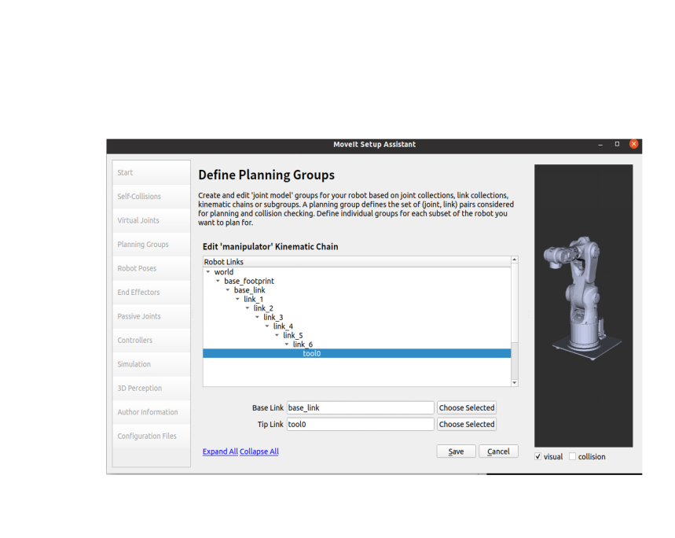

# 主题汇报
</br>
### 目录
- 插入公式
- 插入页码
- 插入图片
</br>
---

# 1.ROS机械臂控制
## 1.ROS介绍
1. ROS(Robot Operating System)美国的 Willow
Garage 公司在 2010 年推出一款开源的机器人
操作系统 ROS， 该平台的设计初衷主要是为了解决码垛机器人在研发过程中代码的复用问题以及功能模块化的需求，具有点对点设计、开源与代码共享、支持多种编程语言、集成多种功能库以及良好的生态环境等特点。

2. 本章节就是在基于 ROS 操作系统下对四轴机械臂进行路径规划以及虚拟运动控制的研究

---

## 2.ROS机械臂开发的绝对主角-Moveit!

1. ROS 最早因 PR2 机器人而生， MoveIt!也是同样的出身，由 PR2 机器人中机械臂部分的软件集成而来。应用如此广泛的 MoveIt!并不是一个简单的功能包，而是由一系列功能包组成的集成化开发平台 

2. 在传统工业中，我们需要通过示教器确定机器人运动中的所有路径点， 拖动施教并不能颠覆这种模式，这也是 MoveIt!要解决的核心问题：已知当前状态和目标状态，如何自动完成运动规划。

3. 在实现机械臂的自主抓取中机械臂的运动规划是其中最重要的一部分， 其中包含运动学正逆解算、碰撞检测、环境感知和动作规划等。在本章节中，采用 ROS 系统提供的 MoveIt!完成在操作系统层的运动规划。

4. MoveIt! 是 ROS 系统中集合了与移动操作相关的组件包的<font color = red>*运动规划库*</font>。 它包含了运动规划中所需要的大部分功能，同时其提供友好的配置和调试界面便于完成机器人在 ROS 系统上的初始化及调试，其具体架构如下图所示。


## 2.ROS机械臂开发的绝对主角-Moveit!

5. 具体架构
   1. <font color = red>move_group</font>：move_group 是 MoveIt!的核心部分，它的功能在于集成机器人的各独立模块并为用户提供一系列的动作指令和服务。 其本身并不具备太多的功能， 起到的是积分器的作用，完成各功能包和插件的集成。
   2. <font color = red>场景规划（Planning Scene）</font>:通过场景规划，用户可以创建一个具体的工作环境或者加入障碍物。
   3. <font color = red>运动规划（motion panning）</font>:在 MoveIt!中，运动规划器起的作用是实现运动规划算法，其以插件的方式通过 ROS 的 pluginlib 接口完成信息的通讯，根据需求可制作或选用不同的规划算法。
   4. <font color = red>运动学（Kinematics）</font> ：运动学算法是机械臂控制算法中的核心内容，其中包括正运动学算法和逆运动学算法，在 MoveIt!中，运动学算法同样以插件的形式完成于 ROS 的集成，因此可根据实际需求，编写自己的运动学算法来控制机器人。
   5. <font color = red>碰撞检测（collision checking）</font>:为避免机器人自身或者和环境发生干涉导致意外的发生，在进行运动规划时碰撞检测是必不可少的一部分。

## 3.利用Moveit!实现路径规划
### 3-1.配置规划组
1. >在终端中输入:roslaunch moveit_setup_assistant 

2. >启动生成防碰撞矩阵
   * >碰撞矩阵的目的主要用于碰撞检测，以防机械臂在运动规划的过程中发生运动干涉
   * >防碰撞矩阵：

3. 配置规划组
   * **<font color = red>step1</font>**:规划组是moveit配置的关键，首先配置运动学求解器,我们选择最常用的KDL求解器，其次选择运动规划库，选择OMPL。
   * >运动规划组:
   * Moveit和OMPL的联系:通过插件机制与OMPL建立连接与交互，但是OMPL规划出的结果是抽象的，没有机器人的概念，这个结果需要通过Moveit！处理生成机器人末端的运动轨迹
   * >Moveit和OMPL的联系:
   * **<font color = red>step2</font>**:
     * >配置运动学求解链: 以*base_link*为基座，末端执行器为*tool0*
     * >导出配置文件:


### 3-2.逆运动学求解
1. <font color = red>定义</font>:简单说，就是把终端位姿变成关节角度，q=IK(p)。p 是终端位姿(xyz)，q 是关节角度。
2. <font color = red>KDL</font>提供了 3 种逆解方法：(1)纯牛顿拉普森迭代法；(2)关节限位的牛顿法；(3)基于 LM 的方法。其中（1）和（2）几乎是相同的，只是在迭代求解的时候加了一个关节限位，本次研究中我们采用方法(1)
3. 逆运动学求解步骤
   * >**step1**:列方程组
   * >$$ f =
 \left[
 \begin{matrix}
   fk_1(q_1,...,q_n) - p_{goal_1}  \\
    ... \\
   fk_1(q_1,...,q_n) - p_{goal_1} 
  \end{matrix}
  \right]  =  \begin{bmatrix}0\\
  0 \\ 0
\end{bmatrix}$$
     * 其中$$fk_m$$表示机械臂的正运动学函数，操作空间共有 m 个自由度。
     * $$q_n$$表示机械臂具有n个关节，如果n>m则机械臂运动学冗余
     * $$p_{goal}$$表示机械臂末端在操作空间维度的目标点
   * >**step2**:求取雅可比矩阵
   * >$$
f^{'} = J = 
\begin{bmatrix}
\frac{\partial fk_1}{\partial q_1},\dots,  \frac{\partial fk_1}{q_n} \\
\dots\\
\frac{\partial fk_m}{\partial q_1},\dots, \frac{\partial fk_m}{\partial q_n}
\end{bmatrix} $$
   * >**step3**:迭代法求解下一个关节的位置$$\begin{bmatrix}
q_1\\
...\\
q_n
\end{bmatrix} = \begin{bmatrix}
q_1\\
...\\
q_n
\end{bmatrix} + J^{-1} \begin{bmatrix}
Err_1\\
...\\
Err_2
\end{bmatrix}$$
   * >其中$$E_rr = f(x_k)$$表示当前的误差

### 3-3.配置路径规划
#### 3-3-1.代码展示
 1. 逆运动学求解
```cpp
#include <string>
#include <ros/ros.h>
#include <moveit/move_group_interface/move_group_interface.h>

int main(int argc, char **argv)
{
    ros::init(argc, argv, "moveit_ik_demo");
    ros::AsyncSpinner spinner(1);
    spinner.start();

    moveit::planning_interface::MoveGroupInterface arm("manipulator");

    //获取终端link的名称
    std::string end_effector_link = arm.getEndEffectorLink();

    //设置目标位置所使用的参考坐标系
    std::string reference_frame = "base_link";
    arm.setPoseReferenceFrame(reference_frame);

    //当运动规划失败后，允许重新规划
    arm.allowReplanning(true);

    //设置位置(单位：米)和姿态（单位：弧度）的允许误差
    arm.setGoalPositionTolerance(0.001);
    arm.setGoalOrientationTolerance(0.01);

    //设置允许的最大速度和加速度
    arm.setMaxAccelerationScalingFactor(0.2);
    arm.setMaxVelocityScalingFactor(0.2);

    // 控制机械臂先回到初始化位置
    arm.setNamedTarget("home");//设置目标位置名称
    arm.move();//移动机械臂
    sleep(1);

    // 设置机器人终端的目标位置
    geometry_msgs::Pose target_pose;
    target_pose.orientation.x = 0.70692;
    target_pose.orientation.y = 0.0;
    target_pose.orientation.z = 0.0;
    target_pose.orientation.w = 0.70729;

    target_pose.position.x = 0.2593;
    target_pose.position.y = 0.0636;
    target_pose.position.z = 0.1787;

    // 设置机器臂当前的状态作为运动初始状态
    arm.setStartStateToCurrentState();//设置机械臂当前状态为初始状态

    arm.setPoseTarget(target_pose);//设置机械臂终端的目标位姿

    // 进行运动规划，计算机器人移动到目标的运动轨迹，此时只是计算出轨迹，并不会控制机械臂运动
    moveit::planning_interface::MoveGroupInterface::Plan plan;
    moveit::planning_interface::MoveItErrorCode success = arm.plan(plan);//返回一个bool值，看运动是否规划成功

    ROS_INFO("Plan (pose goal) %s",success?"":"FAILED");   

    //让机械臂按照规划的轨迹开始运动。
    if(success)
      arm.execute(plan);//如果成功的话，就执行运动规划
    sleep(1);

    // 控制机械臂先回到初始化位置
    arm.setNamedTarget("home");//设置目标位置
    arm.move();//运动机器臂
    sleep(1);

    ros::shutdown(); 

    return 0;
}
```
2. 正运动学求解
```cpp
#include <string>
#include <ros/ros.h>
#include <moveit/move_group_interface/move_group_interface.h>

int main(int argc, char **argv)
{
    ros::init(argc, argv, "moveit_ik_demo");
    ros::AsyncSpinner spinner(1);
    spinner.start();

    moveit::planning_interface::MoveGroupInterface arm("manipulator");

    //获取终端link的名称
    std::string end_effector_link = arm.getEndEffectorLink();

    //设置目标位置所使用的参考坐标系
    std::string reference_frame = "base_link";
    arm.setPoseReferenceFrame(reference_frame);

    //当运动规划失败后，允许重新规划
    arm.allowReplanning(true);

    //设置位置(单位：米)和姿态（单位：弧度）的允许误差
    arm.setGoalPositionTolerance(0.001);
    arm.setGoalOrientationTolerance(0.01);

    //设置允许的最大速度和加速度
    arm.setMaxAccelerationScalingFactor(0.2);
    arm.setMaxVelocityScalingFactor(0.2);

    // 控制机械臂先回到初始化位置
    arm.setNamedTarget("home");//设置目标位置名称
    arm.move();//移动机械臂
    sleep(1);

    // 设置机器人终端的目标位置
    geometry_msgs::Pose target_pose;
    target_pose.orientation.x = 0.70692;
    target_pose.orientation.y = 0.0;
    target_pose.orientation.z = 0.0;
    target_pose.orientation.w = 0.70729;

    target_pose.position.x = 0.2593;
    target_pose.position.y = 0.0636;
    target_pose.position.z = 0.1787;

    // 设置机器臂当前的状态作为运动初始状态
    arm.setStartStateToCurrentState();//设置机械臂当前状态为初始状态

    arm.setPoseTarget(target_pose);//设置机械臂终端的目标位姿

    // 进行运动规划，计算机器人移动到目标的运动轨迹，此时只是计算出轨迹，并不会控制机械臂运动
    moveit::planning_interface::MoveGroupInterface::Plan plan;
    moveit::planning_interface::MoveItErrorCode success = arm.plan(plan);//返回一个bool值，看运动是否规划成功

    ROS_INFO("Plan (pose goal) %s",success?"":"FAILED");   

    //让机械臂按照规划的轨迹开始运动。
    if(success)
      arm.execute(plan);//如果成功的话，就执行运动规划
    sleep(1);

    // 控制机械臂先回到初始化位置
    arm.setNamedTarget("home");//设置目标位置
    arm.move();//运动机器臂
    sleep(1);

    ros::shutdown(); 

    return 0;
}
```


3. 笛卡尔空间下的路径规划
```cpp
#include <ros/ros.h>
#include <moveit/move_group_interface/move_group_interface.h>
#include <moveit/robot_trajectory/robot_trajectory.h>

int main(int argc, char **argv)
{
	ros::init(argc, argv, "moveit_cartesian_demo");
	ros::AsyncSpinner spinner(1);
	spinner.start();
    //设定规划组
    moveit::planning_interface::MoveGroupInterface arm("manipulator");

    //获取终端link的名称
    std::string end_effector_link = arm.getEndEffectorLink();

    //设置目标位置所使用的参考坐标系
    std::string reference_frame = "base_link";
    arm.setPoseReferenceFrame(reference_frame);//把arm设置到参考坐标系

    //当运动规划失败后，允许重新规划
    arm.allowReplanning(true);

    //设置位置(单位：米)和姿态（单位：弧度）的允许误差
    arm.setGoalPositionTolerance(0.001);//设置位置的允许误差
    arm.setGoalOrientationTolerance(0.01);//设置姿态的允许误差

    //设置允许的最大速度和加速度
    arm.setMaxAccelerationScalingFactor(0.2);//设置允许的最大加速度
    arm.setMaxVelocityScalingFactor(0.2);//设置允许的最大速度

    // 控制机械臂先回到初始化位置
    arm.setNamedTarget("home");//先让机械臂有一个目标参考系home
    arm.move() ;//再让机械臂移动
    sleep(1);//休眠一秒

    // 获取当前位姿数据最为机械臂运动的起始位姿
    geometry_msgs::Pose start_pose = arm.getCurrentPose(end_effector_link).pose;

	std::vector<geometry_msgs::Pose> waypoints;

    //将初始位姿加入路点列表
	waypoints.push_back(start_pose);
	
    start_pose.position.z -= 0.2;
	waypoints.push_back(start_pose);

    start_pose.position.x += 0.1;
	waypoints.push_back(start_pose);

    start_pose.position.y += 0.1;
	waypoints.push_back(start_pose);

	// 笛卡尔空间下的路径规划   
	moveit_msgs::RobotTrajectory trajectory;
	const double jump_threshold = 0.0;
	const double eef_step = 0.01;
	double fraction = 0.0;
    int maxtries = 100;   //最大尝试规划次数
    int attempts = 0;     //已经尝试规划次数

    while(fraction < 1.0 && attempts < maxtries)
    {
        fraction = arm.computeCartesianPath(waypoints, eef_step, jump_threshold, trajectory);
        attempts++;
        
        if(attempts % 10 == 0)
            ROS_INFO("Still trying after %d attempts...", attempts);
    }
    
    if(fraction == 1)
    {   
        ROS_INFO("Path computed successfully. Moving the arm.");

	    // 生成机械臂的运动规划数据
	    moveit::planning_interface::MoveGroupInterface::Plan plan;
	    plan.trajectory_ = trajectory;

	    // 执行运动
	    arm.execute(plan);
        sleep(1);
    }
    else
    {
        ROS_INFO("Path planning failed with only %0.6f success after %d attempts.", fraction, maxtries);
    }

    // 控制机械臂先回到初始化位置
    arm.setNamedTarget("home");
    arm.move();
    sleep(1);

	ros::shutdown(); 
	return 0;
}
```

#### 3-3-2.动画展示
1. IK动画展示
<video id="video" controls="" preload="none">
    <source id="mp4" src="/home/kim-james/git/pictures/smart_video01_ik.mp4" type="video/mp4">
</video>

2. 笛卡尔空间下的路径规划动画展示
<video id="video" controls="" preload="none">
    <source id="mp4" src="smart_video02_cartesion.mp4" type="video/mp4">
</video>

# 2.SLAM
## 2-1.当