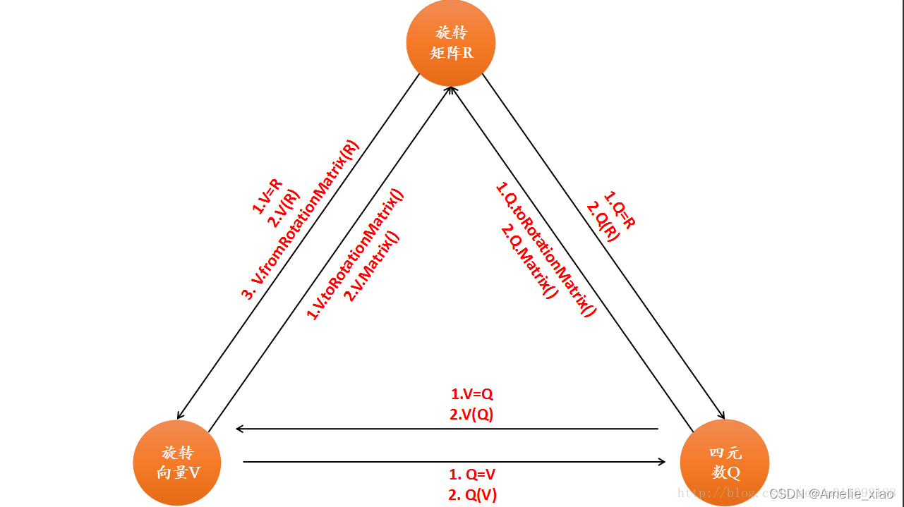
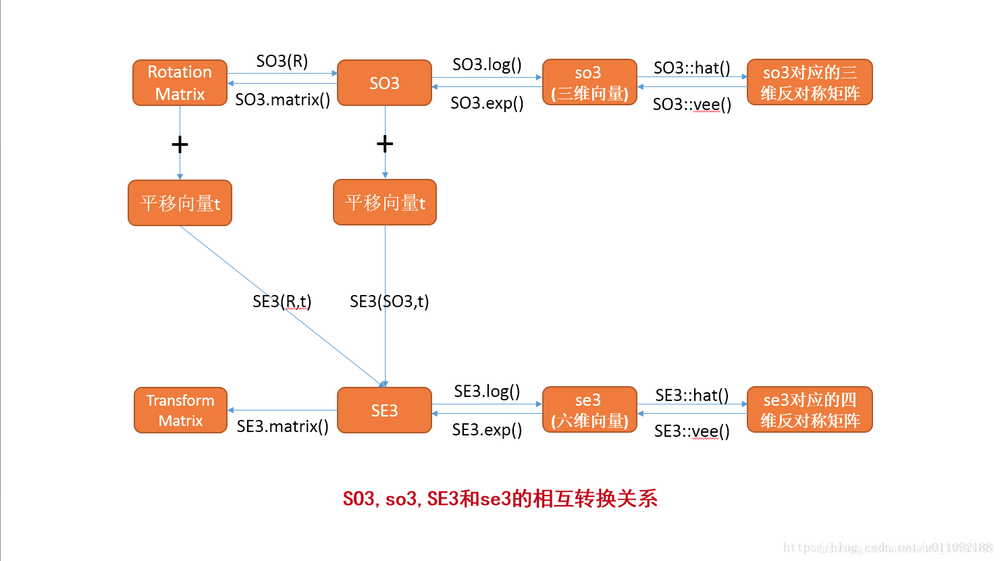
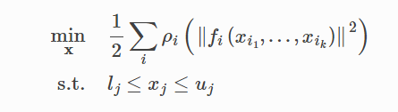

# 1.第一讲
### 1-1.基本命令
#### 1.运行c++文件
1. 过程
   1. 各个文件包的功能
      1. include: 放头文件 xxx.h
      2. src:放源文件 xxx.cpp
      3. lib:放库文件 xxx.a/xxx.so
   2. 目录结构
      1. demo
         1. CMakeList.txt
         2. src
            1. demo.cpp
            2. CMakeLists.txt
         3. include
            1. CMakeLists.txt
            2. mymath.cpp
            3. mymath.h
         4. build
2. 各文件信息
   1. ./CMakeLists.txt
```cmake
cmake_minimum_required(VERSION 3.10)
project(mydemo2)
add_subdirectory(./include)
add_subdirectory(./src)
```
   2. /include/CMakeLists.txt
```cmake
aux_source_directory(. DIR_LIB_SRCS)
add_library(Mylib STATIC ${DIR_LIB_SRCS})
```
   3. /src/CMakeLists.txt
```cmake
include_directories(../include)
aux_source_directory(./ DIR_SRCS)
add_executable(mydemo2 ${DIR_SRCS})
target_link_libraries(mydemo2 Mylib)
#让include中的库文件Mylib和mydemo2链接起来
```
   4. /include/mymath.h and /include/mymath.cpp
mymath.h
```cpp
#ifndef MYMATH_H
#define MYMATH_H
#include <iostream>
using namespace std;

double power(double a, double b);

#endif
```
mymath.cpp
```cpp
#include "mymath.h"
double power(double a, double b){ 
    int res = a;
    for (int i = 0; i < b; i++){
        res = res*a;
    }
    return res;
}
```
   5. main.cpp
```cpp
#include "../include/mymath.h"
int main(int argc, char** argv){
    if (argc < 3){
        cout << "您的输入有错误:" << endl;
        return 0;
    }
    double a = atof(argv[1]);
    double b = atof(argv[2]);
    double res = power(a, b);
    cout << "您的输出结果是:" << res << endl;
}
```
# 2.第二讲
## 1. eigen的使用
1. >头文件路径：/usr/include/eigen3/Eigen/Core 
2. 基本使用：
   
```cpp
#include <iostream>
#include <Eigen/Dense>
using namespace std;
template <typename T>
static void matrix_mul_matrix(T* p1, int iRow1, int iCol1, T* p2, int iRow2, int iCol2, T* p3)
{
    if (iRow1 != iRow2) return;
 
    //列优先
    //Eigen::Map< Eigen::Matrix<T, Eigen::Dynamic, Eigen::Dynamic> > map1(p1, iRow1, iCol1);
    //Eigen::Map< Eigen::Matrix<T, Eigen::Dynamic, Eigen::Dynamic> > map2(p2, iRow2, iCol2);
    //Eigen::Map< Eigen::Matrix<T, Eigen::Dynamic, Eigen::Dynamic> > map3(p3, iCol1, iCol2);
 
    //行优先
    Eigen::Map< Eigen::Matrix<T, Eigen::Dynamic, Eigen::Dynamic, Eigen::RowMajor>> map1(p1, iRow1, iCol1);
    Eigen::Map< Eigen::Matrix<T, Eigen::Dynamic, Eigen::Dynamic, Eigen::RowMajor>> map2(p2, iRow2, iCol2);
    Eigen::Map< Eigen::Matrix<T, Eigen::Dynamic, Eigen::Dynamic, Eigen::RowMajor>> map3(p3, iCol1, iCol2);
 
    map3 = map1 * map2;
}
 
int main(int argc, char* argv[])
{
    //1. 矩阵的定义
    Eigen::MatrixXd m(2, 2);
    Eigen::Vector3d vec3d;
    Eigen::Vector4d vec4d(1.0, 2.0, 3.0, 4.0);
 
    //2. 动态矩阵、静态矩阵
    Eigen::MatrixXd matrixXd;
    Eigen::Matrix3d matrix3d;
 
    //3. 矩阵元素的访问
    m(0, 0) = 1;
    m(0, 1) = 2;
    m(1, 0) = m(0, 0) + 3; 
    m(1, 1) = m(0, 0) * m(0, 1);
    cout << m << endl << endl;
 
    //4. 设置矩阵的元素
    m << -1.5, 2.4,
        6.7, 2.0;
    cout << m << endl << endl;
    int row = 4;
    int col = 5;
    Eigen::MatrixXf matrixXf(row, col);
    matrixXf << 1, 2, 3, 4, 5, 6, 7, 8, 9, 10, 11, 12, 13, 14, 15, 16, 17, 18, 19, 20;
    cout << matrixXf << endl << endl;
    matrixXf << Eigen::MatrixXf::Identity(row, col);
    cout << matrixXf << endl << endl;
 
    //5. 重置矩阵大小
    Eigen::MatrixXd matrixXd1(3, 3);
    m = matrixXd1;
    cout << m.rows() << "  " << m.cols() << endl << endl;
 
    //6. 矩阵运算
    m << 1, 2, 7,
        3, 4, 8,
        5, 6, 9;
    cout << m << endl;
    matrixXd1 = Eigen::Matrix3d::Random();
    m += matrixXd1;
    cout << m << endl << endl;
    m *= 2;
    cout << m << endl << endl;
    cout << -m << endl << endl;
    cout << m << endl << endl;
 
    //7. 求矩阵的转置、共轭矩阵、伴随矩阵
    cout << m.transpose() << endl << endl;
    cout << m.conjugate() << endl << endl;
    cout << m.adjoint() << endl << endl;
    cout << m << endl << endl;
    m.transposeInPlace();
    cout << m << endl << endl;
 
    //8. 矩阵相乘、矩阵向量相乘
    cout << m*m << endl << endl;
    vec3d = Eigen::Vector3d(1, 2, 3);
    cout << m * vec3d << endl << endl;
    cout << vec3d.transpose()*m << endl << endl;
 
    //9. 矩阵的块操作
    cout << m << endl << endl;
    cout << m.block(1, 1, 2, 2) << endl << endl;
    cout << m.block<1, 2>(0, 0) << endl << endl;
    cout << m.col(1) << endl << endl;
    cout << m.row(0) << endl << endl;
 
    //10. 向量的块操作
    Eigen::ArrayXf arrayXf(10);
    arrayXf << 1, 2, 3, 4, 5, 6, 7, 8, 9, 10;
    cout << vec3d << endl << endl;
    cout << arrayXf << endl << endl;
    cout << arrayXf.head(5) << endl << endl;
    cout << arrayXf.tail(4) * 2 << endl << endl;
 
    //11. 求解矩阵的特征值和特征向量
    Eigen::Matrix2f matrix2f;
    matrix2f << 1, 2, 3, 4;
    Eigen::SelfAdjointEigenSolver<Eigen::Matrix2f> eigenSolver(matrix2f);
    if (eigenSolver.info() == Eigen::Success) {
        cout << eigenSolver.eigenvalues() << endl << endl;
        cout << eigenSolver.eigenvectors() << endl << endl;
    }
 
    //12. 类Map及动态矩阵的使用
    int array1[4] = { 1, 2, 3, 4 };
    int array2[4] = { 5, 6, 7, 8 };
    int array3[4] = { 0, 0, 0, 0};
    matrix_mul_matrix(array1, 2, 2, array2, 2, 2, array3);
    for (int i = 0; i < 4; i++)
        cout << array3[i] << endl;
 
	return 0;
}
```
3. 注意：

1. 矩阵的定义：Eigen中关于矩阵类的模板函数中，共有六个模板参数，常用的只有前三个。其前三个参数分别表示矩阵元素的类型、行数和列数。
   1. 矩阵定义时可以使用Dynamic来表示矩阵的行列数为未知。
   2. Eigen中无论是矩阵还是数组、向量，无论是静态矩阵还是动态矩阵都提供默认构造函数，也就是定义这些数据结构时都可以不用提供任何参数，其大小均由运行时来确定。矩阵的构造函数中只提供行列数、元素类型的构造参数，而不提供元素值的构造，对于比较小的、固定长度的向量提供初始化元素的定义。

2. 矩阵类型：Eigen中的矩阵类型一般都是用类似MatrixXXX来表示，可以根据该名字来判断其数据类型，比如”d”表示double类型，”f”表示float类型，”i”表示整数，”c”表示复数；Matrix2f，表示的是一个2*2维的，其每个元素都是float类型。
3. 数据存储：Matrix创建的矩阵默认是按列存储，Eigen在处理按列存储的矩阵时会更加高效。如果想修改可以在创建矩阵的时候加入参数，如:
   Matrix<int,3, 4, ColMajor> Acolmajor;
   Matrix<int,3, 4, RowMajor> Arowmajor;
4. 动态矩阵和静态矩阵：动态矩阵是指其大小在运行时确定，静态矩阵是指其大小在编译时确定。
   1. MatrixXd：表示任意大小的元素类型为double的矩阵变量，其大小只有在运行时被赋值之后才能知道。
   2. Matrix3d：表示元素类型为double大小为3*3的矩阵变量，其大小在编译时就知道。

5. 在Eigen中行优先的矩阵会在其名字中包含有row，否则就是列优先。Eigen中的向量只是一个特殊的矩阵，其维度为1而已。

6. 矩阵元素的访问：在矩阵的访问中，行索引总是作为第一个参数，Eigen中矩阵、数组、向量的下标都是从0开始。矩阵元素的访问可以通过”()”操作符完成。例如m(2, 3)既是获取矩阵m的第2行第3列元素。针对向量还提供”[]”操作符，注意矩阵则不可如此使用。

7. 设置矩阵的元素：在Eigen中重载了”<<”操作符，通过该操作符即可以一个一个元素的进行赋值，也可以一块一块的赋值。另外也可以使用下标进行赋值。

8. 重置矩阵大小：当前矩阵的行数、列数、大小可以通过rows()、cols()和size()来获取，对于动态矩阵可以通过resize()函数来动态修改矩阵的大小。注意：
   1. 固定大小的矩阵是不能使用resize()来修改矩阵的大小；
   2. resize()函数会析构掉原来的数据，因此调用resize()函数之后将不能保证元素的值不改变；
   3. 使用”=”操作符操作动态矩阵时，如果左右两边的矩阵大小不等，则左边的动态矩阵的大小会被修改为右边的大小。

9. 如何选择动态矩阵和静态矩阵：对于小矩阵(一般大小小于16)使用固定大小的静态矩阵，它可以带来比较高的效率；对于大矩阵(一般大小大于32)建议使用动态矩阵。注意：如果特别大的矩阵使用了固定大小的静态矩阵则可能会造成栈溢出的问题。

10. 矩阵和向量的算术运算：在Eigen中算术运算重载了C++的+、-、*
    1.  矩阵的运算：提供+、-、一元操作符”-”、+=、-=；二元操作符+/-，表示两矩阵相加(矩阵中对应元素相加/减，返回一个临时矩阵)；一元操作符-表示对矩阵取负(矩阵中对应元素取负，返回一个临时矩阵)；组合操作法+=或者-=表示(对应每个元素都做相应操作)；矩阵还提供与标量(单一数字)的乘除操作，表示每个元素都与该标量进行乘除操作；
    2.  求矩阵的转置、共轭矩阵、伴随矩阵：可以通过成员函数transpose()、conjugate()、adjoint()来完成。注意：这些函数返回操作后的结果，而不会对原矩阵的元素进行直接操作，如果要让原矩阵进行转换，则需要使用响应的InPlace函数，如transpoceInPlace()等；
    3.  矩阵相乘、矩阵向量相乘：使用操作符*，共有*和*=两种操作符；
    4.  矩阵的块操作：有两种使用方法：
        1.  matrix.block(i,j, p, q) : 表示返回从矩阵(i, j)开始，每行取p个元素，每列取q个元素所组成的临时新矩阵对象，原矩阵的元素不变；
        2.  matrix.block<p,q>(i, j) :<p, q>可理解为一个p行q列的子矩阵，该定义表示从原矩阵中第(i, j)开始，获取一个p行q列的子矩阵，返回该子矩阵组成的临时矩阵对象，原矩阵的元素不变；
        3.  向量的块操作：
```cpp
获取向量的前n个元素：vector.head(n);

获取向量尾部的n个元素：vector.tail(n);

获取从向量的第i个元素开始的n个元素：vector.segment(i,n);

Map类：在已经存在的矩阵或向量中，不必拷贝对象，而是直接在该对象的内存上进行运算操作。
```


## 2.eigen的使用总结：
```cpp
#include <iostream>
#include <Eigen/Core>
#include <Eigen/Dense>
using namespace std;
int main(){
    //**1.创建和初始化矩阵**//
    //1-1. 普通矩阵生成
    Eigen::Matrix4d m1;//在定义时不能后接endl
    m1 << 1, 0, 0, 0,
          0, 2, 0, 0,
          0, 0, 3, 0,
          0, 0, 0, 4;
    cout << m1 << endl;
    //1-2. 向量生成
    Eigen::Vector3d vec1(1, 2, 3), vec2(2, 3, 4);
    cout << vec1 << endl << vec2 << endl;
    //1-3.Array生成
    Eigen::ArrayXd array1(3), array2(3);
    array1 << 1, 2, 3;
    array2 << 1, 2, 3;
    cout << array1 << endl << array2 << endl;
    //1-2. 特殊矩阵生成
    Eigen::MatrixXd m3(3, 3);//若为动态矩阵，则需括号，若为静态矩阵，则无须括号
    Eigen::MatrixXd m4(3, 3);
    Eigen::MatrixXd m5(3, 3);
    Eigen::MatrixXd m6(3, 3);
    m3 = Eigen::Matrix3d::Random();//随机矩阵
    m4 = Eigen::Matrix3d::Zero();
    m5 = Eigen::Matrix3d::Identity();//单位矩阵
    m6 = Eigen::Matrix3d::Ones();//全1矩阵
    cout << m3 << endl << endl;
    cout << m4 << endl << endl;
    cout << m5 << endl << endl;
    cout << m6 << endl << endl;
    //**2. 矩阵运算**//
    //2-1. 基本运算
    cout << " vec1.vec2 =\n " << vec1.dot(vec2) << endl; //点积 
    cout << "vec1 x vec2 =\n " << vec1.cross(vec2) << endl;    //叉积
    cout << "m1.sum() =\n " << m1.sum() <<  endl << endl;            // 各元素和
    cout << "m1.trace() =\n " << m1.trace() <<  endl << endl;          // 迹
    cout <<"m1.determinant() =\n " <<  m1.determinant() <<  endl << endl;    // 行列式
    cout << "m1.transpose() =\n " << m1.transpose() <<  endl << endl;      // 转置
    cout <<"m1.inverse() =\n " <<  m1.inverse() <<  endl << endl;        // 逆
    cout << "m1.adjoint() =\n " << m1.adjoint() <<  endl << endl;        // 伴随
    cout <<"m1.conjugate() =\n " <<  m1.conjugate() <<  endl << endl;      // 共轭
    //2-2. 块的操作
    //2-2-1. vector块操作
    cout << vec1.tail(2) << endl << endl;
    cout << vec1.head(2) << endl << endl;
    cout << vec1.segment(1, 2) << endl;//segment的索引是从0开始往后面推，所以(1, 2) = (2, 3)
    //2-2-2. matrix块操作
    cout << m1.block(1, 1, 2, 2) << endl;
    cout << m1.block<2, 2>(1, 1) << endl;
    //2-3. 类型的转换
    cout << m1.cast<int>() << endl << endl;    
    cout << m1.cast<float>() << endl << endl;    
    cout << m1.cast<double>() << endl << endl;    
    //**3. 矩阵的特征值 // 
    Eigen::SelfAdjointEigenSolver<Eigen::Matrix4d> eigenSolver(m1.transpose()*m1);//实对称矩阵可以相似对角化
    if(eigenSolver.info() == Eigen::Success){
        cout << "eigenvalues = \n" << eigenSolver.eigenvalues() << endl;
        cout << "eigenvectors = \n" << eigenSolver.eigenvectors() << endl << endl;
    }
    //**4. 解方程** //
    Eigen::Matrix3d m2;
    Eigen::Vector3d vec3d(1, 2, 3);
    m2 << 1, 0, 0;
          0, 2, 0,
          0, 0, 3;
    m2.inverse();
    cout << "the result = " << m2*vec3d << endl;

/*
Eigen::Matrix<double, 3, 2, Eigen::RowMajor> M1;
M1 << 1, 2, 3, 4, 5, 6;
Eigen::Matrix<double, 3, 2, Eigen::ColMajor> M2;
M2 << 1, 2, 3, 4, 5, 6;
cout << M1 << endl;
cout << M2 << endl;    
M1和M2结果相同，Eigen中矩阵都是列优先，意思为数的排列方向按照列排列，
实际上RowMajor和ColMajor所得的结果相同
*/    
}

```
## 3.实践
1. 四元数
```cpp
#include <iostream>
#include <Eigen/Core>
#include <Eigen/Geometry>
 
using namespace std;
using namespace Eigen;
 
int main(int argc, char** argv) {
  Quaterniond q1(0.35, 0.2, 0.3, 0.1), q2(-0.5, 0.4, -0.1, 0.2);
  q1.normalize();
  q2.normalize();
  Vector3d t1(0.3, 0.1, 0.1), t2(-0.1, 0.5, 0.3);
  Vector3d p1(0.5, 0, 0.2);
 
  Isometry3d T1w(q1), T2w(q2);
  T1w.pretranslate(t1);
  T2w.pretranslate(t2);
 
  Vector3d p2 = T2w * T1w.inverse() * p1;
  cout << endl << p2.transpose() << endl;
  return 0;
}
```
2. useEigen
3. useGeometry
   1. 例1
```cpp
#include <iostream>
#include <Eigen/Dense>
#include <Eigen/Geometry>
using namespace std;
using namespace Eigen;
void test(){
    //三个对象作为媒介
    AngleAxisd V(M_PI/4, Vector3d(0, 0, 1));
    Matrix3d R(V);
    Quaterniond q(V);
    //1.对旋转向量进行构造
    //1-1.方法1: V = R
    AngleAxisd V1(M_PI/4, Vector3d(0, 0, 1));
    V1 = R;
    cout << "v1.matrix() = \n" << V1.matrix() << endl;
    //1-2.方法2：V(R)
    AngleAxisd V2(R); 
    cout << "v2.matrix() = \n" << V2.matrix() << endl;
    
    //2.对四元数构造
    //2-1.方法1：直接法
    Quaterniond q1(cos(M_PI/8), 0 * sin(M_PI/8), 0 * sin(M_PI/8), 1 * sin(M_PI/8));
    cout << "q1.coeffs() = \n" << q1.coeffs() << endl;
    //2-2.方法2：利用旋转向量
    Quaterniond q2(V);
    cout << "q2.matrix() = \n" << q2.matrix() << endl;
    cout << "q2.coeffs() = \n" << q2.coeffs() << endl;
    cout << "q2.x() = " << q2.x() << endl;
    cout << "q2.y() = " << q2.y() << endl;
    cout << "q2.z() = " << q2.z() << endl;
    cout << "q2.w() = " << q2.w() << endl;
    //2-3.方法3:利用旋转矩阵
    Quaterniond q3(R);
    //2-3-1.planA
    cout << "q3.matrix1 = \n" <<  q3.matrix() << endl;
    //2-3-2.planB
    cout << "q3.matrix2 = \n" <<  q3.toRotationMatrix() << endl;
    
    //3.对旋转矩阵构造
    //3-1.利用旋转向量
    cout << "V.matrix = \n" << V.matrix() << endl;
    //3-2.利用四元数
    Matrix3d R1(q);
    cout << "R1(q) = \n" << R1 << endl;

    //4.对欧拉角进行构造
    cout << "R.eulerAngles(2,1,0) = \n" << R.eulerAngles(2,1,0) << endl;
    
    //5.对欧式矩阵构造
    Isometry3d T(R);
    Vector3d V3(1, 2, 3);
    T.pretranslate(V3);
    
    cout << "T.matrix = \n" <<  T.matrix() << endl;

    //6.对向量旋转
    Vector3d p(0, 0, 1);
    Vector3d vector_rotated;
    //6-1.利用旋转矩阵
    vector_rotated = R * p;
    //6-2.利用旋转向量
    vector_rotated = V * p;
    //6-3.利用四元数
    vector_rotated = q * p;
    //6-4.利用欧式矩阵
    vector_rotated = T * p;
    cout << "vector_rotated = \n" << vector_rotated << endl;
     
}

int main(){
    test();
}
```




2. visualizeGeometry
```cpp

#include <iostream>
#include <iomanip>
using namespace std;

#include <Eigen/Core>
#include <Eigen/Geometry>
using namespace Eigen;

#include <pangolin/pangolin.h>

struct RotationMatrix
{
    Matrix3d matrix = Matrix3d::Identity();
};

ostream& operator << ( ostream& out, const RotationMatrix& r ) 
{
    out.setf(ios::fixed);
    Matrix3d matrix = r.matrix;
    out<<'=';
    out<<"["<<setprecision(2)<<matrix(0,0)<<","<<matrix(0,1)<<","<<matrix(0,2)<<"],"
    << "["<<matrix(1,0)<<","<<matrix(1,1)<<","<<matrix(1,2)<<"],"
    << "["<<matrix(2,0)<<","<<matrix(2,1)<<","<<matrix(2,2)<<"]";
    return out;
}

istream& operator >> (istream& in, RotationMatrix& r )
{
    return in;
}

struct TranslationVector
{
    Vector3d trans = Vector3d(0,0,0);
};

ostream& operator << (ostream& out, const TranslationVector& t)
{
    out<<"=["<<t.trans(0)<<','<<t.trans(1)<<','<<t.trans(2)<<"]";
    return out;
}

istream& operator >> ( istream& in, TranslationVector& t)
{
    return in;
}

struct QuaternionDraw
{
    Quaterniond q;
};

ostream& operator << (ostream& out, const QuaternionDraw quat )
{
    auto c = quat.q.coeffs();
    out<<"=["<<c[0]<<","<<c[1]<<","<<c[2]<<","<<c[3]<<"]";
    return out;
}

istream& operator >> (istream& in, const QuaternionDraw quat)
{
    return in;
}

int main ( int argc, char** argv )
{
    pangolin::CreateWindowAndBind ( "visualize geometry", 1000, 600 );
    glEnable ( GL_DEPTH_TEST );
    pangolin::OpenGlRenderState s_cam (
        pangolin::ProjectionMatrix ( 1000, 600, 420, 420, 500, 300, 0.1, 1000 ),
        pangolin::ModelViewLookAt ( 3,3,3,0,0,0,pangolin::AxisY )
    );
    
    const int UI_WIDTH = 500;
    
    pangolin::View& d_cam = pangolin::CreateDisplay().SetBounds(0.0, 1.0, pangolin::Attach::Pix(UI_WIDTH), 1.0, -1000.0f/600.0f).SetHandler(new pangolin::Handler3D(s_cam));
    
    // ui
    pangolin::Var<RotationMatrix> rotation_matrix("ui.R", RotationMatrix());
    pangolin::Var<TranslationVector> translation_vector("ui.t", TranslationVector());
    pangolin::Var<TranslationVector> euler_angles("ui.rpy", TranslationVector());
    pangolin::Var<QuaternionDraw> quaternion("ui.q", QuaternionDraw());
    pangolin::CreatePanel("ui")
        .SetBounds(0.0, 1.0, 0.0, pangolin::Attach::Pix(UI_WIDTH));
    
    while ( !pangolin::ShouldQuit() )
    {
        glClear( GL_COLOR_BUFFER_BIT | GL_DEPTH_BUFFER_BIT );
        
        d_cam.Activate( s_cam );
        
        pangolin::OpenGlMatrix matrix = s_cam.GetModelViewMatrix();
        Matrix<double,4,4> m = matrix;
        // m = m.inverse();
        RotationMatrix R; 
        for (int i=0; i<3; i++)
            for (int j=0; j<3; j++)
                R.matrix(i,j) = m(j,i);
        rotation_matrix = R;
        
        TranslationVector t;
        t.trans = Vector3d(m(0,3), m(1,3), m(2,3));
        t.trans = -R.matrix*t.trans;
        translation_vector = t;
        
        TranslationVector euler;
        euler.trans = R.matrix.transpose().eulerAngles(2,1,0);
        euler_angles = euler;
        
        QuaternionDraw quat;
        quat.q = Quaterniond(R.matrix);
        quaternion = quat;
        
        glColor3f(1.0,1.0,1.0);
        
        pangolin::glDrawColouredCube();
        // draw the original axis 
        glLineWidth(3);
        glColor3f ( 0.8f,0.f,0.f );
        glBegin ( GL_LINES );
        glVertex3f( 0,0,0 );
        glVertex3f( 10,0,0 );
        glColor3f( 0.f,0.8f,0.f);
        glVertex3f( 0,0,0 );
        glVertex3f( 0,10,0 );
        glColor3f( 0.2f,0.2f,1.f);
        glVertex3f( 0,0,0 );
        glVertex3f( 0,0,10 );
        glEnd();
        
        pangolin::FinishFrame();
    }
}
```
## 3.课后习题：
1. 验证旋转矩阵是正交矩阵
2. 罗德里格斯公式推导
3. 四元数旋转某个点后仍然是虚四元数
4. 旋转矩阵，轴角，欧拉角， 四元数的关系
5. 假设我有一个大的 Eigen 矩阵，我想把它的左上角 3 × 3 的块取出来，然后赋值为I3×3 。请编程实现此事
```cpp
#include <iostream>
#include "/usr/include/eigen3/Eigen/Dense"
using namespace std;
using namespace Eigen;
 
int main()
{
    Matrix4d matrix_44 = Matrix4d::Constant(0.5);
    cout << "Here is a matrix:\n" << matrix_44 << endl;
    Matrix3d matrix_33 = Matrix3d::Constant(0.1);
    matrix_44.block(0,0,3,3) = matrix_33;
    cout << "左上角３×３的块取出来赋值为Matrix3_3\n" << matrix_44 << endl;
    return 0;
}
```
```cmake
cmake_minimum_required(VERSION 2.8)
project(visualizegeometry)
set(CMAKE_CXX_FLAGS "-std=c++14")#此处要改成14，不要写11

# 添加Eigen头文件
include_directories( "/usr/include/eigen3" )

# 添加Pangolin依赖
find_package( Pangolin )
include_directories( ${Pangolin_INCLUDE_DIRS} )

set(CMAKE_BUILD_TYPE "Debug")
add_executable(visualizegeometry main.cpp)
target_link_libraries( visualizegeometry ${Pangolin_LIBRARIES} )

install(TARGETS visualizegeometry RUNTIME DESTINATION bin)
```
6. 设有小萝卜一号和小萝卜二号位于世界坐标系中。小萝卜一号的位姿为：q 1 =
[0.35, 0.2, 0.3, 0.1], t 2 = [0.3, 0.1, 0.1] T （q 的第一项为实部。请你把 q 归一化后再
进行计算）
。这里的 q 和 t 表达的是 T cw ，也就是世界到相机的变换关系。小萝卜二号的位姿为 q 2 = [−0.5, 0.4, −0.1, 0.2], t = [−0.1, 0.5, 0.3] T 。现在，小萝卜一号看到
某个点在自身的坐标系下，坐标为 p = [0.5, 0, 0.2] T ，求该向量在小萝卜二号坐标系
下的坐标。请编程实现此事。
```cpp
#include <iostream>
#include <vector>
#include <algorithm>
#include <Eigen/Core>
#include <Eigen/Geometry>
 
using namespace std;
using namespace Eigen;
 
int main(int argc, char** argv) {
  Quaterniond q1(0.35, 0.2, 0.3, 0.1), q2(-0.5, 0.4, -0.1, 0.2);
  q1.normalize();
  q2.normalize();
  Vector3d t1(0.3, 0.1, 0.1), t2(-0.1, 0.5, 0.3);
  Vector3d p1(0.5, 0, 0.2);
 
  Isometry3d T1w(q1), T2w(q2);
  T1w.pretranslate(t1);
  T2w.pretranslate(t2);
 
  Vector3d p2 = T2w * T1w.inverse() * p1;
  cout << endl << p2.transpose() << endl;
  return 0;
}
```
# 3.第三讲
## 3-1.Sophus的安装
[Sophus1](https://blog.csdn.net/LW20211020/article/details/124204127)
[Sophus2](https://blog.csdn.net/mine_1/article/details/117703483)
[解决无法编译成功的问题](https://blog.csdn.net/King91701/article/details/120184602?spm=1001.2101.3001.6650.12&utm_medium=distribute.pc_relevant.none-task-blog-2%7Edefault%7ECTRLIST%7Edefault-12-120184602-blog-117703483.pc_relevant_aa&depth_1-utm_source=distribute.pc_relevant.none-task-blog-2%7Edefault%7ECTRLIST%7Edefault-12-120184602-blog-117703483.pc_relevant_aa&utm_relevant_index=12)
1. sophus的使用
```cpp
#include <iostream>
#include <cmath>
using namespace std; 

#include <Eigen/Core>
#include <Eigen/Geometry>

#include "sophus/so3.h"
#include "sophus/se3.h"

int main( int argc, char** argv )
{
    // 沿Z轴转90度的旋转矩阵
    Eigen::Matrix3d R = Eigen::AngleAxisd(M_PI/2, Eigen::Vector3d(0,0,1)).toRotationMatrix();
    
    Sophus::SO3 SO3_R(R);               // Sophus::SO(3)可以直接从旋转矩阵构造
    Sophus::SO3 SO3_v( 0, 0, M_PI/2 );  // 亦可从旋转向量构造
    Eigen::Quaterniond q(R);            // 或者四元数
    Sophus::SO3 SO3_q( q );
    // 上述表达方式都是等价的
    // 输出SO(3)时，以so(3)形式输出
    cout<<"SO(3) from matrix: "<<SO3_R<<endl;
    cout<<"SO(3) from vector: "<<SO3_v<<endl;
    cout<<"SO(3) from quaternion :"<<SO3_q<<endl;
    
    // 使用对数映射获得它的李代数
    Eigen::Vector3d so3 = SO3_R.log();
    cout<<"so3 = "<<so3.transpose()<<endl;
    // hat 为向量到反对称矩阵
    cout<<"so3 hat=\n"<<Sophus::SO3::hat(so3)<<endl;
    // 相对的，vee为反对称到向量
    cout<<"so3 hat vee= "<<Sophus::SO3::vee( Sophus::SO3::hat(so3) ).transpose()<<endl; // transpose纯粹是为了输出美观一些
    
    // 增量扰动模型的更新
    Eigen::Vector3d update_so3(1e-4, 0, 0); //假设更新量为这么多
    Sophus::SO3 SO3_updated = Sophus::SO3::exp(update_so3)*SO3_R;
    cout<<"SO3 updated = "<<SO3_updated<<endl;
    
    /********************萌萌的分割线*****************************/
    cout<<"************我是分割线*************"<<endl;
    // 对SE(3)操作大同小异
    Eigen::Vector3d t(1,0,0);           // 沿X轴平移1
    Sophus::SE3 SE3_Rt(R, t);           // 从R,t构造SE(3)
    Sophus::SE3 SE3_qt(q,t);            // 从q,t构造SE(3)
    cout<<"SE3 from R,t= "<<endl<<SE3_Rt<<endl;
    cout<<"SE3 from q,t= "<<endl<<SE3_qt<<endl;
    // 李代数se(3) 是一个六维向量，方便起见先typedef一下
    typedef Eigen::Matrix<double,6,1> Vector6d;
    Vector6d se3 = SE3_Rt.log();
    cout<<"se3 = "<<se3.transpose()<<endl;
    // 观察输出，会发现在Sophus中，se(3)的平移在前，旋转在后.
    // 同样的，有hat和vee两个算符
    cout<<"se3 hat = "<<endl<<Sophus::SE3::hat(se3)<<endl;
    cout<<"se3 hat vee = "<<Sophus::SE3::vee( Sophus::SE3::hat(se3) ).transpose()<<endl;
    
    // 最后，演示一下更新
    Vector6d update_se3; //更新量
    update_se3.setZero();
    Sophus::SE3 SE3_updated = Sophus::SE3::exp(update_se3)*SE3_Rt;
    cout<<"SE3 updated = "<<endl<<SE3_updated.matrix()<<endl;
    
    return 0;
}
/*
1. 转化: 
   1. SO3->(log)so3->(hat)so3_hat->(vee)(so3_hat)^vee
   2. so3->(exp)SO3(se3同理)
   3. SO3: Sophus::SO3 SO3_R(R), SO3_q(q), SO3_V(V)
   4. SE3: Sophus::SE3 SE3_R(R, t), SE3_q(q, t) 
*/ 

```
```cmake
cmake_minimum_required( VERSION 2.8 )
project( useSophus )

# 为使用 sophus，您需要使用find_package命令找到它
find_package( Sophus REQUIRED )
message(STATUS ${Sophus_LIBRARISE})
include_directories( ${Sophus_INCLUDE_DIRS} )
include_directories( "/usr/include/eigen3" )
add_executable( useSophus useSophus.cpp )
set(Sophus_LIBRARIES libSophus.so)
#安装Sophus会有libSophus.so文件，cmake没有连接到Sophus_LIBRARIES上
target_link_libraries( useSophus ${Sophus_LIBRARIES} )
```
## 3-2.项目1
```cpp
//以下所有的Eigen::aligned_allocator<Sophus::SE3>都可以去掉
#include <sophus/se3.h>//针对于se3
#include <string>
#include <iostream>
#include <fstream>
#include <Eigen/Core>
//下面3个文件主要是面对usleep(5000)报错的 
#include <unistd.h>
#include <stdio.h>
#include <stdlib.h>

// need pangolin for plotting trajectory
#include <pangolin/pangolin.h>

using namespace std;

// path to trajectory file
string trajectory_file = "/home/kim-james/ROS_Space/SLAM_ws/slam_test/ch3/trajectory/trajectory.txt";

// function for plotting trajectory, don't edit this code
// start point is red and end point is blue
void DrawTrajectory(vector<Sophus::SE3>);

int main(int argc, char **argv) {

    vector<Sophus::SE3> poses;
    //只有加入了Eigen::aligned_allocator<Sophus::SE3>才可以允许vector加入SE3，但是可以去掉
    // 定义一个文件读取器
    fstream file(trajectory_file); 
    double time, tx, ty, tz, qx, qy, qz, qw; 
    //按照time, translation, quaternion顺序读取
    //若是eof()返回0，说明数据没读完,所以!0 = 1
    while (!file.eof()){
        file >> time >> 
        tx >> ty >> tz >> 
        qx >> qy >> qz >> qw; 
        //处理读取的数据
        //处理平移
        Eigen::Vector3d t(tx, ty, tz);
        //处理四元数(注意顺序)
        Eigen::Quaterniond q(qw, qx, qy, qy);
        //注意归一化
        q.normalize();
        //将四元数转换为旋转矩阵
        Eigen::Matrix3d R(q);
        //存入到Sophus对应的SE3 -> T,转化为变换矩阵
        Sophus::SE3 SE3_from_Eigen(R, t);
        poses.push_back(SE3_from_Eigen); 
    }
    cout << "the number of points = " << poses.size() << endl;
    DrawTrajectory(poses);
    return 0;
}

/*******************************************************************************************/
void DrawTrajectory(vector<Sophus::SE3> poses) {
    if (poses.empty()) {
        cerr << "Trajectory is empty!" << endl;
        return;
    }

    // create pangolin window and plot the trajectory
    pangolin::CreateWindowAndBind("Trajectory Viewer", 1024, 768);
    glEnable(GL_DEPTH_TEST);
    glEnable(GL_BLEND);
    glBlendFunc(GL_SRC_ALPHA, GL_ONE_MINUS_SRC_ALPHA);

    pangolin::OpenGlRenderState s_cam(
            pangolin::ProjectionMatrix(1024, 768, 500, 500, 512, 389, 0.1, 1000),
            pangolin::ModelViewLookAt(0, -0.1, -1.8, 0, 0, 0, 0.0, -1.0, 0.0)
    );

    pangolin::View &d_cam = pangolin::CreateDisplay()
            .SetBounds(0.0, 1.0, pangolin::Attach::Pix(175), 1.0, -1024.0f / 768.0f)
            .SetHandler(new pangolin::Handler3D(s_cam));


    while (pangolin::ShouldQuit() == false) {
        glClear(GL_COLOR_BUFFER_BIT | GL_DEPTH_BUFFER_BIT);

        d_cam.Activate(s_cam);
        glClearColor(1.0f, 1.0f, 1.0f, 1.0f);

        glLineWidth(2);
        for (size_t i = 0; i < poses.size() - 1; i++) {
            glColor3f(1 - (float) i / poses.size(), 0.0f, (float) i / poses.size());
            glBegin(GL_LINES);
            auto p1 = poses[i], p2 = poses[i + 1];
            glVertex3d(p1.translation()[0], p1.translation()[1], p1.translation()[2]);
            glVertex3d(p2.translation()[0], p2.translation()[1], p2.translation()[2]);
            glEnd();
        }
        pangolin::FinishFrame();
        usleep(5000);   // sleep 5 ms
    }

}
```
```cmake
cmake_minimum_required(VERSION 3.0)
project(trajectory)
# 在cmake脚本中，设置编译选项可以通过add_compile_options命令，也可以通过set命令修改CMAKE_CXX_FLAGS或CMAKE_C_FLAGS。
# add_compile_options(-std=c++11) # 这句话的意思是在make时让编译器（g++）自动添加C++11的性质 -> 设置编译选项

option(USE_UBUNTU_20 "Set to ON if you are using Ubuntu 20.04" ON)
find_package(Pangolin REQUIRED)
if(USE_UBUNTU_20)
    message("You are using Ubuntu 20.04, fmt::fmt will be linked")
    find_package(fmt REQUIRED)
    set(FMT_LIBRARIES fmt::fmt)
endif()
include_directories(${Pangolin_INCLUDE_DIRS})
add_executable(draw_trajectory draw_trajectory.cpp)
target_link_libraries(draw_trajectory ${FMT_LIBRARIES})
target_link_libraries(draw_trajectory ${Pangolin_LIBRARIES})

set(CMAKE_BUILD_TYPE "Release")
set(Sophus_LIBRARIES  "/usr/local/lib/libSophus.so")
find_package(Sophus REQUIRED)
include_directories( ${Sophus_INCLUDE_DIRS} )
target_link_libraries(draw_trajectory ${Sophus_LIBRARIES})


使用方法：
add_executable(pub pub.cpp)
set(roscpp_LIBRARIES "/../../xxxx.so")
find_package(roscpp REQUIRED)#find_package和include_directories紧密联系
include_directories(${roscpp_INCLUDE_DIRS})
target_link_libraries(pub ${roscpp_LIBRARIES})#将变量用$括起来
```
1. cmake的使用
```cmake
1. 使用方法：
add_executable(pub pub.cpp)
set(roscpp_LIBRARIES "/../../xxxx.so")
find_package(roscpp REQUIRED)#find_package和include_directories紧密联系
include_directories(${roscpp_INCLUDE_DIRS})
target_link_libraries(pub ${roscpp_LIBRARIES})#将变量用$括起来

2. message是指输出变量值：
IN ===> message("CMAKE_SOURCE_DIR=${CMAKE_SOURCE_DIR}")
OUT ===> CMAKE_SOURCE_DIR = /xxxx/xxx

```
## 3-3.项目2


*注意在使用这个文件时，SE3 = SE3d, SO3 = SO3d, h = hpp*
```cmake
cmake_minimum_required( VERSION 2.8 )
project( useSophus )

# 为使用 sophus，您需要使用find_package命令找到它
find_package( Sophus REQUIRED )
include_directories( ${Sophus_INCLUDE_DIRS} )#添加Sophus库
include_directories( "/usr/include/eigen3" )#添加Eigen库
add_executable( useSophus useSophus.cpp )#添加可执行文件
set(Sophus_LIBRARIES libSophus.so)#设置变量
#定义了一个变量Sophus，他的值为libSophus.so
target_link_libraries( useSophus ${Sophus_LIBRARIES} )
```
```cpp
#include <iostream>
#include <cmath>
#include <Eigen/Core>
#include <Eigen/Geometry>
#include "sophus/so3.h"
#include "sophus/se3.h"
using namespace std; 
int main(){
    /* SO3的使用*/
    //1.构造SO3
    Eigen::AngleAxisd V(M_PI/2, Eigen::Vector3d(0, 0, 1));
    Eigen::Quaterniond q(V);
    Eigen::Matrix3d R(V);
    //通过旋转向量，旋转矩阵和四元数
    Sophus::SO3 SO3_V(0, 0, M_PI/2);
    Sophus::SO3 SO3_R(R);
    Sophus::SO3 SO3_q(q);
    cout << "so3 from V = \n" << SO3_V << endl;
    cout << "SO3 from V = \n" << SO3_V.matrix() << endl;
    cout << "so3 from R = \n" << SO3_R << endl;
    cout << "so3 from q = \n" << SO3_q << endl;

    //2.对数映射和 hat,vee的转换
    Eigen::Vector3d so3 = SO3_R.log();
    cout << "so3 hat = \n" << Sophus::SO3::hat(so3) << endl;
    cout << "so3 hat vee = \n" << Sophus::SO3::vee(Sophus::SO3::hat(so3)) << endl;
    
    //3.扰动模型
    Eigen::Vector3d updated_V(1, 0, 0);
    Sophus::SO3 SO3_updated = Sophus::SO3::exp(updated_V) * SO3_R;
    cout << " SO3_updated = \n" << SO3_updated << endl;       
    cout << " SO3_updated.matrix = \n" << SO3_updated.matrix() << endl;       
    /*SE3的使用*/
    //1.构造SE3
    Eigen::Vector3d t(1, 0, 0);
    Sophus::SE3 SE3_R(R, t);
    Sophus::SE3 SE3_q(q, t);
    cout << "se3 from R,t = \n" << SE3_R << endl;
    cout << "SE3 from R,t = \n" << SE3_R.matrix() << endl;
    cout << "se3 from R,t = \n" << SE3_q << endl;
    cout << "SE3 from R,t = \n" << SE3_q.matrix() << endl;
    //2.对数映射和hat vee
    
    typedef Eigen::Matrix<double, 6, 1> Vector6d;
    Vector6d se3 = SE3_R.log();//对数映射
    cout << "se3  = \n " <<  se3 << endl;
    cout << "se3 hat =  \n" <<  Sophus::SE3::hat(se3) << endl;
    cout << "se3 hat vee =  \n" <<  Sophus::SE3::vee(Sophus::SE3::hat(se3)) << endl;

    //3.扰动
    Vector6d v1;
    v1 << 1, 0, 0, 0, 0, 0;
    Sophus::SE3  SE3_updated = Sophus::SE3::exp(v1) * SE3_R;
    cout << "SE3_updated  = \n" << SE3_updated << endl;
    cout << "SE3_updated.matrix = \n" << SE3_updated.matrix() << endl;

}
```
```cpp
hus_test/build   master ✚  ./demo01
so3 from V = 
     0      0 1.5708

SO3 from V = 
          0          -1           0
          1           0           0
          0           0           1
so3 from R = 
     0      0 1.5708

so3 from q = 
     0      0 1.5708

so3 hat = 
      0 -1.5708       0
 1.5708       0      -0
     -0       0       0
so3 hat vee = 
     0
     0
1.5708
 SO3_updated = 
 0.779333 -0.779333   1.42656

 SO3_updated.matrix = 
    0           -1            0
    0.540302     0            0
    0.841471     0     0.540302
se3 from R,t = 
      0      0 1.5708
1 0 0

SE3 from R,t = 
          0          -1           0           1
          1           0           0           0
          0           0           1           0
          0           0           0           1
se3 from R,t = 
     0      0 1.5708
1 0 0

SE3 from R,t = 
          0          -1           0           1
          1           0           0           0
          0           0           1           0
          0           0           0           1
se3  = 
  0.785398
-0.785398
        0
        0
        0
   1.5708
se3 hat =  
        0   -1.5708         0  0.785398
   1.5708         0        -0 -0.785398
       -0         0         0         0
        0         0         0         0
se3 hat vee =  
 0.785398
-0.785398
        0
        0
        0
   1.5708
SE3_updated  = 
     0      0 1.5708
2 0 0

SE3_updated.matrix = 
          0          -1           0           2
          1           0           0           0
          0           0           1           0
          0           0           0           1
```
*方法2*
```cpp
#include <iostream>
#include "sophus/se3.h"
#include "sophus/so3.h"
#include <Eigen/Core>
#include <Eigen/Geometry>
using namespace std;
void printSO3(){
    //1.SO3的构造
    Eigen::AngleAxisd V(M_PI/2, Eigen::Vector3d(0, 0, 1));
    Eigen::Quaterniond q(V);    
    Eigen::Matrix3d R(V);
    Sophus::SO3 SO3_R(R);
    Sophus::SO3 SO3_q(q);
    cout << "SO3_R = \n" << SO3_R << endl;
    cout << "SO3_R.matrix = \n" << SO3_R.matrix() << endl;
    cout << "SO3_R = \n" << SO3_R << endl;
    cout << "SO3_R.matrix = \n" << SO3_R.matrix() << endl;
    //2.so3 and hat&vee
    Eigen::Vector3d so3 = SO3_R.log();
    cout << "so3 = \n" << SO3_R.log() << endl;
    cout << "so3 hat = \n" << Sophus::SO3::hat(so3) << endl;
    cout << "so3 hat vee = \n" << Sophus::SO3::vee(Sophus::SO3::hat(so3)) << endl;
    //3.扰动
    Eigen::Vector3d V1(0, 0, 1.57);
    cout << "SO3 = \n" << Sophus::SO3::exp(V1) << endl;//旋转向量
    cout << "SO3.matrix() = \n" << Sophus::SO3::exp(V1).matrix() << endl;//旋转矩阵
    Sophus::SO3 SO3_updated = Sophus::SO3::exp(V1) * SO3_R;
    cout << "SO3_updated = \n" << SO3_updated << endl;//扰动后的向量
    cout << "SO3_updated.matrix = \n" << SO3_updated.matrix() << endl;//扰动后的矩阵

}
void printSE3(){
    //1.SE3的构造
    Eigen::AngleAxisd V(M_PI/2, Eigen::Vector3d(0, 0, 1));
    Eigen::Quaterniond q(V);
    Eigen::Vector3d t(0, 0, 1);    
    Eigen::Matrix3d R(V);
    Sophus::SE3 SE3_R(R, t);
    Sophus::SE3 SE3_q(q, t);
    cout << "SE3_R = \n" << SE3_R << endl;
    cout << "SE3_R.matrix = \n" << SE3_R.matrix() << endl;
    cout << "SE3_q = \n" << SE3_q << endl;
    cout << "SE3_q.matrix = \n" << SE3_q.matrix() << endl;
    //2.so3 and hat&vee
    typedef Eigen::Matrix<double, 6, 1> Vector6d;
    Vector6d se3 = SE3_R.log();
    cout << "se3 = \n" << SE3_R.log() << endl;
    cout << "se3 hat = \n" << Sophus::SE3::hat(se3) << endl;
    cout << "se3 hat vee = \n" << Sophus::SE3::vee(Sophus::SE3::hat(se3)) << endl;
    //3.扰动
    Vector6d V1;
    V1.setZero();
    V1(0, 0) = 1;
    cout << "SE3 = \n" << Sophus::SE3::exp(V1) << endl;//变换向量
    cout << "SE3.matrix() = \n" << Sophus::SE3::exp(V1).matrix() << endl;//变换矩阵
    Sophus::SE3 SE3_updated = Sophus::SE3::exp(V1) * SE3_R;
    cout << "SE3_updated = \n" << SE3_updated << endl;//扰动后的向量
    cout << "SE3_updated.matrix = \n" << SE3_updated.matrix() << endl;//扰动后的矩阵

}
int main(){
    cout << "***********SO3************" << endl;
    printSO3();
    cout << "***********SE3************" << endl;
    printSE3();
}
```
## 3-3.pangolin的使用
模板
```cpp
#include <iostream>
#include <pangolin/pangolin.h>
#include <Eigen/Core>
#include <Eigen/Geometry>
#include <vector>
#include <string>
#include "sophus/se3.h"
using namespace std;

int main()
{
    pangolin::CreateWindowAndBind("Main",640,480);
    glEnable(GL_DEPTH_TEST);
    glEnable(GL_BLEND);
    glBlendFunc(GL_SRC_ALPHA, GL_ONE_MINUS_SRC_ALPHA);
    pangolin::OpenGlRenderState s_cam(
        pangolin::ProjectionMatrix(640,480,420,420,320,320,0.2,100),
        pangolin::ModelViewLookAt(2,0,2, 0,0,0, pangolin::AxisY)
    );

    pangolin::Handler3D handler(s_cam); //交互相机视图句柄
    pangolin::View& d_cam = pangolin::CreateDisplay()
            .SetBounds(0.0, 1.0, 0.0, 1.0, -640.0f/480.0f)
            .SetHandler(&handler);
    while( !pangolin::ShouldQuit() )
    {
        glClear(GL_COLOR_BUFFER_BIT | GL_DEPTH_BUFFER_BIT);
        d_cam.Activate(s_cam);
 /*-------- .绘图  --------*/
    /*---------------*/

        pangolin::FinishFrame();
    }
    
    return 0;
}
```
1. 使用方法1
[链接](https://blog.csdn.net/u011341856/article/details/107199600?spm=1001.2101.3001.6650.8&utm_medium=distribute.pc_relevant.none-task-blog-2%7Edefault%7EBlogCommendFromBaidu%7ERate-8-107199600-blog-65441315.pc_relevant_paycolumn_v3&depth_1-utm_source=distribute.pc_relevant.none-task-blog-2%7Edefault%7EBlogCommendFromBaidu%7ERate-8-107199600-blog-65441315.pc_relevant_paycolumn_v3&utm_relevant_index=11)
```cpp
//以下所有的Eigen::aligned_allocator<Sophus::SE3>都可以去掉
#include <sophus/se3.h>//针对于se3
#include <string>
#include <iostream>
#include <fstream>
#include <Eigen/Core>
//下面3个文件主要是面对usleep(5000)报错的 
#include <unistd.h>
#include <stdio.h>

// need pangolin for plotting trajectory
#include <pangolin/pangolin.h>

using namespace std;

// path to trajectory file
string trajectory_file = "/home/kim-james/ROS_Space/SLAM_ws/slam_test/ch3/trajectory/trajectory.txt";

// function for plotting trajectory, don't edit this code
// start point is red and end point is blue
void DrawTrajectory(vector<Sophus::SE3>);
int main(int argc, char **argv) {

    vector<Sophus::SE3> poses;//poses为旋转矩阵的容器
    //只有加入了Eigen::aligned_allocator<Sophus::SE3>才可以允许vector加入SE3，但是可以去掉
    // 定义一个文件读取器
    fstream file(trajectory_file); 
    double time, tx, ty, tz, qx, qy, qz, qw; 
    //按照time, translation, quaternion顺序读取
    //若是eof()返回0，说明数据没读完,所以!0 = 1,eof() = end of file
    while (!file.eof()){
        file >> time >> 
        tx >> ty >> tz >> 
        qx >> qy >> qz >> qw; 
        //处理读取的数据
        //处理平移
        Eigen::Vector3d t(tx, ty, tz);
        //处理四元数(注意顺序)
        Eigen::Quaterniond q(qw, qx, qy, qz);
        //注意归一化
        q.normalize();
        //将四元数转换为旋转矩阵
        Eigen::Matrix3d R(q);
        //存入到Sophus对应的SE3 -> T,转化为变换矩阵
        Sophus::SE3 SE3_from_Eigen(R, t);
        poses.push_back(SE3_from_Eigen); //传入的是SE3的vector
    }
    cout << "the number of points = " << poses.size() << endl;//points = 120
    DrawTrajectory(poses);//先声明后使用
    return 0;
}

/*******************************************************************************************/
void DrawTrajectory(vector<Sophus::SE3> poses) {
    
    if (poses.empty()) {
        cerr << "Trajectory is empty!" << endl;
        return;
    }

    // create pangolin window and plot the trajectory
    pangolin::CreateWindowAndBind("Trajectory Viewer", 1024, 768);
    glEnable(GL_DEPTH_TEST);
    glEnable(GL_BLEND);
    glBlendFunc(GL_SRC_ALPHA, GL_ONE_MINUS_SRC_ALPHA);

    pangolin::OpenGlRenderState s_cam(
            pangolin::ProjectionMatrix(1024, 768, 500, 500, 512, 389, 0.1, 1000),
            pangolin::ModelViewLookAt(0, -0.1, -1.8, 0, 0, 0, 0.0, -1.0, 0.0)
    );

    pangolin::View &d_cam = pangolin::CreateDisplay()
            .SetBounds(0.0, 1.0, pangolin::Attach::Pix(175), 1.0, -1024.0f / 768.0f)
            .SetHandler(new pangolin::Handler3D(s_cam));

    while (pangolin::ShouldQuit() == false) {
        glClear(GL_COLOR_BUFFER_BIT | GL_DEPTH_BUFFER_BIT);

        d_cam.Activate(s_cam);
        glClearColor(1.0f, 1.0f, 1.0f, 1.0f);

        glLineWidth(2);
        //size_t: size of type 
        for (int i = 0; i < poses.size() - 1; i++) {
            glColor3f(1 - (float)i / poses.size(), 0.0f, (float) i / poses.size());//颜色变化的算法
            /*
            1.(float)i：将i转成float类型
            2.poses.size()为vector的大小
            2.auto = vector<Sophus::SE3>
            */
            glBegin(GL_LINES);//画线开始
            auto p1 = poses[i], p2 = poses[i + 1];
            //vertex为顶点
            glVertex3d(p1.translation()[0], p1.translation()[1], p1.translation()[2]);//p1点的(x, y, z)坐标
            glVertex3d(p2.translation()[0], p2.translation()[1], p2.translation()[2]);//p2点的(x, y, z)坐标
            glEnd();//画线结束，将p1和p2连成一条线
        }
        pangolin::FinishFrame();//绘图
    }
}
```
2. 基本用法
```cpp
#include <pangolin/pangolin.h>
#include <iostream>
int main()
{
    // 1.创建名称为“Main”的GUI窗口，尺寸为640×640
    pangolin::CreateWindowAndBind("Main",640,480);
    // 2.启动深度测试，开启这个功能后，窗口只会绘制面朝相机的那一面像素，要使用3D可视化就要开启这个功能
    glEnable(GL_DEPTH_TEST);
    //3.打开颜色混合，把某一像素位置原来的颜色和将要画上去的颜色通过某种方式混合，实现特殊的效果
    glEnable(GL_BLEND);
    //4.紧跟glEnable(GL_BLEND)表示颜色的混合方式
    glBlendFunc(GL_SRC_ALPHA, GL_ONE_MINUS_SRC_ALPHA);

    /*5.创建一个观察相机视图，用真实的相机来模拟真实的世界
    5-1.ProjectMatrix(int h, int w, int fu, int fv, int cu, int cv, int znear, int zfar)
    依次是观察相机的图像高度，宽度，4个内参，以及最近和最远视距
    5-2.ModelViewLookAt(double x, double y, double z,double lx, double ly, double lz, AxisDirection Up)
    x,y,z为相机所在的位置;lx,ly,lz为相机所看视点的位置;AxixDirection UP为相机轴的方向
    以自己脑袋为例，前3个参数为脑袋的位置，4-6参数为眼睛所看的方向, 最后参数为头顶的朝向
    */
    pangolin::OpenGlRenderState s_cam(
        pangolin::ProjectionMatrix(640,480,420,420,320,320,0.2,100),
        pangolin::ModelViewLookAt(2,0,2, 0,0,0, pangolin::AxisY)
    );

    //6.创建相机视图句柄，需要用它来显示前面设置的相机拍摄的内容
    pangolin::Handler3D handler(s_cam); //交互相机视图句柄
    //7.进行显示设置，SetBounds前4个参数为视图在视窗中的范围(下，上，左，右)，最后一个参数为长宽比
    //(0, 1, 0, 1)：第一个0表示显示的拍摄窗口的下边在整个GUI的最下面，第二个参数1表示上边在GUI的最上面，中间就用0.5
    pangolin::View& d_cam = pangolin::CreateDisplay()
            .SetBounds(0.0, 1.0, 0.0, 1.0, -640.0f/480.0f)
            .SetHandler(&handler);
    //8.检测是否关闭OpenGL窗口
    while( !pangolin::ShouldQuit() )
    {
        //9.清空颜色和深度缓存
        glClear(GL_COLOR_BUFFER_BIT | GL_DEPTH_BUFFER_BIT);
        //10.激活并设置状态矩阵
        d_cam.Activate(s_cam);
 /*--------  11.绘图  --------*/
        //11-1.在原点创建一个立方体对象
        pangolin::glDrawColouredCube();
        
        //11-2.绘制点
        //点的大小
        glPointSize(30.0);//
        //开始画点
        glBegin(GL_POINTS);//后面s不能掉
        //设置点1的颜色:rgb, float类型
        glColor3f(0, 1, 0);
        //设置点1的坐标， 3维float类型
        glVertex3f(0 , 0, 0);
        //设置点2的颜色,坐标
        glColor3f(1, 0, 0);
        glVertex3f(0 , 1, 0);
        //结束画点
        glEnd();
        //11-3.绘制线段
        //11-3-1.设置大小
        glLineWidth(4);
        //11-3-2.开始画线条
        glBegin(GL_LINES);
        //设置颜色
        glColor3f(0, 1, 0);
        //设置起点
        glVertex3f(0, 0, 0);
        glVertex3f(0, 1, 0);
        //结束画线
        glEnd();
        
        //11-3.绘制折线
        glLineWidth(2);
        //  开始
        glBegin ( GL_LINE_STRIP );
        //  设置颜色
        glColor3f(0, 1, 0);
        //  设置折点坐标
        glVertex3f(0, 0, 0);
        glVertex3f(0, 1, 0);
        glVertex3f(1, 1, 0);
        //  结束
        glEnd();

        //11-4.绘制封闭的不规则图形
        //  设置大小
        glLineWidth(2);
        //  开始
        glBegin ( GL_LINE_LOOP );
        //  设置颜色
        glColor3f(0, 1, 0);
        //  设置折点坐标
        glVertex3f(0, 0, 0);
        glVertex3f(0, 1, 0);
        glVertex3f(1, 1, 0);
        //  结束
        glEnd();
        //11.运行帧循环以推进窗口事件
        pangolin::FinishFrame();
    }
    
    return 0;
}
```
3. 画函数图像
```cpp
#include <iostream>
#include <pangolin/pangolin.h>

int main()
{
  // Create OpenGL window in single line
  pangolin::CreateWindowAndBind("Main",640,480);

  // Data logger object
  pangolin::DataLog log;

  // Optionally add named labels
  std::vector<std::string> labels;
  labels.push_back(std::string("sin(t)"));
  labels.push_back(std::string("cos(t)"));
  labels.push_back(std::string("sin(t)+cos(t)"));
  log.SetLabels(labels);

  const float tinc = 0.01f;

  // OpenGL 'view' of data. We might have many views of the same data.
  pangolin::Plotter plotter(&log,0.0f,4.0f*(float)M_PI/tinc,-4.0f,4.0f,(float)M_PI/(4.0f*tinc),0.5f);
  plotter.SetBounds(0.0, 1.0, 0.0, 1.0);
  plotter.Track("$i");//坐标轴自动滚动

  // Add some sample annotations to the plot（为区域着色）
  plotter.AddMarker(pangolin::Marker::Vertical,   50*M_PI, pangolin::Marker::LessThan, pangolin::Colour::Blue().WithAlpha(0.2f) );
  plotter.AddMarker(pangolin::Marker::Horizontal,   3, pangolin::Marker::GreaterThan, pangolin::Colour::Red().WithAlpha(0.2f) );
  plotter.AddMarker(pangolin::Marker::Horizontal,    3, pangolin::Marker::Equal, pangolin::Colour::Green().WithAlpha(0.2f) );

  pangolin::DisplayBase().AddDisplay(plotter);

  float t = 0;

  // Default hooks for exiting (Esc) and fullscreen (tab).
  while( !pangolin::ShouldQuit() )
  {
    //清空颜色和缓存
    glClear(GL_COLOR_BUFFER_BIT | GL_DEPTH_BUFFER_BIT);
    
    log.Log(sin(t),cos(t),sin(t)+cos(t));
    t += tinc;

    // Render graph, Swap frames and Process Events
    pangolin::FinishFrame();
  }

  return 0;
}
```
4. GUI
```cpp
#include <pangolin/pangolin.h>

void function(){
    std::cout << "Hello pangolin" << std::endl;
}

int main() {
    pangolin::CreateWindowAndBind("Main",640,480);
    glEnable(GL_DEPTH_TEST);
    glEnable(GL_BLEND);
    glBlendFunc(GL_SRC_ALPHA, GL_ONE_MINUS_SRC_ALPHA);

    pangolin::OpenGlRenderState s_cam(
            pangolin::ProjectionMatrix(640,480,420,420,320,320,0.2,100),
            pangolin::ModelViewLookAt(2,0,2, 0,0,0, pangolin::AxisY)
    );

    pangolin::Handler3D handler(s_cam);
    pangolin::View& d_cam = pangolin::CreateDisplay()
            .SetBounds(0.0, 1.0, 0.0, 1.0, -640.0f/480.0f)
            .SetHandler(&handler);

    pangolin::CreatePanel("ui").SetBounds(0.0, 1.0, 0.0, pangolin::Attach::Pix(180));//创建

    pangolin::Var<bool> a_button("ui.A_Button", false, false);//设置一个按钮，默认值为false，最后一个false表示按钮形式
    pangolin::Var<double> a_double("ui.A_Double", 3, 0, 5);//设置一个double的、可拖动变换值的玩意(不知道咋形容)！
    pangolin::Var<int> a_int("ui.A_Int", 2, 0, 5);//设置一个int的、可拖动变换值的玩意
    pangolin::Var<std::function<void(void)>> reset("ui.Reset", function);//设置一个按钮，用于调用function函数

    while( !pangolin::ShouldQuit() )
    {
        glClear(GL_COLOR_BUFFER_BIT | GL_DEPTH_BUFFER_BIT);
        d_cam.Activate(s_cam);

        if (pangolin::Pushed(a_button)){//如果a_button按钮被点，就运行if里面的语句
            std::cout << "You tough a_buttom" << std::endl;
            a_double = 0;
            a_int = 0;
        }

        glColor3f(1.0, 1.0, 1.0);
        pangolin::glDrawColouredCube();

        pangolin::FinishFrame();
    }

    return 0;
}
```
## 3-5.计算轨迹误差

**2阶范数就是向量的模**
```cpp
#include <sophus/se3.h>//针对于se3
#include <string>
#include <iostream>
#include <fstream>
#include <Eigen/Core>
#include <unistd.h>
#include <stdio.h>
#include <pangolin/pangolin.h>
using namespace std;

// path to trajectory file
string trajectory_est= "/home/kim-james/ROS_Space/SLAM_ws/slam_test/ch3/trajectory/estimated.txt";
string trajectory_ground= "/home/kim-james/ROS_Space/SLAM_ws/slam_test/ch3/trajectory/groundtruth.txt";

// start point is red and end point is blue
void DrawTrajectory(vector<Sophus::SE3> poses_est, vector<Sophus::SE3> poses_gd);
int main(int argc, char **argv) {
    //1.组织数据
    vector<Sophus::SE3> poses_est;//poses为旋转矩阵的容器
    vector<Sophus::SE3> poses_gd;//poses为旋转矩阵的容器

    fstream file_est(trajectory_est); 
    fstream file_ground(trajectory_ground); 
    double time, tx, ty, tz, qx, qy, qz, qw; 
    //按照time, translation, quaternion顺序读取
    //若是eof()返回0，说明数据没读完,所以!0 = 1,eof() = end of file
    while (!file_est.eof()){
        file_est >> time >> 
        tx >> ty >> tz >> 
        qx >> qy >> qz >> qw; 
        //处理读取的数据
        //处理平移
        Eigen::Vector3d t(tx, ty, tz);
        //处理四元数(注意顺序)
        Eigen::Quaterniond q(qw, qx, qy, qz);
        //注意归一化
        q.normalize();
        //将四元数转换为旋转矩阵
        Eigen::Matrix3d R(q);
        //存入到Sophus对应的SE3 -> T,转化为变换矩阵
        Sophus::SE3 SE3_from_Eigen(R, t);
        poses_est.push_back(SE3_from_Eigen); //传入的是SE3的vector
    }
    
    while (!file_ground.eof()){
        file_ground >> time >> 
        tx >> ty >> tz >> 
        qx >> qy >> qz >> qw; 
        //处理读取的数据
        //处理平移
        Eigen::Vector3d t(tx, ty, tz);
        //处理四元数(注意顺序)
        Eigen::Quaterniond q(qw, qx, qy, qz);
        //注意归一化
        q.normalize();
        //将四元数转换为旋转矩阵
        Eigen::Matrix3d R(q);
        //存入到Sophus对应的SE3 -> T,转化为变换矩阵
        Sophus::SE3 SE3_from_Eigen(R, t);
        poses_gd.push_back(SE3_from_Eigen); //传入的是SE3的vector
    }
    cout << "the number of ground_points = " << poses_gd.size() << endl;//points = 120
    cout << "the number of est_points = " << poses_gd.size() << endl;//points = 120
    
    //2.开始测试RMSE
    double RMSE = 0;
    double e = 0;
    //定义好轨迹点的存放容器
    Sophus::SE3 p_est;
    Sophus::SE3 p_gd;
    for (int i = 0; i < poses_est.size(); i++){
        p_est = poses_est[i];
        p_gd = poses_gd[i];
        //e = ||log(Tg.inserve * Te)||2
        e = (p_gd.inverse() * p_est).log().norm();
        RMSE = RMSE + e * e / poses_est.size();
    }
    RMSE = sqrt(RMSE);
    cout << "The RMSE of trajectory = " << RMSE << endl;
    
    //3.画图
    DrawTrajectory(poses_est, poses_gd);//先声明后使用

    return 0;
}

/*******************************************************************************************/
void DrawTrajectory(vector<Sophus::SE3> poses_est, vector<Sophus::SE3> poses_gd) {
    

    // create pangolin window and plot the trajectory
    pangolin::CreateWindowAndBind("Trajectory Viewer", 1024, 768);
    glEnable(GL_DEPTH_TEST);
    glEnable(GL_BLEND);
    glBlendFunc(GL_SRC_ALPHA, GL_ONE_MINUS_SRC_ALPHA);

    pangolin::OpenGlRenderState s_cam(
            pangolin::ProjectionMatrix(1024, 768, 500, 500, 512, 389, 0.1, 1000),
            pangolin::ModelViewLookAt(0, -0.1, -1.8, 0, 0, 0, 0.0, -1.0, 0.0)
    );
    
    pangolin::Handler3D handler(s_cam); 
    
    pangolin::View& d_cam = pangolin::CreateDisplay()
            .SetBounds(0.0, 1.0, 0.0, 1.0, -640.0f/480.0f)
            .SetHandler(&handler);

    while (pangolin::ShouldQuit() == false) {
        glClear(GL_COLOR_BUFFER_BIT | GL_DEPTH_BUFFER_BIT);

        d_cam.Activate(s_cam);
        glClearColor(1.0f, 1.0f, 1.0f, 1.0f);

        glLineWidth(2);
        //pose_est
        for (int i = 0; i < poses_est.size() - 1; i++) {
            // glColor3f(1 - (float)i / poses_est.size(), 0.0f, (float) i / poses_est.size());//颜色变化的算法,起点为红色，终点为蓝色
            glColor3f(1.0f, 0.0f, 0.0f);//估计轨迹为红色
            glBegin(GL_LINES);//画线开始
            auto p1 = poses_est[i], p2 = poses_est[i + 1];
            glVertex3d(p1.translation()[0], p1.translation()[1], p1.translation()[2]);//p1点的(x, y, z)坐标
            glVertex3d(p2.translation()[0], p2.translation()[1], p2.translation()[2]);//p2点的(x, y, z)坐标
            glEnd();//画线结束，将p1和p2连成一条线

        }
        //pose_ground
        for (int i = 0; i < poses_gd.size() - 1; i++) {

            glColor3f(0.0f, 0.0f, 1.0f);//实际轨迹为蓝色
            glBegin(GL_LINES);//画线开始
            auto p1 = poses_gd[i], p2 = poses_gd[i + 1];
            glVertex3d(p1.translation()[0], p1.translation()[1], p1.translation()[2]);//p1点的(x, y, z)坐标
            glVertex3d(p2.translation()[0], p2.translation()[1], p2.translation()[2]);//p2点的(x, y, z)坐标
            glEnd();//画线结束，将p1和p2连成一条线

        }
        pangolin::FinishFrame();//绘图
    }

}
```

# 3.第4讲
## 3-1.点云的基本概 念
1. 概念：同一空间参考系下表达目标空间分布和目标表面特性的海量点集合，是在获取物体表面每个采样点的空间坐标后得到的点的集合，称为点云(Point Cloud)
2. 数据类型
   1. 类型
```cpp
//1.
pcl::PointCloud<pcl::PointXYZ>
//PointXY成员:float x, y, z表达了xyz3d的信息，可以通过points[i].data[0] or points[i].x访问点x的坐标值
pcl::PointCloud<pcl::PointXYZI>
//PointXYZI成员:float x, y, z, intensity;表示XYZ信息加上强度信息的类型
pcl::PointCloud<pcl::PointXYZRGB>
//PointCloudRGB成员:float x, y, z; 表示xyz信息加上rgb信息，rgb存储为一个float
pcl::PointCloud<pcl::PointXYZRGBA>
/*PointXYZRGBA成员: float x, y, z, unit32_t rgba;
表示XYZ信息加上RGBA信息，RGBA用32bit的int型存储的
*/
```
   2. 转换
      1. pcl::PointCloud<pcl::PointXYZ> cloud;(点云对
      2. pcl::PointCloud<pcl::PointXYZ>::ptr cloudPtr;(点云指针)
      3. pcl::PointXYZ overlap(点)
      4. >cloud = * cloudPtr; cloudPtr = cloud.makeshared()
      5. 访问单个点:
         1. cloud.points[i].x;
         2. cloudPtr->points[i].x;
         3. overlap.x;
      6. 获取点数
         1. sizeof(overlap);
         2. cloud.size();
         3. cloudPtr->size();
## 3-2.代码实例
1. 创建点云数据(pcl_create.cpp)
```cpp
#include <ros/ros.h>
#include <pcl/point_cloud.h>
#include <pcl_conversions/pcl_conversions.h>
#include <sensor_msgs/PointCloud2.h>
 
main (int argc, char **argv)
{
    ros::init (argc, argv, "pcl_create");
 
    ros::NodeHandle nh;
    ros::Publisher pcl_pub = nh.advertise<sensor_msgs::PointCloud2> ("pcl_output", 1);
    pcl::PointCloud<pcl::PointXYZ> cloud;
    sensor_msgs::PointCloud2 output;
 
    // Fill in the cloud data
    cloud.width  = 100;
    cloud.height = 1;
    cloud.points.resize(cloud.width * cloud.height);
 
    for (size_t i = 0; i < cloud.points.size (); ++i)
    {
        cloud.points[i].x = 1024 * rand () / (RAND_MAX + 1.0f);
        cloud.points[i].y = 1024 * rand () / (RAND_MAX + 1.0f);
        cloud.points[i].z = 1024 * rand () / (RAND_MAX + 1.0f);
    }
 
    //Convert the cloud to ROS message
    pcl::toROSMsg(cloud, output);
    output.header.frame_id = "odom";
 
    ros::Rate loop_rate(1);
    while (ros::ok())
    {
        pcl_pub.publish(output);
        ros::spinOnce();
        loop_rate.sleep();
    }
 
    return 0;
}
```
```cmake
cmake_minimum_required(VERSION 2.8.3)
project(chapter10_tutorials)
find_package(catkin REQUIRED COMPONENTS
  pcl_conversions
  pcl_ros
  roscpp
  sensor_msgs
  rospy
)
 
find_package(PCL REQUIRED)
catkin_package()
 
include_directories(
  ${catkin_INCLUDE_DIRS}
  ${PCL_INCLUDE_DIRS}
)
 
link_directories(${PCL_LIBRARY_DIRS})
 
 
add_executable(pcl_create src/pcl_create.cpp)
target_link_libraries(pcl_create ${catkin_LIBRARIES} ${PCL_LIBRARIES})

add_executable(pcl_read src/pcl_read.cpp)
add_executable(pcl_write src/pcl_write.cpp)
 
target_link_libraries(pcl_read ${catkin_LIBRARIES} ${PCL_LIBRARIES})
target_link_libraries(pcl_write ${catkin_LIBRARIES} ${PCL_LIBRARIES})
```
2. 加载点云数据(pcl_read.cpp)
```cpp
#include <ros/ros.h>
#include <pcl/point_cloud.h>
#include <pcl_conversions/pcl_conversions.h>
#include <sensor_msgs/PointCloud2.h>
#include <pcl/io/pcd_io.h>
 
main(int argc, char **argv)
{
    ros::init (argc, argv, "pcl_read");
 
    ros::NodeHandle nh;
    ros::Publisher pcl_pub = nh.advertise<sensor_msgs::PointCloud2> ("pcl_output", 1);
 
    sensor_msgs::PointCloud2 output;
    pcl::PointCloud<pcl::PointXYZ> cloud;
 
    pcl::io::loadPCDFile ("test_pcd.pcd", cloud);
 
    pcl::toROSMsg(cloud, output);
    output.header.frame_id = "odom";
 
    ros::Rate loop_rate(1);
    while (ros::ok())
    {
        pcl_pub.publish(output);
        ros::spinOnce();
        loop_rate.sleep();
    }
 
    return 0;
}
```
3. 保存点云数据(pcl_write.cpp)
```cpp
#include <ros/ros.h>
#include <pcl/point_cloud.h>
#include <pcl_conversions/pcl_conversions.h>
#include <sensor_msgs/PointCloud2.h>
#include <pcl/io/pcd_io.h>
 
void cloudCB(const sensor_msgs::PointCloud2 &input)
{
    pcl::PointCloud<pcl::PointXYZ> cloud;
    pcl::fromROSMsg(input, cloud);
    pcl::io::savePCDFileASCII ("write_pcd_test.pcd", cloud);
}
 
main (int argc, char **argv)
{
    ros::init (argc, argv, "pcl_write");
    ros::NodeHandle nh;
    ros::Subscriber bat_sub = nh.subscribe("pcl_output", 10, cloudCB);
    ros::spin();
 
    return 0;
}
```
4. cloud_viewer可视化pcd中的点云(pcl_view.cpp)
```cpp
#include <iostream>
#include <ros/ros.h>
#include <pcl/visualization/cloud_viewer.h>
#include <sensor_msgs/PointCloud2.h>
#include <pcl_conversions/pcl_conversions.h>
 
class cloudHandler
{
public:
    cloudHandler()
    : viewer("Cloud Viewer")
    {
     pcl::PointCloud<pcl::PointXYZ> cloud;
     pcl::io::loadPCDFile ("0.pcd", cloud);
     viewer.showCloud(cloud.makeShared());
     viewer_timer = nh.createTimer(ros::Duration(0.1), &cloudHandler::timerCB, this);
    }
 
    void timerCB(const ros::TimerEvent&)
    {
        if (viewer.wasStopped())
        {
            ros::shutdown();
        }
    }
 
protected:
    ros::NodeHandle nh;
    pcl::visualization::CloudViewer viewer;
    ros::Timer viewer_timer;
};
 
main (int argc, char **argv)
{
    ros::init (argc, argv, "pcl_filter");
    cloudHandler handler;
    ros::spin();
    return 0;
}
```
5. 随机生成10000个三维点，然后赋值给点云
```cpp
#include <iostream>
//点云需要的头文件
#include <pcl/point_types.h>
#include <pcl/io/ply_io.h>
#include <pcl/visualization/pcl_visualizer.h>
using namespace std;
//随机生成了10000个三维点，然后赋值给一片点云，并且完成显示
void drawPointCloud(pcl::PointCloud<pcl::PointXYZ>::Ptr cloud, string titleName)
{
    pcl::visualization::PCLVisualizer viewer (titleName);
    int v (0);

    viewer.createViewPort (0.0, 0.0, 1.0, 1.0, v);

    viewer.addCoordinateSystem(0.5);

    float bckgr_gray_level = 0.0;  // Black
    float txt_gray_lvl = 1.0 - bckgr_gray_level;

    pcl::visualization::PointCloudColorHandlerCustom<pcl::PointXYZ> cloud_in_color_h (cloud, (int) 255 * txt_gray_lvl, (int) 255 * txt_gray_lvl, (int) 255 * txt_gray_lvl);
    viewer.addPointCloud (cloud, cloud_in_color_h, "cloud_in_v1", v);

    viewer.addText (titleName, 10, 15, 16, txt_gray_lvl, txt_gray_lvl, txt_gray_lvl, "icp_info_1", v);

    viewer.setBackgroundColor (bckgr_gray_level, bckgr_gray_level, bckgr_gray_level, v);

    viewer.setCameraPosition (-3.68332, 2.94092, 5.71266, 0.289847, 0.921947, -0.256907, 0);
    viewer.setSize (1280, 1024);

    while (!viewer.wasStopped())
    {
        viewer.spinOnce();
    }
}

pcl::PointCloud<pcl::PointXYZ>::Ptr readPointCloud_camera(int width, int height, vector<int> x, vector<int> y, vector<int> z)
{
    pcl::PointCloud<pcl::PointXYZ>::Ptr cloud(new pcl::PointCloud<pcl::PointXYZ>);
      
    cloud->width = width;
    cloud->height = height;
    cloud->points.resize(width*height);

    for (int i = 0 ; i < width*height; i++)
    {
        cloud->points[i].x = x[i];
        cloud->points[i].y = y[i];
        cloud->points[i].z = z[i];
    }
    return cloud;  
}

int main(int argc, char** argv)
{
    pcl::PointCloud<pcl::PointXYZ>::Ptr cloud;

    vector<int> x, y, z;
    for (int i = 0 ; i < 10000; i ++)
    {      
        x.push_back(i);
        y.push_back(i + 2);
        z.push_back(i+10);
    }
    cloud = readPointCloud_camera(100, 100, x, y, z);

    drawPointCloud(cloud, "user defined pointcloud");

	return 1;
}
```
## 3-3.代码实例2
*寻找点云路径方法:sudo find / -iname "*pcl*"*
1. [安装链接](https://blog.csdn.net/abcbeifeng/article/details/123935675)
2. c_cpp_properties.json
```json
{
    "configurations": [
        {
            "name": "Linux",
            "includePath": [
                "/opt/ros/noetic/include",
                "/usr/include",
                "${workspaceFolder}/**",
                "/usr/local/share/**",
                "${workspaceFolder}/devel/include",
                "/usr/local/include/opencv4/**",
                "/usr/local/lib/**",
                "/usr/local/include/sophus",
                "/usr/include/eigen3",
                "/usr/include/pcl-1.10",
                "/usr/local/include",
                "/usr/include/vtk-7.1"
            ],
            "defines": [],
            "compilerPath": "/usr/bin/gcc",
            "cStandard": "c11",
            "cppStandard": "c++17",
            "intelliSenseMode": "clang-x64"
        }
    ],
    "version": 4
  }
/*注意尤其是
 "/usr/include/pcl-1.10",
 "/usr/local/include",
 "/usr/include/vtk-7.1"
这3条不能少
*/
```
1. 概念：同一空间参考系下表达目标空间分布和目标表面特性的海量点集合，是在获取物体表面每个采样点的空间坐标后得到的点的集合，称为点云(Point Cloud)
2. 数据类型
   1. 类型
```cpp
//1.
pcl::PointCloud<pcl::PointXYZ>
//PointXY成员:float x, y, z表达了xyz3d的信息，可以通过points[i].data[0] or points[i].x访问点x的坐标值
pcl::PointCloud<pcl::PointXYZI>
//PointXYZI成员:float x, y, z, intensity;表示XYZ信息加上强度信息的类型
pcl::PointCloud<pcl::PointXYZRGB>
//PointCloudRGB成员:float x, y, z; 表示xyz信息加上rgb信息，rgb存储为一个float
pcl::PointCloud<pcl::PointXYZRGBA>
/*PointXYZRGBA成员: float x, y, z, unit32_t rgba;
表示XYZ信息加上RGBA信息，RGBA用32bit的int型存储的
*/
```
   2. 转换
      1. pcl::PointCloud<pcl::PointXYZ> cloud;(点云对
      2. pcl::PointCloud<pcl::PointXYZ>::ptr cloudPtr;(点云指针)
      3. pcl::PointXYZ overlap(点)
      4. >cloud = * cloudPtr; cloudPtr = cloud.makeshared()
      5. 访问单个点:
         1. cloud.points[i].x;
         2. cloudPtr->points[i].x;
         3. overlap.x;
      6. 获取点数
         1. sizeof(overlap);
         2. cloud.size();
         3. cloudPtr->size();
3. 案例
   1. [运行失败解决](https://www.it610.com/article/1280327715483828224.htm)
```cpp
#include <iostream>
#include <fstream>
using namespace std;
#include <opencv2/core/core.hpp>
#include <opencv2/highgui/highgui.hpp>
#include <Eigen/Geometry> 
#include <boost/format.hpp>  // for formating strings
#include <pcl/point_types.h> 
#include <pcl/io/pcd_io.h> 
#include <pcl-1.10/pcl/visualization/pcl_visualizer.h>
int main( int argc, char** argv )
{
    vector<cv::Mat> colorImgs, depthImgs;    // 彩色图和深度图
    vector<Eigen::Isometry3d, Eigen::aligned_allocator<Eigen::Isometry3d>> poses;         // 相机位姿
    
    ifstream fin("../pose.txt");//在pose.txt的上一级目录
    if (!fin)
    {
        cerr<<"请在有pose.txt的目录下运行此程序"<<endl;
        return 1;
    }
    
    for ( int i=0; i<5; i++ )
    {
        //注意此处也是"../%s/%d.%s"
        boost::format fmt( "../%s/%d.%s" );  //图像文件格式
        // ./%s/%d.%s = ./color/1.png | 
        colorImgs.push_back( cv::imread( (fmt%"color"%(i+1)%"png").str() ));
        depthImgs.push_back( cv::imread( (fmt%"depth"%(i+1)%"pgm").str(), -1 )); // 使用-1读取原始图像
        
        double data[7] = {0};
        for ( auto& d:data )
            fin>>d;
        Eigen::Quaterniond q( data[6], data[3], data[4], data[5] );
        Eigen::Isometry3d T(q);
        T.pretranslate( Eigen::Vector3d( data[0], data[1], data[2] ));
        poses.push_back( T );
    }
    
    // 计算点云并拼接
    // 相机内参 
    double cx = 325.5;
    double cy = 253.5;
    double fx = 518.0;
    double fy = 519.0;
    double depthScale = 1000.0;
    
    cout<<"正在将图像转换为点云..."<<endl;
    
    // 定义点云使用的格式：这里用的是XYZRGB
    typedef pcl::PointXYZRGB PointT; 
    typedef pcl::PointCloud<PointT> PointCloud;
    
    // 新建一个点云
    PointCloud::Ptr pointCloud( new PointCloud ); 
    for ( int i=0; i<5; i++ )
    {
        cout<<"转换图像中: "<<i+1<<endl; 
        cv::Mat color = colorImgs[i]; 
        cv::Mat depth = depthImgs[i];
        Eigen::Isometry3d T = poses[i];
        for ( int v=0; v<color.rows; v++ )
            for ( int u=0; u<color.cols; u++ )
            {
                unsigned int d = depth.ptr<unsigned short> ( v )[u]; // 深度值
                if ( d==0 ) continue; // 为0表示没有测量到
                Eigen::Vector3d point; 
                point[2] = double(d)/depthScale; 
                point[0] = (u-cx)*point[2]/fx;
                point[1] = (v-cy)*point[2]/fy; 
                Eigen::Vector3d pointWorld = T*point;
                
                PointT p ;
                p.x = pointWorld[0];
                p.y = pointWorld[1];
                p.z = pointWorld[2];
                p.b = color.data[ v*color.step+u*color.channels() ];
                p.g = color.data[ v*color.step+u*color.channels()+1 ];
                p.r = color.data[ v*color.step+u*color.channels()+2 ];
                // p.b = color.at<cv::Vec3b>(v, u)[0];                
                // p.g = color.at<cv::Vec3b>(v, u)[1];                
                // p.r = color.at<cv::Vec3b>(v, u)[2];
                pointCloud->points.push_back( p );
            }
    }
    
    pointCloud->is_dense = false;
    cout<<"点云共有"<<pointCloud->size()<<"个点."<<endl;
    pcl::io::savePCDFileBinary("map.pcd", *pointCloud );
    return 0;
}
/*
-0.228993 0.00645704 0.0287837 -0.0004327 -0.113131 -0.0326832 0.993042
-0.50237 -0.0661803 0.322012 -0.00152174 -0.32441 -0.0783827 0.942662
-0.970912 -0.185889 0.872353 -0.00662576 -0.278681 -0.0736078 0.957536
-1.41952 -0.279885 1.43657 -0.00926933 -0.222761 -0.0567118 0.973178
-1.55819 -0.301094 1.6215 -0.02707 -0.250946 -0.0412848 0.966741
前面3个参数是xyz的平移，后面4个是q = (w, x, y, z),每个相机的外参
*/
```
## 3-2.点云基础使用
1. cmake
```cmake
cmake_minimum_required( VERSION 2.8 )
project( joinMap )

set( CMAKE_BUILD_TYPE Release )
set( CMAKE_CXX_FLAGS "-std=c++11 -O3" )

# opencv 
find_package( OpenCV REQUIRED )
include_directories( ${OpenCV_INCLUDE_DIRS} )

# eigen 
include_directories( "/usr/include/eigen3/" )

# pcl 
find_package( PCL REQUIRED COMPONENT common io )
find_package( PCL 1.8 REQUIRED)#解决版本问题
include_directories( ${PCL_INCLUDE_DIRS} )
add_definitions( ${PCL_DEFINITIONS} )

# add_executable( joinMap joinMap.cpp )
# target_link_libraries( joinMap ${OpenCV_LIBS} ${PCL_LIBRARIES} )

# add_executable( jointMap01 jointMap01.cpp )
# target_link_libraries( jointMap01 ${OpenCV_LIBS} ${PCL_LIBRARIES}  )
add_executable( pcl_use01 pcl_use01.cpp )
target_link_libraries( pcl_use01 ${OpenCV_LIBS} ${PCL_LIBRARIES}   )
```
2. 基本操作
```cpp
#include <pcl/io/io.h>//必须包含的头文件
#include <pcl/point_types.h>//必须包含的头文件
#include <pcl/io/pcd_io.h>//读取点云
#include <pcl/visualization/cloud_viewer.h>//显示点云文件
#include <boost/thread/thread.hpp>//for formating strings
#include <iostream>
#include <string>
using namespace std;
//1.定义点云
void test01(){
    //1.定义点云对象
    pcl::PointCloud<pcl::PointXYZ>::Ptr cloudPtr(new pcl::PointCloud<pcl::PointXYZ>);//生成一个点云指针
    // pcl::PointCloud<pcl::PointXYZ>& cloud = *cloudPtr;//两者等价，表示cloud是*cloud_ptr的解引用的引用
    pcl::PointCloud<pcl::PointXYZ> cloud;//两者等价，表示cloud是*cloud_ptr的解引用的引用,
    //2.初始化点云数据pcd文件头

    cloud.width = 30720;//指定了点云集在宽度方向有多少点
    /*
    1.(u, v)  = (f*x/z, f*y/z)
    2.height:指定了点云集在高的方向上有多少点,这个高有2个意思
    1.制定了点云中1行有多少点，如果是有组织的点云集合的话
    2.如果是无组织的点云集合，这个数据被设置为1
    */
    cloud.height = 1;
    cloud.is_dense = false;
    cloud.points.resize(cloud.width * cloud.height);//点云的数量
    pcl::PointXYZRGB color_point;
    for (size_t i = 0; i < cloud.points.size(); i++){
        //size_t是一种记录大小的数据类型
        cloud.points[i].x = color_point.x;
        cloud.points[i].y = color_point.y;
        cloud.points[i].z = color_point.z;
    }
    //2.保存点云对象
    pcl::io::savePCDFileBinary("map01.pcd", cloud);//第一个是文件路径，第二个是点云
    if (pcl::io::savePCDFile<pcl::PointXYZ>("map01.pcd", cloud) == -1){
        cerr << "can't save the cloud file" << endl;

    }
    //3.读取点云对象
    string pcd_path = "/home/kim-james/ROS_Space/SLAM_ws/slam_test/ch4/joinMap/build/map01.pcd";
    if (pcl::io::loadPCDFile<pcl::PointXYZ>(pcd_path, cloud) == -1){
        cerr << "can't load point cloud file" << endl;
    
    }
    cout << "loaded: " << cloud.width * cloud.height << " points" << endl;
    cout << "loaded: " << cloud.size() << " points" << endl;
    cout << "field = " << pcl::getFieldsList(cloud) << endl;
    
    //4.显示点云
    //可视化结果,显示的对象必须是点云指针
	pcl::visualization::CloudViewer viewer("Simple Cloud Viewer");
	viewer.showCloud(cloudPtr);
	while (!viewer.wasStopped())
	{
 
	}
}
int main(){
    test01();
}


/*
指定了点云集在高的方向上有多少点,这个高有2个意思
1.制定了点云中1列有多少点，如果是有组织的点云集合的话
2.如果是无组织的点云集合，这个数据被设置为1
3.eg:
    cloud.width = 640; // Image-like organized structure, with 480 rows and 640 columns, 
    cloud.height = 480; // thus 640*480=307200 points total in the dataset
    cloud.width = 307200;
    cloud.height = 1; // unorganized point cloud dataset with 307200 points
4.pcl::points<pcl::PointCloud::points>
eg:
    pcl::PointCloud<pcl::PointXYZ> cloud;
    vector<pcl::PointXYZ> data = cloud.points;
    以上类型是等同的
5.pcl::PointCloud::is_dense>:指定points中数据是否都是有限的
6.等价关系
    pcl::PointCloud<pcl::PointXYZ>::Ptr cloudPtr
    pcl::PointCloud<pcl::PointXYZ> cloud
    cloudPtr = &cloud
7.访问和size:
    cloud.points[i].x
    cloudPtr->points[i].x
*/
```

# 4.第5讲
## 4-1.ceres库的使用
### 1.步骤
1. 
   1. 求和符号后面的我们称之为误差项。这里我们称 ρ(·)为核函数。一般为恒等的函数（这个函数可以针对不同部分对误差的权重进行调整）
   2. 面的fi函数f*（）称之为CostFunction(代价函数)，$[xi1,...,xik]$称之为参数块（ParameterBlock）,我们通常会把待优化的量放在这里面。这个块的规模一般很小。下面的s.t.意思是subject to （受限于），也就是参数的优化所在范围。
2. 步骤
   1. 构建cost function，代价函数，也就是寻优的目标式，这个部分需要使用仿函数
   2. 通过代价函数来构建待求解的优化问题
   3. 配置求解器参数并求解问题
### 2.demo
1. 例1
```cpp
#include <iostream>
#include <ceres/ceres.h>
 
using namespace std;
using namespace ceres;
 
//第一部分：构建代价函数 -- 这个是我们自己构造，可能还有很多残差，都可以按类写一个代价函数
struct CostFunctor {
    template <typename T>
   //operators是一种模板方法，其假定所的输入输出都变为T的格式
  //其中x为带估算的参数，residual是残差
    bool operator()(const T* const x, T* residual) const {
        residual[0] = T(10.0) - x[0]; //这里的T[10.0]，可以将10 转换位所需的T格式，如double，Jet等
        return true;
    }
};
 
 
 
 
//主函数
int main(int argc, char** argv) {
    google::InitGoogleLogging(argv[0]);
 
    // 寻优参数x的初始值，为5
    double initial_x = 5.0;
    double x = initial_x;
 
 
    // 第二部分：构建寻优问题
    // 设置好的残差计算的公式，使用auto-differentiation选项去获得导数（雅克比）.
    Problem problem;
    CostFunction* cost_function =
     //注意：costFunctor是前面定义的f(x)=10-x。
     //使用自动求导，将之前的代价函数结构体传入，第一个是残差的维度为1， 后面的是待优化参数的维度,
     // 比如残差的维度是1，有2个待优化参数。第一个为m，大小9；第二个c，大小为3。那么就是<CostFunctor, 2, 9，3>
            new AutoDiffCostFunction<CostFunctor, 1, 1>(new CostFunctor); 
    problem.AddResidualBlock(cost_function, NULL, &x); //向问题中添加误差项，本问题比较简单，添加一个就行。
 
 
    //第三部分： 配置并运行求解器
    Solver::Options options;
    options.linear_solver_type = ceres::DENSE_QR; //使用得是稠密的QR分解方式
    options.minimizer_progress_to_stdout = true;//输出到cout
    Solver::Summary summary;//优化信息
    Solve(options, &problem, &summary);//求解!!!
 
    std::cout << summary.BriefReport() << "\n";//输出优化的简要信息
    //最终结果
    std::cout << "x : " << initial_x
              << " -> " << x << "\n";
    return 0;
}
/*
class ProjectionTwoFrameOneCamFactor : public ceres::SizedCostFunction<2, 7, 7, 7, 1, 1>
该继承的类说明残差的维度是2，输入的第一个待优化参数的维度是7，
第二个待优化参数的维度是7，第三个待优化参数的维度是7，
第四个待优化参数的维度是1，第五个待优化参数的维度是1。
*/
```
2. 例2
```cpp
#include <iostream>
#include <opencv2/core/core.hpp>
#include <ceres/ceres.h>

using namespace std;

// 代价函数的计算模型
struct CURVE_FITTING_COST
{
    CURVE_FITTING_COST ( double x, double y ) : _x ( x ), _y ( y ) {}
    // 残差的计算
    template <typename T>
    bool operator() (
        const T* const abc,     // 模型参数，有3维
        T* residual ) const     // 残差
    {
        residual[0] = T ( _y ) - ceres::exp ( abc[0]*T ( _x ) *T ( _x ) + abc[1]*T ( _x ) + abc[2] ); // y-exp(ax^2+bx+c)
        return true;
    }
    const double _x, _y;    // x,y数据
};

int main ( int argc, char** argv )
{
    double a=1.0, b=2.0, c=1.0;         // 真实参数值
    //y = exp(x^2 + 2x + 1)
    int N=100;                          // 数据点
    double w_sigma=1.0;                 // 噪声Sigma值
    cv::RNG rng;                        // OpenCV随机数产生器
    double abc[3] = {0,0,0};            // abc参数的估计值

    vector<double> x_data, y_data;      // 数据

    cout<<"generating data: "<<endl;
    for ( int i=0; i<N; i++ )
    {
        double x = i/100.0;
        x_data.push_back ( x );
        y_data.push_back (
            exp ( a*x*x + b*x + c ) + rng.gaussian ( w_sigma )
        );
        cout<<x_data[i]<<" "<<y_data[i]<<endl;
    }

    // 构建最小二乘问题
    ceres::Problem problem;
    for ( int i=0; i<N; i++ )
    {
        problem.AddResidualBlock (     // 向问题中添加误差项
        // 使用自动求导，模板参数：误差类型，输出维度，输入维度，维数要与前面struct中一致
            new ceres::AutoDiffCostFunction<CURVE_FITTING_COST, 1, 3> ( 
                new CURVE_FITTING_COST ( x_data[i], y_data[i] )
            ),
            nullptr,            // 核函数，这里不使用，为空
            abc                 // 待估计参数
        );
    }
    //new ceres::AutoDiffCostFunction<CURVE_FITTING_COST, 1, 3>,当CURVE_FITTING_COST出入进problem时，相当于计算了100次residual[0]

    // 配置求解器
    ceres::Solver::Options options;     // 这里有很多配置项可以填
    options.linear_solver_type = ceres::DENSE_QR;  // 增量方程如何求解
    options.minimizer_progress_to_stdout = true;   // 输出到cout

    ceres::Solver::Summary summary;                // 优化信息

    ceres::Solve ( options, &problem, &summary );  // 开始优化

    // 输出结果
    cout<<summary.BriefReport() <<endl;
    cout<<"estimated a,b,c = ";
    for ( auto a:abc ) cout<<a<<" ";
    cout<<endl;

    return 0;
}

/*
1.实际上此问题的核心是:通过构造函数F(x,y)输入100个(x,y)，通过计算100个点的residual[0] = y - exp(ax**2 + b*x + c),
计算出当R = r1**2 + r2**2 + ... r100**2(其中ri = ri(a,b,c))最小时的(a,b,c)

2.const int * const a < = > const int *a
3.*统一放在类型名的后面,例如int *a = int* a; const int* const a  <= const int* a
4.residual前面不能限定const,因为每个点的residual是不一样的
5.AddResidualBlock中数组不能传递&abc，但是非数组可以传递&a
*/

```
3. 例3
```cpp
#include<iostream>
#include<ceres/ceres.h>
using namespace std;
using namespace ceres;
struct F1 {
    template <typename T>
    bool operator()(const T* const x1, const T* const x2, T* residual) const {
    // f1 = x1 + 10 * x2;
    residual[0] = x1[0] + 10.0 * x2[0];
    return true;
  }
};
 
struct F2 {
    template <typename T> 
    bool operator()(const T* const x3, const T* const x4, T* residual) const {
    // f2 = sqrt(5) (x3 - x4)
    residual[0] = sqrt(5.0) * (x3[0] - x4[0]);
    return true;
  }
};
 
struct F3 {
	template <typename T>
	bool operator()(const T* const x2, const T* const x3, T* residual) const {
		//const T* const x2  <=> const int* const x(表示int类型的常量指针常量)
		// f3 = (x2 - 2 x3)^2
		residual[0] = (x2[0] - 2.0 * x3[0]) * (x2[0] - 2.0 * x3[0]);
		return true;
	}
};
 
struct F4 {
	template <typename T> 
	bool operator()(const T* const x1, const T* const x4, T* residual) const {
		// f4 = sqrt(10) (x1 - x4)^2
		residual[0] = sqrt(10.0) * (x1[0] - x4[0]) * (x1[0] - x4[0]);
		return true;
	}
};
//problem等元素必须放在函数中
int main(){
    //构建寻优的初始值
    double init_x1= 5.0;
    double init_x2= 5.0;
    double init_x3= 5.0;
    double init_x4= 5.0;
    double x1 = init_x1;
    double x2 = init_x2;
    double x3 = init_x3;
    double x4 = init_x4;
    // 还是用autoDiff的方式来求解导数，前面是costfunction的规模，后面是相关的参量，使用&来表明
    Problem problem;
    problem.AddResidualBlock(new AutoDiffCostFunction<F1, 1, 1, 1>(new F1), NULL, &x1, &x2);
    //前面2个1是输入值，后面
    problem.AddResidualBlock(new AutoDiffCostFunction<F2, 1, 1, 1>(new F2),NULL, &x3, &x4);
    problem.AddResidualBlock(new AutoDiffCostFunction<F3, 1, 1, 1>(new F3), NULL, &x2, &x3);
    problem.AddResidualBlock(new AutoDiffCostFunction<F4, 1, 1, 1>(new F4),NULL, &x1, &x4);
    
    //Solver的配置类
    Solver::Options options;
    options.max_num_iterations = 100;//设置最大迭代次数
    options.linear_solver_type = ceres::DENSE_QR;//使用稠密QR方法解决
    options.minimizer_progress_to_stdout = true;//可以输出过程变量

    cout << "Initial x1 = " << x1
            << ", x2 = " << x2
            << ", x3 = " << x3
            << ", x4 = " << x4
            << "\n";

    // 运行solver!
    Solver::Summary summary;//用来放中间报告
    Solve(options, &problem, &summary);
    cout << summary.BriefReport() << endl;
    cout << "Final x1 = " << x1
            << ", x2 = " << x2
            << ", x3 = " << x3
            << ", x4 = " << x4
            << "\n";
}
/*
1.易错点
    1-1.bool()中变量类型要一致
    1-2.bool()中不要忘记加const在()前
2.顺序
2-1.problem
2-2.options
2-3.summary
*/
```
4. 例4
```cpp
#include <iostream>
#include <ceres/ceres.h>
using namespace std;
using namespace ceres;
struct ExponentialResidual {
//定义数据的x和y的析构函数
  ExponentialResidual(double x, double y)
      : x_(x), y_(y) {}
 
  template <typename T>
  //两个待估参量m，c类型为指向T* 的指针
  bool operator()(const T* const m, const T* const c, T* residual) const {
   	//残差为一组数据中 r = y - f(x)
    residual[0] = T(y_) - exp(m[0] * T(x_) + c[0]);
    return true;
  }
 
 private:
  // 一组观测样本
  const double x_;
  const double y_;
};

int main(){
    const int kNumObservations = 67;
    const double data[] = {
    0.000000e+00, 1.133898e+00,
    7.500000e-02, 1.334902e+00,
    1.500000e-01, 1.213546e+00,
    2.250000e-01, 1.252016e+00,
    3.000000e-01, 1.392265e+00,
    3.750000e-01, 1.314458e+00,
    4.500000e-01, 1.472541e+00,
    5.250000e-01, 1.536218e+00,
    6.000000e-01, 1.355679e+00,
    6.750000e-01, 1.463566e+00,
    7.500000e-01, 1.490201e+00,
    8.250000e-01, 1.658699e+00,
    9.000000e-01, 1.067574e+00,
    9.750000e-01, 1.464629e+00,
    1.050000e+00, 1.402653e+00,
    1.125000e+00, 1.713141e+00,
    1.200000e+00, 1.527021e+00,
    1.275000e+00, 1.702632e+00,
    1.350000e+00, 1.423899e+00,
    1.425000e+00, 1.543078e+00,
    1.500000e+00, 1.664015e+00,
    1.575000e+00, 1.732484e+00,
    1.650000e+00, 1.543296e+00,
    1.725000e+00, 1.959523e+00,
    1.800000e+00, 1.685132e+00,
    1.875000e+00, 1.951791e+00,
    1.950000e+00, 2.095346e+00,
    2.025000e+00, 2.361460e+00,
    2.100000e+00, 2.169119e+00,
    2.175000e+00, 2.061745e+00,
    2.250000e+00, 2.178641e+00,
    2.325000e+00, 2.104346e+00,
    2.400000e+00, 2.584470e+00,
    2.475000e+00, 1.914158e+00,
    2.550000e+00, 2.368375e+00,
    2.625000e+00, 2.686125e+00,
    2.700000e+00, 2.712395e+00,
    2.775000e+00, 2.499511e+00,
    2.850000e+00, 2.558897e+00,
    2.925000e+00, 2.309154e+00,
    3.000000e+00, 2.869503e+00,
    3.075000e+00, 3.116645e+00,
    3.150000e+00, 3.094907e+00,
    3.225000e+00, 2.471759e+00,
    3.300000e+00, 3.017131e+00,
    3.375000e+00, 3.232381e+00,
    3.450000e+00, 2.944596e+00,
    3.525000e+00, 3.385343e+00,
    3.600000e+00, 3.199826e+00,
    3.675000e+00, 3.423039e+00,
    3.750000e+00, 3.621552e+00,
    3.825000e+00, 3.559255e+00,
    3.900000e+00, 3.530713e+00,
    3.975000e+00, 3.561766e+00,
    4.050000e+00, 3.544574e+00,
    4.125000e+00, 3.867945e+00,
    4.200000e+00, 4.049776e+00,
    4.275000e+00, 3.885601e+00,
    4.350000e+00, 4.110505e+00,
    4.425000e+00, 4.345320e+00,
    4.500000e+00, 4.161241e+00,
    4.575000e+00, 4.363407e+00,
    4.650000e+00, 4.161576e+00,
    4.725000e+00, 4.619728e+00,
    4.800000e+00, 4.737410e+00,
    4.875000e+00, 4.727863e+00,
    4.950000e+00, 4.669206e+00,
    };
    //设置初值
    double m = 0.0;
    double c = 0.0;
    //构建最小二乘问题
    Problem problem;
    for (int i = 0; i < kNumObservations; ++i) {//67个点
        CostFunction* cost_function =
                //残差维度为1，m维度为1，c维度为1：这就是三个1的意思
            new AutoDiffCostFunction<ExponentialResidual, 1, 1, 1>(
            //data中偶数位存放x的样本值，奇数位存放y的样本值
                new ExponentialResidual(data[2 * i], data[2 * i + 1]));
                //残差的参量是m和c
        problem.AddResidualBlock(cost_function, NULL, &m, &c);
    }
    Solver::Options options;
    options.max_num_iterations = 25;
    options.linear_solver_type = ceres::DENSE_QR;
    options.minimizer_progress_to_stdout = true;

    Solver::Summary summary;
    Solve(options, &problem, &summary);
    std::cout << summary.BriefReport() << "\n";
    std::cout << "Initial m: " << 0.0 << " c: " << 0.0 << "\n";
    std::cout << "Final   m: " << m << " c: " << c << "\n";

}
```
## 4-2.g2o库的使用
### 1.相关基础概念
1. 问题描述: $y = exp(ax^2 + bx + c)+w$,其中a,b,c为待估计的参数，w为噪声，在程序中利用模型生成x,y的数据，在给数据添加服务从高斯分布的噪声，之后用ceres优化求解
2. g2o基本类
   1. 基本模板点和边
      1. Base Vertex:点
      2. BaseUnaryEdge:边
      3. BaseBinaryEdge:边
      4. BaseMultiEdge:边
   2. g2o已经定义好的边和点
      1. 相机位姿节点:g2o::VectesSE3Expmap,来自<g2o/types/sba/types_six_dof_expmap.h>
      2. 特征点空间坐标点:g2o::VertexSBAPointXYZ,来自<g2o/types/sba/types_sba.h>
      3. 重投影误差:g2o::EdgeProjectXYZ2UV,来自<g2o/types/sba/types_six_dof_expmap.h>
3. 代码实例讲解
   1.  定义顶点
```cpp
//曲线模型的顶点，模板参数：优化变量维度和数据类型
class CurFittingVertex : public g2o::BaseVertes<3, Eigen::Vecter3d>{
public:
    EIGEN_MAKE_ALIGNED_OPERATOR_NEW
    //重置, Impl是接口的意思
    virtual void setToOriginImpl() override {
        _estimate << 0, 0, 0;
    }
    //更新
    virtual void oplusImpl(const double *update) override {
        _estimate += Eigen::Vector3d(update);
    }
    //存盘和度盘:留空
    virtual bool read(istream &in){
    }
    virtual bool write(ostream &out)const{

    }
};
```
       1. BaseVertex为g2o的基本节点类，需要继承从重写他内部的函数从而形成我们想要的新顶点
       2. class CurveFittingVertex : public g2o::BaseVertex<3, Eigen::Vector3d>创建自己的节点
          1. 3代表优化参数的维度为3， 优化参数的类型为Eigen::Vector3d
       3. *virtual void setToOriginImpl()：设置初始值*
          1. 给待估计的节点设置初始值，本例中将节点设置为(0, 0, 0)
       4. virtual void oplusImpl(const double *update):设置更新方式，采用相加的方式更新 

   2. 定义边
      1. class CurveFittingEdge:public g2o::BaseUnaryEdge<1, double, CurveFittingVertex>, 因为只有一个节点，所以继承1元边。边代表的误差是$fi = ei = yi -exp(axi^2 + bx_i + c)$,所以维度为1，节点是CurveFittingVertex
      2. 设置误差
```cpp
virtual void computeError() override{
    //override的目的是为了显式地在派生类中声明，哪成员函数需要被重写，如果没有被重写，就会报错，所以加了override后，即使不小心漏写了虚函数重写的某个苛刻条件，可以通过编译器的报错快速修正
    //1.定义节点
     const CurFittingVertex *v = static_cast<const CurveFitttingVertex *>(_vertices[0]);
     //2.提取节点当前值
     const Eigen::Vector3d abc = v->estimate();
     //3.误差
     _error(0, 0) = _measurement - std::exp(abc(0, 0) * _x * _x + abc(1, 0) * _x + abc(2, 0));
     /*
     1._vertices[0]对应的是class CurveFittingEdge : public g2o::BaseUnaryEdge<1, double, CurveFittingVertex> 所绑定的第1个顶点CurveFittingVertex, fi = ei = yi - exp(axi^2 + bxi + c)
     2.abc为优化参数x = [a, b, c]T
    */
}
```
   3. 计算雅克比
```cpp
virtual void linearizeOplus()override{
    const CurveFittingVectex *v = static_cast<const CurveFittingVertex *>(_vertices[0]);
    const Eigen::Vector3d abc = v->estimate();
    double y = exp(abc[0] * _x * _x + abc[1] * _x + abc[2]);
    _jacobianOplusXi[0] = -_x * _x * y;
    _jacobianOplusXi[1] = -_x * y;
    _jacobianOplusXi[2] = -_y;
} 
```
   4. 构建图
```cpp
//1.求解器
auto solver = new g2o::OptimizationAlgorithmGaussNewton(g2o::make_unique<BlockSolverType>(g2o::make_unique<LinearSolverType>()));
/*
1-1.typedef g2o::BlockSolver<g2o::BlockSolverTraits<3,1>> BlockSolverType;(每个误差项优化变量维度是3， 误差值维度为1)
1-2.typedef g2o::LinearSolverDense<BlockSolverType::PoseMatrixType> LinearSolverType;(线性求解器类型) 
1-3.GN：g2o::OptimizationAlgorithmGaussNewton
*/
g2o::SparseOptimizer optimizer;//图模型
optimizer.setAlgorithm(solver);//设置求解器
optimizer.setVerbose(true);//打开调试输出
//2.往图中增加顶点
CurveFittingVertex *v = new CurveFittingVertex();
v->setEstimate(Eigen::Vector3d(ae, be, ce));
v->setId(0);
optimizer.addVertex(v);
//3.增加边
for (int i = 0; i < N; i++){
    CurveFittingEdge *edge = new CurveFittingEdge(x_data[i]);
    edge->setId(i);
    edge->setVertex(0, v);
    edge->setMeasurement(y_data[i]);
    edge->setInformation(Eigen::Matrix<double, 1, 1>::Identity * 1/(w_sigma * w_sigma));//信息矩阵，协方差矩阵之逆
    optimizer.addEdge(edge);//增加边
}
```
```cpp
// 执行优化
 cout << "start optimization" << endl;
 chrono::steady_clock::time_point t1 = chrono::steady_clock::now();
 
 optimizer.initializeOptimization();
 optimizer.optimize(10);
 
 chrono::steady_clock::time_point t2 = chrono::steady_clock::now();
 chrono::duration<double> time_used = chrono::duration_cast<chrono::duration<double>>(t2 - t1);
 cout << "solve time cost = " << time_used.count() << " seconds. " << endl;

 // 输出优化值
 Eigen::Vector3d abc_estimate = v->estimate();
 cout << "estimated model: " << abc_estimate.transpose() << endl;

 return 0;
```


```cpp
// 误差模型 模板参数：观测值维度，类型，连接顶点类型
class CurveFittingEdge : public g2o::BaseUnaryEdge<1, double, CurveFittingVertex> {
public:
  EIGEN_MAKE_ALIGNED_OPERATOR_NEW
 
  CurveFittingEdge(double x) : BaseUnaryEdge(), _x(x) {}
 
  // 计算曲线模型误差
  virtual void computeError() override {
    const CurveFittingVertex *v = static_cast<const CurveFittingVertex *> (_vertices[0]);
    const Eigen::Vector3d abc = v->estimate();
    _error(0, 0) = _measurement - std::exp(abc(0, 0) * _x * _x + abc(1, 0) * _x + abc(2, 0));
  }
 
  // 计算雅可比矩阵
  virtual void linearizeOplus() override {
    const CurveFittingVertex *v = static_cast<const CurveFittingVertex *> (_vertices[0]);
    const Eigen::Vector3d abc = v->estimate();
    double y = exp(abc[0] * _x * _x + abc[1] * _x + abc[2]);
    _jacobianOplusXi[0] = -_x * _x * y;
    _jacobianOplusXi[1] = -_x * y;
    _jacobianOplusXi[2] = -y;
  }
 
  virtual bool read(istream &in) {}
 
  virtual bool write(ostream &out) const {}
 
public:
  double _x;  // x 值， y 值为 _measurement
};

```
### 2.利用高斯牛顿法和g2o进行曲线拟合
#### 2-1.利用高斯牛顿法来进行曲线拟合
[高斯牛顿法](https://blog.csdn.net/CGJustDoIT/article/details/108005962?spm=1001.2101.3001.6650.2&utm_medium=distribute.pc_relevant.none-task-blog-2~default~BlogCommendFromBaidu~HighlightScore-2.queryctrv2&depth_1-utm_source=distribute.pc_relevant.none-task-blog-2~default~BlogCommendFromBaidu~HighlightScore-2.queryctrv2&utm_relevant_index=5#t13)
```cpp
#include <iostream>
#include <chrono>
#include <opencv2/opencv.hpp>
#include <Eigen/Core>
#include <Eigen/Dense>
//以下是显示相关的库
#include <pcl/visualization/pcl_visualizer.h>
#include <pcl/filters/statistical_outlier_removal.h>
#include <pcl/visualization/pcl_plotter.h>

using namespace std;
using namespace Eigen;
using namespace pcl;
int main(int argc, char **argv)
{
  //1.初始化值
  double ar = 1.0, br = 2.0, cr = 1.0;  // 真实参数值
  double ae = 2.0, be = -1.0, ce = 5.0; // 估计参数值
  int N = 100;                          // 数据点
  double w_sigma = 1.0;                 // 噪声Sigma值
  double inv_sigma = 1.0 / w_sigma;
  cv::RNG rng; // OpenCV随机数产生器

  vector<double> x_data, y_data; // 数据
  for (int i = 0; i < N; i++)
  {
    double x = i / 100.0;
    x_data.push_back(x);
    y_data.push_back(exp(ar * x * x + br * x + cr) + rng.gaussian(w_sigma * w_sigma));


  }
  // 2.开始Gauss-Newton迭代
  //2-1.迭代
  int iterations = 100;          // 迭代次数

  for (int iter = 0; iter < iterations; iter++)
  {

    Matrix3d H = Matrix3d::Zero(); // Hessian = J^T W^{-1} J in Gauss-Newton
    Vector3d b = Vector3d::Zero(); // bias

    for (int i = 0; i < N; i++)
    {
      double xi = x_data[i], yi = y_data[i]; // 第i个数据点
      double error = yi - exp(ae * xi * xi + be * xi + ce);//error = e = yr - ye(实际值-估计值)
      Vector3d J;                                         // 雅可比矩阵
      J[0] = -xi * xi * exp(ae * xi * xi + be * xi + ce); // de/da
      J[1] = -xi * exp(ae * xi * xi + be * xi + ce);      // de/db
      J[2] = -exp(ae * xi * xi + be * xi + ce);           // de/dc

      H += inv_sigma * inv_sigma * J * J.transpose();//sum(sigma ^2 * Ji * Ji^T) * Xk = -Ji * (sigma^2)-1 * ei 
      b += -inv_sigma * inv_sigma * error * J;

    }

    //2-2.求解线性方程 Hx=b
    Vector3d dx = H.ldlt().solve(b);
    //每迭代一次，求解100个 dx = [a, b, c],xe = (ae, be, ce) + dx。所以当迭代100次的时候，就求解了100次dx,同时也加了100次dx  

    ae += dx[0];
    be += dx[1];
    ce += dx[2];


    cout  << "\t\tupdate: " << dx.transpose() << "\t\testimated params: " << ae << "," << be << "," << ce << endl;//100次迭代中每次update的值
}


  cout << "estimated abc = " << ae << ", " << be << ", " << ce << endl;//100次迭代完后得到的最终值

  visualization::PCLPlotter *plot_(new visualization::PCLPlotter("curve fitting by gaussNewton"));//这是一个构造函数
  plot_->setBackgroundColor(1, 1, 1);//背景颜色
  plot_->setTitle("curve fitting by gaussNewton");//标题名
  plot_->setXTitle("Elevation");//增加
  plot_->setYTitle("Point number");//点的数量

  vector<double> y_estimate_data; // 数据
  vector<double> y_truth_data;    // 数据
  for (int i = 0; i < x_data.size(); i++)
  {
    double xi = x_data[i]; // 第i个数据点,由于for代表了一个作用域，所以此时每次都要xi = data[i]
    double yi = exp(ae * xi * xi + be * xi + ce);//此时的ae, be, ce是迭代了100次后的ae, be,ce, 然后将迭代100次的这3个值作为最终的估计值
    y_estimate_data.push_back(yi);
    y_truth_data.push_back(exp(ar * xi * xi + br * xi + cr));//(ar, br ,cr)是真实值
  }
  plot_->addPlotData(x_data, y_truth_data, "truth-line", vtkChart::LINE); //X,Y均为double型的向量
  //参数1:输入vec, 参数2:输出vec, 参数3:data名称, 参数4:输出图形类型(参数1，2类型必须保持一致)
  plot_->addPlotData(x_data, y_estimate_data, "estimate-line", vtkChart::LINE); //X,Y均为double型的向量

  plot_->addPlotData(x_data, y_data, "rander-point", vtkChart::POINTS); //X,Y均为double型的向量
  plot_->plot();
  //画图                                                        //绘制曲线
  return 0;
}
```

#### 2-2.利用g2o进行曲线拟合
1. g2o求解步骤:
   1. 定义顶点和边
   2. 构建图
   3. 选择优化算法
   4. 调用g2o进行优化，返回结果
2. 定义顶点(初始值为setToOriginImpl, 以及状态量的更新方式oplusImpl)
```cpp
//****************g2o中定义的3大类***************//
/*
VetexSE3Expmap,表是李代数的位姿；顶点
VetexSBAPointXYZ,空间点的位置；顶点
EdgeProjectXYZ2UV,表示投影方程的边；边
*/


//1.定义顶点
class CurveFittingVertex:public g2o::BaseVertex<3, Eigen::Vector3d>
//定义曲线拟合顶点；继承基础顶点类;3表示顶点的待优化变量为3维;数据类型为Eign::Vector3d
//2.数据对齐
EIGEN_MAKE_ALIGEND_OPERATOR_NEW
//表示数据对齐，固定格式;类成员变量如果固定大小对象需要加上此句;而对于动态变量(例如Eigen::VectorXd)会动态分配内存，因此会自动地进行内存对齐
//3.设置顶点初始估计值
setToOriginImpl()
//设置顶点初始估计值，估计值变量为_estimate;或是重置状态值;重载内置函数
//4.重载状态更新方式
oplusImpl(const double *update)
/*重载状态量更新方式;_estimate += Eigen::Vector3d(update),
这里为3维向量相加;在slam中则为:更新小量乘以估计值，左乘更新*/
virtual void oplusImpl(const double *update_){
    Eigen::Map<const Vector6d> update(update_);
    setEstimate(SE3Quat::exp(update) * estimate());
}
//5.读写操作
bool read(istream &is);
bool read(istream &os) const;
//6.汇总
/*
//顶点 // 曲线模型的顶点，模板参数：优化变量维度和数据类型
class CurveFittingVertex : public g2o::BaseVertex<3, Eigen::Vector3d>
{
public:
  // 类成员变量如果是固定大小对象需要加上 EIGEN_MAKE_ALIGNED_OPERATOR_NEW
  // 而对于动态变量(例如Eigen::VectorXd)会动态分配内存，因此会自动地进行内存对齐
  EIGEN_MAKE_ALIGNED_OPERATOR_NEW
  // 重置
  virtual void setToOriginImpl() override
  {
    _estimate << 0, 0, 0;
  }

  // 更新
  virtual void oplusImpl(const double *update) override
  {
    _estimate += Eigen::Vector3d(update);
  }

  // 存盘和读盘：留空
  virtual bool read(istream &in) {}

  virtual bool write(ostream &out) const {}
};
*/
```
2. 定义边(初始值为setToOriginImpl, 以及状态量的更新方式oplusImpl)
```cpp
//1.定义边
class CurveFittingEdge:public g2o::BaseUnaryEdge<1, double, CurveFittingVectex>
/*
1.1表示观测值是1维的，也就说误差项是1维的，因为误差项也就是理论值 - 实际观测值，
当然和观测值的维度一样;数据类型为double
2.CurveFitting表示边连接的顶点的数据类型;因为是一元边，所以只有1个顶点类型
*/
//2.
CurveFittingEdge(double x): BaseUnaryEdge(), _x(x){}
//边的构造函数，给类成员变量_x赋值；给每条边对象存储一个_x的值

//3.
computerError()
/*
1.描述error的计算过程，即观测的值，减去计算出的值(实际观测值减去理论计算值)
2._measurement为测量值变量;因为误差是1维的，赋值时是
_error(0, 0);
3.const CurveFittingVertex *v = static_cast<const CurveFittingVertex*>(_vertices[0]);
_vertices[0]对应class CurveFittingEdge:public g2o::BaseUnaryEdge<1, double, CurveFittingVertex>中绑定的第一个顶点CurveFittingVertex;
4.在main()中，edge->setVertex(0, v); 表示第一个参数为0，表示将此边连接到了CurveFittingVertex类型的节点上，本问题只有一个顶点v,  后面就只接了v;
*/
//5.
linearizeOplus()
/*
1.书写雅克比矩阵，每个误差项对状态变量的导数
，对于本问题雅克比矩阵的维数是1x3,ei为实际测量值-理论计算值
2.如果绑定了2个顶点，在linearizeOplus()则需要写清楚分别对于两个顶点的偏导数。第一个为_jacobianOplusXi,
第二个是_jacobianOplusXj
*/
```
```cpp
//边 //误差模型 模板参数：观测值维度，类型，连接顶点类型
class CurveFittingEdge : public g2o::BaseUnaryEdge<1, double, CurveFittingVertex>
{
public:
  EIGEN_MAKE_ALIGNED_OPERATOR_NEW

  CurveFittingEdge(double x) : BaseUnaryEdge(), _x(x) {}

  // 计算曲线模型误差
  virtual void computeError() override
  {
    const CurveFittingVertex *v = static_cast<const CurveFittingVertex *>(_vertices[0]);
    const Eigen::Vector3d abc = v->estimate();
    _error(0, 0) = _measurement - std::exp(abc(0, 0) * _x * _x + abc(1, 0) * _x + abc(2, 0));
  }

  // 计算雅可比矩阵
  virtual void linearizeOplus() override
  {
    const CurveFittingVertex *v = static_cast<const CurveFittingVertex *>(_vertices[0]);
    const Eigen::Vector3d abc = v->estimate();
    double y = exp(abc[0] * _x * _x + abc[1] * _x + abc[2]);
    _jacobianOplusXi[0] = -_x * _x * y;
    _jacobianOplusXi[1] = -_x * y;
    _jacobianOplusXi[2] = -y;
  }

  virtual bool read(istream &in) {}

  virtual bool write(ostream &out) const {}

public:
  double _x; // x 值， y 值为 _measurement
};
```

3. main()-生成观测数据
```cpp
int main(int argc, char **argv)
{
		  double ar = 1.0, br = 2.0, cr = 1.0;  // 真实参数值
		  double ae = 2.0, be = -1.0, ce = 5.0; // 估计参数值
		  int N = 100;                          // 数据点
		  double w_sigma = 1.0;                 // 噪声Sigma值
		  double inv_sigma = 1.0 / w_sigma;
		  cv::RNG rng; // OpenCV随机数产生器
		
		  vector<double> x_data, y_data; // 数据
		  for (int i = 0; i < N; i++)
		  {
		    double x = i / 100.0;
		    x_data.push_back(x);
		    y_data.push_back(exp(ar * x * x + br * x + cr) + rng.gaussian(w_sigma * w_sigma));
		  }

```
4. 构建图
   1. solver求解器
      1. >typedef g2o::BlockSolver<g2o::BlockSolverTraits<3, 1>> BlockSolverType; (表示每个误差项优化变量维度为3， 误差值维度为1)
      2. >typedef g2o::LinearSolverDense<BlockSolverType::PoseMatrixType>LinearSolverType;//线性求解器类型
      3. >g2o::OptimizationAlgorithmGaussNewton;//GN
   2. 图模型
      1. >g2o::SparseOptimizer optimizer;//图模型
      2. 往图中增加顶点 
```cpp
CurveFittingVertex *v = new CurveFittingVertex();
v->setEstimate(Eigen::Vector3d(ae, be, ce));
v->setId(0);
optimizer.addVertex(x);//添加顶点
```
      3. 往图中增加边
```cpp
for (int i = 0; i < N; i++){
    CurveFittingEdge *edge = new CurveFittingEdge(x_data[i]);
    edge->setId(i);
    edge->setVertex(0, v);//设置连接的顶点
    edge->setMeasurement(y_data[i]);//观测数值
    edge->setInformation(Eigen::Matrix<double, 1, 1>::Identity() * 1 / (w_sigma * w_sigma));//信息矩阵，协方差矩阵之逆
    
} 
```
```cpp
//构建图优化，先设定g2o
typedef g2o::BlockSolver<g2o::BlockSolverTraits<3, 1>> BlockSolverType; //每个误差项的优化变量维度是3， 误差值维度为1
typedef g2o::LinearSolverDense<BlockSolverType::PoseMatrixType> LinearSolverType;//线性求解器类型
//梯度下降法，可以从GN, LM, DogLeg中选
auto solver = new g2o::OptimizationAlgorithmGaussNewton(g2o::make_unique<BlockSolverType>(g2o::make_unique<LinearSolverType>()));
g2o::SparseOptimizer optimizer;//图模型
optimizer.setAlgorithm(solver);//设置求解器
optimizer.setVerbose(true);//打开调试输出
//往图中增加顶点
CurveFittingVertex *v = new CurveFittingVertex();
v->setEstimate(Eigen::vector3d(ae, be, ce));
v->setId(0);
optimizer.addVertex(v);
//往图中增加边
for (int i = 0; i < N; i++){
    CurveFittingEdge *edge = new CurveFittingEdge(x_data[i]);
    edge->setId(i);
    edge->setVertex(0, v);//设置连接的顶点
    edge->setMeasurement(y_data[i]);//观测数值
    edge->setInformation(Eigen::Matrix<double, 1, 1>::Identity * 1 / (w_sigma * w_sigma));//协方差矩阵之逆

}
```
5. 执行优化结果和结果输出
   1. 初始化优化器，设置迭代次数
      1. >optimizer.initializeOptimization();
      2. >optimizer.optimize(10);
   2. 优化结果
      1. Eigen::Vector3d abc_estimate = v->estimate();
      2. Eigen::Vector3d维数为3x1的矩阵
```cpp
		// 执行优化
		  cout << "start optimization" << endl;
		  chrono::steady_clock::time_point t1 = chrono::steady_clock::now();
		  
		  optimizer.initializeOptimization();
		  optimizer.optimize(10);
		  
		  chrono::steady_clock::time_point t2 = chrono::steady_clock::now();
		  chrono::duration<double> time_used = chrono::duration_cast<chrono::duration<double>>(t2 - t1);
		  cout << "solve time cost = " << time_used.count() << " seconds. " << endl;
		
		  // 输出优化值
		  Eigen::Vector3d abc_estimate = v->estimate();
		  cout << "estimated model: " << abc_estimate.transpose() << endl;
		
		  return 0;
}
```


### 2.案例
1. demo01
```cpp
#include <iostream>
#include <g2o/core/base_vertex.h>
#include <g2o/core/base_unary_edge.h>
#include <g2o/core/block_solver.h>
#include <g2o/core/optimization_algorithm_levenberg.h>
#include <g2o/core/optimization_algorithm_gauss_newton.h>
#include <g2o/core/optimization_algorithm_dogleg.h>
#include <g2o/solvers/dense/linear_solver_dense.h>
#include <Eigen/Core>
#include <opencv2/core/core.hpp>
#include <cmath>
#include <chrono>
using namespace std; 
//1.创建顶点
class MyVertex : public g2o::BaseVertex<3, Eigen::Vector3d>{

	public:
		EIGEN_MAKE_ALIGNED_OPERATOR_NEW
		virtual void setToOriginImpl(){
			_estimate << 0, 0, 0;
		}
		virtual void oplusImpl(const double *update){
			_estimate += Eigen::Vector3d(update);
		}
		virtual bool read(istream& is){}
		virtual bool write(ostream& os) const{}//这里的const不能丢
};
//2.创建边
class MyEdge : public g2o::BaseUnaryEdge<1, double, MyVertex>{
	public:
		EIGEN_MAKE_ALIGNED_OPERATOR_NEW
		MyEdge(double x):  _x(x){}
		void computeError(){
			const MyVertex* v = static_cast<const MyVertex*>(_vertices[0]);
			Eigen::Vector3d abc = v->estimate();
			_error(0, 0) = _measurement - exp(abc[0] * _x * _x + abc[1] * _x + abc[2]);
		}
		virtual bool read(istream& is){}
		virtual bool write(ostream& os) const {}
	public:
		double _x;
};
//3.准备优化
int main(){
	//1.初始化值
	double a = 1.0, b = 2.0, c = 3.0;
	double w_sigma = 1.0;
	int N = 100;
	cv::RNG rng;
	vector<double> x_data, y_data;
	for (int i = 0; i < N; i++){
		double x = i / 100;
		x_data.push_back(x);
		y_data.push_back(exp(a * x * x + b * x + c) + rng.gaussian(w_sigma));
	}
	//2.创建优化
	//2-1.创建Block
	typedef g2o::BlockSolver<g2o::BlockSolverTraits<3, 1>> Block;
	//2-2.创建linearSolver(线性求解器)
	Block::LinearSolverType* linearSolver = new g2o::LinearSolverDense<Block::PoseMatrixType>();
	//2-3.创建matrixSolver(矩阵求解器)
	Block* matrixSolver = new Block(linearSolver);
	//2-4.创建优化算法
	g2o::OptimizationAlgorithmLevenberg* solver = new g2o::OptimizationAlgorithmLevenberg(matrixSolver);
	//2-5.创建图优化
	g2o::SparseOptimizer optimizer;//创建图优化对象
	optimizer.setAlgorithm( solver );//设置求解器
	optimizer.setVerbose( true );//打开调试输出
	
	//3.设置顶点和边
	//3-1.设置顶点
	MyVertex *v = new MyVertex();
	v->setId(0);
	v->setEstimate(Eigen::Vector3d(0, 0, 0));//直接用Vector3d构造
	optimizer.addVertex(v);
	//3-2.设置边
	for (int i = 0; i < N; i++){
		MyEdge* edge = new MyEdge(x_data[i]);
		edge->setId(i);
		edge->setVertex(0, v);
		edge->setMeasurement(y_data[i]);
		edge->setInformation(Eigen::Matrix<double, 1, 1>::Identity() / (w_sigma * w_sigma));
		optimizer.addEdge(edge);
	}
	//4.开始优化
	optimizer.initializeOptimization();
	optimizer.optimize(100);
	Eigen::Vector3d abc = v->estimate();
	cout << abc.transpose() << endl;
	cout << "this is cool" << endl;
	/*0       0 3.00351
	this is cool
	*/

}

```

2. demo02
```cpp
/**
 * BA Example
 * Author: Xiang Gao
 * Date: 2016.3
 * Email: gaoxiang12@mails.tsinghua.edu.cn
 *
 * 在这个程序中，我们读取两张图像，进行特征匹配。然后根据匹配得到的特征，计算相机运动以及特征点的位置。这是一个典型的Bundle Adjustment，我们用g2o进行优化。
 */
// for std
#include <iostream>
// for opencv
#include <opencv2/core/core.hpp>
#include <opencv2/highgui/highgui.hpp>
#include <opencv2/features2d/features2d.hpp>
#include <boost/concept_check.hpp>
// for g2o
#include <g2o/core/sparse_optimizer.h>
#include <g2o/core/block_solver.h>
#include <g2o/core/robust_kernel.h>
#include <g2o/core/robust_kernel_impl.h>
#include <g2o/core/optimization_algorithm_levenberg.h>
#include <g2o/solvers/csparse/linear_solver_csparse.h>
#include <g2o/types/slam3d/se3quat.h>
#include <g2o/types/sba/types_six_dof_expmap.h>


using namespace std;

// 寻找两个图像中的对应点，像素坐标系
// 输入：img1, img2 两张图像
// 输出：points1, points2, 两组对应的2D点
int findCorrespondingPoints( const cv::Mat& img1, const cv::Mat& img2, vector<cv::Point2f>& points1, vector<cv::Point2f>& points2 );

double cx = 325.5;
double cy = 253.5;
double fx = 518.0;
double fy = 519.0;

int main( int argc, char** argv )
{
    cv::Mat img1 = cv::imread("/home/smz/learning_ref/slambook2-master/ch7/1.png", CV_LOAD_IMAGE_COLOR);
    cv::Mat img2 = cv::imread("/home/smz/learning_ref/slambook2-master/ch7/2.png", CV_LOAD_IMAGE_COLOR);
    // 找到对应点
    vector<cv::Point2f> pts1, pts2;
    if ( findCorrespondingPoints( img1, img2, pts1, pts2 ) == false )
    {
        cout<<"匹配点不够！"<<endl;
        return 0;
    }
    cout<<"找到了"<<pts1.size()<<"组对应特征点。"<<endl;
    // 构造g2o中的图
    // 先构造求解器
    g2o::SparseOptimizer    optimizer;


    typedef g2o::BlockSolver<g2o::BlockSolverTraits<6, 3>> BlockSolverType;  
    typedef g2o::LinearSolverCSparse<BlockSolverType::PoseMatrixType> LinearSolverType; // 线性求解器类型
    auto algorithm = new g2o::OptimizationAlgorithmLevenberg(g2o::make_unique<BlockSolverType>(g2o::make_unique<LinearSolverType>()));

    optimizer.setAlgorithm( algorithm );
    optimizer.setVerbose( false );

    // 添加节点
    // 两个位姿节点
    for ( int i=0; i<2; i++ )
    {
        g2o::VertexSE3Expmap* v = new g2o::VertexSE3Expmap();
        v->setId(i);
        if ( i == 0)
            v->setFixed( true ); // 第一个点固定为零
        // 预设值为单位Pose，因为我们不知道任何信息
        v->setEstimate( g2o::SE3Quat() );
        optimizer.addVertex( v );
    }
    // 很多个特征点的节点
    // 以第一帧为准
    for ( size_t i=0; i<pts1.size(); i++ )
    {
        g2o::VertexSBAPointXYZ* v = new g2o::VertexSBAPointXYZ();
        v->setId( 2 + i );
        // 由于深度不知道，只能把深度设置为1了
        double z = 1;
        double x = ( pts1[i].x - cx ) * z / fx;
        double y = ( pts1[i].y - cy ) * z / fy;
        v->setMarginalized(true);
        v->setEstimate( Eigen::Vector3d(x,y,z) );
        optimizer.addVertex( v );
    }

    // 准备相机参数
    g2o::CameraParameters* camera = new g2o::CameraParameters( fx, Eigen::Vector2d(cx, cy), 0 );
    camera->setId(0);
    optimizer.addParameter( camera );

    // 准备边
    // 第一帧
    vector<g2o::EdgeProjectXYZ2UV*> edges;
    for ( size_t i=0; i<pts1.size(); i++ )
    {
        g2o::EdgeProjectXYZ2UV*  edge = new g2o::EdgeProjectXYZ2UV();
        edge->setVertex( 0, dynamic_cast<g2o::VertexSBAPointXYZ*>   (optimizer.vertex(i+2)) );
        edge->setVertex( 1, dynamic_cast<g2o::VertexSE3Expmap*>     (optimizer.vertex(0)) );
        edge->setMeasurement( Eigen::Vector2d(pts1[i].x, pts1[i].y ) );
        edge->setInformation( Eigen::Matrix2d::Identity() );
        edge->setParameterId(0, 0);
        // 核函数
        edge->setRobustKernel( new g2o::RobustKernelHuber() );
        optimizer.addEdge( edge );
        edges.push_back(edge);
    }
    // 第二帧
    for ( size_t i=0; i<pts2.size(); i++ )
    {
        g2o::EdgeProjectXYZ2UV*  edge = new g2o::EdgeProjectXYZ2UV();
        edge->setVertex( 0, dynamic_cast<g2o::VertexSBAPointXYZ*>   (optimizer.vertex(i+2)) );
        edge->setVertex( 1, dynamic_cast<g2o::VertexSE3Expmap*>     (optimizer.vertex(1)) );
        edge->setMeasurement( Eigen::Vector2d(pts2[i].x, pts2[i].y ) );
        edge->setInformation( Eigen::Matrix2d::Identity() );
        edge->setParameterId(0,0);
        // 核函数
        edge->setRobustKernel( new g2o::RobustKernelHuber() );
        optimizer.addEdge( edge );
        edges.push_back(edge);
    }

    cout<<"开始优化"<<endl;
    optimizer.setVerbose(true);
    optimizer.initializeOptimization();
    optimizer.optimize(10);
    cout<<"优化完毕"<<endl;

    //我们比较关心两帧之间的变换矩阵
    g2o::VertexSE3Expmap* v = dynamic_cast<g2o::VertexSE3Expmap*>( optimizer.vertex(1) );
    Eigen::Isometry3d pose = v->estimate();
    cout<<"Pose="<<endl<<pose.matrix()<<endl;

    // 以及所有特征点的位置
    for ( size_t i=0; i<pts1.size(); i++ )
    {
        g2o::VertexSBAPointXYZ* v = dynamic_cast<g2o::VertexSBAPointXYZ*> (optimizer.vertex(i+2));
        cout<<"vertex id "<<i+2<<", pos = ";
        Eigen::Vector3d pos = v->estimate();
        cout<<pos(0)<<","<<pos(1)<<","<<pos(2)<<endl;
    }

    // 估计inlier的个数
    int inliers = 0;
    for ( auto e:edges )
    {
        e->computeError();
        // chi2 就是 error*\Omega*error, 如果这个数很大，说明此边的值与其他边很不相符
        if ( e->chi2() > 1 )
        {
            cout<<"error = "<<e->chi2()<<endl;
        }
        else
        {
            inliers++;
        }
    }

    cout<<"inliers in total points: "<<inliers<<"/"<<pts1.size()+pts2.size()<<endl;
    optimizer.save("ba.g2o");
    return 0;
}


int findCorrespondingPoints( const cv::Mat& img1, const cv::Mat& img2, vector<cv::Point2f>& points1, vector<cv::Point2f>& points2 )
{
    cv::Mat descriptors_1, descriptors_2;
    // used in OpenCV3
    cv::Ptr<cv::FeatureDetector> detector = cv::ORB::create();
    cv::Ptr<cv::DescriptorExtractor> descriptor = cv::ORB::create();
    cv::Ptr<cv::DescriptorMatcher> matcher = cv::DescriptorMatcher::create("BruteForce-Hamming");
    //-- 第一步:检测 Oriented FAST 角点位置
    std::vector<cv::KeyPoint> keypoints_1;
    std::vector<cv::KeyPoint> keypoints_2;
    detector->detect(img1, keypoints_1);
    detector->detect(img2, keypoints_2);

    //-- 第二步:根据角点位置计算 BRIEF 描述子
    descriptor->compute(img1, keypoints_1, descriptors_1);
    descriptor->compute(img2, keypoints_2, descriptors_2);

    //-- 第三步:对两幅图像中的BRIEF描述子进行匹配，使用 Hamming 距离
    std::vector<cv::DMatch> match;
    // BFMatcher matcher ( NORM_HAMMING );
    matcher->match(descriptors_1, descriptors_2, match);

    //-- 第四步:匹配点对筛选
    double min_dist = 10000, max_dist = 0;

    //找出所有匹配之间的最小距离和最大距离, 即是最相似的和最不相似的两组点之间的距离
    for (int i = 0; i < descriptors_1.rows; i++) {
        double dist = match[i].distance;
        if (dist < min_dist) min_dist = dist;
        if (dist > max_dist) max_dist = dist;
    }

    printf("-- Max dist : %f \n", max_dist);
    printf("-- Min dist : %f \n", min_dist);
    std::vector<cv::DMatch> matches;
    //当描述子之间的距离大于两倍的最小距离时,即认为匹配有误.但有时候最小距离会非常小,设置一个经验值30作为下限.
    for (int i = 0; i < descriptors_1.rows; i++) {
        if (match[i].distance <= cv::max(2 * min_dist, 30.0)) {
        matches.push_back(match[i]);
        }
    }

    if (matches.size() <= 20) //匹配点太少
        return false;

    for ( auto m:matches )
    {
        points1.push_back( keypoints_1[m.queryIdx].pt );
        points2.push_back( keypoints_2[m.trainIdx].pt );
    }

    return true;
}
```


3. demo03
```cpp
#include <Eigen/Core>
#include <Eigen/StdVector>
#include <Eigen/Geometry>
#include <iostream>

#include <g2o/stuff/sampler.h>
#include <g2o/stuff/command_args.h>
#include <g2o/core/sparse_optimizer.h>
#include <g2o/core/block_solver.h>
#include <g2o/core/solver.h>
#include <g2o/core/optimization_algorithm_levenberg.h>
#include <g2o/core/optimization_algorithm_gauss_newton.h>
#include <g2o/core/base_vertex.h>
#include <g2o/core/base_unary_edge.h>
#include <g2o/solvers/csparse/linear_solver_csparse.h>


using namespace std;

double errorOfSolution(int numPoints, Eigen::Vector2d* points, const Eigen::Vector3d& circle)
{
  Eigen::Vector2d center = circle.head<2>();//取得头2个元素
  double radius = circle(2);//d
  double error = 0.;
  for (int i = 0; i < numPoints; ++i) {
    double d = (points[i] - center).norm() - radius;
    error += d*d;
  }
  return error;
}

/**
 * \brief a circle located at x,y with radius r
 */
class VertexCircle : public g2o::BaseVertex<3, Eigen::Vector3d>
{
  public:
    EIGEN_MAKE_ALIGNED_OPERATOR_NEW;
    VertexCircle()
    {
    }

    virtual bool read(std::istream& /*is*/)
    {
      cerr << __PRETTY_FUNCTION__ << " not implemented yet" << endl;
      return false;
    }

    virtual bool write(std::ostream& /*os*/) const
    {
      cerr << __PRETTY_FUNCTION__ << " not implemented yet" << endl;
      return false;
    }

    virtual void setToOriginImpl()
    {
      cerr << __PRETTY_FUNCTION__ << " not implemented yet" << endl;
    }

    virtual void oplusImpl(const double* update)
    {
      Eigen::Vector3d::ConstMapType v(update);
      _estimate += v;
    }
};

/**
 * \brief measurement for a point on the circle
 *
 * Here the measurement is the point which is on the circle.
 * The error function computes the distance of the point to
 * the center minus the radius of the circle.
 */
class EdgePointOnCircle : public g2o::BaseUnaryEdge<1, Eigen::Vector2d, VertexCircle>
{
  public:
    EIGEN_MAKE_ALIGNED_OPERATOR_NEW
    EdgePointOnCircle()
    {
    }
    virtual bool read(std::istream& /*is*/)
    {
      cerr << __PRETTY_FUNCTION__ << " not implemented yet" << endl;
      return false;
    }
    virtual bool write(std::ostream& /*os*/) const
    {
      cerr << __PRETTY_FUNCTION__ << " not implemented yet" << endl;
      return false;
    }

    void computeError()
    {
      const VertexCircle* circle = static_cast<const VertexCircle*>(vertex(0));

      const Eigen::Vector2d& center = circle->estimate().head<2>();
      const double& radius = circle->estimate()(2);

      _error(0) = (measurement() - center).norm() - radius;//误差项
    }
};

/*
1. 对vertex(0)的理解
1-1.vertex
class G2O_CORE_API Vertex : public HyperGraphElement {
        public:
          //! creates a vertex having an ID specified by the argument
          explicit Vertex(int id=InvalidId);
          virtual ~Vertex();
          //! returns the id
          int id() const {return _id;}
        protected:
          int _id;
          EdgeSet _edges;
      };

*/

int main(int argc, char** argv)
{
  int numPoints;
  int maxIterations;
  bool verbose;
  std::vector<int> gaugeList;
  g2o::CommandArgs arg;
  arg.param("numPoints", numPoints, 100, "number of points sampled from the circle");
  arg.param("i", maxIterations, 10, "perform n iterations");
  arg.param("v", verbose, false, "verbose output of the optimization process");

  arg.parseArgs(argc, argv);

  // generate random data
  Eigen::Vector2d center(4, 2);
  double radius = 2.;
  Eigen::Vector2d* points = new Eigen::Vector2d[numPoints];
  for (int i = 0; i < numPoints; ++i) {
    double r = g2o::Sampler::uniformRand(radius-0.1, radius+0.1);
    double angle = g2o::Sampler::uniformRand(0., 2. * M_PI);
    points[i].x() = center.x() + r * cos(angle);
    points[i].y() = center.y() + r * sin(angle);
  }

  // some handy typedefs
  typedef g2o::BlockSolver< g2o::BlockSolverTraits<Eigen::Dynamic, Eigen::Dynamic> >  MyBlockSolver;
  typedef g2o::LinearSolverCSparse<MyBlockSolver::PoseMatrixType> MyLinearSolver;

  // setup the solver
  g2o::SparseOptimizer optimizer;
  optimizer.setVerbose(false);
  MyLinearSolver* linearSolver = new MyLinearSolver();
  MyBlockSolver* solver_ptr = new MyBlockSolver(linearSolver);
  g2o::OptimizationAlgorithmLevenberg* solver = new g2o::OptimizationAlgorithmLevenberg(solver_ptr);
  //g2o::OptimizationAlgorithmGaussNewton* solver = new g2o::OptimizationAlgorithmGaussNewton(solver_ptr);
  optimizer.setAlgorithm(solver);

  // build the optimization problem given the points
  // 1. add the circle vertex
  VertexCircle* circle = new VertexCircle();
  circle->setId(0);
  circle->setEstimate(Eigen::Vector3d(3,3,3)); // some initial value for the circle
  optimizer.addVertex(circle);
  // 2. add the points we measured
  for (int i = 0; i < numPoints; ++i) {
    EdgePointOnCircle* e = new EdgePointOnCircle;
    e->setInformation(Eigen::Matrix<double, 1, 1>::Identity());
    e->setVertex(0, circle);
    e->setMeasurement(points[i]);
    optimizer.addEdge(e);
  }

  // perform the optimization
  optimizer.initializeOptimization();
  optimizer.setVerbose(verbose);
  optimizer.optimize(maxIterations);

  if (verbose)
    cout << endl;

  // print out the result
  cout << "Iterative least squares solution" << endl;
  cout << "center of the circle " << circle->estimate().head<2>().transpose() << endl;
  cout << "radius of the cirlce " << circle->estimate()(2) << endl;
  cout << "error " << errorOfSolution(numPoints, points, circle->estimate()) << endl;
  cout << endl;

  // solve by linear least squares
  // Let (a, b) be the center of the circle and r the radius of the circle.
  // For a point (x, y) on the circle we have:
  // (x - a)^2 + (y - b)^2 = r^2
  // This leads to
  // (-2x -2y 1)^T * (a b c) = -x^2 - y^2   (1)
  // where c = a^2 + b^2 - r^2.
  // Since we have a bunch of points, we accumulate Eqn (1) in a matrix and
  // compute the normal equation to obtain a solution for (a b c).
  // Afterwards the radius r is recovered.
  Eigen::MatrixXd A(numPoints, 3);
  Eigen::VectorXd b(numPoints);
  for (int i = 0; i < numPoints; ++i) {
    A(i, 0) = -2*points[i].x();
    A(i, 1) = -2*points[i].y();
    A(i, 2) = 1;
    b(i) = -pow(points[i].x(), 2) - pow(points[i].y(), 2);
  }
  Eigen::Vector3d solution = (A.transpose()*A).ldlt().solve(A.transpose() * b);
  // calculate the radius of the circle given the solution so far
  solution(2) = sqrt(pow(solution(0), 2) + pow(solution(1), 2) - solution(2));
  cout << "Linear least squares solution" << endl;
  cout << "center of the circle " << solution.head<2>().transpose() << endl;
  cout << "radius of the cirlce " << solution(2) << endl;
  cout << "error " << errorOfSolution(numPoints, points, solution) << endl;

  // clean up
  delete[] points;

  return 0;
}
```
4. demo04
```cpp
#include <iostream>
#include <g2o/core/base_vertex.h>
#include <g2o/core/base_unary_edge.h>
#include <g2o/core/base_binary_edge.h>
#include <g2o/core/block_solver.h>
#include <g2o/core/optimization_algorithm_levenberg.h>
#include <g2o/core/optimization_algorithm_gauss_newton.h>
#include <g2o/core/optimization_algorithm_dogleg.h>
#include <g2o/solvers/dense/linear_solver_dense.h>
#include <Eigen/Eigen>
#include <opencv2/opencv.hpp>
#include <cmath>
#include <chrono>

using namespace std;
//Vertex:顶点， Edge:边
//parma1:优化参数维度，param2:优化参数类型。若为vector3d，则为3, Eigen::Vector3d
class MyVertex: public g2o::BaseVertex<1, double>//定义顶点个数为1，即待优化参数维度为1，类型为double
{
    //1.设置顶点
public:
    //以下参数和函数直接照抄就行
    EIGEN_MAKE_ALIGNED_OPERATOR_NEW
    //2.设置初始值(估计值)
    virtual void setToOriginImpl()
    {
        _estimate = 0.0;
    }
    //3.设置更新方式
    virtual void oplusImpl(const double* update)
    {
        _estimate += (*update);                
    }
    //4.读取和写入
    virtual bool read(istream & in) {}
    virtual bool write(ostream & out) const {}
};

/*
定义一个1元边:
param1:1是误差维度(边的维度),由于误差维度为double 1,所以前2个参数为1, double
param2:double是误差类型(边的类型)
param3:MyVertex是顶点
param4:MyVertex是顶点
(由于有2个顶点，所以用的是2元边，若是1元边的话，就用Unary)
*/
class MyEdge: public g2o::BaseBinaryEdge < 1, double, MyVertex, MyVertex>
{   //1.设置边
public:
    EIGEN_MAKE_ALIGNED_OPERATOR_NEW
    //2.设置误差
    void computeError()
    {
        const MyVertex * v1= static_cast<const MyVertex*>(_vertices[0]);
        //_vertices[1]表示第1个顶点，所以此行表示将第1个顶点转换为MyVertex*类型，并用v1接收
        const MyVertex * v2 = static_cast<const MyVertex*>(_vertices[1]);
        //_vertices[1]表示第2顶点，所以此行表示将第2个顶点转换为MyVertex*类型，并用v2接收
        _error(0,0) = _measurement - (v2->estimate() - v1->estimate());
    }
    virtual bool read(istream & in) {}
    virtual bool write(ostream & out) const {}
        /*
        1.static_cast
        static_cast<type_id>(expression)表示将expression转换为type_id类型，例如
        int i;
        float f = 144.4f;
        i = static_cast<int>(f);把f转换为int类型
        
        2._vertices
        2-1.要点1
        2-1-1. 由于:
        typedef std::vector<Vertex*> VertexContainer;
        VertexContainer _vertices;
        2-1-2.所以,_vertices是装顶点的vector,所以VertexContainer是Vertex*类型的vector
        2-1-3.下面是对Vertex的定义
        
        class G2O_CORE_API Vertex : public HyperGraphElement {
            public:
            //! creates a vertex having an ID specified by the argument
            explicit Vertex(int id=InvalidId);
            virtual ~Vertex();
            //! returns the id
            int id() const {return _id;}
        virtual void setId( int newId) { _id=newId; }
            //! returns the set of hyper-edges that are leaving/entering in this vertex
            const EdgeSet& edges() const {return _edges;}
            //! returns the set of hyper-edges that are leaving/entering in this vertex
            EdgeSet& edges() {return _edges;}
            virtual HyperGraphElementType elementType() const { return HGET_VERTEX;}
            protected:
            int _id;
            EdgeSet _edges;
        };


        3._error(0, 0)详解
        typedef Eigen::Matrix<double, D, 1, Eigen::ColMajor> ErrorVector;
        ErrorVector _error;所以_error是一个Dx1的列向量,也相当于是一个Dx1的矩阵；eigen一般是列优先，若为Eigen::RowMajor，则是行优先
        所以_error(0, 0)相当于是在Dx1矩阵中的第(0, 0)元素
        
        4._estimate
            4-1._estimate的定义
            typedef T EstimateType
            EstimateType _estimate(是一个模板参数)
            
            4-2.estimate()的函数定义
            const EstimateType& estimate() const { 
            return _estimate;
            }
        5. _measurement
            template <int D, typename E>
            typedef E Measurement;
            Measurement _measurement;
        6. 总结
            1._vertices -> vector<Vertex*> VetexContainer
            2._estimate -> T(任意类型);estimate()->return _estimate;
            3._measurement-> T(任意类型)
            4._error->Eigen::Matrix<double, D, 1>  (Dx1的向量, _error(0, 0)代表第1个元素)
            5.边代表的误差是: _error(0, 0) = _measurement - std::exp(abc(0, 0) * _x * _x + abc(1, 0) * _x + abc(2, 0));
            所以_error(0, 0) = _measurement - _estimate(边的measurement-顶点的estimate)
                5-1.Vector3d v(1, 2, 3); v(0, 0) = v[0] = 1;(二者形式上等价)
                5-2._vectices(vector<Vertex*>), _error(VectorNd), _measurement(T), _estimate(T)
        */
        
};
 
int main()
{
    //1.设置求解器
    //添加3个边


    typedef g2o::BlockSolver<g2o::BlockSolverTraits<1,1>> Block;
    // std::unique_ptr<Block::LinearSolverType> linearSolver( new g2o::LinearSolverDense<Block::PoseMatrixType>());
    // std::unique_ptr<Block> solver_ptr ( new Block(std::move(linearSolver)));

    g2o::SparseOptimizer optimizer;
    Block::LinearSolverType * linearSolver;
    linearSolver = new g2o::LinearSolverDense<Block::PoseMatrixType>();
    Block * solver_ptr = new Block(linearSolver);
    
    g2o::OptimizationAlgorithmLevenberg * solver = new g2o::OptimizationAlgorithmLevenberg(solver_ptr);
    optimizer.setAlgorithm(solver);
    optimizer.setVerbose(true);

    //2.设置顶点
    //2-1.设置顶点指针
    MyVertex *v1 = new MyVertex;
    //2-2.设置顶点的ID = 0,以后的顶点ID依次递增,id = 0
    v1->setId(0);
    //2-3.设置初始值(_estimate = 0)
    //顶点的初始值，即被优化变量的初始值 = 0， 若被优化变量类型为Vector3d, 则setEstimate(V(1, 2, 3)
    v1->setEstimate(0);
    //2-4.顶点是否固定
    v1->setFixed(true);//顶点是否要固定，如果true，就不能优化,如果false,就可以优化
    //2-5.添加顶点
    //return addVertex(v, 0),
    optimizer.addVertex(v1);//将顶点添加到optimizer中，然后后期通过v1->estimate()获取优化后结果

    MyVertex *v2 = new MyVertex;
    v2->setId(1);
    v2->setEstimate(1);
    v2->setFixed(false);//优化变量
    optimizer.addVertex(v2);

    MyVertex *v3 = new MyVertex;
    v3->setId(2);
    v3->setEstimate(23);
    v3->setFixed(false);//非优化变量
    optimizer.addVertex(v3);

    //3.设置边
    //3-1.定义边指针
    MyEdge * e1 = new MyEdge;
    MyEdge * e2 = new MyEdge;
    MyEdge * e3 = new MyEdge;
    //3-2.定义边的参数(边描述了顶点和误差的关系)
    e1->setId(1);//设置边ID
    e1->setVertex(0, v1);//设置顶点,意思为_vertices[0] = v1;
    e1->setVertex(1,v2);//_vertices[1] = v2;
    e1->setMeasurement(1);//_measurement = 1
    e1->setInformation(Eigen::Matrix<double,1,1>::Identity());
    //设置信息矩阵，信息矩阵是一个DxD的矩阵，信息矩阵是协方差矩阵之逆
    //将v1, v2连接在一起    
/*
**********************顶点参数************************
    1.setEstimate()
    void setEstimate(const EstimateType& et) { 
        _estimate = et; 
        updateCache();
    }
    2.setId()
    virtual void setId(int id) {_id = id;}
    
    3.addVertex()
    virtual bool addVertex(HyperGraph::Vertex* v) { return addVertex(v, 0);}
--------------------------------
    1.setVertex()
    void setVertex(size_t i, Vertex* v) { 
        assert(i < _vertices.size() && "index out of bounds");
        _vertices[i]=v;
    }
    
    2.setMeasurement()
    virtual void setMeasurement(const Measurement& m) {
        _measurement = m;
    }
    3.setInformation()
    typedef Eigen::Matrix<double, D, D, Eigen::ColMajor> InformationType;
    void setInformation(const InformationType& information) {
         _information = information;
         }
    */


    e2->setId(2);
    e2->setVertex(0, v2);//0,1只不过是顶点的编号而已,_vertices[0] = v2
    e2->setVertex(1, v3);
    e2->setMeasurement(1.0);
    e2->setInformation(Eigen::Matrix<double,1,1>::Identity());
    //连接v2, v3

    e3->setId(3);
    e3->setVertex(0, v3);
    e3->setVertex(1, v1);
    e3->setMeasurement(-1.8);
    e3->setInformation(Eigen::Matrix<double,1,1>::Identity());
    //连接v3, v1
    optimizer.addEdge(e1);//添加边
    optimizer.addEdge(e2);
    optimizer.addEdge(e3);

    cout << "start optimization" << endl;
    optimizer.initializeOptimization();
    optimizer.optimize(10);
    cout << v1->estimate() << ' ' << v2->estimate() << ' ' << v3->estimate() << endl;
    return 0;

}
```

# 5.第6讲
1. 特征匹配
```cpp
#include <iostream>
#include <opencv2/core/core.hpp>
#include <opencv2/features2d/features2d.hpp>
#include <opencv2/highgui/highgui.hpp>
#include <opencv2/imgcodecs/legacy/constants_c.h>//解决‘CV_LOAD_IMAGE_UNCHANGED’没有declared的问题
using namespace std;
using namespace cv;
//特征提取和特征匹配
int main ( int argc, char** argv )
{
    if ( argc != 3 )
    {
        cout<<"usage: feature_extraction img1 img2"<<endl;
        return 1;
    }
    //-- 读取图像
    Mat img_1 = imread ( argv[1], CV_LOAD_IMAGE_COLOR );//读取地址的时候要用../1.png
    Mat img_2 = imread ( argv[2], CV_LOAD_IMAGE_COLOR );

    //-- 初始化
    std::vector<KeyPoint> keypoints_1, keypoints_2;
    Mat descriptors_1, descriptors_2;
    Ptr<FeatureDetector> detector = ORB::create();//特征提取
    Ptr<DescriptorExtractor> descriptor = ORB::create();//
    // Ptr<FeatureDetector> detector = FeatureDetector::create(detector_name);
    // Ptr<DescriptorExtractor> descriptor = DescriptorExtractor::create(descriptor_name);
    Ptr<DescriptorMatcher> matcher  = DescriptorMatcher::create ( "BruteForce-Hamming" );

    //-- 第一步:检测 Oriented FAST 角点位置
    detector->detect ( img_1,keypoints_1 );
    detector->detect ( img_2,keypoints_2 );

    //-- 第二步:根据角点位置计算 BRIEF 描述子
    descriptor->compute ( img_1, keypoints_1, descriptors_1 );
    descriptor->compute ( img_2, keypoints_2, descriptors_2 );

    Mat outimg1;
    drawKeypoints( img_1, keypoints_1, outimg1, Scalar::all(-1), DrawMatchesFlags::DEFAULT );
    imshow("ORB特征点",outimg1);

    //-- 第三步:对两幅图像中的BRIEF描述子进行匹配，使用 Hamming 距离
    vector<DMatch> matches;
    //BFMatcher matcher ( NORM_HAMMING );
    matcher->match ( descriptors_1, descriptors_2, matches );

    //-- 第四步:匹配点对筛选
    double min_dist=10000, max_dist=0;

    //找出所有匹配之间的最小距离和最大距离, 即是最相似的和最不相似的两组点之间的距离
    for ( int i = 0; i < descriptors_1.rows; i++ )
    {
        double dist = matches[i].distance;
        if ( dist < min_dist ) min_dist = dist;
        if ( dist > max_dist ) max_dist = dist;
    }
    
    // 仅供娱乐的写法
    min_dist = min_element( matches.begin(), matches.end(), [](const DMatch& m1, const DMatch& m2) {return m1.distance<m2.distance;} )->distance;
    max_dist = max_element( matches.begin(), matches.end(), [](const DMatch& m1, const DMatch& m2) {return m1.distance<m2.distance;} )->distance;

    printf ( "-- Max dist : %f \n", max_dist );
    printf ( "-- Min dist : %f \n", min_dist );

    //当描述子之间的距离大于两倍的最小距离时,即认为匹配有误.但有时候最小距离会非常小,设置一个经验值30作为下限.
    std::vector< DMatch > good_matches;
    for ( int i = 0; i < descriptors_1.rows; i++ )
    {
        if ( matches[i].distance <= max ( 2*min_dist, 30.0 ) )
        {
            good_matches.push_back ( matches[i] );
        }
    }

    //-- 第五步:绘制匹配结果
    Mat img_match;
    Mat img_goodmatch;
    drawMatches ( img_1, keypoints_1, img_2, keypoints_2, matches, img_match );
    drawMatches ( img_1, keypoints_1, img_2, keypoints_2, good_matches, img_goodmatch );
    imshow ( "所有匹配点对", img_match );
    imshow ( "优化后匹配点对", img_goodmatch );
    waitKey(0);

    return 0;
}
```
2. pose_estimation_2d2d
```cpp
#include <iostream>
#include <opencv2/core/core.hpp>
#include <opencv2/features2d/features2d.hpp>
#include <opencv2/highgui/highgui.hpp>
#include <opencv2/calib3d/calib3d.hpp>
#include <opencv2/imgcodecs/legacy/constants_c.h>//解决‘CV_LOAD_IMAGE_UNCHANGED’没有declared的问题
// #include "extra.h" // use this if in OpenCV2 
using namespace std;
using namespace cv;

/****************************************************
 * 本程序演示了如何使用2D-2D的特征匹配估计相机运动
 * **************************************************/

void find_feature_matches (
    const Mat& img_1, const Mat& img_2,
    std::vector<KeyPoint>& keypoints_1,
    std::vector<KeyPoint>& keypoints_2,
    std::vector< DMatch >& matches );

void pose_estimation_2d2d (
    std::vector<KeyPoint> keypoints_1,
    std::vector<KeyPoint> keypoints_2,
    std::vector< DMatch > matches,
    Mat& R, Mat& t );

// 像素坐标转相机归一化坐标
Point2d pixel2cam ( const Point2d& p, const Mat& K );

int main ( int argc, char** argv )
{
    if ( argc != 3 )
    {
        cout<<"usage: pose_estimation_2d2d img1 img2"<<endl;
        return 1;
    }
    //-- 读取图像
    Mat img_1 = imread ( argv[1], CV_LOAD_IMAGE_COLOR );
    Mat img_2 = imread ( argv[2], CV_LOAD_IMAGE_COLOR );

    vector<KeyPoint> keypoints_1, keypoints_2;
    vector<DMatch> matches;
    find_feature_matches ( img_1, img_2, keypoints_1, keypoints_2, matches );
    cout<<"一共找到了"<<matches.size() <<"组匹配点"<<endl;

    //-- 估计两张图像间运动
    Mat R,t;
    pose_estimation_2d2d ( keypoints_1, keypoints_2, matches, R, t );

    //-- 验证E=t^R*scale
    Mat t_x = ( Mat_<double> ( 3,3 ) <<
                0,                      -t.at<double> ( 2,0 ),     t.at<double> ( 1,0 ),
                t.at<double> ( 2,0 ),      0,                      -t.at<double> ( 0,0 ),
                -t.at<double> ( 1,0 ),     t.at<double> ( 0,0 ),      0 );

    cout<<"t^R="<<endl<<t_x*R<<endl;

    //-- 验证对极约束
    Mat K = ( Mat_<double> ( 3,3 ) << 520.9, 0, 325.1, 0, 521.0, 249.7, 0, 0, 1 );
    for ( DMatch m: matches )
    {
        Point2d pt1 = pixel2cam ( keypoints_1[ m.queryIdx ].pt, K );
        Mat y1 = ( Mat_<double> ( 3,1 ) << pt1.x, pt1.y, 1 );
        Point2d pt2 = pixel2cam ( keypoints_2[ m.trainIdx ].pt, K );
        Mat y2 = ( Mat_<double> ( 3,1 ) << pt2.x, pt2.y, 1 );
        Mat d = y2.t() * t_x * R * y1;
        cout << "epipolar constraint = " << d << endl;
    }
    return 0;
}

void find_feature_matches ( const Mat& img_1, const Mat& img_2,
                            std::vector<KeyPoint>& keypoints_1,
                            std::vector<KeyPoint>& keypoints_2,
                            std::vector< DMatch >& matches )
{
    //-- 初始化
    Mat descriptors_1, descriptors_2;
    // used in OpenCV3 
    Ptr<FeatureDetector> detector = ORB::create();
    Ptr<DescriptorExtractor> descriptor = ORB::create();
    // use this if you are in OpenCV2 
    // Ptr<FeatureDetector> detector = FeatureDetector::create ( "ORB" );
    // Ptr<DescriptorExtractor> descriptor = DescriptorExtractor::create ( "ORB" );
    Ptr<DescriptorMatcher> matcher  = DescriptorMatcher::create ( "BruteForce-Hamming" );
    //-- 第一步:检测 Oriented FAST 角点位置
    detector->detect ( img_1,keypoints_1 );
    detector->detect ( img_2,keypoints_2 );

    //-- 第二步:根据角点位置计算 BRIEF 描述子
    descriptor->compute ( img_1, keypoints_1, descriptors_1 );
    descriptor->compute ( img_2, keypoints_2, descriptors_2 );

    //-- 第三步:对两幅图像中的BRIEF描述子进行匹配，使用 Hamming 距离
    vector<DMatch> match;
    //BFMatcher matcher ( NORM_HAMMING );
    matcher->match ( descriptors_1, descriptors_2, match );

    //-- 第四步:匹配点对筛选
    double min_dist=10000, max_dist=0;

    //找出所有匹配之间的最小距离和最大距离, 即是最相似的和最不相似的两组点之间的距离
    for ( int i = 0; i < descriptors_1.rows; i++ )
    {
        double dist = match[i].distance;
        if ( dist < min_dist ) min_dist = dist;
        if ( dist > max_dist ) max_dist = dist;
    }

    printf ( "-- Max dist : %f \n", max_dist );
    printf ( "-- Min dist : %f \n", min_dist );

    //当描述子之间的距离大于两倍的最小距离时,即认为匹配有误.但有时候最小距离会非常小,设置一个经验值30作为下限.
    for ( int i = 0; i < descriptors_1.rows; i++ )
    {
        if ( match[i].distance <= max ( 2*min_dist, 30.0 ) )
        {
            matches.push_back ( match[i] );
        }
    }
}


Point2d pixel2cam ( const Point2d& p, const Mat& K )
{
    return Point2d
           (
               ( p.x - K.at<double> ( 0,2 ) ) / K.at<double> ( 0,0 ),
               ( p.y - K.at<double> ( 1,2 ) ) / K.at<double> ( 1,1 )
           );
}


void pose_estimation_2d2d ( std::vector<KeyPoint> keypoints_1,
                            std::vector<KeyPoint> keypoints_2,
                            std::vector< DMatch > matches,
                            Mat& R, Mat& t )
{
    // 相机内参,TUM Freiburg2
    Mat K = ( Mat_<double> ( 3,3 ) << 520.9, 0, 325.1, 0, 521.0, 249.7, 0, 0, 1 );

    //-- 把匹配点转换为vector<Point2f>的形式
    vector<Point2f> points1;
    vector<Point2f> points2;

    for ( int i = 0; i < ( int ) matches.size(); i++ )
    {
        points1.push_back ( keypoints_1[matches[i].queryIdx].pt );
        points2.push_back ( keypoints_2[matches[i].trainIdx].pt );
    }

    //-- 计算基础矩阵
    Mat fundamental_matrix;
    fundamental_matrix = findFundamentalMat ( points1, points2, FM_8POINT );//将CV_FM_8POINT改为FM_8POINT
    cout<<"fundamental_matrix is "<<endl<< fundamental_matrix<<endl;

    //-- 计算本质矩阵
    Point2d principal_point ( 325.1, 249.7 );	//相机光心, TUM dataset标定值
    double focal_length = 521;			//相机焦距, TUM dataset标定值
    Mat essential_matrix;
    essential_matrix = findEssentialMat ( points1, points2, focal_length, principal_point );
    cout<<"essential_matrix is "<<endl<< essential_matrix<<endl;

    //-- 计算单应矩阵
    Mat homography_matrix;
    homography_matrix = findHomography ( points1, points2, RANSAC, 3 );
    cout<<"homography_matrix is "<<endl<<homography_matrix<<endl;

    //-- 从本质矩阵中恢复旋转和平移信息.
    recoverPose ( essential_matrix, points1, points2, R, t, focal_length, principal_point );
    cout<<"R is "<<endl<<R<<endl;
    cout<<"t is "<<endl<<t<<endl;
    
}
```

3. pose_estimation_3d2d
```cpp
#include <iostream>
#include <opencv2/core/core.hpp>
#include <opencv2/features2d/features2d.hpp>
#include <opencv2/highgui/highgui.hpp>
#include <opencv2/calib3d/calib3d.hpp>
#include <opencv2/imgcodecs/legacy/constants_c.h>//解决‘CV_LOAD_IMAGE_UNCHANGED’没有declared的问题
// #include "extra.h" // use this if in OpenCV2 
using namespace std;
using namespace cv;

/****************************************************
 * 本程序演示了如何使用2D-2D的特征匹配估计相机运动
 * **************************************************/

void find_feature_matches (
    const Mat& img_1, const Mat& img_2,
    std::vector<KeyPoint>& keypoints_1,
    std::vector<KeyPoint>& keypoints_2,
    std::vector< DMatch >& matches );

void pose_estimation_2d2d (
    std::vector<KeyPoint> keypoints_1,
    std::vector<KeyPoint> keypoints_2,
    std::vector< DMatch > matches,
    Mat& R, Mat& t );

// 像素坐标转相机归一化坐标
Point2d pixel2cam ( const Point2d& p, const Mat& K );

int main ( int argc, char** argv )
{
    if ( argc != 3 )
    {
        cout<<"usage: pose_estimation_2d2d img1 img2"<<endl;
        return 1;
    }
    //-- 读取图像
    Mat img_1 = imread ( argv[1], CV_LOAD_IMAGE_COLOR );
    Mat img_2 = imread ( argv[2], CV_LOAD_IMAGE_COLOR );

    vector<KeyPoint> keypoints_1, keypoints_2;
    vector<DMatch> matches;
    find_feature_matches ( img_1, img_2, keypoints_1, keypoints_2, matches );
    cout<<"一共找到了"<<matches.size() <<"组匹配点"<<endl;

    //-- 估计两张图像间运动
    Mat R,t;
    pose_estimation_2d2d ( keypoints_1, keypoints_2, matches, R, t );

    //-- 验证E=t^R*scale
    Mat t_x = ( Mat_<double> ( 3,3 ) <<
                0,                      -t.at<double> ( 2,0 ),     t.at<double> ( 1,0 ),
                t.at<double> ( 2,0 ),      0,                      -t.at<double> ( 0,0 ),
                -t.at<double> ( 1,0 ),     t.at<double> ( 0,0 ),      0 );

    cout<<"t^R="<<endl<<t_x*R<<endl;

    //-- 验证对极约束
    Mat K = ( Mat_<double> ( 3,3 ) << 520.9, 0, 325.1, 0, 521.0, 249.7, 0, 0, 1 );
    for ( DMatch m: matches )
    {
        Point2d pt1 = pixel2cam ( keypoints_1[ m.queryIdx ].pt, K );
        Mat y1 = ( Mat_<double> ( 3,1 ) << pt1.x, pt1.y, 1 );
        Point2d pt2 = pixel2cam ( keypoints_2[ m.trainIdx ].pt, K );
        Mat y2 = ( Mat_<double> ( 3,1 ) << pt2.x, pt2.y, 1 );
        Mat d = y2.t() * t_x * R * y1;
        cout << "epipolar constraint = " << d << endl;
    }
    return 0;
}

void find_feature_matches ( const Mat& img_1, const Mat& img_2,
                            std::vector<KeyPoint>& keypoints_1,
                            std::vector<KeyPoint>& keypoints_2,
                            std::vector< DMatch >& matches )
{
    //-- 初始化
    Mat descriptors_1, descriptors_2;
    // used in OpenCV3 
    Ptr<FeatureDetector> detector = ORB::create();
    Ptr<DescriptorExtractor> descriptor = ORB::create();
    // use this if you are in OpenCV2 
    // Ptr<FeatureDetector> detector = FeatureDetector::create ( "ORB" );
    // Ptr<DescriptorExtractor> descriptor = DescriptorExtractor::create ( "ORB" );
    Ptr<DescriptorMatcher> matcher  = DescriptorMatcher::create ( "BruteForce-Hamming" );
    //-- 第一步:检测 Oriented FAST 角点位置
    detector->detect ( img_1,keypoints_1 );
    detector->detect ( img_2,keypoints_2 );

    //-- 第二步:根据角点位置计算 BRIEF 描述子
    descriptor->compute ( img_1, keypoints_1, descriptors_1 );
    descriptor->compute ( img_2, keypoints_2, descriptors_2 );

    //-- 第三步:对两幅图像中的BRIEF描述子进行匹配，使用 Hamming 距离
    vector<DMatch> match;
    //BFMatcher matcher ( NORM_HAMMING );
    matcher->match ( descriptors_1, descriptors_2, match );

    //-- 第四步:匹配点对筛选
    double min_dist=10000, max_dist=0;

    //找出所有匹配之间的最小距离和最大距离, 即是最相似的和最不相似的两组点之间的距离
    for ( int i = 0; i < descriptors_1.rows; i++ )
    {
        double dist = match[i].distance;
        if ( dist < min_dist ) min_dist = dist;
        if ( dist > max_dist ) max_dist = dist;
    }

    printf ( "-- Max dist : %f \n", max_dist );
    printf ( "-- Min dist : %f \n", min_dist );

    //当描述子之间的距离大于两倍的最小距离时,即认为匹配有误.但有时候最小距离会非常小,设置一个经验值30作为下限.
    for ( int i = 0; i < descriptors_1.rows; i++ )
    {
        if ( match[i].distance <= max ( 2*min_dist, 30.0 ) )
        {
            matches.push_back ( match[i] );
        }
    }
}


Point2d pixel2cam ( const Point2d& p, const Mat& K )
{
    return Point2d
           (
               ( p.x - K.at<double> ( 0,2 ) ) / K.at<double> ( 0,0 ),
               ( p.y - K.at<double> ( 1,2 ) ) / K.at<double> ( 1,1 )
           );
}


void pose_estimation_2d2d ( std::vector<KeyPoint> keypoints_1,
                            std::vector<KeyPoint> keypoints_2,
                            std::vector< DMatch > matches,
                            Mat& R, Mat& t )
{
    // 相机内参,TUM Freiburg2
    Mat K = ( Mat_<double> ( 3,3 ) << 520.9, 0, 325.1, 0, 521.0, 249.7, 0, 0, 1 );

    //-- 把匹配点转换为vector<Point2f>的形式
    vector<Point2f> points1;
    vector<Point2f> points2;

    for ( int i = 0; i < ( int ) matches.size(); i++ )
    {
        points1.push_back ( keypoints_1[matches[i].queryIdx].pt );
        points2.push_back ( keypoints_2[matches[i].trainIdx].pt );
    }

    //-- 计算基础矩阵
    Mat fundamental_matrix;
    fundamental_matrix = findFundamentalMat ( points1, points2, FM_8POINT );//将CV_FM_8POINT改为FM_8POINT
    cout<<"fundamental_matrix is "<<endl<< fundamental_matrix<<endl;

    //-- 计算本质矩阵
    Point2d principal_point ( 325.1, 249.7 );	//相机光心, TUM dataset标定值
    double focal_length = 521;			//相机焦距, TUM dataset标定值
    Mat essential_matrix;
    essential_matrix = findEssentialMat ( points1, points2, focal_length, principal_point );
    cout<<"essential_matrix is "<<endl<< essential_matrix<<endl;

    //-- 计算单应矩阵
    Mat homography_matrix;
    homography_matrix = findHomography ( points1, points2, RANSAC, 3 );
    cout<<"homography_matrix is "<<endl<<homography_matrix<<endl;

    //-- 从本质矩阵中恢复旋转和平移信息.
    recoverPose ( essential_matrix, points1, points2, R, t, focal_length, principal_point );
    cout<<"R is "<<endl<<R<<endl;
    cout<<"t is "<<endl<<t<<endl;
    
}
```
4. pose_estimation_3d3d
```cpp
#include <iostream>
#include <opencv2/core/core.hpp>
#include <opencv2/features2d/features2d.hpp>
#include <opencv2/highgui/highgui.hpp>
#include <opencv2/calib3d/calib3d.hpp>
#include <Eigen/Core>
#include <Eigen/Geometry>
#include <Eigen/SVD>
#include <g2o/core/base_vertex.h>
#include <g2o/core/base_unary_edge.h>
#include <g2o/core/block_solver.h>
#include <g2o/core/optimization_algorithm_gauss_newton.h>
#include <g2o/solvers/eigen/linear_solver_eigen.h>
#include <g2o/types/sba/types_six_dof_expmap.h>
#include <opencv2/imgcodecs/legacy/constants_c.h>//解决‘CV_LOAD_IMAGE_UNCHANGED’没有declared的问题
#include <chrono>

using namespace std;
using namespace cv;

void find_feature_matches (
    const Mat& img_1, const Mat& img_2,
    std::vector<KeyPoint>& keypoints_1,
    std::vector<KeyPoint>& keypoints_2,
    std::vector< DMatch >& matches );

// 像素坐标转相机归一化坐标
Point2d pixel2cam ( const Point2d& p, const Mat& K );

void pose_estimation_3d3d (
    const vector<Point3f>& pts1,
    const vector<Point3f>& pts2,
    Mat& R, Mat& t
);

void bundleAdjustment(
    const vector<Point3f>& points_3d,
    const vector<Point3f>& points_2d,
    Mat& R, Mat& t
);

// g2o edge
class EdgeProjectXYZRGBDPoseOnly : public g2o::BaseUnaryEdge<3, Eigen::Vector3d, g2o::VertexSE3Expmap>
{
public:
    EIGEN_MAKE_ALIGNED_OPERATOR_NEW;
    EdgeProjectXYZRGBDPoseOnly( const Eigen::Vector3d& point ) : _point(point) {}

    virtual void computeError()
    {
        const g2o::VertexSE3Expmap* pose = static_cast<const g2o::VertexSE3Expmap*> ( _vertices[0] );
        // measurement is p, point is p'
        _error = _measurement - pose->estimate().map( _point );
    }

    virtual void linearizeOplus()
    {
        g2o::VertexSE3Expmap* pose = static_cast<g2o::VertexSE3Expmap *>(_vertices[0]);
        g2o::SE3Quat T(pose->estimate());
        Eigen::Vector3d xyz_trans = T.map(_point);
        double x = xyz_trans[0];
        double y = xyz_trans[1];
        double z = xyz_trans[2];

        _jacobianOplusXi(0,0) = 0;
        _jacobianOplusXi(0,1) = -z;
        _jacobianOplusXi(0,2) = y;
        _jacobianOplusXi(0,3) = -1;
        _jacobianOplusXi(0,4) = 0;
        _jacobianOplusXi(0,5) = 0;

        _jacobianOplusXi(1,0) = z;
        _jacobianOplusXi(1,1) = 0;
        _jacobianOplusXi(1,2) = -x;
        _jacobianOplusXi(1,3) = 0;
        _jacobianOplusXi(1,4) = -1;
        _jacobianOplusXi(1,5) = 0;

        _jacobianOplusXi(2,0) = -y;
        _jacobianOplusXi(2,1) = x;
        _jacobianOplusXi(2,2) = 0;
        _jacobianOplusXi(2,3) = 0;
        _jacobianOplusXi(2,4) = 0;
        _jacobianOplusXi(2,5) = -1;
    }

    bool read ( istream& in ) {}
    bool write ( ostream& out ) const {}
protected:
    Eigen::Vector3d _point;
};

int main ( int argc, char** argv )
{
    if ( argc != 5 )
    {
        cout<<"usage: pose_estimation_3d3d img1 img2 depth1 depth2"<<endl;
        return 1;
    }
    //-- 读取图像
    Mat img_1 = imread ( argv[1], CV_LOAD_IMAGE_COLOR );
    Mat img_2 = imread ( argv[2], CV_LOAD_IMAGE_COLOR );

    vector<KeyPoint> keypoints_1, keypoints_2;
    vector<DMatch> matches;
    find_feature_matches ( img_1, img_2, keypoints_1, keypoints_2, matches );
    cout<<"一共找到了"<<matches.size() <<"组匹配点"<<endl;

    // 建立3D点
    Mat depth1 = imread ( argv[3], CV_LOAD_IMAGE_UNCHANGED );       // 深度图为16位无符号数，单通道图像
    Mat depth2 = imread ( argv[4], CV_LOAD_IMAGE_UNCHANGED );       // 深度图为16位无符号数，单通道图像
    Mat K = ( Mat_<double> ( 3,3 ) << 520.9, 0, 325.1, 0, 521.0, 249.7, 0, 0, 1 );
    vector<Point3f> pts1, pts2;

    for ( DMatch m:matches )
    {
        ushort d1 = depth1.ptr<unsigned short> ( int ( keypoints_1[m.queryIdx].pt.y ) ) [ int ( keypoints_1[m.queryIdx].pt.x ) ];
        ushort d2 = depth2.ptr<unsigned short> ( int ( keypoints_2[m.trainIdx].pt.y ) ) [ int ( keypoints_2[m.trainIdx].pt.x ) ];
        if ( d1==0 || d2==0 )   // bad depth
            continue;
        Point2d p1 = pixel2cam ( keypoints_1[m.queryIdx].pt, K );
        Point2d p2 = pixel2cam ( keypoints_2[m.trainIdx].pt, K );
        float dd1 = float ( d1 ) /5000.0;
        float dd2 = float ( d2 ) /5000.0;
        pts1.push_back ( Point3f ( p1.x*dd1, p1.y*dd1, dd1 ) );
        pts2.push_back ( Point3f ( p2.x*dd2, p2.y*dd2, dd2 ) );
    }

    cout<<"3d-3d pairs: "<<pts1.size() <<endl;
    Mat R, t;
    pose_estimation_3d3d ( pts1, pts2, R, t );
    cout<<"ICP via SVD results: "<<endl;
    cout<<"R = "<<R<<endl;
    cout<<"t = "<<t<<endl;
    cout<<"R_inv = "<<R.t() <<endl;
    cout<<"t_inv = "<<-R.t() *t<<endl;

    cout<<"calling bundle adjustment"<<endl;

    bundleAdjustment( pts1, pts2, R, t );

    // verify p1 = R*p2 + t
    for ( int i=0; i<5; i++ )
    {
        cout<<"p1 = "<<pts1[i]<<endl;
        cout<<"p2 = "<<pts2[i]<<endl;
        cout<<"(R*p2+t) = "<<
            R * (Mat_<double>(3,1)<<pts2[i].x, pts2[i].y, pts2[i].z) + t
            <<endl;
        cout<<endl;
    }
}

void find_feature_matches ( const Mat& img_1, const Mat& img_2,
                            std::vector<KeyPoint>& keypoints_1,
                            std::vector<KeyPoint>& keypoints_2,
                            std::vector< DMatch >& matches )
{
    //-- 初始化
    Mat descriptors_1, descriptors_2;
    // used in OpenCV3
    Ptr<FeatureDetector> detector = ORB::create();
    Ptr<DescriptorExtractor> descriptor = ORB::create();
    // use this if you are in OpenCV2
    // Ptr<FeatureDetector> detector = FeatureDetector::create ( "ORB" );
    // Ptr<DescriptorExtractor> descriptor = DescriptorExtractor::create ( "ORB" );
    Ptr<DescriptorMatcher> matcher  = DescriptorMatcher::create("BruteForce-Hamming");
    //-- 第一步:检测 Oriented FAST 角点位置
    detector->detect ( img_1,keypoints_1 );
    detector->detect ( img_2,keypoints_2 );

    //-- 第二步:根据角点位置计算 BRIEF 描述子
    descriptor->compute ( img_1, keypoints_1, descriptors_1 );
    descriptor->compute ( img_2, keypoints_2, descriptors_2 );

    //-- 第三步:对两幅图像中的BRIEF描述子进行匹配，使用 Hamming 距离
    vector<DMatch> match;
   // BFMatcher matcher ( NORM_HAMMING );
    matcher->match ( descriptors_1, descriptors_2, match );

    //-- 第四步:匹配点对筛选
    double min_dist=10000, max_dist=0;

    //找出所有匹配之间的最小距离和最大距离, 即是最相似的和最不相似的两组点之间的距离
    for ( int i = 0; i < descriptors_1.rows; i++ )
    {
        double dist = match[i].distance;
        if ( dist < min_dist ) min_dist = dist;
        if ( dist > max_dist ) max_dist = dist;
    }

    printf ( "-- Max dist : %f \n", max_dist );
    printf ( "-- Min dist : %f \n", min_dist );

    //当描述子之间的距离大于两倍的最小距离时,即认为匹配有误.但有时候最小距离会非常小,设置一个经验值30作为下限.
    for ( int i = 0; i < descriptors_1.rows; i++ )
    {
        if ( match[i].distance <= max ( 2*min_dist, 30.0 ) )
        {
            matches.push_back ( match[i] );
        }
    }
}

Point2d pixel2cam ( const Point2d& p, const Mat& K )
{
    return Point2d
           (
               ( p.x - K.at<double> ( 0,2 ) ) / K.at<double> ( 0,0 ),
               ( p.y - K.at<double> ( 1,2 ) ) / K.at<double> ( 1,1 )
           );
}

void pose_estimation_3d3d (
    const vector<Point3f>& pts1,
    const vector<Point3f>& pts2,
    Mat& R, Mat& t
)
{
    Point3f p1, p2;     // center of mass
    int N = pts1.size();
    for ( int i=0; i<N; i++ )
    {
        p1 += pts1[i];
        p2 += pts2[i];
    }
    p1 = Point3f( Vec3f(p1) /  N);
    p2 = Point3f( Vec3f(p2) / N);
    vector<Point3f>     q1 ( N ), q2 ( N ); // remove the center
    for ( int i=0; i<N; i++ )
    {
        q1[i] = pts1[i] - p1;
        q2[i] = pts2[i] - p2;
    }

    // compute q1*q2^T
    Eigen::Matrix3d W = Eigen::Matrix3d::Zero();
    for ( int i=0; i<N; i++ )
    {
        W += Eigen::Vector3d ( q1[i].x, q1[i].y, q1[i].z ) * Eigen::Vector3d ( q2[i].x, q2[i].y, q2[i].z ).transpose();
    }
    cout<<"W="<<W<<endl;

    // SVD on W
    Eigen::JacobiSVD<Eigen::Matrix3d> svd ( W, Eigen::ComputeFullU|Eigen::ComputeFullV );
    Eigen::Matrix3d U = svd.matrixU();
    Eigen::Matrix3d V = svd.matrixV();
    
    if (U.determinant() * V.determinant() < 0)
	{
        for (int x = 0; x < 3; ++x)
        {
            U(x, 2) *= -1;
        }
	}
    
    cout<<"U="<<U<<endl;
    cout<<"V="<<V<<endl;

    Eigen::Matrix3d R_ = U* ( V.transpose() );
    Eigen::Vector3d t_ = Eigen::Vector3d ( p1.x, p1.y, p1.z ) - R_ * Eigen::Vector3d ( p2.x, p2.y, p2.z );

    // convert to cv::Mat
    R = ( Mat_<double> ( 3,3 ) <<
          R_ ( 0,0 ), R_ ( 0,1 ), R_ ( 0,2 ),
          R_ ( 1,0 ), R_ ( 1,1 ), R_ ( 1,2 ),
          R_ ( 2,0 ), R_ ( 2,1 ), R_ ( 2,2 )
        );
    t = ( Mat_<double> ( 3,1 ) << t_ ( 0,0 ), t_ ( 1,0 ), t_ ( 2,0 ) );
}

void bundleAdjustment (
    const vector< Point3f >& pts1,
    const vector< Point3f >& pts2,
    Mat& R, Mat& t )
{
    // 初始化g2o
    typedef g2o::BlockSolver< g2o::BlockSolverTraits<6,3> > Block;  // pose维度为 6, landmark 维度为 3
    Block::LinearSolverType* linearSolver = new g2o::LinearSolverEigen<Block::PoseMatrixType>(); // 线性方程求解器
    Block* solver_ptr = new Block( linearSolver );      // 矩阵块求解器
    g2o::OptimizationAlgorithmGaussNewton* solver = new g2o::OptimizationAlgorithmGaussNewton( solver_ptr );
    g2o::SparseOptimizer optimizer;
    optimizer.setAlgorithm( solver );

    // vertex
    g2o::VertexSE3Expmap* pose = new g2o::VertexSE3Expmap(); // camera pose
    pose->setId(0);
    pose->setEstimate( g2o::SE3Quat(
        Eigen::Matrix3d::Identity(),
        Eigen::Vector3d( 0,0,0 )
    ) );
    optimizer.addVertex( pose );

    // edges
    int index = 1;
    vector<EdgeProjectXYZRGBDPoseOnly*> edges;
    for ( size_t i=0; i<pts1.size(); i++ )
    {
        EdgeProjectXYZRGBDPoseOnly* edge = new EdgeProjectXYZRGBDPoseOnly(
            Eigen::Vector3d(pts2[i].x, pts2[i].y, pts2[i].z) );
        edge->setId( index );
        edge->setVertex( 0, dynamic_cast<g2o::VertexSE3Expmap*> (pose) );
        edge->setMeasurement( Eigen::Vector3d(
            pts1[i].x, pts1[i].y, pts1[i].z) );
        edge->setInformation( Eigen::Matrix3d::Identity()*1e4 );
        optimizer.addEdge(edge);
        index++;
        edges.push_back(edge);
    }

    chrono::steady_clock::time_point t1 = chrono::steady_clock::now();
    optimizer.setVerbose( true );
    optimizer.initializeOptimization();
    optimizer.optimize(10);
    chrono::steady_clock::time_point t2 = chrono::steady_clock::now();
    chrono::duration<double> time_used = chrono::duration_cast<chrono::duration<double>>(t2-t1);
    cout<<"optimization costs time: "<<time_used.count()<<" seconds."<<endl;

    cout<<endl<<"after optimization:"<<endl;
    cout<<"T="<<endl<<Eigen::Isometry3d( pose->estimate() ).matrix()<<endl;

}
```

5. 三角测量
```cpp
#include <iostream>
#include <opencv2/core/core.hpp>
#include <opencv2/features2d/features2d.hpp>
#include <opencv2/highgui/highgui.hpp>
#include <opencv2/calib3d/calib3d.hpp>
#include <opencv2/imgcodecs/legacy/constants_c.h>//解决‘CV_LOAD_IMAGE_UNCHANGED’没有declared的问题
// #include "extra.h" // used in opencv2 
using namespace std;
using namespace cv;

void find_feature_matches (
    const Mat& img_1, const Mat& img_2,
    std::vector<KeyPoint>& keypoints_1,
    std::vector<KeyPoint>& keypoints_2,
    std::vector< DMatch >& matches );

void pose_estimation_2d2d (
    const std::vector<KeyPoint>& keypoints_1,
    const std::vector<KeyPoint>& keypoints_2,
    const std::vector< DMatch >& matches,
    Mat& R, Mat& t );

void triangulation (
    const vector<KeyPoint>& keypoint_1,
    const vector<KeyPoint>& keypoint_2,
    const std::vector< DMatch >& matches,
    const Mat& R, const Mat& t,
    vector<Point3d>& points
);

// 像素坐标转相机归一化坐标
Point2f pixel2cam( const Point2d& p, const Mat& K );

int main ( int argc, char** argv )
{
    if ( argc != 3 )
    {
        cout<<"usage: triangulation img1 img2"<<endl;
        return 1;
    }
    //-- 读取图像
    Mat img_1 = imread ( argv[1], CV_LOAD_IMAGE_COLOR );
    Mat img_2 = imread ( argv[2], CV_LOAD_IMAGE_COLOR );

    vector<KeyPoint> keypoints_1, keypoints_2;
    vector<DMatch> matches;
    find_feature_matches ( img_1, img_2, keypoints_1, keypoints_2, matches );
    cout<<"一共找到了"<<matches.size() <<"组匹配点"<<endl;

    //-- 估计两张图像间运动
    Mat R,t;
    pose_estimation_2d2d ( keypoints_1, keypoints_2, matches, R, t );

    //-- 三角化
    vector<Point3d> points;
    triangulation( keypoints_1, keypoints_2, matches, R, t, points );
    
    //-- 验证三角化点与特征点的重投影关系
    Mat K = ( Mat_<double> ( 3,3 ) << 520.9, 0, 325.1, 0, 521.0, 249.7, 0, 0, 1 );
    for ( int i=0; i<matches.size(); i++ )
    {
        Point2d pt1_cam = pixel2cam( keypoints_1[ matches[i].queryIdx ].pt, K );
        Point2d pt1_cam_3d(
            points[i].x/points[i].z, 
            points[i].y/points[i].z 
        );
        
        cout<<"point in the first camera frame: "<<pt1_cam<<endl;
        cout<<"point projected from 3D "<<pt1_cam_3d<<", d="<<points[i].z<<endl;
        
        // 第二个图
        Point2f pt2_cam = pixel2cam( keypoints_2[ matches[i].trainIdx ].pt, K );
        Mat pt2_trans = R*( Mat_<double>(3,1) << points[i].x, points[i].y, points[i].z ) + t;
        pt2_trans /= pt2_trans.at<double>(2,0);
        cout<<"point in the second camera frame: "<<pt2_cam<<endl;
        cout<<"point reprojected from second frame: "<<pt2_trans.t()<<endl;
        cout<<endl;
    }
    
    return 0;
}

void find_feature_matches ( const Mat& img_1, const Mat& img_2,
                            std::vector<KeyPoint>& keypoints_1,
                            std::vector<KeyPoint>& keypoints_2,
                            std::vector< DMatch >& matches )
{
    //-- 初始化
    Mat descriptors_1, descriptors_2;
    // used in OpenCV3 
    Ptr<FeatureDetector> detector = ORB::create();
    Ptr<DescriptorExtractor> descriptor = ORB::create();
    // use this if you are in OpenCV2 
    // Ptr<FeatureDetector> detector = FeatureDetector::create ( "ORB" );
    // Ptr<DescriptorExtractor> descriptor = DescriptorExtractor::create ( "ORB" );
    Ptr<DescriptorMatcher> matcher  = DescriptorMatcher::create("BruteForce-Hamming");
    //-- 第一步:检测 Oriented FAST 角点位置
    detector->detect ( img_1,keypoints_1 );
    detector->detect ( img_2,keypoints_2 );

    //-- 第二步:根据角点位置计算 BRIEF 描述子
    descriptor->compute ( img_1, keypoints_1, descriptors_1 );
    descriptor->compute ( img_2, keypoints_2, descriptors_2 );

    //-- 第三步:对两幅图像中的BRIEF描述子进行匹配，使用 Hamming 距离
    vector<DMatch> match;
   // BFMatcher matcher ( NORM_HAMMING );
    matcher->match ( descriptors_1, descriptors_2, match );

    //-- 第四步:匹配点对筛选
    double min_dist=10000, max_dist=0;

    //找出所有匹配之间的最小距离和最大距离, 即是最相似的和最不相似的两组点之间的距离
    for ( int i = 0; i < descriptors_1.rows; i++ )
    {
        double dist = match[i].distance;
        if ( dist < min_dist ) min_dist = dist;
        if ( dist > max_dist ) max_dist = dist;
    }

    printf ( "-- Max dist : %f \n", max_dist );
    printf ( "-- Min dist : %f \n", min_dist );

    //当描述子之间的距离大于两倍的最小距离时,即认为匹配有误.但有时候最小距离会非常小,设置一个经验值30作为下限.
    for ( int i = 0; i < descriptors_1.rows; i++ )
    {
        if ( match[i].distance <= max ( 2*min_dist, 30.0 ) )
        {
            matches.push_back ( match[i] );
        }
    }
}

void pose_estimation_2d2d (
    const std::vector<KeyPoint>& keypoints_1,
    const std::vector<KeyPoint>& keypoints_2,
    const std::vector< DMatch >& matches,
    Mat& R, Mat& t )
{
    // 相机内参,TUM Freiburg2
    Mat K = ( Mat_<double> ( 3,3 ) << 520.9, 0, 325.1, 0, 521.0, 249.7, 0, 0, 1 );

    //-- 把匹配点转换为vector<Point2f>的形式
    vector<Point2f> points1;
    vector<Point2f> points2;

    for ( int i = 0; i < ( int ) matches.size(); i++ )
    {
        points1.push_back ( keypoints_1[matches[i].queryIdx].pt );
        points2.push_back ( keypoints_2[matches[i].trainIdx].pt );
    }

    //-- 计算基础矩阵
    Mat fundamental_matrix;
    fundamental_matrix = findFundamentalMat ( points1, points2, FM_8POINT );
    cout<<"fundamental_matrix is "<<endl<< fundamental_matrix<<endl;

    //-- 计算本质矩阵
    Point2d principal_point ( 325.1, 249.7 );				//相机主点, TUM dataset标定值
    int focal_length = 521;						//相机焦距, TUM dataset标定值
    Mat essential_matrix;
    essential_matrix = findEssentialMat ( points1, points2, focal_length, principal_point );
    cout<<"essential_matrix is "<<endl<< essential_matrix<<endl;

    //-- 计算单应矩阵
    Mat homography_matrix;
    homography_matrix = findHomography ( points1, points2, RANSAC, 3 );
    cout<<"homography_matrix is "<<endl<<homography_matrix<<endl;

    //-- 从本质矩阵中恢复旋转和平移信息.
    recoverPose ( essential_matrix, points1, points2, R, t, focal_length, principal_point );
    cout<<"R is "<<endl<<R<<endl;
    cout<<"t is "<<endl<<t<<endl;
}

void triangulation ( 
    const vector< KeyPoint >& keypoint_1, 
    const vector< KeyPoint >& keypoint_2, 
    const std::vector< DMatch >& matches,
    const Mat& R, const Mat& t, 
    vector< Point3d >& points )
{
    Mat T1 = (Mat_<float> (3,4) <<
        1,0,0,0,
        0,1,0,0,
        0,0,1,0);
    Mat T2 = (Mat_<float> (3,4) <<
        R.at<double>(0,0), R.at<double>(0,1), R.at<double>(0,2), t.at<double>(0,0),
        R.at<double>(1,0), R.at<double>(1,1), R.at<double>(1,2), t.at<double>(1,0),
        R.at<double>(2,0), R.at<double>(2,1), R.at<double>(2,2), t.at<double>(2,0)
    );
    
    Mat K = ( Mat_<double> ( 3,3 ) << 520.9, 0, 325.1, 0, 521.0, 249.7, 0, 0, 1 );
    vector<Point2f> pts_1, pts_2;
    for ( DMatch m:matches )
    {
        // 将像素坐标转换至相机坐标
        pts_1.push_back ( pixel2cam( keypoint_1[m.queryIdx].pt, K) );
        pts_2.push_back ( pixel2cam( keypoint_2[m.trainIdx].pt, K) );
    }
    
    Mat pts_4d;
    cv::triangulatePoints( T1, T2, pts_1, pts_2, pts_4d );
    
    // 转换成非齐次坐标
    for ( int i=0; i<pts_4d.cols; i++ )
    {
        Mat x = pts_4d.col(i);
        x /= x.at<float>(3,0); // 归一化
        Point3d p (
            x.at<float>(0,0), 
            x.at<float>(1,0), 
            x.at<float>(2,0) 
        );
        points.push_back( p );
    }
}

Point2f pixel2cam ( const Point2d& p, const Mat& K )
{
    return Point2f
    (
        ( p.x - K.at<double>(0,2) ) / K.at<double>(0,0), 
        ( p.y - K.at<double>(1,2) ) / K.at<double>(1,1) 
    );
}
```
