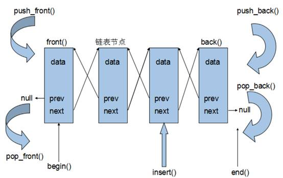
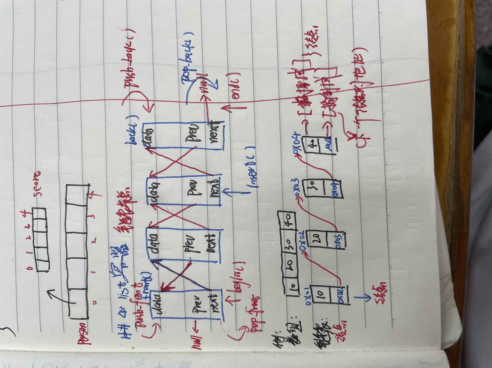
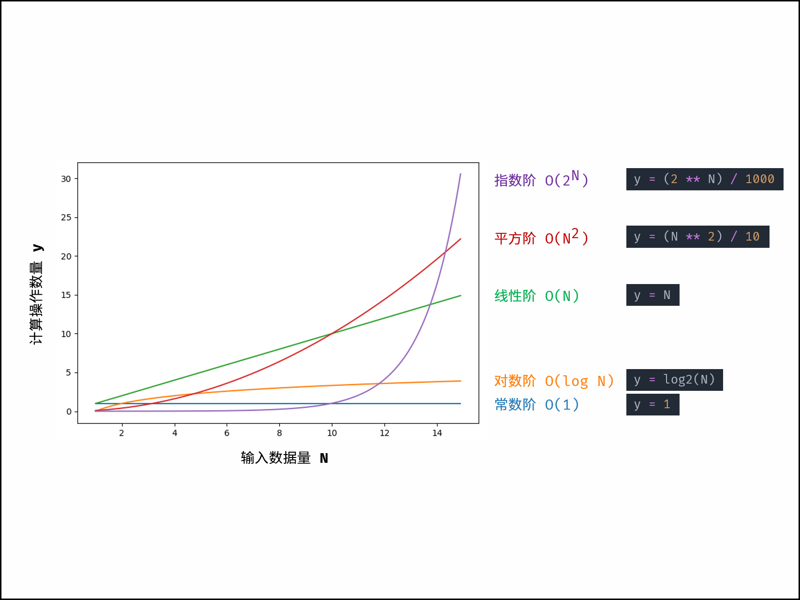

# 1.c++初始

程序开始执行的地方
```cpp
#include <iostream>
using namespace std;//告诉便编译器使用std命名空间
int main() { //
     cout << "Hello, world!!!!" << endl;
     return 0;
}
```
## 1.变量
1-1.变量格式:

.数据类型 变量名 = 变量初始值
int a = 10;
.例子:
//程序开始执行的地方
#include <iostream>
using namespace std;//告诉便编译器使用std命名空间
int main() { //
    int a = 10;
    cout << "a = " << a << endl;

    system("pause")
    return 0;
}

## 2.常量
c++两种常量模式:1.#define 常量名 常量值;2.const 数据类型 常量名 = 常量值

## 3.关键字:命名变量不能用关键字

## 4.标识符命名规则:
4-1.标识符不能是关键字
4-2.标识符只能由字母,数字,下划线组成
4-3.标识符的第一个字符只能为字母或下划线
4-3.标识符的字母区分大小写


## 5.数据类型:

用编程语言进行编程时，需要用到各种变量来存储各种信息。变量保留的是它所存储的值的内存位置。这意味着，当您创建一个变量时，就会在内存中保留一些空间。

您可能需要存储各种数据类型（比如字符型、宽字符型、整型、浮点型、双浮点型、布尔型等）的信息，操作系统会根据变量的数据类型，来分配内存和决定在保留内存中存储什么。
基本的内置类型

C++ 为程序员提供了种类丰富的内置数据类型和用户自定义的数据类型。下表列出了七种基本的 C++ 数据类型：
类型  关键字
布尔型 bool
字符型 char
整型  int
浮点型 float
双浮点型    double
无类型 void
宽字符型  wchar_t

其实 wchar_t 是这样来的：

typedef short int wchar_t;

所以 wchar_t 实际上的空间是和 short int 一样。

一些基本类型可以使用一个或多个类型修饰符进行修饰：

    signed
    unsigned
    short
    long

下表显示了各种变量类型在内存中存储值时需要占用的内存，以及该类型的变量所能存储的最大值和最小值。

注意：不同系统会有所差异，一字节为 8 位。

注意：默认情况下，int、short、long都是带符号的，即 signed。

注意：long int 8 个字节，int 都是 4 个字节，早期的 C 编译器定义了 long int 占用 4 个字节，int 占用 2 个字节，新版的 C/C++ 标准兼容了早期的这一设定。
```cpp
类型  位   范围
char    1 个字节   -128 到 127 或者 0 到 255
unsigned char   1 个字节   0 到 255
signed char 1 个字节   -128 到 127
int 4 个字节   -2147483648 到 2147483647
unsigned int    4 个字节   0 到 4294967295
signed int  4 个字节   -2147483648 到 2147483647
short int   2 个字节   -32768 到 32767
unsigned short int  2 个字节   0 到 65,535
signed short int    2 个字节   -32768 到 32767
long int    8 个字节   -9,223,372,036,854,775,808 到 9,223,372,036,854,775,807
signed long int 8 个字节   -9,223,372,036,854,775,808 到 9,223,372,036,854,775,807
unsigned long int   8 个字节   0 到 18,446,744,073,709,551,615
float   4 个字节   精度型占4个字节（32位）内存空间，+/- 3.4e +/- 38 (~7 个数字)
double  8 个字节   双精度型占8 个字节（64位）内存空间，+/- 1.7e +/- 308 (~15 个数字)
long double 16 个字节  长双精度型 16 个字节（128位）内存空间，可提供18-19位有效数字。
wchar_t 2 或 4 个字节   1 个宽字符

本实例使用了 endl，这将在每一行后插入一个换行符，<< 运算符用于向屏幕传多个值，sizeof() 函数用来获取各种数据类型的大小。

当上面的代码被编译和执行时，它会产生以下的结果，结果会根据所使用的计算机而有所不同：

type:         ************size**************
bool:         所占字节数：1    最大值：1        最小值：0
char:         所占字节数：1    最大值：        最小值：?
signed char:     所占字节数：1    最大值：        最小值：?
unsigned char:     所占字节数：1    最大值：?        最小值：
wchar_t:     所占字节数：4    最大值：2147483647        最小值：-2147483648
short:         所占字节数：2    最大值：32767        最小值：-32768
int:         所占字节数：4    最大值：2147483647    最小值：-2147483648
unsigned:     所占字节数：4    最大值：4294967295    最小值：0
long:         所占字节数：8    最大值：9223372036854775807    最小值：-9223372036854775808
unsigned long:     所占字节数：8    最大值：18446744073709551615    最小值：0
double:     所占字节数：8    最大值：1.79769e+308    最小值：2.22507e-308
long double:     所占字节数：16    最大值：1.18973e+4932    最小值：3.3621e-4932
float:         所占字节数：4    最大值：3.40282e+38    最小值：1.17549e-38
size_t:     所占字节数：8    最大值：18446744073709551615    最小值：0
string:     所占字节数：24
type:         ************size**************
```

### 4-1.整型
数据类型        占用空间          取值范围
short(短整型)    2字节           -2^15-2^15-1
int(整型)    2字节              -2^31-2^31-1
long(长整型)    linux为4字节     -2^31-2^31-1
long long(长长整型)    8字节       -2^63-2^63-1

### 4-2.sizeof关键字
.作用:统计数据类型的所占内存大小
.例:
#include <iostream>
using namespace std;
int main(){
    short a1 = 10;
    cout << "short所占的内存空间为" << sizeof(short) << endl;
    cout << "a1所占的内存空间为" << sizeof(a1) << endl;
    return 0;
}

### 4-3.浮点型:
.分类:单精度float;双精度:double
.区别:{
    数据类型        占用空间        有效数字范围
    float            4               7位
    double            8               15-16位

}

### 4-4.字符型:
.作用:字符型变量用于显示单个字符
.语法: char ch = 'a';------->注意:1.在显示字符型变量时,用单引号,不要用双引号;
 2.单引号内只能有一个字符,不可是字符串
.空间:c++中字符型变量只占1个字节
.例子:
```cpp
#include <iostream>
#define day 100
using namespace std;//告诉便编译器使用std命名空间
int main() { //
     char ch = 'a';
     cout << " a = " << ch << endl;
     cout << (int)ch << endl;//(int)ch表示ch='a'的ascii编码
     system("pause");
     return 0;
}
```

### 4-5.转义字符
1. 作用:表示一些不能显示出来的ascii字符
2. 列表{
    转义字符 意义 ASCII码值(十进制) 
    \a 响铃(BEL) 007 //alarm
    \b 退格(BS) 008 //backspace
    \f 换页(FF) 012 
    \n 换行(LF) 010 
    \r 回车(CR) 013 
    \t 水平制表(HT) 009 //可以整齐地输出数据
    \v 垂直制表(VT) 011 
    \\ 反斜杠 092 
    \? 问号字符 063 
    \' 单引号字符 039 
    \" 双引号字符 034 
    \0 空字符(NULL) 000 
    \ddd 任意字符 三位八进制 
    \xhh 任意字符 二位十六进制

    注意：

    1，\v垂直制表和\f换页符对屏幕没有任何影响，但会影响打印机执行响应操作。

    2，\n其实应该叫回车换行。换行只是换一行，不改变光标的横坐标；回车只是回到行首，不改变光标的纵坐标。

    3，\t 光标向前移动四格或八格，可以在编译器里设置

    4，\' 在字符里（即单引号里）使用。在字符串里(即双引号里)不需要，只要用 ' 即可。

    5，\? 其实不必要。只要用 ? 就可以了（在windows VC6 和tc2 中验证）。

    6， 转义字符中只能使用小写字母，每个转义字符只能看作一个字符。
}


### 4-6.字符串型
1. 语法:string 变量名 = "字符串值"
2. 注意:1.有头文件:#include <string> 2.等号后面要接双引号,字符型用单引号,字符串型用双引号
3. 例:
```cpp
#include <iostream>
#include <string>
using namespace std;//告诉便编译器使用std命名空间
int main() { //
     string a = "a";
     char b = 'a';
     cout << a << endl;
     cout << b << endl;
     system("pause");
     return 0;
}
```
### 4-7.布尔型:
. 作用:表示真和假的值
. 大小:bool型占1个字节

### 4-8.数据的输入：
1. 作用：从键盘获取数据
2. 语法：cin >> 变量
3. 注意:解决无法输入的问题：设置---> 搜索 runInTerminal，将 Run In Terminal 勾选中--->重启
4. 例子：
```cpp
#include <iostream>
using namespace std;
int main()
{
     int a = 1;
     int b = 2;
     cout << "请输入一个值";
     cin >> a; 
     if (a > b)
     {
          cout << "False" ;
     }
     else if (a == b)    
     {
          cout << "False";
     }
     else
     {
          cout << "True";
     }
     return 0;
}
```

# 5. 运算符
运算符是一种告诉编译器执行特定的数学或逻辑操作的符号。C++ 内置了丰富的运算符，并提供了以下类型的运算符：

    算术运算符：+，-,*,/,%，++,--
    关系运算符:>,>=,<,<=,==,!=
    逻辑运算符:&&,||,!
    位运算符:&,|,^,~
    赋值运算符:=,+=,-=,*=,/=,%=,>>=,<<=,&=,|=,^=
    杂项运算符:

本章将逐一介绍算术运算符、关系运算符、逻辑运算符、位运算符、赋值运算符和其他运算符。
## 5-1.算术运算符

   下表显示了 C++ 支持的算术运算符。
   假设变量 A 的值为 10，变量 B 的值为 20，则：
   运算符 描述  实例
   +   把两个操作数相加    A + B 将得到 30
   -   从第一个操作数中减去第二个操作数    A - B 将得到 -10
   *   把两个操作数相乘    A * B 将得到 200
   /   分子除以分母  B / A 将得到 2
   %   取模运算符，整除后的余数    B % A 将得到 0
   ++  自增运算符，整数值增加 1   A++ 将得到 11
   --  自减运算符，整数值减少 1   A-- 将得到 9


## 5-2.关系运算符
1. 下表显示了 C++ 支持的关系运算符。

   假设变量 A 的值为 10，变量 B 的值为 20，则：
   运算符 描述  实例
   ==  检查两个操作数的值是否相等，如果相等则条件为真。    (A == B) 不为真。
   !=  检查两个操作数的值是否相等，如果不相等则条件为真。   (A != B) 为真。
   >   检查左操作数的值是否大于右操作数的值，如果是则条件为真。    (A > B) 不为真。
   <   检查左操作数的值是否小于右操作数的值，如果是则条件为真。    (A < B) 为真。
   >=  检查左操作数的值是否大于或等于右操作数的值，如果是则条件为真。 (A >= B) 不为真。
   <=  检查左操作数的值是否小于或等于右操作数的值，如果是则条件为真。 (A <= B) 为真。

2. 实例
```cpp
#include <iostream>
using namespace std;
 
int main()
{
   int a = 21;
   int b = 10;
   int c ;
 
   if( a == b )
   {
      cout << "Line 1 - a 等于 b" << endl ;
   }
   else
   {
      cout << "Line 1 - a 不等于 b" << endl ;
   }
   return 0;
}
```


## 5-3.逻辑运算符
//注意：非0为真，0为假
1. 下表显示了 C++ 支持的关系逻辑运算符。

   假设变量 A 的值为 1，变量 B 的值为 0，则：
   运算符 描述  实例
   &&  称为逻辑与运算符。如果两个操作数都 true，则条件为 true。   (A && B) 为 false。
   ||  称为逻辑或运算符。如果两个操作数中有任意一个 true，则条件为 true。  (A || B) 为 true。
   !   称为逻辑非运算符。用来逆转操作数的逻辑状态，如果条件为 true 则逻辑非运算符将使其为 false。 !(A && B) 为 true。

//注意要与位运算符&,|,^,!区分，逻辑运算符无异或

2. 实例
```cpp
#include <iostream>
using namespace std;
 
int main()
{
   int a = 5;
   int b = 20;
   int c ;
 
   if ( a && b )
   {
      cout << "Line 1 - 条件为真"<< endl ;
   }
   if ( a || b )
   {
      cout << "Line 2 - 条件为真"<< endl ;
   }
   /* 改变 a 和 b 的值 */
   a = 0;
   b = 10;
   if ( a && b )
   {
      cout << "Line 3 - 条件为真"<< endl ;
   }
   else
   {
      cout << "Line 4 - 条件不为真"<< endl ;
   }
   if ( !(a && b) )
   {
      cout << "Line 5 - 条件为真"<< endl ;
   }
   return 0;
}
```

## 5-4.位运算符

位运算符作用于位，并逐位执行操作。&、 | 和 ^ 的真值表如下所示：
p   q   p & q   p | q   p ^ q//&全真则真，一假则假；|一真则真，全假则假；^异真同假
0   0   0   0   0
0   1   0   1   1
1   1   1   1   0
1   0   0   1   1

假设如果 A = 60，且 B = 13，现在以二进制格式表示，它们如下所示：

A = 0011 1100

B = 0000 1101

-----------------

A&B = 0000 1100

A|B = 0011 1101

A^B = 0011 0001

~A  = 1100 0011

下表显示了 C++ 支持的位运算符。假设变量 A 的值为 60，变量 B 的值为 13，则：

运算符 描述  实例
(1).&   按位与操作，按二进制位进行"与"运算。运算规则：

0&0=0;   
0&1=0;    
1&0=0;     
1&1=1;
(A & B) 将得到 12，即为 0000 1100   

(2).|  按位或运算符，按二进制位进行"或"运算。运算规则：

0|0=0;   
0|1=1;   
1|0=1;    
1|1=1;

(A | B) 将得到 61，即为 0011 1101
   

(3).^ 异或运算符，按二进制位进行"异或"运算。运算规则：
如果a、b两个值不相同，则异或结果为1。如果a、b两个值相同，异或结果为0
0^0=0;   
0^1=1;   
1^0=1;  
1^1=0;

(A ^ B) 将得到 49，即为 0011 0001
   

(4).~(取反运算符，按二进制位进行"取反"运算。运算规则：

~1=-2;   
~0=-1;

(~A ) 将得到 -61，即为 1100 0011，一个有符号二进制数的补码形式。
(5).
A = 0011 1100，B = 0000 1101
<<  二进制左移运算符。将一个运算对象的各二进制位全部左移若干位（左边丢弃，右边补0）。  A << 2 将得到 240，即为 1111 0000
>>  二进制右移运算符。将一个数的各二进制位全部右移若干位，正数左补0，负数左补1，右边丢弃(右边丢弃,左边补0)。    A >> 2 将得到 15，即为 0000 1111
-----------------------------------------------------------------------------------------------------------------------
实例

请看下面的实例，了解 C++ 中可用的位运算符。
```cpp
#include <iostream>
using namespace std;
 
int main()
{
   unsigned int a = 60;      // 60 = 0011 1100  
   unsigned int b = 13;      // 13 = 0000 1101
   int c = 0;           
 
   c = a & b;             // 12 = 0000 1100
   cout << "Line 1 - c 的值是 " << c << endl ;
 
   c = a | b;             // 61 = 0011 1101
   cout << "Line 2 - c 的值是 " << c << endl ;
 
   c = a ^ b;             // 49 = 0011 0001
   cout << "Line 3 - c 的值是 " << c << endl ;
 
   c = ~a;                // -61 = 1100 0011
   cout << "Line 4 - c 的值是 " << c << endl ;
 
   c = a << 2;            // 240 = 1111 0000
   cout << "Line 5 - c 的值是 " << c << endl ;
 
   c = a >> 2;            // 15 = 0000 1111
   cout << "Line 6 - c 的值是 " << c << endl ;
 
   return 0;
}
```
当上面的代码被编译和执行时，它会产生以下结果：

Line 1 - c 的值是 12
Line 2 - c 的值是 61
Line 3 - c 的值是 49
Line 4 - c 的值是 -61
Line 5 - c 的值是 240
Line 6 - c 的值是 15

## 5-5.赋值运算符
```cpp
下表列出了 C++ 支持的赋值运算符：
运算符 描述  实例
=   简单的赋值运算符，把右边操作数的值赋给左边操作数    C = A + B 将把 A + B 的值赋给 C
+=  加且赋值运算符，把右边操作数加上左边操作数的结果赋值给左边操作数    C += A 相当于 C = C + A
-=  减且赋值运算符，把左边操作数减去右边操作数的结果赋值给左边操作数    C -= A 相当于 C = C - A
*=  乘且赋值运算符，把右边操作数乘以左边操作数的结果赋值给左边操作数    C *= A 相当于 C = C * A
/=  除且赋值运算符，把左边操作数除以右边操作数的结果赋值给左边操作数    C /= A 相当于 C = C / A
%=  求模且赋值运算符，求两个操作数的模赋值给左边操作数   C %= A 相当于 C = C % A
<<= 左移且赋值运算符    C <<= 2 等同于 C = C << 2
>>= 右移且赋值运算符    C >>= 2 等同于 C = C >> 2
&=  按位与且赋值运算符   C &= 2 等同于 C = C & 2
^=  按位异或且赋值运算符  C ^= 2 等同于 C = C ^ 2
|=  按位或且赋值运算符   C |= 2 等同于 C = C | 2

请看下面的实例，了解 C++ 中可用的赋值运算符。

复制并黏贴下面的 C++ 程序到 test.cpp 文件中，编译并运行程序。
实例
#include <iostream>
using namespace std;
 
int main()
{
   int a = 21;
   int c ;
 
   c =  a;
   cout << "Line 1 - =  运算符实例，c 的值 = : " <<c<< endl ;
 
   c +=  a;
   cout << "Line 2 - += 运算符实例，c 的值 = : " <<c<< endl ;
 
   c -=  a;
   cout << "Line 3 - -= 运算符实例，c 的值 = : " <<c<< endl ;
 
   c *=  a;
   cout << "Line 4 - *= 运算符实例，c 的值 = : " <<c<< endl ;
 
   c /=  a;
   cout << "Line 5 - /= 运算符实例，c 的值 = : " <<c<< endl ;
 
   c  = 200;
   c %=  a;
   cout << "Line 6 - %= 运算符实例，c 的值 = : " <<c<< endl ;
 
   c <<=  2;
   cout << "Line 7 - <<= 运算符实例，c 的值 = : " <<c<< endl ;
 
   c >>=  2;
   cout << "Line 8 - >>= 运算符实例，c 的值 = : " <<c<< endl ;
 
   c &=  2;
   cout << "Line 9 - &= 运算符实例，c 的值 = : " <<c<< endl ;
 
   c ^=  2;
   cout << "Line 10 - ^= 运算符实例，c 的值 = : " <<c<< endl ;
 
   c |=  2;
   cout << "Line 11 - |= 运算符实例，c 的值 = : " <<c<< endl ;
 
   return 0;
}

当上面的代码被编译和执行时，它会产生以下结果：

Line 1 - =  运算符实例，c 的值 = 21
Line 2 - += 运算符实例，c 的值 = 42
Line 3 - -= 运算符实例，c 的值 = 21
Line 4 - *= 运算符实例，c 的值 = 441
Line 5 - /= 运算符实例，c 的值 = 21
Line 6 - %= 运算符实例，c 的值 = 11
Line 7 - <<= 运算符实例，c 的值 = 44
Line 8 - >>= 运算符实例，c 的值 = 11
Line 9 - &= 运算符实例，c 的值 = 2
Line 10 - ^= 运算符实例，c 的值 = 0
Line 11 - |= 运算符实例，c 的值 = 2
```
2. 注意:unsigned and signed
   1. unsigned的作用就是将数字类型无符号化， 例如 int 型的范围：-2^31 ~ 2^31 - 1，而unsigned int的范围：0 ~ 2^32。看起来unsigned 是个不错的类型，尤其是用在自增或者没有负数的情况。但是在实际使用中会出现一些意外的情况。
   2. signed在默认情况下声明的整型变量都是有符号的类型（char有点特别），如果需声明无符号类型的话就需要在类型前加上unsigned。无符号版本和有符号版本的区别就是无符号类型能保存2倍于有符号类型的正整数数据。 

## 5-6.杂项运算符

1. 下表列出了 C++ 支持的其他一些重要的运算符。
   运算符 描述
   sizeof  sizeof 运算符返回变量的大小。例如，sizeof(a) 将返回 4，其中 a 是整数。
   Condition ? X : Y   条件运算符。如果 Condition 为真 ? 则值为 X : 否则值为 Y。
   ,   逗号运算符会顺序执行一系列运算。整个逗号表达式的值是以逗号分隔的列表中的最后一个表达式的值。
   .（点）和 ->（箭头）    成员运算符用于引用类、结构和共用体的成员。
   Cast    强制转换运算符把一种数据类型转换为另一种数据类型。例如，int(2.2000) 将返回 2。
   &   指针运算符 & 返回变量的地址。例如 &a; 将给出变量的实际地址。
   *   指针运算符 * 指向一个变量。例如，*var; 将指向变量 var。

## 5-7.C++ 中的运算符优先级

运算符的优先级确定表达式中项的组合。这会影响到一个表达式如何计算。某些运算符比其他运算符有更高的优先级，例如，乘除运算符具有比加减运算符更高的优先级。

例如 x = 7 + 3 * 2，在这里，x 被赋值为 13，而不是 20，因为运算符 * 具有比 + 更高的优先级，所以首先计算乘法 3*2，然后再加上 7。

下表将按运算符优先级从高到低列出各个运算符，具有较高优先级的运算符出现在表格的上面，具有较低优先级的运算符出现在表格的下面。在表达式中，较高优先级的运算符会优先被计算。
```cpp
类别      运算符                            结合性 
后缀  () [] -> . ++ - -       从左到右 
一元      + - ! ~ ++ - - (type)* & sizeof     从右到左 
乘除      * / %   从左到右 
加减  + -     从左到右 
移位      << >>   从左到右 
关系  < <= > >=   从左到右 
相等      == !=   从左到右 
位与 AND  &   从左到右 
位异或 XOR     ^   从左到右 
位或 OR   |   从左到右 
逻辑与 AND     &&      从左到右 
逻辑或 OR      ||      从左到右 
条件  ?:      从右到左 
赋值      = += -= *= /= %=>>= <<= &= ^= |=    从右到左 
逗号      ,   从左到右 

```
# 6.修饰符

C++ 允许在 char、int 和 double 数据类型前放置修饰符。修饰符用于改变基本类型的含义，所以它更能满足各种情境的需求。

1. 下面列出了数据类型修饰符：

    signed
    unsigned
    long
    short

修饰符 signed、unsigned、long 和 short 可应用于整型，signed 和 unsigned 可应用于字符型，long 可应用于双精度型。

修饰符 signed 和 unsigned 也可以作为 long 或 short 修饰符的前缀。例如：unsigned long int。

C++ 允许使用速记符号来声明无符号短整数或无符号长整数。您可以不写 int，只写单词 unsigned、short 或 long，int 是隐含的。例如，下面的两个语句都声明了无符号整型变量。

unsigned x;
unsigned int y;

为了理解 C++ 解释有符号整数和无符号整数修饰符之间的差别，我们来运行一下下面这个短程序：
实例
```cpp
#include <iostream>
using namespace std;
 
/* 
 * 这个程序演示了有符号整数和无符号整数之间的差别
*/
int main()
{
   short int i;           // 有符号短整数
   short unsigned int j;  // 无符号短整数
 
   j = 50000;
 
   i = j;
   cout << i << " " << j;
 
   return 0;
}
```
当上面的程序运行时，会输出下列结果：

-15536 50000

上述结果中，无符号短整数 50,000 的位模式被解释为有符号短整数 -15,536。

2. C++ 中的类型限定符

   类型限定符提供了变量的额外信息。
   限定符 含义
   const   const 类型的对象在程序执行期间不能被修改改变。
   volatile    修饰符 volatile 告诉编译器不需要优化volatile声明的变量，让程序可以直接从内存中读取变量。对于一般的变量编译器会对变量进行优化，将内存中的变量值放在寄存器中以加快读写效率。
   restrict    由 restrict 修饰的指针是唯一一种访问它所指向的对象的方式。只有 C99 增加了新的类型限定符 restrict。


# 6.程序流程结构
## 6-1.选择语句
    6-1.选择语句
```cpp
 if(boolean_expression)
 {
    // 如果布尔表达式为真将执行的语句
 }

 如果布尔表达式为 true，则 if 语句内的代码块将被执行。如果布尔表达式为 false，则 if 语句结束后的第一组代码（闭括号后）将被执行。

 C 语言把任何非零和非空的值假定为 true，把零或 null 假定为 false。
 /2.实例

 #include <iostream>
 using namespace std;
  
 int main ()
 {
    // 局部变量声明
    int a = 10;
  
    // 使用 if 语句检查布尔条件
    if( a < 20 )
    {
        // 如果条件为真，则输出下面的语句
        cout << "a 小于 20" << endl;
    }
    cout << "a 的值是 " << a << endl;
  
    return 0;
 }
 ```
 它会产生下列结果：

 a 小于 20
 a 的值是 10

## 6-2.if-else语句
1. 语法
```cpp
if(boolean_expression)
{
 // 如果布尔表达式为真将执行的语句
}
else
{
 // 如果布尔表达式为假将执行的语句
}

如果布尔表达式为 true，则执行 if 块内的代码。如果布尔表达式为 false，则执行 else 块内的代码。
```
2. 实例
```cpp
#include <iostream>
using namespace std;

int main ()
{
 // 局部变量声明
 int a = 100;

 // 检查布尔条件
 if( a < 20 )
 {
     // 如果条件为真，则输出下面的语句
     cout << "a 小于 20" << endl;
 }
 else
 {
     // 如果条件为假，则输出下面的语句
     cout << "a 大于 20" << endl;
 }
 cout << "a 的值是 " << a << endl;

 return 0;
}
```
3. if...else if...else 语句
一个 if 语句后可跟一个可选的 else if...else 语句，这可用于测试多种条件。

   1. 注意：当使用 if...else if...else 语句时，以下几点需要注意：

  一个 if 后可跟零个或一个 else，else 必须在所有 else if 之后。
  一个 if 后可跟零个或多个 else if，else if 必须在 else 之前。
  一旦某个 else if 匹配成功，其他的 else if 或 else 将不会被测试。
   2. 语法

C++ 中的 if...else if...else 语句的语法：
```cpp
if(boolean_expression 1)
{
 // 当布尔表达式 1 为真时执行
}
else if( boolean_expression 2)
{
 // 当布尔表达式 2 为真时执行
}
else if( boolean_expression 3)
{
 // 当布尔表达式 3 为真时执行
}
else 
{
 // 当上面条件都不为真时执行
}

实例

#include <iostream>
using namespace std;

int main ()
{
 // 局部变量声明
 int a = 100;

 // 检查布尔条件
 if( a == 10 )
 {
     // 如果 if 条件为真，则输出下面的语句
     cout << "a 的值是 10" << endl;
 }
 else if( a == 20 )
 {
     // 如果 else if 条件为真，则输出下面的语句
     cout << "a 的值是 20" << endl;
 }
 else if( a == 30 )
 {
     // 如果 else if 条件为真，则输出下面的语句
     cout << "a 的值是 30" << endl;
 }
 else
 {
     // 如果上面条件都不为真，则输出下面的语句
     cout << "没有匹配的值" << endl;
 }
 cout << "a 的准确值是 " << a << endl;

 return 0;
}
```

## 6-3.嵌套if
1. 语法
```cpp
if( boolean_expression 1)
{
 // 当布尔表达式 1 为真时执行
 if(boolean_expression 2)
 {
    // 当布尔表达式 2 为真时执行
 }
}
您可以嵌套 else if...else，方式与嵌套 if 语句相似。
```
2. 实例
```cpp
#include <iostream>
using namespace std;
int main()
{
  int a, b, c;//可以用逗号表示连续输入
  cout << "请输入a =";
  cin >> a;
  cout << "请输入b =";
  cin >> b;
  cout << "请输入c =";
  cin >> c;
  if (a > b){
      cout << "a>b" << endl; 
      if (a > c){
          cout << "a>c" << endl;
      }
      else{
          cout << "a<c" << endl;
      }
  }
  else {
      cout << "a<b" << endl;
  return 0;    
  }
}
```
3. 问题：
error: expected ‘}’ before ‘else’
字面上的意思就是“ else”前面缺少了一个“}”

## 4. switch语句
### 1.功能：
一个 switch 语句允许测试一个变量等于多个值时的情况。每个值称为一个 case，且被测试的变量会对每个 switch case 进行检查。
### 2.语法
switch(expression){
  case constant-expression  :
     statement(s);
     break; // 可选的
  case constant-expression  :
     statement(s);
     break; // 可选的

  // 您可以有任意数量的 case 语句
  default : // 可选的
     statement(s);
}
### 3.规则：

  .switch 语句中的 expression 必须是一个整型或枚举类型，或者是一个 class 类型，其中 class 有一个单一的转换函数将其转换为整型或枚举类型。
  .在一个 switch 中可以有任意数量的 case 语句。每个 case 后跟一个要比较的值和一个冒号。
  .case 的 constant-expression 必须与 switch 中的变量具有相同的数据类型，且必须是一个常量或字面量。
  .当被测试的变量等于 case 中的常量时，case 后跟的语句将被执行，直到遇到 break 语句为止。
  .当遇到 break 语句时，switch 终止，控制流将跳转到 switch 语句后的下一行。
  .不是每一个 case 都需要包含 break。如果 case 语句不包含 break，控制流将会 继续 后续的 case，直到遇到 break 为止。
  .一个 switch 语句可以有一个可选的 default case，出现在 switch 的结尾。
  default case 可用于在上面所有 case 都不为真时执行一个任务。default case 中的 break 语句不是必需的。
总结:
1.switch的参数必须时枚举型;2.case的参数要与swich一致,case可以有多个;
3.break执行时会跳出switch语句,若case中无break,则继续执行下面的case语句,直到遇到break时跳出switch
4.default可有可无,当所有case不满足时会执行default

### 4.实例
```cpp
#include <iostream>
#include <string>
using namespace std;//必须要用namespace才能成功
void printcolor(string color, string str){
  int clr;
  string head;
  string tail;
  string display;
  if (color == "green") clr =1;
  if (color == "red") clr = 2;
  switch(clr){
      case 1:{
          head = "a"; 
          tail = "b";
          display = head + str + tail;  
          break;
      }
      case 2:{
          head = "c"; 
          tail = "d";
          display = head + str + tail;  
          break;
      }
      default:{
          display = str;
          break;
      }
  }   
  cout << display << endl;//只有当有endl的时候,每次调用函数才会换行
}

int main(){
  printcolor("green", "helloworld");
  printcolor("red", "helloworld");
  
  return 0;
}
```

### 6-5.嵌套switch

您可以把一个 switch 作为一个外部 switch 的语句序列的一部分，即可以在一个 switch 语句内使用另一个 switch 语句。
即使内部和外部 switch 的 case 常量包含共同的值，也没有矛盾。

#### 1.语法
```cpp
switch(ch1) {
 case 'A': 
    cout << "这个 A 是外部 switch 的一部分";
    switch(ch2) {
       case 'A':
          cout << "这个 A 是内部 switch 的一部分";
          break;
       case 'B': // 内部 B case 代码
    }
    break;
 case 'B': // 外部 B case 代码
}
```
#### 2.实例
```cpp
#include <iostream>
using namespace std;
int main ()
{
 // 局部变量声明
 int a = 100;
 int b = 200;
 switch(a) {
    case 100:{
       cout << "这是外部 switch 的一部分" << endl;
       switch(b) {
          case 200:
             cout << "这是内部 switch 的一部分" << endl;
       }
 }
 cout << "a 的准确值是 " << a << endl;
 cout << "b 的准确值是 " << b << endl;
 return 0;
}
```
结果:
这是外部 switch 的一部分
这是内部 switch 的一部分
a 的准确值是 100
b 的准确值是 200

#### 6-6.三目运算符
1. 作用:通过三目运算符实现简单判断
2. 语法:表达式1 ? 表达式2 : 表达式3 | c = a > b ? a : b;
3. 解释:若表达式1的值为真,执行表达式2,并返回表达式2的结果
若表达式1的值为假,执行表达式3,并返回表达式3的结果
4. 例子
```cpp
#include <iostream>
using namespace std;
int main(){
   int a = 1, b = 2, c =3;
   c = a > b ? a : b;
   cout << "c = " << c << endl;
   (a > b ? a : b) = 100
   cout << "a = " << a << endl;
}

  int a = 1, b = 2, z, c = 3;
   
  z = a > b ? a : (b > c ? b : c);
   
  cout << "z:" << z << endl;

  这样输出的结果是：z:3
```
## 6.循环语句
### 1.while循环

1. 语法：
 while(condition)
 {
    statement(s);
 }

 在这里，statement(s) 可以是一个单独的语句，也可以是几个语句组成的代码块。
 condition 可以是任意的表达式，当为任意非零值时都为真。当条件为真时执行循环。
 当条件为假时，程序流将继续执行紧接着循环的下一条语句。

 2. 示例:
    1. 例子
```cpp
 #include <iostream>
 using namespace std;
 int main ()
 {
    // 局部变量声明
    int a = 10;

    // while 循环执行
    while( a < 20 )
    {
        cout << "a 的值：" << a << endl;
        a++;
    }
  
    return 0;
 }
```

 当 while() 中的条件值为 0 时，循环就结束了。

 开始 y = 10，每循环一次 y 的值就减 1（y-- 会导致 y 减 1），当 y 值一直减到 0 时，
 退出 while 循环，但是还要继续做 y --操作，所以 y 最后的值就是 -1。

    2.例子2(死循环)
```cpp
 #include <iostream>
 using namespace std;
 int main ()
 {
    // 局部变量声明
    int a = 10;
    // while 无限循环执行
    while( 1 )
    {
        cout << "a 的值：" << a << endl;
        a++;
    }
    return 0;
 }
```
### 2.for循环

1. 语法
 for ( init; condition; increment )//起始表达式；条件表达式；末尾循环体
 {
    statement(s);
 }

2. 控制流:
     init 会首先被执行，且只会执行一次。这一步允许您声明并初始化任何循环控制变量。
     您也可以不在这里写任何语句，只要有一个分号出现即可。
     接下来，会判断 condition。如果为真，则执行循环主体。如果为假，则不执行循环主体，且控制流会跳转到紧接着 for 循环的下一条语句。
     在执行完 for 循环主体后，控制流会跳回上面的 increment 语句。该语句允许您更新循环控制变量。该语句可以留空，只要在条件后有一个分号出现即可。
     条件再次被判断。如果为真，则执行循环，这个过程会不断重复（循环主体，然后增加步值，再然后重新判断条件）。在条件变为假时，for 循环终止。

 总结：1.先执行起始表达式，2.再判断条件表达式，若为True，则执行for循环内的语句，然后再执行末尾循环体的语句，直到不满足条件后跳出循环体；
 若为flase，则执行for循环之下的语句
 3. 例子:
 例1
 ```cpp
 #include <iostream>
 using namespace std;
  
 int main ()
 {
    // for 循环执行
    for( int a = 10; a < 20; a = a + 1 )//起始表达式；条件表达式；末尾循环体

    {
        cout << "a 的值：" << a << endl;//循环语句
    }
  
    return 0;
 }
```
4. 注意事项:for 语句中的三个表达式可部分或全部省略，但两个分号不能省略。

 /1.格式:for (表达式1;表达式2;表达式3) {
     // 循环体语句
 }

 常见的是：将表达式1放在了 for 语句之前，或表达式3放在了循环体中，在 for 语句中就可相应地省略表达式1或表达式3。
 如：
 for(i=1,s=0; i<=100; i++) {
     sum += i;
 }

 可写成如下形式：

 i=1; 
 sum=0;
 for ( ;i<=100; ) {
     sum+=i;  
     i++;
 }      
 // 等效于while循环

 表达式2也可省略，写成：

 for (; ;) {…}

 此时，系统约定表达式2的值为 1，即恒为真，则等同于：

 for (; 1;) {…}

### 3.dowhile循环

1. 功能:不像 for 和 while 循环，它们是在循环头部测试循环条件。
 do...while 循环是在循环的尾部检查它的条件。
 do...while 循环与 while 循环类似，但是 do...while 循环会确保至少执行一次循环。

2. 注意：
 条件表达式出现在循环的尾部，所以循环中的 statement(s) 会在条件被测试之前至少执行一次。
 如果条件为真，控制流会跳转回上面的 do，然后重新执行循环中的 statement(s)。
 这个过程会不断重复，直到给定条件变为假为止。

 总结：先执行do语句，然后执行while语句，当条件不满足时，结束循环，执行下一个语句
3. 例：
```cpp
 #include <iostream>
 using namespace std;
 int main ()
 {
    // 局部变量声明
    int a = 10;
    // do 循环执行
    do
    {
        cout << "a 的值：" << a << endl;
        a = a + 1;
    }while( a < 20 );
  
    return 0;
 }
```
### 4.循环嵌套
1. C++ 中 嵌套 for 循环 语句的语法：
```cpp
for ( init; condition; increment )
{
   for ( init; condition; increment )
   {
      statement(s);
   }
   statement(s); // 可以放置更多的语句
}
```

2. C++ 中 嵌套 while 循环 语句的语法：
```cpp
while(condition)
{
   while(condition)
   {
      statement(s);
   }
   statement(s); // 可以放置更多的语句
}
```
3. C++ 中 嵌套 do...while 循环 语句的语法：
```cpp
do
{
   statement(s); // 可以放置更多的语句
   do
   {
      statement(s);
   }while( condition );
 
}while( condition );
```
关于嵌套循环有一点值得注意，您可以在任何类型的循环内嵌套其他任何类型的循环。
比如，一个 for 循环可以嵌套在一个 while 循环内，反之亦然。
4. 例子：
下面的程序使用了一个嵌套的 for 循环来查找 2 到 100 中的质数：
```cpp
planA    //质数又称为素数，是一个大于1的自然数，除了1和它自身外，不能被其他自然数整除的数叫做质数；否则称为合数。
#include<iostream>
using namespace std;
int main()
{
  int i,j,count=0;    
  for (i=0;i<100;i++) {
      for(j=2;j<=i;j++) //从2遍历到i-1，寻找是否有i的因子
      {
          if((i%j) == 0)
          {
              break;
          }
      }
      if(j==i)
      {  //判断是否从第二个for中正常循环出来的i                                          
          cout << i << endl;     
          count++;
      }
  }
  cout << "总数为count=" << count << endl;
  return 0;
}
planB:
#include <iostream>
using namespace std;
void Primer_Search(int n);
int main(){
  int n;
  cout << "请输入一个数字范围n=";
  cin >> n;
  Primer_Search(n);
}

void Primer_Search(int n){
  int count = 0, i, j;
  for (i = 0; i <= n; i++){
      for (j = 2; j <= i; j++){
          if (i % j == 0){
              break;
          }
          }
      if (i == j)//当且仅当只能被自己整除的时候才能输入质数，例如6%2=0，但是此时i=6,j=2,i!=j,所以此时不能当质数输出
      {
          cout << "质数i=" << i << endl;
          count++;
      }   
  }
}
```
## 7.跳转语句"
### 1.break
1. 用法
   1. 当 break 语句出现在一个循环内时，循环会立即终止，且程序流将继续执行紧接着循环的下一条语句。
   2. 它可用于终止 switch 语句中的一个 case。
   3. 如果您使用的是嵌套循环（即一个循环内嵌套另一个循环），break 语句会停止执行最内层的循环，然后开始执行该块之后的下一行代码。

2. 实例
```cpp
#include <iostream>
using namespace std;
int main ()
{
   // 局部变量声明
   int a = 10;

   // do 循环执行
   do
   {
       cout << "a 的值：" << a << endl;
       a = a + 1;
       if( a > 15)
       {
          // 终止循环
          break;
       }
   }while( a < 20 );
 
   return 0;
}
```

### 2.coutinue
1. 特点:
   1. C++ 中的 continue 语句有点像 break 语句。但它不是强迫终止，continue 会跳过当前循环中的代码，强迫开始下一次循环。
   2. 对于 for 循环，continue 语句会导致执行条件测试和循环增量部分。
   3. 对于 while 和 do...while 循环，continue 语句会导致程序控制回到条件测试上。
2. 例子
```cpp
#include <iostream>
using namespace std;
int main ()
{
 // 局部变量声明
 int a = 10;

 // do 循环执行
 do
 {
     if( a == 15)
     {
        // 跳过迭代
        a = a + 1;
        continue;
     }
     cout << "a 的值：" << a << endl;
     a = a + 1;
 }while( a < 20 );

 return 0;
}
/2-2.例2
只输出奇数不输出偶数
#include <iostream>
using namespace std;
#include <string>
int main(){
int i, j;
cout << "请输入一个数字范围" << endl;
cin >> j;
for (i = 0; i <= j; i++){
  if (i % 2 == 0){
      continue;
  }
  cout << i << endl;
}

}
```
### 3.go-to 
1. 作用：goto 语句允许把控制无条件转移到同一函数内的被标记的语句。
2. 注意：在任何编程语言中，都不建议使用 goto 语句。因为它使得程序的控制流难以跟踪，使程序难以理解和难以修改。
        任何使用 goto 语句的程序可以改写成不需要使用 goto 语句的写法
3. 语法
goto label;
..
.
label: statement;

在这里，label 是识别被标记语句的标识符，可以是任何除 C++ 关键字以外的纯文本。标记语句可以是任何语句，放置在标识符和冒号（:）后边。
4. 例子
```cpp
#include <iostream>
using namespace std;
int main(){
    cout << "1" << endl;
    goto flag;
    cout << "2" << endl;
    cout << "3" << endl;
    cout << "4" << endl;
    cout << "5" << endl;
    flag:
    cout << "6" << endl;
}
```
# 7.数组
## 1. 一维数组
1. 一维数组的定义方式
   1. 数据类型 数组名 [数组长度];
   2. 数据类型 数组名[数组长度] = {value1, value2,...};
   3. 数据类型 数组名称[] = {value1, value2};
2. 访问数组：arr[9]
3. 赋值：arr[3]=100
4. 例子
```cpp
#include <iostream>
using namespace std;
int main()
{
  //方式1
  int arr1[5];
  arr1[0] = 10;
  arr1[1] = 10;
  arr1[2] = 10;
  cout << arr1[0] << endl;//访问数据元素
  //方式2嵌套输出数组
  int arr2[5] = {1, 2, 3, 4, 5};
  for (int i =0; i < 5; i++){
      cout << arr2[i] << endl;// cout = c + out
  }
  ///////方式3,定义数组的时候必须有初始长度
  int arr3[] = {1, 2, 3, 4};
  for (int i =0; i < 4; i++){
      cout << arr3[i] << endl;// cout = c + out
  }
}
/例2.
#include <iostream>
using namespace std;

#include <iomanip>
using std::setw;

int main ()
{
 int n[ 10 ]; // n 是一个包含 10 个整数的数组

 // 初始化数组元素          
 for ( int i = 0; i < 10; i++ )
 {
    n[ i ] = i + 100; // 设置元素 i 为 i + 100
 }
 cout << "Element" << setw( 13 ) << "Value" << endl;

 // 输出数组中每个元素的值                     
 for ( int j = 0; j < 10; j++ )
 {
    cout << setw( 7 )<< j << setw( 13 ) << n[ j ] << endl;
 }

 return 0;
 ```
5. 访问一维数组的方法
```cpp
#include <iostream>
using namespace std;
int main()
{
  //1.通过数组名统计整个数组占用内存大小
  int arr4[4] = {1, 2, 3, 4};
  cout << "整个数组占用内存空间为:" << sizeof(arr4) << endl;
  cout << "每个元素占用内存空间为:" << sizeof(arr4[0]) << endl;
  cout << "数组中元素个数为:" << sizeof(arr4) / sizeof(arr4[0]) << endl;
  // 2.可以通过数组名查看数组首地址
  cout << "数组首地址为:" << (int)arr4 << endl;//int是指将地址切换为10进制
  cout << "数组第一个元素地址为:" << (int)&arr4[0] << endl;
  cout << "数组第二个元素地址为:" << (int)&arr4[1] << endl;
  // cout << "数组中第一个元素地址为:" << (int)&arr4[0] << endl;
  //&相当于是个取符号
  return 0;
}
```
6. 案例：
```cpp
#include <iostream>
using namespace std;
int main()
{
  int i, max=0, arr[5]={1, 2, 3, 4, 5};
  for (i = 0; i < 5; i++){
      if (arr[i] > max){
          max = arr[i];
      }
  }
  cout << "max = " << max << endl;
}
/2.案例2：冒泡排序
//程序包含两种冒泡排序算法
//从小到大的冒泡排序BubbleSort
//从大到小的冒泡排序InverseBubbleSort
#include <iostream>
using namespace std;
void BubbleSort(int arr[], int n);
void InverseBubbleSort(int arr[], int n);
void printArray(int arr[], int n);
const int n = 8;
int main(int argc, char **argv) //argc[]
{
  int a[n] = {6,5,3,1,8,7,2,4};
  BubbleSort(a,n);
  cout << "从小到大的冒泡排序:\n";
  printArray(a,n);
  int b[n] = {6,5,3,1,8,7,2,4};
  InverseBubbleSort(b,n);
  cout << "从大到小的冒泡排序:\n";
  printArray(b,n);
  return 0;
}
void BubbleSort(int arr[], int n)
{
  for(int i = 0; i < n - 1; i++)
  {
      for(int j = 0; j < n - i - 1; j++)
      {
          if(arr[j] > arr[j+1])
              swap(arr[j],arr[j+1]);//swap包含在命名空间std中，swap(a,b)表示对a,b进行交换
      }
  }
}
void InverseBubbleSort(int arr[], int n)//要声明函数里面的数据类型
{
  for(int i = 0; i < n - 1; i++)//有n个数，则要走n-1个循环，第i次循环要进行最多n-i-1次排序
      //因为第一次循环已经把最大的数放在最后了，所以第二次循环就只进行n-1次排序
  {
      for(int j = n - 1; j > 0; j--)
      {
          if(arr[j] > arr[j - 1])
          {
              swap(arr[j],arr[j-1]);
          }
      }
  }
}
void printArray(int arr[], int n)
{
  for(int i = 0; i < n; i++)
  {
      cout << arr[i] << " ";
  }
  cout << endl;
}
```
------------------------
7. 注：int main(int argc, char **argv)的详解.
   1. argv:命令行的参数总个数，argv[]是argv个参数，第0个参数是程序的全名，以后的参数命令行后面跟的是用户输入额参数
所以,argc是参数个数，argv[]是argv个参数，argv[i] = 'output'
   2. char *argv[]是一个字符串组，其大小为int argc,主要用于命令行参数argv[]参数，数组里的每一个元素代表一个参数；比如输入：test a b c ,argc = r,argv[0] = "test",argv[1] = "a",...,argv[3] = "c",argc记录了用户在运行程序时输入的参数个数，arg指向的数组中至少有一个字符指针，即arg[0],他通常指向程序中的可执行文件的文件名
   3. 总结：
int argv:表示在命令行输入参数命令的时候，一共有多少参数，
比如说，可执行文件为a.cpp,则当:a.cpp a b c 时候，argc = 3,
char *argv[]:表示用来取得你所输入的参数，当可执行文件为：a.cpp时候：
当,aa.cpp a b，argc = 3,argv[0]="aa",argv[1]="a",argv[2]="b"
最后总结:argc是参数的个数，argv[]是参数，argv[0]是文件名，argv[1]是第一个参数...   
4. 总结
   1. 关于函数调用的问题：若是先写int main(){}后写void func(){},则需要在最首端申明void func()；，在int main()中调用
若是先写void func(),则无需申明，只需在int main()中调用就行
   2. 原则：void里面要指明数据类型；而且int main()中的变量在函数中不能复用，需要额外定义
## 2. 2维数组
### 1. 形式：type name[size1][size2]...[sizeN];
### 2. 语法：int threedim[3][3][3];---->声明一个3x3x3的Matrix
### 3. 二维数组：
1. 初始化二维数组：int a[3][4]={{0, 1, 2, 3},//第一行
                       {4, 5, 6,7},//第二行
                       {8, 9, 10, 11}};//第三行
2. 初始化方法2：int a[3][4]={0,......,11};
   1. 访问2维数组：int val = a[2][3];//访问第3行第4列的元素
   2. 修改2维数组:val[0][0] = 123
   3. 例子：
```cpp
#include <iostream>
using namespace std;
int main(){
    int a[5][2] = {{0, 0},{1,2}, {2,4}, {3, 6}, {4, 8}}
    for (int i = 0; i < 5; i++){//输出2维数组中的每个值
        for (int j = 0; j < 2; j++){
            cout << "a[" << i << "][" << j << "]";
            cout << a[i][j] << endl;
        }
    }
    return 0;
}
.例2：
#include <iostream>
using namespace std;
int main(){
    int n;
    cout << "请输入行数n1="
    cin >> n1;
    cout << "请输入列数n2="
    cin >> n2;
    int a[n1][n2];
    for (int i = 0; i < n1; i++){
        for (int j = 0; j < n2; j++){
            cout >> "a[i][j]=" >> a[i][j];
            printf("a[%d][%d]=",a[i][j])
        }
    }
    return 0;
}
```
### 3. 2维数组空间：

   内存空间：sizeof(arr)
   第一行占用的内存：sizeof(arr[0])  行数：sizeof(arr)/sizeof(arr[0])//总内存数/第一行的内存
   第一行第一列元素占用的内存：sizeof(arr[0][0])   列数：sizeof(arr[0])/sizeof(arr[0][0])//第一行的内存数/第一个元素内存数
   2维数组的首地址：(int)arr
   2维数组的第1行的首地址：(int)arr[0]
   2维数组的第2行的首地址：(int)arr[1]
   2维数组的第1个元素的首地址：(int)&arr[0][0]

# 8.函数
函数编写的步骤：申明--->定义--->在main()中调用
## 1. 定义：
返回值类型 函数名 (参数列表){//参数列表：数据类型 变量
  函数体语句
  return 表达式
}
### 1.定义格式:
return_type function_name( parameter list )
{
  body of the function
}

return_type:为函数的返回的数据类型，有些函数执行所需的操作而不返回值，这种情况下，
   return_type是void(所以当定义为int,double, char等这些类型的函数时，必须有返回值，而void不能有返回值,所以,为非void型函数时,必须有返回值,为void型函数时,不能有返回值)
function_name:函数名称
parameter list:参数列表包括参数的类型，顺序和数量，它可以没有
body of the function：定义函数任务的语句

### 2.声明：
return_type function_name( parameter list );
例子：
```cpp
#include <iostream>
using namespace std;
#include <string>
int add(int num1, int num2)
{//num1和num2为形参
    int sum = num1 +num2;
    return sum;
}
int max(int a, int b){
    int c;
    c = a > b ? a : b;
    return c;
}

void Select(int a){
    cout << "a*2 = " << a*2 << endl;
}

int main(){
    int max1, sum, c;//a,b 为形参数
    sum = add(1, 3);
    max1 = max(1, 3); 
    Select(100);//因为void不能有返回值,所以只能用直接调用而不能赋值给别的变量
    cout << "sum = " << sum << endl;
    cout << "max = " << max1 << endl;
    return 0;
}
```

### 3.调用：
1. 功能：使用定义好的函数
2. 语法：函数名(参数)
3. 例子：
```cpp
#include <iostream>
using namespace std;
#include <string>
int add(int num1, int num2){//num1和num2为形参
 int sum = num1 +num2;
 return sum;
}
int main(){
 int a=10, b=10;//a,b 为形参数
 int sum1 = add(a, b);//add(a,b)=sum
 cout << "sum = " << sum1 << endl;//这个sum和上面的sum不是一个sum ,他是具有
}
```
### 4.调用的方法
1. 值传递：//值传递不会影响实参
函数定义
```cpp
void swap(int x, int y)//如果函数不需要返回值，声明的时候可以写void
{
int temp;

temp = x; /* 保存 x 的值 */
x = y;    /* 把 y 赋值给 x */
y = temp; /* 把 x 赋值给 y */

}
```cpp
#include <iostream>
using namespace std;

// 函数声明
void swap(int x, int y);

int main ()
{
// 局部变量声明
int a = 100;
int b = 200;
swap(a, b);

cout << "交换后，a 的值：" << a << endl;
cout << "交换后，b 的值：" << b << endl;
return 0;
}
```
2. 引用传递:
```cpp
//引用传递可以改变实参的值
 #include <iostream>
 using namespace std;
 void swap02(int &x, int &y)//
 {
    int temp;
    temp = x;    /* 保存地址 x 的值 */
    x = y;        /* 把 y 赋值给 x */
    y = temp;    /* 把 x 赋值给 y */
 }

 int main ()
 {
    int a = 100, b = 200;  
    swap02(a, b); 
    cout << "交换后a= " << a << endl;
    cout << "交换后b= " << b << endl;
    return 0;
 }
 ```
3. 地址传递：//地址传递可以改变实参的值
 ```cpp
 void swap03(int *p1, int *p2){//用指针接受地址
     int temp = *p1;
     *p1 = *p2;
     *p2 = temp;//解引用，实现值的替换
 }
 int main(){
     int a = 10, b = 20;
     swap03(&a, &b);//传入a, b变量的地址
 }
 ```
4. 总结：
```cpp
#include <iostream>
using namespace std;
void swap01(int a, int b){
  int temp = a;
  a = b;
  b = temp;
}

void swap02(int *p1, int *p2){//用指针接受地址,p1=&a,p2= &b
  int temp = *p1;//p1指针的值赋给temp
  *p1 = *p2;//p2指针的值和p1指针的值的交换
  *p2 = temp;//temp的值，也就是*p1,即是p1的值传递给*p2,也就是p2的值
}

void swap03(int &a, int &b){
  int temp = a;
  a = b;
  b = temp;
}

int main(){
  int a = 10, b = 20;
  swap01(a, b);//值传递不能修改实参的值
  cout << "a = " << a << endl;
  cout << "b = " << b << endl;
  swap02(&a, &b);//传入a, b变量的地址，*p来显示指针值；地址传递可以修改实参的值
  cout << "a = " << a << endl;
  cout << "b = " << b << endl;
  swap03(a, b);//地址传递不可以修改实参的值
  cout << "a = " << a << endl;
  cout << "b = " << b << endl;
}   
```

### 5. 函数的常见样式：1.无参无返；有参无返；无参有反；有参有返回
```cpp
1.无参无返
void test01(){
    //void a = 10;无类型不可以创建变量，因为无法分配内存
    cout << " " << endl;
    // test01()；函数调用
}
2.有参无返：
void test02(int a){
    cout << "dsdf" << a << endl;
}
3.无参有返：
int test02(){
    cout << "dfs" << endl;
    return 100
}
4.有参有返:
int test04(int a){
    cout << "dsfsdf" << a endl;
    return a;
}
////////////////函数调用要在之后，先main后定义，要申明函数；先定义后main，不要申明函数
int main(){
    test01();
    test02(100);//调用函数的时候就不需要定义变量类型,例如test01(int 100)是错误的
    int num1 = test03(); cout << "num1 = " << num1 << endl;//num1 = 100
    int num2 = test04(100);//
    cout << "num2=" << num2;
}
```
### 6. 函数的申明：函数申明能有多次，但是定义只能有1次

   int max(int a, int b);
   int max(int a, int b);
   int max(int a, int b){
      return a > b ? a : b;
   }
   int main(){
      max(1,2)
   }
### 7. 函数的分文件编写
1. 作用：让代码更加简洁
2. 步骤：1.创建后缀名为.h的头文件 2.创建后缀名为.cpp的源文件
3. 在头文件中写函数声明 4.在源文件中写函数定义 5.调用函数
4. 例：
```cpp
 //swap.h文件
 #include <iostream>
 using namespace std;
 void swap(a, b);
 //swap.cpp文件;
 #include <iostream>
 using namespace std;
 void swap(int a, int b){
     int temp = a;
     a = b;
     b = temp;
     cout << "a = " << a << endl;
     cout << "b = " << b << endl;
 }
 //调用文件
 #include <iostream>
 using namespace std;
 #include "swap.h"
 int main(){
     swap(1, 3);
     return 0;
 }
```
### 8.函数参数调用方法：
1. 传值调用：
2. 指针调用：
   1. 把参数的地址复制给形式参数，在函数内，该地址用于访问调用中要用到的实际参数这意味着修改形式参数会影响实际参数，按指针传递，参数指针就像其他值一样传递给函数
   2. 例子：
```cpp
// 函数定义
void swap(int *x, int *y)
{
 int temp;
 temp = *x;    /* 保存地址 x 的值 */
 *x = *y;        /* 把 y 赋值给 x */
 *y = temp;    /* 把 x 赋值给 y */
}
include <iostream>
using namespace std;

// 函数声明
void swap(int *x, int *y);

int main ()
{
 // 局部变量声明
 int a = 100;
 int b = 200;
 cout << "交换前，a 的值：" << a << endl;
 cout << "交换前，b 的值：" << b << endl;

 /* 调用函数来交换值
  * &a 表示指向 a 的指针，即变量 a 的地址 
  * &b 表示指向 b 的指针，即变量 b 的地址 
  */
 swap(&a, &b);
 cout << "交换后，a 的值：" << a << endl;
 cout << "交换后，b 的值：" << b << endl;
 return 0;
}
```

3. lambda表达式
   1. 形式：[capture](parameters)->return-type{body}
   2. 例子：[](int x, int y){return x < y;}
如果没有返回值可以表示为:[capture](parameters){body},例如：[]{++global_x;}

   /* c++的变量传递俄传引用的区别，可以通过前面的[]来指定：
   []      // 沒有定义任何变量。使用未定义变量会引发错误。
   [x, &y] // x以传值方式传入（默认），y以引用方式传入。
   [&]     // 任何被使用到的外部变量都隐式地以引用方式加以引用。
   [=]     // 任何被使用到的外部变量都隐式地以传值方式加以引用。
   [&, x]  // x显式地以传值方式加以引用。其余变量以引用方式加以引用。
   [=, &z] // z显式地以引用方式加以引用。其余变量以传值方式加以引用。 */


# 9.指针//pointer:ptr
## 1.指针的作用：可以通过指针间接访内存，其值为另一个变量的地址，即是内存的直接地址
## 2.指针变量的定义和使用

### 1. 语法：数据类型 *变量名;type * var name;
int    *ip;    /* 一个整型的指针 */
double *dp;    /* 一个 double 型的指针 */
float  *fp;    /* 一个浮点型的指针 */
char   *ch;    /* 一个字符型的指针 */
### 2. 例子：
```cpp
#include <iostream>
using namespace std;
int main(){
    //1.定义指针
    int * p;
    int a = 10;
    p = &a;//让指针记录a的地址.所以指针p就是地址
    cout << "a的地址为" << &a << endl;
    cout << "指针p=" << p << endl;
    //2.使用指针
    //可以通过解引用的方式找到指针指向的内存
    //指针前加*表示解引用，找到指针指向的内存中的数据,修改*p,则会修改a的值
    *p = 234.2;//*p只能为整型
    cout << "a = " << a << endl;
    cout << "*p = " << *p << endl;
    //p = &a,*p = a,指针为变量地址，指针的解引用为变量的内容
}
```
### 3. 指针所占的空间：
```cpp
#include <iostream>
using namespace std;
int main(){
   int a = 10;
   int * p = &a;
   cout << "sizeof(p)=" << sizeof(int *) << endl;
   cout << "sizeof(p)=" << sizeof(char *) << endl;
   cout << "sizeof(p)=" << sizeof(double *) << endl;
   cout << "sizeof(p)=" << sizeof(bool *) << endl;
   cout << "sizeof(p)=" << sizeof(long *) << endl;
   cout << "sizeof(p)=" << sizeof(string *) << endl;
   return 0;
}
```
### 4. 指针的类型：
1. 空指针:
   1. 定义：指针变量指向内存中编号为0的空间
   2. 注意：空指针指向的内存是不可以访问的
   3. 例子：
```cpp
#include <iostream>
using namespace std;
int main(){
    int a = 10;
    int * p = NULL;//空指针用于给指针变量初始化
    *p = 100;//空指针不可访问，因为0-255的内村空间为系统空间，不能直接访问和修改
    cout << *p << endl;//
    return 0;
}
```
2. 野指针：
   1. 定义：指针变量指向非法的内存空间
   2. 例子：
```cpp
int main(){
  int * p = (int *)0x1100;
  cout << *p << endl;
  return 0;
}
//由于空指针和野指针不是我们申请的空间，所以不要访问，而且也不能访问
```
3. const修饰指针
   1. const修饰指针---常量指针
  常量指针的指向可以修改，但是指向的值不可以修改：
  const int * p = &a;
   2. const修饰常量---指针常量
  指针常量的指向不能改，但是值可以改
  int * const p = &a; 
   3. const既修饰指针又修饰常量
  const int * const p = &a;
  4. 总结：
 const int * p:常量指针，不能改值;int * const p:指针常量，不能改址

4. 例子：
```cpp 
#include <iostream>
using namespace std;
int main(){
   int a = 10, b = 10;
   /*常量指针*/
   const int * p1 = &a;
   int *p2 = &a;
   cout << *p1 << endl;
   *p1 = b;//常量指针的值不能修改
   p1 = &b;
   cout << *p1 << endl;
   *p2 = b;//变量指针的值可以修改
   cout << *p2 << endl;
   /*指针常量*/
   int * const p = &a;
   *p = 20;//指针的值可以改变
   p = &b;//指针的指向不能变化
   /*const即修饰指针，又修饰常量*/
   const int * const p = &a;
   *p = 20;//错误，此时p的指向和值都不能改变
   p = &b;//
   return 0;
   /*注意:看一个指针是否可变，就是要看const修饰谁，若是const int * p,那么值不能变
   若是int * const p,那么指向就不能变化 */
}
```
### 4.指针的算术运算：
.我们喜欢在程序中用指针代替数组，因为变量针可以递增，但是数组不能递增,因为数组是一个常量指针
```cpp
#include <iostream>
using namespace std;
const int MAX = 3;
int main(){
    int var[MAX] = {1, 2, 3};
    int *ptr;
    ptr = var;
    for (int i = 0; i < MAX; i++)
    {
        cout << "Address of var[" << i << "] = ";
        cout << ptr << endl;
        cout << "Value of var[" << i << "] = ";
        cout << *ptr << endl;
        ptr--;//移动到下一位置
    }
    return 0;
}
例子2.
    #include <iostream>
    using namespace std;
    const int MAX = 8;
    int main(){
        int i, arr[MAX] = {0, 1, 2, 3, 4, 5, 6, 7};
        int *prt;
        prt = arr;//prt为arr的初始地址
        for (i = 0; i < MAX; i++){
            cout << "the address of arr[" << i << "] is " << prt << endl;
            cout << "the value of arr[" << i << "] is " << *prt << endl;
            prt++;
        }   
        return 0;
    }

/*
int height[10];//int型的数组
cout << &height << endl;//&height相当于整个height数组取地址
cout << &height[0] << endl;//&height[0]相当于对height[0]取地址
height = &height[0]
*/
    .注意事项：
    short int height[10]; //int型的数组（short int 每个数据2字节）
cout <<  "height       "<< height << endl 
     <<  "height+1     "<< height + 1 << endl
     <<  "&height[0]   " <<  &height[0] << endl
     <<  "&height+1    "<< &height + 1<< endl
     <<  "height+9     "<< height+9 << endl
     << "height+10    " << height + 10 << endl

    height       0136F900
    height+1     0136F902
    &height[0]   0136F900
    &height+1    0136F914
    height+9     0136F912
    height+10    0136F914

    .结论:
        1.height  = &height[0] = &height
        2.height + 1 = height + 2 = height + 1个short int 元素
        3.height + 9 = height[]的最后一个元素的地址，height + 10 = 该数组结束后的第一个地址
        4.&height + 1 = height + 10
        5.*height = height[0] = i //把i值复制给height中的第一个元素
        6.*(height + 1)//取height内存后面第一个元素，若height中每个元素为4个字节，则height+1就指向&height[0]+4这个地址
```
### 5.指针和数组：
一个指向数组开头的指针可以通过指针的算术运算或数组索引来访问数组
```cpp
例1
#include <iostream>
using namespace std;
int main ()
{
 int arr[] = {1, 2, 3};
 int * ptr = arr;//ptr = arr，可以理解为指针就是数组，所以arr[i]= ptr[i]
 for (int i = 0; i < 3; i++){
    cout << *ptr << endl;
    cout << ptr[i] << endl;//*ptr = ptr[i]
    cout << ptr << endl;
    ptr++;      
 }
}
例2：
#include <iostream>
using namespace std;
void bubbleSort(int * arr, int len)
{
  for (int i = 0; i < len -1; i++)
  {
      for (int j = 0; j < len -i -1; j++)
      {
          if (arr[j] > arr[j+1]){
              int temp = arr[i];
              arr[j] = arr[j+1];
              arr[j+1] = temp;
          }
      }
  }
}
void printArray(int * arr, int len){
  for (int i = 0; i < len; i++){
      cout << arr[i] << endl;
  }
}
int main(){
  int arr[6] = {1, 2, 3, 4, 5, 6};
  bubbleSort(arr, 6);//arr为数组的首地址，len为数组的长度，将arr的首地址传入
  printArray(arr, 6);
  return 0;
}
```
### 6.指针数组：
1. 申明：int *prt[MAX];把指针prt申明为一个数组,有MAX个整数指针构成，所以prt中的每个元素
都是一个指向int值的指针,prt[MAX]就是一个有MAX元素的指针数组
2. 例子：
```cpp
#include <iostream>
using namespace std;
const int MAX = 3;
int main ()
{
 int  var[MAX] = {10, 100, 200};
 int *ptr[MAX];
 for (int i = 0; i6 < MAX; i++)
 {
    cout << "Value of var[" << i << "] = ";
    ptr[i] = &var[i]; 
    cout << *ptr[i] << endl;
 }
 return 0;
}
```
### 7.指向指针的指针：
1. 定义：指针的指针就是将指针的地址存放在另一个指针里面
2. 图像：
  ptr       ptr      variable
address---->address--->value 
3. 申明：int **var;
4. 例子：
```cpp
#include <iostream>
using namespace std;
int main ()
{
  int  var;
  int  *ptr;
  int  **pptr;

  var = 3000;

  // 获取 var 的地址
  ptr = &var;

  // 使用运算符 & 获取 ptr 的地址
  pptr = &ptr;

  // 使用 pptr 获取值
  cout << "var 值为 :" << var << endl;
  cout << "*ptr 值为:" << *ptr << endl;
  cout << "**pptr 值为:" << **pptr << endl;
  cout << "var 地址为：" << &var endl;
  cout << "ptr = &var 地址为：" << ptr endl;
  cout << "ptr 地址为：" << &ptr endl;
  cout << "pptr = ptr = &var 值为var的地址为：" << *pptr endl;
  cout << "pptr 地址为：" << &pptr << endl;
  return 0;
}
  var 值为 :3000
  *ptr 值为:3000
  **pptr 值为:3000
  var 地址为 :0x7ffeec7a65e8
  ptr=&var 值为var的地址:0x7ffeec7a65e8
  ptr地址为:0x7ffeec7a65e0
  *pptr=ptr=&var  值为var的地址:0x7ffeec7a65e8
  pptr 地址为:0x7ffeec7a65d8

#include <iostream>
using namespace std;
int main()
{
  int  var;
  int* ptr;
  int** pptr;
  int*** ppptr;
  var = 3000;
  // 获取 var 的地址
  ptr = &var;
  // 使用运算符 & 获取 ptr 的地址
  pptr = &ptr;

  ppptr = &pptr;
  // 使用 pptr 获取值
  cout << "var 值为 :" << var << endl;
  cout << "ptr 值为:" << ptr << endl;
  cout << "pptr 值为:" << pptr << endl;
  cout << "pptr 值为:" << ppptr << endl;

  return 0;
}
  输出结果为：
  var 值为 :3000
  ptr 值为:0x7ffe5deb4e14
  pptr 值为:0x7ffe5deb4e08
  pptr 值为:0x7ffe5deb4e00

.结论：
1.若是pptr = &ptr ; ptr = &var---->var = *ptr(一级指针的值) = **pptr(二级指针的值)  
2.p,*p,&p的关系：*是寻址符号，&是地址符号，p为变量值，所以*p为p值(地址)的解引用，&p为p的地址,p为值,
    有多少个*,就解引用多少次,解引用就是对地址进行寻址**
3.int var, *ptr, **pptr(实际上定义的虽然是**pptr,但是指针变量是*ptr,同理可得ptr)--->  
4.int **pptr------>*pptr为指针变量地址，**pptr为指针变量值
     当满足&var = ptr, &ptr = pptr时候：
        1.var = *ptr = **pptr(取值）,//重点****
        2.&var = ptr = *pptr(取址)//把*prt想成对prt的值进行解析，即进行指向
               示意图
        var       ptr       pptr 
    d1 3000<---d2 d1 <---d3 d2
5.分开来看:
ptr = &var
*ptr = *(&var) = var //ptr指针的值就是var的地址,*ptr是直接对var地址取值
pptr = &pt r
*pptr = *(&ptr) = ptr = &var
**pptr = *(*pptr) = *(&var) = var    
注意:每次在p前加入一个*,相当于对p进行 一次取值,
6.对于**pptr,当未定义的时候，只能取得,pptr,&pptr,不能取得,*pptr,**pptr
若var = 30,*pptr = &var,(pptr = &var是错误的),此时*(*pptr) = *(&var) = 30
所以对于**pptr，*pptr = &var,即是保证2次寻址，pptr = &var就是1次寻址了，因为此时
*pptr = *(&var) = 30,**pptr就失去了意义    
7.指针和数组：int arr[]= {.......},int * ptr = arr<------> ptr = arr <---> ptr[i] = arr[i]                                                                       
```
### 8.指针函数：
1.指针函数：
```cpp
.int *func (int a ,int b)
    *的优先级低于(),所以func先与()相结合，所以func是一个函数，即int *(func) (int a, int b)
    这个函数的返回值的类型是int *:指向int类型的指针
.int (*func) (int a, int b):
    (*func)表示func是一个指针，然后后面跟着的()说明这个指针指向一个函数，所以为函数指针
```
### 9.指针数组和数组指针的关系
1. 关系：指针数组是指针的数组，所有元素都是指针；数组指针为：变量指向是一个指针，指向数组的首地址，数组的元素为非指针
2. 例如：
```cpp
#include <iostream>
using namespace std;
void test01(){
    int arr[] = {1, 2, 3};
    int *ptr[3];
    for (int i = 0; i < 3; i++){
        ptr[i] = &arr[i];
    }
    for (int i = 0; i < 3; i++){
        cout << ptr[i] << endl;
        cout << *ptr[i] << endl;
        cout << ptr + i << endl;
        cout << *(ptr + i) << endl;
    }

}

void test02(){
    int arr[] = {1, 2, 3};
    int *ptr = new int[3];
    /*
    1. 指针数组int *ptr = new int[3]，里面必须是int数据类型；而int *ptr[3]指针数组，
    里面必须为指针
    2. 指针数组的类型可以为其他,例如：int *ptr = new T[size];
    
    */
    for (int i = 0; i < 3; i++){
        ptr[i] = arr[i];
    }
    for (int i = 0; i < 3; i++){
        cout << ptr[i] << endl;//ptr[i] = *(ptr + i)
        cout << &ptr[i] << endl;//&ptr[i] = ptr + i
        cout << *(ptr + i) << endl;
        cout << ptr + i << endl;
    }
}
int main(){
    test01();
    test02();
}
```
### 9.变量作用域
#### 1.定义:
  局部变量:在函数或一个代码块内部声明的变量，称为局部变量,
      局部变量只能被函数内部或代码块的语句所用,在函数内部,局部变量的值会覆盖全局变量的值
  形式参数:在函数参数的定义中声明的变量，称为形式参数。
  全局变量:在所有函数外部声明的变量，称为全局变量
      全局变量能在程序的所有位置使用
#### 2.例子
```cpp
  #include <iostream>
  using namespace std;
  // 全局变量声明
  int g = 20;
   
  int main ()//int main()是主函数,
  {
    // 局部变量声明
    int g = 10;
   
    cout << g;
   
    return 0;
  }
  //输出的为10
```
# 10.结构体：
## 10-1.结构体的概念：
### 1.语法：
   struct type_name {
   member_type1 member_name1;
   member_type2 member_name2;
   member_type3 member_name3;
   .
   .
   } object_names;
### 2.例如：
   struct Books
   {
      char  title[50];
      char  author[50];
      char  subject[100];
      int   book_id;
   } book;
### 3.方式：
   struct 结构体名称 变量名
   struct 结构体名称 变量名 = {成员1值，成员2值}
   定义结构体时顺便创建变量
### 4.例子：
```cpp
#include <iostream>
using namespace std;
#include <string>
struct Student{//struct关键字在创建变量时候可以不写，但是在定义的时候要写
    string name;
    int age;
    int score;
};s3
int main(){
    //定义方式1
    struct Student s1;//此处的俄struct可以省略
    s1.name = "张三";
    s1.age = 19;
    s1.score = 100;
    cout << "姓名:" << s1.name << "年龄:" << s1.age << "分数:" << s1.score << endl;
    //定义方式2
    struct Student s2 = {"李四", 18, 90};
    cout << "姓名:" << s2.name << "年龄:" << s2.age << "分数:" << s2.score << endl;
    //定义方式3,此时不推荐使用
    s3.name = "张三";//上面已经写了就无需定义
    s3.age = 19;
    s3.score = 100;
}   
```
## 10-2.结构体数组：
### 1.语法：struct 结构体名 数组名[元素个数] = {{}, {},...}
### 2.例子：
```cpp
   struct student{
       string name;
       int age;
       int score;
   }

   int main(){
       struct student arr[3]={
           {"a", 18, 20},{"b", 18, 21}, {"c", 12, 32}}

       arr[0].name = "c";
       arr[0].age = 12;
       arr[0].score = 23;
   }
   //输出结构体：
   for (int i = 0; i < 3; i++){
       cout << "姓名:" << arr[i].name 
            << "年龄:" << arr[i].age << "分数:" 
           << arr[i].score << endl;
   }
```
### 10-3.结构体指针：
1. 作用：利用->可以通过结构体指针来访问结构体属性
2. 例子：
```cpp
#include <iostream>
using namespace std;
#include <string>
struct student{
    string name;
    int age;
    int score;
};

int main(){
    //1.创建结构体值：
    student s={
        "a", 18, 20};
    //2.通过指针指向结构体变量
    student * p = &s;
    //3.通过指针访问结构体变量中的数据：
    cout << "姓名： " << p -> name 
     << "年龄： " << p -> age
      << "分数：" << p -> score << endl;

}

10-4.结构体嵌套：
#include <iostream>
using namespace std;
#include <string>
struct student{
    string name;
    int age;
    int score;
};

struct teacher{
    string name;
    int age;
    struct student stu;//辅导的学生,需要在上面提前定义
};

int main(){
    teacher t;
    t.name = "a";
    t.age = 18;
    t.stu.name = "b";
    t.stu.age = 12;
    t.stu.score = 12;
    cout << "老师姓名:" << t.name 
        << "老师年龄:" << t.age 
        << "学生姓名:" << t.stu.name 
        << "学生年龄:" << t.stu.age 
        << "学生分数:" << t.stu.score << endl;
}
```
### 10-5.结构体做函数参数：//结构体既可以作值传递，也可以地址传递，还可以作引用传递
```cpp
#include <iostream>
using namespace std;
#include <string>
struct student{
   string name;
   int age;
   int score;
};
//值传递
void printStudent1(struct student s){
   cout << "姓名：" << s.name << "年龄" << s.age << endl;
}
//地址传递
void printStudent2(struct student * p){//p = &s
   cout << "姓名：" << p -> name << "年龄" << p -> age
   << "分数" << p -> score << endl;//p->name:直接指向name地址的值
}
//引用传递
void printStudent3(struct student & s){
   cout << "姓名：" << s.name << "年龄" << s.age << endl;
}
int main(){
   student s;
   s.name = "a";
   s.age = 20;
   s.score = 23;
   printStudent1(s);
   printStudent2(&s);
   printStudent3(s);
}
```
### 10-6.const使用场景：
```cpp
#include <iostream>
using namespace std;
#include <string>
struct student{
   string name;
   int age;
   int score;
};
//将函数的形参改成指针，可以减少内存空间，而且不会复制一个新的副本出来
void printStudent1(const student *s){//加入const后，一旦修改就会报错，可以防止失误操作
   s->age = 150; //此操作会将原来的age修改为150
   cout << "姓名：" << s->name << "年龄：" << s->age << "分数："
   << s->score << endl;
}
int main(){
   student s = {"张三", 12, 53};
   printStudent1(&s); 
   cout << "main中张三年龄为:" << s.age << endl;
}
```
### 10-7.指针函数和函数指针：
1. 指针函数:
   1. 定义：指针函数的本质是一个函数，但是它的返回值是一个指针，即是一个地址
   2. 形式：int *p(int , int);//先()后*为函数指针
   3. 例子：
```cpp
#include <iostream>
using namespace std;
int * Pf(int n){//Pf代表指针函数
    int sum = 0;
    for (int i = 0; i < n; i++){
        sum+=i;
    }
    int *p = &sum;
    return p;
}

int main(){
    cout << "请输入一个数:" << endl;
    int n;
    cin >> n;
    int * c = Pf(n);
    cout << "sum = " << *c << endl;
    
}
```
2. 函数指针：
   1. 定义：返回指针的函数，它是一个指针，该指针的地址指向了一个函数，所以它是指向函数的指针；
   2. 作用：用作调用函数和作函数的参数
   3. 例子
```cpp
int (*p) (int a, int b);//函数指针指能申明，不能定义
//typedef int(*PF)(int ,int);
int max(int a, int b){
  return a > b ? a : b;
}
int min(int a, int b) {  
  return a < b ? a : b;  
}
int main(){
  f = max;
  f(1, 2);//(*f)(1, 2)和f(1, 2)等效
  int c = (*f)(1, 2);
  f = min;
  c = (*f)(1, 2);
}

例2：//用作函数的参数
#include <iostream>
using namespace std;
typedef int(*PF)(int, int);
//int(*func)(int a, int b);
int bar(int a, int b)
{
  return a + b;
}

int foo(int a, int b)
{
  return a;
}
void func(int a, int b, PF ptr)
{
  cout << ptr(a, b) << endl;
  return;
}
int main()
{
  PF ptr;
  ptr = bar;
  func(12, 34, ptr);
  system("pause");
  ptr = foo;
  func(12, 34, ptr);
  system("pause");
  return 0;
}
```

# 11. 核心编程
## 1. 内存分区模型：内存方向可以分为4个区域
   * 代码区：存放函数体的二进制代码，由操作系统进行管理，**代码区 = 局部变量(局部变量=普通变量+指针)+const修饰的局部变量**
   * 全局区域：存放全局变量和静态变量和常量，**全局区=全局变量+静态变量（*static+关键字*）+常量(常量=字符串常量+const修饰的全局变量)**
   * 栈区：有编译器自动分配释放，存放**函数形参，局部变量**
   * 堆区：由程序员分配和释放，若程序员不释放，程序结束时有操作系统所回收，**就是由new分配的内存块**
   ---
   * 内存四区域的意义：不同区域存的数据赋予不同的生命周期，给我们更大的灵活性编程
   ---
### 1-1. 程序运行前：程序编译后，生成了exe可执行程序，未执行程序前分为2个区域
- 代码区：存放CPU的及其指令
  - 代码区时**共享**的，共享的目的时对于频繁执行的程序，只需要在内存中有一份代码即可
- 全局区：全局变量和静态变量存放至此
  - 全局区包括常量区，字符串常量和其他常量也存放至此
  - <u>该区域的数据在程序结束后由操作系统释放<u>
- 例子：
 ``` c++
 #include <iostream>
 using namespace std;
 int g_a= 10;//全局变量
 const int c_g_a = 10;//全局常量
 int main()
 {
     int l_a = 10;//局部变量
     cout << "局部变量a的地址" << &l_a << endl;
     cout << "全局变量a的地址" << &g_a << endl;
     //静态变量。全局变量和静态变量，字符串常量，const修饰的全局变量离得很近，都在同一个区域
     static int s_a = 10;
     cout << "静态变量c的地址" << &s_a << endl;
     //字符串常量
     cout << "字符串常量的地址为" << &"helloworld" << endl;
     //const修饰的常量：
     //const修饰的全局常量
     cout << "const修饰的全局常量的地址为" << &c_g_a << endl;
     //const修饰的局部变量,const修饰的局部常量和局部变量的地址很近
     const int c_l_a = 10;//c-const, g = global, l = local
     cout << "const修饰的局部常量的地址为" << &c_l_a << endl;
     return 0;}
 ```
- 总结：
  - 1. 代码区：局部变量(**局部变量=普通变量+指针**)+const修饰的局部变量
  - 2. 全局区：全局变量+静态变量（*static+关键子*）+常量(**常量=字符串常量+const修饰的全局变量** )
  - 3. 注意事项：函数参数的返回值
     ```cpp
     #include <iostream>
     using namespace std;
     // int func(){    此处是错误的，因为若是返回一个地址或者是引用，必须定义为指针函数或者引用函数
     //     int a = 1;
     //     int *p = &a;
     //     return p;
     // }
     int* func(){
         int a = 1;
         int *p = &a;
         return p;
     }
     int main(){
         int *ptr = func();
         cout << ptr << endl;
         return 0;
     }
     ```
### 1-2. 程序运行后：
- 1-2-1.栈区：
 - 由编译器自动分配释放，存放函数的参数值，局部变量
 - 注意事项：不要返回局部变量的地址，栈区开辟的数据由编译器自动释放
- 例子
```c++
#include <iostream>
using namespace std;
int * func(int b){
   b = 100;//形参数据也会放在栈区，栈区放局部变量和形参
   int a = 1;//局部变量存放在栈区，栈区的数据在函数执行完后自动释放，所以不要返回局部变量的地址
   return &a;
}//指针函数返回的是一个地址
int main()
{
   int * p = func(1);
   cout << *p << endl;//第一次可以打印正确的数字是因为编译器作了保留
   cout << *p << endl;//第二次这个数据就不再保留了
   return 0;
}
```
- 1-2-2.堆区
  - 定义：由程序员分配释放，若程序员不释放，程序结束时由操作系统回收
  - 实例：
```cpp
#include <iostream>
using namespace std;
int * func(){
   //利用new关键字，可以将数据开辟到堆区，
   int * p = new int(10);//指针本质也是局部变量，放在栈上，指针保存的数据放在堆区
   return p;
}//指针函数返回的是一个地址
int main()
{
   //在堆区开辟数据
   int *p = func();
   cout << *p << endl;
}
```


- 1-2-3.new操作符号
  - 作用：利用new在堆区开辟数据，堆区开辟的数据，由程序员手动开辟，手动释放，释放利用操作符delete;**利用new创建的数据会返回该数据对应类型的指针**
  - 实例：
```cpp       
#include <iostream>
using namespace std;
int* func(){
   int * a = new int(10);//new返回该数据类型的指针
   // int * a = new int;
   return a;
}
int* func02(){
   int * a = new int[10];
   return a;
}
void test01(){
   int * p = func();
   cout << *p << endl;
   cout << *p << endl;
   cout << *p << endl;//不会出现乱码，因为内存没有释放
   delete p;//如果想释放，用关键字delete
   cout << *p << endl;//内存被释放，所以此时*p!=10;
}
void test02(){
   int * arr =func02();//10代表数组有10个数组
   for (int i = 0; i < 10; i++){
       arr[i] = i +100;//给10个元素赋值100-109

   }
   for (int i = 0; i < 10; i++){
       cout << arr[i] << endl;
   }
   delete[] arr;//释放数组的时候要加[]
   for (int i = 0; i < 10; i++){//delete后发生溢出
       cout << arr[i] << endl;
   }
}
int main(){
   //int *p1 = test01();//由于test01()和test02()没有返回值，所以不能成为指针
   test01();
   test02();
      }
```
- 1-2-3.总结：
```cpp
  #include <iostream>
  using namespace std;
  int g_a  = 1;
  const int g_d = 10;
  int * pF(){
      int a = 1;
      int * p = &a;
      return p;
  }
  int * pF01(){
      int a = 1;
      return &a;//
  }//int * pF01和 int * pF其实是等效的
  int * pF02(){
      int *a = new int(10);//new返回该数据类型的指针
      return a;
  }
  void pF03(){
      int * arr = new int[10];
      for (int i = 0; i < 10; i++){
          arr[i] = i;
      }
      for (int i = 0; i < 10; i++){
          cout << arr[i] << endl;
      }
      delete[] arr;
  }
  int main(){
      const int g_b = 10;
      int g_l_a = 10;
      static int g_c = 10;
      int *p1 = pF();//用指针来定义
      cout << *p1 << endl;
      cout << *p1 << endl;//溢出
      cout << p1 << endl;//地址任何时候都是可以输出的，但是在栈中的函数参数在函数执行完后就被销毁
      cout << p1 << endl;
      int *p2 = pF01();
      cout << *p2 << endl;
      cout << *p2 << endl;//溢出
      cout << p2 << endl;
      cout << p2 << endl;
      ///用new来定义变量地址
      int *p3 = pF02();
      cout << *p3 << endl;
      cout << *p3 << endl;
      delete p3;
      cout << *p3 << endl;
      /////用new来定义数组
      pF03();
      }
```
## 2. 引用：
### 2-1. 引用的定义 
   - 定义：给变量起别名
   - 语法：数据类型 &别名 = 原名
  - >int &b = a；这样的话，a和b都可以操作这个内存
   - 实例：
  ```cpp
  #include <iostream>
  using namespace std;
  int main(){
    int a = 10;
    int &b = a;//相当于b是a的别名，所以操纵b就是在操作a
    cout << "a =" << a << endl;//是20
    cout << "b =" << b << endl;//是20
    b = 100;    
    cout << "a =" << a << endl;//
    cout << "b =" << b << endl;//是20
  }
```

### 2-2.引用的注意事项：
* 引用必须初始化
* 引用在初始化后，不可改变
* 例子：

```cpp
#include <iostream>
using namespace std; 
int main(){
   int a = 10;
   int b = 20;
   // int &c;//错误，引用必须初始化
   int &c = a;//一旦初始化，就不可改变,c是a的引用,所以此时c,a值相等
   c = b;//这是赋值操作，不是更改引用,最后a=b=c=20
   cout << "a = " << a << endl;
   cout << "b = " << b << endl;
   cout << "c = " << c << endl;
   return 0;
}
```
### 2-3.引用作函数参数
* 作用:函数传参是,可以利用引用的技术修饰实参
* 优点:可以简化指针修改实参
* 实例:
  ```cpp
  #include <iostream>
  using namespace std; 
  void rswap(int &a, int &b){
      int temp = a;
      a = b;
      b = temp;
  }
  void dswap(int *a, int *b){
      int temp = *a;
      *a = *b;
      *b = temp;//地址发生互换
  }
  void vswap(int a, int b){
      int temp = a;
      a = b;
      b = temp;
  }
  int main(){
      int x = 1, y = 2;
      vswap(x, y);
      cout << "x = " << x << " y = " << y << endl;//(1,2),值传递不会改变原来的值
      dswap(&x, &y);
      cout << "x = " << x << " y = " << y << endl;//(2,1),第一次改变(1,2)->(2,1)
      rswap(x, y);
      cout << "x = " << x << " y = " << y << endl;//(1,2),第二次改变(2,1)->(1,2)
  }
  ```
* 值传递和引用传递区别:
  * 值传递传递的是对象的一个副本,所以就算改变了对象副本,也不会改变源对象的值
  * 对象被引用传递,意味着传递的不是实际的对象,而是对象的引用,所以为外部对引用对象所作的改变可以反映到所有的对象上


### 2-4.引用作函数的返回值
  * 注意事项：
    * 不要返回局部变量的引用和地址；
    * 引用函数调用作为左值：
  * 实例：
  ```cpp
  #include <iostream>
  using namespace std;
  int& func(){
      static int a = 10;
      return a;//引用函数和普通函数都是返回的是变量名a,但是指针函数返回的是地址&a
  }
  int* func01(){
      static int a = 1;
      return &a;
  }
  int main(){
      int *ptr = func01();//指针函数要用指针接收,且要返回地址
      cout << ptr << endl;
      cout << *ptr << endl;
      int &ref = func();//引用函数要用引用接收,且要返回变量值
      cout << ref << endl;
      func() = 100;
      cout << ref << endl;//引用可以作为左值
  }
  //错误:warning: address of local variable ‘ch’ returned [-Wreturn-local-addr]
  //解决方法:加入static int a = 1;
  //错误例子:
<!-- #include <iostream>
using namespace std;
int* func(){
    int * a = new int(10);//new返回该数据类型的指针
    // int * a = new int;
    return a;//对于指针而言，如果不想返回局部变量地址，可以用new
}
int& func01(){
    static int a = 1;//static要加到被引用的变量上而不能加到int &b = a
    int &b = a;
    return b;//对于引用和变量而言，如果不想返回局部变量，可以用static 
}
int func02(){
    int a = 1;
    return a;
}
int main(){
    int &ref = func01();
    int *ptr = func(); 
    int fun = func02();
    cout << ref << endl;
    cout << ref << endl;
    cout << *ptr << endl;
    cout << fun << endl;
    cout << fun << endl;
    } -->
  // }以上2种做法都是错误的,因为局部变量地址和引用都不能作为返回值，若是局部变量地址想作为返回值，则申明new,若局部变量的引用可以作为返回值，则要申明static
  ```

### 2-5.引用的本质:
  * 本质:本质是在c++内部实现是一个指针常量
  *  例如,int& ref = a <=> int * const ref = &a,所以说明了引用不可更改地址,但是可以改值,故ref = 100,&ref = b(错误)`
  * 例子
```cpp
  #include <iostream>
  using namespace std;
  void func(int &ref){
      ref = 100;
      cout << ref << endl;
  }
  int main(){
      int a = 10000;
      int b = 10;
      int &ref = a;
      ref = 1000;//相当于给引用重新赋值
      &ref = b;//引用不可更改,否则报错
      func(ref);

  }
```

### 2-6.常量引用
* 作用:常量引用用于修饰形参,反之失误操作,在函数形参列表中,可以加const修饰形参,防止形参改变实参
* 总结:
  * 1.int & ref = a(正确);int & ref = 10(错误);
  * 2.&ref = b**错误,因为引用改变
  * 2. const int & ref = a**是常量引用,所以不能修改值,例如ref= 100是错误的**
* 实例
```cpp
#include <iostream>
using namespace std;
void showValue(const int &val){//此时var = a =100不可修改
    val = 1000;//若此是val修改的话,则会报错,因为此时是常量引用,地址和值都不可修改
    cout << "val = " << val << endl;
}
int main(){
    // int a = 10;
    // int & ref = 10;//引用必须引用一个合法的内存空间,直接引用一个数字是不行的
    // int & ref = a;
    //  const int & ref = 10;
    // ref = 20;//加入const后变为只读,不可修改
    int a = 100;
    showValue(a);
    cout << " a = " << a << endl;
}
```


## 3. 函数提高 
### 3-1.函数的默认参数
* >语法 :返回值类型 函数名 (参数 = 默认值)
  ```cpp
  #include <iostream>
  using namespace std;
  int func(int a, int b = 20, int c = 30){
      return a + b + c;
  }
  //如果函数申明由默认参数,函数实现就不能由默认参数
  //声明和实现只能由一个默认参数
  int func2(int a = 10, int b = 1); 
  int func2(int a, int b){
      return a + b;
  }
  int main(){
      int c = func2(4, 6);//声明中有了默认参数了,调用函数时可加可不加,加了修改,不加默认
      cout << c << endl;
  }
  ```  
* 注意:
  * 如果函数申明由默认参数,函数实现就不能由默认参数
  * 声明中有了默认参数了,调用函数时可加可不加,加了修改,不加默认
3-2.函数占位参数
* 语法:返回值类型 函数名 (数据类型){ }
* 实例
  ```cpp
  #include <iostream>
  using namespace std;
  void func(int a, int){//写一个占位参数就不用传参
      cout << "this is func" << endl;
  }

  int main(){
      func(10, 3);
  ```
### 3-3.函数重载
* 作用:函数名可以相同, 提高复用性
* 条件:
  * 同一个作用域
  * 函数名称相同
  * **函数参数类型**不同 或者**个数不同**或者**顺序不同**
* 实例:
```cpp
#include <iostream>
using namespace std;
void func(){
    cout << "func的调用" << endl;
    
}
void func(int a){
    cout << "func(int a)的调用" << endl;
}
void func(double a){
    cout << "func(double a)的调用" << endl;
}
void func(int a, double b){
    cout << "func(int a, double b)的调用" << endl;
}
void func(double a, int b){
    cout << "func(double a, int b)的调用" << endl;
}
int main(){
    func();//根据不同的参数走不同的代码
    func(19);
    func(12.2);
    func(12.2, 2);
    func(2, 12.3);
}
```
* 函数重载的注意事项
 * 引用作为函数重载的条件
 * 函数重载碰到默认参数
 * 例子:
  ```cpp
  #include <iostream>
  using namespace std;
  //1.引用作为函数重载的条件
  //int &a = 10,不合法,int &a = a合法
  void fun(int &a){
      cout << "func()调用" << endl;
  }
  //const int &a = 10;合法
  void fun(const int &a){
      cout << "func(const int &a)调用" << endl;
  //因为const修饰a,所以a相当于是一个常量值不能修改
  }
  //函数重载碰到默认参数
  void func2(int a, int b = 10){
      cout << "func(const int &a)调用" << endl;
  }
  void func2(int a){
      cout << "func(const int &a)调用" << endl;
  }
  int main(){
      int a =10;
      fun(a);
      fun(10);
      func2(a);
  //当函数中重载碰到默认参数,出现二义性,会报错
      return 0;
  }
  ```
### 3-4.const和static的区别
#### 1.引论
1. const是只读的意思，只在声明中使用，意指其所修饰的对象为常量(immutable),它不能被修改，并存放在常量区
2. static一般有2个作用
   1. 修饰局部变量，规定作用域和储存方式，对于局部变量，static规定为静态存储，每次调用的初始值为上一次调用后的值，调用结束后储存空间不释放；
   2. 修饰全局变量，如果以文件划分作用域的话，此变量只在当前文件可见，对于static函数也是如此，static修饰的变量若为初始化，为0
#### 2.细节
1. 修饰局部变量
   1. >const int a = 1;const修饰的全局变量为只读，其值不可修改，如果企图对const修饰的变量进行修改，那么程序会出错
   2. static int a = 1;static修饰局部变量改变了变量的生命周期，让静态局部变出了作用域后仍然存在，到程序结束，生命周期才结束
2. 修饰全局变量
   1. **应尽可能少用全局变量，可以适当多用const,如果修饰的全局变量只在一个文件中使用，那么const的作用和前面所说的函数局部变量没有区别
   2. 一个全局变量被static所修饰，使得这个全局变量只能在本源文件内使用，不能在其他源文件使用
   3. const和static修饰的全局变量如果要在多个文件之间共享，则可以在其他文件需要时使用extern关键字,声明外部变量，使用时一定包含所定义变量所在的文件:
```cpp
//file.h
const int a = 1;
static int b = 2;
//file.2
#include "file.h"
extern const int a;
extern int b;
```
无论对于const修饰的变量a还是变量b,这样做的结果是整个工程的程序链接完成后，所有需要使用该变量的程序共享同一个这个变量的储存区域
3. 修饰类成员变量
   1. const修饰类成员变量与修饰局部或全局变量类似，在是用时不能修改，所以必须在对象实例化时初始化
   2. static修饰的成员为静态成员变量，静态成员变量必须在类内定义，类外初始化，初始化无须加static
   3. 题目:实现一个类，计算程序中创建了多少类对象
```cpp
class A
{
public:
	A()
	{
		++_scount;
	}
	A(const A& t)
	{
		++_scount;
	}
	static int GetACount()
	{
		return _scount;
	}
private:
	static int _scount;
};

int A::_scount = 0;

void TestA()
{
	cout<<A::GetACount()<<endl;
	A a1, a2;
	A a3(a1);
	cout<<A::GetACount()<<endl;
}
```
**本质上说，const修饰的类变量并不储存在具体的对象中，所以在计算大小时不记入；其储存在静态储存区中，不因某一对象生命周期的结束而结束，且可以被任意对象随意更改其值

4. 修饰类成员函数
   1. 将const修饰的类成员函数称之为const成员函数，const修饰类成员函数，实际修饰该成员函数隐含的this指针，表明在该成员函数中不能对类的任何成员进行修改。但也可在某些变量前加上mutable关键字，其在对对象进行操作的过程中可以被修改。
   2. 用static修饰的成员函数，称为静态成员函数，特性时：
      1. 静态成员为所有类对象共享，不属于某个具体的实例
      2. 静态变量为必须类外定义，定义时不加static
      3. 类静态成员可用(类名::静态成员) OR (对象.静态成员)来访问
      4. 静态成员函数无隐藏的this指针，不能访问任何非静态成员
      5. 静态成员和类的普通成员一样，也有public、protected、private3种访问级别，也可以具有返回值
   3. 总结：静态成员函数内部不能调用非静态成员函数（没有隐含的this指针）；但非静态成员函数可以调用类的静态成员函数。
5. 修饰类对象
   1. const修饰类对象，对象中的变量均不可修改，其只能调用const成员函数，非const对象既可以调用普通成员函数也可以调用const成员函数，
   2. static不能修饰一个类，但是可以修饰内部类；被修饰的内部类可以被当成一个普通类在使用
6. 总结：
   1. static
      1. static局部变量 将一个变量声明为函数的局部变量，那么这个局部变量在函数执行完成之后不会被释放，而是继续保留在内存中
      2. static 全局变量 表示一个变量在当前文件的全局内可访问
      3. static 函数 表示一个函数只能在当前文件中被访问
      4. static 类成员变量 表示这个成员为全类所共有
      5. static 类成员函数 表示这个函数为全类所共有，而且只能访问静态成员变量
   2. const
      1. const 常量：定义时就初始化，以后不能更改。
      2. const 形参：func(const int a){};该形参在函数里不能改变
      3. const修饰类成员函数：该函数对成员变量只能进行只读操作
      4. const 类对象
   3. static关键字的作用：
      1. 函数体内static变量的作用范围为该函数体，该变量的内存只被分配一次，因此其值在下次调用时仍维持上次的值；
      2. 在模块内的static全局变量和函数可以被模块内的函数访问，但不能被模块外其它函数访问；
      3. 在类中的static成员变量属于整个类所拥有，对类的所有对象只有一份拷贝；
      4. 在类中的static成员函数属于整个类所拥有，这个函数不接收this指针，因而只能访问类的static成员变量。

   4. const关键字的作用：
      1. 阻止一个变量被改变
      2. 声明常量指针和指针常量
      3. const修饰形参，表明它是一个输入参数，在函数内部不能改变其值；
      4. 对于类的成员函数，若指定其为const类型，则表明其是一个常函数，不能修改类的成员变量；
      5. 对于类的成员函数，有时候必须指定其返回值为const类型，以使得其返回值不为”左值”。
##### 7. static的详解
1. static局部变量
   1. 静态局部变量在函数内定义它的生存周期为**整个程序生命周期**，但作用域和自动变量相同，只能在定义该变的函数内使用该变量，退出该函数后，尽管该变量还继续存在，但是不能使用它
   2. 对基本类型的静态局部变量若在声明时未赋以初值，则系统自动赋予0值。而对自动变量不赋初值，则其值是不定的。
   3. 例子
```cpp
void test_static() 
{
 static int Temp = 1; 
 Temp++; 
 printf("Temp is :%d/n",Temp); 
}

int main(int argc,char *argv[]) 
{ 
 int i=0; 
 for(i=0;i<=4;i++) 
 { 
     test_static(); 
 }

 system("pause"); 
}
/*1.const int temp =1,这个不可修改，
2. static int temp = 1,这个只有一份,所以temp = 1,2,3, 4, 5
3. int temp = 1,局部变量，每次执行函数都是2
```
2. static全局变量
   1. 非静态全局变量的作用域是整个源程序，也即在各个源文件中都是有效的。**static int a = 1, int a = 1;**
   2. 而静态全局变量则只在定义该变量的源文件内有效，在同一源程序的其它源文件中不能使用它。
   3. 所以使用静态全局变量时，可以避免在其他源文件中引起错误

3. static全局函数
   1. 定义：static int func(int a);
   2. 作用：static的含义是对函数的作用域仅仅局限于本文件，好处是：不同的人编写不同的函数时，不用担心自己定义的函数，是否会与其它文件中的函数同名，因为同名也没有关系.
4. static成员属性
   1. 特点：
      1. 无论这个类的对象被定义了多少次，静态成员属性在程序中只有一个拷贝
      2. 静态数据成员存储在全局数据区。静态数据成员定义时才分配空间，所以不能在类声明中定义。
      3. 静态数据成员和普通数据成员一样遵从public, protected, private 访问规则；除了定义，定义不要管访问规则。
      4. 静态数据成员主要用在各个对象都有相同的某项属性的时候。比如对于一个存款类，每个实例的利息都是相同的。所以，应该把利息设为存款类的静态数据成员。这有两个好处，第一，不管定义多少个存款类对象，利息数据成员都共享分配在全局数据区的内存，所以节省存储空间。第二，一旦利息需要改变时，只要改变一次，则所有存款类对象的利息全改变过来了；
      5. 对比全局变量，使用静态数据成员的好处
         1. 静态数据成员没有进入程序的全局名字空间，所以不存在与程序中其他全局名字冲突的可能性
         2. 可是实现信息隐藏，静态数据成员可以是private成员，而全局变量不能；
   2. 例子
```cpp
#include <iostream>
using namespace std;
class Myclass
{
public:
Myclass(int a,int b,int c);
void GetSum();

private:
int a,b,c;
static int Sum; //声明静态数据成员
};

int Myclass::Sum=0; //定义并初始化静态数据成员
//static int Myclass::Sum = 0; //注意加static， 是错误的

Myclass::Myclass(int a,int b,int c)
{
this->a=a;
this->b=b;
this->c=c;
Sum+=a+b+c;
}

void Myclass::GetSum()
{
cout<<"Sum="<<Sum<<endl;
}

int main()
{
Myclass M(1,2,3);
M.GetSum(); // cout 6

Myclass N(1, 1, 1);
N.GetSum(); // cout 21
M.GetSum(); // cout 21
}
```
5. static成员函数
   1. 性质:static成员函数为类的全部对象服务而不是为一个类的具体对象服务;普通的成员函一般都隐含了一个this指针,但由于静态成员函数不是与任何对象相联系,所以不具有**this指针,从这个以意义上说,它无法访问属于类对象那个的no-static的成员属性和成员函数,所以只能调用其余的静态成员函数,但是可以修改mutable修饰的变量**,
    2. 例子
```cpp
#include <iostream>
using namespace std;
class Myclass
{
public:
Myclass(int a,int b,int c);
static void GetSum(); //声明静态成员函数

private:
int a,b,c;
static int Sum; //声明静态数据成员
};

int Myclass::Sum = 0;//定义并初始化静态数据成员

Myclass::Myclass(int a,int b,int c)
{
this->a=a;
this->b=b;
this->c=c;
Sum+=a+b+c; //非静态成员函数可以访问静态数据成员
}

//static void Myclass::GetSum(){...} //加上static是错误的
void Myclass::GetSum() //静态成员函数的实现
{
//  cout<<a<<endl; //错误代码，a是非静态数据成员
cout<<"Sum="<<Sum<<endl; //静态函数只能能访问静态数据成员
}
int main()
{
Myclass M(1,2,3);
M.GetSum();

Myclass N(4,5,6);
N.GetSum();

Myclass::GetSum();
}
```
6. 总结:
   1. 类为定义静态函数不能加static
   2. static之间可以相互访问
   3. 非静态成员函数可以任意地访问静态成员函数和成员属性;静态成员函数不能访问非静态成员函数和非静态数据成员，只能访问静态的；


##### 8. const的详解
1. 作用
   1. const类型定义: 指明变量或对象的值是不能被更新,引入目的是为了取代预编译指令
   2. 可以保护被修饰的东西,防止意外的修改,增强程序的健壮性
   3. 编译器通常不为普通const常量分配存储空间,而是将它们保存在符号表中,这使得它成为一个编译期间的常量,没有了存储与读内存的操作,使得它的效率也很高
   4. 可以节省空间,避免不必要的内存分配
2. 初始化和const
   1. const修饰的全局变量是储存在全局区,修饰局部变量时储存在栈区,，**const修饰的对象一旦创建后其值便不能再改变** ，类的数据成员只是声明，如果const修饰类的数据成员，那么必须要有构造函数来初始化这个const对象，其他情况必须在声明的地方就初始化。
3. const和引用
```cpp
const int ci = 1024;//ci是一个int型的常量
const int &r1 = ci;//正确，r1是一个常量引用，并且r1本身也是一个常量
r1 = 42;//错误，引用被const限制了，不能修改所引用对象的值了
int &r2 = ci;//错误，试图让一个非常量引用指向一个常量对象
```
常量引用不能直接修改所引用的对象,**引用的类型与其所引用的对象类型一致,但有2个意外**
```cpp
//意外1:初始化常量引用时允许用任意表达式作为初始值，只要该表达式的结果能转换成引用的类型即可
int i = 42;
const int &r1 = i;     //允许讲const int&绑定到一个普通int对象上
const int &r2 = 42;    //正确，r2是一个常量引用
const int &r3 = r1 * 2;//正确，r3是一个常量引用
int &r4 = r1 * 2;      //错误，右边是常量而左边并不是常量

//意外2:常量引用所引用的对象可能是一个非常量
#include <iostream>
using namespace std;
int main()
{
	int i = 42;
	int &r1 = i;
	const int &r2 = i;
	r1 = 0;//r1,r2都是i的引用,所以修改了r1,r2,i中的任何一个值都会修改其余的值,但由于r2是常量引用,所以不可修改其值
	cout << "i " << i << endl;//0
	cout << "r1 " << r1 << endl;//0
	cout << "r2 " << r2 << endl;//0
    r2 = 10 //错误，不能通过r2来修改i的值，因为有了const的限定
}
```
4. const和指针
   1. 指向常量的指针不能用于改变其所指对象的值，只能使用常量指针（即对指针加const修饰）,常量指针都不可以去修改所指向的对象，常量引用也是不能修改所引用的对象，不管对象是不是常量都不能修改
```cpp
const double pi = 3.1415;  //pi是一个常量，它的值不能改变
double *ptr = &pi; //错误：指向常量的指针必须是常量指针
const double *cptr = &pi; //正确
*cptr = 42; //错误：常量指针不能修改对应的值
```
   2. const指针即指针存放的地址就不能再改变，我们称为指针常量，*在前
```cpp

int errNumb = 0;
int *const curErr = &errNumb;// curErr将一直指向errNumb这块内存
const double pi = 3.14;
const double *const pip = &pi; //从右向左依次解修饰符，首先pip是一个常量，然后是*说明pip是一个常量指针，
//再然后是double说明是指向double的指针，最后是const说明这个double不能变，即指向的对象是一个常量的double
```
   3. 和引用一样，常量指针指向的对象并不一定是一个常量，虽然不能通过该指针修改，但是可以通过其他指针修改。顶层const指的是指针本身是不是常量，底层const指的是指针指向的对象是不是常量
```cpp
int i = 0;
int *const p1 = &i;//p1是一个顶层const，可以修改*p1，但是不可以修改p1
int ci = 42;//ci是一个const变量，本身值不允许发生变化都可以称为顶层const
const int *p2 = &ci;//是一个底层const，不允许修改*p2，但可以修改p2
const int *const p3 = p2;//既是底层const也是顶层const，*p3和p3都不可以修改
const int &r = ci;//r是一个常量引用
*p2 = 3; //错误，表达式左边必须是可修改的值
p1 = &i;//错误，表达式左边必须是可修改的值
```
5. const形参和实参
```cpp
//注意1. 当用实参初始化形参时会忽略掉形参的顶层const，即实参值本身是const或者不是无所谓

void func(const int i);//传入的i可以是const，也可以是非const，但是func不能修改i
void func(int i);//错误，重复定义

//注意2.但如果形参不是顶层const，那么实参也不能是顶层const，也就是说如果形参是可变的，传进来的值必须可变才行

#include <iostream>
using namespace std;
void reset(int* ptr){//传入的&a,必须是非const地址,&(const int c a =1)
	cout << "int*调用" << endl;
}
void reset(int& ptr){//传入的a,必须是非const值,const int a =1 和 reset(1)都不行
	cout << "int&调用" << endl;
}

int main()
{

int i = 0;
const int ci = i;//一个顶层const
reset(&i);//调用传入指针的函数
reset(&ci);//错误，实参是一个常量，是指向const int的指针，那么&ci是const int*，不能传递给int*
reset(i);//调用传入引用的reset函数
reset(ci);//错误，形参变量，实参也必须是变量，ci是常量
reset(42);//错误，字面值是一个常量，形参可变，不能传入常量
}
//注意3:如果将注意2改成,那么上述5个reset都可以调用
void reset(const int* ptr){
	cout << "int*调用" << endl;
}
void reset(const int& ptr){
	cout << "int&调用" << endl;
}

```
6. const返回值
若返回值为const值,cosnt指针,cosnt引用，要如何考虑：
   1.若函数返回值采用“值传递”，由于函数会把返回值复制到为临时储存单元，加const修饰没有任何价值，那个临时储存单元却是个const int 
```cpp
const int func1(int a);
int func1(int a);
```
   2. 如果给以"指针传递"方式的函数返回值加const修饰，那么返回值可以是指针常量，也可以是常量指针
```cpp
/*指针常量，cosnt无意义*/
int* const func1(int a);//返回一个指针常量，虽然想返回一个顶层const的值，但是由于外部的临时储存单元中，这个const无意义，虽然临时储存单元的指向确实无法修改
int* b = func1(2);//可以用int* 接受返回值，b指向的值可以修改，b的指向可以修改
/* int* const c = func1(2); int* b = c;*/
const int* b = func1(2);//也可以用const int*接收返回值
//此时的b是一个底层const,也就是说int* const转换成了const int*
/*常量指针*/
const int* func1(int a);
int* b = func1(2);//错误，因为const int*不能转int*
const int* b = func1(2);//正确，因为b指向的值不能改变
/*第三种返回常量指针*/
int const* func1(int a);//和第二种完全一样
//const在*前是指针常量，否则是常量指针
```
   3. const修饰函数的引用返回值
const修饰函数的引用返回值，这种场合主要在类的**赋值函数**和**拷贝构造函数**中，赋值函数和一些操作符函数是为了实现链式表达，拷贝构造函数传引用是为了避免逻辑错误，因为函数返回时如果是返回值的话，会再次调用拷贝构造函数，这样需要返回引用，**返回的引用不能是函数内临时变量的引用**
```cpp
class B{
    public:
        int val = 0;
        B(int val):val(val){};
        B& operator= (const B &other){
            val = other.val;
            return *this;
        }
};
B tmp = (b = c);//左边的等号是拷贝的意思不是操作符=，tmp的值和c的值是相等的
a = tmp;//此时a和b的值都被赋成了c
//考虑下面的代码块
B b1(3), b2(4),b3(5);
cout << "b1: " << b1.val << endl;
cout << "b2: " << b2.val << endl;
cout << "b3: " << b3.val << endl;
cout << "b1=b2=b3" << endl;
b1 = b2 = b3;
cout << "b1: " << b1.val << endl;
cout << "b2: " << b2.val << endl;
cout << "b3: " << b3.val << endl;
/*
输出：
b1: 3
b2: 4
b3: 5
b1=b2=b3
b1: 5
b2: 5
b3: 5
*/
```
7. const函数
**const限定函数只允许发生在类的成员函数中，表明该函数不会修改类的成员变量，const放在成员函数的末尾，声明和定义都要加**
```cpp
class Stack{
    public:
        void Push(int elem);
        int Pop();
        int GetCount() const;
    private:
        int m_num;
        int m_data[100];
};
int Stack::GetCount() const{
    ++m_num;//错误，const成员函数只能访问const成员属性和成员函数，不能访访问非const属性和方法
    Pop();
    return m_num;
}

例子:
```cpp
#include <iostream>
using namespace std;
class Person{
    public:
        const int m_A = 2;
        int m_B = 1;
        static int m_C;
        void test1() const;
        void test2();
        void test3() const;
        static void test4();
        static void test5();

};
//静态属性和方法在类外定义时不需要加static,但是const函数在类外实现的时候要加const
int Person::m_C = 3;
void Person::test4(){
    cout << "static func" << endl;
}

void Person::test5(){
    //只能访问静态成员属性, 调用静态成语函数
    test4();
    // test3();错误,非静态方法
    // test2();错误,非静态方法
    ++m_C;
    // ++m_A;错误
    // ++m_B;错误
    cout << "m_C = " << m_C << endl;
}
void Person::test2(){
    cout << "non const func" << endl;
}
void Person::test1() const{
    //const成员函数只能访问和修改const成员函数,访问const成员函数
    // ++m_B;错误,常量成员函数只能访问刹那管
    cout << "b = " << m_A << endl;
    cout << "a = " << m_B << endl;
    // test2();错误
    test3();
}

void Person::test3() const{
    cout << "const func" << endl;
}

int main(){
    Person p;
    p.test1();
}
```
### 3-5.何时用引用传参
1. 使用引用传递的原因：
   1.  能修改调用函数中的数据对象
   2.  通过传递引用而非整个数据对象，可以提高程序的运行速度
2. 使用场合
   1. 使用值传递而不做修改的函数
      1. 数据对象较小，如内置数据类型，则按值传递
      2. 数据对象为数组，则使用const指针
      3. 数据对象为类对象，使用const常引用
   2. 对于修改调用函数中的数据的函数
      1. 数据对象为数组，则只能使用指针
      2. 数据对象为结构，则使用引用或指针
      3. 数据对象为类对象，则使用引用


## 4. 类
### 4-1.封装
* 意义:
* 将属性和行为作为一个整体,
* 将属性和行为加以权限控制
* 语法:class 类名(访问权限: 属性/行为);
* 实例:
```cpp        
#include <iostream>
#include <string>
using namespace std;
class Student{
   public:
       char name[10];    
       char age[10];    
       char math;    
       char english;
       void input_name();    
       void input_age();    
       void input_math();    
       void input_english();    
       void input(class Student *stu);//stu为类指针，类似于void(struct student *p)    
       void student_message_show(class Student *stu);    
};
void Student::input_name(){
   cout << "请输入姓名：" << endl;
   cin.getline(name, sizeof(name));
}
void Student::input_age(){
   cout << "请输入年龄：" << endl;
   cin.getline(age, sizeof(age));
}
void Student::input_math(){
   cout << "请输入数学成绩：" << endl;
   cin >> math;
}
void Student::input_english(){
   cout << "请输入英语成绩：" << endl;
   cin >> english;
}
void Student::input(class Student *stu){
   stu->input_name();
   stu->input_age();
   stu->input_math();
   stu->input_english();
}
void Student::student_message_show(class Student *stu){
   cout << "学生的姓名是" << stu->name << endl;//指针参数调用属性和函数的方法为,stu-> name(属性);stu->func()(方法)
   cout << "学生的年龄是" << stu->age << endl;
   cout << "学生的英语成绩是" << stu->english << endl;
   cout << "学生的数学成绩是" << stu->math << endl;
}
int main(){
   Student xiaoming;
   Student *xiaoming_point = &xiaoming;
   xiaoming.input(xiaoming_point);//相当于xiaoming_point = &xiaoming = stu,所以stu类指针有class Student的所有属性和方法      
   xiaoming.student_message_show(xiaoming_point);     
}
```
* 上例子的注意：
* 1.cin.getline:将所输入的值全部追加到一个数组里面
* 2. >类作为参数传入函数，其实就是用一个指针ptr接收class student类的所有属性和方法，用ptr->xxxx 来调用所有的属性和方法
* 3. 在设计类的时候，要将属性和方法在类中声明，然后放在类的外部定义
```cpp
#include <iostream>
using namespace std;
int main(){
    char arr[10];
    cout << "请输入一组数字";
    cin.getline(arr, sizeof(arr));//getline会将输入的参数放入arr里面，自动赋值，然后可以利用for循环输出
    for (int i = 0; i < sizeof(arr); i++){
        cout << arr[i] << " ";

    }
    cout << endl;
    return 0;
}
```  
* 封装的意义二：
* 访问权限：
  * public:公共权限，类内可以访问，类外可以访问
  * protected:保护权限，类内可以访问，类外不可以访问,子类可以访问父类的私有内容
  * private:私有权限，类内可以访问，类外不可以访问，子类不能访问父类的私有内容
  * 例子：
    ```cpp
    #include <iostream>
    #include <string>
    using namespace std;
    class Student{
        public://公共权限,行为
            string  name;
        protected:
            string car;
        private:
            string code;
        public://无论上述name,car,code是何种权限，都不会影响在类内部函数对属性和方法的访问
            void func(){
                name = "a";
                car = "truck";
                code = "1234";
            }//在类的内部方法可以访问类内部的属性和方法
    };
    int main(){
        Student s;
        s.name = "b";
        s.car = "plane";
        s.code = "1234";
        return 0;

    }
  ```
  * 总结：
    * **无论上述name,car,code是何种权限，都不会影响在类内部方法对属性和方法的访问**
    * 在类的外部可以访问类的public的属性和方法，而protected和private方法不能访问
  * class和struct的区别
    * 唯一的区别是：**默认的访问权限不同**
      * struct的默认权限为公共
      * class的默认权限为私有
    * 例子：
```cpp
#include <iostream>
using namespace std;
class C1{
   int A;//等同于private：int A;
};
struct C2{
   int A;//等同于public: int A;
   private:
       int a;
};
int main(){
   // C1 c1;
   C2 c2;
   // c1.A = 1;
   c2.A = 2;
   c2.a = 1;
   // cout << c1.A << endl;
   cout << c2.A << endl;
}
```
* 成员属性设置为私有：
* 优点1：将所有成员属性设置为私有，可以自己控制读写权限
* 优点2：对于写权限，我们可以检测数据的有效性
* 在设计类的时候的方法:
  * 1. 属性设置为私有
  * 2. 方法设置为公有
* 例子：
```cpp
#include <iostream>
using namespace std;
class Person{
    private:
        int m_Age;//设为可读可写
        string m_Name;//设为只写
        string m_Sex;//设为只读
    public:
        void setAge(int age){//写年龄
            m_Age = age;
        }
        int getAge(){//读年龄
            return m_Age;
        }
        int getName(){//读名字，因为没有setName所以只能读取不能写入
            m_Name = 10;
            return m_Name;
        }     
        void setSex(string sex){//写性别
            m_Sex = sex;
        }

}
int main(){
    Person p;
    // p.m_Age = 10;这些都是失败的，因为这些属性为私有属性，外界不能访问
    // p.m_Name = "A";
    // p.m_Sex = "boy";
    p.setAge(10);
    p.getAge();//年纪可读可写
    p.setName("James")//不行，名字只可读不可写
    p.getName()
    p.setSex("boy");
    p.getSex();//不行，年龄只可写，不可读
}
```

* 案例
 * 案例1. 
```cpp     
#include <iostream>
#include <string>
using namespace std;
class Cube{
    private:
        double m_L;
        double m_W;
        double m_H;
    public:
        void setL(double l){
            m_L = l;
        }
        void setW(double w){
            m_W = w;
        }
        void setH(double h){
            m_H = h;
        }        
        double getL(){
            return m_L;
        }
        double getW(){
            return m_W;
        }
        double getH(){
            return m_H;
        }
        double calculateV(){
            double v = m_L * m_W * m_H;
            return v;
        }
};
bool isSame(Cube &c1, Cube &c2){
    if (c1.getL() == c2.getL() && c1.getW() == c2.getW() && c1.getH() == c2.getH()){
        return true;
    }
    return false;
}

int main(){
    Cube c1;
    c1.setL(10);
    c1.setW(10);
    c1.setH(10);
    Cube c2;
    c2.setL(10);
    c2.setW(10);
    c2.setH(10);
    cout << "长方体体积为" << c1.calculateV() << endl;
    isSame(c1, c2);
    bool ret = isSame(c1, c2);//用result去接收这个函数的返回值
    if (ret){
        cout << "c1=c2" << endl;
    }
    else{
        cout << "c1!=c2" << endl;
    }
}
```
### 4-2.对象的初始化和清理
  * 4-2-1.构造函数和析构函数
  * 问题提出：对象的初始化和清理是很重要的问题，一个对象或者变量没有初始化状态，使用结果是未知的；**使用完一个对象或变量，没有及时清理，也会造成一定的安全问题**
  * 构造函数：主要在于创建对象时为对象的成员属性赋值，构造函数由编译器自动调用，无须手动调用
    * 语法：类名(){}
    * 构造函数没有返回值也不写void
    * 函数名称和类名相同
    * 构造函数可以有参数,因此可以发生重载
    * 程序在调用对象时候会自动调用构造，无须手动调用，且只会调用一次
  * 析构函数：用于在对象销毁之前系统自动调用，执行一些清理操作
    * 语法：~类名(){}
    * 析构函数没有返回值也不写void
    * 函数名称和类名相同，名称前面加~
    * 析构函数不可以有参数,因此可以发生重载
    * 程序在对象销毁的时候会自动调用析构，无须手动调用，且只会调用一次
* 例：
```cpp
  #include <iostream>
  using namespace std;
  class Person{
      public:    
          Person(){//构造函数
              cout << "person构造函数的调用" << endl;
          }//若是不写这个函数，编译器会自动写一个这个函数，但是这个函数下面没有语句
          ~Person(){//对象执行完了被销毁了才会调用析构函数
              cout << "person的析构函数的调用" << endl;
          }//若是不写这个函数，编译器会自动写一个这个函数，但是这个函数下面没有语句
          
  };
  //2.析构函数
  void test01(){
      Person p;//只创建这个对象就能自动调用函数,这是一个在栈上的局部变量，
      //test01()执行完后会自动释放这个对象
  }
  int main(){
      // test01();
      Person p;
      return 0;
  }
```

* 4-2-2.构造函数的分类及调用
* 两种分类方式：
  * 按参数分：有参构造和无参构造
  * 按类型分：普通构造和拷贝构造
* 三种调用方式：括号法， 显示法，隐式转换法
* 例子：
```cpp
#include <iostream>
using namespace std;
class Person{
    public:
        Person(){
            cout << "这是无参构造函数" << endl;
        }
        Person(int a){
            age = a;
            cout << "这是有参构造函数" << endl;
        }
        Person(const Person &p){
             age = p.age;
             cout << "这是拷贝构造函数" << endl;
        }
        ~Person(){
            cout << "这是析构函数" << endl;
        }
    private:
        int age;的
};
void test01(){
    Person p1;
}
void test02(){
    //1.括号法
    Person p2(10);//有参构造
    Person p3(p2);//拷贝构造
    //2.显示法
    Person p4 = Person(10);//有参构造
    Person p5 = Person(p4);//拷贝构造
    //3.隐式法
    Person p6 = 10;//有参构造,p6 = 10 <=> p6(10)<=> Person(10)
    Person p7 = p6;//拷贝构造,p7 = p6 <=> p7(p6) <=> Person(p6)
}

int main(){
    test01();
    test02();
    return 0;
}
//一般习惯上用括号法和显示法
```
* 注意事项：
  * 习惯上一般括号法和显示法
  * Person(10);是匿名对象，当前执行结束后，系统会立即回收匿名对象
  * Person p1();调用无参构造不能加括号，否则会被认为是函数声明


* 4-2-3.拷贝构造函数的调用时机
  * 1.三种情况
  * 使用一个已经创建完毕的对象来初始化一个新对象
  * 值传递的方式给函数参数传值
  * 以值方式返回局部对象
  * 2. 例子
  ```cpp
  #include <iostream>
  using namespace std;
  class Person{
      public:
          Person(){
              cout << "这是无参构造函数" << endl;
          }
          Person(int a){
              age = a;
              cout << "这是有参构造函数" << endl;
          }
          Person(const Person &p){
               age = p.age;
               cout << "这是拷贝构造函数" << endl;
          }
          ~Person(){
              cout << "这是析构函数" << endl;
          }
      private:
          int age;
  };
  //1.利用创建好的对象初始化一个新对象
  void func01(){
      Person p1;//调用无参构造函数
      Person p2(p1);//调用拷贝构造函数
  }
  void test01(){
      func01();
  }
  //2.类的值传递
  void doWork(Person p){
      
  }
  void test02(){
      Person p3;//调用无参构造函数
      doWork(p3);//调用拷贝构造函数
  }
  //3.类函数的返回
  Person doWork2(){
      Person p1;//调用无参构造函数和析构函数
      return p1;
  }
  void test03(){
      Person p = doWork2();//声明自定义的类
  }

  int main(){
      test01();
      test02();
      test03();
      return 0;
  }
  ```
* 4-2-4.构造函数的调用规则
  * 1.默认情况下的调用函数
    * 默认构造函数(无参，函数体为空)
    * 默认析构函数(无参，函数体为空)
    * 默认拷贝构造函数，对属性进行拷贝
  * 2.构造函数的调用规则如下：
    * 如果用户定义有参构造函数，c++不再提供默认无参构造，但是会提供默认拷贝构造
    * 如果用户定义拷贝构造函数，c++不再提供其他构造函数
    * 析构函数和无参构造函数必须要在类的内部
  * 3.例子
```C++
class Person {
public:
	//无参（默认）构造函数
	Person() {
		cout << "无参构造函数!" << endl;
	}
	//有参构造函数
	Person(int a) {
		age = a;
		cout << "有参构造函数!" << endl;
	}
	//拷贝构造函数
	Person(const Person& p) {
		age = p.age;
		cout << "拷贝构造函数!" << endl;
	}
	//析构函数
	~Person() {
		cout << "析构函数!" << endl;
	}
public:
	int age;
};

void test01()
{
	Person p1(18);
	//如果不写拷贝构造，编译器会自动添加拷贝构造，并且做浅拷贝操作
	Person p2(p1);

	cout << "p2的年龄为： " << p2.age << endl;
}

void test02()
{
	//如果用户提供有参构造，编译器不会提供默认构造，会提供拷贝构造
	Person p1; //此时如果用户自己没有提供默认构造，会出错
	Person p2(10); //用户提供的有参
	Person p3(p2); //此时如果用户没有提供拷贝构造，编译器会提供

	//如果用户提供拷贝构造，编译器不会提供其他构造函数
	Person p4; //此时如果用户自己没有提供默认构造，会出错
	Person p5(10); //此时如果用户自己没有提供有参，会出错
	Person p6(p5); //用户自己提供拷贝构造
}

int main() {

	test01();

	system("pause");

	return 0;
}
```
* 4-2-5.深拷贝和浅拷贝
  * 浅拷贝：简单的赋值操作
  * 深拷贝：在堆区重新申请空间，进行拷贝操作
  * 例子
```cpp
#include <iostream>
using namespace std;
class Person{
    public:
        Person(){
            cout << "无参构造函数调用" << endl;
        }
        Person(int age, int height){
            m_Age = age;
            m_Height = new int(height);//堆区的数据由程序员手动开辟和释放，而在函数调用完之后，在栈区的数据就会被销毁，此时被销毁前会调用析构函数，所以要堆区数据要在析构函数中被销毁
            cout << "有参构造函数调用" << endl;
        }
        Person(const Person &p){
            m_Height = new int(*p.m_Height);//深拷贝
            cout << "拷贝构造函数调用" << endl;
        }
        ~Person(){
            cout << "析构函数的调用" << endl;
            if (m_Height != NULL){
                delete m_Height;//此时p1.m_Height->new int(height),p2.m_Height->new int(height),
                m_Height = NULL;//防止野指针出现的清空操作
            }
        }
        int *m_Height;
        int m_Age;
};

void test01(){
    Person p1(12, 12);
    printf("p1的年龄为%d,身高为%d\n",p1.m_Age,*p1.m_Height);
    Person p2(p1);
    printf("p1的年龄为%d,身高为%d\n",p1.m_Age,*p1.m_Height);
/* 
1.执行顺序：由于先进后出的原则，后进入的先出去，所以此时，调用了2次析构函数，就会出现错误
2.解决方案：此时在拷贝构造函数中必须再拷贝一份m_Height = new int(*p.Height),这样子，m_Height分别指向new int(height)
和new int(*p.Height)，所以这样的话，执行2次析构函数就不会重复销毁m_Height
}
3.a=1,&a = d1(变量名就是地址), a = 1,所以delete a <=>delete a的值,但是不会删除a的地址  
int a = 1, int *b = &a, =>(b = &a, *b = 1, &b = d1),delete b <=>delele &a <=> delete a 
*/

int main(){
    test01();
}
```
>* 注意事项：
  * 1.执行顺序：由于先进后出的原则，后进入的先出去，所以此时，调用了2次析构函数，就会出现错误
  * 2.解决方案：此时在拷贝构造函数中必须再拷贝一份m_Height = new int(*p.Height),这样子，m_Height分别指向new int(height)
  * 和new int(*p.Height)，所以这样的话，执行2次析构函数就不会重复销毁m_Height
  }
  * 3.a=1,&a = d1(变量名就是地址), a = 1,所以delete a <=>delete a的值,但是不会删除a的地址  
  int a = 1, int *b = &a, =>(b = &a, *b = 1, &b = d1),delete b <=>delele &a <=> delete a 


* 4-2-6.初始化列表
* 作用：构造函数()：属性1(值1)，属性2(值2)...{}
* 例子
```cpp
#include <iostream>
using namespace std;
class Person{
    public:
    //传统的初始化操作
        // Person(int a, int b, int c){
        //     int m_A = a;
        //     int m_B = b;
        //     int m_C = c;
        // }//如果写了拷贝构造函数，那么编译器就不提供其他的构造函数了
    //初始化列表的属性
        Person(int a, int b, int c): m_A(a), m_B(b), m_C(c){
            
        }
        int m_A;
        int m_B;
        int m_C;
};
void test01(){
    // Person p(1, 2, 3);
    // cout << "m_C = " << p.m_C << endl; 
    Person p(1, 2, 3);//调用的是默认构造函数
    cout << "m_A = " << p.m_A << endl; 
    cout << "m_B = " << p.m_B << endl; 
    cout << "m_C = " << p.m_C << endl; 
/*传值过程：1->a---->int a---->m_A中的a----->m_A
所以此时m_A = a
*/
}
int main(){
    test01();
    return 0;
}
```
* 4-2-7. 类对象作为类成员
>c++类中的成员可以是另一个类的对象，我们称该成员为成员对象
* 1.例如
```cpp
#include <iostream>
using namespace std;
class Phone
{
public:
	Phone(string name3)
	{
		m_PhoneName = name;
		cout << "Phone构造" << endl;
	}
	~Phone()
	{
		cout << "Phone析构" << endl;
	}

	string m_PhoneName;
};

class Person
{
public:

	//初始化列表可以告诉编译器调用哪一个构造函数
	Person(string name1, string name2) :m_PersonName(name1), m_Phone(name2)
	{
		cout << "Person构造" << endl;
	}

	~Person()
	{
		cout << "Person析构" << endl;
	}

	void playGame()
	{
		cout << m_Name << " 使用" << m_Phone.m_PhoneName << " 牌手机! " << endl;
	}

	string m_PersonName;
	Phone m_Phone;//好比是现人身上的躯干才有人的本身，所以会先调用类成员的构造函数，然后再调用类的构造函数

};
void test01()
{
	//当类中成员是其他类对象时，我们称该成员为 对象成员
	//构造的顺序是 ：先调用对象成员的构造，再调用本类构造
	//析构顺序与构造相反
	Person p("张三" , "苹果X");
	p.playGame();

}
int main() {
	test01();
	return 0;
}
```
* 总结：
	* 当类中成员是其他类对象时，我们称该成员为成员对象（成员方法，成员属性，成员对象）
	* 构造的顺序是 ：先调用对象的构造，再调用本类构造
    * 析构顺序与构造相反
    * **person p("张三);这样会调用构造函数和析构函数，但是不会调用其他的成员函数**
    * 执行结果是：
**Phone构造
Person构造
张三 使用苹果X 牌手机! 
Person析构
Phone析构**

* 4-2-8. 静态成员函数
1. 静态成员
   1. 所有对象共享同一份变量
   2. 类内声明，类外初始化:类内:static int a;类外：int Person::a = 1;
   3. 访问方法：  
      1. 对象访问：Person p; p.func() | 类名访问：Person::func() 
2. 静态成员函数
   1. 所有对象共享一个函数
   2. 静态成员函数只能访问静态成员变量
   3. 静态成员函数也有访问权限：private:static void func(){}
，Person::func()无法
3. 
```cpp
#include <iostream>
using namespace std;
class Person
{
    public:
        //静态成员变量
        static void func(){
            m_A = 100;//静态成员函数只能访问静态成员变量
            m_B = 200;//错误，静态成员函数只能访问静态成员变量
            /*原因：当调用这个静态函数的时候，函数体内部不知道改变的是哪一个对象的m_B,因为无法区分到底m_B
            到底是哪个成员的，而可以访问m_A的原因是,m_A是静态变量，为所有方法所共用
            */
            cout << "static void 调用" << endl;
        }
        static int m_A;
        int m_B;//非静态成员变量
    //静态成员函数的访问权限：
    private:
        static void func2(){
            cout << "static void fuc2" << endl;
        }
};
int Person::m_A = 0;//静态成员变量要在类内声明，类外初始化
void test01(){
    //1.通过对象访问
    Person p;
    p.func();
    //2.通过类名访问：
    Person::func();//所有对象共享同一个函数
    Person::func2();//类外不能访问静态私有成员函数
}

int main(){
    test01();
}
```


### 4-3 对象模型和this指针
#### 4-3-1.成员变量和成员函数分开存储

1. 成员变量和成员函数是分开存储的，每一个非静态成员函数只会诞生一份函数实例，也就是说多个同类型的对象会共用一块代码，所以问题是如何区分哪个堆析哪个堆用自己的呢？
2. 使用this指针来解决上述问题
   1. 定义:this指针是指向被调用成员函数所属的对象
   2. 性质
      1. this指针是隐含每一个非静态成员函数内的一种指针
      2. this指针不需要定义，直接使用即可
      3. this指针是指向被调用成员函数所属的对象，若是p1在调用函数，则this指向p1,p2调用函数，则this指向p2
      4. 在类的成员函数中:若定义一个int m_A,则,m_A = 100<=>this->m_A = 100;this = &p(p是对象)
   3. 用途
      1. 形参和成员函数同名时，用this指针来区分,若是不用this,可以用**m_Age = age**这种命名方式来构造
      2. 在类的非静态成员函数中返回对象本身，可使用return *this
   4. 例子
```cpp
#include <iostream>
using namespace std;
class Person{
    public:
        Person(int age){
        //age = age;//这3个age是同一个age，所以此时int age并没有赋值给age
        this->age = age;//左边的age是成员变量，右边的age是形参
        /*1.this指向被调用的成员函数所属的对象
        2.若是p1在调用函数，则this指向p1,p2调用函数，则this指向p2
        */
        }
        Person& PersonAddAge(Person &p){
            this->age += p.age;//age = age + p.age
            return *this;//this = &p2,则 *this = p2
        }/*
        1.若返回一个本体，要用引用的方式返回
        2.若是用值的方式返回，即Person PersonAddAge(Person &p)，
        则返回的是一个新的对象，即是p2的副本p2`,而非p2本身，所以值不会发生变化
        3.当为
        void PersonAddAge(Person &p){
            this->age += age;
        }时，因为personAddAge无返回值，所以不能重复调用此函数，即p2.PersonAddAge(p1).PersonAddAge(p1)不成立
        */
        int age;//m_Age表示member_Age
};
//1.解决名称冲突
void test01(){
    Person p1(12);
    cout << "p1的年龄为" << p1.age << endl;
}
//2. 返回对象本身用*this
void test02(){
    Person p1(10);
    Person p2(10);
    //链式编程思想
    p2.PersonAddAge(p1).PersonAddAge(p1);
    cout << "p2的年龄为" << p2.age << endl;
}
int main(){
    test01();
    test02();
}
```

3. 实例
```cpp
#include <iostream>
using namespace std;
class Student{
public:
void setname(char *name);
void setage(int age);
void setscore(float score);
void show();
private:
char *name;
int age;
float score;
};
void Student::setname(char *name){
this->name = name;
}
void Student::setage(int age){
this->age = age;
}
void Student::setscore(float score){
this->score = score;
}
void Student::show(){
cout<<this->name<<"的年龄是"<<this->age<<"，成绩是"<<this->score<<endl;
}
int main(){
Student *pstu = new Student;
pstu -> setname("李华");
pstu -> setage(16);
pstu -> setscore(96.5);
pstu -> show();
return 0;
}
```
#### 4-3-2.空指针访问成员函数
1. 注意:
   1. 空指针可以调用成员函数,但是在调用成员属性的时候,要注意有没有用到this指针,若用到this指针,需要加判断
   2. person *p = NULL;int m_Age;cout <<m_Age  <=> this->m_Age,this = p = NULLk 
```cpp
#include <iostream>
using namespace std;
class Person{
    public:
        void showClassName(){
            cout << "this is PersonClass" << endl;
            
        }
        //报错的原因是传入的指针为NULL
        void showPersonAge(){
            //解决方案:
            if (this == NULL){
                return;
            }
            cout << "age = "<< m_Age << endl;
            //m_Age <=> this -> m_Age,但是this = p = NULL，所以不可能访问p里面的对象,但是可以通过加判断来保证代码的健壮性
        }
        int m_Age;
};
//1.解决名称冲突
void test01(){
    Person *p = NULL;
    p->showClassName();
    p->showPersonAge();

}
int main(){
    test01();
}
```

#### 4-3-3. const修饰成员函数
1. 常函数
   1. 成员函数加const后称这个函数为常函数
   2. 常函数内不可以修改成员属性，但成员属性声明时候加关键字mutabel后,在常函数中可以修改,**mutable = 可变的**
2. 常对象
   1. 声明对象前加const称该对象为常对象
   2. 常对象只能调用常函数，且不能修改非mutabel属性值
3. 总结:
   1. this指针的本质是**指针常量**,所以指针的指向是不能修改的,其本质即为:**Person *const this = this**,所以指向不能改,如果是**const Person *const this = this**,则它的值不能修改
   2. 在成员函数后面加const,修饰的是this指向,让指针指向的值也不可以更改,此时的函数称为常函数,此时即为**const Person *const this = this**
4. 例子
```cpp
#include <iostream>
using namespace std;
//常函数
class Person{
    public:
    /*1.this指针的本质是指针常量,所以指针的指向是不能修改的
    2.本质即为:Person *const this = this,所以指向不能改,如果是const Person *const this = this,则它的值不能修改
    3,在成员函数后面加const,修饰的是this指向,让指针指向的值不可以更改,此时的函数称为常函数
    */
        void showPerson() const {
            this->m_B = 100;//加了mutable后就可以修改在常函数中的值
            // this->m_A = 100;//常函数中不允许修改指针所修改的值
            // this->NULL;指向不可修改            
            cout << m_B << endl;
        }
        int m_A;
        mutable int m_B;//特殊变量,即使在常函数中也可以修改这个值
};

//常函数
void test01(){
    Person p;
    p.showPerson();
}
//常对象
void test02(){
    const Person p;
    p.m_A = 100;//对象的属性不允许修改
    p.m_B = 100;//由于这里是mutable,所以可以修改
}
int main(){
    test01();
}
```
### 4-4.友元
#### 4-4-1.全局函數作友元
1. 友元的定義:friend,目的:让一个函数或者类访问另一个类中的私有成员,类似于好朋友能进入自己的private地方,但是外人不能进入
2. 三种实现:
   1. 全局函数做友元
   2. 类做友元
   3. 成员函数做友元
3. 例子
   1. 例1:全局函数做友元
```cpp
#include <iostream>
#include <string>
using namespace std;

//常函数
class Building{
    //goodGay全局函数是Building好朋友,可以访问Building 的私有成员
    friend void goodGay(Building *building);
    public:
        Building(){
            m_Sittingroom = "客厅";
            m_Bedroom = "卧室";
        }//构造函数的目的是为了在创建对象的同时就赋予初值
        public:
            string m_Sittingroom;
        private:
            string m_Bedroom;
};

void goodGay(Building *building){
    cout << "goodGay全局函数正在访问:" << building->m_Sittingroom << endl;//building作为类指针可以访问类的属性和方法
    // cout << "goodGay全局函数正在访问:" << building->m_Bedroom << endl;
}
void test01(){
    Building building;
    goodGay(&building);
}
int main(){
    test01();
}
```
#### 4-4-2:类做友元
```cpp
#include <iostream>
using namespace std;
class Building;
class Person{
    public:
        Person();//构造函数和普通成员函数区分
    public:
        void visit();//方法和属性按照顺序来
        Building *building;
};
//将成员函数定义在类外是个良好的习惯

class Building{
    friend class Person;
    public:
        Building();
    public:
        string m_SittingRoom;
    private:
        string m_BedRoom;
};
////****先写类,后写方法*****/////
Person::Person(){
    building = new Building;//此时会默认调用Building构造函数
}

void Person::visit(){
    cout << "好朋友正在访问:" << building->m_BedRoom << endl; 
    cout << "好朋友正在访问:" << building->m_SittingRoom << endl; 
}

Building::Building(){
    m_SittingRoom = "客厅";
    m_BedRoom = "卧室";
}
void test01(){
    Person p;
    p.visit();
}
int main(){
    test01();
}
/*注意:
1.执行顺序:
调用Person p:调用构造函数Person(),building = new Building
------->调用Building的构造函数Building(),初始化m_SitingRoom和m_BedRoom
--------->调用visit(),使得building->m_SitingRoom和m_BedRoom
2.定义原则:成员函数在类内声明,类外初始化
3.顺序:类外定义函数的时候,定义顺序按照类的顺序来
*/
```
#### 4-4-3 成员函数做友元:friend void GoodGay::visit();
```cpp
//方法1：
#include <iostream>
using namespace std;
class Building;
class GoodGay{
    public:
        GoodGay();
        Building *building;
        void visit();//让visit可以访问Building中的私有成员
        void visit2();//让visit2不可以访问Building中的私有成员
};
class Building{
    //告诉编译器GoodGay类下的visit成员函数作为本类的好朋友,可以访问私有成员
    friend void GoodGay::visit();
    public:
        Building();
    public:
        string m_SittingRoom;
    private:
        string m_BedRoom;

};
Building::Building(){
    m_SittingRoom = "客厅";
    m_BedRoom = "卧室";
}
GoodGay::GoodGay(){
    building = new Building;//创建Building对象的堆区,并用building指针来替代
}
void GoodGay::visit(){
    cout << "visit正在访问:" << building->m_SittingRoom << endl;
    cout << "visit正在访问:" << building->m_BedRoom << endl;
}
void GoodGay::visit2(){
    cout << "visit2正在访问:" << building->m_SittingRoom << endl;
    cout << "visit2正在访问:" << building->m_BedRoom << endl;//由于vist2不是GoodGay的友元函数,所以不能访问m_BedRoom
}
void test01(){
    GoodGay gg;
    gg.visit();
    gg.visit2();
}
int main(){
    test01();
}
```
```cpp
//方法2
#include <iostream>
#include <string>
using namespace std;

class Building;

class Person{
    public:
        void visit();
        Building *building;//Building类还未创建，所以不能提前声明 Building *building = new Building(),因为此时Person还不知道Building里面的内容  
        // Person();
};

class Building{
    friend void Person::visit();
    public:
        string sittingroom = "客厅";
    private:
        string bedroom = "卧室";
};

void Person::visit(){
    Building *building = new Building();//调用visit的时候定义指针     
    cout << "myfriend is visiting " << building->sittingroom << endl;
    cout << "myfriend is visiting " << building->sittingroom << endl;
}

// Person::Person(){
//     building = new Building; 
// }
void test01(){
    //方法1：定义一个类指针
    Person *p = new Person();
    p->visit();
    //方法2：定义一个类
    Person p1;
    p1.visit();
     
}
int main(){
    test01();    
}
/*关于前置声明：
   这个声明,有时候被称为前向声明(forward declaration),在程序中引入了类类型的Screen.
   在声明之后,定义之前,类Screen是一个不完全类型(incompete type),即已知Screen是一个类型,但不知道包含哪些成员.
   不完全类型只能以有限方式使用,不能定义该类型的对象,不完全类型只能用于定义指向该类型的指针及引用,
   或者用于声明(而不是定义)使用该类型作为形参类型或返回类型的函数.
*/
```
```cpp
//方法3
#include <iostream>
using namespace std;
#include <string>
class Building;
class Person{
    public:
        Person();//直接利用构造函数进行对指针的初始化
        void visit();
        Building *building;
};

class Building{
    friend class Person;//此处类做友元和类成员函数做友元都能得到相同的结果
    public:
        Building();
        string sittingRoom;
    private:
        string bedRoom;
};

Person::Person(){
    building = new Building;
}
void Person::visit(){
    cout << "we are visiting  " << building->sittingRoom << "  "<< building->bedRoom << endl;
}

Building::Building(){
    sittingRoom = "room1";
    bedRoom = "room2";
}

void test(){
    Building building;
    Person p;
    p.visit();
}
int main(){
    test();
}
```
### 4-5.内联函数
1. 功能：直接将函数调用转换为函数定义的代码而不进行函数在内存上的开辟和回收
2. 使用场景：
   1. 代码量在10行以下且重复调用的情况，且函数体内无循环
   2. 定义在类声明之中的成员函数将自动地成为内联函数
3. 语法：
**inline必须将函数定一体放在一起才能是函数成内联
```cpp
如下风格的函数Foo 不能成为内联函数：
inline void Foo(int x, int y); // inline 仅与函数声明放在一起
void Foo(int x, int y)
{
}
而如下风格的函数Foo 则成为内联函数：

void Foo(int x, int y);
inline void Foo(int x, int y) // inline 与函数定义体放在
{

}
```
4. 例子：
```cpp
#include <iostream>
using namespace std;
inline int multiply(int a,int b){
     return a*b;
}
 
int main(int argc, char *argv[])
{    cout<<multiply(3,4)<<endl;
    return 0;
}
//其实加不加inline不会影响程序执行结果
```

### 4-6.类指针
1. 定义：一个指向 C++ 类的指针与指向结构的指针类似，访问指向类的指针的成员，需要使用成员访问运算符 ->，就像访问指向结构的指针一样。与所有的指针一样，您必须在使用指针之前，对指针进行初始化。
2. 例子
   1. 例子1
```cpp
#include <iostream>
using namespace std;
class Test{
public:
    int a;
    Test(){
        a = 1;
    }
};
int main()
{
    Test t1;
    t1.a = 10;
    
    Test t2;
    t2.a = 5;
    
    cout << "&t1:" << &t1 << " a = " << t1.a << endl;
    cout << "&t2:" << &t2 <<  " a = " << t2.a <<endl;
    
    cout << "------------------------------" << endl;
    t2 = t1;
    cout << "&t1:" << &t1 << " a = " << t1.a << endl;
    cout << "&t2:" << &t2 <<  " a = " << t2.a <<endl;
    
    cout << "------------------------------" << endl;
    
    t1.a = 111;
    t2.a = 222;
    cout << "&t1:" << &t1 << " a = " << t1.a << endl;
    cout << "&t2:" << &t2 <<  " a = " << t2.a <<endl;
    
    return 0;
}
```
   2. 例子2
```cpp
#include <iostream>
using namespace std;
class Test{
public:
    int a;
    Test(){
        a = 1;
    }
};
int main()
{
    Test t1;
    t1.a = 10;
    
    Test t2;
    t2.a = 5;
    
    cout << "&t1:" << &t1 << " a = " << t1.a << endl;
    cout << "&t2:" << &t2 <<  " a = " << t2.a <<endl;
    
    cout << "------------------------------" << endl;
    t2 = t1;
    cout << "&t1:" << &t1 << " a = " << t1.a << endl;
    cout << "&t2:" << &t2 <<  " a = " << t2.a <<endl;
    
    cout << "------------------------------" << endl;
    
    t1.a = 111;
    t2.a = 222;
    cout << "&t1:" << &t1 << " a = " << t1.a << endl;
    cout << "&t2:" << &t2 <<  " a = " << t2.a <<endl;
    
    return 0;
}
```
   3. 例子3
```cpp
#include <iostream> 
using namespace std;
class Box{
    public:
        Box(double l = 1, double w = 2, double h = 3){
            length = l;
            width = w;
            height = h;
        }
        double volume(){
            return length*width*height;
        }
    private:
        double length;
        double width;
        double height;
};

void test(){
    //方法1：
    Box *box1 = new Box(2, 3, 5);
    cout << "the volume = " << box1->volume() << endl;
    //方法2：
    Box box2(2, 3, 5);
    Box *ptrBox2 = &box2;
    cout << "the volume = " << ptrBox2->volume() << endl;

}
int main(){
    test();
}
```
### 4-7.运算符号重载
1. 定义
C++ 允许在同一作用域中的某个函数和运算符指定多个定义，分别称为函数重载和运算符重载。
重载声明是指一个与之前已经在该作用域内声明过的函数或方法具有相同名称的声明，但是它们的参数列表和定义（实现）不相同。
#### 1. 函数重载
1. 定义：在同一个作用域中，可以声明几个功能类似的同名函数，但这些同名函数的形式参数的（个数，类型，顺序)不同，您不能仅通过返回类型的不同来重载函数
2. 实例：见前面

#### 2.运算符重载
1. 定义：您可以重定义或重载大部分 C++ 内置的运算符。这样，您就能使用自定义类型的运算符。

重载的运算符是带有特殊名称的函数，函数名是由关键字 operator 和其后要重载的运算符符号构成的。与其他函数一样，重载运算符有一个返回类型和一个参数列表。
   1. Box operator+(const Box&);
   2. Box operator+(const Box&, const Box&),声明加法运算符用于把2个Box对象相加，返回最终的Box对象
   3. 大多数的重载运算符可以被定义为普通的非成员函数或者被定义为类成员函数，那么我们需要为每次操作传递2个参数见上
2. 分类：
下面是可重载的运算符列表：

   1. 双目算术运算符	+ (加)，-(减)，*(乘)，/(除)，% (取模)
   2. 关系运算符	==(等于)，!= (不等于)，< (小于)，> (大于)，<=(小于等于)，>=(大于等于)
   3. 逻辑运算符	||(逻辑或)，&&(逻辑与)，!(逻辑非)
   4. 单目运算符	+ (正)，-(负)，*(指针)，&(取地址)
   5. 自增自减运算符	++(自增)，--(自减)
   6. 位运算符	| (按位或)，& (按位与)，~(按位取反)，^(按位异或),，<< (左移)，>>(右移)
   7. 赋值运算符	=, +=, -=, *=, /= , % = , &=, |=, ^=, <<=, >>=
   8. 空间申请与释放	new, delete, new[ ] , delete[]
   9. 其他运算符	()(函数调用)，->(成员访问)，,(逗号)，[](下标)
下面是不可重载的运算符列表：
   1. .成员访问运算符
   2. .*, ->*成员指针访问运算符
   3. ::域运算符
   4. sizeof 长度运算符
   5. ?: 条件运算符
   6. **#  预处理符号**
3. 格式：
<返回类型说明符> operator <运算符符号>(<参数表>)
{
 
     <函数体>
 
#### 3.一元运算符重载

1元运算符值对一个操作数操作，有
递增运算符（ ++ ）和递减运算符（ -- ）
一元减运算符，即负号（ - ）
逻辑非运算符（ ! ）
1. 例1：-：负号
```cpp
#include <iostream>
using namespace std;
 
class Distance
{
   private:
      int feet;             // 0 到无穷
      int inches;           // 0 到 12
   public:
      // 所需的构造函数
      Distance(){
         feet = 0;
         inches = 0;
      }
      Distance(int f, int i){
         feet = f;
         inches = i;
      }
      // 显示距离的方法
      void displayDistance()
      {
         cout << "F: " << feet << " I:" << inches <<endl;
      }
      // 重载负运算符（ - ）
      Distance operator- ()  
      {
         feet = -feet;
         inches = -inches;
         return Distance(feet, inches);
      }
};
int main()
{
   Distance D1(11, 10), D2(-5, 11);
 
   -D1;                     // 取相反数
   D1.displayDistance();    // 距离 D1
 
   -D2;                     // 取相反数
   D2.displayDistance();    // 距离 D2
 
   return 0;
}
```
2. 例2：++
```cpp
#include <iostream>
using namespace std;
 
class Time{
    private:
        int hours;
        double minutes;
    public:
        Time(int h = 0, double m = 0){
            hours = h;
            minutes = m;
        }
        Time operator++ (){
            ++minutes;//等价于minutes += 1
            if (minutes >= 60){
                minutes -= 60;    
                ++hours;
            }
            return Time(hours, minutes);
        }
        Time operator++ (int){
            ++minutes;//等价于minutes += 1
            if (minutes >= 60){
                minutes -= 61;    
                ++hours;
            }
            return Time(hours, minutes);//等价于Time T(hours, minutes) ----->return T;
        }
        void showTime(){
            cout << "H:" << hours << " M:" << minutes << endl;
        }
};
void test01(){
    Time T(11, 59);
    T++;//不加int成为后缀
    T.showTime();
    
    Time T2(11, 59);
    ++T2;//加int成为前缀
    T2.showTime();
}
int main(){
    test01();
}

```
3. 注意：
++前置和后置的区别
   1. 普通运算：++,--运算符后置时，先使用变量a原有值参与运算操作，运算操作完成后，变量a的值自增1或者自减1；++，--运算符前置时，先将变量a的值自增1或者自减1，然后使用更新后的新值参与运算操作
   2. 运算符重载：加(int)表示++T，否则是T++


#### 4.二元运算符重载
1. 原理(实现相加的方法)
   1. int a= 1, b = 2, int c = a + b;
   2. 类型：
      1. 通过成员函数重载+
```cpp
Person operator+ (person &p){  //即operator = addPerson+
   Person temp;
   temp.m_A = this->m_A + p.m_A;
   temp.m_B = this->m_B + p.m_B;
   return temp;
}
等价关系：
Person p3 = p1.operator+ (p2)<=====>Person p3 = p1 + p2//等价
operator <=====> addPerson+
```
      2. 通过全局函数重载+
```cpp
Person operator+ (Person &p1, Person &p2){
    Person temp;
    temp.m_A = p1.m_A + p1.m_A;
    temp.m_B = p2->m_B + p2.m_B;
    return temp;
}
Person p3 = operator+ (p1, p2)<=======>Person p3 = p1 + p2
```
3. 例子
   1. 例子1
```cpp
#include <iostream>
using namespace std;
class Person {
    public:
        Person() {};//此行不得省略，因为在存在有参构造函数的情况下系统不会生成无参构造函数，否则Person temp;这一行会报错
        Person(int a, int b)
        {
            this->m_A = a;
            this->m_B = b;
        }
        //成员函数实现 + 号运算符重载
        Person operator+(const Person& p) {
            Person temp;
            temp.m_A = this->m_A + p.m_A;
            temp.m_B = this->m_B + p.m_B;
            return temp;
        }


    public:
        int m_A;
        int m_B;
};

//全局函数实现 + 号运算符重载
Person operator+(const Person& p1, const Person& p2) {
	Person temp(0, 0);
	temp.m_A = p1.m_A + p2.m_A;
	temp.m_B = p1.m_B + p2.m_B;
	return temp;
}

//运算符重载 可以发生函数重载 
Person operator+(const Person& p2, int val)  
{
	Person temp;
	temp.m_A = p2.m_A + val;
	temp.m_B = p2.m_B + val;
	return temp;
}

void test() {

	Person p1(10, 10);
	Person p2(20, 20);

	//成员函数方式
	Person p3 = p2 + p1;  //相当于 p2.operaor+(p1)
	cout << "mA:" << p3.m_A << " mB:" << p3.m_B << endl;


	Person p4 = p3 + 10; //相当于 operator+(p3,10)
	cout << "mA:" << p4.m_A << " mB:" << p4.m_B << endl;

}
int main() {

	test();
	return 0;
}
```
**改进版**
   2. 例子2
```cpp
///改进版
#include <iostream>
using namespace std;
class Person{
   public:
      int m_A;
      int m_B;
   public:
      Person();
      Person(int a, int b);
      // 成员函数实现运算符重载
      Person operator+ (const Person &p){
         Person temp;//若是有无无参构造函数的话，必须初始化
         temp.m_A = m_A + p.m_A;
         temp.m_B = m_B + p.m_B;
         return temp;
      }
      void showMsg(const Person &p);
      void showMsg(const Person *p);//不同的重载函数需要声明
};

Person::Person(){}
Person::Person(int a, int b){
   m_A = a;
   m_B = b;
}
// 全局函数运算符重载
Person operator+ (const Person &p1, const Person &p2){
   Person temp;
   temp.m_A = p1.m_A + p2.m_A;
   temp.m_B = p1.m_B + p2.m_B;
   return temp;
}
// 运算符重载可以函数重载
Person operator+ (const Person &p1, int val){
   Person temp;
   temp.m_A = p1.m_A + val;
   temp.m_B = p1.m_B + val;
   return temp;
}

void Person::showMsg(const Person &p){
   cout << "m_A = " << p.m_A <<"   m_B = " <<  p.m_B << endl;
}
void Person::showMsg(const Person *p){
   
   cout << "m_A = " << p->m_A << "  m_B = " << p->m_B << endl;
}
void test01(){
   Person p1(1, 3);
   Person p2(1, 3);
   Person p3 = p1 + p2;//对应全局函数运算符重载和成员函数运算符重载，2个都可以调用
   p3.showMsg(p3);
   
   Person p4 = p3 + 1;//对应重载函数运算符重载
   p4.showMsg(p4);

   Person *p5 = new Person;//利用指针运算符重载,对应全局函数运算符重载和成员函数运算符重载，2个都可以调用
   *p5 = p1 + p2;
   p5->showMsg(p5);
}
int main(){
   test01();
}
/*注意：此处所有类的传递必须要用引用传递
```
   3. 例子3
```cpp
#include <iostream>
using namespace std;
 
class Box
{
    private:
        double length;      // 长度
        double width;     // 宽度
        double height;      // 高度
    public:
        double getVolume()
        {
            return length * width * height;
        }
        Box(){};
        Box(double l, double w, double h){
            length = l;
            width = w;
            height = h;
        }
    
    friend Box operator+(const Box& a, const Box& b);//因为全局函数无法访问到private变量lenth,width,height,所以只能用友元函数访问，如果是成员函数的话就无须考虑这个问题

};

Box operator+(const Box& a, const Box& b)//类函数返回一个类
{
    Box box;
    box.length = a.length + b.length;
    box.width = a.width + b.width;
    box.height = a.height + b.height;
    // cout << box.length << "--" << box.width << "--" << box.height << endl; 
    return box;//必须要返回box才能实现相加
}

// 程序的主函数
int main( )
{
   Box Box1(1, 2, 3);                // 声明 Box1，类型为 Box
   Box Box2(1, 2, 3);                // 声明 Box2，类型为 Box
   Box Box3(0, 0, 0);                // 声明 Box3，类型为 Box
   double volume;     // 把体积存储在该变量中
   // Box1 的体积
   volume = Box1.getVolume();
   cout << "Volume of Box1 : " << volume <<endl;
 
   // Box2 的体积
   volume = Box2.getVolume();
   cout << "Volume of Box2 : " << volume <<endl;
 
   // 把两个对象相加，得到 Box3
   Box3 = Box1 + Box2;
 
   // Box3 的体积
   volume = Box3.getVolume();
   cout << "Volume of Box3 : " << volume <<endl;
 
   return 0;
}
```
   4. 例4
```cpp
#include<iostream>
using namespace std;
class A
{
    private:
      int a;
    public:
      A();
      A(int n);
      A operator+(const A &obj);
      A operator+(const int b);
      void display(); 
   friend A operator+(const int b, A obj); ,
} ;
A::A(){}
A::A(int n)//构造函数 
{
    a=n;
}
A A::operator +(const A &obj)//重载+号用于 对象相加，这是类外定义的方法，如果为非构造函数，::前面一定要加void ,double ,类，等修饰
{
    return a+obj.a;
}
A A::operator+(const int b)//重载+号用于  对象与数相加
{
    return A(a+b);
}
A operator+(const int b,  A obj)
{
    return obj+b;//友元函数调用第二个重载+的成员函数  相当于 obj.operator+(b); 
}
void A::display()
{
    cout<<a<<endl;
}
int main ()
{
    A a1(1);
    A a2(2);
    A a3,a4,a5;
    a1.display();
    a2.display();
    int m=1;
    a3=a2+a1;//可以交换顺序，相当月a3=a1.operator+(a2); 
    a3.display();
    a4=a1+m;//因为加了个友元函数所以也可以交换顺序了。
    a4.display();
    a5=m+a1;
    a5.display();
}
```
#### 5.关系运算符重载
1. 例子
```cpp
#include <iostream>
using namespace std;
class Distance{
   private:
      double feet;
      double inch;
   public:
      Distance(double feet, double inch){
         this->feet = feet;
         this->inch = inch;
      }
      bool operator< (Distance &d){
         if (feet < d.feet && inch < d.inch){
            return true;      
         }
         return false;
      }
};
void test(){
   Distance d1(1, 2), d2(3, 4);
   if (d1 < d2){
      cout << "d1 < d2" << endl; 
   }
   else{
      cout << "d1 >= d2" << endl;
   }
}

int main(){
   test();
}
```
#### 6.<<,>>重载
1. 例子1
```cpp
#include <iostream>
using namespace std;
class Person{
    private://若此处为私有属性，则要添加友元函数
/*
1.利用成员函数重载左移运算符,p.operator<< (cout)<=====>p<< cout,但是最终结果是cout << p,这样会出现先顺序问题，所以我们不会通过
成员函数重载<<，因为无法实现cout在左侧，所以只能利用全局函数重载<<
2.ostream是输出对象，且ostream只能有一个，所以不能创建新的出来，所以用引用传递，ostream &cout
3.正确的结果是：cout << p<=====>cout.operater<< (p) ,而cout默认是ostream类型
*/
        int m_A;
        int m_B;
    public:
        Person(int a, int b){
            m_A = a;
            m_B = b;
        }
    friend ostream& operator<< (ostream &out, Person &p);
};
ostream& operator<< (ostream &out, Person &p){//本质：operator<< (cout ,p)<===>cout<<p
    out << "m_A = " << p.m_A << "   m_B = " << p.m_B;
    return out;
    /*
    1.不能为ostream,必须为ostream&, 因为形参是引用传值，ostream &cout,返回的必须是引用 
    2.因为引用是起别名，所以，out可以为任意变量
    */
}
void test(){
    Person p(1, 2);
    cout << p << "  sfsfsdf" << endl;//若此处是cout << p << endl;,由于operater的返回值是void,所以不能追加endl,若operator的返回值是cout，就可以追加其他内容
    //cout << p------>cout ,所以就可以是实现无限追加
}
int main(){
    test();
}
```
2. 例子2
```cpp
#include <iostream>
using namespace std;
class Distance{
    private:
        int feet;
        int inches;
    public:
        Distance(int f, int i){
            feet = f;
            inches = i;
        }
        friend ostream& operator<<(ostream &output, Distance &D);        
        friend istream& operator>>(istream &input, Distance &D);        
};

ostream& operator<< (ostream &output, Distance &D){
    output << "feet = " << D.feet << " inches = " << D.inches << endl;
    return output;
    /*
    1.ostream函数返回ostream对象，所以此时可以为:return output, return this,
    但是友元函数无this指针和继承，所以无法返回this
    2.int fun(){}返回一个int对象，Distance->D
    */
}

istream& operator>> (istream &input, Distance &D){
    input >> D.feet >> D.inches;
    return input;
}

void test(){
    Distance D1(2, 3), D2(2, 5);
    cin >> D1 >> D2;
    cout << "the distance is  " << D1 << endl;  
    cout << "the distance is  " << D2 << endl;  
}
int main(){
    test();
}
```
#### 7.赋值运算符重载
1. C++编译器对一个类添加至少4个函数
   1. 默认构造函数
   2. 默认析构函数
   3. 默认拷贝构造函数
   4. 赋值运算符operator = 对属性进行拷贝(如果类中
   有属性指向堆区，做赋值操作时也会出现深浅拷贝问题)
2. 例子
```cpp
#include <iostream>
using namespace std;
 
class Person
{
    public:
        Person(int age){
            m_Age = new int(age);//把m_Age丢到堆区
        }
        ~Person(){
            if (m_Age != NULL){
                delete m_Age;//堆区的数据由程序员手动释放，释放的时机是在析构函数中
                m_Age = NULL;
            }
        }

        int *m_Age;
        //重载赋值运算符
        Person& operator= (Person &p){
            m_Age = new int(*p.m_Age);
            //返回对象本身：
            return *this;//return *this = return p
        }
};
void test01(){
    Person p1(12);
    Person p2(23);
    Person p3(24);
    p3 = p2 = p1;//执行到p1 = p2就会出错,
    /*
    1.p2(p1),p1把所有数据拷贝给p2,此时p1,p2年龄为12岁，此时堆区的内存被重复释放，程序崩溃
    2.若想实现 p3 = p2 = p1的操作，必须要让=重载运算符有返回值person,
    只有返回引用Person& operator= (Person &p),才能返回真正的自身，而非引用
    3.return *this <=> return p
    4.每加一个"=",都会调用一次=重载运算函数，然后对对象进行深拷贝
    5.调用函数采用先进后出的原则，先调用对象1，2的构造函数，然后调用对象1，2的成员函数，最后执行完main函数最后一条语句后再调用对象2，1的析构函数
    6.p3(p2(p1))<=========>p3.operator(p2.operator(p1))*/
    cout << "p3 的年龄为:" << *p3.m_Age << endl;
    cout << "p2 的年龄为:" << *p2.m_Age << endl;
    cout << "p1 的年龄为:" << *p1.m_Age << endl;
}
int main(){
    test01();
}
```
方法2
```cpp
#include <iostream>
#include <string>
using namespace std;
class Person{
    public:
        int a;
        int *m_Age;
    public:
        Person(){};
        Person(int age, int a){
             m_Age = new int(age); 
             cout << "有参构造函数" << age << endl;
        }
        ~Person(){
            if (m_Age != NULL){
                delete m_Age; 
                m_Age = NULL;
            }
            cout << "析构函数" << a << endl;
        }
        Person& operator= (Person &p){
            m_Age = new int(*p.m_Age);//p1和p2的地址相等，即完全复制出一个p1的*m_Age出来
            cout << "=重载" << *p.m_Age << endl;
            return *this;//return p
        }//这里要返回引用否则会溢出
        
};//先进后出的原则，先调用对象1，2的构造函数，然后调用对象1，2的成员函数，执行完main函数最后一条语句后再调用对象2，1的析构函数

void test(){
    Person p1(1, 1);
    Person p2(2, 2);
    Person p3(3, 3);
    p3 = p2 = p1;
    cout <<  " the age of p3 is " << *p3.m_Age << endl;
}
int main(){
    test();
}
```
#### 8.函数的调用运算符重载
1. 定义：
   1. ()可以重载
   2. 由于重载后使用方式非常像函数的调用，所以称为仿函数
   3. 仿函数没有固定写法，非常灵活,其实就跟普通函数一样
2. 案例
```cpp
#include <iostream>
#include <string>
using namespace std;
class MyPrint{
    //重载函数调用运算符
    public:
        void operator() (string test){
            cout << test << endl;
        }//这个要在public中才能被调用
};
void test01(){
    MyPrint myPrint;
    myPrint("helloworld");//重载了一个()
    MyPrint02("helloworld");
}
//仿函数的灵活性
///1.加法类
class MyAdd{
    public:
        int operator() (int num1, int num2){
            return num1 + num2;
        }
};
void test02(){
    MyAdd myadd;
    int ret = myadd(1, 2);
    cout << "ret = " << ret << endl;
    //匿名对象
    cout << MyAdd()(1, 2) << endl;
}//类名() = 匿名对象，使用完了就被释放，再加个()就是调用仿函数
int main(){
    test01();
    test02();
    
}
```
```cpp
//方法2
#include <iostream>
#include <string>
using namespace std;
class Person{
    private:
        int age;
    public:
        Person();
        Person(int age);
        void operator() (const Person &p);
        int operator() (int a, int b);       
};
Person::Person(){};
Person::Person(int age){
    this->age = age;
}
void Person::operator() (const Person &p){
    cout << "the age is " << p.age << endl;
}
void test01(){
    Person p1(19);
    Person p2;
    p2(p1);

}
int Person::operator() (int a, int b){
    return a + b;
}
void test02(){
    Person p2;
    int res = p2(1, 3);
    cout << "the res is " << res << endl;
}
int main(){
    test01();
    test02();
}
```
3. 匿名对象
   1. 定义：
      1. C++中的匿名对象是pure RValue, 因而不能作为引用传进去。
      2. 区别：
         1. 命名对象（非new）在离开作用域后，调用析构函数
         2. 匿名对象在离开定义它的语句后，调用析构函数
      3. 左值和右值的相关改概念
         1. C++中有3种数据类型:**lvaue, prvalue(pure)+xvalue(expiring) = rvalue**
         2. lvalue:传统意义上的左值：
         3. xvalue:通过**右值引用**产生的对象
         4. prvalue:传统意义上的右值
         5. 区别：左值能取址，右值不能
```cpp
#include <iostream>
#include <string>
using namespace std;

class Teacher
{
	string name;
	string course;
public:
	Teacher() {
		cout << "Default constructor " << endl;
	}
	Teacher(const char* n, const char*c) :name(n), course(c) {
		cout << "constructor " << course << "'s teacher is " << name << endl;
	}
	Teacher(const Teacher& t) :name(t.name), course(t.course) {
		cout << "Copy Constructor " << course << "'s teacher is " << name << endl;
	}
	~Teacher() {
		cout << "Destructor " << course << "'s teacher is " << name << endl;
	}
	Teacher& operator=(const Teacher& p)
	{
		cout << "Assign" << endl;
		return *this;
	}
};
int main()
{
	Teacher *t5 = new Teacher;  // 或Teacher *t5 = new Teacher(); new没有产生匿名对象，可参考：https://blog.csdn.net/a3192048/article/details/80213288
	cout << "=======0" << endl;
	Teacher *t0 = new Teacher("Mr Hu", "Python");
	cout << "=======1" << endl;
	Teacher t1("Mr Zhao", "C++");
	cout << "=======2" << endl; 
	Teacher t2 = t1;//初始化
	cout << "=======3" << endl;

	/* 这行代码的运行结果有点“出人意料”，从思维逻辑上说，当匿名对象创建了后，是应该调用自定义拷贝构造函数，或者是默认拷贝构造函数来完成复制过程的，
    但事实上系统并没有这么做，因为匿名对象使用过后在整个程序中就失去了作用，对于这种情况c++会把代码看成是：
	Teacher t3("Ms Wang", "Matlab");
	省略了创建匿名对象这一过程，所以说不会调用拷贝构造函数。 */

	Teacher t3 = Teacher("Ms Wang", "Matlab");//用临时对象来初始化一个新对象，编译器一般会优化成直接用创建临时对象的参数来创建新对象。

	cout << "=======4" << endl;
	t2 = t3;//不会调用构造函数，因为没有创建新对象，调用=重载函数
	cout << "=======5" << endl;
	t2 = Teacher("Ms Li", "Consult");//赋值，临时对象会立即释放，因为没有加Teacher前缀，所以是匿名对象
	cout << "=======6" << endl;
	delete(t5);
	delete(t0);

	return 0;
}
```
4. :和::的作用：
5. :作用
   1. 位域定义：
```cpp
typedef struct _XXX{undefined

unsigned char a:4;

unsigned char c;

}; 
```
   2. 类构造函数(Constructor）的初始化列表
在构造函数后面紧跟着冒号加初始化列表，各初始化变量之间以逗号(,)隔开。下面举个例子。
```cpp
class myClass
{undefined
public :
myClass();// 构造函数，无返回类型，可以有参数列表，这里省去
~myClass();// 析构函数
int a;
const int b;
}
myClass::myClass():a(1),b(1)// 初始化列表
{undefined
}
```
   3. 声明基类。
假设我们重新定义一个类，继承自myClass类。定义方式如下：
```cpp
class derivedClass : public myClass
{undefined
// 略去
}
这里的冒号起到的就是声名基类的作用，在基类类名前面可以加public/private/protected等标签，用于标识继承的类型，也可以省略，省略的话，用class定义的类默认为private，用struct定义的类默认为public，至于具体各个标签有什么区别这里就不说了。
与初始化列表一样的，这里也可以声名多个基类，各基类之间用逗号(,)隔开。
```
   4. 条件语句(? :)
与?构成条件语句，作用相当于if else，如下；
```cpp
int a,b,c;
a=3;
b=2;
c=a>b?a:b;// 如果a>b成立，则反a赋给c，否则把b赋给c
条件语句的结构为：
条件表达式?表达式1:表达式2
当条件表达式为true时，表达式的值为表达式1的值，否则为表达式2的值。
```
   5. 语句标签
通常跟goto配合使用，如：
step1: a = f1();
....
goto step1;
这种作法也不是很推荐，原因在于它破坏了语句的顺序执行，这样的代价大家应该清楚吧。不过存在即为合理嘛，既然它还存在，肯定还是有它的用处有它的好处的，比如说，多层嵌套的退出（会比break continue直观一点吧），也可以避免重复代码之类之类的

1. 作用域符号::
   1. 前面一般是类名称，后面一般是该类的成员名称，C++为例避免不同的类有名称相同的成员而采用作用域的方式进行区分,如：A,B表示两个类，在A,B中都有成员member。那么
A::member就表示类A中的成员member
B::member就表示类B中的成员member 
   2. ::是C++里的“作用域分解运算符，类外定义
```cpp
class CA {  
public:  
  int ca_var;  
  int add(int a, int b);  
  int add(int a);  
}; 
  
//那么在实现这个函数时，必须这样书写：  
int CA::add(int a, int b)  
{  
  return a + b;  
}  
  
//另外，双冒号也常常用于在类变量内部作为当前类实例的元素进行表示，比如:  
int CA::add(int a)  
{  
  return a + ::ca_var;  
} 
  
//表示当前类实例中的变量ca_var。
```
3. 全局作用域符号:若是全局变量和局部变量重名，需要用::区分
```cpp

char zhou; //全局变量 
void sleep（） 
｛ 
char zhou; //局部变量 
char(局部变量) = char(局部变量) *char(局部变量) ; 
::char(全局变量) =::char(全局变量) *char(局部变量); 
｝
```
#### 9.->重载
1. 性质
   1. 运算符 -> 必须是一个成员函数，如果使用了 -> 运算符，返回类型必须是指针或者是类的对象。
   2. 运算符 -> 通常与指针引用运算符 * 结合使用，用于实现"智能指针"的功能，这些指针是行为与正常指针相似的对象，唯一不同的是，当您通过指针访问对象时，它们会执行其他的任务。比如，当指针销毁时，或者当指针指向另一个对象时，会自动删除对象。
   3. 格式：**(p.operator->())->m <====> p->m; ptr* operator-> ()**
   4. 例如
```cpp
间接引用运算符 -> 可被定义为一个一元后缀运算符。也就是说，给出一个类：
class Ptr{
   //...
   X * operator->();
};
类 Ptr 的对象可用于访问类 X 的成员，使用方式与指针的用法十分相似。例如：

void f(Ptr p )
{
   p->m = 10 ; // (p.operator->())->m = 10
}
```
语句 p->m 被解释为 (p.operator->())->m。同样地，下面的实例演示了如何重载类成员访问运算符 ->。
```cpp
#include <iostream>
#include <vector>
using namespace std;
 
// 假设一个实际的类
class Obj {
   static int i, j;
public:
   void f() const { cout << i++ << endl; }
   void g() const { cout << j++ << endl; }
};
 
// 静态成员定义
int Obj::i = 10;
int Obj::j = 12;
 
// 为上面的类实现一个容器
class ObjContainer {
    vector<Obj*> a;
    public:
        void add(Obj* obj)
        { 
            a.push_back(obj);  // 调用向量的标准方法
        }
    friend class SmartPointer;
};
 
// 实现智能指针，用于访问类 Obj 的成员
class SmartPointer {
    ObjContainer oc;
    int index;
    public:
        SmartPointer(ObjContainer& objc)
        { 
            oc = objc;
            index = 0;
        }
        // 返回值表示列表结束
        bool operator++() // 前缀版本
        { 
            if(index >= oc.a.size() - 1) return false;
            if(oc.a[++index] == 0) return false;
            return true;
        }
        bool operator++(int) // 后缀版本
        { 
            return operator++();
        }
        // 重载运算符 ->
        Obj* operator->() const 
        {
            if(!oc.a[index])
            {
                cout << "Zero value";
                return (Obj*)0;
            }
            return oc.a[index];
        }
};
 
int main() {
   const int sz = 10;
   Obj o[sz];
   ObjContainer oc;
   for(int i = 0; i < sz; i++)
   {
       oc.add(&o[i]);
   }
   SmartPointer sp(oc); // 创建一个迭代器
   do {
      sp->f(); // 智能指针调用
      sp->g();
   } while(sp++);
   return 0;
}
```
#### 10.[]重载
[]必须以成员函数的形式重载
```cpp
int& Array::operator[](int i){

    return m_p[i];

}


const int & Array::operator[](int i) const{

    return m_p[i];

}
```
#### 11.重载总结
1. 重载的规则
   1. 能重载的运算符：
   * > + - * / % ^ & | ~ ! = < > += = = /= %= ^= &= |= << >> <<= >>= == != <= >= && || ++ -- , -> - > () [] new new[] delete delete[]
 *长度运算符 sizeof、条件运算符: ?、成员选择符. 和域解析运算符::不能被重载。*
    2. 重载不能改变运算符的优先级和结合律
    3. 重载不会改变运算符的用法，即操作数个数、位置都不会改变
    4. 运算符重载函数不能有默认的参数，因为这改变了运算符操作数个数
    5. 运算符重载函数既可作为类成员函数，也可为全局函数，注意全局函数如何要访问类对象的私有成员，需要声明为类的友元
    6. **箭头运算符->、下标运算符[]、函数调用运算符()、赋值运算符 =，只能以成员函数的形式重载。**


### 4-8.继承
#### 1.基本语法
1. 定义：依据一个类再定义另一个类，已经有的类为基类，新建的类为派生类
2. 例如：
   1. 例子1
```cpp
// 基类
class Animal {
    // eat() 函数
    // sleep() 函数
};
//派生类
class Dog : public Animal {
    // bark() 函数
};
```
   1. 例子2
```cpp
#include <iostream>
using namespace std;
// 基类
class Shape 
{
   public:
      void setWidth(int w)
      {
         width = w;
      }
      void setHeight(int h)
      {
         height = h;
      }
   protected:
      int width;
      int height;
};
 
// 派生类
class Rectangle: public Shape
{
   public:
      int getArea()
      { 
         return (width * height); 
      }
};
 
int main(void)
{
   Rectangle Rect;
 
   Rect.setWidth(5);
   Rect.setHeight(7);
 
   // 输出对象的面积
   cout << "Total area: " << Rect.getArea() << endl;
 
   return 0;
}
```
#### 2.访问控制
1. 注意
   1. 派生类可以访问基类中的所有非private成员，因此基类成员如果不想被派生类的成员函数访问，要设为private
   2. 一个派生类继承了所有基类的方法，但下列情况除外
      1. 基类的构造函数，析构函数，拷贝构造函数
      2. 基类的重载运算符
      3. 基类的友元函数
2. 可以根据访问权限总结不同的访问类型
   1. 访问     public  protected  private
   2. 同一个类    y         y         y
   3. 派生类      y         y         n
   4. 外部类      y         n         n
>总结：派生类可以访问到基类的proctected和public成员，外部类只能访问基类的public成员

3. 继承类型
   1. public, protected, private,**但是我们基本不使用protected和private继承**，无论是那种继承方式，子类都不能访问父类的private成员
   2. 公有继承(**public**)：当一个类派生自公有基类，基类的公有成员是派生类的**公有成员**，基类的保护成员是派生类的**保护成员**，基类的私有成员不能直接被派生类访问，但是可以通过调用基类的公有和保护成员来访问
   3. 保护继承:(**protected**):当一个类派生自保护基类时，基类的公有和保护成员将成为派生的**保护成员**
   4. 私有继承(**private**)：当一个类派生自私有基类时，基类的公有和保护成员将成为派生类的**私有成员**
4. 例子
```cpp
class A{
    public:
        int a;
    protected:
        int b;
    private:
        int c;
};
//公有继承class B:public A{} <===>等同于
class B:public A{
    public:
        int a;
    protected:
        int b;
    //int c不可访问
};
//保护继承class B:protected A{} <====>等同于
class B:public A{
    protected:
        int a;
        int b;
    //int c不可访问
}
//私有继承class B:private A{}
class C:public A{
    private:
        int a;
        int b;
    //int c不可访问
}
```
#### 3.继承中的对象模型
1. 问题：从父类继承过来的成员，哪些属于子类对象中
2. 例子
   1. 实现基类到子类的对象的初始化
```cpp
#include <iostream>
 
using namespace std;
 
// 基类
class Shape 
{
   public:
      Shape(int w,int h)
      {
          width=w;
          height=h;
      }
      int area(){
          return width*height;
      }
   protected:
      int width;
      int height;
};
 
// 派生类
class Rectangle: public Shape
{
   public:
      Rectangle(int a,int b):Shape(a,b)//KKK
      /*
      1.把基类的构造函数放在子类构造函数的初始化列表中，
      实现调用基类的构造函数来为子类从基类继承的成员变量初始化
      2.直接将rectangle的a, b赋给shape的a, b
      */
      {
        
      }
};
int main(){
    Rectangle rec(1, 3);
    int area = rec.area();
    cout << "the area is " << area << endl;
}
```
#### 4. 继承中的构造和析构顺序
1. 例子
```cpp
#include <iostream>
using namespace std;
class Base{
    public:
        Base(){
            cout << "Base构造函数" << endl;
        }
        ~Base(){
            cout << "Base析构函数" << endl;
        }
};
class Son:public Base{
    public:
        Son(){
            cout << "Son构造函数" << endl;
        }
        ~Son(){
            cout << "Son析构函数" << endl;
        }
};
void test01(){
    // Base b;
    Son s;
    //顺序：构造的顺序是:先构造父类，再构造子类，析构的顺序是:先析构子类，后析构父类
}
int main(){
    test01();
}
```
2. 结论：构造的顺序是:先构造父类，再构造子类，析构的顺序是:先析构子类，后析构父类
#### 4. 继承中同名成员的处理方式
1. 问题：当子类和父类出现同名的成员，如何通过子类对象，访问到父类或子类中的同名数据呢？
2. 实例：
```cpp
#include <iostream>
using namespace std;
class Base{
    public:
        Base(){
            m_A = 100;
        }
        void func(){
            cout << "Base函数调用-func()调用" << endl;
        }
        void func(int a){//函数重载
            cout << "Base函数调用-func(int a)调用" << endl;
        }
        int m_A;

};
class Son:public Base{
    public:
        Son(){
            m_A = 200;
        }
        void func(){
            cout << "Son函数调用" << endl;
        }
        int m_A;
};
//同名成员属性
void test01(){
    Son s;
    cout << "Son's m_A = " << s.m_A << endl;
    //如果通过子类对象访问到父类中的同名成员要加作用域
    cout << "Base's m_A = " << s.Base::m_A << endl;
}
//同名成员方法
void test02(){
    Son s;
    s.func();
    s.Base::func();
    //如果子类中出现和父类同名的成员函数，子类的同名成员函数会隐藏掉父类所有的同名成员函数
    //如果想访问到父类中被隐藏的同名成员函数要加作用域
    // s.func(100);错误
    s.Base::func(199);
}
int main(){
    test01();
    test02();
}
```
3. 总结：
   1. 子类对象可以直接访问子类中同名成员:**s.m_Age,s.Base::m_Age**,**s.func(),s.Base::func()** ,**s.func(1),s.Base::func(1)**
   2. 子类对象加作用域可以访问父类中的同名成员
   3. 当子类和父类有同名的成员函数时，子类会隐藏掉父类中的同名成员函数，加作用域可以访问到父类中的同名函数

#### 4. 继承中同名静态成员的处理方式
1. 方法：
   1. 访问子类同名成员，直接访问即可
   2. 访问父类同名成员，加作用域
2. 例子
```cpp
#include <iostream>
 
using namespace std;
 
class Base {
    public:
        static int m_A;
        static void func(int a){
            cout << "Base 访问func(int a)"<< endl;
        } 
        static void func(){
            cout << "Base 访问func()" << endl;
        }

};
int Base::m_A = 10;

class Son:public Base {
    public:
        static int m_A;
        static void func(int a){
            cout << "Son 访问func(int a)"<< endl;
        }
        static void func(){
            cout << "Son 访问func()" << endl;
        }
        
};
int Son::m_A = 20;
//1.访问属性
void test01(){
    //通过类名
    Son s;
    cout << "son's m_A = " << s.m_A << endl;
    cout << "Base's m_A = " << s.Base::m_A << endl;
    //作用域访问：
    cout << "son's m_A = " << Son::m_A << endl;
    cout << "Base's m_A = " << Son::Base::m_A << endl;
    //第一个::代表用作用域访问，第二个::表示再访问父类作用域下
}
//2.访问方法
void test02(){
    //通过类名
    Son s;
    s.func();
    s.Base::func();
    s.Base::func(12);
    //通过作用域访问：
    Son::func();
    Son::Base::func();//出现同名，子类会隐藏掉父类中所有同名成员函数，需要加作作用域访问
    Son::Base::func(12);
}
int main(){
    test01();
    test02();
}
```
#### 5.多继承语法
1. 语法：class 子类:继承方式 父类1， 继承方式 父类2...
2. 注意:多继承中可能会引发同名成员出现，所以要加作用域区分
**所以在c++开发中不建议用多继承**
3. 案例
   1. 案例1
```cpp
#include <iostream>
using namespace std;
class Base1 {
    public:
        Base1()
        {
            m_A = 100;
        }
    public:
        int m_A;
};

class Base2 {
    public:
        Base2()
        {
            m_A = 200;  //开始是m_B 不会出问题，但是改为mA就会出现不明确
        }
    public:
        int m_A;
};

//语法：class 子类：继承方式 父类1 ，继承方式 父类2 
class Son : public Base2, public Base1 
{
    public:
        Son()
        {
            m_C = 300;
            m_D = 400;
        }
    public:
        int m_C;
        int m_D;
};


//多继承容易产生成员同名的情况
//通过使用类名作用域可以区分调用哪一个基类的成员
void test01()
{
	Son s;
    //父类的所有属性被子类继承，m_A,m_A,m_C,m_D
	cout << "sizeof Son = " << sizeof(s) << endl;
	cout << s.Base1::m_A << endl;//二义性,必须用作用域区分
	cout << s.Base2::m_A << endl;
}

int main() {

	test01();
	return 0;
}
```
   2. 案例2
```cpp
#include <iostream>
using namespace std;
class Base1{
    public:
        int m_A;
    public:
        Base1(int a){
            m_A = a;
        }
};
class Base2{
    public:
        int m_A;
    public: 
        Base2(int a){
            m_A = a;
        }
};
class Son : public Base1, public Base2{
    public:
        Son(int a, int b):Base1(a), Base2(b){

        }//通过构造函数由子类控制父类的参数
        int m_A;
};
void test(){
    Son s(12, 13);
    cout << "s.Base1::m_A = " << s.Base1::m_A << endl;
    cout << "s.Base2::m_A = " << s.Base2::m_A << endl;
}
int main(){
    test();
}
```
#### 6. 菱形继承
1. 概念：两个派生类继承同一个基类，又有某个类同时继承2个派生类，这种继承为菱形继承
   |---A---|
   B       C
   |---D---|(图形)
2. 问题： 
   1. B, C继承了A的数据，当D使用数据时，会产生二义性
   2. D继承A的数据继承了2份，但是这份数据我们需要一份就行
3. 案例
1. 方案1
```cpp
#include <iostream>
using namespace std;
//动物类
class Animal{
    public:
        int m_Age;
};
//羊类
class Sheep:public Animal{
    
};
//驼类
class Tuo:public Animal{

};
//羊驼类
class SheepTuo : public Sheep, public Tuo{
    
};
void test01(){
    SheepTuo st;
    st.Sheep::m_Age = 19;
    st.Tuo::m_Age = 18;
    //当菱形继承时，两个父类拥有相同的数据，需要加作用域区分，菱形继承导致了数据有2份，导致了资源浪费
    cout << "st.Sheep::m_Age = " << st.Sheep::m_Age << endl;
    cout << "st.Tuo::m_Age = " << st.Tuo::m_Age << endl;
    //利用虚继承解决菱形继承问题
    
}
int main(){
    test01();
}
```
   2. 方案2
```cpp
#include <iostream>
using namespace std;
class Animal
{
public:
	int m_Age;
};

//继承前加virtual关键字后，变为虚继承
//此时公共的父类Animal称为虚基类
class Sheep : virtual public Animal {};//vbptr--->vbtable---->m_Age
class Tuo   : virtual public Animal {};
class SheepTuo : public Sheep, public Tuo {};

void test01()
{
	SheepTuo st;
	st.Sheep::m_Age = 100;
	st.Tuo::m_Age = 200;//此时m_Age在3个类中只有一份，所以原先的m_Age被新的m_Age所覆盖

	cout << "st.Sheep::m_Age = " << st.Sheep::m_Age << endl;
	cout << "st.Tuo::m_Age = " <<  st.Tuo::m_Age << endl;
	cout << "st.m_Age = " << st.m_Age << endl;
}

/*
1. 从原理来分析,虚继承实际上是基础了vbptr(virtual base pointer,虚基类指针),
这个虚基类指针指向了虚基类列表(vbtabel),vbtale中有一个偏移量，SheepTuo通过这个偏移量就可以找父类Animal中的age
2. 虚继承之后，所有虚子类和父类都共享一份资源
*/
int main() {

	test01();

	return 0;
}
```
3. 升级版
```cpp
#include <iostream>
using namespace std;
class A{
    public:
        int m_A;
};
class B1: virtual public A{};
class B2: virtual public A{};
class C: public B1, public B2{};
void test(){
    C c;
    c.m_A = 1;
    c.B1::m_A = 2;
    c.B2::m_A = 3;
    c.B1::A::m_A = 4;//以下4个输出的数据都被修改为4，因为4个类都共用一份数据m_A
    cout << "c.m_A = " << c.m_A << endl;
    cout << "c.B1::m_A = " << c.B1::m_A << endl;
    cout << "c.B2::m_A = " << c.B2::m_A << endl;
    cout << "c.B1::A::m_A = " << c.B1::A::m_A << endl;
}
int main(){
    test();
}
```
### 4-9. 多态
#### 1. 多态的概念
1. 分类：
   1. 静态多态：函数重载和运算符重载属于静态多态，复用函数名
   2. 动态多态：派生类和虚函数实现运行时多态
2. 区别：
   1. 静态多态的函数地址早绑定---编译阶段确定函数地址 
   1. 动态多态的函数地址晚绑定---运行阶段确定函数地址
3. 案例
```cpp
#include <iostream>
using namespace std;
class Animal{
    public: 
//虚函数，可以实现地址晚绑定,让子类在调用同名函数的时候，可以执行子类的同名函数而非父类的同名函数
        virtual void speak(){
            cout << "动物在说话" << endl;
        }
};
//猫类
class Cat: public Animal{
    public:
        void speak(){
            cout << "小猫在说话" << endl;
        }
};
class Dog: public Animal{
    public:
        void speak(){
            cout << "小狗在说话" << endl;
        }   
};
//执行说话的函数
/*1.地址早绑定，在编译阶段就确定了函数的地址，所以无论在doSpeak()中传入任何动物，都会执行父类的speak()
如果想让猫说话，那么这个函数的地址就不能提前绑定，需要在运行阶段绑定
也就是地址晚绑定
2.动态多态的满足条件：
(1).有继承关系
(2). 子类重写父类的虚函数，函数重写！=函数重载，函数重写是2个函数在函数名,形参，返回值完全相同,但是函数体不必相同
所以子类继承父类中的虚寒数时virtual可加可不加，但是父类虚函数必须要加
3. 动态多态的使用：父类的指针或者引用 指向子类对象
*/
void doSpeak(Animal &animal){ //Animal &animal = cat,把子类对象传递给父类的引用
    animal.speak();
}
void test01(){
    Cat cat;
    doSpeak(cat);//实现小猫说话
    Dog dog;
    doSpeak(dog);//实现小狗说话
}
int main(){
    test01();
}
```
4. 总结：
   1. 地址早绑定，在编译阶段就确定了函数的地址，所以无论在doSpeak()中传入任何动物，都会执行父类的speak，如果想让猫说话，那么这个函数的地址就不能提前绑定，需要在运行阶段绑定，所以要加**virtual** 把函数地址晚绑定
   2. 动态多态的满足条件：
      1. 有继承关系
      2. 子类重写父类的虚函数。**函数重写！=函数重载，函数重写是2个函数在函数名，形参，返回值完全相同。**，所以子类继承父类中的虚函数时virtual可加可不加，但是父类虚函数必须要加
      3. 动态多态的使用：父类的指针或者引用 指向子类对象，**Animal &animal = cat** 
#### 2.多态的原理
#### 3.多态的案例
```cpp
#include <iostream>
#include <vector>
using namespace std;
class Calulator{
    public:
        int m_A;
        int m_B;
        virtual int getResult(){
            return 0;
        }
};
class AddCal: public Calulator{
    public:
        int getResult(){
            return m_A + m_B;
        }
};
class MultipulCal: public Calulator{
    public:
        int getResult(){
            return m_A * m_B;
        }
};

void test(){
    Calulator *cal = new Calulator;//创建父类对象
    // Calculator *cal1 = new MultipulCal;//创建子类对象,等同于cal = new MultipulCal;
    cal = new AddCal;//让父类对象的引用或者指针指向子类对象
    cal->m_A = 1;
    cal->m_B = 2;
    cout << "m_A + m_B = " << cal->getResult() << endl; 
    delete cal;

    cal = new MultipulCal;    
    cal->m_A = 3;
    cal->m_B = 4;
    cout << "m_A + m_B = " << cal->getResult() << endl; 
    delete cal;

}

int main(){
    test();
}
```
#### 4.纯虚函数和抽象类
在多态中,通常父类中虚函数的实现是毫无意义的,主要都是调用子类重写的内容
因此可以将虚函数改为纯虚函数
1. 语法
**virtual 返回值 函数名 (参数列表) = 0;**
当类中有了纯虚函数,这个类为抽象类

2. 特点
   1. 无法实例化对象
   2. 子类必须重写父类的(抽象类)纯虚函数,否则也属于抽象类

3. 例如
```cpp
#include <iostream>
using namespace std;
class AbstractDrinking{
    public:
        virtual void boiling() = 0;
        virtual void brew() = 0;
        virtual void pourInCup() = 0;
        virtual void addSomething() = 0;
        void makeDrink(){
            boiling();
            brew();
            pourInCup();
            addSomething();
        }
};
class Coffee: public AbstractDrinking{
    public:
        void boiling(){
            cout << "煮水" << endl; 
        }
        void brew(){
            cout << "冲泡" << endl; 
        }        
        void pourInCup(){
            cout << "加牛奶" << endl; 
        }        
        void addSomething(){
            cout << "加咖啡" << endl; 
        }
};

void doWork(AbstractDrinking *ptr){
    ptr->makeDrink();
    
}
void test(){
    /*方法1
    Coffee coffee;
    AbstractDrinking *ptr = &coffee;
    方法2：
    AbstractDrinking *ptr = new Coffee;
    方法3：(不行，因为AbstractDrinking不能实例化)
    AbstractDrinking *ptr = new AbstractDrinking;//不能实例化
    AbstractDrinking drinking;//不能实例化
    ptr = new Coffee;
    */

    // ptr = new Coffee;
    // Coffee coffee;
    // AbstractDrinking *ptr = &coffee;
    // doWork(ptr);
}
int main(){
    test();
}
```
**利用指针指向的3种方法
```cpp
方法1
    Coffee coffee;
    AbstractDrinking *ptr = &coffee;
方法2：
    AbstractDrinking *ptr = new Coffee;
方法3：(不行，因为AbstractDrinking不能实例化)
    AbstractDrinking *ptr = new AbstractDrinking;//不能实例化
    AbstractDrinking drinking;//不能实例化
    ptr = new Coffee;
```

#### 4.虚析构和纯虚析构

1. 问题：多态使用时，如果子类有属性开辟到堆区，那么父类指针在释放时无法调用到子类的析构代码；解决方式：将父类中的析构函数改为虚析构和纯虚析构
2. 虚析构和纯虚析构共性：
   1. 可以解决父类指针释放子类对象
   2. 都需要有具体的函数实现
3. 虚析构和纯虚析构区别：
   1. 如果是纯虚析构，该类属于抽象类，无法实例化对象
4. 语法
虚析构语法：

`virtual ~类名(){}`

纯虚析构语法：

` virtual ~类名() = 0;`

`类名::~类名(){}`
5. 例子
```cpp
#include <iostream>
#include <string>
using namespace std;
//先调用父类构造函数，再调用子类构造函数
class Animal{
	public:
		virtual void speak() = 0;//纯虚函数只需要声明无须实现
		Animal(){
			cout << "Animal构造函数调用" << endl;
		}
		//方法1：利用虚析构解决父类指针无法执行子类析构函数问题
		// virtual ~Animal(){
		// 	cout << "Animal析构函数调用" << endl;
		// }
		//方法2：利用纯虚析构(纯虚析构和虚析构都需要代码实现)
		virtual ~Animal() = 0;

};
Animal::~Animal(){//纯虚析外部实现无须加virtual
	cout << "Animal构造函数调用" << endl;	
}

class Cat : public Animal{
	public://不重写的话，子类也是抽象类，无法实例化

		Cat(string name){
			m_Name = new string(name);
	
			cout << "Cat构造函数调用" << endl;
		}
		~Cat(){//本来应该先执行子类的析构函数，但是没有执行子类的析构函数，说明此时堆区的m_Name没有释放干净
			if(m_Name != NULL){
				cout << "Cat析构函数调用" << endl;
				delete m_Name;//通过析构释放堆区数据
				m_Name = NULL;
			}
		}
		string *m_Name;
};
void test01(){
	Animal *animal = new Cat("tom");
	//父类的指针在析构时候，不会调用子类的析构函数，但是可以调用父类和子类的构造函数以及父类的析构函数
	/**各种选项**/
	//1. Animal animal;//因为Animal为抽象类，所以不能实例化，所以他们的所有无参和有参构造都会失败，Animal animal;Animal animal("cat")
	
	// 2.Cat cat;//子类中有有参构造函数了就必须要自定义无参构造函数

	//3.Cat cat("tom");//直接创建子类对象时会调用父类和子类的所有构造和析构函数

	delete animal;//如果不delete animal就不会执行父类和子类的的析构函数
}
int main(){
	test01();
}

总结
1.用m_Name指针维护堆区的name，在cat的析构函数中把堆区的数据m_Name释放
3.本来应该先执行子类的析构函数，但是没有执行子类的析构函数，说明此时堆区的m_Name没有释放干净，导致了内存泄漏
4.产生的原因:父类的指针在析构时候，不会调用子类的析构函数，导致子类如果有堆区属性，出现内存泄漏

5.解决办法：将父类的析构变为虚析构，就可以执行子类的析构函数。

6.纯虚析构，虚析构，虚函数需要代码声明和实现,纯虚函数只需要声明无须实现，

7.有了纯虚析构或者纯虚函数后，这个类就是抽象类；若子类不重写父类的纯虚函数，
那么子类也变成了抽象类，因为此时子类的纯虚函数没有变成虚函数

8.如果不delete animal就不会执行父类和子类的的析构函数，因为析构函数在类被删除时才会执行

9.各种构造方法:
	1.Animal animal;
	因为Animal为抽象类，所以不能实例化，所以他们的所有无参和有参构造都会失败，Animal animal;Animal animal("cat")
	
	2.Cat cat;
	子类中有有参构造函数了就必须要自定义无参构造函数

	3.Cat cat("tom");
	直接创建子类对象时会调用父类和子类的所有构造和析构函数
```
升级版
```cpp
#include <iostream>
#include <string>
using namespace std;
class Animal{
    public:
        string *m_Name;//由于m_Name = new string(name),name为string，所以,*m_Name必须为string对象
        Animal(){
            cout << "animal构造函数调用" << endl;
        }
        //方法1：
        // virtual ~Animal(){
        //     cout << "animal虚构函数调用" << endl;
        // }
        //方法2：
        virtual ~Animal() = 0;
};
Animal::~Animal(){
    cout << "animal虚构函数调用" << endl;
}
class Cat : public Animal{
    public:
        Cat(string name){
            m_Name = new string(name);
            cout << "Cat构造函数调用" << endl;
            cout << *m_Name << " cat is speaking" << endl;
        }
        ~Cat(){
            if (m_Name != NULL){
                cout << "Cat析构函数调用" << endl; 
                delete m_Name;
                m_Name = NULL;
            } 
        }
};
void test(){
    Animal *animal = new Cat("tom");
    delete animal;

}
int main(){
    test();
}
```
6. 应用
核心思路：
抽象类->具体类
零件->电脑
```cpp
#include <iostream>
#include <string>
using namespace std;
class CPU{
	public:
		virtual void calculate() = 0;
};
class VideoCard{
	public:`
		virtual void display() = 0;
};
class Memory{
	public:
		virtual void storage() = 0;
};

//1.Intel厂`
class IntelCPU: public CPU{
	public:
		virtual void calculate(){
			cout << "IntelCPU is working"<< endl;
		}
};
class IntelVideoCard : public VideoCard{
	public:
		virtual void display(){
			cout << "IntelVideoCard is working"<< endl;
		}
};
class IntelMemory : public Memory{
	public:
		virtual void storage(){
			cout <<"Intelstorage is working" << endl;
		}
};

//2. lenovo厂
class LenovoCPU : public CPU{
	public:
		virtual void calculate(){
			cout << "LenovoCPU is working"<< endl;
		}
};
class LenovoVideoCard : public VideoCard{
	public:
		virtual void display(){
			cout << "LenovoVideoCard is working"<< endl;
		}
};
class LenovoMemory : public Memory{
	public:
		virtual void storage(){
			cout <<"Lenovostorage is working" << endl;
		}
};
// 3.电脑类
class Computer{
	public:
		Computer(CPU *cpu, VideoCard *vc, Memory *mem){
			m_Cpu = cpu;
			m_Vc = vc;
			m_Mem = mem;
		}
		void work(){
			m_Cpu->calculate();
			m_Vc->display();
			m_Mem->storage();
		}
		~Computer(){
			if (m_Cpu != NULL){
				delete m_Cpu;//接收到m_Cpu = cpu = new IntelCPU 之后就要销毁
				m_Cpu = NULL;
			}
			if (m_Vc != NULL){
				delete m_Vc;
				m_Vc = NULL;
			}
			if (m_Mem != NULL){
				delete m_Mem;
				m_Mem = NULL;
			}
		}
	private:
		CPU *m_Cpu;
		VideoCard *m_Vc;
		Memory *m_Mem;
			
};

//4.组装电脑
void test(){
	CPU *intelCpu = new IntelCPU;//用父类的指针指向子类对象
	VideoCard *intelVideoCard = new IntelVideoCard;
	Memory *intelMem = new IntelMemory;
	//第一台电脑(方法1)
	cout << "-----the first computer starts-------" << endl;
	Computer *computer1 = new Computer(intelCpu, intelVideoCard, intelMem);
	computer1->work();
	delete computer1;
	//第二台电脑(方法2)
	cout << "-----the second computer starts------" << endl;
	Computer *computer2 = new Computer(new IntelCPU, new LenovoVideoCard, new IntelMemory);
	computer2->work();
	delete computer2;
}

int main(){
	test();
}
```
## 5.文本文件
### 5-1.文本文件
#### 1.写文件
1. 写文件步骤如下：
   1. 包含头文件   
     \#include <fstream\>
   2. 创建流对象  
   ofstream ofs;
   3. 打开文件
   ofs.open("文件路径",打开方式);
   4. 写数据
   ofs << "写入的数据";
   5. 关闭文件
   ofs.close();

   ​
2. 文件打开方式：

| 打开方式    | 解释                       |
| ----------- | -------------------------- |
| ios::in     | 为读文件而打开文件         |
| ios::out    | 为写文件而打开文件         |
| ios::ate    | 初始位置：文件尾           |
| ios::app    | 追加方式写文件             |
| ios::trunc  | 如果文件存在先删除，再创建 |
| ios::binary | 二进制方式                 |

3. **注意：** 文件打开方式可以配合使用，利用|操作符

4. **例如：**用二进制方式写文件 `ios::binary |  ios:: out`

5. **示例：**

```C++
#include <fstream>

void test01()
{
	ofstream ofs;
	ofs.open("test.txt", ios::out);

	ofs << "姓名：张三" << endl;
	ofs << "性别：男" << endl;
	ofs << "年龄：18" << endl;

	ofs.close();
}

int main() {

	test01();

	system("pause");

	return 0;
}
```

6. 总结：

* 文件操作必须包含头文件 fstream
* 读文件可以利用 ofstream  ，或者fstream类
* 打开文件时候需要指定操作文件的路径，以及打开方式
* 利用<<可以向文件中写数据
* 操作完毕，要关闭文件

#### 2.读文件
1. 读文件步骤如下：
   1. 包含头文件   
        \#include <fstream\>
   2. 创建流对象  
      ifstream ifs;
   3. 打开文件并判断文件是否打开成功
      ifs.open("文件路径",打开方式);
   4. 读数据
      四种方式读取
   5. 关闭文件
      ifs.close();
2. 读取文件

3. **示例：**

```C++
#include <iostream>
#include <fstream>
#include <string>
using namespace std;
void test01(){
    //1.包含头文件
    //2.创建流对象
    ifstream ifs;//i:input,f:file,输入文件流
    //3.打开文件并且判断是否打开成功
    ifs.open("test.txt",ios::in);
    if (!ifs.is_open()){
        cout << "文件打开失败" << endl;
        return;
    }
    //4.读数据
    // 第一种：
    char buf[1024] = {0};
    while (ifs >> buf){
        cout << buf << endl;
    }
    //第二种
    // char buf[1024] = {0};//定义一个1024字节的char数组,并将所有元素赋值为0
    // while (ifs.getline(buf, sizeof(buf))){//数组名指向第一个元素的地址
    //     //ifs.getline(buf, sizeof(buf)):第一个元素是对象，第二个元素是数组大小
    //     cout << buf << endl;
    // }
    //第三种
    // string buf;
    // while (getline(ifs, buf)){
    //     //getline第一个参数：ifs输入文件流对象，第二个参数：输出对象buf
    //     cout << buf << endl;
    // }
    //第四种
    char c;
    while ((c = ifs.get()) != EOF){
        //EOF = end of file:意思是只要没有读到文件尾，就一直读
        cout << c;
    }
    //5.关闭文件
    ifs.close();
    /*get和getline的区别：
    首先这两个函数都读取下一行输入，直到到达换行符；
    但是getline()函数会丢弃换行符，而get(）将换行符保留在输入序列中
    */
}
int main(){
    test01();
}
```

4. 总结：
- 读文件可以利用 ifstream  ，或者fstream类
- 利用is_open函数可以判断文件是否打开成功
- close 关闭文件 


### 5-2.二进制文件
以二进制的方式对文件进行读写操作
#### 1.写文件
二进制方式写文件主要利用流对象调用成员函数write
函数原型：ostream& write(const char *buffer, int len);
函数解释：字符指针buffer指向内存中的一段存储空间，len是读写的字节数

1. 实例：
```cpp
#include <iostream>
#include <fstream>//file stream
using namespace std;
class Person{
    public:
        char m_Name[64];//姓名
        int m_Age;//年龄

};
void test01(){
    //1.包含头文件
    //2.创建流对象
    ofstream ofs("person.txt", ios::out | ios::binary);//也可用构造函数
    //3.打开文件
    // ofs.open("person.txt", ios::out | ios::binary);//利用普通方式写文件还是2进制关系写文件
    //4.写文件
    Person p ={"tom", 19};//lf
    ofs.write((const char *)&p, sizeof(Person));
    /*
    1.(const char *)&p：将p指针强转成const char*
    2.write的第一个参数是对象，第二个参数是大小 
    */
    //5.关闭文件
    ofs.close();
}
int main(){
    test01();
}
```
#### 2.读文件
```cpp
class Person{
    public:
        string m_Name;
        int m_Age;
};
void test01(){
    //1.包含头文件
    //2.创建流对象
    ifstream ifs("person.txt", ios::in | ios::binary);//也可用构造函数创建，这样就不用直接创建了
    //3.打开文件,判断文件是否打开成功
    // ofs.open("person.txt", ios::out | ios::binary);//利用普通方式写文件还是2进制关系写文件
    if (!ifs.is_open()){//如果is_open返回为false，则打开失败
        cout << "文件打开失败" << endl;
        return;
    }
    //4.读文件
    Person p;
    ifs.read((char*)&p, sizeof(Person));
    cout << "name = " << p.m_Name << "  age = " << p.m_Age << endl;
    //5.关闭文件
    ifs.close();
}
int main(){
    test01();
}
```


# 12.模板：
## 12-1.函数模板
### 1. 定义：
```cpp
template <typename type> ret-type func-name(parameter list)
{
 // 函数的主体
}
```
### 2. 分类：
   1. 函数模板：
  - 作用：建立一个通用函数，其函数的返回值类型和形参类型可以不具体指定，用一个虚拟的类型来代表
  - 语法：template<typename T>//T为通用的数据类型，可以用class来代替，通常为大写字母
        函数申明或者定义
      解释：template:申明创建模板；typename:表示其后面的符号是一种数据类型，可以用class代替
  - 方法：1.显示指定类型 2.自动类型推导
  - 例子：
  ```cpp
  #include <iostream>
  using namespace std;
  //函数模板：
  template<typename T>//申明一个模板，T是一个通用类型

  void mySwap(T &a, T &b){//T可以是int, char,..类型
      T temp = a;
      a = b;
      b = temp;反对分散
  }


  void test01(){
      int a = 10;
      int b = 20;
      // swapInt(a, b);
      //方法1：自动类型推导入
      mySwap(a, b);
      //方法2显示指定类型：
      mySwap<int>(a, b);//告诉T = int
      cout << "a = " << a << endl;
      cout << "b = " << b << endl;

  }
  ```
  - 注意事项：
      - 1.自动类型推导，必须推导出一致的数据类型T，才可以使用
      - 2.模板必须要确定出T的类型，才可以使用(调用函数时必须要指定类型)
      - 3.模板申明必须要须跟在函数的前面
      - 4.例子:


```cpp
#include <iostream>
using namespace std;
//函数模板：
template<typename T>//申明一个模板，T是一个通用类型，写函数模板用typename,写类模板用class
void mySwap(T &a, T &b){//T可以是int, char,..类型
    T temp = a;
    a = b;
    b = temp;
}

void test01(){
    int a = 10;
    int b = 20;
    char c = 'c';
    //1.错误,a和c的数据类型不一样，否则模板使用会失效
    mySwap(a, c);//
    mySwap<int>(a, b);
    mySwap(a, b);//此处因为已经给出了a,b 的类型了，所以无须再加<int>
    cout << "a = " << a << endl;
    cout << "b = " << b << endl;

}
//2.函数模板必须要指定T的数据类型才可以使用模板
template<class T>
void func(){
    cout << "func调用"<< endl;
}
void test02(){
    func<int>();//此处要是不指定int类型的话，编译器会无法时识别
    // func();为错误的，因为没有指定模板类型
}
int main(){
    test02();
}
```
### 3.实例：
  ```cpp
  #include <iostream>
  using namespace std;
  //交换模板
  template<class T>
  void mySwap(T &a, T &b){
      T temp = a;
      a = b;
      b = temp;
  }
  //排序模板
  template<class T>//模板申明必须要须跟在函数的前面
  void mySort(T arr[], int len){
      for (int i = 0; i < len; i++){
          int max = i;
          for (int j = i + 1; j < len; j++){
              if (arr[max] < arr[j]){
                  max = j;//更新最大值下标
              }
          }
      if (max != i){

          mySwap(arr[max], arr[i]);
          //
      }
      }
  }
  //打印模板
  template<class T>
  void printArray(T arr[], int len){
      for (int i = 0; i < len; i++){
          cout << arr[i] << "  ";
      }
      cout << endl;
  }

  void test01(){
      char charArr[] = "asdfsf";
      int num = sizeof(charArr)/sizeof(char);
      mySort(charArr,num);
      printArray(charArr, num);
  }

  void test02(){
      int intArr[] = {1, 2, 3, 4};
      int num = sizeof(intArr)/sizeof(int);
      mySort(intArr,num);
      printArray(intArr, num);
  }

  int main(){
      test01();
      test02();
  }
  ```
### 4.普通函数和函数模板的区别
1. 区别：
   1. 普通函数调用时可以发生自动类型转换(隐式转换)
   2. 函数模板调用时，如果利用**自动类型推导**，不会发生隐式类型转换，如果利用**显示指定类型**的方式，可以发生隐式类型转换，**尽量使用显示指定类型方式**
2. 例子
```cpp
#include <iostream>
using namespace std;
/*
1.普通函数调用可以发生隐式类型转换
2.函数模板用自动类型推导，不可以发生隐式类型转换
3.函数模板用指定类型，可以发生隐式类型转换
*/

//普通函数
int myAdd01(int a, int b){
    return a + b;
}
//函数模板
template<class T>//声明一个叫T的模板
T myAdd02(T a, T b){
    return a + b;
}

void test01(){
    int a = 10;
    int b = 20;
    char c = 'c';//a-97, c-99
    cout << myAdd01(a, c) << endl;
    //自动类型推导:不会发生自动类型转换
    // cout << myAdd02(a, c) << endl;
    //由于a,c的类型不一致，所以编译器无法明白究竟T = int还是T = char

    //显示指定类型：会发生自动类型转换
    cout << myAdd02<int>(a, c) <<endl;
    //显示指定类型的可以发生自动类型推导，若a,c类型不是int,则转成int 

}
int main(){
    test01();
}
```
### 5.普通函数和函数模板的调用规则
1. 规则如下：
   1. 如果函数模板和普通函数都可以实现，优先调用普通函数
   2. 可以通过空模板参数列表来强制调用函数模板
   3. 函数模板也可以发生重载
   4. 如果函数模板可以产生更好的匹配，优先调用函数模板
2. 例子
```cpp
#include <iostream>
using namespace std;
//普通函数与函数模板
//优先调用普通函数，若普通函数只有声明，不会重载，只会报错
void myPrint(int a, int b){
    cout << "调用的普通函数" << endl;
}
template<class T>//每定义一个函数就要声明一次模板
void myPrint(T a, T b){
    cout << "调用的模板" << endl;
}

template<class T>
void myPrint(T a, T b, T c){
    cout << "调用的重载模板" << endl;
}
void test01(){
    int a = 1;
    int b = 2;
    int c = 3;
    myPrint(a, b);//调用的普通函数
    myPrint<>(a, b);//调用的函数模板
    myPrint<>(a, b, c);//调用的重载模板

    //如果函数模板产生更好的匹配，优先调用函数模板
    char c1 = 'a';
    char c2 = 'b';
    myPrint(c1, c2);
    /*若不用发生隐式类型转换，就直接调用函数模板，
    因为如果调用myPrint(int a, in b),则会将c1, c2转为a, b,这样太麻烦了
    所以就直接调用myPrint(T a, T b)会发生自动类型推导，不会发生隐式类型转换
    */
}
int main(){
    test01();
}
----------------------------
升级版
#include <iostream>
#include <string>
using namespace std;

template<class T>
void myPrint(T a, T b){
	cout << "函数模板调用" << endl;
}

template<class T>
void myPrint(T a, T b, T c){
	cout << "函数模板重载" << endl;
}

void myPrint(int a, int b){
	cout << "普通函数调用" << endl;
}

void test(){
	int a = 1, b = 2, c = 3;
	myPrint(a, b);//普通函数调用
	myPrint<>(a, b);//函数模板调用
	myPrint(a, b, c);//函数模板重载
	myPrint<>(a, b, c);//函数模板重载
	myPrint(a, 'c');//普通函数调用;发生隐式转化
	myPrint('a', 'c');//函数模板调用;发生自动类型推导，因为隐式转化太麻烦，所以选择该方法

}
int main(){
	test();
}
```
### 6.模板的局限性
1. 局限性：模板不是万能的，有些特定数据类型，需要用具体化方式作特殊实现
```cpp
#include<iostream>
using namespace std;
#include <string>

class Person
{
public:
	Person(string name, int age)
	{
		this->m_Name = name;
		this->m_Age = age;
	}
	string m_Name;
	int m_Age;
};

//普通函数模板
template<class T>
bool myCompare(T& a, T& b)
{
	if (a == b)
	{
		return true;
	}
	else
	{
		return false;
	}
}


//具体化，显示具体化的原型和定意思以template<>开头，并通过名称来指出类型
//具体化优先于常规模板
template<> bool myCompare(Person &p1, Person &p2)
{
	if ( p1.m_Name  == p2.m_Name && p1.m_Age == p2.m_Age)
	{
		return true;
	}
	else
	{
		return false;
	}
}

void test01()
{
	int a = 10;
	int b = 20;
	//内置数据类型可以直接使用通用的函数模板
	bool ret = myCompare(a, b);
	if (ret)
	{
		cout << "a == b " << endl;
	}
	else
	{
		cout << "a != b " << endl;
	}
}

void test02()
{
	Person p1("Tom", 10);
	Person p2("Tom", 10);
	//自定义数据类型，不会调用普通的函数模板
	//可以创建具体化的Person数据类型的模板，用于特殊处理这个类型
	bool ret = myCompare(p1, p2);
	if (ret){
		cout << "p1 == p2 " << endl;
	}
	else{
		cout << "p1 != p2 " << endl;
	}
}

int main() {
	test01();
	test02();
	return 0;
}
```
2. 总结
   1. 利用具体化的模板，可以解决自定义类型的通用化
   2. 学习模板不是为了写模板，而是为了在STL能构运用系统提供的模板 
### 7.模板特化
#### 1.函数模板特化
[template](https://blog.csdn.net/greywolf0824/article/details/106856397?utm_medium=distribute.pc_relevant.none-task-blog-2~default~baidujs_baidulandingword~default-0-106856397-blog-121504506.pc_relevant_paycolumn_v3&spm=1001.2101.3001.4242.1&utm_relevant_index=3)
1. 特化目的：模板本来是一组通用逻辑的实现，但是可能存在特定参数类型下，通用的逻辑无法满足要求，这就需要针对这些特殊模型，实现一个特例模板---->模板特化
2. 注意：   
   1. 类模板和函数模板都可以被全特化
   2. 类模板能偏特化，不能重载
   3. 函数模板能重载，不能被偏特化
   4. 类模板调用优先级：**全特化类>偏特化类>主模板类（优先级由高到低）**
   5. 模板类/模板函数的声明和定义要放在头文件中，否则在链接时会出错
   6. 函数模板同时存在：具体化模板，函数模板重载，常规函数重载，调用优先级：**普通函数 > 全特化模板函数 > 主模板函数重载 > 主模板函数** (具体化模板函数：template<> )
   7. 注意：
      1. 函数模板全特化函数名和函数调用都不需要加<int, int>,类模板偏特化和全特化在类名前要加class test<int, int>{}, class test<int, T>{},在调用类的时候，也需要加<int, int>，如Person<int, int>(1, 3);
      2. 类模板偏特化时要按照主模板的形式，template<class T1, class T2>,那么偏特化和全特化为<int, T1>, <int , int>
      3. 类模板没有自动类型推导的使用方式;类模板在模板参数列表中可以有默认参数

```cpp
#include <iostream>
using namespace std;
//模板函数
template<typename T1, typename T2>
void fun(T1 a , T2 b)
{
	cout<<"模板函数"<<endl;
}
//模板函数重载
template<typename T1>
void fun(int a, T1 b)
{
	cout<<"模板函数重载"<<endl;
}
//全特化
template<>
void fun(int a, char b)
{
	cout<<"全特化"<<endl;
}
//普通函数
void fun(int a, char b){
	cout << "普通函数"<< endl;
}
//函数不存在偏特化：下面的代码是错误的
/*
template<typename T2>
void fun<char,T2>(char a, T2 b)
{
	cout<<"偏特化"<<endl;
}
*/
int main(){
	fun(1, 2);//因为此时参数列表中都是int,所以只能优先执行模板函数
	fun(2, 'd');
	/*
	1. 类型都符合的时候，执行顺序：主模板函数重载->主模板函数->全特化模板函数->普通函数
	2. 注释掉普通函数后，优先执行全特化；注释掉全特化后，优先执行模板函数重载
	*/
}
```
#### 2.类模板特化
```cpp
#include <iostream>
using namespace std;
template<typename T1, typename T2>//主模板
class Test
{
public:
	Test(T1 i,T2 j):a(i),b(j){cout<<"主模板"<<endl;}
private:
	T1 a;
	T2 b;
};
 
template<>//全特化模板
class Test<int , char>
{
public:
	Test(int i, char j):a(i),b(j){cout<<"全特化"<<endl;}
private:
	int a;
	char b;
};
 
template <typename T2>//偏特化模板
class Test<int, T2>//char和T2对应着形参列表的1和2
{
public:
	Test(int i, T2 j):a(i),b(j){cout<<"偏特化"<<endl;}
private:
	char a;
	T2 b;
};

int main(){
	Test<double , double> t1(0.1,0.2);//主模板，其余的模板都不符合
	Test<int , char> t2(1,'A');//全特化模板，其余的模板都不符合
	Test<char, bool> t3('A',true);//主模板，其余的模板都不符合
	Test<int, char> t4(1, 's');//全特化模板，偏特化模板，主模板都符合，优先执行：全->偏->主
}
/*
1. 全特化是限定死模板的所有部分
2. 偏特化是限定模板的其中一部分
3. 主模板不限定模板的任何部分
4.
类模板和函数模板都可以被全特化；
类模板能偏特化，不能被重载；
函数模板全特化，不能被偏特化。

5. 类模板的调用顺序：
全特化类>偏特化类>主版本模板类
*/
```
## 12-2.类模板
1. 类模板：
   1. 定义：参考上文类模板的特化

```cpp
#include <iostream>
using namespace std;
template <typename T>//T为通用的数据类型，可以用class来代替，通常为大写字母
class Op{
public:
  T peocess(T v)
  {
      return v * v;
  }
};
int main()
{
  Op<int> opInt;
  Op<double> opDouble;
  cout << "5 * 5 = " << opInt.peocess(5) <<endl;
  cout << "0.5 * 0.5 = " << opDouble.peocess(0.5) <<endl;
}
```
## 12-2.类模板和函数模板的区别
1. 区别:
   1. 类模板没有自动类型推导的使用方式
   2. 类模板在模板参数列表中可以有默认参数
2. 例子
```cpp
#include <iostream>
#include <string>
using namespace std;
//类模板
template<class NameType, class AgeType = int> 
class Person
{
public:
	Person(NameType name, AgeType age)
	{
		this->mName = name;
		this->mAge = age;
	}
	void showPerson()
	{
		cout << "name: " << this->mName << " age: " << this->mAge << endl;
	}
public:
	NameType mName;
	AgeType mAge;
};

//1、类模板没有自动类型推导的使用方式
void test01()
{
	// Person p("孙悟空", 1000); // 错误 类模板使用时候，不可以用自动类型推导
	Person <string ,int> p("孙悟空", 1000); //必须使用显示指定类型的方式，使用类模板
	p.showPerson();
}
//2、类模板在模板参数列表中可以有默认参数
void test02()
{
	Person <string> p("猪八戒", 999); //类模板中的模板参数列表 可以指定默认参数,此时T1 = string, T2 = int,T2的值可以被默认修改
	p.showPerson();
}
int main() {
	test01();
	test02();
	return 0;
}
```
## 12-3.类模板中的成员函数创建时机
1. 类模板中的成员函数和普通类中的成员函数创建时机的区别
   1. 普通类中的成员函数一开始就可以创建
   2. 类模板中的成员函数在调用时才创建
2. 例子
```cpp
#include <iostream>
#include <string>
using namespace std;
class Person1{
    public:
        void showPerson1(){
            cout << "person 1" << endl;
        }

};
class Person2{
    public:
        void showPerson2(){
            cout << "person 2" << endl;
        }

};
template<class T>
class MyClass{
    public:
        T obj;
        /*类模板中的成员函数,此时是可以编译成功的，因为类模板中的成员函数
        只有在调用时才会创建
        */
        void func1(){
            obj.showPerson1();
        }
        void func2(){
            obj.showPerson2();
        }

};
void test(){
    MyClass<Person1> m;
    m.func1();//因为m是person1的对象，所以可以调用func1但不能调用func2
    // m.func2();//
}
int main(){
    test();
}
```
## 12-4.类模板对象做函数参数
1. 方式：
   1. 指定传入的类型： 直接显示对象的数据类型
   2. 参数模板化： 将类型中的参数变为模板进行传递
   3. 整个类模板化: 将这个对象类型模板化进行传递
**一般都使用第一种传参，后2种属于类模板和函数模板配合，较为麻烦**
2. 案例
```cpp
#include <iostream>
#include <string>
using namespace std;
template<class T1, class T2>
class Person{
	public:
		T1 m_Name;
		T2 m_Age;
	    Person(T1 i, T2 j):m_Name(i), m_Age(j){
		}
		void showPerson(){
			cout << "name = " << this->m_Name << "   age = " << this->m_Age << endl;

		}
};
//1.指定传入类型
/*
1.此时不能加const，否则报错)
2.若为Person<T1, T2>,则要加template声明
*/
void printPerson1(Person<string, int> &p){//p直接传入
	p.showPerson();
}
void test01(){
	Person<string, int> p("tom", 1);
	printPerson1(p);
}
//2.参数模板化
template<class T1, class T2>///p直接传入会出错，必须声明这个T1，T2这2个模板
void printPerson2(Person<T1, T2> &p){
	p.showPerson();
	cout << "T1的类型为：" << typeid(T1).name() << endl;
	cout << "T2的类型为：" << typeid(T2).name() << endl;
}
void test02(){
	Person<string, int> p("jack", 1);
	printPerson2(p);
}
//3.整个类模板化
template<class T>///p直接传入会出错，必须声明这个T
void printPerson3(T &p){
	p.showPerson();
	cout << "T的类型为：" << typeid(T).name() << endl;
}
void test03(){
	Person<string, int> p("Synic", 3);
	printPerson3(p);
}
int main(){
	test01();
	test02();
	test03();
}
```
## 12-5.类模板和继承
1. 注意：
   1. 当子类继承的父类是一个类模板时，子类在声明的时候，要指定父类中的T的类型
   2. 如果不指定，编译器无法给子类分配内存
   3. 如果想灵活指出父类中T的类型，子类也需变为类模板
2. 例子
```cpp
#include <iostream>
using namespace std;
template<class T>
class Base
{
	T m;
};

//class Son:public Base  //错误，c++编译需要给子类分配内存，必须知道父类中T的类型才可以向下继承
class Son :public Base<int> //继承类模板时必须指定父类类型
{
};

void test01()
{
	Son c;//子类为普通类而非类模板
}

//如果想灵活指定父类中T类型，子类也需要变类模板
template<class T1, class T2>//T1, T2表示子类有2个模板参数，在定义子类的时候用<int, char>
class Son2 :public Base<T2>//指定出的父类的类型为T2
{
public:
	T1 obj
	Son2()//构造函数
	{
		cout << typeid(T1).name() << endl;
		cout << typeid(T2).name() << endl;
	}
};

void test02()
{
	Son2<int, char> s2;//类模板中的对象必须要显示指定类型
/*
1.Son2<int, char>表示，T1 = int , T2 = char, 
Base<T2>表示 T2 = char，在父类Base中，T = T2 = char
实现了模板传递
*/
}
int main() {
	test01();
	test02();
	return 0;
}
```
## 12-6. 类模板成员函数类外实现

```C++
#include <iostream>
using namespace std;
#include <string>
template<class T1, class T2>
class Person{
	private:
		T1 a;
		T2 b;
	public:
		Person(T1 i, T2 j);
		void showPerson();
};
template<class T1, class T2>
Person<T1, T2>::Person(T1 i, T2 j):a(i), b(j){

}

template<class T1, class T2>
void Person<T1, T2>::showPerson(){
	cout << " a= " <<  a << " b = " << b << endl;
}
void test(){
	Person<int, int> p1(1, 2);
	Person<int, string> p2(1, "dad");
	p1.showPerson(); 
	p2.showPerson(); 
}

int main(){
	test();
}
```
1. 总结：
   1. 构造函数和成员函数都要上面加上template<class T1, class T2>,
   2. 构造函数和成员函数名前面加上<T1， T2>,
   3. *在全局函数中(T1 a),就要加上template<T1>,若为(int a)，不需要加template<T1>*
   4. *在(T1 a)这种情况下， 成员函数和全局函数在类外实现时* *需要加T1*，在类内定义和类内实现的时候*不需要加T1*
2. 问题：类模板成员函数创建时机是在调用阶段，导致分文件编写时链接不到
3. 解决
   1. 方式1：直接包括.cpp源文件
   2. 将声明和实现写在同一个文件中，并更名为.hpp,hpp是约定的名称
4. 例子
   1. person.h
```cpp
#pragma once//防止重定义
#include <iostream>
using namespace std;
#include <string>
template<class T1, class T2>
class Person{
    private:
        T1 a;
        T2 b;
    public:
        Person(T1 i, T2 j);
        void showPerson();
};
```
   2. person.cpp
```cpp
#include "person.h"
//类外实现
template<class T1, class T2>
Person<T1, T2>::Person(T1 i, T2 j):a(i), b{j}{

}

template<class T1, class T2>
void Person<T1, T2>::showPerson(){
    cout << "name = " << a << "  age = " << b << endl;
}
```
   3. person.hpp
```cpp
#pragma once
#include <iostream>
using namespace std;
#include <string>
template<class T1, class T2>
class Person{
    private:
        T1 a;
        T2 b;
    public:
        Person(T1 i, T2 j);
        void showPerson();
};
template<class T1, class T2>
Person<T1, T2>::Person(T1 i, T2 j):a(i), b{j}{

}

template<class T1, class T2>
void Person<T1, T2>::showPerson(){
    cout << "name = " << a << "  age = " << b << endl;
}
```
   4. main.cpp
```cpp
// #include "person.cpp"//方法1
#include "person.hpp"//方法2
// #include "person.h"//不行
void test01(){
    Person<string, int> p("tom", 12);
    p.showPerson();
/*
1.将上面2行注释掉是不会出错的，但是一旦没注释就会出问题
2.解决方法：
    1.方法1：将person.h--->person.cpp,由于.cpp中已经include "person.h",且.cpp中有
类的所有实现，所以结果不会出错；由于.h中只有类的定义，而无类成员函数的实现，所以只
包括.h文件必定出错;而且普通类同样也会出现相同的情况
    2.方法2：将.h和.cpp的文件写在一起，将后缀名改为.hpp文件
    
*/
}
int main(){
    test01();
}
```
   
## 12-8. 类模板和友元
```cpp
#include <iostream>
#include <string>
using namespace std;
//2-2. 类外实现
template<class T1, class T2>//由于person是类模板，故需要声明<>
class Person;

template<class T1, class T2>//由于此时有person，故需要提前声明person
void showPerson02(Person<T1, T2> &p){
	cout << "name = " << p.m_Name << " age = " << p.m_Age << endl;	
}

template<class T1, class T2>
class Person{
	private:
		T1 m_Name;
		T2 m_Age;
	public:
		Person(T1 i, T2 j):m_Name(i), m_Age(j){

		}
		//1.类内实现
		friend void showPerson01(Person<T1, T2> &p){
			cout << "name = " << p.m_Name << " age = " << p.m_Age << endl;
		}
		//2.类内定义
		friend void showPerson02<>(Person<T1, T2> &p);
		/*
		2-1.由于下方是函数模板的实现，所以要加上<>表示是全局函数模板
		2-2.由于是一个函数模板，所以需要在类内声明，类外提前定义
		*/

};

//1.类内测试
void test01(){
	Person<string, int> p("tom", 23);
	showPerson01(p);//由于showPerson01是全局函数，故不能p.showPerson()

}
//2-1.类外测试

void test02(){
	Person<string, int> p("jack", 23);
	showPerson02(p);
}
int main(){
	test01();
	test02();
}
```
## 12-9.类模板的项目
1. hpp
```cpp
#pragma once
#include <iostream>
using namespace std;
template<class T>
class MyArray{
	public:
		//有参构造
		MyArray(int capacity){
			cout << "有参构造调用" << endl;
			m_Capacity = capacity;
			m_Size = 0;
			pAddress = new T[m_Capacity];//pAddress指针指向容量为m_Capacity，类型为T的数组
		}
		//拷贝构造函数(防止浅拷贝)->arr2(arr1)
		MyArray(const MyArray &arr){
			cout << "拷贝构造调用" << endl;
			m_Capacity = arr.m_Capacity;//arr.m_Capacity是arr中的m_Capacity，而不是这个类的成员属性
			m_Size = arr.m_Size;//编译器中的拷贝构造函数
			/*
			1. pAddress = arr.pAddress;之所以写这一行，是因为指针不能直接赋值
			浅拷贝会导致堆区的数据重复释放，所以要深拷贝
			*/
			//深拷贝，直接在堆区开辟空间
			pAddress = new T[arr.m_Capacity];
			//将arr中的数据都拷贝过来
			for (int i = 0; i < m_Size; i++){
				pAddress[i] = arr.pAddress[i];
			}
		}
		/*
		1.operator= 防止浅拷贝，所以要重载=，如果此函数被删除，则arr1 = arr2会执行失败
		2.防止arr2 = arr1拷贝失败 
		*/
		MyArray& operator= (const MyArray &arr){
			//先判断堆区是否有数据，如果有，先释放
			cout << "MyArray的operator=调用" << endl;
			if (pAddress != NULL){
				delete[] pAddress;
				pAddress = NULL;
				m_Capacity = 0;
				m_Size = 0;
			}
			//深拷贝
			m_Capacity = arr.m_Capacity;
			m_Size = arr.m_Size;
			pAddress = new T[arr.m_Capacity];//深拷贝
			for (int i = 0; i < m_Size; i++){
				pAddress[i] = arr.pAddress[i];//将arr中的数据元素i进行赋值
			}
			return *this;//相当于是构造和析构的综合
		}
		//尾插法
		void pushBack(const T &val){//防止数据被修改所以用引用传值
			//判断容量是否等于大小
			if (m_Capacity == m_Size){
				return;
			}
			pAddress[m_Size] = val;//m_Size是数组中的最后一个位置
			m_Size++;//更新数组大小

		}

		//尾删法
		void popBack(){//防止数据被修改所以哟个引用传值
			//让用户访问不到最后一个元素，即为尾删，逻辑删除
			if (m_Size == 0){
				return;
			}
			m_Size--;

		}
		//重载[]
		T& operator[] (int index){//因为每个元素都是T的类型，所以返回值是T
		//若是返回值是一个左值存在arr[0] = 100,则必须返回&,返回对象本身
			return pAddress[index];//系统的[]
		}
		//返回数组大小
		int getSize(){
			return m_Size;
		}
		//返回数组容量
		int getCapacity(){
			return m_Capacity;
		}
		//析构函数释放
		~MyArray(){
			if(pAddress != NULL){
				cout << "MyArray析构函数调用" << endl;//若此行能打印，则堆区数据被释放
				delete[] pAddress;
				pAddress = NULL;//将指针置空，防止野指针
			
			}
		}
	private:
		T *pAddress;//指针指向堆区开辟的真实的数组
		int m_Capacity;//数组容量
		int m_Size;//数组大小
};
```
```cpp
#include "array.hpp"
#include <string>
//1.普通数组
void printIntArray(MyArray<int> &arr){
	for (int i = 0; i < arr.getSize(); i++){
		cout << arr[i] << endl;//直接利用重载[]来访问arr的元素
	}
}
void test01(){
	MyArray<int> arr1(5);//测试参构造调用，析构调用
	// MyArray<int> arr2(arr1);//在测试拷贝调用和析构调用
	// MyArray<int> arr3(100);//测试operator调用
	// arr3 = arr1;
	for(int i = 0; i < 5; i++){
		//利用尾插法向数组中插入数据
		arr1.Push_Back(i);
	}
	printIntArray(arr1);
	cout << "arr1的打印输出来" << endl;
	cout << "arr1的容量是:" << arr1.getCapacity() << endl;
	cout << "arr1的的大小是:" << arr1.getSize() << endl;

/*执行结果
1.结果
有参构造调用
拷贝构造调用
有参构造调用
MyArray的operator=调用
MyArray析构函数调用
MyArray析构函数调用
MyArray析构函数调用

2.执行顺序是：有参构造->拷贝构造->operator函数->析构函数(构造-其他-析构)
3.执行了3次析构函数，意味着3个数组都被释放掉了
4.若是想访问arr[i],直接访问是不行的，因为这是一个类，而非数组，所以需要重载[]
5. 容量不会变，但是大小会变化，容量是能力，大小是内容
*/

//尾加
	cout << "arr2尾加-----------" << endl;
	MyArray<int> arr2(arr1);
	printIntArray(arr2);
	cout << "arr2的打印输出来" << endl;
	cout << "arr2的容量是:" << arr2.getCapacity() << endl;
	cout << "arr2的的大小是:" << arr2.getSize() << endl;

//尾删
	cout << "arr2尾删-----------" << endl;
	arr2.Pop_Back();
	cout << "arr2的打印输出来" << endl;
	cout << "arr2的容量是:" << arr2.getCapacity() << endl;//容量不会变，但是大小会变化
	cout << "arr2的的大小是:" << arr2.getSize() << endl;
	
}
//2.自定义数据类型
class Person{
	public:
		Person(){}
		Person(string name, int age){
			m_Name = name;
			m_Age = age;
		}
		string m_Name;
		int m_Age;
};
void printPersonArray(MyArray<Person> &arr){
	for (int i = 0; i < arr.getSize(); i++){
		cout << "name = " << arr[i].m_Name << "  age = " << arr[i].m_Age << endl;

	}

}
void test02(){
	MyArray<Person> arr(10);
	Person p1("a", 1);
	Person p2("b", 1);
	Person p3("c", 1);
	//插入数据
	arr.Push_Back(p1);
	arr.Push_Back(p2);
	arr.Push_Back(p3);
	//打印数组
	printPersonArray(arr);
	//输出容量
	cout << "arr的容量是:" << arr.getCapacity() << endl;//容量不会变，但是大小会变化
	cout << "arr的的大小是:" << arr.getSize() << endl;
}
int main(){
	test01();
	test02();
}
```
升级版
```cpp
#pragma once
#include <iostream>
using namespace std;
template<class T>
class MyArray{
	private:
		T *pAddress;
		int m_Capacity;
		int m_Size;
	public:	
		MyArray(int capacity){
			cout << "有参构造函数调用" << endl;
			m_Capacity = capacity;
			m_Size = 0;
			pAddress = new T[m_Capacity];
			/*
			1.此处不可简写为pAddress = new T[capacity];
			2.指针数组和数组指针的关系
			3.此时pAddress为数组指针，他指向这个T[m_Capacity]的首地址，例如int *prt ; prt = &arr[10]<=>prt = new arr[10];
			*/
		}
		MyArray(const MyArray &arr){
			cout << "拷贝构造函数调用" << endl;
			m_Capacity = arr.m_Capacity;
			m_Size = arr.m_Size;
			pAddress = new T[arr.m_Capacity];
			for (int i = 0; i < m_Size; i++){
				pAddress[i] = arr.pAddress[i];
			}
		}
		MyArray& operator= (const MyArray &arr){
			if (pAddress != NULL){
				delete[] pAddress;
				pAddress = NULL;
				m_Size = 0;
				m_Capacity = 0;
			}
			m_Size = arr.m_Size;
			m_Capacity = arr.m_Capacity;
			pAddress = new T[arr.pAddress];
			for (int i = 0; i < m_Size; i++){
				pAddress[i] = arr.pAddress[i];
			}
			return *this;
		}
		void Push_Back(const T &val){
			if (m_Capacity == m_Size){
				return;
			}
			pAddress[m_Size] = val;
			m_Size++;
		}
		void Pop_Back(){
			if (m_Size == 0){
				return;
			}
			m_Size--;
		}
		int getCapacity(){
			return m_Capacity;
		}
		int getSize(){
			return m_Size;
		}
		T& operator[] (int index){
			return pAddress[index];
		}
		~MyArray(){
			if (pAddress != NULL){
				cout << "析构函数调用" << endl;
				delete[] pAddress;//删除一个数组
				pAddress = NULL;
			}

		}
};
///---------------------------------//
#include "array.hpp"
#include <string>
//1.验证拷贝构造
void test01(){
	MyArray<int> arr1(5);
	MyArray<int> arr2(3);
	arr2 = arr1;
	MyArray<int> arr3(arr2);
	

}
//2.验证数组
void printArray(MyArray<int> arr){
	//传参
	for (int i = 0; i < arr.getCapacity(); i++){
		// arr[i] = i;
		// cout << arr[i] << endl;
		arr.pushBack(i);
		cout << arr[i] << endl;
	} 
	
	cout << "the size = " << arr.getSize() << endl;
	cout << "the capacity = " << arr.getCapacity() << endl;
	//popback
	for (int i = 0; i < arr.getCapacity(); i++){
		arr.popBack();
	} 
	cout << "the size = " << arr.getSize() << endl;
	cout << "the capacity = " << arr.getCapacity() << endl;
}
void test02(){
	MyArray<int> arr1(5);
	printArray(arr1);
}
//3.验证自定义数据类型
class Person{
	private:
		string m_Name;
		int m_Age;
	public:
		Person(){}//有有参构造了就不会有拷贝构造
		Person(string name, int age): m_Name(name), m_Age(age){}
	friend void printPerson(MyArray<Person> &p);
};
void printPerson(MyArray<Person> &p){
	for (int i = 0; i < p.getSize(); i++){
		cout << "name = " << p[i].m_Name << ";age = " << p[i].m_Age << endl;
	}
}
void test03(){
	Person p1("a", 1);
	Person p2("b", 2);
	Person p3("c", 3);
	MyArray<Person> arr(5);
	arr.pushBack(p1);
	arr.pushBack(p2);
	arr.pushBack(p3);
	printPerson(arr);
}
int main(){
	test01();
	test02();
	test03();
}

```
# 13.STL
## 13-1.STL诞生
1. 诞生：建立数据结构和算法的一套标准
2. 概念：
   1. STL(Standard Template Libray)标准模板库
   2. STL：容器(container),算法(algorithm),迭代器(iterator)
   3. 容器和算法之间通过迭代器无缝连接
   4. STL所有代码用到了模板类或者模板函数
3. STL6大组件
   1. 容器：各种数据结构：vector,list,deque,set, map
   2. 算法：常用的算法：sort, find, copy, for_each
   3. 迭代器：扮演了容器和算法的胶和剂
   4. 仿函数：行为类似函数
   5. 适配器：修饰容器或仿函数或迭代器接口的东西
   6. 空间适配器：负责空间的配置与管理
4. 容器，算法，迭代器
   1. *容器*：置物，就是将运用最广泛的数据结构实现
      1. 常用的数据结构：数组，链表，树， 栈，队列，集合，映射表
      2. 分类：
         1. 序列式容器：强调值的排序，每一个元素都有固定的位置
         2. 关联式容器：二叉树结构，各个元素间没有严格的物理顺序
   2. *算法*：有限的步骤，解决逻辑或者数学上的问题
      1. 分类：质变算法和非质变算法
         1. 质变算法：运算过程中会更改区间内元素的内容，例如：*拷贝，替换，删除*
         2. 非质变算法：运算过程中不会改变区间内的元素内容，例如：*查找，计数，遍历，寻找极值*
   3. *迭代器*：容器和算法的粘合剂，提供一种方法，能够依序寻访某个容器中所含的某个元素，而又无须暴露该容器的内部表示方式，可以理解为*pointer*
      * 分类

| 种类 | 功能  | 支持运算 |
|------|-------| ------|
|输入迭代器|对数据的只读访问|只读， 支持++，==, != |        
|输出迭代器|对数据的只写访问|只写， 支持++ |        
|前向迭代器|对数据的只读访问|读写， 支持++，==, != |        
|双向迭代器|对数据的只读访问|读写， 支持++，==, !=，[n],<,<=,>,>= |
|随机访问迭代器|读写操作，可以以跳跃的方式访问任意数据，功能最强迭代器|读写， 支持++，==, !=，[n],<,<=,>,>= |
**目前更多的是双向迭代器和随机访问迭代器**
## 13-2.常用容器
### 1.常用方法总结
1. 构造和赋值
   1. v1 = {1, 2};
   2. v1(v2)
   3. v1(10, 100)
   4. v1(v2.begin(), v2.end());
   5. v1 = v2
   6. v1.assign(v2)
   7. v1.assign(10, 100)
   8. v1.assign(v2.begin(), v2.end())
2. 插入，删除,交换,排序
   1. v1.push_back(1)
   2. v1.push_front(1)
   3. v1.pop_back(1)
   4. v1.pop_front(1)
   5. v1.insert(it, 10)
   6. v1.insert(it, 10, 10)
   7. v1.insert(it, v2.begin(), v2.end())
   8. v1.erase(it)
   9. v1.erase(v1.begin(), v1.end())
   10. v1.remove(10)
   11. v1.clear()
   12. v1.swap(v2)
   13. v1.reverse()
   14. v1.sort()**默认从小到大**
   15. advance(it, n);指的是迭代器前进n个单位，n为负数就倒退
3. 容量和大小
   1. v1.capacity()
   2. v1.size()
   3. v1.resize(10)
   4. v1.resize(10, 5)
   5. v1.empty()
4. 访问
   1. 通过迭代器:vector<int>::iterator it = vec.begin()
   2. 通过索引:v[i],(list必须通过迭代器访问),v.at(i),v.front(), v.back()
   3. advance(it, n):+n(前进)往右边，-n往左边
   4. prev(it, n)
   5. next(it, n)
   6. distance(it1, it2)：获取 [it1,it2) 范围内包含元素的个数
   7. *如何判断迭代器是否是双向或者是支持随机访问*
      1. 支持：it++, it--，则迭代器支持双向访问
      2. 支持：it = it + n, 则迭代器支持随机访问，不用可以去记忆
      3. 1，2都支持的话，就是双向随机访问
5. 注意点
   1. **erase后，iter指向被删除元素下一个元素的地址**
   2. insert后，iter所指向的元素不变
   3. vector等这些容器中，begin()是第一个元素,end()是最后一个元素的下一个元素NULL的地址
   4. **所有元素的iter都是左边在前，右边在后**
   5. prev(it, +n)(n>0)：表示prev指向it*前面*n个元素地址，next(it, +n):表示next指向it*后面*n个元素的地址,advance(it, n)，将it往*后面*移n个元素

```cpp
#include <iostream>     // std::cout
#include <iterator>     // std::advance
#include <vector>
using namespace std;
void test(){
	vector<int> vec = {1, 2, 3, 4, 5};
	vector<int>::iterator it = vec.begin();
	//advance
	advance(it, 3);
	cout << "(it, 3) = " << *it << endl;//it指向4
	//prev
	auto it_p = prev(it, 2);//it_p指向2
	cout << "(it_p, 2) = " << *it_p << endl;
	//next
	auto it_n = next(it, 2);//it_n指向NULL
	cout << "(it_N, 2) = " << *it_n << endl;
	//distance
	int n = distance(it_p, it_n);
	cout << "the distance of it_p and it_n = " << n << endl;
	//begin_end
	for (auto it = begin(vec); it != end(vec); it++){
		cout << "it = " << *it << "; ";
	}
}
int main(){
	test();
}
```

6. 案例
```cpp
#include <iostream>
#include <vector>
#include <algorithm>
using namespace std;
void myPrint(int val){
    cout << val << endl;
}//回调函数
void test01(){
    vector<int> vec;
    //1. 插入数据
    for (int i = 0; i < 5; i++){
        vec.push_back(i);
    }
    //通过迭代器访问
    vector<int>::iterator itBegin = vec.begin();//起始迭代器，指向容器中的第一个元素
    vector<int>::iterator itEnd = vec.end();//结束迭代器，指向容器中最后元素的下一个位置

    //方法1
    while (itBegin != itEnd){
        cout << *itBegin<< endl;
        itBegin++;
    }
    //方法2
    for (itBegin; itBegin != itEnd; itBegin++){
        cout << *itBegin << endl;
    }
    //方法3

    for_each(vec.begin(), vec.end(), myPrint);
    //这是一个回调函数，

}
int main(){
    test01();
}
```
2. Vector中存放自定义数据类型
例子：
```cpp
#include <iostream>
#include <string>
#include <vector>
using namespace std;
class Person{
    public:
        Person(string name, int age):m_Name(name), m_Age(age){}
        string m_Name;
        int m_Age;
};
void test01(){
    vector<Person> vec;
    Person p1("a", 1);
    Person p2("b", 2);
    Person p3("c", 3);
    vec.push_back(p1);
    vec.push_back(p2);
    vec.push_back(p3);
    
    vector<Person>::iterator iter = vec.begin();
    for (; iter != vec.end(); iter++){
        //1.方法1
        cout << "name = " << iter->m_Name << 
        "age = " << iter->m_Age << endl; 
        /*
        2.方法2：注意此时不能去掉()，iter是一个指针
        iter = &vec, *iter = vec
        */
        cout << "name = " << (*iter).m_Name << 
        "age = " << (*iter).m_Age << endl; 
        
    }

    
}
void test02(){
    vector<Person*> vec;//vector是Person*,则iterator是Person*
    Person p1("a", 1);
    Person p2("b", 2);
    Person p3("c", 3);
    vec.push_back(&p1);
    vec.push_back(&p2);
    vec.push_back(&p3);
    vector<Person*>::iterator iter = vec.begin();
    for (; iter != vec.end(); iter++){
        cout << "name = " << (*iter)->m_Name << 
        "age = " << (*iter)->m_Age << endl; 
    }
    /*总结
    1.vector<Person>,iter->m_Name;vector<Person*>,(*iter)->m_Name
    2.括号里面的是什么数据类型，就
    */
}
int main(){
    test01();
    test02();
}
```
3. 总结:
   1. vector<Person>,iter->m_Name;vector<Person*>,(*iter)->m_Name,括号里面的是什么数据类型，就直接用什么类型
   2. 由于iterBegin是<Person>，所以printPerson也应该是Person类型
   3. iter和vector的类型保持一致，例如要么都对应<Person>,或者<Person*>
   4. vector<Person>,在vector里面是Person类型，iter是第i个元素的地址，\*iter是第i个元素；iter->name, (*iter).name
   5. vector<Person*>，在vector里面是指针，在vector里面是\*Person数据类型,\*iter是第i个元素的*地址*，(*iter)->name
升级版
```cpp
#include <iostream>
#include <vector>
#include <string>
#include <algorithm>
using namespace std;
class Person{
    public:
        string m_Name;
        int m_Age;
        Person(string name, int age): m_Name(name), m_Age(age){}

};

void printPerson(const Person &obj){
    cout << "name = " << obj.m_Name << " age  =" << obj.m_Age << endl;

}
void test01(){
    vector<Person> vec;
    Person p1("a", 1);
    Person p2("b", 2);
    Person p3("c", 3);
    vec.push_back(p1);
    vec.push_back(p2);
    vec.push_back(p3);
    vector<Person>::iterator iterBegin = vec.begin();
    vector<Person>::iterator iterEnd = vec.end();
    //遍历方式1
    //1-1.取值方法1
    for (; iterBegin != iterEnd; iterBegin++){
        cout << "name = " <<  iterBegin->m_Name << " age  =" << iterBegin->m_Age << endl;
    }
    //1-2.取值方法2
    for (; iterBegin != iterEnd; iterBegin++){
        cout << "name = " <<  (*iterBegin).m_Name << " age  =" << (*iterBegin).m_Age << endl;
    }
    
    //遍历方式2
    for_each(iterBegin, iterEnd, printPerson);
    //由于iterBegin是<Person>，所以printPerson也应该是Person类型

}
//3.遍历方式3
void test02(){
    vector<Person*> vec;
    Person p1("a", 1);
    Person p2("b", 2);
    Person p3("c", 3);
    vec.push_back(&p1);
    vec.push_back(&p2);
    vec.push_back(&p3);
    vector<Person*>::iterator iterBegin = vec.begin();
    for (; iterBegin != vec.end(); iterBegin++){
        cout << "name = " <<  (*iterBegin)->m_Name << " age  =" << (*iterBegin)->m_Age << endl;
    }
        
}
int main(){
    test01();
    test02();

}
```
2. vector容器嵌套容器
```cpp
#include <vector>

//容器嵌套容器
void test01() {

	vector< vector<int> >  v;

	vector<int> v1;
	vector<int> v2;
	vector<int> v3;
	vector<int> v4;

	for (int i = 0; i < 4; i++) {
		v1.push_back(i + 1);
		v2.push_back(i + 2);
		v3.push_back(i + 3);
		v4.push_back(i + 4);
	}

	//将容器元素插入到vector v中
	v.push_back(v1);
	v.push_back(v2);
	v.push_back(v3);
	v.push_back(v4);


	for (vector<vector<int>>::iterator it = v.begin(); it != v.end(); it++) {
//it是最外面容器的第一个的元素的地址，(it*)是第一个容器的第一个元素的地址

		for (vector<int>::iterator vit = (*it).begin(); vit != (*it).end(); vit++) {
			cout << *vit << " ";
		}
		cout << endl;
	}

}

int main() {

	test01();
	return 0;
}
```
## 13-1.string容器
### 1. 基本概念：string本质上是一个类
2. string和char*的区别：
   1. char*是一个指针
   2. string是一个类，类内部封装了char*，是一个char*型的容器
3. 特点：
   1. string类内部封装了很多成员方法
   2. 例如find, copy, delete, replace, insert
   3. string管理char*所分配的内存，不用担心复制越界和取值越界
### 2.string构造函数
1. 原型
   1. string():创建一个空的字符串，例如string,str
   2. string(const char* s);使用字符串s初始化
   3. string(const string &str):使用一个string初始化另一个string
   4. string(int n, char c);使用n个字符c初始化
2. 例子
```cpp
#include <iostream>
#include <string>
using namespace std;
void test(){
    string str1("a");
    string str2(str1);
    string str3(3, 'a');//第二个参数是char
    cout << "str1 = " << str1 << endl;
    cout << "str2 = " << str2 << endl;
    cout << "str3 = " << str3 << endl;
}
int main(){
    test();
}
```
### 3.string赋值操作
1. 功能描述：给string字符串进行赋值
```cpp
#include <iostream>
#include <string>
using namespace std;
/*
运算：s1 = s2, 
s1 += s2, s1.assign(s2), 
s1.assign(3, 'a'), s1.assgin(s1, 3)
*/
void test01(){
    string s1("a");
    string s2(s1);
    string s3("abcde");
    string s4;
    string s5;
    s3 += s2;
    s1.assign(s3);//将s3赋值给s1
    s4.assign("abcde", 3);//把"abcde的前3个赋值给s4
    s5.assign(3, 'a');//将3个a赋值给s5
    cout << "s1 = " << s1 << endl;
    cout << "s2 = " << s2 << endl;
    cout << "s3 = " << s3 << endl;
    cout << "s4 = " << s4 << endl;
    cout << "s5 = " << s5 << endl;
}

int main() {
	test01();
	return 0;
}
```
### 4.string字符串拼接
案例
```cpp
#include <iostream>
#include <string>
using namespace std;
/*
1.方法1：s1.append(s2)
2.方法2：s2.append(s1, 3),//截取s1的前3个字符
3.方法3： s3.append(s1, 4, 3) //截取s1的第4个字符开始往后3个元素
*/ 
void test(){
    string s1("TimTiger");
    string s2("aaaaa");
    string s3("bbbbb");
    s1.append(s2);
    s2.append(s3, 2);        
    s3.append(s3, 2, 3);        
    cout << "s1 = " << s1 << endl;
    cout << "s2 = " << s2 << endl;
    cout << "s3 = " << s3 << endl;
    
}
int main(){
    test();
}
```
### 5.string查找和替换
```cpp
#include <iostream>
#include <string>
using namespace std;
//查找和替换
//1.查找
void test01(){
    string s1 = "abcdefgde";
    //1-1.find
    s1.find("de");
    int pos = s1.find("de");
    //返回"de"的"d"的第一个索引,若是有返回相应的索引值，若是无返回-1
    if(pos == -1){
        cout << "未找到字符串" << endl;
    }
    else{
        cout << "pos = " << pos << endl;
    }
    //1-2.rfind
    //rfind是从右往左计算下标
    pos = s1.rfind("de");
    cout << "pos = " << pos << endl;
    
}

//2.替换
void test02(){
    string s1 = "abcdefgde";
    s1.replace(1, 3, "1114");
    //将1-3:bcd替换成1114
    cout << "s1 = " << s1 << endl;

}
int main(){
    test01();
    test02();
}
```
### 6.string的比较
```cpp
#include <iostream>
#include <string>
using namespace std;
//字符串比较
void test01()
{
	string s1 = "hello";
	string s2 = "aello";
	int ret = s1.compare(s2);
	//ret = 0:s1 = s2;ret > 0, s1 > s2; ret < 0, s1 < s2;
    if (ret == 0) {
		cout << "s1 等于 s2" << endl;
	}
	else if (ret > 0)
	{
		cout << "s1 大于 s2" << endl;
	}
	else
	{
		cout << "s1 小于 s2" << endl;
	}
}
int main() {
	test01();
	return 0;
}
```

### 7.string的访问和赋值
```cpp
#include <iostream>
#include <string>
using namespace std;
//访问
void test01(){
    string s1("abcdefghi");
    for(int i = 0; i < s1.size(); i++){
        cout << "s1[" << i << "] = " << s1[i] << endl;
    }
    for(int i = 0; i < s1.size(); i++){
        cout << "s1[" << i << "] = " << s1.at(i) << endl;
    }

}
//赋值
void test02(){
    string s1;//s1为空值的时候也可以自动赋值
    string s2("123456789");
    for(int i = 0; i < s1.size(); i++){
        s1[i] = s2[i];
        cout << "s1[" << i << "] = " << s1[i] << endl;
        
    }
}
int main(){
    // test01();
    test02();
}
```
### 8.string的字符存取
```cpp
#include <iostream>
#include <string>
using namespace std;
//字符串插入和删除
void test01()
{
	string str = "hello";
	str.insert(1, "111");
	cout << str << endl;
    //在1号位置插入111，此方法和substr()同理
	str.erase(1, 3); 
     //删除从1-2的字符
	cout << str << endl;
}

int main() {
	test01();
	return 0;
}
```
### 9.string子串
```cpp
#include <iostream>
#include <string>
using namespace std;
void test(){
    string s("aaaaaa@qq.com");
    int res = s.find("@");
    cout << "username = " << s.substr(0, res) << endl;
    //获取从0->index(@)-1的所有数据
}
int main(){
    test();
}
```
## 13-2.vector容器
### 1.vector基本概念
1. 功能：类似于数组
2. 区别：数组是静态空间，vector可以动态扩展
3. 动态扩展：并不是在原空间之后续接新空间， 而是寻找更大的内存空间，然后将原数据拷贝到新空间，释放原空间
### 2.vector构造函数和赋值
1. 功能
   1. vector<T> v:采用模板类
   2. vector(v.begin, v.end);将v[begin(), end()]区间中的元素拷贝给本身
   3. vector(n, elem);构造函数将n个elem拷贝给本身
   4. vector(const vector &vec) :拷贝构造函数
2. 案例
>1.构造
``` cpp
#include <vector>
void printVector(vector<int>& v) {

	for (vector<int>::iterator it = v.begin(); it != v.end(); it++) {
		cout << *it << " ";
	}
	cout << endl;
}

void test01()
{
	vector<int> v1; //无参构造
	for (int i = 0; i < 10; i++)
	{
		v1.push_back(i);
	}
	printVector(v1);

	vector<int> v2(v1.begin(), v1.end());
	printVector(v2);

	vector<int> v3(10, 100);
	printVector(v3);
	
	vector<int> v4(v3);
	printVector(v4);
}

int main() {

	test01();

	system("pause");

	return 0;
}
```
>2.赋值
```cpp
#include <iostream>
#include <vector>
using namespace std;
void printVector(vector<int>& v) {

	for (vector<int>::iterator it = v.begin(); it != v.end(); it++) {
		cout << *it << " ";
	}
	cout << endl;
}

//赋值操作和构造
void test01()
{
	vector<int> v1; //无参构造
	for (int i = 0; i < 10; i++)
	{
		v1.push_back(i);
	}
	printVector(v1);

	vector<int>v2;
	v2 = v1;
	printVector(v2);

	vector<int>v3;
	v3.assign(v1.begin(), v1.end());
    //将v1的首尾都赋值给v3，v1不会取end()
	printVector(v3);

	vector<int>v4;
	v4.assign(10, 100);
    //将10个100赋值给v4
	printVector(v4);
}

int main() {

	test01();
	return 0;
}
```
### 3.vector容量和大小
1. 方法：
   1. vec.capacity()
   2. vec.size()
   3. vec.empty()
   4. vec.resize(5, 10), vec.resize(5);
2. 案例
```cpp
#include <iostream>
#include <vector>
using namespace std;
void printVector(vector<int>& v) {

	for (vector<int>::iterator it = v.begin(); it != v.end(); it++) {
		cout << *it << " ";
	}
	cout << endl;
}

void test01()
{
	vector<int> v1;
	for (int i = 0; i < 10; i++)
	{
		v1.push_back(i);//
	}
	printVector(v1);
	if (v1.empty())
	{
		cout << "v1为空" << endl;
	}
	else
	{
		cout << "v1不为空" << endl;
		cout << "v1的容量 = " << v1.capacity() << endl;
		cout << "v1的大小 = " << v1.size() << endl;
	}

	//resize 重新指定大小 ，若指定的更大，默认用0填充新位置，否则用给定值在尾部填充
	v1.resize(15,10);//15个10
	printVector(v1);

	//resize 重新指定大小 ，若指定的更小，超出部分元素被删除
	v1.resize(5);
	printVector(v1);
}

int main() {
	test01();
	return 0;
}
```
### 4.vector数据存取
1. 方法：
```cpp
#include <iostream>
#include <vector>
void test01()
{
	vector<int>v1;
	for (int i = 0; i < 10; i++)
	{
		v1.push_back(i);
	}

	for (int i = 0; i < v1.size(); i++)
	{
		cout << v1[i] << " ";
	}
	cout << endl;

	for (int i = 0; i < v1.size(); i++)
	{
		cout << v1.at(i) << " ";
	}
	cout << endl;

	cout << "v1的第一个元素为： " << v1.front() << endl;
	cout << "v1的最后一个元素为： " << v1.back() << endl;
}

int main() {
	test01();
	return 0;
}
```
### 4.vector元素互换
1. 注意：
	1.size()是元素个数
	2. capacity()是装的元素的内存总数
	3.vector<int>(v)是匿名对象，可设为x,x.swap(v1)会利用v的元素个数来初始化元素个数，相当于v1和匿名对象互换，
	互换后x变成了大内存，v变成了size = 3的容器，而匿名对象在执行完后被立马收回，所以这样会使v的size和capacity都变成3
```cpp
#include <iostream>
#include <vector>
using namespace std;
void printVector(vector<int> &v){
	vector<int>::iterator it = v.begin();
	for (; it != v.end(); it++){
		cout  << *it << " ";
	}
	cout << endl;
}
void test(){
	vector<int> v1;
	vector<int> v2;
	for (int i = 0; i < 10; i++){
		v1.push_back(i);
	}
	for (int i = 9; i >= 0; i--){
		v2.push_back(i);
	}
	printVector(v1);
	v2.swap(v1);
	printVector(v1);
	/*
	1.size()是元素个数
	2. capacity()是装的元素的内存总数
	3.vector<int>(v)是匿名对象，可设为x,x.swap(v1)会利用v的元素个数来初始化元素个数，相当于v1和匿名对象互换，
	互换后x变成了大内存，v变成了size = 3的容器，而匿名对象在执行完后被立马收回，所以这样会使
	v的size和capacity都变成3
	*/
	cout << "the size of v1 = " << v1.size() << endl;
	cout << "the capcity of v1 = " << v1.capacity() << endl;
	v1.resize(3);
	cout << "the size of v1 = " << v1.size() << endl;
	cout << "the capcity of v1 = " << v1.capacity() << endl;
	vector<int>(v1).swap(v1);//创建了一个匿名对象
	cout << "the size of v1 = " << v1.size() << endl;
	cout << "the capcity of v1 = " << v1.capacity() << endl;
}

int main(){
	test();
}
执行结果：
/*
0 1 2 3 4 5 6 7 8 9 
9 8 7 6 5 4 3 2 1 0 
the size of v1 = 10
the capcity of v1 = 16
the size of v1 = 3
the capcity of v1 = 16
the size of v1 = 3
the capcity of v1 = 3
*/
```
### 5.vector预留空间
1. reserve(int, len):容器预留len个元素长度，预留位置不初始化，元素不可访问
2. 案例
```cpp
#include <iostream>
#include <vector>
using namespace std;
void test01()
{
	vector<int> v;

	//预留空间
	v.reserve(100000);//若没有reserve，则分配的空间次数不止1次，有的话只有1次

	int num = 0;
	int* p;
	for (int i = 0; i < 100000; i++) {
		v.push_back(i);
		/*
		1.每次插入一个数字，内存都会扩展一次，
		在插入100000个数字的过程中分配了多少次内存,
        2.vector每次扩展一次，num都会加1,若是不插入元素的话，就不会扩展
		*/
		if (p != &v[0]) {
			//若是不指向v的首地址的话，就直接指向首地址，当容器大小发生变化的时候，重新指向首地址
			p = &v[0];
			num++;
		}
	}

	cout << "num:" << num << endl;
}

int main() {

	test01();
	return 0;
}
```
## 13-3.deque容器
1. 功能
* 双端数组，可以对头端进行插入删除操作


**deque的属性和方法和vector是一致的**

2. deque与vector区别：
* vector对于头部的插入删除效率低，数据量越大，效率越低
* deque相对而言，对头部的插入删除速度回比vector快
* vector访问元素时的速度会比deque快,这和两者内部实现有关
3. 工作原理
   1. deque内部有个中控器，维护每个缓冲区的内容，缓冲区中存放真是的数据，中控器维护的是缓冲区的地址，使得使用deque时像一片连续的内存空间


### 1.deque的构造函数(double ended queue)
```cpp
#include <iostream>
using namespace std;
#include <deque>

void printDeque(deque<int>& d) 
{
	for (deque<int>::iterator it = d.begin(); it != d.end(); it++) {
		cout << *it << " ";

	}
	cout << endl;
}
//deque构造
void test01() {

	deque<int> d1; //无参构造函数
	for (int i = 0; i < 10; i++)
	{
		d1.push_back(i);
	}
	printDeque(d1);
	deque<int> d2(d1.begin(),d1.end());
	printDeque(d2);
             
	deque<int> d3(10,100);//插入10个100
	printDeque(d3);

	deque<int> d4 = d3;
	printDeque(d4);
}

int main() {

	test01();
	return 0;
}
```
### 2.deque的赋值操作
1. 赋值操作：push_back(), assign(),  
```cpp
#include <iostream>
using namespace std;
#include <deque>
void printDeque(const deque<int>& d) 
{
	for (deque<int>::const_iterator it = d.begin(); it != d.end(); it++) {
		cout << *it << " ";

	}
	cout << endl;
}
//赋值操作
void test01()
{
	deque<int> d1;
	for (int i = 0; i < 10; i++)
	{
		d1.push_back(i);
	}
	printDeque(d1);

	deque<int>d2;
	d2 = d1;
	printDeque(d2);

	deque<int>d3;
	d3.assign(d1.begin(), d1.end());//assign一定有2个参数
	printDeque(d3);

	deque<int>d4;
	d4.assign(10, 100);
	printDeque(d4);

}

int main() {
	test01();
	return 0;
}
```
### 2.deque的大小操作
```cpp
deque.empty();
deque.size();
deque.capacity();
deque.resize(num, elem);
```
### 2.deque的插入和删除
1. **函数原型：**
两端插入操作：
- `push_back(elem);`          //在容器尾部添加一个数据
- `push_front(elem);`        //在容器头部插入一个数据
- `pop_back();`                   //删除容器最后一个数据
- `pop_front();`                 //删除容器第一个数据

指定位置操作：

* `insert(pos,elem);`         //在pos位置插入一个elem元素的拷贝，返回新数据的位置。

* `insert(pos,n,elem);`     //在pos位置插入n个elem数据，无返回值。

* `insert(pos,beg,end);`    //在pos位置插入[beg,end)区间的数据，无返回值。

* `clear();`                           //清空容器的所有数据

* `erase(beg,end);`             //删除[beg,end)区间的数据，返回下一个数据的位置。

* `erase(pos);`                    //删除pos位置的数据，返回下一个数据的位置。

```cpp
#include <iostream>
using namespace std;
#include <deque>
void printDeque(deque<int> &d){
	deque<int>::iterator it = d.begin();
	for (; it != d.end(); it++){
		cout << *it << " ";
	}
	cout << endl;
}
void test01(){
	//1.***pop和push插入和删除***
	deque<int> d1;
	d1.push_back(1);
	d1.push_back(2);
	d1.push_front(3);
	d1.push_front(4);
	printDeque(d1);
	d1.pop_back();
	d1.pop_front();
	printDeque(d1);
	//2.***insert和erase和swap***
	//2-1.insert
	deque<int> d2 = {1, 2, 3, 4};
	d2.insert(d2.begin(), 5);
	printDeque(d2);

	d2.insert(d2.begin(), 2, 1000);
	printDeque(d2);
	
	d2.insert(d2.begin(), d1.begin(), d1.end());
	printDeque(d2);
	//2-2. swap
	deque<int> d3 = {1, 2, 3};
	deque<int> d4 = {1, 2};
	d3.swap(d4);//d3和d4互换
	printDeque(d3);
	//2-2.erase and clear
	d2.erase(d2.end());
	printDeque(d2);
	
	d2.erase(d2.begin());
	printDeque(d2);
	
	d2.clear();
	printDeque(d2);
}
int main(){
	test01();
}
```
### 3.deque数据存取
1. 方法：
   1. deque[i], deque.at(i)
   2. d.front(), d.back()
```cpp
#include <iostream>
#include <vector>
#include <algorithm>
#include <deque>
using namespace std;

void printDeque(const deque<int>& d) 
{
	for (deque<int>::const_iterator it = d.begin(); it != d.end(); it++) {
		cout << *it << " ";

	}
	cout << endl;
}

//数据存取
void test01()
{

	deque<int> d;
	d.push_back(10);
	d.push_back(20);
	d.push_front(100);
	d.push_front(200);

	for (int i = 0; i < d.size(); i++) {
		cout << d[i] << " ";
	}
	cout << endl;


	for (int i = 0; i < d.size(); i++) {
		cout << d.at(i) << " ";
	}
	cout << endl;

	cout << "front:" << d.front() << endl;

	cout << "back:" << d.back() << endl;

}

int main() {
	test01();
	return 0;
}
```
### 4.排序操作
```cpp
#include <deque>
#include <algorithm>
void printDeque(const deque<int>& d) 
{
	for (deque<int>::const_iterator it = d.begin(); it != d.end(); it++) {
		cout << *it << " ";

	}
	cout << endl;
}

void test01()
{

	deque<int> d;
	d.push_back(10);
	d.push_back(20);
	d.push_front(100);
	d.push_front(200);

	printDeque(d);
	sort(d.begin(), d.end());//按照从小到大的顺序排序
	printDeque(d);

}

int main() {

	test01();

}
```
### 5.案例
```cpp
#include <vector>
#include <deque>
#include <algorithm>
#include <iostream>
using namespace std;
//选手类
class Person
{
public:
	Person(string name, int score)
	{
		this->m_Name = name;
		this->m_Score = score;
	}
	string m_Name; //姓名
	int m_Score;  //平均分
};

void createPerson(vector<Person>&v)
{
	string nameSeed = "ABCDE";
	for (int i = 0; i < 5; i++)
	{
		string name = "选手";
		name += nameSeed[i];

		int score = 0;

		Person p(name, score);

		//将创建的person对象 放入到容器中
		v.push_back(p);
	}
}

//打分
void setScore(vector<Person>&v)
{
	for (vector<Person>::iterator it = v.begin(); it != v.end(); it++)
	{
		//将评委的分数 放入到deque容器中
		deque<int>d;
		for (int i = 0; i < 10; i++)
		{
			int score = rand() % 41 + 60;  // 60 ~ 100
			d.push_back(score);
		}

		//cout << "选手： " << it->m_Name << " 打分： " << endl;
		//for (deque<int>::iterator dit = d.begin(); dit != d.end(); dit++)
		//{
		//	cout << *dit << " ";
		//}
		//cout << endl;

		//排序
		sort(d.begin(), d.end());

		//去除最高和最低分
		d.pop_back();
		d.pop_front();

		//取平均分
		int sum = 0;
		for (deque<int>::iterator dit = d.begin(); dit != d.end(); dit++)
		{
			sum += *dit; //累加每个评委的分数
		}

		int avg = sum / d.size();

		//将平均分 赋值给选手身上
		it->m_Score = avg;
	}

}
//显示分数
void showScore(vector<Person>&v)
{
	for (vector<Person>::iterator it = v.begin(); it != v.end(); it++)
	{
		cout << "姓名： " << it->m_Name << " 平均分： " << it->m_Score << endl;
	}
}

int main() {

	//随机数种子
	srand((unsigned int)time(NULL));

	//1、创建5名选手
	vector<Person>v;  //存放选手容器
	createPerson(v);

	//测试
	//for (vector<Person>::iterator it = v.begin(); it != v.end(); it++)
	//{
	//	cout << "姓名： " << (*it).m_Name << " 分数： " << (*it).m_Score << endl;
	//}

	//2、给5名选手打分
	setScore(v);

	//3、显示最后得分
	showScore(v);
	return 0;
}
```
方法2
```cpp
#include <iostream>     // std::cout
#include <vector>         // std::list
#include <list>         // std::list
#include <algorithm>         // std::list
using namespace std;
class Person{
    public:
        string m_Name;
        int m_Score;
        Person(string name, int score):m_Name(name), m_Score(score){}

};
void setPerson(vector<Person> &v){
    //此处必须采用引用传值的方式，否则在printScore中无法得到push_back之后的值
    string nameSeed = "ABCDE";
    list<int> d_score;
    for (int i = 0; i < 5; i++){
        //1.定义性质
        string name = "player";
        int score = 0;
        int sum = 0;
        name += nameSeed[i];
        //2.生成score 的 deque
        for (int i = 0; i < 10; i++){
            int score = rand() % 41 + 60;
            d_score.push_back(score);
        }
        d_score.sort();//从小到大排序
        d_score.pop_back();
        d_score.pop_front();
        //3.取得平均分
        for (list<int>::iterator it = d_score.begin(); it != d_score.end(); it++){
            sum += *it;
        }
        int avg = sum / d_score.size();
        //4.插入
        Person p(name, avg);
        v.push_back(p);
    }
    
}

void printScore(vector<Person> &v){
    for (vector<Person>::iterator it = v.begin(); it != v.end(); it++){
        cout << "name = " << it->m_Name << "  score = " << it->m_Score << endl;
    }
}

int main(){
    //随机数种子
    srand((unsigned int)time(NULL));//保证rand()%41每次都不一样
    vector<Person> v;
    setPerson(v);
    printScore(v);
}
```
## 13-4.stack容器
### 1.概念
1. 概念：stack是一种先进后出的数据结构，它只有一个出口,只有顶端的元素才可以被外界使用，所以栈不允许有遍历行为;顶部是栈底，底部是栈顶(出口是栈顶，闭口是栈底），只有底部才能入栈和出栈
2. 特点
   1. 不允许遍历:遍历是指无需修改容器的大小就能访问到里面的每一个元素
   2. 先进后出
   3. 应用：子弹壳
3. 接口：构造，赋值， 存取，大小
   1. stack s1(1), s2 = s1, s.pop(), s.push(), s.size(), s.empty
### 2.操作
```cpp
#include <stack>
#include <iostream>
using namespace std;
//栈容器常用接口
void test01()
{
	//创建栈容器 栈容器必须符合先进后出
	stack<int> s;

	//向栈中添加元素，叫做 压栈 入栈
	s.push(10);
	s.push(20);
	s.push(30);

	while (!s.empty()) {
		//输出栈顶元素
		cout << "栈顶元素为： " << s.top() << endl;
		//弹出栈顶元素
		s.pop();
	}
	cout << "栈的大小为：" << s.size() << endl;

}

int main() {

	test01();
	return 0;
}
```
## 13-5.queue容器

1. 功能
   1. 概念：queue是一种先进先出的数据结构，他有2个出口,对头只能出数据，队尾只能进数据，入队push,出队pop
   2. 特点
      1. 先进先出
      2. 不能遍历
2. 使用
```cpp
#include <queue>
#include <string>
#include <iostream>
using namespace std;
class Person{
	public:
		string m_Name;
		int m_Age;
		Person(string name, int age):m_Name(name), m_Age(age){};
};
void test(){
	Person p1("a", 1);
	Person p2("b", 2);
	Person p3("c", 3);
	queue<Person> q;
	q.push(p1);
	q.push(p2);
	q.push(p3);
	while (!q.empty()){
		cout << "the front name = " << q.front().m_Name <<";  the back name = " << q.back().m_Age 
		<< "; the size = " << q.size() << endl;
		q.pop();
	}
}
int main(){
	test();
}
```
## 13-6.list容器


### 1.概念
   1. 功能：由多个节点构成的数据结构，每一节点由数据域和指针域构成，STL中的链表为双向循环链表，*它的指针域有2个指针，第一个prev指针，指向上一个对象，若无是NULL； 第二个是next指针，指向下一个对象，若无是NULL*，循环的意思是*第一个节点prev指针指向最后一个节点的back(), 最后一个节点的next()指针指向第一个节点的front()*
   2. 优点：可以对任意位置进行快速插入或者删除元素
   3. 缺点：遍历速度没有数组快，因为查找元素需要指针，占用空间比数组大，因为数据域和指针域有相同的大小

### 2.构造函数
1. 构造函数
   1. l
   2. l1(l2)
   3. l2(l1.begin(),l1.end())
   4. l2(10, 1000)
   5. l2 = {1, 2, 3}

```cpp
#include <list>
void printList(const list<int>& L) {

	for (list<int>::const_iterator it = L.begin(); it != L.end(); it++) {
		cout << *it << " ";
	}
	cout << endl;
}

void test01()
{
	list<int>L1;
	L1.push_back(10);
	L1.push_back(20);
	L1.push_back(30);
	L1.push_back(40);

	printList(L1);

	list<int>L2(L1.begin(),L1.end());
	printList(L2);

	list<int>L3(L2);
	printList(L3);

	list<int>L4(10, 1000);
	printList(L4);
}

int main() {

	test01();
	return 0;
}
```
### 2.赋值和交换
1. 方法:
   1. l1 = l2
   2. l1.assign(l2)
   3. l1.assign(l1.begin(), l2.end())
   4. l1.assign(10, 5)
   5. l2.swap(l2)
```cpp
#include <string>
#include <iostream>
using namespace std;
#include <list>

void printList(const list<int>& L) {

	for (list<int>::const_iterator it = L.begin(); it != L.end(); it++) {
		cout << *it << " ";
	}
	cout << endl;
}

//赋值和交换
void test01()
{
	list<int>L1;
	L1.push_back(10);
	L1.push_back(20);
	L1.push_back(30);
	L1.push_back(40);
	printList(L1);

	//赋值
	list<int>L2;
	L2 = L1;
	printList(L2);

	list<int>L3;
	L3.assign(L2.begin(), L2.end());
	printList(L3);

	list<int>L4;
	L4.assign(10, 100);
	printList(L4);

}

//交换
void test02()
{

	list<int>L1;
	L1.push_back(10);
	L1.push_back(20);
	L1.push_back(30);
	L1.push_back(40);

	list<int>L2;
	L2.assign(10, 100);

	cout << "交换前： " << endl;
	printList(L1);
	printList(L2);

	cout << endl;

	L1.swap(L2);

	cout << "交换后： " << endl;
	printList(L1);
	printList(L2);

}

int main() {

	//test01();
	test02();
	return 0;
}
```
### 3.大小操作
1. 方法
   1. resize()
   2. empty()
   3. size()
```cpp
#include <list>

void printList(const list<int>& L) {

	for (list<int>::const_iterator it = L.begin(); it != L.end(); it++) {
		cout << *it << " ";
	}
	cout << endl;
}

//大小操作
void test01()
{
	list<int>L1;
	L1.push_back(10);
	L1.push_back(20);
	L1.push_back(30);
	L1.push_back(40);

	if (L1.empty())
	{
		cout << "L1为空" << endl;
	}
	else
	{
		cout << "L1不为空" << endl;
		cout << "L1的大小为： " << L1.size() << endl;
	}

	//重新指定大小
	L1.resize(10);
	printList(L1);

	L1.resize(2);
	printList(L1);
}

int main() {
	test01();
	return 0;
}
```
### 4.大小操作
1. 方法
* push_back(elem);//在容器尾部加入一个元素
* pop_back();//删除容器中最后一个元素
* push_front(elem);//在容器开头插入一个元素
* pop_front();//从容器开头移除第一个元素
* insert(pos,elem);//在pos位置插elem元素的拷贝，返回新数据的位置。
* insert(pos,n,elem);//在pos位置插入n个elem数据，无返回值。
* insert(pos,beg,end);//在pos位置插入[beg,end)区间的数据，无返回值。
* erase(beg,end);//删除[beg,end)区间的数据，返回下一个数据的位置。
* erase(pos);//删除pos位置的数据，返回下一个数据的位置。
* remove(elem);//删除容器中所有与elem值匹配的元素。
* clear();//移除容器的所有数据
* *总结*
  * push_back(),push_front(), pop_back(), pop_front()
  * insert():insert(it, 10), insert(it, 2, 10), insert(it, l1.begin(), l1.end())
  * remove():remove(10)
  * erase():erase(it), erase(l1.begin(), l2.end())
  * clear()
  * 注意：
    * **insert是插入到某个元素的前面，当iter对准a[0]时，将元素insert到a[0]前面,插入完毕后，指针仍然对准a[0]，但此时a[0]已经发生偏移**
    * **push_back按照原来顺序，push_front倒序**
1. 例1
```cpp
#include <queue>
#include <string>
#include <iostream>
using namespace std;
#include <list>
void printList(list<int> &l){
	for (list<int>::iterator it = l.begin(); it != l.end(); it++){
		cout <<  *it << " ";
	}
	cout << endl;
}
void test(){
	//*******1.尾插尾删************
	list<int> l;
	for (int i = 3; i >= 0; i--){
		l.push_back(i);
	}
	for (int i = 4; i < 7; i++){
		l.push_front(i);
	}
	printList(l);
	//6 5 4 3 2 1
	l.pop_front();
	l.pop_back();
	printList(l);

	//***********2.insert************
	//insert是插入到某个元素的前面，当iter对准a[0]时，将元素insert到a[0]前面,插入完毕后，指针仍然对准a[0]，但此时a[0]已经发生偏移
	list<int>::iterator it = l.begin();
	l.insert(++it, 10);//++it和it++不一样，++it为立刻就加，而it++是下一步执行才加
	printList(l);
	//5 10 4 3 2 1 
	list<int> l1 = {100, 200};
	l.insert(it, l1.begin(), l1.end());
	printList(l);
	//5 10 100 200 4 3 2 1

	//***********3.erase and remove*********
	l.erase(it);//此时it对准4，所以删除4
	printList(l);
	//5 10 100 200 3 2 1
	l.remove(10);
	printList(l);
	//5 100 200 3 2 1
	
	//*********4.clear()********
	l.clear();
	printList(l);
}

int main(){
	test();
}
```
3. 例2
```cpp
#include <vector>
#include <list>
#include <iostream>
 
using namespace std;
 
bool sort_desc(int a, int b)
{
return a > b;
}
 
int main(int argc, char *argv[])
{
 
    list<int> mylist;
    //push_back按照原来顺序，push_front倒序
    mylist.push_back(5);
    mylist.push_back(8);
    mylist.push_back(9);
    mylist.push_back(2);
    mylist.push_back(4);
    mylist.push_back(6);
    //5 8 9 2 4 6
 
    list<int> index;
    index.push_back(1);
    index.push_back(3);
    index.push_back(4);
    index.sort(sort_desc);//对下标数组进行降序
 
    for(list<int>::iterator iter=index.begin(); iter!=index.end(); iter++)
    {
        list<int>::iterator delIter=mylist.begin();
        advance(delIter, *iter);//按照由大到小的下标顺序进行删除元素，这样被删除元素的下标是永远不会变的
        mylist.erase(delIter);
    }
 
    for(list<int>::iterator iter=mylist.begin(); iter!=mylist.end(); iter++)
    {
        cout << *iter << " ";
    }
    cout << endl;
 
    return 0;
}
```

### 5.list 数据存取
```C++
#include <list>

//数据存取
void test01()
{
	list<int>L1;
	L1.push_back(10);
	L1.push_back(20);
	L1.push_back(30);
	L1.push_back(40);

	
	//cout << L1.at(0) << endl;//错误 不支持at访问数据
	//cout << L1[0] << endl; //错误  不支持[]方式访问数据
	cout << "第一个元素为： " << L1.front() << endl;
	cout << "最后一个元素为： " << L1.back() << endl;

	//list容器的迭代器是双向迭代器，不支持随机访问
	list<int>::iterator it = L1.begin();
    it++;
    it--;//++和--都可以
	//it = it + 1;//错误，不可以跳跃访问，即使是+1
    /*
    判断迭代器是否是双向或者是支持随机访问
    1.支持：it++, it--，则迭代器支持双向访问
    2.支持：it = it + n, 则迭代器支持随机访问，不用可以去记忆
    */
}

int main() {
	test01();
	return 0;
}

```
总结：
   * list容器中不可以通过[]或者at方式访问数据
   * 返回第一个元素   --- front
   * 返回最后一个元素   --- back

### 5.list 反转和排序
```cpp
#include <iostream>
#include <list>
#include <vector>
using namespace std;
void printList(list<int> l){
    for (list<int>::iterator it = l.begin(); it != l.end(); it++){
        cout << *it  << " ";
        //不能使用v[i]和v.at(i)访问
    }
    cout << endl;
}
bool cmp(int a, int b){
    return a > b;
}
void test(){
    //1.测试迭代器种类
    list<int> l = {4, 2, 3, 1, 5};
    vector<int> v = {4, 2, 3, 1, 5};
    list<int>::iterator dit = l.begin();
    vector<int>::iterator vit = v.begin();
    dit++;//可以
    // dit += 1;//不行
    cout << " *dit = " << *dit << endl;

    vit++;//可以
    vit += 2;//不行
    cout << " *vit = " << *vit << endl;
    
    //2.测试sort(和reverse()
    l.sort();
    l.reverse();//翻转
    printList(l);
    
    //3.自定义sort
    l.sort(cmp);
    printList(l);
}
int main(){
    test();
}
```

## 13-7.set/multiset容器
1. 区别：set不允许容器中有重复的元素，multiset允许容器中有重复的元素
2. 关联容器和顺序容器的区别：关联容器是通过关键字来保存和访问的，顺序容器的元素是根据容器中的位置来保存和访问的
3. 分类：
   1.  set:只包括一个关键字
   2.  map:通过键值对来访问
4. 总结
```cpp
#include <iostream>
#include <list>
#include <set>
#include <vector>
using namespace std;
void printSet(set<int> &s){
    for (set<int>::iterator s_it = s.begin(); s_it != s.end(); s_it++){
        cout << *s_it  << " ";
        //不能使用v[i]和v.at(i)访问
    }
    cout << endl;
}
void test(){
    //1.构造和赋值
    //1-1.构造
    set<int> s1 = {4, 2, 1, 3, 5, 4, 4};
    set<int> s2(s1);
    set<int> s3 = {10, 20, 30};
    set<int> s4 = s1;
    printSet(s1);

    //2.插入和删除和交换
    
    //2-1.插入
    s1.insert(6);
    s1.insert(7);
    printSet(s1);
    //1 2 3 4 5 6 7
    
    //2-2.删除
    s1.erase(6);//方法1
    //1 2 3 4 5 7
    set<int>::iterator it = s1.begin();
    s1.erase(it);//方法2
    //2 3 4 5 7
    printSet(s1);
    s1.erase(s1.begin(), s1.end());//方法3
    printSet(s1);//无
    s1.clear();//无
    //2-3.交换
    s1.swap(s3);
    printSet(s1);
    //10 20 30

    //3.容量和大小
    s1 = {4, 2, 1, 3, 5};
    if (!s1.empty()){
        cout << "the size of the set = " << s1.size() << endl;
    }
    //4.查找和统计
    set<int>::iterator pos = s1.find(2);
    if (pos != s1.end()){
        cout << "*pos = " << *pos << endl;
    }
    else{
        cout << "未找到元素" << endl;
    }
    int num = s1.count(4);
    //对于set,统计的结果要么是0要么是1
    cout << "num = " << num << endl;

    //5.set和mutiset
    s1 = {1, 2, 3};
    pair<set<int>::iterator, bool> res = s1.insert(10);
    //insert必须对应iter和bool类型
    if (res.second){
        cout<< "插入成功" << endl;
    }
    else{
        cout << "插入失败" << endl;
    }
    res = s1.insert(10);
    //第二次要用res接收才行
    if (res.second){
        cout<< "插入成功" << endl;
    }
    else{
        cout << "插入失败" << endl;
    }
    //6.pair
    pair<string, int> p1("a", 1);
    //6-1.构造方法1
    cout << "p1.first = " << p1.first << "; p1.second = " << p1.second << endl;
    //6-2.构造方法2
    pair<string, int> p2 = make_pair("a", 2);
    cout << "p2.first = " << p2.first << "; p2.second = " << p2.second << endl;
}
int main(){
    test();
}
```
### 1.set构造和赋值
1. 函数
   1. s = {1, 2}
   2. s1(s2)
   3. s1
   4. s1 = s2
```cpp
#include <set>
void printSet(set<int> & s)
{
	for (set<int>::iterator it = s.begin(); it != s.end(); it++)
	{
		cout << *it << " ";
	}
	cout << endl;
}

//构造和赋值
void test01()
{
	set<int> s1;

	s1.insert(10);
	s1.insert(30);
	s1.insert(20);
	s1.insert(40);
    //set不允许插入重复的值
	printSet(s1);

	//拷贝构造
	set<int>s2(s1);
	printSet(s2);

	//赋值
	set<int>s3;
	s3 = s2;
	printSet(s3);
}

int main() {
	test01();
	return 0;
}
```
### 2.set大小和交换
1. 函数
   1. size();//返回容器中元素的个数
   2. empty();//判断容器是否为空
   3. swap();//交换2个集合容器
   4. **set()不支持resize(),因为无重复元素
```cpp
#include <set>

void printSet(set<int> & s)
{d
void test01()
{

	set<int> s1;
	
	s1.insert(10);
	s1.insert(30);
	s1.insert(20);
	s1.insert(40);

	if (s1.empty())
	{
		cout << "s1为空" << endl;
	}
	else
	{
		cout << "s1不为空" << endl;
		cout << "s1的大小为： " << s1.size() << endl;
	}

}

//交换
void test02()
{
	set<int> s1;

	s1.insert(10);
	s1.insert(30);
	s1.insert(20);
	s1.insert(40);

	set<int> s2;

	s2.insert(100);
	s2.insert(300);
	s2.insert(200);
	s2.insert(400);

	cout << "交换前" << endl;
	printSet(s1);
	printSet(s2);
	cout << endl;

	cout << "交换后" << endl;
	s1.swap(s2);
	printSet(s1);
	printSet(s2);
}

int main() {

	//test01();

	test02();
	return 0;
}
```

### 3.set插入和删除和交换
1. 函数
   1. s.insert(1);//插入元素1
   <!-- 2. s.insert(it, 1, 2);不成立-->
   <!-- 3. s.insert(it, 1); 不成立-->
   4. s.erase(it);
   5. s.erase(it, s1.begin(), s1.end());
   6. s.erase(1);//删除元素1
   8. s1.swap(s2)//s1, s2互换
```C++
#include <set>

void printSet(set<int> & s)
{
	for (set<int>::iterator it = s.begin(); it != s.end(); it++)
	{
		cout << *it << " ";
	}
	cout << endl;
}

//插入和删除
void test01()
{
	set<int> s1;
	//插入
	s1.insert(10);
	s1.insert(30);
	s1.insert(20);
	s1.insert(40);
	printSet(s1);

	//删除
	s1.erase(s1.begin());
	printSet(s1);

	s1.erase(30);
	printSet(s1);

	//清空
	//s1.erase(s1.begin(), s1.end());
	s1.clear();
	printSet(s1);
}

int main() {

	test01();
	return 0;
}
```
### 4.set插入和删除和交换
1. 方法
* `find(key);`                  //查找key是否存在,若存在，返回该键的元素的迭代器；若不存在，返回set.end();
* `count(key);`                //统计key的元素个数 
2. 例子
```C++
#include <set>

//查找和统计
void test01()
{
	set<int> s1;
	//插入
	s1.insert(10);
	s1.insert(30);
	s1.insert(20);
	s1.insert(40);
	
	//查找
	set<int>::iterator pos = s1.find(30);

	if (pos != s1.end())
	{
		cout << "找到了元素 ： " << *pos << endl;
	}
	else
	{
		cout << "未找到元素" << endl;
	}

	//统计
	int num = s1.count(30);
	cout << "num = " << num << endl;
}

int main() {

	test01();
	return 0;
}
```
### 5.set和mutiset的区别
1. 区别
* set不可以插入重复数据，而multiset可以
* set插入数据的同时会返回插入结果，表示插入是否成功
* multiset不会检测数据，因此可以插入重复数据
2. 实例
```C++
#include <set>
#include <iostream>
using namespace std;
//set和multiset区别
void test01()
{
	//1.set
    set<int> s;
	pair<set<int>::iterator, bool>  ret = s.insert(10);
    //第一个是set迭代器，第二个是bool，用于判断是否插入重复的值，重复返回flase,不重复返回true
    //ret.first是iterator, ret.second是bool
	if (ret.second) {
		cout << "第一次插入成功!" << endl;
	}
	else {
		cout << "第一次插入失败!" << endl;
	}

	ret = s.insert(10);
	if (ret.second) {
		cout << "第二次插入成功!" << endl;
	}
	else {
		cout << "第二次插入失败!" << endl;
	}
    //2.multiset
	multiset<int> ms;
	ms.insert(10);
	ms.insert(10);

	for (multiset<int>::iterator it = ms.begin(); it != ms.end(); it++) {
		cout << *it << " ";
	}
	cout << endl;
}

int main() {

	test01();
	return 0;
}
```
### 6.对组的创建
1. 对组是成对出现的数据
2. 创建方式
* pair<type, type> p ( value1, value2 );
* pair<type, type> p = make_pair( value1, value2 );

```C++
#include <string>

//对组创建
void test01()
{
	pair<string, int> p(string("Tom"), 20);
	cout << "姓名： " <<  p.first << " 年龄： " << p.second << endl;

	pair<string, int> p2 = make_pair("Jerry", 10);
	cout << "姓名： " << p2.first << " 年龄： " << p2.second << endl;
}

int main() {

	test01();
	return 0;
}
```

### 7.排序
1. 案例1
```cpp
#include <set>
#include <iostream>
using namespace std;
class MyCompare{
	public:
		bool operator() (int a, int b){
			return a > b;
		}
};
void test(){
	//1.自动排序
	set<int> s = {2, 4, 1, 3, 5};
	for (set<int>::iterator it = s.begin(); it != s.end(); it++){
		cout << *it << " ";
	}
	cout << endl;
	//2.自定义排序
	set<int, MyCompare> s1 = {2, 4, 1, 3, 5};
	for (set<int>::iterator it = s1.begin(); it != s1.end(); it++){
		cout << *it << " ";
	}
	cout << endl;

}
int main(){
	test();
}
```

## 13-8 map/ multimap容器
1. 基本概念 
   1. map中所有元素是pair
   2. pair中第一个元素是key,起到索引作用；第二个元素是vlaue
   3. 所有元素会根据元素的key自动排序
2. 本质和优点
   1. map/mutimap属于关联式容器
   2. 优点：可以根据key迅速找到value
3. map和multimap区别
   1. map不允许重复的key
   2. multimap允许重复的key

### 1.map的构造和赋值
1. 方法
* `map<T1, T2> mp;`                     //map默认构造函数: 
* `map(const map &mp);`             //拷贝构造函数
* `map& operator=(const map &mp);`    //重载等号操作符

2. 实例
```C++
#include <map>

void printMap(map<int,int>&m)
{
	for (map<int, int>::iterator it = m.begin(); it != m.end(); it++)
	{
		cout << "key = " << it->first << " value = " << it->second << endl;
	}
	cout << endl;
}

void test01()
{
	map<int,int>m; //默认构造
	m.insert(pair<int, int>(1, 10));
	m.insert(pair<int, int>(2, 20));
	m.insert(pair<int, int>(3, 30));
	printMap(m);

	map<int, int>m2(m); //拷贝构造
	printMap(m2);

	map<int, int>m3;
	m3 = m2; //赋值
	printMap(m3);
}

int main() {

	test01();
	return 0;
}
```
### 2.map插入和删除
1. 方法
- `insert(elem);`           //在容器中插入元素。
- `clear();`                    //清除所有元素
- `erase(pos);`              //删除pos迭代器所指的元素，返回下一个元素的迭代器。
- `erase(beg, end);`    //删除区间[beg,end)的所有元素 ，返回下一个元素的迭代器。
- `erase(key);`            //删除容器中值为key的元素。
2. 案例
```C++
#include <map>
void printMap(map<int,int> &m)
{
	for (map<int, int>::iterator it = m.begin(); it != m.end(); it++)
	{
		cout << "key = " << it->first << " value = " << it->second << endl;
	}
	cout << endl;
}

void test01()
{
	//插入
	map<int, int> m;
	//第一种插入方式
	m.insert(pair<int, int>(1, 10));
	//第二种插入方式
	m.insert(make_pair(2, 20));
	//第三种插入方式
	m.insert(map<int, int>::value_type(3, 30));
	//第四种插入方式
	m[4] = 40; 
	printMap(m);

	//删除
	m.erase(m.begin());
	printMap(m);

	m.erase(3);
	printMap(m);

	//清空
	m.erase(m.begin(),m.end());
	m.clear();
	printMap(m);
}

int main() {

	test01();

	system("pause");

	return 0;
}
```
### 3.大小和容量
1. 方法
   1. s.size()
   2. s.empty()

### 4.查找和统计
1. 方法
- `find(key);`                  //查找key是否存在,若存在，返回该键的元素的迭代器；若不存在，返回set.end();
- `count(key);`                //统计key的元素个数
2. 实例
```C++
#include <map>

//查找和统计
void test01()
{
	map<int, int>m; 
	m.insert(pair<int, int>(1, 10));
	m.insert(pair<int, int>(2, 20));
	m.insert(pair<int, int>(3, 30));

	//查找
	map<int, int>::iterator pos = m.find(3);

	if (pos != m.end())
	{
		cout << "找到了元素 key = " << (*pos).first << " value = " << (*pos).second << endl;
	}
	else
	{
		cout << "未找到元素" << endl;
	}

	//统计
	int num = m.count(3);
	cout << "num = " << num << endl;
}

int main() {

	test01();
	return 0;
}
```
### 5.排序
```C++
#include <map>

class MyCompare {
public:
	bool operator()(int v1, int v2) {
		return v1 > v2;
	}
};

void test01() 
{
	//默认从小到大排序
	//利用仿函数实现从大到小排序
	map<int, int, MyCompare> m;

	m.insert(make_pair(1, 10));
	m.insert(make_pair(2, 20));
	m.insert(make_pair(3, 30));
	m.insert(make_pair(4, 40));
	m.insert(make_pair(5, 50));

	for (map<int, int, MyCompare>::iterator it = m.begin(); it != m.end(); it++) {
		cout << "key:" << it->first << " value:" << it->second << endl;
	}
}
int main() {

	test01();
	return 0;
}
```
### 6.总结
```cpp
#include <set>
#include <map>
#include <iostream>
using namespace std;
void printMap(map<int, int> &m){
	for (map<int, int>::iterator it = m.begin(); it != m.end(); it++){
		cout << "m.first = " << it->first << ";  m.second = " << it->second << endl;
	}
	cout << "***********************************************"<< endl;
}

class MyCompare{
	public:
		bool operator() (int v1, int v2){
			return v1 > v2;
		}
		//此处不能传入引用，因为不能改变
};
void printSortMap(map<int, int, MyCompare> &m){
	for (map<int, int, MyCompare>::iterator it = m.begin(); it != m.end(); it++){
		cout << "m.first = " << it->first << ";  m.second = " << it->second << endl;
	}
	cout << "***********************************************"<< endl;
}

void test(){
	//1.排序和构造
	//1-1.默认构造
	map<int, int> m;
	m.insert(pair<int, int>(1, 1));
	m.insert(pair<int, int>(2, 2));
	m.insert(pair<int, int>(3, 3));
	printMap(m);
	//1-2.拷贝构造
	map<int, int> m2(m);
	//1-3.赋值
	map<int, int> m3 = {{1, 1}, {3, 3}, {2, 4}};	
	//结果会按照key从小到大排序
	map<int, int> m4 = m3;
	
	//2.插入，删除，排序, 交换
	map<int, int> m5;
	//2-1.插入
	//2-1-1.方法1
	m5.insert(pair<int, int>(1, 10));
	//2-1-2.方法2
	m5.insert(make_pair(2, 20));
	//2-1-3.方法3
	m5.insert(map<int, int>::value_type(3, 30));
	//2-1-4.方法4
	m5[4] = 40; 
	//(1, 10),(2, 20), (3, 30), (4, 40)
	printMap(m5);
	
	//2-2.删除
	//2-2-1.方法1
	m5.erase(m5.begin());
	printMap(m5);
	//(2, 20), (3, 30), (4, 40)
	//方法1+
	map<int, int>::iterator it = m5.begin();
	advance(it, 2);
	cout << "advanceIter = " << it->first << ", " << it->second << endl;
	m5.erase(it);
	printMap(m5);
	//(2, 20), (3, 30)
	//2-2-1.方法2
	m5.erase(3);
	printMap(m5);
	//(2, 20), (4, 40)
	
	//2-2.清空
	m.erase(m.begin(),m.end());
	m.clear();
	printMap(m);

	//2-3.交换
	m5.swap(m2);
	printMap(m5);
	//(1, 1), (2, 2), (3, 3)

	//3.大小和容量
	if (m.empty()){
		cout << "m为空" << endl;
	}
	else{
		cout << "m.size() = " << m.size() << endl;
	}

	//4.查找和统计
	//4-1.查找
	map<int, int>::iterator pos = m5.find(2);
	//若找到elem,则pos指向elem,否则指向end()
	if (pos != m.end()){
		cout << "找到了元素 key = " << pos->first << " ;vlaue =" 
		<< pos->second << endl;
	}
	else{
		cout << "未找到元素" << endl;
	}
	//4-2.统计
	int num = m5.count(3);
	cout << "num = " << num << endl;

	//5.排序
	map<int, int, MyCompare> m6 = {{1, 2}, {6, 5}, {5, 7}, {3, 6}};
	//默认按照从小到大顺序排序，加入仿函数后为自定义
	printSortMap(m6);

	
}

int main(){
	test();
}
```
简化版本
```cpp
#include <iostream>
#include <list>
#include <map>
#include <vector>
using namespace std;
void printMap(map<int, int> &m){
    for (map<int, int>::iterator it = m.begin(); it != m.end(); it++){
        cout << "map.key = " << it->first << " map.value = " << it->second << endl;
    }
    cout << "********************************************" << endl;
}
class MyCompare{
    public:
        bool operator() (int a, int b){
            return a > b;
        }
};

void printSortMap(map<int, int, MyCompare> &m){
    for (map<int, int, MyCompare>::iterator it = m.begin(); it != m.end(); it++){
        cout << "map.key = " << it->first << " map.value = " << it->second << endl;
    }
    cout << "********************************************" << endl;
}

void test(){
    //1.构造和赋值
    map<int, int> m1 = {{1, 2}, {3, 3}, {4, 5}, {2, 4}};
    map<int, int> m2(m1);   
    map<int, int> m3 = m1;
    map<int, int> m4;
    //2.插入，删除，交换，排序
    //2-1.插入
    m1.insert(pair<int, int>(5, 6));
    m1.insert(make_pair(5, 6));
    m1.insert(map<int, int>::value_type(6, 7));
    m1[6] = 7;
    printMap(m1);
    //2-2.删除
    map<int, int>::iterator it = m1.begin();
    advance(it, 3);
    m1.erase(it);
    printMap(m1);
    m1.erase(m1.begin(), m1.end());
    m1.clear();
    printMap(m1);
    //2-3.交换
    m1.swap(m2);
    printMap(m1);
    //2-4.排序
    map<int, int, MyCompare> m5 = {{1, 2}, {3, 3}, {4, 5}, {2, 4}};
    printSortMap(m5);

    //3.大小，容量
    if(m5.empty()){
        cout << "m5 为空" << endl;
    }
    else{
        cout << "m5不为空, size() = " << m5.size() << endl;
    }
    //4.查找和统计
    map<int, int>::iterator pos = m1.find(3);
    int num = m1.count(3);
    if (pos != m1.end()){
        cout << "查询成功 key = " << pos->first << "  vlaue = " << pos->second << endl;
        cout << "num = " << num << endl;
    }
    else{
        cout << "查询失败" << endl; 
    }

}

int main(){
    test();
}
```
### 7.案例

```cpp
/*
1.
- 公司今天招聘了10个员工（ABCDEFGHIJ），10名员工进入公司之后，需要指派员工在那个部门工作
- 员工信息有: 姓名  工资组成；部门分为：策划、美术、研发
- 随机给10名员工分配部门和工资
- 通过multimap进行信息的插入  key(部门编号) value(员工)
- 分部门显示员工信息
2.multimap的特性
将含有多个相同的key的元素按照从小到大的顺序排序，
*/
#include <vector>
#include <string>
#include <map>
#include <iostream>
using namespace std;
#define CEHUA 0
#define MEISHU 1
#define YANFA 2
class Worker{
    public:
        string name;
        int salary;
};
void setWorker(vector<Worker> &v){
    string nameSeed = "ABCDEFGHIJ";
    for (int i = 0; i < 10; i++){
        Worker worker;
        string name = "worker";
        name += nameSeed[i];
        int salary = rand() % 10000 + 10000;
        worker.name = name;
        worker.salary = salary;
        v.push_back(worker);
    }
}
void setGroup(vector<Worker> &v, multimap<int, Worker> &m){
    for (vector<Worker>::iterator it = v.begin(); it != v.end(); it++){
        int deptID = rand() % 3;
        m.insert(make_pair(deptID, *it));
    }    
}

void showWorkerByGroup(multimap<int, Worker> &m){
    cout << "***************策划部门*********************" << endl;
    multimap<int, Worker>::iterator pos = m.find(CEHUA);
    int count = m.count(CEHUA);
    int index = 0;
    for (; pos != m.end() && index < count; pos++, index++){
        cout << "name = " << pos->second.name << "; salary = " << pos->second.salary << endl;
    }
    cout << "***************美术部门*********************" << endl;
    pos = m.find(MEISHU);
    count = m.count(MEISHU);
    index = 0;
    for (; pos != m.end() && index < count; pos++, index++){
        cout << "name = " << pos->second.name << "; salary = " << pos->second.salary << endl;
    }

    cout << "***************研发部门*********************" << endl;
    pos = m.find(YANFA);
    count = m.count(YANFA);
    index = 0;
    for (; pos != m.end() && index < count; pos++, index++){
        cout << "name = " << pos->second.name << "; salary = " << pos->second.salary << endl;
    }

}

int main(){
    srand((unsigned int)time(NULL));
    vector<Worker> v;
    multimap<int, Worker> m;
    setWorker(v);
    setGroup(v, m);
    showWorkerByGroup(m);
}

```
## 13-9.函数对象
### 1.定义
1. 概念
   1. 重载函数调用操作符的类，其对象常称为函数对象
   2. 函数对象使用重载的()时，行为类似于函数的调用，也叫做仿函数
2. 函数对象的使用
   1. 特点
      1. 函数对象在使用时，可以像普通函数那样调用，可以有返回值
      2. 函数对象超出普通函数的概念，函数对象可以有自己的状态
      3. 函数对象可以作为参数传递
   2. 例子
```cpp
#include <vector>
#include <string>
#include <map>
#include <iostream>
using namespace std;
//1.函数对象可以调用
class MyFunc{
    public:
        void operator() (int a, int b){
            cout << "myfunc调用" << endl;
            cout << "a = " << a << "; b = " << b << endl;
        }//和普通函数一样，前面是什么值就返回什么值
        int operator() (int a){
            return a;
        }
};
void test01(){
    MyFunc myfunc;
    myfunc(1, 2);
    myfunc(1);//类似于函数重载，但是函数重载要满足：函数名相同，返回值相同，作用域相同，参数不同
    cout << "a = " << myfunc(1) << endl;
}
//2.函数对象可以自己的状态
class MyPrint{
    public:
        int count = 0;
        MyPrint(){
            count++;
        }
        void operator() (string test){
            MyPrint myprint;
            cout << "count = " << count << endl;
            cout << "test = " << test << endl;
        }
        
};
void test02(){
    MyPrint myprint;
    myprint("a");
}
//3.函数对象可以作为参数传递
void doPrint(MyPrint &mp, string str){
    mp(str);
}
void test03(){
    MyPrint myprint;
    doPrint(myprint, "a");
}
int main(){
    test01();
    test02();
    test03();
}
```

### 2.谓词
1. 定义
   1. 返回bool类型的仿函数为谓词
   2. 如果operator()接收一个参数，那么叫做一元谓词
   3. 如果operator()接收2个参数，那么叫做2元谓词
2. 案例
```cpp
#include <vector>
#include <algorithm>
#include <iostream>
using namespace std;
//1.一元谓词
class GreaterFive{
	public:
		bool operator()(int val) {
			return val > 5;
		}
};
class MyCompare
{
public:
	bool operator()(int num1, int num2)
	{
		return num1 > num2;
	}
};


void test01() {

	vector<int> v;
	for (int i = 0; i < 10; i++)
	{
		v.push_back(i);
	}
	//方法1：创建函数对象
	GreaterFive greaterfive;
	//方法2.直接用匿名对象
	// vector<int>::iterator it = find_if(v.begin(), v.end(), GreaterFive());
	vector<int>::iterator it = find_if(v.begin(), v.end(), greaterfive);
	//函数名+（）为匿名函数对象
	/*
	注意：
	1.匿名对象:函数名+（）为匿名函数对象
	2.find_if:当找到在区间内满足条件的第一个地址后，返回这个地址，若未找到，则返回区间的最后一个地址v.end()
	*/ 
	if (it == v.end()) {
		cout << "没找到!" << endl;
	}
	else {
		cout << "找到:" << *it << endl;
	}

}

void test02(){
    vector<int> v;
    for (int i = 0; i < 10; i++){
        v.push_back(i);
    }
    cout << "*********before Sort***********" << endl;
    printVector(v);
    sort(v.begin(), v.end(), MyCompare());
    cout << "*********after Sort***********" << endl;
    printVector(v);
}
int main(){
    test01();
    test02();
}

/*
注意：
1.sort:返回值都可
2.find：返回值都可
3.find_if：返回值都可
4.for_each：返回值都可
5.transform:：返回值必须为非void
*/
```

### 3.仿函数
#### 3-1.算术仿函数


1. **仿函数原型：**

* `template<class T> T plus<T>`                //加法仿函数
* `template<class T> T minus<T>`              //减法仿函数
* `template<class T> T multiplies<T>`    //乘法仿函数
* `template<class T> T divides<T>`         //除法仿函数
* `template<class T> T modulus<T>`         //取模仿函数
* `template<class T> T negate<T>`           //取反仿函数


2. **示例：**

```C++
#include <functional>
//negate
void test01()
{
	negate<int> n;
	cout << n(50) << endl;
}

//plus
void test02()
{
	plus<int> p;
	cout << p(10, 20) << endl;
}

int main() {

	test01();
	test02();

	system("pause");

	return 0;
}
```

#### 3-2.关系仿函数
1. **仿函数原型：**

* `template<class T> bool equal_to<T>`                    //等于
* `template<class T> bool not_equal_to<T>`            //不等于
* `template<class T> bool greater<T>`                      //大于
* `template<class T> bool greater_equal<T>`          //大于等于
* `template<class T> bool less<T>`                           //小于
* `template<class T> bool less_equal<T>`               //小于等于

2. **示例：**

```C++
#include <functional>
#include <vector>
#include <algorithm>

class MyCompare
{
public:
	bool operator()(int v1,int v2)
	{
		return v1 > v2;
	}
};
void test01()
{
	vector<int> v;

	v.push_back(10);
	v.push_back(30);
	v.push_back(50);
	v.push_back(40);
	v.push_back(20);

	for (vector<int>::iterator it = v.begin(); it != v.end(); it++) {
		cout << *it << " ";
	}
	cout << endl;

	//自己实现仿函数
	//sort(v.begin(), v.end(), MyCompare());
	//STL内建仿函数  大于仿函数
	sort(v.begin(), v.end(), greater<int>());

	for (vector<int>::iterator it = v.begin(); it != v.end(); it++) {
		cout << *it << " ";
	}
	cout << endl;
}

int main() {

	test01();

	system("pause");

	return 0;
}
```

#### 3-3.逻辑仿函数

1. **函数原型：**

* `template<class T> bool logical_and<T>`              //逻辑与
* `template<class T> bool logical_or<T>`                //逻辑或
* `template<class T> bool logical_not<T>`              //逻辑非


2. **示例：**

```C++
#include <vector>
#include <functional>
#include <algorithm>
void test01()
{
	vector<bool> v;
	v.push_back(true);
	v.push_back(false);
	v.push_back(true);
	v.push_back(false);

	for (vector<bool>::iterator it = v.begin();it!= v.end();it++)
	{
		cout << *it << " ";
	}
	cout << endl;

	//逻辑非  将v容器搬运到v2中，并执行逻辑非运算
	vector<bool> v2;
	v2.resize(v.size());
	transform(v.begin(), v.end(),  v2.begin(), logical_not<bool>());
	for (vector<bool>::iterator it = v2.begin(); it != v2.end(); it++)
	{
		cout << *it << " ";
	}
	cout << endl;
}

int main() {

	test01();
	return 0;
}
```
#### 3-4.内建函数对象总结
1. 算数
   1. negate<int> n;
   2. minus<int> m(10, 20)
   3. plus<int> p(10, 20)
   4. multiplies<int> mul(1, 2)
   5. divides<int> div(1, 2)
   6. modulus<int> mod(1, 2)
2. 关系(**返回bool**)
   1. greater<int>()
   2. greater_equal<int>()
   3. less<int>()
   4. less_equal<int>()
   5. equal_to<int>()
   6. not_equal_to<int>()
3. 逻辑(**返回bool**)
   1. logical_and<int>()
   2. logical_or<int>()
   3. logical_not<int>()


## 13-10.STL算法
1. 概述
   1. 算法主要由<algorithm> <functional> <numeric>
   2. <numeric>体积很小，只包括几个序列上面进行简单的数学运算和模板函数
   3. <functional>定义了一些模板类，用以声明函数对象


### 1.常用遍历算法

#### 1-1.for_each
1. **函数原型：**
* `for_each(iterator beg, iterator end, _func);  `

  // 遍历算法 遍历容器元素

  // beg 开始迭代器

  // end 结束迭代器

  // _func 函数或者函数对象


2. 
**示例：**

```C++
#include <algorithm>
#include <vector>

//普通函数
void print01(int val) 
{
	cout << val << " ";
}
//函数对象
class print02 
{
 public:
	void operator()(int val) 
	{
		cout << val << " ";
	}
};

//for_each算法基本用法
void test01() {

	vector<int> v;
	for (int i = 0; i < 10; i++) 
	{
		v.push_back(i);
	}

	//遍历算法
	for_each(v.begin(), v.end(), print01);
	cout << endl;

	for_each(v.begin(), v.end(), print02());
	cout << endl;
}

int main() {

	test01();

	system("pause");

	return 0;
}
```

#### 1-2.transform

1. **函数原型：**

* `transform(iterator beg1, iterator end1, iterator beg2, _func);`

//beg1 源容器开始迭代器

//end1 源容器结束迭代器

//beg2 目标容器开始迭代器

//_func 函数或者函数对象(print or print())


2. **示例：**

```C++
#include<vector>
#include<algorithm>

//常用遍历算法  搬运 transform

class TransForm
{
public:
	int operator()(int val)
	{
		return val;
	}

};

class MyPrint
{
public:
	void operator()(int val)
	{
		cout << val << " ";
	}
};

void test01()
{
	vector<int>v;
	for (int i = 0; i < 10; i++)
	{
		v.push_back(i);
	}

	vector<int>vTarget; //目标容器

	vTarget.resize(v.size()); // 目标容器需要提前开辟空间

	transform(v.begin(), v.end(), vTarget.begin(), TransForm());

	for_each(vTarget.begin(), vTarget.end(), MyPrint());
}

int main() {

	test01();

	system("pause");

	return 0;
}
```
总结
```cpp
#include <vector>
#include <functional>
#include <algorithm>
#include <iostream>
using namespace std;
//1.for_each
//1-1.利用仿函数
class MyPrint{
	public:
		void operator()(int val){
			cout  << val << " ";
		}
};
//1-2.利用函数
void myprint(int val){
	cout << val << " ";
}
void test01(){
	vector<int> v;
	for (int i = 0; i < 10; i++){
		v.push_back(i);
	}
	cout << "********利用仿函数********"<< endl;
	for_each(v.begin(), v.end(), MyPrint());
	cout << endl;
	//利用for_each的机制相当于把v.begin()和v.end()里面的所有元素放入到回调函数myprint中，然后输出
	cout << "********利用函数********"<< endl;
	for_each(v.begin(), v.end(), myprint);
	cout << endl;
}
//2.transform
//2-1.利用仿函数
class MyTrans{
	public:
		int operator() (int val){
			return val;
		}
};
//2-2.利用函数
int mytrans(int val){
	return val;
}
void test02(){
	vector<int> v;
	for (int i = 0; i < 10; i++){
		v.push_back(i);
	}
	vector<int> v2;
	v2.resize(v.size());
	//必须要resize才能分配容量
	//1.利用仿函数
	transform(v.begin(), v.end(), v2.begin(), MyTrans());
	//2.利用函数
	transform(v.begin(), v.end(), v2.begin(), mytrans);
	/*注意
	1.transform的仿函数或者函数必须有返回值
	2.当完成transform的时候，并不会输出所有的值,所以还需要打印
	*/
	cout << "********利用仿函数********"<< endl;
	for_each(v2.begin(), v2.end(), myprint);
	cout << endl;
	cout << "********利用函数********"<< endl;
	for_each(v2.begin(), v2.end(), MyPrint());
	cout << endl;
}
int main(){
	test01();
	test02();
}
```


### 2.常用查找算法

1. **算法简介：**

- `find`                     //查找元素
- `find_if`               //按条件查找元素
- `adjacent_find`    //查找相邻重复元素
- `binary_search`    //二分查找法
- `count`                   //统计元素个数
- `count_if`             //按条件统计元素个数

#### 2-1.find

1. **功能描述：**
* 查找指定元素，找到返回指定元素的迭代器，找不到返回结束迭代器end()
2. **函数原型：**

- `find(iterator beg, iterator end, value);  `

  // 按值查找元素，找到返回指定位置迭代器，找不到返回结束迭代器位置

  // beg 开始迭代器

  // end 结束迭代器

  // value 查找的元素

3. **示例：**

```C++
#include <algorithm>
#include <vector>
#include <string>
#include <iostream>
using namespace std;
//1.普通类型查找
void test01() {
	vector<int> v;
	for (int i = 0; i < 10; i++) {
		v.push_back(i + 1);
	}
	//查找容器中是否有 5 这个元素
	vector<int>::iterator it = find(v.begin(), v.end(), 5);
	if (it == v.end()) 
	{
		cout << "没有找到!" << endl;
	}
	else 
	{
		cout << "找到:" << *it << endl;
	}
}
//2.自定义类型查找
class Person {
public:
	Person(string name, int age) 
	{
		this->m_Name = name;
		this->m_Age = age;
	}
	//重载==
    //让底层find知道如何对比person数据类型
	bool operator==(const Person& p) 
	{
    //const是防治修改person对象
		if (this->m_Name == p.m_Name && this->m_Age == p.m_Age) 
		{
            //当自己年龄和姓名和传入的年龄和姓名是一样的，就返回true
			return true;
		}
		return false;
	}

public:
	string m_Name;
	int m_Age;
};

void test02() {

	vector<Person> v;

	//创建数据
	Person p1("aaa", 10);
	Person p2("bbb", 20);
	Person p3("ccc", 30);
	Person p4("ddd", 40);

	v.push_back(p1);
	v.push_back(p2);
	v.push_back(p3);
	v.push_back(p4);

	vector<Person>::iterator it = find(v.begin(), v.end(), p3);
    /*
    1.底层的执行逻辑是：开始it在v.begin()位置，然后，将p2和pi逐一比对，当满足条件时才返回p2的迭代器
    2.若能查找到p2，则返回p2的迭代器
    */
	if (it == v.end()) 
	{
		cout << "没有找到!" << endl;
	}
	else 
	{
		cout << "找到姓名:" << it->m_Name << " 年龄: " << it->m_Age << endl;
	}
}
int main(){
    test01();
    test02();
}
```
#### 2-2.find_if

1. **函数原型：**

- `find_if(iterator beg, iterator end, _Pred);  `

  // 按值查找元素，找到返回指定位置迭代器，找不到返回结束迭代器位置

  // beg 开始迭代器

  // end 结束迭代器

  // _Pred 函数或者谓词（返回bool类型的仿函数）

2. **示例：**

```C++
#include <vector>
#include <functional>
#include <algorithm>
#include <iostream>
using namespace std;
//1.普通数据类型
//1-1.仿函数
class Greater5{	
	public:	
		bool operator()(int val){
			return val > 5;		
		}
};
//1-2.普通函数
bool cmp1(int val){
	return val > 5;
}
class Person{
	public:
		string m_Name;
		int m_Age;
		Person(string n, int a):m_Name(n), m_Age(a){}
};
//2.自定义数据类型
//2-1.仿函数
class GreaterAge{
	public:	
		bool operator()(const Person &p){
			if (p.m_Age > 20){
				return true;
			}
			return false;
		}
};
//2-2.函数
bool cmp2(const Person &p){
	if (p.m_Age > 20){
		return true;
	}
	return false;
}
void test01(){
	vector<int> v;
	for (int i = 0; i < 10; i++){
		v.push_back(i);
	}	
	// vector<int>::iterator it = find_if(v.begin(), v.end(), Greater5());
	vector<int>::iterator it = find_if(v.begin(), v.end(), cmp1);
	if (it == v.end()){
		cout << "未找到" << endl;
	}
	else{
		cout << "找到，值为*it = "  << *it << endl;
	}
}
void test02(){
	vector<Person> v;
	Person p1("a", 1);
	Person p2("a", 2);
	Person p3("a", 3);
	Person p4("a", 23);
	v.push_back(p1);
	v.push_back(p2);
	v.push_back(p3);
	v.push_back(p4);
	// vector<Person>::iterator it = find_if(v.begin(), v.end(), GreaterAge());
	vector<Person>::iterator it = find_if(v.begin(), v.end(), cmp2);
	if (it != v.end()){
		cout << "找到了值, name = " << it->m_Name << ";  age = " << it->m_Age << endl;
	}
	else{
		cout << "not found" << endl;
	}
	
}

int main(){
	test01();
	test02();
}
```

####  2-3. adjacent_find

1. **功能描述：**

* 查找相邻重复元素

2. **函数原型：**

- `adjacent_find(iterator beg, iterator end);  `

  //若能找到，则返回相邻重复第一个元素的迭代器

  // beg 开始迭代器

  // end 结束迭代器

1. **示例：**

```C++
#include <iostream>
#include <vector>
#include <algorithm>
using namespace std;
void test01(){
    vector<int> v = {1, 1, 2, 2, 3, 5};
    vector<int>::iterator it = adjacent_find(v.begin(), v.end());
    if (it != v.end()){
        cout << "查找到了, *it = "<< *it << endl;
    }
    else{
        cout << "未查找到" << endl;
    }
}
int main(){
    test01();
}
```

####  2-4.binary_search

1. **功能描述：**
* 查找指定元素是否存在

2. **函数原型：**

- `bool binary_search(iterator beg, iterator end, value);  `

  // 查找指定的元素，查到 返回true  否则false(**注意此处返回的是bool**)

  // 注意: 在**无序序列中不可用**

  // beg 开始迭代器

  // end 结束迭代器

  // value 查找的元素

3. **示例：**

```C++
#include <algorithm>
#include <vector>
#include <iostream>
using namespace std;
void cmp(bool res){
    if (res){
        cout << "找到了" << endl;
    }
    else{
        cout << "未找到" << endl;
    }
}
void test01()
{
	vector<int>v;

	for (int i = 0; i < 10; i++)
	{
		v.push_back(i);
	}
	//1.有序序列
	bool ret = binary_search(v.begin(), v.end(),2);
	cmp(ret);
    //2.无序序列
    vector<int> v2 = {1, 3, 2, 6, 5, 4};
    //未排序前，未找到
    bool ret2 = binary_search(v2.begin(), v2.end(), 4);
    cmp(ret2);
    //排序后
    sort(v2.begin(), v2.end());
    bool ret3 = binary_search(v2.begin(), v2.end(), 4); 
    cmp(ret3);
    
}

int main() {

	test01();
	return 0;
}
```
####  2-3.count

1. **功能描述：**
* 统计元素个数
2. **函数原型：**

- `count(iterator beg, iterator end, value);  `

  // 统计元素出现次数

  // beg 开始迭代器

  // end 结束迭代器

  // value 统计的元素

3. **示例：**

```C++
#include <algorithm>
#include <vector>
#include <iostream>
using namespace std;
//1.内置数据类型
void test01(){
    vector<int> v = {1, 2, 3, 4, 5, 5, 5};
    int num = count(v.begin(), v.end(), 5);
    //注意count返回的是int
    cout << "the number of 5  = " << num << endl;
}
//2.自定义数据类型
class Person{
    public:
        string m_Name;
        int m_Age;
        Person(string name, int age):m_Name(name), m_Age(age){}
        bool operator== (const Person &p){
            //注意次数是==,而非=
            if (m_Age == p.m_Age){
                return true;
            }
            return false;
        }
};

void test02(){
    vector<Person> v;
    Person p1("a", 1);
    Person p2("b", 3);
    Person p3("c", 3);
    Person p4("d", 4);
    Person p("e", 3);
    v.push_back(p1);
    v.push_back(p2);
    v.push_back(p3);
    v.push_back(p4);
    int num = count(v.begin(), v.end(), p);
    /*
    count的底层逻辑，对v中的所有元素与p进行比较，若v[i].m_Age = p.m_Age, 
    则返回true,否则返回false,然后返回true的所有数量
    */
    cout << "和e年龄相同人的个数为" << num <<"个"<< endl;
}
int main(){
    test01();
    test02();
}
```

**总结：** 统计自定义数据类型时候，需要配合重载 `operator==`


####  2-6.count_if

1. **功能描述：**

* 按条件统计元素个数

2. **函数原型：**

- `count_if(iterator beg, iterator end, _Pred);  `

  // 按条件统计元素出现次数

  // beg 开始迭代器

  // end 结束迭代器

  // _Pred 谓词或者函数

**示例：**

```C++
#include <algorithm>
#include <vector>
#include <iostream>
using namespace std;
//1.普通数据类型
//1-1.仿函数
class Greater5{
    public:
        bool operator() (int val){
            return val > 5;
        }
};
//1-2.函数
bool greater5(int val){
    return val > 5;
}
void test01(){
    vector<int> v;
    for (int i = 0; i < 10; i++){
        v.push_back(i);
    }
    int num1 = count_if(v.begin(), v.end(), Greater5());
    int num2 = count_if(v.begin(), v.end(), greater5);
    cout << "num1 = " << num1 << endl;
    cout << "num2 = " << num2 << endl;
}
//2.自定义数据类型
//2-1.仿函数
class Person
{
public:
	Person(string name, int age)
	{
		m_Name = name;
		m_Age = age;
	}

	string m_Name;
	int m_Age;
};
class GreaterAge{
    public:
        bool operator() (const Person &p){
            if (p.m_Age > 30){
                return true;
            }
            return false;
        }
};
//2-2.函数
bool greaterAge(const Person &p){
    return p.m_Age > 30;
}
void test02(){
    vector<Person> v;
	Person p1("a", 35);
	Person p2("b", 35);
	Person p3("c", 35);
	Person p4("d", 30);
    v.push_back(p1);
    v.push_back(p2);
    v.push_back(p3);
    v.push_back(p4);
    int num3 = count_if(v.begin(), v.end(), GreaterAge());
    int num4 = count_if(v.begin(), v.end(), greaterAge);
    cout << "num3 = " << num3 << endl;
    cout << "num4 = " << num4 << endl;
}
int main(){
    test01();
    test02();
}
```
3. **总结：**按值统计用count，按条件统计用count_if

### 3.常用排序算法
1. 算法简介
   1. sort:对容器元素排序
   2. random_shuffle:洗牌，制定范围内的元素随机调整次序
   3. merge:容器元素合并，并存储到另一个容器中
   4. reverse:翻转指定范围的元素
#### 3-1.sort

1. **函数原型：**

- `sort(iterator beg, iterator end, _Pred);  `

  // 按值查找元素，找到返回指定位置迭代器，找不到返回结束迭代器位置

  //  beg    开始迭代器

  //  end    结束迭代器

  // _Pred  谓词

2. **示例：**

```c++
#include <algorithm>
#include <vector>

void myPrint(int val)
{
	cout << val << " ";
}

void test01() {
	vector<int> v;
	v.push_back(10);
	v.push_back(30);
	v.push_back(50);
	v.push_back(20);
	v.push_back(40);

	//sort默认从小到大排序
	sort(v.begin(), v.end());
	for_each(v.begin(), v.end(), myPrint);
	cout << endl;

	//从大到小排序
	sort(v.begin(), v.end(), greater<int>());
	for_each(v.begin(), v.end(), myPrint);
	cout << endl;
}

int main() {

	test01();

	return 0;
}
```

#### 3-2 random_shuffle

1. **功能描述：**

* 洗牌   指定范围内的元素随机调整次序

2. **函数原型：**
- `random_shuffle(iterator beg, iterator end);  `

  // 指定范围内的元素随机调整次序

  // beg 开始迭代器

  // end 结束迭代器

3. **示例：**

```c++
#include <algorithm>
#include <vector>
#include <ctime>

class myPrint
{
public:
	void operator()(int val)
	{
		cout << val << " ";
	}
};

void test01()
{
	srand((unsigned int)time(NULL));
	vector<int> v;
	for(int i = 0 ; i < 10;i++)
	{
		v.push_back(i);
	}
	for_each(v.begin(), v.end(), myPrint());
	cout << endl;

	//打乱顺序
	random_shuffle(v.begin(), v.end());
	for_each(v.begin(), v.end(), myPrint());
	cout << endl;
}

int main() {

	test01();

	system("pause");

	return 0;
}
```

**总结：**使用时记得加随机数种子

#### 3-3 merge

1. **功能描述：**

* 两个容器元素合并，并存储到另一容器中

2. **函数原型：**

- `merge(iterator beg1, iterator end1, iterator beg2, iterator end2, iterator dest);  `

  // 容器元素合并，并存储到另一容器中

  // 注意: 两个容器必须是**有序的**

  // beg1   容器1开始迭代器
  // end1   容器1结束迭代器
  // beg2   容器2开始迭代器
  // end2   容器2结束迭代器
  // dest    目标容器开始迭代器

  ​

3. **示例：**

```c++
#include <algorithm>
#include <vector>

class myPrint
{
public:
	void operator()(int val)
	{
		cout << val << " ";
	}
};

void test01()
{
	vector<int> v1;
	vector<int> v2;
	for (int i = 0; i < 10 ; i++) 
    {
		v1.push_back(i);
		v2.push_back(i + 1);
	}

	vector<int> vtarget;
	//目标容器需要提前开辟空间
	vtarget.resize(v1.size() + v2.size());
	//合并  需要两个有序序列
	merge(v1.begin(), v1.end(), v2.begin(), v2.end(), vtarget.begin());
	for_each(vtarget.begin(), vtarget.end(), myPrint());
	cout << endl;
}

int main() {

	test01();

	system("pause");

	return 0;
}
```

**总结：**merge合并的两个容器必须的有序序列

#### 3-4. reverse

1. **函数原型：**

- `reverse(iterator beg, iterator end);  `

  // 反转指定范围的元素

  // beg 开始迭代器

  // end 结束迭代器


2. **示例：**

```c++
#include <algorithm>
#include <vector>

class myPrint
{
public:
	void operator()(int val)
	{
		cout << val << " ";
	}
};

void test01()
{
	vector<int> v;
	v.push_back(10);
	v.push_back(30);
	v.push_back(50);
	v.push_back(20);
	v.push_back(40);

	cout << "反转前： " << endl;
	for_each(v.begin(), v.end(), myPrint());
	cout << endl;

	cout << "反转后： " << endl;

	reverse(v.begin(), v.end());
	for_each(v.begin(), v.end(), myPrint());
	cout << endl;
}

int main() {

	test01();
	return 0;
}
```
#### 3-5. 总结
```cpp
#include <algorithm>
#include <vector>
#include <iostream>
using namespace std;
void printVector(vector<int> &v){
	for (vector<int>::iterator it = v.begin(); it != v.end(); it++){
		cout << *it << " ";
	}
	cout << endl;
}
bool cmp(int a, int b){
	return a > b;
}
//1.sort
void test01(){
	vector<int> v;
	for (int i = 0; i < 10; i++){
		v.push_back(i);
	}
	sort(v.begin(), v.end(), greater<int>());//方法1
	sort(v.begin(), v.end(), cmp);//方法2,cmp必须返回bool
	//第三个参数可以为仿函数，函数，内置仿函数，总之要返回bool类型
	printVector(v);
}	

//2.random_shuffle
void test02(){
	srand((unsigned int)time(NULL)); 
	vector<int> v;
	for (int i = 0; i < 10; i++){
		v.push_back(i);
	}
	random_shuffle(v.begin(), v.end());
	//要使用random_shuffle，必须要加srand((unsigned int)time(NULL))
	printVector(v);
}
//3.merge
void test03(){
	vector<int> v1 = {1, 3, 2, 4};
	vector<int> v2 = {5, 4, 2, 3};
	// for (int i = 0; i < 10; i++){
	// 	v1.push_back(i);
	// 	v1.push_back(i + 1);
	// }
	vector<int> v3;
	v3.resize(v1.size() + v2.size());
	merge(v1.begin(), v1.end(), v2.begin(), v2.end(), v3.begin());
	//v1,v2可以无序也可有序
	printVector(v3);
}	
//4.reverse
void test04(){
	vector<int> v;
	for (int i = 0; i < 10; i++){
		v.push_back(i + 1);
	}
	reverse(v.begin(), v.end());
	printVector(v);
}

int main(){
	test01();
	test02();
	test03();
	test04();
}
```
### 5.常用拷贝和替换算法

1. **算法简介：**

- `copy`                      // 容器内指定范围的元素拷贝到另一容器中
- `replace`                // 将容器内指定范围的旧元素修改为新元素
- `replace_if `          // 容器内指定范围满足条件的元素替换为新元素
- `swap`                     // 互换两个容器的元素


#### 5-1.函数定义

1. copy
- `copy(iterator beg, iterator end, iterator dest);  `

  // 按值查找元素，找到返回指定位置迭代器，找不到返回结束迭代器位置

  // beg  开始迭代器

  // end  结束迭代器

  // dest 目标起始迭代器


2. replace
- `replace(iterator beg, iterator end, oldvalue, newvalue);  `

  // 将区间内旧元素 替换成 新元素

  // beg 开始迭代器

  // end 结束迭代器

  // oldvalue 旧元素

  // newvalue 新元素


3. replace_if
- `replace_if(iterator beg, iterator end, _pred, newvalue);  `

  // 按条件替换元素，满足条件的替换成指定元素

  // beg 开始迭代器

  // end 结束迭代器

  // _pred 谓词

  // newvalue 替换的新元素

4. swap
- `swap(container c1, container c2);  `

  // 互换两个容器的元素

  // c1容器1

  // c2容器2

#### 5-2.案例
```cpp
#include <algorithm>
#include <vector>
#include <iostream>
using namespace std;
void printVector(vector<int> &v){
	for (vector<int>::iterator it = v.begin(); it != v.end(); it++){
		cout << *it << " ";
	}
	cout << endl;
}
//1.copy
void test01(){
    vector<int> v1;
    for (int i = 0; i < 10; i++){
        v1.push_back(i);
    }
    vector<int> v2;
    //拷贝的容器需要提前开辟空间
    v2.resize(v1.size());
    copy(v1.begin(), v1.end(), v2.begin());
    printVector(v2);
}
//2.replace
void test02(){
    vector<int> v1 = {1, 2, 3, 4, 4, 4};
    replace(v1.begin(), v1.end(), 4, 100);
    //将4换成100
    printVector(v1);
}
//3.replace_if
class Greater5{
    public:
        bool operator() (int val){
            return val > 5;
        }
};
void test03(){
    vector<int> v;
    for (int i = 0; i < 10; i++){
        v.push_back(i);
    }
    replace_if(v.begin(), v.end(), Greater5(), 100);
    //将v中>5的数全部替换为100
    printVector(v);
}
//4.swap
void test04(){
    vector<int> v1 = {1, 2, 3};
    vector<int> v2 = {4, 5, 6};
    v1.swap(v2);
    //交换的元素必须是同种类型
    printVector(v1);
}
int main(){
    test01();
    test02();
    test03();
    test04();
}
```


### 6.常用算术生成算法
#### 6-1.定义
1. **注意：**

* 算术生成算法属于小型算法，使用时包含的头文件为 `#include <numeric>`


2. accumulate
- `accumulate(iterator beg, iterator end, value);  `

  // 计算容器元素累计总和

  // beg 开始迭代器

  // end 结束迭代器

  // value 起始值


3. fill
- `fill(iterator beg, iterator end, value);  `

  // 向容器中填充元素

  // beg 开始迭代器

  // end 结束迭代器

  // value 填充的值
#### 6-2.案例
```cpp
#include <algorithm>
#include <vector>
#include <iostream>
#include <numeric>
using namespace std;
void printVector(vector<int> &v){
	for (vector<int>::iterator it = v.begin(); it != v.end(); it++){
		cout << *it << " ";
	}
	cout << endl;
}
void test01(){
    vector<int> v;
	for (int i = 0; i <= 100; i++) {
		v.push_back(i);
	}
    int num = accumulate(v.begin(), v.end(), 0);
    //参数3是起始值
    cout << "total = " << num <<endl;
}
void test02(){
    vector<int> v;
    v.resize(10);
    //使用fill前要resize
    fill(v.begin(), v.end(), 100);
    printVector(v);
}
int main(){
    test01();
    test02();
}
```


### 7.常用集合算法

1. **算法简介：**

- `set_intersection`          // 求两个容器的交集

- `set_union`                       // 求两个容器的并集

- `set_difference `              // 求两个容器的差集

2. 案例
```cpp
##include <algorithm>
#include <vector>
#include <iostream>
#include <numeric>
using namespace std;
void printVector(vector<int> &v){
    for (vector<int>::iterator it = v.begin(); it != v.end(); it++){
        cout << *it << " ";
    }
    cout << endl;
}
void test01(){
    //1.set_insersection
    vector<int> v1;
    for (int i = 0; i < 10; i++){
        v1.push_back(i);
    }
    //v1 = {0-9}, v2 = {5-8}
    vector<int> v2 = {7, 8, 9, 10, 11};
    vector<int> v3;
    v3.resize(min(v1.size(), v2.size()));

    vector<int>::iterator it2 
    = set_intersection(v1.begin(), v1.end(), v2.begin(), v2.end(), v3.begin());
    //返回v3的最后一个元素的迭代器
    printVector(v3);
    //v3 = {5, 6, 7, 8}
    
    //2.set_union
    vector<int> v4;
    v4.resize(v1.size() + v2.size());
    //并集的大小是返回2个集合的大小之和
    vector<int>::iterator it3 = set_union(v1.begin(), v1.end(), v2.begin(), v2.end(), v4.begin());
    printVector(v4);
    //v4 = {0-9},其余多的位置用0来代替

    //3.set_difference
    vector<int> v5;
    v5.resize(max(v1.size(), v2.size()));
    //差集要取得2个集合的最大值,v5 = v1-v2就是取得除了在v1中2者交集以外的其他元素
    // vector<int>::iterator it5 = set_difference(v1.begin(), v1.end(), v2.begin(), v2.end(), v5.begin());
    //v1-v2 = {0, 1, 2, 3, 4, 5, 6}
    vector<int>::iterator it5 = set_difference(v2.begin(), v2.end(), v1.begin(), v1.end(), v5.begin());
    //v2-v1 = {10, 11}
    printVector(v5);
    
    //4.set_symmetric_difference
    vector<int> v6;
    v6.resize(v1.size() + v2.size());
    vector<int>::iterator it6 = set_symmetric_difference(v1.begin(), v1.end(), v2.begin(), v2.end(), v6.begin());
    //v1^v2 = {0, 1, 2, 3, 4, 5, 6, 10 ,11}
    printVector(v6);
    /*总结
    1.交集就是要取这两个集合大小的最小的那一个，v1 & v2 不大于 min(v1.size(), v2.size())
    2.并就是要取这两个集合之和，v1 | v2 不大于 (v1.size() + v2.size())
    3.差集就是取这两个集合中某个集合除交集之外的元素，v1 - v2 不大于 max(v1.size(), v2.size())
    4.对称差集就是取这两个集合中除了交集之外的元素，v1 ^ v2 不大于 (v1.size() + v2.size())
    5.求集合的元素必须是有序容器
    6.求完集合后的iter返回的是新集合的最后一个元素的迭代器
    */

}
    

int main(){
    test01();
}
```
## 13-11.案例
### 1.比赛规则

* 学校举行一场演讲比赛，共有**12个人**参加。**比赛共两轮**，第一轮为淘汰赛，第二轮为决赛。
* 比赛方式：**分组比赛，每组6个人**；选手每次要随机分组，进行比赛
* 每名选手都有对应的**编号**，如 10001 ~ 10012 
* 第一轮分为两个小组，每组6个人。 整体按照选手编号进行**抽签**后顺序演讲。
* 当小组演讲完后，淘汰组内排名最后的三个选手，**前三名晋级**，进入下一轮的比赛。
* 第二轮为决赛，**前三名胜出**
* 每轮比赛过后需要**显示晋级选手的信息**
### 2.创建管理类
1. 功能
   1. 提供菜单界面与用户交互
   2. 对演讲比赛流程进行控制
   3. 与文件的读写交互

### 3.演讲比赛
1. 流程：
   1. 抽签->开始演讲比赛->显示第一轮比赛结果->抽签->开始演讲比赛->显示前3名成绩->保存分数
2. 创建选手类


### 4.汇总
1. speaker.h
```cpp

#pragma once
#include <iostream>
using namespace std;

//选手类
class Speaker
{
public:

	string m_Name;    //姓名
	double m_Score[2]; //分数
};
```
2. speechManager.h
```cpp
#pragma once 
#include <iostream>
using namespace std;
#include <vector>
#include <map>
#include "speaker.h"
#include <algorithm>
#include <deque>
#include <functional>
#include <numeric>
#include <string>
#include <fstream>


//演讲管理类
class SpeechManager
{
public:

	//构造函数
	SpeechManager();

	//显示菜单栏
	void show_Menu();

	//退出系统
	void exitSystem();

	//析构函数
	~SpeechManager();

	//初始化属性
	void initSpeech();

	//初始化创建12名选手
	void createSpeaker();

	//开始比赛-比赛控制流程
	void startSpeech();

	//抽签
	void speechDraw();

	//比赛
	void speechContest();

	//显示比赛分数
	void showScore();

	//保存分数
	void saveRecord();

	//保存记录
	void loadRecord();

	//查看记录功能
	void showRecord();

	//清空记录
	void clearRecord();


	//文件为空的表示
	bool fileIsEmpty;

	//往届记录
	map<int, vector<string>>m_Record;

	//比赛选手
	//比赛选手 容器 12人
	vector<int>v1;

	//第一轮晋级容器 6人
	vector<int>v2;

	//胜利前3名容器 3人
	vector<int>vVictory;

	//存放编号以及对应的具体选手容器
	map<int, Speaker>m_Speaker;

	//��ű������� 
	int m_Index;

};
```
3. speechManager.cpp
```cpp
//一届比赛分为2轮，第一轮有2组比赛，第二轮有一组比赛
#include "speechManager.h"
//构造函数实
SpeechManager::SpeechManager()
{
	//调用初始化比赛
	this->initSpeech();
	//调用初始化speaker
	this->createSpeaker();
	//
	this->loadRecord();
}

//实现菜单栏显示
void SpeechManager::show_Menu()
{
	cout << "********************************************" << endl;
	cout << "*************  欢迎参加演讲比赛 ************" << endl;
	cout << "*************  1.开始演讲比赛  *************" << endl;
	cout << "*************  2.查看往届记录  *************" << endl;
	cout << "*************  3.清空比赛记录  *************" << endl;
	cout << "*************  0.退出比赛程序  *************" << endl;
	cout << "********************************************" << endl;
	cout << endl;
}

//退出系统
void SpeechManager::exitSystem()
{
	cout << "欢迎下次使用" << endl;
	exit(0);
}
//初始化属性
void SpeechManager::initSpeech()
{
	//容器保证为空
	this->v1.clear();
	this->v2.clear();
	this->vVictory.clear();
	this->m_Speaker.clear();

	//初始化比赛轮数
	this->m_Index = 1;

	//初始化记录容器
	/*
	问题：在初始化时，没有初始化记录容器
	解决：在initSpeech中添加初始化记录容器
	*/
	this->m_Record.clear();
}

//初始化12名选手
void SpeechManager::createSpeaker()
{
	//12名选手
	string nameSeed = "ABCDEFGHIJKL";
	for (int i = 0; i < nameSeed.size(); i++)
	{
		string name = "player";
		name += nameSeed[i];

		//演讲者
		Speaker sp;
		sp.m_Name = name;

		for (int j = 0; j < 2; j++)
		{
			sp.m_Score[j] = 0;
		}

		//12名选手编号
		this->v1.push_back(i + 10001);

		//选手编号以及对应选手存放到map容器中
		this->m_Speaker.insert(make_pair(i + 10001, sp));
	}
}

//开始比赛
void SpeechManager::startSpeech()
{
	//第一轮比赛

	//1.抽签
	this->speechDraw();

	//2.比赛(调用比赛函数)
	this->speechContest();

	//3.显示晋级结果(在实现完showScore()后在startSpeech中调用)
	this->showScore();

	//第二轮比赛
	this->m_Index++;
	//1.抽签
	this->speechDraw();
	//2.比赛
	speechContest();
	//3.显示最终结果
	this->showScore();
	//4.保存分数
	this->saveRecord();

	/*
	重置比赛:
	以下3个函数
	功能:为了解决比赛完毕后，查不到本届比赛的记录，没有实时更新
	解决方式：比赛完毕后，所有数据重置
	*/
	//初始化属性
	this->initSpeech();

	//创建选手
	this->createSpeaker();

	//获取往届记录
	this->loadRecord();


	cout << "本届比赛完毕" << endl;

}

//抽签
void SpeechManager::speechDraw()
{
	cout << "第 << " << this->m_Index << " >> 轮比赛选手正在抽签" << endl;
	cout << "--------------------------" << endl;
	cout << "抽签后演讲顺序如下" << endl;

	if (this->m_Index == 1)
	{
		//第一轮比赛选手的随机排列
		random_shuffle(v1.begin(), v1.end());
		for (vector<int>::iterator it = v1.begin(); it != v1.end(); it++)
		{
			cout << *it << " ";
		}
		cout << endl;
	}
	else
	{
		//第二轮比赛选手的随机排列
		random_shuffle(v2.begin(), v2.end());
		for (vector<int>::iterator it = v2.begin(); it != v2.end(); it++)
		{
			cout << *it << " ";
		}
		cout << endl;
	}

	cout << "--------------------------" << endl;

	cout << endl;
}

//开始比赛
void SpeechManager::speechContest()
{
	cout << "----------- 第" << this->m_Index << " 轮正式比赛开始" << endl;

	//临时容器，保存key分数，value选手编号，并从大到小排列
	multimap<double, int, greater<double>> groupScore;

	int num = 0; //记录人员数，6个为1组

	vector<int>v_Src;//比赛的人员容器
	if (this->m_Index == 1)
	{
		v_Src = v1;
	}
	else
	{
		v_Src = v2;
	}

	//遍历所有的参赛选手
	for (vector<int>::iterator it = v_Src.begin(); it != v_Src.end(); it++)
	{
		num++;
		//评委打分
		deque<double>d;
		for (int i = 0; i < 10; i++)
		{
			double score = (rand() % 401 + 600) / 10.f;   // 600 ~ 1000
			//cout << score << " ";
			d.push_back(score);
		}
		//cout << endl;

		sort(d.begin(), d.end(), greater<double>());//排序
		d.pop_front(); //去掉最高分
		d.pop_back(); //去掉最低分

		double sum = accumulate(d.begin(), d.end(), 0.0f); //获取总分
		double avg = sum / (double)d.size();  //获取平均分

		//每个人平均分
		//cout << "编号 " << *it << " 选手 " << this->m_Speaker[*it].m_Name << " 获取平均分为" << avg << endl;

		this->m_Speaker[*it].m_Score[this->m_Index - 1] = avg;

		//6个人为一组，用临时容器保存
		groupScore.insert(make_pair(avg, *it));

		if (num % 6 == 0)
		{
			cout << "第" << num / 6 << "小组比赛名次" << endl;
			for (multimap<double, int, greater<double>>::iterator it = groupScore.begin(); it != groupScore.end(); it++)
			{
				cout << "编号" << it->second << "姓名" << this->m_Speaker[it->second].m_Name << " 成绩"
					<< this->m_Speaker[it->second].m_Score[this->m_Index - 1] << endl;
			} 

			//取前3名
			int count = 0;
			for (multimap<double, int, greater<double>>::iterator it = groupScore.begin(); it != groupScore.end() && count < 3; it++, count++)
			{
				if (this->m_Index == 1)
				{
					v2.push_back((*it).second);
				}
				else
				{
					vVictory.push_back((*it).second);
				}
			}

			groupScore.clear(); //清空成绩组容器
			cout << endl;

		}
	}

	cout << "------------------ 第" << this->m_Index << "轮比赛完毕--------------" << endl;


}

//显示比赛分数
void SpeechManager::showScore()
{
	cout << "------------------ 第" << this->m_Index << "轮晋级选手信息如下-------------------" <<  endl;

	vector<int>v;
	if (this->m_Index == 1)
	{
		v = v2;
	}
	else
	{
		v = vVictory;
	}

	for (vector<int>::iterator it = v.begin(); it != v.end(); it++)
	{
		cout << "选手编号" << *it << " 姓名 " << this->m_Speaker[*it].m_Name << " 得分" <<
			this->m_Speaker[*it].m_Score[this->m_Index - 1] << endl;
	}
	cout << endl;

	this->show_Menu();
}

//保存分数
void SpeechManager::saveRecord()
{
	ofstream ofs;
	ofs.open("speech.csv", ios::out | ios::app); //用输出的方式打开文件--写文件
	
	//将每个人数据写入到文件中
	for (vector<int>::iterator it = vVictory.begin(); it != vVictory.end(); it++)
	{
		ofs << *it << "," << this->m_Speaker[*it].m_Score[1] << ",";
	}
	ofs << endl;

	//关闭文件
	ofs.close();
	cout << "记录已经保存" << endl;

	//有记录了，文件不为空
	/*
	主要是为了解决若记录为空或者不存在，比赛完后依然提示记录为空
	解决方式：saveRecord中更新文件为空的标志
	*/ 
	this->fileIsEmpty = false;
}

//保存记录的成员函数
void SpeechManager::loadRecord()
{
	ifstream ifs("speech.csv", ios::in); //输入流对象，读取文件
	
	if (!ifs.is_open())
	{
		this->fileIsEmpty = true;
		cout << "文件不存在" << endl;
		ifs.close();
		return;
	}

	//往输入流中读取文件
	char ch;
	ifs >> ch;
	if (ifs.eof())
	{
		cout << "文件为空" << endl;
		this->fileIsEmpty = true;
		ifs.close();
		return;
	}

	//文件不为空
	this->fileIsEmpty = false;

	ifs.putback(ch); //读取的单个字符放回去

	string data;
	int index = 0;

	while (ifs >> data)
	{
		//cout << data << endl;
		//10002,86.675,10009,81.3,10007,78.55,

		vector<string>v;

		int pos = -1;
		int start = 0;

		while (true)
		{
			pos = data.find(",", start);//从0开始查找
			if (pos == -1)
			{
				//找不到break返回
				break;
			}
			//找到了进行分割:参数1 起始位置 参数2 截取长度
			string temp = data.substr(start, pos - start);

			//cout << temp << endl;
			v.push_back(temp);
			start = pos + 1;
		}

		this->m_Record.insert(make_pair(index, v));
		index++;
	}

	ifs.close();

	//for (map<int, vector<string>>::iterator it = m_Record.begin(); it != m_Record.end(); it++)
	//{
	//	cout << it->first << "�ھ���ţ� " << it->second[0] << " ������ " << it->second[1] << endl;
	//}
}

//显示往届得分
void SpeechManager::showRecord()
{
	if (this->fileIsEmpty)
	{
		cout << "得分文件为空" << endl;
	}
	else
	{
		for (int i = 0; i < this->m_Record.size(); i++)
		{
			cout << "第" << i + 1 << "届 "
				<< "冠军编号" << this->m_Record[i][0] << " 得分" << this->m_Record[i][1] << " "
				<< "亚军编号" << this->m_Record[i][2] << " 得分 " << this->m_Record[i][3] << " "
				<< "季军编号" << this->m_Record[i][4] << " 得分 " << this->m_Record[i][5] << endl;
		}
	}

}

//清空记录
void SpeechManager::clearRecord()
{
	cout << "确认清空?" << endl;
	cout << "1.确认" << endl;
	cout << "2.返回" << endl;

	int select = 0;

	cin >> select;

	if (select == 1)
	{
		//打开模式:ios::trunc:如果文件已经存在，则删除文件
		ofstream ofs("speech.csv", ios::trunc);
		ofs.close();

		//初始化属性
		this->initSpeech();

		//创建选手
		this->createSpeaker();

		//获取往届记录
		this->loadRecord();

		cout << "清空成功" << endl;
	}

}

//析构函数
SpeechManager::~SpeechManager()
{

}
```
4. main.cpp
```cpp
#include <iostream>
using namespace std;
#include "speechManager.h"
#include<string>
#include <ctime>
int main()
{
	//添加随机数种子
	srand((unsigned int)time(NULL));
	//演讲比赛主管
	SpeechManager sm;

	int choice = 0; //储存用户的选项

	while (true)
	{
		sm.show_Menu();

		cout << "请输入您的选择" << endl;
		cin >> choice;//接受用户的选择

		switch (choice)
		{
		case 1: // 开始比赛(调用开始比赛的接口)
			sm.startSpeech();
			break;
		case 2: //查看记录
			sm.showRecord();
			break;
		case 3:  //清空记录
			sm.clearRecord();
			break;
		case 0:  //退出系统
			sm.exitSystem();
			break;
		default:
			break;
		}
	}
	
	return 0;
}
```


# 13.c++高级教程
## 1. 命名空间
1. 提出：当一个班上有2个同名学生时，不得不用其他的信息，比如说，年龄等等来区分他们；在c++中，你可能会有xyz()的函数，在另一个库中也有xyz()的函数，所以需要加命名空间加以区分
2. 定义：
```cpp
namespace name{
    void code(){

    }
}
name::code();
```
3. 例子
```cpp
#include <iostream>
using namespace std;
// 第一个命名空间
namespace first_space{
   void func(){
      cout << "Inside first_space" << endl;
   }
}
// 第二个命名空间
namespace second_space{
   void func(){
      cout << "Inside second_space" << endl;
   }
}
int main ()
{
   // 调用第一个命名空间中的函数
   first_space::func();
   
   // 调用第二个命名空间中的函数
   second_space::func(); 
   return 0;
}
```

3. using指令
   1. 使用方法1
>利用using namespace，这样在使用命名空间的时候就不用在前面加上命名空间的名称,这个指令会告诉编译器，后续的代码会使用指定命名空间中的名称
```cpp
#include <iostream>
using namespace std;
// 第一个命名空间
namespace first_space{
   void func(){
      cout << "Inside first_space" << endl;
   }
}
// 第二个命名空间
namespace second_space{
   void func(){
      cout << "Inside second_space" << endl;
   }
}
using namespace first_space;
int main ()
{
   // 调用第一个命名空间中的函数
   func();  
   return 0;
}
```
   2. 使用方法2
using 也可以用来指定命名空间中的特定项目，例如我只想使用std命名空间中的cout,可以用,using std::cout;**这样在随后的代码中，就不用加上命名空间名称作为前缀，但是std命名空间中的其他项目仍然需要加上命名空间作为前缀
```cpp
#include <iostream>
using std::cout;
int main ()
{
 
   cout << "std::endl is used with std!" << std::endl;//cout已经声明，所以下面无须再加，但是endl没有声明，所以要加
   return 0;
}
```
5. 不连续的命名空间
**命名空间可以定义在几个不同的部分中，因此命名空间是由几个单独定义的部分呢组成，一个命名空间的各个组成部分可以分散在多个文件中，所以如果命名空间的某个名称需要请求定义在另一个文件中的名称，则人需要声明该名称**

6. 嵌套命名空间
```cpp
namespace name1{
    namespace name2{
        
    }
}
//访问name2
using namespace name1::name2;
//访问name1
using namespace name1;
```
例子：
```cpp
#include <iostream>
using namespace std;
namespace first_space{
    void func(){
        cout << "inside first_space" << endl;
    }
    namespace second_space{
        void func(){
            cout << "inside second_space" << endl;D
        }
    }
}
using namespace first_space::second_space;
int main(){
    //调用第二个命名空间的函数
    func();
}
```
7. 注意事项

```cpp
#include <iostream>
using namespace std;
namespace A {
    int a = 100;
    namespace B            //嵌套一个命名空间B
    {
        int a = 20;
    }
}

int a = 200;//定义一个全局变量


int main(int argc, char *argv[]) {
    cout << "A::a =" << A::a << endl;        //A::a =100
    cout << "A::B::a =" << A::B::a << endl;  //A::B::a =20
    cout << "a =" << a << endl;              //a =200,全局变量
    cout << "::a =" << ::a << endl;          //::a =200，全局变量

    using namespace A;
    cout << "a =" << a << endl;     // Reference to 'a' is ambiguous // 命名空间冲突，编译期错误，因为A下有2个a,编译器不知道使用哪一个
    cout << "::a =" << ::a << endl; //::a =200，全局变量

    int a = 30;
    cout << "a =" << a << endl;     //a =30，当有本地同名变量后，优先使用本地，冲突解除
    cout << "::a =" << ::a << endl; //::a =200，全局变量

    //即：全局变量 a 表达为 ::a，用于当有同名的局部变量时来区别两者。

    using namespace A;
    cout << "a =" << a << endl;     // a =30  // 当有本地同名变量后，优先使用本地，冲突解除
    cout << "::a =" << ::a << endl; //::a =200


    return 0;
}
```

## 2. try-catch语句
1. 异常的抛出:
   1. 格式：throw 表达式
   2. 表达式：表示抛出的异常类型，并且在存在异常的情况下进行捕获
2. 异常的捕获
   1. 格式:try{...}表示开始检查被调用的函数，catch(type){...}用于捕获throw抛出的异常，并根据抛出类型匹配需要进行的异常处理，
**type可以用...来表示任意类型**
```cpp
try
{
	//被调用的函数（功能模块）
}
catch (异常类型1)
{
	//进行异常处理1
}
catch (异常类型2)
{
	//进行异常处理2
}
...
catch (异常类型n)
{
	//进行异常处理n
}

例子
#include <iostream>
using namespace std;
int main()
{
    double m ,n;
    cin >> m >> n;
    try {
        cout << "before dividing." << endl;
        if( n == 0)
            throw -1; //抛出int类型异常
        else
            cout << m / n << endl;
        cout << "after dividing." << endl;
    }
    catch(double d) {
        cout << "catch(double) " << d <<  endl;
    }
    catch(int e) {
        cout << "catch(int) " << e << endl;
    }
    cout << "finished" << endl;
    return 0;
}
/*过程
1.当n != 0时，try不会抛出异常，所以try执行完后越过所有的catch,继续执行
2. 当n = 0时，try会抛出一个整形异常，抛出异常后，try立即停止执行，该整型异常会被类型匹配的第一个catch块捕获，即进入catch(int e)块执行，该catch块执行完毕后程序继续往后执行，直到正常结束

```
## 3.cout. precision
```cpp
#include <iostream>
using namespace std;
int main()
{
	double value =0.0012345;
	cout.precision(1);
	cout<<value<<endl;
	cout.precision(2);
	cout<<value<<endl;
	cout.precision(3);
	cout<<value<<endl;
	return 0;
}

输出结果：
0.001
0.0012
0.00123
```
cout.precision(n)是指保留n位有效数字，即从左往右数，除了0之外有多少个数字

## 4.typedef
1. 功能：为数据类型定义一个新的名字，也就是类型的别名
2. 案例
```cpp
#include<stdio.h>
typedef int A;
int main(void)
{
	A a = 10;
	printf("a = %d", a);
	return 0;
}
//////////////////////
#include <stdio.h>
typedef int INT;//将INT指代为int类型
typedef int* PINT;
int main()
{
	INT a = 10;
	PINT b, c;//b,c都为指向整型的指针
	b = &a;//b指向a
	c = b;//c 也指向a
	printf("addr of a = %p\n", c);//打印a的地址
	return 0;
}

```
## 5.STL补充
### 1.sort()详解
1. 定义：sort(begin, end, cmp),begin和end是第一个和最后一个元素的下一个位置的指针，cmp为排序准则，不写的话是从小到大排序，从大到小是greater<int>(),cmp还可以自定义
2. 自定义排序
   1. 比如说我们按照每个数的个位进行从大到小排序
```cpp

#include<iostream>
#include<algorithm>
using namespace std;

bool cmp(int x,int y){
	return x % 10 > y % 10;
}
//按照个位数大小排序，按返回值为true来排序
int main(){
	int num[10] = {65,59,96,13,21,80,72,33,44,99};
	sort(num, num+10, cmp);//num是第一数的指针，num+10是第10个元素后面一个元素指针
	for(int i=0;i<10;i++){
		cout<<num[i]<<" ";
	}//输出结果：59 99 96 65 44 13 33 72 21 80

	return 0;
	
} 
```
   2. 结构体排序(类排序同理)
      1. 方法1(利用数组)
```cpp
//按照成绩排序
#include<iostream>
#include<string>
#include<algorithm>
using namespace std;
class Student{
    public:
        string name;
        int score;
        Student(){};
        Student(string n, int s):name(n), score(s){};

};
bool cmp_stu(Student x, Student y){
    return x.score > y.score;
}

int main(){
    Student stu[3];//此处只能用数组，因为
    string n;
    int s;
    for (int i = 0; i < 3; i++){
        cin>> n >> s;
        stu[i] = Student(n, s);
    } 
    sort(stu, stu+3, cmp_stu);//这里不能加多，否则会数组越界
    
    for (int i = 0; i < 3; i++){
        cout << "name = " << stu[i].name << "; age =  " << stu[i].score <<endl;
    }    
}
```
      1. 方法2(利用list)
```cpp
#include<iostream>
#include<string>
#include<list>
#include<algorithm>
using namespace std;
class Student{
    public:
        string name;
        int score;
        Student(){};
        Student(string n, int s):name(n), score(s){};

};
bool cmp_stu(Student x, Student y){
    return x.score > y.score;
}

int main(){
    list<Student> stu;//此处只能用数组，因为
    string name;
    int score;
    for (int i = 0; i < 3; i++){
        cin>> name >> score;
        Student s(name, score);
        stu.push_back(s);
    } 
    stu.sort(cmp_stu);//此处是括号内是自定义排序方法
    for (list<Student>::iterator it = stu.begin(); it != stu.end(); it++){
        cout << "name = " << it->name << " score = " << it->score << endl;
    }
    
}
```
### 3.advance
**所有元素的iter都是左边前，右边后**
1. advance
```cpp
    #include <iostream>     // std::cout
    #include <iterator>     // std::advance
    #include <vector>
    using namespace std;
    int main() {
        //创建一个 vector 容器
        vector<int> myvector{1,2,3,4};
        //it为随机访问迭代器，其指向 myvector 容器中第一个元素
        vector<int>::iterator it = myvector.begin();
        //借助 advance() 函数将 it 迭代器前进 2 个位置,若前面没有数字的情况下直接找后面的元素
		//erase返回指向被删除元素下一元素的迭代器
        advance(it, 3);
        cout << "3, *it = " << *it << endl;
		myvector.erase(it);
		//前进往右边，后退往左边
        //继续使用it，其指向 myvector 容器中最后一个元素之后的位置
        //借助 advance() 函数将 it 迭代器后退 3 个位置
        advance(it, -2);
        cout << "-3, *it = " << *it;
        return 0;
    }
```
2. distance():将迭代器前进或后退指定长度的距离
```cpp
#include <iostream>     // std::cout
#include <iterator>     // std::distance
#include <list>         // std::list
using namespace std;

int main() {
    //创建一个空 list 容器
    list<int> mylist;
    //向空 list 容器中添加元素 0~9
    for (int i = 0; i < 10; i++) {
        mylist.push_back(i);
    }
    //指定 2 个双向迭代器，用于执行某个区间
    list<int>::iterator first = mylist.begin();//指向元素 0
    list<int>::iterator last = mylist.end();//指向元素 9 之后的位置
    //获取 [first,last) 范围内包含元素的个数
    cout << "distance() = " << distance(first, last);
    return 0;
}
```
3. begin_end
```cpp
#include <iostream>     // std::cout
#include <vector>       // std::vector, std::begin, std::end
using namespace std;
int main() {
    //创建并初始化 vector 容器,传入参数为容器
    std::vector<int> myvector{ 1,2,3,4,5 };
    //调用 begin() 和 end() 函数遍历 myvector 容器
    for (auto it = begin(myvector); it != end(myvector); ++it)
        cout << *it << ' ';//只有一句话的时候不需要用{}
    cout << endl;
    
    //定义一个普通数组
    int arr[] = { 1,2,3,4,5 };
    //创建一个空 vector 容器，传入参数为数组
    vector<int> myvector1;
    //将数组中的元素添加到 myvector 容器中存储
    for (int *it = begin(arr); it != end(arr); ++it)
        myvector1.push_back(*it);
    //输出 myvector1 容器中存储的元素
    for (auto it = myvector1.begin(); it != myvector1.end(); ++it)
        cout << *it << ' ';
    return 0;
}
```
4. prev
```cpp
#include <iostream>     // std::cout
#include <iterator>     // std::next
#include <list>         // std::list
using namespace std;
int main() {
    //创建并初始化一个 list 容器
    list<int> mylist{ 1,2,3,4,5 };
    list<int>::iterator it = mylist.end();
    //获取一个距离 it 迭代器 2 个元素的迭代器，由于 2 为正数，newit 位于 it 左侧
    auto newit = prev(it, 2);
    //等同于list<int>::iterator newit = next(it, 2)
    cout << "prev(it, 2) = " << *newit << endl;
   
    //n为负数，newit 位于 it 右侧
    it = mylist.begin();
    newit = prev(it, -2);
    cout << "prev(it, -2) = " << *newit;
    return 0;
}
```
5. next
```cpp
#include <iostream>     // std::cout
#include <iterator>     // std::next
#include <list>         // std::list
using namespace std;
//next(it, n)表示next迭代器默认在it的右边n个元素
int main() {
    //创建并初始化一个 list 容器
    list<int> mylist{ 1,2,3,4,5 };
    list<int>::iterator it = mylist.begin();
    //获取一个距离 it 迭代器 2 个元素的迭代器，由于 2 为正数，newit 位于 it 右侧
    auto newit = next(it, 2);
    //list<int>::iterator newit = next(it, 2)
    cout << "next(it, 2) = " << *newit << endl;
   
    //n为负数，newit 位于 it 左侧
    it = mylist.end();
    newit = next(it, -2);
    cout << "next(it, -2) = " << *newit;
    return 0;
}
```
## 6.auto详解
1. 代替复杂的变量声明
```cpp
list<int> l1;
l1.push_back(1);
l1.push_back(2);
l1.push_back(3);

for (list<int>::iterator i = l1.begin(); i!= l1.end(); i++){
	cout << i.operator->() << endl;
	cout << *i << endl;
}
//list<int>::iterator i = l1.begin() <=> auto i = l1.begin();
```
2. 定义模板参数，用于声明依赖模板参数的变量
```cpp
template <typename _Tx,typename _Ty>
void Multiply(_Tx x, _Ty y)
{
    auto v = x+y;
    std::cout << v;
}
//此时不知道x,y的类型，所以用auto
```
3. 函数模板依赖于模板参数的返回值
```cpp
template <typename _Tx, typename _Ty>
auto multiply(_Tx x, _Ty y)->decltype(x*y)
{
    return x*y;
}
```
## 7.srand((unsigned) time(NULL))详解
1. 流程
   1. time(NULL)指使用time(NULL)获得时间，再将其转化为 usigned int类型，最后再传给srand()
2. 使用
   1. 如果想在一个程序中生成随机数序列，需要至多在生成随机数之前设置一次随机种子。 即：只需在主程序开始处调用srand((unsigned)time(NULL)); 后面直接用rand就可以了。不要在for等循环放置srand((unsigned)time(NULL));

## 8.exit()函数详解
```cpp
#include <iostream>
#include <cstdlib> // Needed to use the exit function
using namespace std;

// Function prototype
void someFunction();

int main ()
{
    someFunction ();
    return 0;
}
void someFunction()
{
    cout << "This program terminates with the exit function. \n";
    cout << "Bye!\n";
    exit (0);//exit后的程序不会被执行
    cout << "This message will never be displayed\n";
    cout << "because the program has already terminated.\n";
}
```
## 9.输入输出流
1. 例1
```cpp
#include <iostream>
using namespace std;
int main(){
	char str[10];
	char c;
	int n;
	cout << "请输入一组数" << endl;
	c = cin.get();//只能get到输入流的一个元素，所以此时输入流中少了一个元素，需要用cin.puckback(c)将其补充回来
	// cin.putback(c);表示将输入的第一个字符拿回来，若次行没有的话，就不能读取到第一个元素
	cin >> str;
	cout << str << endl;
}
```
2. 例2
```cpp
#include <iostream>
#include <algorithm>
using namespace std;
int main()
{
    char c;
    int n;
    char  str[256];
    cout << "Enter a number or a word: ";
    c = cin.get();//默认输入的是字符串，例如输入的是123，实际上是"123";"1", "2", "3"分别是子串
    if ( (c >= '0') && (c <= '9') )//表示输入的是0-9的单个数字，即使是123，也不能满足该要求
    {
        cout << c << " ---  the middle output" << endl;
        cin.putback (c);
        cin>> n;
        cout<< "You have entered number " << n << endl;
    }
    else
    {
        cout << c << " ---  the middle output" << endl;//c是输入的第一个字符
        cin.putback (c);//将输入的对象abc拿回来，然后cin追加到str里面，最后以字符串的形式cout输出
        cin>> str;//将输入的对象abc输入进来

        cout<< " You have entered word " << str << endl;//cout输出
    }
    return 0;
}
/*
1.putback调用形式是cin.putback(ch),其作用是把前面用get和getline函数从输入流中读取的字符ch返回到出入流，
插入到当前指针的位置，供后面读取。
直观理解就是把输入流里面的内容看做是一个字符串的列队，里面存放发的是一个个的字符，而这里的putback函数相当于是
队列的push函数
2.<< 表示输入， >>表示输出
流程：
char c = cin.get()
char str[10]
cin.putback()
cin >> str
cout << str

*/
```
## 10.boost format
1. 功能：用来格式化std::string字符串以及配合std::cout来代替c语言的printf()
2. 格式
   1. >boost::format("format-string") % arg1 %arg2 % arg3....%argN;
   2. 


## 11.const成员函数
```cpp
#include<iostream>
using namespace std;
 
class Test
{
public:
    Test(int a)
    {
        this->a = a;
    }
    static void print_static() //const     //1.错误
    {
        cout<< "静态成员函数" <<endl;
    }
    void print_const() const
    {
        //a++;   //2.错误
        cout << "加const的成员函数" <<endl;
    }
    void print()
    {
        cout<< "普通成员函数" <<endl;
    }
private:
    int a;
};
 
int main()
{
    const Test t1(10);//
    Test t2(20);
    t1.print_const();
    //t1.print();       //3.错误 const对象不能调用非const函数
    t2.print_const();
    t2.print();
    return 0;
}
/*
1.非静态成员函数加const(加到了非成员函数后静态成员函数后面会产生错误)
2.表示成员函数隐含传入的this指针为const指针，决定了在该成员函数中，任意修改它所在的类的成员操作时候不允许的
3.
(1)加了const的成员函数可以被非const和const对象调用
(2)不加const的成员函数只能被非const对象调用
*/
```


# 1.算法复杂度
## 1-1.时间复杂度
### 1. 定义
   1. 输入数据大小为N时，算法运行所花费的时间
   2. 注意
      1. 统计的是算法的**计算操作数量**，而非**运行的时间**。计算操作数量和运行时间成正相关关系，并不相等
      2. 体现的是计算操作随着大小N变化时的情况。假设算法运行总共需要1,or 100次操作，那么这两种情况下O(1);需要**N次操作，100N次操作**，则时间复杂度为O(N)
### 2. 符号表示
   1. 复杂度有,**最差，平均，最佳**这三种情况，分别使用O, $\Theta$ , $\Omega$。看下例子
   2. 题目：
      1.  输入长度为 NNN 的整数数组 nums ，判断此数组中是否有数字 777 ，若有则返回 true ，否则返回 flase 。
      2.  解题算法： 线性查找，即遍历整个数组，遇到 7，则返回 true 。
```cpp
#include<iostream>
#include<string>
#include <vector>
using namespace std;

bool findSeven(vector<int>& nums) {
    for (int num : nums) {//当nums中无7时，循环N次，故为O(N)
        if (num == 7)
            return true;
    }
    return false;
}

int main(){
	vector<int> v = {1, 2, 3, 4};
	findSeven(v);
}
```
   3. 最佳情况: $\Omega(1)$: nums = [7, a, b, c, ...], 即当数组首个数字为7时，无论nums有多少元素，线性查找的循环次数为1；
   4. 最差情况: O(N):nums = [a, b, c, ...],且nums中所有数字都不为7，此时线性查找会遍历整个数组，循环N次,故此时是时间复杂读为O(N)
   5. 平均情况$\theta$: 需要考虑输入数据的分布情况，计算所有数据情况下的平均时间复杂度，例如本题，需要考虑素数组长度，数组元素的取值范围。**O是最常见的复杂度渐进符号，以下都使用O**
### 3. 常见种类


$O(1)<O(logN)<O(N)<O(NlogN)<O(N2)<O(2N)<O(N!)$

*对于以下所有示例，设输入数据大小为 N ，计算操作数量为 count 。图中每个「蓝色方块」代表一个单元计算操作。*
1. O(1)
   1. 例子1
```cpp
int algorithm(int N) {
    int a = 1;
    int b = 2;
    int x = a * b + N;
    return 1;
}
//运行次数与N大小成常数关系，即不随着输入数据大小N的变化而变化
```
   2. 例子2
```cpp
int algorithm(int N) {
    int count = 0;
    int a = 10000;
    for (int i = 0; i < a; i++) {
        count++;//最多操作数量为10000次，故为O(1)
    }
    return count;
}
```
2. O(N)
   1. 例1
```cpp
int algorithm(int N) {
    int count = 0;
    for (int i = 0; i < N; i++)
        count++;
    return count;
}
//循环运行次数与N大小线性关系，时间复杂度为O(N)
```
   2. 例2
```cpp
int algorithm(int N) {
    int count = 0;
    int a = 10000;
    for (int i = 0; i < N; i++) {
        for (int j = 0; j < a; j++) {
            count++;
        }
    }
    return count;
}
//虽然是2层循环，但是第二层与N大小无关，所以整体仍与N线性关系
```

3. $O(N^2)$
   1. 例1
```cpp
int algorithm(int N) {
    int count = 0;
    for (int i = 0; i < N; i++) {
        for (int j = 0; j < N; j++) {
            count++;
        }
    }
    return count;
}
//两次循环相互独立，都与N成线性关系，所以总体与N成平方关系，时间复杂度为O(N^2)
```
   1. 例2
以「冒泡排序」为例，其包含两层独立循环：
 第一层复杂度为 O(N) ；
 第二层平均循环次数为 N/2 ，复杂度为 O(N) ，推导过程如下：
**O(N/2) = O(1/2)O(N) = O(1)O(N) = O(N)
```cpp
vector<int> bubbleSort(vector<int>& nums) {
    int N = nums.size();
    for (int i = 0; i < N - 1; i++) {
        for (int j = 0; j < N - 1 - i; j++) {
            if (nums[j] > nums[j + 1]) {
                swap(nums[j], nums[j + 1]);
            }
        }
    }
    return nums;
}


```
