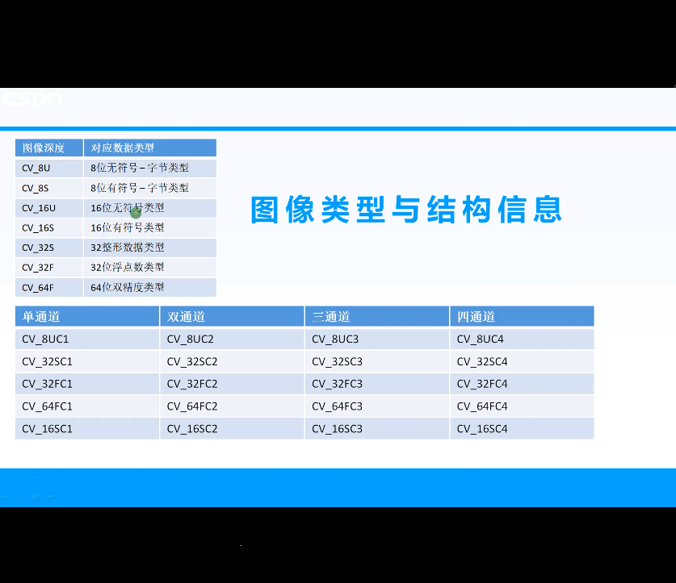

# 1.opencv基础
## 1-1.加载修改和保存图像

1. imread
   1. 功能：加载图像文件，使得图像文件成为一个mat对象，其中第一个参数为图像文件名称
   2. 第二参数表示加载的图像是什么文件类型，常见的有3个值
      1. imraed_unchanged(<0)表示加载原图，不做任何改变
      2. imread_grayscale(0)表示把原图作为灰度图像加载进来
      3. imread_color(>0)表示把原图作为rgb图像加载进来
   3. 注意：opencv支持jpg,png,tiff等常见文件
2. cv::namedWindos:功能是创建一个opencv窗口，由opencv自动创建和销毁
3. cv::cvtColor
   1. 把图像从一个彩色空间转换到另一个色彩空间，有3个参数
   2. 第一个参数表示源图像，第2个参数表示色彩空间转换后的图像，第2个参数表示源和目标色彩空间,如COLOR_BGR2HLS,COLOR_BGR2GRAY的等
   3. 例如:**cvtColor(image, gray_image, COLOR_BGR2GRAY);**
   4. COLOR_BGR2GRAY = 6彩色到灰度
   5. COLOR_GRAY2BGR = 8灰度到彩色
   6. COLOR_BGR2HSV = 40BGR到HSV
   7. COLOR_HSV2BGR = 54HSV到BGR
4. cv::imwrite
   1. 保存图像文件到指定目录路径
   2. 只有8位，16位的PNG，jpg,Tiff文格式而且是单通道或者3通道的BGR图像才能通过这种方式保存
   3. 保存png格式的时候可以保存透明通道的图片
   4. 可以指定压缩参数
5. 图像类型和结构信息
   1. CV_8U: 8位无符号字类型
   2. CV_8S: 8位有符号字类型
   3. CV_16U: 16位无符号字类型
   4. CV_16S: 8位有符号字类型
   5. CV_32S: 32位整形类型
   6. CV_32F: 8位浮点类型(float)
   7. CV_64F: 64位浮点类型
   8. 注意
      1. U-usigned char, C-channels, S-signed int， F-float
      2. CV_8U——0~255，205
      3. CV_8S——0~255，-51
      4. CV_32S——int型的范围，-842150451
      5. CV_32F——浮点型的范围，-431602080
6. 案例
```cpp
//demo01
#include <opencv2/opencv.hpp>
#include <iostream>
#include <math.h>
#include <opencv2/highgui/highgui_c.h>//主要解决CV_WINDOW_AUTOSIZE问题
using namespace cv;
using namespace std;
int main(){
    //1.加载图像
    Mat src = imread("/home/kim-james/ROS_Space/opencv_ws/opencv_tutorial_data/images/63_12_map.png");
    if (src.empty()){
        cout << "could not load image"<< endl;
    }
    namedWindow("opencv setup demo", CV_WINDOW_AUTOSIZE);//不要加CV
    imshow("opencv setup demo", src);
    //2.修改图像
    Mat outputImage;
    cvtColor(src, outputImage, CV_BGR2HLS);//把src通过CV_BGR2HLS转换成outputImage 
    namedWindow("output windows", CV_WINDOW_AUTOSIZE);
    imshow("output windows", src);
    
    //3.保存图像
    imwrite("/home/kim-james/ROS_Space/opencv_ws/ch2/picture/demo01.png", outputImage);
    //imwrite后要接xxxx.png
    waitKey(0);//无限等待
    return 0;
}
```
```cpp
//demo02
#include <iostream>
#include <opencv2/core/core.hpp>
#include <opencv2/highgui/highgui.hpp>
#include <opencv2/features2d/features2d.hpp>
using namespace std;
using namespace cv;
int main(){
    Mat src = imread("/home/kim-james/ROS_Space/opencv_ws/source/images/lena.png", IMREAD_COLOR);
    if (src.empty()){
        cout << "couldn't find the file" << endl;
    }
    namedWindow("002-demo", WINDOW_AUTOSIZE);
    imshow("002-demo", src);
    int width = src.cols;//宽 = 列
    int height = src.rows;//高 = 行
    int dim = src.channels();//维 = 通道
    int d = src.depth();//深度
    int t = src.type();//类型,该图像是CV_8UC3类型的
    if (t == CV_8UC3){
        printf("width:%d, heigh:%d, dim:%d, depth:%d, type:%d\n",
                width, height, dim, d, t);
    }
    waitKey(0);
    destroyAllWindows();

}
/**
 * @brief 
 * 1.width:512, heigh:512, dim:3, depth:0, type:16
 * 2.图像类型和结构信息
 * 3.
 * 
 */
```


## 1-2.图像的掩膜操作

1. 获取图像像素指针
   1. CV_Assert(myImage.depth() == CV_8U);
   2. Mat.ptr<uchar>(int i = 0)获取像素矩阵的指针，索引i表示第几行，从0开始计数
   3. 获得当前行的指针:const uchar* current = myImage.ptr<uchar>(row);
   4. 获取当前像素点P(row, col)的像素值p(row, col) = current[col],所以为const uchar* current = myImage.ptr<uchar>(row)[col];
2. 像素范围处理satuate_cast<uchar>
   1. saturate_cast<uchar>(-100):返回0
   2. saturate_cast<uchar>(288):返回255
   3. saturate_cast<uchar>(100):返回100
   4. 这个函数的功能是确保RGB值在范围0-225之间
3. 矩阵的掩膜操作
   1. $ I(i,j)=5∗I(i,j)−[I(i−1,j)+I(i+1,j)+I(i,j−1)+I(i,j+1)]$
4. 函数调用filter2D功能
   1. 定义掩膜: Mat kernel = (Mat_<char>(3, 3) << 0, -1, 0, -1, 5, -1, 0, -1, 0);
   2. filter2D(src, dst, src.depth(), kernel);其中src和dst是Mat,src.depth表示位图深度，有32， 24， 8
```cpp
#include <opencv2/opencv.hpp>
#include <iostream>
#include <math.h>
#include <opencv2/highgui/highgui.hpp>//主要解决CV_WINDOW_AUTOSIZE问题
using namespace cv;
using namespace std;

void sharpen(Mat &image)
{
	int rows = image.rows;
	int cols = image.cols;
	int channels = image.channels();//获取原图像通道数
	Mat dst;
	dst.create(image.size(),image.type());//创建一个和原图像大小和类型相同的输出对象
    //方法1.
	for (int i = 1; i < rows-1; i++)//由于像素的操作需要涉及到上下左右四个像素，所以边缘像素无法操作，所以就减去第一行和最后一行
	{
		const uchar* previous = image.ptr<const uchar>(i - 1);//上一行
		const uchar* current = image.ptr<const uchar>(i);//当前行
		const uchar* next = image.ptr<const uchar>(i + 1);//下一行
		uchar* output = dst.ptr<uchar>(i);//输出行
		for (int j = channels; j < (cols-1)*channels; j++)
		{
		    //锐化算子
			output[j] = saturate_cast<uchar>(5 * current[j] - current[j - channels] - current[j + channels] - previous[j] - next[j]); 
		}//指针可指向行，也可指向单个元素、
	}
    //方法2.
    // Mat kernel = (Mat_<char>(3, 3) << 0, -1, 0, -1, 5, -1, 0, -1, 0);
	// filter2D(image, dst, image.depth(), kernel);
    namedWindow("output picture", WINDOW_FREERATIO);
	imshow("output picture", dst);
}
int main()
{
	Mat image;
	Mat dst1;
	image = imread("/home/kim-james/ROS_Space/opencv_ws/source/images/lena.png");
	namedWindow("input picture", WINDOW_FREERATIO);
	imshow("input picture", image);
	
	sharpen(image);
	waitKey(0);
	return 0;

}

```
## 1-3.Mat对象构造和常用方法
1. 构造方法
   1. Mat()
   2. Mat(int rows, int cols, int type)
   3. Mat(Size size, int type)
   4. Mat(int rows, int cols, int type, const Scalar &s)
   5. Mat(Size size, int type, const Scalar &s)
   6. Mat(int ndims, const int *sizes, int type)
   7. Mat(int ndims, const int *sizes, int type, const Scalar &s) 
2. 常用方法
   1. void copyTo(Mat mat);
   2. void convertTo(Mat dst, int type);
   3. Mat clone();
   4. int channels();
   5. int depth();
   6. bool empty();
   7. uchar *ptr(i = 0);

```cpp
//demo01
#include <iostream>
#include <opencv2/core/core.hpp>
#include <opencv2/highgui/highgui.hpp>
#include <opencv2/features2d/features2d.hpp>
using namespace std;
using namespace cv;
int main(){
    Mat src = imread("/home/kim-james/ROS_Space/opencv_ws/source/images/lena.png", IMREAD_COLOR);
    if (src.empty()){
        cout << "couldn't find the file" << endl;
    }
    namedWindow("002-demo", WINDOW_AUTOSIZE);
    imshow("002-demo", src);
    int width = src.cols;//宽 = 列
    int height = src.rows;//高 = 行
    int dim = src.channels();//维 = 通道
    int d = src.depth();//深度
    int t = src.type();//类型,该图像是CV_8UC3类型的
    if (t == CV_8UC3){
        printf("width:%d, heigh:%d, dim:%d, depth:%d, type:%d\n",
                width, height, dim, d, t);
    }

    //1.方法1
    Mat t1 = Mat(256, 256, CV_8UC3);
    //参数1是宽， 参数2是高，参数3是3通道8字节的usigned char类型
    t1 = Scalar(0, 255, 255);//把t1矩阵中的值全部填上值为(0, 0, 255), (a, b, c) = (b, g, r)
    imshow("t1", t1);

    //2.方法2
    Mat t2 = Mat(Size(512, 512), CV_8UC3);
    t1 = Scalar(0, 0, 255);//black
    imshow("t2", t2);

    //3.方法3
    Mat t3 = Mat::zeros(Size(256, 256), CV_8UC3);//black
    // t3 = Scalar(0, 0, 0);
    //得到的是黑色图像，相当于为t3 = Scalar(0, 0, 0) = Scalar(255, 0, 255);
    imshow("t3", t3);

    //4.方法4,从图像创建
    Mat t4 = src;
    // t4 = Scalar(0, 255, 0);//因为t4 = src,若是t4变得话，t5也会变
    // 4-1.克隆方法1
    Mat t5 = src.clone();//将src克隆给t5
    // 4-2.克隆方法2
    src.copyTo(t5);//将src克隆给t5
    t5 = Scalar(0, 255, 0);//因为t5是由src克隆出来的，所以改变t5，不会改变t4和src
    imshow("t5", t5);
    imshow("t4", t4);

    // 4-3.克隆方法3
    Mat t6 = Mat::zeros(src.size(), src.type());
    imshow("t6", t6);//生成一个和原图大小和类型相同的图，但是这个图是黑色的，没有图像信息

    waitKey(0);
    destroyAllWindows();
}

/*
	Mat M(4,4,CV_32FC2,Scalar(1,3));//一般来说,2通道的mat,Scalar只要写2个数字,3通道及其以上的mat,scalar只要写3个数字
	cout<<M<<endl;
    1.创建一个2通道，且每个通道的值都为（1,3），深度为32，4行4列的图像矩阵。CV_32F表示每个元素的值的类型为32位浮点数，C2表示通道数为2，
    Scalar（1,3）表示对矩阵每个元素都赋值为（1,3），第一个通道中的值都是1，第二个通道中的值都是3.
    [1, 3, 1, 3, 1, 3, 1, 3;   
    1, 3, 1, 3, 1, 3, 1, 3;
    1, 3, 1, 3, 1, 3, 1, 3;
    1, 3, 1, 3, 1, 3, 1, 3]
    2.成为矩阵的时候先分配后赋值,比如说是,Mat(4, 4, 8UC3, Scalar(255, 255, 0)),则生成的矩阵为
    [255 255 0 255 255 0 255 255 0
     255 255 0 255 255 0 255 255 0
     255 255 0 255 255 0 255 255 0
     255 255 0 255 255 0 255 255 0]
*/
```


```cpp
//demo02
#include <opencv2/opencv.hpp>
#include <opencv2/highgui/highgui.hpp>
#include <iostream>

using namespace std;
using namespace cv;

int main(int argc, char** argv) {
	Mat src = imread("/home/kim-james/ROS_Space/opencv_ws/source/images/lena.png");
    if (src.empty()){
        cout << "could not load image..." << endl;
        return -1;
    }
    namedWindow("input", WINDOW_AUTOSIZE);
    imshow("input", src);
    //1.方法1.
    Mat dst;
    dst = Mat(src.size(), src.type());
    dst = Scalar(127, 0, 255);//bgr为127, 0, 255的图像
    namedWindow("output", WINDOW_AUTOSIZE);
    imshow("output", dst);
    // 2.方法2
    Mat dst;
    src.copyTo(dst);//把src赋值给dst
    namedWindow("output", WINDOW_AUTOSIZE);
    imshow("output", dst);
    // 3.方法3
    cvtColor(src, dst, COLOR_BGR2RGB);//
    cout << "input image channels = %d\n" << src.channels() << endl;
    cout << "output image channels = %d\n" << dst.channels() << endl;
    //4.方法4
    Mat m1(3, 3, CV_8UC3, Scalar(0, 0, 255)); 
    Mat m2(3, 3, CV_8UC3, Scalar(127)); 
    cout << "m1 =" << endl << m1 << endl;
    cout << "m2 =" << endl << m2 << endl;
    /*
    1.3通道的3x3的矩阵，所以是3x9的矩阵，每一行是(0, 0, 255)
    2.第三个参数是向量表示初始化每个像素值是多少，向量长度和对应通道数一致
    */
    //5.方法5
    Mat m3;
    m3.create(src.size(), src.type());
    namedWindow("output", WINDOW_AUTOSIZE);
    imshow("output", m3);
    //6.方法6
    Mat csrc = src;
    Mat kernel = (Mat_<char>(3, 3) << 0, -1, 0, -1, 5, -1, 0, -1, 0);
    filter2D(src, csrc, -1, kernel);
    Mat m4 = Mat::eye(2, 2, CV_8UC1);//2x2的单位8位usignedchar1通道的矩阵
    cout << "m4 = " << endl << m4 << endl;
    namedWindow("output", WINDOW_AUTOSIZE);
    imshow("output", m4);
    waitKey(0);

}
```
```cpp
//输入输出流头文件
#include <iostream> 
//头文件  opencv.hpp中包含基本的头文件 （我们采用的OpenCV版本是 2.4.13.6）
#include <opencv2/opencv.hpp>  

//命名空间，指明在cv下的所有类名、参数名、函数名等能够在不加 cv::下就能够使用
using namespace cv;

int main() 
{

	//创建一个Mat类型对象 image (以下出现的"cv::",如果添加了 using namespace cv；就可以省略)
	cv::Mat srcImage;
	
	//通过绝对路径读取一副BGR彩色图像，参数1是图像的绝对路径(注意:路径可采用"\\"或"/" 不能使用windows文件夹路径的"\");
	srcImage = cv::imread("D:/MyImage.jpg");
	
	//先显示image这个图像 参数1是显示窗口名称,参数2是Mat类型的对象;
	cv::imshow("srcImage", srcImage);
	
	//创建一个Mat类型对象 dstImage，
	//且分配给他一个srcImage.rows行，srcImage.cols列的空间，
	//数据类型是CV_8UC3，即3通道（C3）8bit的无符号整型（8U，uchar）
	//且将所有元素内所有通道值置0，Scalar::all(0)，这里修改"0"位置的值可得到你想要的值得矩阵
	//你也可以使用zeros函数达到全赋值为0效果;
	//cv::Mat dstImage = cv::Mat::zeros(srcImage.rows, srcImage.cols, CV_8UC3);
	//当然，因为我们之后要将srcImage给dstImage 所以此处直接使用 cv::Mat dstImage; 即可。
	cv::Mat dstImage(srcImage.rows,srcImage.cols,CV_8UC3,cv::Scalar::all(0));
	
	//将一个Mat A赋值给另一个Mat B，有四种方法
	//1.构造函数法         Mat A(B);
	//2.重载运算符法       A = B;
	//3.复制法            A.copyTo(B);
	//4.克隆法            B=A.clone();

	//这里需要知道一个Mat类的概念：
	//Mat 是一个类，由两个数据部分组成：矩阵头（包含矩阵尺寸，存储方法，存储地址等信息）
	//和一个指向存储所有像素值的矩阵（根据所选存储方法的不同矩阵可以是不同的维数）的指针。

	//方法1、2是浅拷贝（时间短，不安全），只拷贝矩阵头，不拷贝数据部分，A和B共用一块数据，A对元素的操作会影响B ；
	//方法3、4是深拷贝（时间长，相对安全），拷贝矩阵的所有数据，包括矩阵头，区别在于clone()会给目标矩阵重新分配新地址，
	//而copyTo()不会,copyTo()只是修改目标矩阵内的元素的值与当前矩阵值相同
	dstImage = srcImage.clone();
	
	//两层循环访问所有元素通道值，并将其中蓝色通道（B）减小一半，绿通道（G）值减小一半，红色通道（R）置255
	for (size_t i = 0; i < dstImage.rows; i++)
	{//外层循环行数
		for (size_t j = 0; j < dstImage.cols; j++)
		{//内层循环列数
		
			// 采用这种直观的方式，这种方法更安全不会有i,j溢出的危险，但是读取速度慢
			// 例如 图像为640x480分辨率，i，j取482、642改方法将会报错，但使用prt方法则一样会计算，不报错。
			//dstImage.at<cv::Vec3b>(i, j)[0] *= 0.5;
			//dstImage.at<cv::Vec3b>(i, j)[1] *= 0.5;
			//dstImage.at<cv::Vec3b>(i, j)[2] = 255;
			
			//ptr OpenCV中使用的智能指针，<>内是图像元素的类型 Vec3b 是一个包含三个uchar类型元素的一维数组
			//(i)[j][0]分别代表数据的行号、列号、和通道号,如果是单通道则(i)[j]即可，
			//由于opencv默认读取彩色图像是BGR，则0为蓝色、1为绿、2为红
			//uchar 能存储0~255的值 都为零则为黑色 都为255则为白色
			dstImage.ptr<cv::Vec3b>(i)[j][0] *= 0.5;
			dstImage.ptr<cv::Vec3b>(i)[j][1] *= 0.5;
			dstImage.ptr<cv::Vec3b>(i)[j][2] = 255;
		}
	}
	
	//创建一个名为dstImage的窗口用来显示图像，如果显示结束可通cv::destroyWindow("dstImage");进行指定销毁，
	//也可通过cv::destroyAllWindows();销毁存在的所有窗口。
	cv::namedWindow("dstImage");
	
	//显示结果图到名为dstImage的窗口中
	cv::imshow("dstImage", dstImage);

	//保存图像到某一地址，参数1.要保存的绝对路径和文件名，参数2.要保存的Mat图像
	cv::imwrite("D:/dstImage.jpg", dstImage);

	//延迟1ms秒时间等待键盘输入,如果参数为0则一直等待。在imshow之后，
	//如果没有waitKey语句则不会显示图像,若之后没有waitKey()则显示窗口将在1ms后关闭。
	cv::waitKey(1);	

	//创建一个矩阵
	cv::Mat rotationMatrix;
	
	//给矩阵赋值，矩阵行列很小时，用这种方法直观、方便
	rotationMatrix = ( cv::Mat_<double>(3, 3) <<
						1.0, 2.0, 3.0,
						0.0, 1.0, 0.0,
						0.0, 0.0, 1.0);
						
	//如果是全零矩阵，可以如下进行初始化 当然 行、列和数据类型自己选择
	cv::Mat A = cv::Mat::zeros(3, 3, CV_64F);
	//如果是全一矩阵，可以如下进行初始化 当然 行、列和数据类型自己选择
	cv::Mat B = cv::Mat::ones(3, 3, CV_64F);
	//如果是单位矩阵，可以如下进行初始化 当然 行、列和数据类型自己选择
	cv::Mat C = cv::Mat::eye(3, 3, CV_64F);

	A = B + C; //加法
	A = B - C; //减法
	A = B * C; //矩阵乘法  必须满足矩阵相乘的行列数对应规则
	A = 5 * B; //标量乘法 每个元素扩大5倍
	A = B.t(); //B转置
	A = B.inv(); //B逆矩阵

	//以上是最基本的操作，矩阵运算远远不是这几种，Mat包含了几乎所有的操作，用到的时候再查吧
	
	//如果包含了c++输入输出流的头文件 #include <iostream> 那么Mat可输出至屏幕通过
	std::cout<<" A is : "<< A <<std::endl;
	
	//一直等待，以显示图像窗口
	cv::waitKey(0);
	cv::destroyAllWindows();	
	return 1;
}
```

## 1-4图像的遍历方法
```cpp
#include <../include/quickopencv.h>
#include <opencv2/opencv.hpp>
#include <map>
#include <iostream>
using namespace cv;
using namespace std;
//1.使用数组
void test01(){
    // 9 % 3 = 0, 3 % 9  = 3;取模运算 = a/b后的余数
    Mat grayImage(5, 5, CV_8UC1);       //创建一个大小为600x800的单通道灰度图
    Mat colorImage(3, 3, CV_8UC3);      //创建一个大小为600x800的三通道彩色图

    //1.单通道遍历所有像素并设置像素值
    for(int i = 0; i < grayImage.rows; ++i)         //遍历行
        for(int j = 0; j < grayImage.cols; ++j)     //遍历列
            grayImage.at<uchar>(i, j) = (i + j) % 255;

    //2.3通道遍历所有像素并设置像素值
    for(int i = 0; i < colorImage.rows; ++i)         //遍历行
        for(int j = 0; j < colorImage.cols; ++j)     //遍历列
        {
            Vec3b pixel;            //定义三通道像素值变量
            pixel[0] = i % 255;     //Blue
            pixel[1] = j % 255;     //Green
            pixel[2] = (i + j) % 255;           //Red

            colorImage.at<Vec3b>(i, j) = pixel;
        }

    //显示简历图像的结果
    namedWindow("grayImage", WINDOW_AUTOSIZE);
    imshow("grayImage", grayImage);

    namedWindow("colorImage", WINDOW_AUTOSIZE);
    imshow("colorImage", colorImage);
    cout << "M(grayImage) = \n " <<  grayImage << endl;
    cout << "M(colorImage) = \n " << colorImage << endl;
    waitKey(0);

}
//2.使用迭代器
void test02(){
    Mat grayImage(400, 600, CV_8UC1);       //创建一个大小为600x800的单通道灰度图
    Mat colorImage(400, 600, CV_8UC3);      //创建一个大小为600x800的三通道彩色图

    //1.单通道遍历所有像素并设置像素值
    MatIterator_<uchar> grayit, grayend;
    for(grayit = grayImage.begin<uchar>(), grayend = grayImage.end<uchar>(); grayit != grayend; ++grayit)
        *grayit = rand() % 255;

    //2.3通道遍历所有像素并设置像素值
    MatIterator_<Vec3b> colorit, colorend;
    for(colorit = colorImage.begin<Vec3b>(), colorend = colorImage.end<Vec3b>(); colorit != colorend; ++colorit)
    {
        (*colorit)[0] = rand() % 255;       //Blue
        (*colorit)[1] = rand() % 255;       //Green
        (*colorit)[2] = rand() % 255;       //Red
    }


    //显示简历图像的结果
    namedWindow("grayImage", WINDOW_AUTOSIZE);
    imshow("grayImage", grayImage);

    namedWindow("colorImage", WINDOW_AUTOSIZE);
    imshow("colorImage", colorImage);

    waitKey(0);
}
//通过指针遍历
void test03(){
    Mat grayImage(5, 5, CV_8UC1);       //创建一个大小为600x800的单通道灰度图
    Mat colorImage(3, 3, CV_8UC3);      //创建一个大小为600x800的三通道彩色图

    //1.单通道遍历所有像素并设置像素值
    for(int i = 0; i < grayImage.rows; ++i)
    {
        uchar* p = grayImage.ptr<uchar>(i);     //获取第i行第一个像素的指针
        for(int j = 0; j < grayImage.cols; ++j)
            p[j] = (i + j) % 255;               //对每个i行的所有像素进行赋值操作
    }

    //2.3通道遍历所有像素并设置像素值

    for(int i = 0; i < colorImage.rows; ++i)
    {
        Vec3b* p = colorImage.ptr<Vec3b>(i);
        for(int j = 0; j < colorImage.cols; ++j)
        {
            p[j][0] = i % 255;      //Blue
            p[j][1] = j % 255;      //Gree
            p[j][2] = (i + j) % 255;//Red
        }
    }

    //显示简历图像的结果
    namedWindow("grayImage", WINDOW_AUTOSIZE);
    imshow("grayImage", grayImage);

    namedWindow("colorImage", WINDOW_AUTOSIZE);
    imshow("colorImage", colorImage);
    cout << "M(grayImage) = \n " <<  grayImage << endl;
    cout << "M(colorImage) = \n " << colorImage << endl;
    waitKey(0);//waitKey(0)表示用户无限等待
}
int main()
{
    // test01();
    // test02();
    test03();
}


```

## 1-10.opencv基础
1. Mat基本结构
   1. header:头部|数据部分
   2. 赋值，克隆，拷贝
2. 创建方法
   1. m1.copyTo(m2)
   2. m1 = m2
   3. m1 = Scalar(255 0 0)
3. Vec3b:
   1. 可以看做vector<uchar, 3>,即一个uchar类型，长度为3个vector
   2. color[0] = 255 (0, 1, 2分别代表BGR通道)
   3. 读取像素:
      1. imread读取到的Mat图像，都是用uchar类型存储,对于RGB三通道，每个点都是Vec3b
      2. >Mat mat = imread("test.jpg");
      3. mat.at<Vec3b>(row, col)[0] = 255;修改(row, col)的B通道，[1], [2]同理
      4. ```mat.at<uchar>(row, col):单通道，返回uchar类型; mat.ar<Vec4b>(row, col):4通道，返回<Vec4b>,返回一个uchar数组，长度为4``
4. 图像遍历的方法
```cpp
#include <../include/quickopencv.h>
#include <opencv2/opencv.hpp>
#include <map>
#include <iostream>
using namespace cv;
using namespace std;
//1.使用数组
void test01(){
    // 9 % 3 = 0, 3 % 9  = 3;取模运算 = a/b后的余数
    Mat grayImage(5, 5, CV_8UC1);       //创建一个大小为600x800的单通道灰度图
    Mat colorImage(3, 3, CV_8UC3);      //创建一个大小为600x800的三通道彩色图

    //1.单通道遍历所有像素并设置像素值
    for(int i = 0; i < grayImage.rows; ++i)         //遍历行
        for(int j = 0; j < grayImage.cols; ++j)     //遍历列
            grayImage.at<uchar>(i, j) = (i + j) % 255;

    //2.3通道遍历所有像素并设置像素值
    for(int i = 0; i < colorImage.rows; ++i)         //遍历行
        for(int j = 0; j < colorImage.cols; ++j)     //遍历列
        {
            Vec3b pixel;            //定义三通道像素值变量
            pixel[0] = i % 255;     //Blue
            pixel[1] = j % 255;     //Green
            pixel[2] = (i + j) % 255;           //Red

            colorImage.at<Vec3b>(i, j) = pixel;
        }

    //显示简历图像的结果
    namedWindow("grayImage", WINDOW_AUTOSIZE);
    imshow("grayImage", grayImage);

    namedWindow("colorImage", WINDOW_AUTOSIZE);
    imshow("colorImage", colorImage);
    cout << "M(grayImage) = \n " <<  grayImage << endl;
    cout << "M(colorImage) = \n " << colorImage << endl;
    waitKey(0);

}
//2.使用迭代器
void test02(){
    Mat grayImage(400, 600, CV_8UC1);       //创建一个大小为600x800的单通道灰度图
    Mat colorImage(400, 600, CV_8UC3);      //创建一个大小为600x800的三通道彩色图

    //1.单通道遍历所有像素并设置像素值
    MatIterator_<uchar> grayit, grayend;
    for(grayit = grayImage.begin<uchar>(), grayend = grayImage.end<uchar>(); grayit != grayend; ++grayit)
        *grayit = rand() % 255;

    //2.3通道遍历所有像素并设置像素值
    MatIterator_<Vec3b> colorit, colorend;
    for(colorit = colorImage.begin<Vec3b>(), colorend = colorImage.end<Vec3b>(); colorit != colorend; ++colorit)
    {
        (*colorit)[0] = rand() % 255;       //Blue
        (*colorit)[1] = rand() % 255;       //Green
        (*colorit)[2] = rand() % 255;       //Red
    }


    //显示简历图像的结果
    namedWindow("grayImage", WINDOW_AUTOSIZE);
    imshow("grayImage", grayImage);

    namedWindow("colorImage", WINDOW_AUTOSIZE);
    imshow("colorImage", colorImage);

    waitKey(0);
}
//通过指针遍历
void test03(){
    Mat grayImage(5, 5, CV_8UC1);       //创建一个大小为600x800的单通道灰度图
    Mat colorImage(3, 3, CV_8UC3);      //创建一个大小为600x800的三通道彩色图

    //1.单通道遍历所有像素并设置像素值
    for(int i = 0; i < grayImage.rows; ++i)
    {
        uchar* p = grayImage.ptr<uchar>(i);     //获取第i行第一个像素的指针
        for(int j = 0; j < grayImage.cols; ++j)
            p[j] = (i + j) % 255;               //对每个i行的所有像素进行赋值操作
    }

    //2.3通道遍历所有像素并设置像素值

    for(int i = 0; i < colorImage.rows; ++i)
    {
        Vec3b* p = colorImage.ptr<Vec3b>(i);
        for(int j = 0; j < colorImage.cols; ++j)
        {
            p[j][0] = i % 255;      //Blue
            p[j][1] = j % 255;      //Gree
            p[j][2] = (i + j) % 255;//Red
        }
    }

    //显示简历图像的结果
    namedWindow("grayImage", WINDOW_AUTOSIZE);
    imshow("grayImage", grayImage);

    namedWindow("colorImage", WINDOW_AUTOSIZE);
    imshow("colorImage", colorImage);
    cout << "M(grayImage) = \n " <<  grayImage << endl;
    cout << "M(colorImage) = \n " << colorImage << endl;
    waitKey(0);//waitKey(0)表示用户无限等待
}
int main()
{
    // test01();
    // test02();
    test03();
}
```
5. Vec3b案例
```cpp
#include <opencv2/opencv.hpp>
#include <iostream>
using namespace cv;
using namespace std;
int main()
{
    Mat m(3, 3, CV_8UC3);
    Vec3b vec;
    for (int row = 0; row < 3; row++){
        for (int col = 0; col < 3; col++){
            vec[0] = row;
            vec[1] = col;
            vec[2] = row + col;
            m.at<Vec3b>(row, col) = vec;
        }
    }
    cout << "M = " << endl << m << endl;
    Vec3b a = m.at<Vec3b>(2, 2);
    int b = m.at<Vec3b>(2, 2)[0];//
    cout << "M(2, 2) = " << a <<  endl;
    cout << "M(2, 2)[0] = " << b << endl;
}
```


# 2.补充知识
### 1.scalar
1. 例子1
```cpp
#include <iostream>
#include <opencv2/highgui/highgui.hpp>
#include <opencv2/core/core.hpp>
#include <opencv2/imgproc/imgproc.hpp>
#include <stdio.h>
using namespace std;
using namespace cv;
void scalar_demo1(){
	Mat M(4,4,CV_32FC2,Scalar(1,3));//一般来说,2通道的mat,Scalar只要写2个数字,3通道及其以上的mat,scalar只要写3个数字
	cout<<M<<endl;
    /*
    1.创建一个2通道，且每个通道的值都为（1,3），深度为32，4行4列的图像矩阵。CV_32F表示每个元素的值的类型为32位浮点数，C2表示通道数为2，
    Scalar（1,3）表示对矩阵每个元素都赋值为（1,3），第一个通道中的值都是1，第二个通道中的值都是3.
    2.成为矩阵的时候先分配后赋值,比如说是,Mat(4, 4, 8UC3, Scalar(255, 255, 0)),则生成的矩阵为
    [255 255 0 255 255 0 255 255 0
     255 255 0 255 255 0 255 255 0
     255 255 0 255 255 0 255 255 0
     255 255 0 255 255 0 255 255 0]
    */
}
void scalar_demo2(){
	Mat M(4,4,CV_32FC3,Scalar(1,2,3));
    //创建一个4x4的3通道的32位浮点数的矩阵,矩阵中的每一个元素赋值为(1,2,3),第一个通道中的值为1,第二个是2, 第三个是3
	cout<<M<<endl;
}
void scalar_demo3(){
	Mat M(4,4,CV_32FC4,Scalar(1,2,3));
	cout<<M<<endl;
}
void scalar_demo4(){
	Mat blue_m(256,256,CV_8UC3,Scalar(255,0,0));//BGR
    //生成1个256x256的3通道的usignedchar的矩阵,每个元素是(255,0,0)
	Mat green_m(256,256,CV_8UC3,Scalar(0,255,0));
	Mat red_m(256,256,CV_8UC3,Scalar(0,0,255));
	imshow("Blue",blue_m);
	waitKey(0);
	imshow("Green",green_m);
	waitKey(0);
	imshow("Red",red_m);
	waitKey(0);
	
}
int main(void)
{
	//resize_img();
	//convert_color_space();
	scalar_demo1();
	cout<<"**********************************"<<endl;
	scalar_demo2();
	cout<<"**********************************"<<endl;
	scalar_demo3();
	scalar_demo4();
	return 0;
}
/*
[1, 3, 1, 3, 1, 3, 1, 3;0   
 1, 3, 1, 3, 1, 3, 1, 3;
 1, 3, 1, 3, 1, 3, 1, 3;
 1, 3, 1, 3, 1, 3, 1, 3]
**********************************
[1, 2, 3, 1, 2, 3, 1, 2, 3, 1, 2, 3;
 1, 2, 3, 1, 2, 3, 1, 2, 3, 1, 2, 3;
 1, 2, 3, 1, 2, 3, 1, 2, 3, 1, 2, 3;
 1, 2, 3, 1, 2, 3, 1, 2, 3, 1, 2, 3]
**********************************
[1, 2, 3, 0, 1, 2, 3, 0, 1, 2, 3, 0, 1, 2, 3, 0;
 1, 2, 3, 0, 1, 2, 3, 0, 1, 2, 3, 0, 1, 2, 3, 0;
 1, 2, 3, 0, 1, 2, 3, 0, 1, 2, 3, 0, 1, 2, 3, 0;
 1, 2, 3, 0, 1, 2, 3, 0, 1, 2, 3, 0, 1, 2, 3, 0]
*/
```
