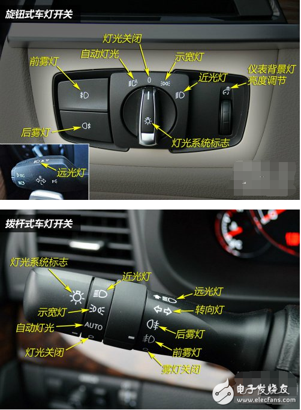

# 2.罚款
1. 20以上200以下
   1. 补证后继续使用原证
   2. 新手开车未贴实习标志
   3. 新手单独高速
   4. 未按规定申报信息
2. 200以上500以下
   1. 驾驶证被扣留期间使用隐藏欺骗手段补证，结果驾驶证被收回
   2. 身体不适合驾驶机动车依然驾驶，结果驾驶证被收回
   3. 不年检仍然驾驶机动车
3. 200以上2000以下
   1. 超速50%以上，结果吊销驾驶证
   2. 把机动驾驶证给无证者或者吊销的人开车
   3. 驾驶证被扣期间开机动车的**还有其他**，结果15日以下拘留
4. 审核
   1. 审验教育：代替：罚2000，组织：罚20000
   2. 有效期满，换证需检验；12分扣完，需要重考科目一
# 3.速度
1. 白色的是最低速度，红色的是最高速度，黑色的是建议速度
2. 高速公路的最高速度120，最低60
3. 3条车道，最左110， 中间90， 最右60(不低于110， 90，60)
4. 2条车道，最左100， 最右60
5. 无中心线，城市道路30， 公路40(**1.道路中间的黄线 2.道路两边是房子的是城市道路，道路两边是树木的是公路 3.口诀：城市道路和公路：3 4|5 7-无线，有线； 高速公路：11 9 6 | 1 6(12, 6)**)
6. 有中心线，城市道路50， 公路70(不低于70)
7. 其余的都不低于30
8. 不得超过30
   1. 掉头
   2. 转弯
   3. 下坡
   4. 冰雪天
   5. 窄路桥
9. 匝道限速30，高速路最低60(驶入高速路的过程：入口-匝道-加速道-正常道)
10. 车速和车距：>100km/h- >100m, <100km/h- >50m
11. 车速总结----*(11, 9, 6| 1, 6),(3, 4 | 5, 7),(261, 145, 520)*
# 4.能见度（高速路）
1. 能见度小于200， 车速不超过60，保持100m以上距离
2. 能见度小于100， 车速不超过40，保持50m以上距离，开双闪
3. 能见度小于50， 车速不超过20，尽快驶离高速公路，开双闪
4. 总结：2 1 5| 6 4 2 | 1 5 （除一半，减2）--->**261 145 520**

# 5.有效期
1. 机动车驾驶证有效期：6年，10年， 长期
2. 驾驶证过有效期前90天内可申请换证，超1年未换证注销，超1年不到2年重新考科目1恢复驾驶，超2年报驾校重考
# 6.判罚
1. 假1吊2撤3醉5逃终身

   假一：使用虚假材料报考驾驶证，一年内不得重新申请；

   吊二：被依法吊销驾驶证后，二年内不得重新申请；

   撤三：驾驶证被依法撤销后，三年内不得重新申请；

   醉五：醉驾驾驶被吊销驾照的，五年内不得重新申请，处拘役，罚金；(醉驾或饮酒驾驶发生重大交通事故的，终生不得申请驾驶证)

   逃终身：造成交通事故逃逸的，终身不得重新申请。

2. 3年延期，3个月换证，30天换信息或者驾驶证损毁无法辨认
3. 站3口5
4. *交通肇事罪*
   1. 醉驾/毒驾
   2. 无证驾驶(不属于未带驾驶证)
   3. 严重超载
   4. 车辆安全隐患
   5. 无牌车/报废车
   6. 肇事逃逸
   7. 记忆方法:我*吸毒醉酒*驾驶*无证*，*无牌*，*超载*的*破车*,*肇事*(3+3.我3条，车3条)
5. 危险驾驶罪
   1. 醉驾
   2. 追逐嬉戏
6. *扣留驾驶证*
   1. 饮酒/醉酒
   2. 车给*无驾照和被吊销，暂扣驾照*的人开
   3. 超速*50%*
   4. 开*报废车，拼装车*
   5. 发生重大交通事故*构成犯罪*
   6. 扣12
7. 重大交通事故
   1. 未逃逸，3年以下
   2. 逃逸,3-7
   3. 逃逸致死，7年以上
8. 驾驶证审核
   1. 违法行为
   2. 身体
   3. 满12分重考
# 7.扣分
1. 扣满12分要在15天内学7天科目一，20天内考试
2. 扣满24分，考完科目一后10天内考科目三
# 8.危险驾驶罪
1. 追逐竞速，严重超载，违反规定运输化学品
# 9.标志
1. 红色禁止(禁令)，黄色警告，蓝色指示（区分指路，指路有数字，指示无数字
2. 障碍物和施工图片

# 10.总结
1. 实线和虚线的问题
   1. 黄线用来区分不同方向的车道，一般画在马路正中，车道多的路面上就是双黄线，车道少的路面上则用单黄线。

      1. 无论单黄线还是双黄线，只要是实线，就严禁跨越的，比如超车、压线行驶、掉头等。

      2. 无论单黄线还是双黄线，只要是虚线，就可以在保证安全的情况下超车或掉头。  

      3. 单黄线一般用于双向4车道以内（包括自行车道）的道路上，双黄线一般用于较宽路面。  

      4. 如果双黄线，一条是实线，一条是虚线，虚线在哪一侧，那侧的车辆就可以从此临时跨越，比如超车或转弯。  

   2. 白线用来区分同方向的不同车道，大家都是一个方向。  
      1. 虚线是可以并线，调换车道  
      2. 实线是不可以并线，不能随意调换车道
2. 红绿灯光
3. 易错字眼
   1. 直接，就，立即，迅速，只需，选最远距离，加速，拘役直接选

   3. 掉头
      1. 人行横道不能掉头
      2. 实线不能掉头
   4. 变道
      1. 开转向灯
      2. 观察后方情况，确保有足够安全距离
   5. 会车问题
      1. 右让左，左让直，转弯让直
      2. 150m以外换远光灯为静光灯
   6. 减速：横向减速带，纵向减速带(车道变窄)
   7. 倒车
      1. 铁道
      2. 交叉路口
      3. 单行路
      4. 桥梁
      5. 急弯
      6. 陡坡
      7. 隧道
   8. 转弯：
      1. 只要没有箭头和其他禁止标志，一个红圈圈，就可以右转
      2. 
   9.  爆胎：不能紧急制动，轻踏制动踏板
   10. 凸起： 
4. 管制和拘役：管制在家里，拘役进局子
5. 科目1-4的全称呼
   1. 科目一考试内容包括驾车理论基础、道路安全法律法规、地方性法规等相关知识。
   2. 科目二又称小路考,即场地驾驶技能考试科目。
   3. 科目三也称大路考,为道路驾驶技能考试转向灯：上右下左：左转，手在下面。
   4. 科目四即安全文明驾驶常识考试。
6. 颠簸路面：低档 + 缓踩
7. 主路和辅路：主路只可机动车，
8. 干路和支路：干路先行
9.  交通事故私了：有伤亡有争议请交警，无伤亡无争议私了
10. 火车头：无人看守，栅栏:有人看守，一条杠：50m
11. 远近灯光：无红绿灯交叉路口，夜间弯路，坡路
    
12.标志
   1. 小型客车 = 轿车
   2. 下一出口， 右侧出口
   3. 
13. 刹车：紧急制动-翻车，连续制动-发热 
14. 逃逸
    1.  不跑3年以下，跑了3-7年，跑致死7年以上 
15. 准驾驶问题
    2. C1驾驶证可以驾驶的车型比较多，包括了C2、C3、C4驾驶证可以驾驶的准驾车型。C1驾驶证可以驾驶的车型主要为，小型、微型载客汽车以及轻型、微型载货汽车，以及轻型、微型专项作业车。C2驾驶证可以驾驶的车型和C1驾驶证驾驶的车型是相同的，只不过C2仅能驾驶自动挡车型，不可以驾驶手动挡车型，而C1驾驶证可以驾驶手动挡车型和自动挡车型。
15. 补证换证：去任意车管所
16. 车道：G S X Y(国，省，县，乡)
17. 放标志的位置：普通路：50-100m,高速：>150m
18. 实线为禁止标线，虚线为指示标线

# 11.停车
1. 高速公路不能停车休息，休息要到休息区
2. 路口不能停车
3. 路缘石：实线：禁止停车，虚线：禁止长时间停车
4. 发生故障不能移动，开启危险报警闪光灯，在车后50-100m设置警告牌子
5. 路口和黄色网格不能停车
6. 站3口5:站的30m,口：路口，弯路50m
7. *停车道*：
   1. 港湾式停车道：2边虚线，中间实线
   2. 错车道：无线
   3. 全虚线：应急车道
# 12. 超车和倒车
1. 超车：满足超车条件下，前方有车缓慢超车，无车快速超车，前车不让行就不超车
2. 不能超车情况
   1. 超车
   2. 左转
   3. 掉头
   4. 警车，消防，救护，救险车
3. 不能倒车情况（3+4）
   1. 铁路道口
   2. 交叉路口
   3. 单行路
   4.  桥梁
   5.  急弯
   6.  陡坡
   7.  隧道
# 12. 制动问题
紧急制动翻车，连续制动发热
# 13. 限速30
1. 掉头
2. 转弯
3. 下坡
4. 冰雪天
5. 窄路窄桥

# 14.公路
1. 一急二反3连续

# 13.扣分
1. 超重
   1. 1分：<30%, 
   2. 3分：30%<x<50%
   3. 6分：x>50%
   4. >(1, 3, 6)*
2. 超员
   1. 分类：
      1. 校车，公路客运汽车，旅游客运汽车 = a
      2. 7座以上客运汽车 = b
      3. 普通车 = c
   2. 3分
      1. 驾驶*c*：*20%<x<50%*
   3. 6分
      1. 驾驶*a* 载人超过核定人数 *<20%*(只要超就扣分6分)
      2. 驾驶*b* *20%<x<50%*
      3. 驾驶*其他载客汽车* *50%<x<100%*
   4. 9分
      1. 驾驶*b* *50%<x<100%*
   5. 12分
      1. 驾驶*a*载人超过核定人数 *>20%* (超员20%扣12分)
      2. 驾驶其他载客汽车>100%
   6. 总结：
      1. 驾驶*a*,超员<20%,扣*6*，超员>=20%,扣*12*
      2. 驾驶*b*,超员20%-50%,扣*6*，超员>=50%,扣*9*
      3. 驾驶*c*,超员20%-50%，扣*3*
      4. 最终记忆：**(6, 12 | 6, 9 | 3)**
3. 超速
   1. 道路：高速公路、城市快速路；高速公路、城市快速路以外
   2. 车型：驾驶校车、中型以上载客载货汽车、危险物品运输车辆(10-20-50) …（以外(普通车:20-50)）
   3. 不同车辆在普通路的超速(*这里的危险车物品车包括：校车，中型以上载客载货车，危险物品运输车*)
      1. 危险物品车在普通道路上10-20%，扣1分；
      2. 危险物品车在普通道路上20-50%，扣6分；
      3. 危险物品车在普通道路上>50%，扣9分
      
      4. 危险物品车以外在普通道路上20-50%，扣3分；
      5. 危险物品车以外在普通道路上>50%，扣6分
   4. 不同车辆在高速路的超速
      1. 危险物品车在高速道路上<20%，扣6分；
      2. 危险物品车在高速道路上>20%，扣12分；
      
      3. 危险物品车以外在高速道路上20-50%，扣6分；(20%以下不扣分)
      4. 危险物品车以外在高速道路上>50%，扣12分；
   
   5. 记忆方法：
      1. 普通车在普通路：20-50：3分(20-50)
      2. 普通车在普通路：>50：6分
      3. 普通车在高速路：20-50：6分(20-50)
      4. 普通车在高速路：>50：12分
      5. 最终记忆：*3， 6， 6， 12*
(**2+2**)
      
      1. 危险车在普通路：10-20：1分 (10-20-50)
      2. 危险车在普通路：20-50：6分
      3. 危险车在普通路：>50：9分
      4. 危险车在高速路：<20：6分 (20)
      5. 危险车在高速路：>20：12分
      6. 最终记忆：*1，6，9，6，12*(危险车在普通路上直接加*3*，高速路上2者相同) 
(**3+2**)

4. 未休息
   1. 3分：连续驾驶**载货**汽车超过4小时未停车休息或者停车休息时间少于20分钟的
   2. 9分：连续驾驶中型以上**载客**汽车、危险物品运输车辆超过4小时未停车休息或者停车休息时间少于20分钟的
   3. 记忆方法：载货扣3分，载人扣9分
5. 违规驾驶
   1. 1分
      1. 驾驶机动车不按规定**会车**，或者在高速公路、城市快速路以外的道路上不按规定**倒车、掉头的**k
      2. 驾驶擅自改变已登记的**结构、构造或者特征**的载货汽车上道路行驶的
      3. 驾驶机动车不按规定使用**灯光**的
      4. 驾驶机动车违反**禁令**标志、禁止标线指示的
      5. 驾驶未按规定定期进行**安全技术检验**的公路客运汽车、旅游客运汽车、危险物品运输车辆以外(**普通车**）的机动车上道路行驶的
   2. 3分(**先背诵1， 6， 9,最后再背诵3**)
      1. 驾驶机动车在高速公路或者城市快速路上不按规定**车道**行驶的(速度不达标)
      
      2. 驾驶机动车不按规定**超车、让行**，或者在高速公路、城市快速路以外的道路上**逆行**的
      
      3. 驾驶机动车遇前方机动车停车排队或者缓慢行驶时，**借道超车**或者**占用对面车道**、**穿插等候**车辆的
      
      4. 驾驶机动车不按规定**避让校车**的
      
      5. 驾驶机动车行经人行横道不按规定**减速、停车、避让行人**的
      
      6. 驾驶不按规定**安装机动车号牌**的机动车上道路行驶的(例如正常装车头车尾部，但实际上装在侧面)
      
      7. 在道路上车辆发生故障、事故停车后，不按规定使用**灯光或者设置警告标志**的(有扣**1分和扣3分**的情况，前者是雾灯和远光灯，后者是双闪)
      
      8. 驾驶未按规定定期进行**安全技术检验**的公路客运汽车、旅游客运汽车、危险物品运输车辆(**危险车**）上道路行驶的;
      
      9. 驾驶校车上道路行驶前，未对**校车**车况是否符合安全技术要求进行检查，或者驾驶存在安全隐患的校车上道路行驶的
   3. *6分*(5)
      1. 机动车驾驶证被*暂扣或者扣留*期间驾驶机动车的(无证驾驶)
      
      2. 造成致人**轻微伤**或者财产损失的交通事故后**逃逸**，尚不构成犯罪的;
      
      3. 驾驶机动车载运爆炸物品、易燃易爆化学物品以及剧毒、放射性等危险物品，未按指定的时间、路线、速度行驶或者未悬挂**警示标志**并采取必要的安全措施的
      
      4. 驾驶机动车运载超限的不可解体的物品，未按指定的时间、路线、速度行驶或者未悬挂**警示标志**的
      
      5. 驾驶机动车*运输危险化学品*，未经批准进入危险化学品运输车辆限制通行的区域的;
      (**3-5都是危险车辆的**)
      6. 驾驶机动车不按**交通信号灯**指示通行的
     
      7. 驾驶机动车在高速公路或者城市快速路上**违法占用应急车道行驶**的。
      8. 记忆方法：我*无证*驾驶*未贴警示标志的危险车*在*应急通道上*，*闯红灯*，*致人轻伤后逃逸*
   4. **9分**(4)
      1. 驾驶机动车在**高速公路**或者**城市快速路**上**违法停车**的

      2. 驾驶**未悬挂**机动车号牌或者**故意遮挡**、污损机动车号牌的机动车上道路行驶的
      
      3. 驾驶与准驾车型**不符**的机动车的
      
      4. 未取得校车驾驶资格驾驶**校车**的
      
      5. 记忆方法：**我**(未准驾)驾驶着未悬挂**车牌**的**校车**在高速路上停**车**
   
   5. **12分**(5)
      1. 造成致人**轻伤以上**或者**死亡**的交通事故后**逃逸**，尚不松成犯罪的(*逃逸未犯罪：轻伤以上，死亡扣12；轻伤扣6*)
      
      2. 使用**伪造**、变造的*机动车号牌*、*行驶证*、*驾驶证*、校车标牌或者使用*其他机动车号牌、行驶证*的
      
      3. **代替实际机动车驾驶人接受交通违法行为处罚和记分牟取经济利益的**。
      
      4. 驾驶机动车在**高速公路、城市快速路**上**倒车、逆行、穿越中央分隔带**掉头的
      
      5. **饮酒**后驾驶机动车的
      6. 记忆方法：我**酒后驾驶** **伪造车牌**的车在高速路上边*倒车，掉头，逆行*，边**代替计分**，撞人**致人死亡后逃逸**
6. 安全驾驶
   1. 1分
      1. 驾驶机动车在道路上行驶时，机动车驾驶人未按规定**系安全带**的
      2. 驾驶摩托车，不戴**安全头盔**的
   2. 3分
      1. 驾驶机动车有**拨打、接听手持电话**等妨碍安全驾驶的行为的
7. 罚款
   1. 2000-5000：
      1. 伪造，变造，或者使用**伪造，变造**的*机动车登记证书，号牌，行驶证，驾驶证*的，*扣留该机动车*，处*15日以下拘留*，并处*罚金*
   2. 20-200
      1. 机动车驾驶人补换领机动车驾驶证后，继续使用原机动车驾驶证的(有老婆了还找前妻)
   3. 200-2000
      1. 超速50%
      2. 醉酒驾驶
      3. 将车交给被驾驶证吊销人员
      4. 驾驶**拼装车和报废车**（扣留驾驶证）
   4. 20000
      1. 组织、参与、经济利益】处违法所得3倍以上，5倍以下罚款，最高不得超过10万
8. 酒后驾车
   1. 处暂扣**六个月机动车驾驶证**，并处一千元以上二千元以下罚款。(除了1之外，剩下的都是拘留和吊销)
   2. 因**饮酒**后驾驶机动车被处罚，**再次**饮酒后驾驶机动车的，处十日以下*拘留*，并处*一千元以上二千元*以下罚款，**吊销机动车驾驶证**。
   3. **醉酒**驾驶机动车的，由公安机关交通管理部门约束至酒醒，**吊销机动车驾驶证**，依法追究刑事责任，**五年内**不得重新取得机动车驾驶证(1-3是机动车，4-5是运营机动车的)
    
   4. **饮酒后**驾驶营运机动车(货车)的，处**十五日**拘留，并处**五千元**罚款，**吊销机动车驾驶**证，**五年内**不得重新取得机动车驾驶证。
   5. **醉酒**驾驶营运机动车的，由公安机关交通管理部门约束至酒醒，**吊销机动车驾驶证**，依法追究刑事责任;**十年内**不得重新取得机动车驾驶证，重新取得机动车驾驶证后，**不得驾驶营运机动车**。
   
   6. **饮酒后或者醉酒**驾驶机动车发生**重大交通事故**，构成犯罪的，依法**追究刑事责任**，并由公安机关交通管理部门**吊销机动车驾驶证**，**终生**不得重新取得机动车驾驶证。
   7. 总结：饮酒：罚款，暂扣驾驶证；再饮酒，10日以下拘留，罚款，吊销驾驶证；醉驾：约束醒酒，吊销驾驶证，5年内不得考驾驶证

9.  不得申请驾驶证

    1. 有**器质性心脏病**、癫痫病、美尼尔氏症、眩晕症、癔病、震颤麻痹、精神病、痴呆以及影响肢体活动的神经系统疾病等妨碍安全驾驶疾病的
    2. **三年内**有吸食、注射毒品行为或者解除强制隔离戒毒措施**未满三年**，以及长期服用依赖性精神药品成瘾尚未戒除的
    3. 造成交通事故后**逃逸构成犯罪**的;
    4. **饮酒后或者醉酒**驾驶机动车发生重大交通事故**构成犯罪**的
    5. 醉酒驾驶机动车或者饮酒后驾驶营运机动车依法**被吊销机动车驾驶证未满五年**的
    6. 醉酒驾驶营运机动车依法被吊销机动车驾驶证未满十年的
    7. 驾驶机动车追逐竞驶、超员、超速、违反危险化学品安全管理规定运输危险化学品构成犯罪依法**被吊销机动车驾驶证未满五年**的
    8. 因本款第四项以外的其他违反交通管理法律法规的行为发生重大交通事故构成犯罪依法被吊销机动车驾驶证未满十年的
    9. 因**其他情形**依法被吊销机动车驾驶证**未满二年**的
    10. 驾驶许可依法被**撤销未满三年**的
    11. 未取得机动车驾驶证驾驶机动车，发生同等以上责任交通事故造成人员重伤或者死亡未满十年的
    12. **三年内有代替他人参加机动车驾驶人考试行为**的

    13. 记忆方法：**被撤销、吸毒、替考3年；追逐、饮酒开营运车5年，醉驾营运车10年，无证车祸10年；**

# 11.変更登记 
1. 改变车身**颜色**的;
2. 更换*发动机*的；
3. 更换*车身或者车架*的；
4. 因质量问题更换*整车*的；
5. 机动车*登记*的使用性质改变的；
6. 机动车所有人的*住所迁出*、*迁入*本市*车辆管理所*管辖区域的；
6. 运营车<->*非运营车*。
7. 记忆方法：**颜色，车身，发动机，整车，住所迁出迁入，运营和非运营**(4 + 2 = 6)
# 12. 准驾驶
1. A1驾驶证，准驾车型为*大型客车*，可以开大型载客汽车和A3、B1、B2、C1、C2、C3、C4类车型；
2. A2驾驶证，准驾车型为*牵引车*，可以开重型、中型全挂、半挂汽车列车和B1、B2、C1、C2、C3、C4类车型；
3. A3驾驶证，准驾车型为*城市公交车*，可以开核载10人以上的城市公共汽车和C1、C2、C3、C4类车型；
4. B1驾驶证，准驾车型为*中型客车*，可以开中型载客汽车（含核载10人以上、19人以下的城市公共汽车）和 C1、C2、C3、C4类车型；
5. B2驾驶证，准驾车型为*大型货车*，可以开重型、中型载货汽车；大、重、中型专项作业车和C1、C2、C3、C4类车型；
6. C1驾驶证，准驾车型为*小型汽车*，可以开*小型、微型载客汽车*以及*轻型、微型载货汽车*、*轻、小、微型专项作业车*和*C2、C3、C4*类车型；
7. C2驾驶证，准驾车型为*小型自动挡汽车*，可以开*小型、微型自动挡载客汽车*以及*轻型、微型**自动挡**载货汽车*；
8. C3驾驶证，准驾车型为*低速载货汽车*，可以开*低速载货汽车*（原四轮农用运输车）和*C4类*车型；
9. C4驾驶证，准驾车型为*三轮汽车*，可以开*三轮汽车*（原三轮农用运输车）。
10. D驾驶证，准驾车型为*三轮摩托车*，可以开 发动机排量大于50ml或者最大设计车速大于50km/h的*三轮摩托车* 和*E、F* 车型
11. E驾驶证，准驾车型为*二轮摩托车*，可以开 发动机排量大于50ml或者最大设计车速大于50km/h的*二轮摩托车*和 *F 车型*
12. F驾驶证，准驾车型为*轻便摩托车*,可以开 发动机排量小于等于50ml，最大设计车速小于等于50km/h的*摩托车*
13. M驾驶证，准驾车型为*轮式自行机械车*，可以开 *轮式自行机械车*
# 13.高速路上：
1. *低3占6停9逆12*
2. 跟车距离：车速100以上，车距>100；车速100以下，车距>50
3. 驶入匝道，将车速降到规定车速以下，驶入加速道加速，最后再进入行驶道
4. 打左转向灯
5. 结构：左边：超车道，中间：主干道；右边：应急车道；右边路肩：紧急停车带
6. 高速路上车辆发生故障，车上人员未及时转移到右侧路肩的，罚50
7. *车距总结*：
   1. 跟车距离：车速100以上，车距>100；车速100以下，车距>50
   2. 放牌子距离:>150m设置警告牌子
   
# 14.驾驶证有效期：
1. 6，10，永久
2. 信息变动30天，有效期满90天
3. 学法减分，一个周期减少6分
# 15.标志：
1. 标志牌：红-禁止；黄-警告；蓝-指示
2. 高速：黄色数字-最高速度；白色数字-最低速度；黑色数字-建议速度
3. 停车，喝水：停车区；停车，喝水，加油，吃饭：服务区；**只有停车**:停车场
4. 交叉路口：
   1. 环形
   2. 十字
   3. 互通式
   4. Y型
5. 指示和指路：指示没有*数字，文字，距离*
6. 限高和限宽
# 16.审查问题：
1. A1，A2，A3，B1，B2年年审检，提交身体证明
# 17.环岛问题：
1. 逆时针：驶离开右
2. 先出后进，否则负全则
# 18.虚线问题：
1. 实线禁止，虚线指示，不管颜色
# 19.车俩故障问题：
1. 开灯
2. 放牌(50-100, >150)
# 20.转弯：
1急2转3连续
# 21.车道
1. 两边虚线中间实线的是港湾式车道
2. 全虚线的是应急车道
3. 无线的是错车道
# 22.Y型路口
1. 有箭头是仅仅可以左右转弯
2. 无箭头是Y型路口
# 23.证件问题
1. 跟机动车有关的证件(登记证书，号牌， 行驶证的*补证，换证*)必须到*登记地车管所*
2. 申请C1C2的年龄：>=18
# 24.会车问题
1. 转弯让直行
2. 右方道路来车先行(2边都是直行)
3. 右转弯让左转弯 

# 26.拘留和扣留的问题
1. 扣留：可以是人或车，拘留只能是人
2. 交警只有权扣车，扣证，但是**无权**拘留人
# 27.让行线
1. 双实线：停车让行线
2. 单实线：停车线
3. 虚线：减速让行
# 28. 开灯问题
1. 夜间无路灯-远光灯
2. 夜间近距离会车-近光灯
3. 夜间窄桥与非机动车会会车-近光灯
4. 夜间机动车会车-近光灯(在150m外关闭远光灯)
5. 夜间难以移动-示阔灯+双跳灯
6. 雾天行驶-示阔灯+双跳灯+雾灯
7. 夜间通过急转弯+拱桥+人行横道+无交通灯路口-交替使用远近光灯
8. 隧道：近光灯+示廓灯
# 28. 车内开关问题
    1. 雾灯+杠
    2. 燃油 
    3. 故障，制动-！，P
    4. 弧形前窗，正方形后窗，箭头：雨刮器，喷泉：洗涤剂
    5. 除霜器：三弯箭头
    6. 速度/里程表和转速表
    7. 离 制 加(你治家)---变 速器
    8. 左灯右水

# 29. 合格问题
1. 科目一：90
1. 科目二：80
1. 科目三：90
# 30. 撤离问题
1. 应该自行撤离未撤离：责令当事人离开现场；若造成了堵塞，则罚款200
# 31. 交警手势问题
1. 单手指挥
   1. 停止：左手举过头顶
   2. 减速慢行：右手上下摆动
   3. 变道：右手左右摆动
   4. 左转弯待转和右转弯待转
2. 双手指挥
   1. 左转弯：右手抬到头以下，左手前后摆动
   2. 右转弯
   3. 直行
   4. 靠边停车：左手抬到头以上，右手左右摆动

# 32.科目四
## 1.动画题
1. 有3个是3种违法行为，剩下都是2种违法
   1. 大哥拿着大哥大喝酒的
   2. 红色车的
   3. 大哥开黄车走应急车道的
2. 违法行为
   1. 速度找速度问题
   2. 大于核载人数就超员，货车载人的
   3. 连续疲劳驾驶找疲劳的
   4. 灯光找灯光
   5. 对面会车找会车问题
   6. 有A2就找不符
   7. 有中型客车就找超员的
   8. 驾驶人危害不找乘车人
   9. 超速危害都全选
3. 安全行车常识
   1. 起步进入驾驶室观察周围找近光灯
   2. 轮胎问题找气压，引起爆胎
   3. 不系安全带就错，安全带找减轻程度；ABS防抱死找 *转向/紧急制动/用力*
   4. 尽快，迅速通过xxx，绝大多数是错的;缓慢，平稳，缓缓这种意思是对的
   5. 安全头枕保护颈部，支撑头部位置
   6. 看图片技巧，注意什么车什么人的，看左边有车注意左边，右边有车注意右边，有停车*优先考虑停车*，再次考虑*减速慢行*
   7. 答题技巧
      1. 减速靠右/减速慢行/减速或停车/减速避让/注意观察提前减速/谨慎/确认安全/注意让行人注意避让/保持安全距离，安全间距/降低车速，看到就对。
      2. 开车走路都靠右边，说左侧中心都是错
   8. 汇入合流或者变道都是提前打转向灯，观察确认安全不影响别人，再*缓慢变*
   9. 跨实线越实线就错，越虚线就对。技巧就是箭头压实线还是虚线
   10. 有障碍的让无障碍的一方先走，*下坡让上坡*，环岛外让环岛内先走
   11. *加速行驶，占道，借道，抢，越实线，高档位，高速，滑行，保持xxx,告知别人让行的，连续长按高频率喇叭，只需，无需，急转方向盘*都是错的
   12. 主动/放弃超车/停车让/停止超车，都对;临时停车找危险报警闪光
   13. 夜间特殊道路上找双闪，有车/人/照明条件良好，隧道都只能用近光灯
   14. 左转转大弯，右转转小弯，
   15. 道口后减速错，道口前减速对；看到人一定先停车，迅速停车都对，反之有人必须这样
   16. 绕的都错(*行人前，后绕*)，紧跟其后的错;轮胎有问题换胎;发动机水温表
   17. 四个确认，四个大货车的全选;白天实景图的判断都对，白天实景图的多选*全选*，**实景图是手机拍的白天的照片**
   18. 特殊道路不能停车/倒车/超车
   19. *利用发动机*直接选;*最大安全*直接选，玻璃前*扇形*后*长方形*
   20. 倒车转向盘和方向一致的，30cm临时停路边距离马路
   21. ABS用力踩不能松
   22. 故障4步
       1.  开危险报警闪光灯
       2.  移动不妨碍的地方
       3.  车后放警报装置(普通路50-100;高速>150)
       4.  人下车右侧报警等救援
   23. 隧道开近光灯，一般没有特殊情况都开近光灯，判断题中有**可以不**三个字的几乎错
   24. 只需，迫使，逼迫，占道，抢字，无需，不必减速都是错的
   25. 看到*挂低速挡*选对，*减速减速*对，*高档位高速行驶*不对
   26. 灯光左进右出;环岛进不需要开灯，出环岛右灯
   27. 检查机油一定在启动前在平稳的地方检查;刮水器找有水的地方测
   28. *观察确认安全*一般是对的，不观察直接驶入是错的
   29. 特殊道路都不能停车，倒车，逆行，超车
   30. 顺序通行原则:转弯让直行，右转让左转，同直行让右方行
   31. *白天实景图的判断题都对，多选题全选*

3. 图片题
   1. 交警手势
      1. 手心对我，停车
      2. 一高一低找转弯，哪只手在下面就哪只手的转弯(**左手在下左转，右手在下右转**)
      3. 警察不动直行，警察两只手在一条线上是直行
      4. 三只手旁边伸的为待转(无影手)
      5. 三只手冲着你一高一低找慢
4. 驾驶文明技巧
   1. 有人停车礼让为主
   2. 校车，有1条或者2条道停车，有3条道提前变到最左侧超越
   3. 随时避让，注意避让，减速靠右，减速停车，保持间距，保持安全距离是对的
   4. 对动物，驱赶，连续鸣喇叭，伺机逼迫，迫使都是错的
   5. 4个下坡多选题找2个重力
   6. 下长坡制动找效能问题
5. 恶劣天气和道路驾驶常识
## 2.总结
1. 灯光题
   1. 由远至近
      1. 进入弯道
      2. 到达坡底的低谷地段
      3. 驶入上坡路
   2. 由近至远
      1. 弯道变直道
      2. 进入下坡道
      <!-- 3. 缓下坡变为陡下坡
      4. 由下坡道驶入平路 -->
   3. 离开路面
      1. 急转弯
      2. 路面有坑
      3. 到达坡顶
   4. 灯光由路中间移向路侧
      1. 连续弯道
2. 制动
   1. 发动机制动：换挡
   2. 行车制动：脚刹
   3. 驻车制动：手刹
3. 转弯:直行->左转->右转
4. 高速公路：机动车因故障暂时不能离开应急车道或者路肩时，驾乘人员要在路边等候，但不得离开高速路
5. 立交桥转向原则
   1. 右转时，过桥前右转
   2. 左转时，过桥后右转，沿着辅路驶出进入左转车道
6. 酒驾问题
   1. 血液中酒精含量＜２０ｍｇ／１００ｍｌ，不构成饮酒驾车行为（不违法）；
   2. 血液中酒精含量≥２０ｍｇ／１００ｍｌ，为酒后驾驶,[20,80)
   3. 血液中酒精含量≥８０ｍｇ／１００ｍｌ，为醉酒驾驶,
7. 动画的违法行为
   1. 1, 2, 3, 7, 8选2种
   2. 4, 5, 6选3种
   3. 罗超速，徐超员，周货客
   4. 实景图全选
8. 踩刹车
   1. 雨天不能紧急制动
   2. 雪天偏移不能踩刹车
   3. 水滑
   4. 泥泞道路，跟车全选
9. 爆胎
   1.  前轮爆胎：稳住方向盘，挂抵挡
   2.  后轮爆胎：稳住方向盘，缓踩刹车
   3.  高速爆胎：稳住方向盘，松开加速踏板，缓踩刹车
10. 碰撞围栏
    1.  握紧方向盘，适量修正
    2.  不要紧急制动，猛转方向盘
11. 方向盘
    1.  前反后同，侧滑选侧滑方向